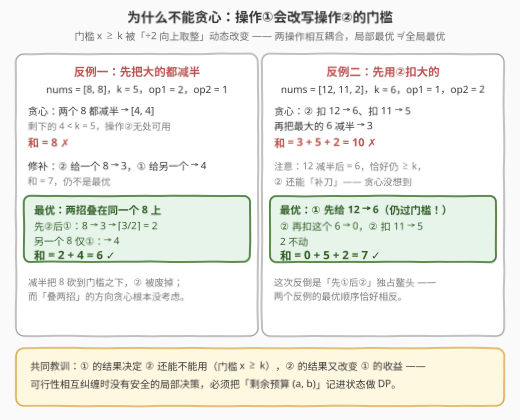
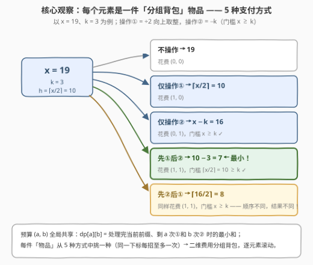
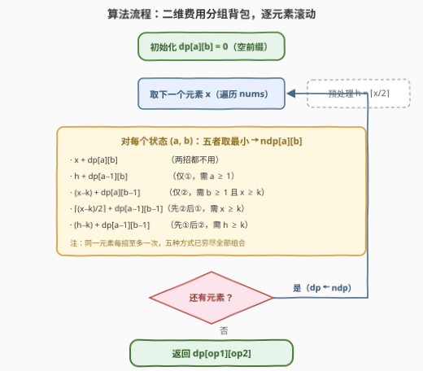
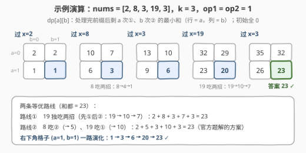

# LeetCode 最小数组和 题解

- **关联**：与 [474. 一和零](https://leetcode.cn/problems/ones-and-zeroes/)（[站内题解](../0401-0500/474_一和零.md)）同为「二维费用背包」——预算从「0 的个数、1 的个数」换成「操作① 的次数、操作② 的次数」，套路一模一样

## 1. 题目概述

- **标题 / 题号**：最小数组和（#3366，medium）
- **链接**：https://leetcode.cn/problems/minimum-array-sum/
- **难度**：中等
- **标签**：数组、动态规划

**题意**：给你一个整数数组 `nums` 和三个整数 `k`、`op1`、`op2`。你可以对 `nums` 执行以下两种操作：

- **操作①**：选择一个下标 $i$，将 $nums[i]$ **除以 2 并向上取整**。全程最多执行 $op1$ 次，且**每个下标最多执行一次**；
- **操作②**：选择一个下标 $i$，**仅当 $nums[i] \ge k$ 时**，将 $nums[i]$ 减去 $k$。全程最多执行 $op2$ 次，且**每个下标最多执行一次**。

两种操作可以作用于**同一个下标**（但每种操作对该下标仍至多一次）。返回执行任意次操作后，`nums` 所有元素之和的**最小值**。

**示例 1**：

```text
输入：nums = [2,8,3,19,3], k = 3, op1 = 1, op2 = 1
输出：23
解释：对 8 用操作② 得 5；对 19 用操作① 得 10。数组变为 [2,5,3,10,3]，和最小为 23。
```

**示例 2**：

```text
输入：nums = [2,4,3], k = 3, op1 = 2, op2 = 1
输出：3
解释：对 2 用操作① 得 1；对 4 用操作① 得 2；对 3 用操作② 得 0。数组变为 [1,2,0]。
```

**约束**：

- $1 \le nums.length \le 100$
- $0 \le nums[i] \le 10^5$
- $0 \le k \le 10^5$
- $0 \le op1, op2 \le nums.length$

> 💡 **读题关键**：① 预算 $op1$、$op2$ 是**全局共享**的，但「每下标每招至多一次」——每个元素只有有限几种去路；② 两招可以**叠在同一个下标**上，而且**先后顺序影响结果**（这是本题最隐蔽的考点）；③ $n \le 100$、$op1, op2 \le n$，$O(n \cdot op1 \cdot op2) \approx 10^6$ 的三维 DP 正好落在甜区。

## 2. 解题思路

### 2.1 朴素思路：贪心为什么会翻车

最直觉的贪心是「每一步都对当前最大的元素使用收益最大的一招」。**这条路走不通**，而且翻车方式很有教学价值：



**反例一**（先减半大的）：`nums = [8, 8]`，`k = 5`，`op1 = 2`，`op2 = 1`。贪心把两个 8 都减半得 $[4, 4]$，此时 $4 < k = 5$，操作②彻底报废，和为 8。手动修补（②给一个 8、①给另一个）得 $3 + 4 = 7$。而**真最优是 6**：把两招叠在同一个 8 上——先②后①：$8 \to 3 \to \lceil 3/2 \rceil = 2$；另一个 8 仅①：$\to 4$。

**反例二**（先扣减大的）：`nums = [12, 11, 2]`，`k = 6`，`op1 = 1`，`op2 = 2`。贪心先用②扣 12 和 11 得 $[6, 5, 2]$，再把最大的 6 减半得 $[3, 5, 2]$，和为 10。而**真最优是 7**：先①把 12 减半得 6——**恰好仍 $\ge k$**——再用②补刀得 0，②再扣 11 得 5：$0 + 5 + 2 = 7$。

两个反例的病根相同：**操作①的结果决定操作②还能不能用**（门槛 $x \ge k$），操作②的结果又改变操作①的收益。可行性相互纠缠时，不存在安全的局部决策——必须把「剩余预算」记进状态，回到 DP。

至于纯暴力：每个元素有 5 种去路（下详），枚举所有组合是 $5^n$ 指数级；给 DFS 加上记忆化，就自然长成了下面的 DP。

### 2.2 核心观察：二维费用分组背包 + 顺序也入决策



三个观察环环相扣：

**观察一（元素独立，预算耦合）**：元素之间互不影响，唯一的耦合是共享预算 $(op1, op2)$。于是把「剩 $a$ 次操作①、剩 $b$ 次操作②」当作背包的**两个容量维度**，每个元素当作一件**必须选一种支付方式**的物品——这正是 [474. 一和零](https://leetcode.cn/problems/ones-and-zeroes/) 的二维费用背包，只不过「物品」从二进制串换成了带 5 个选项的数组元素。

**观察二（单元素只有 5 种终值）**：由于每招对同一下标至多一次，元素 $x$ 的终值只有 5 种可能（记 $h = \lceil x/2 \rceil$）：

| 去路 | 花费 | 终值 | 前置条件 |
|------|------|------|----------|
| 不操作 | $(0,0)$ | $x$ | 无 |
| 仅操作① | $(1,0)$ | $h$ | 无 |
| 仅操作② | $(0,1)$ | $x-k$ | $x \ge k$ |
| 先①后② | $(1,1)$ | $h-k$ | $h \ge k$ |
| 先②后① | $(1,1)$ | $\lceil (x-k)/2 \rceil$ | $x \ge k$ |

**观察三（顺序不可省略）**：两种「叠招」顺序的结果**不同、可行域也互补**——

- 可以证明：当两种顺序都可行时，**先①后②恒不劣于先②后①**（差值为 $\lfloor k/2 \rfloor \sim \lceil k/2 \rceil$，证明见第 5 节）。例如 $x=19, k=3$：先①后②得 $10-3=7$，先②后①得 $\lceil 16/2 \rceil = 8$；
- 但先②后①的门槛更宽（$x \ge k$ 即可，而先①后②要求 $x \ge 2k-1$）。例如 $x=3, k=3$：先①后②不可行（$\lceil 3/2 \rceil = 2 < 3$），先②后①得 $\lceil 0/2 \rceil = 0$。

所以两个「叠招」分支**都要保留**，删掉任何一个都会挂掉对应的一类用例（反例一靠先②后①拿最优，反例二靠先①后②拿最优，恰好各占一边）。

> ⚠️ **四个高频翻车点**：
>
> - **漏掉「先②后①」分支**——最常见的 WA 来源，$x = k$ 之类的用例必挂；
> - **操作②门槛写成 $x > k$**——题面是 $\ge k$，$x = k$ 时允许减成 0；
> - **滚动方向写反**——新表 `ndp` 整表重算最稳，若原地更新需 $a$、$b$ 双双倒序（依赖 $dp[a-1][b-1]$ 等「旧值」）；
> - **$k = 0$ 时别慌**——操作②变成空操作（$x - 0 = x$），DP 公式自然兼容，无需特判。

### 2.3 算法流程图



按元素逐个滚动：每来一个 $x$，先算 $h = \lceil x/2 \rceil$，再对所有状态 $(a, b)$ 用五种候选的**最小值**填新表 `ndp[a][b]`；处理完全部元素后，`dp[op1][op2]` 即答案。状态定义采用「剩余预算」视角，于是初始表全 0（空前缀的和为 0），语义干净。

### 2.4 示例演算



以示例 1 `nums = [2,8,3,19,3]`，`k = 3`，`op1 = op2 = 1` 为例，跟踪每张 $2 \times 2$ 的状态表（行 = 剩①次数 $a$，列 = 剩②次数 $b$）：

1. **过 $x=2$**：$2 < k$，②不可用，只能选「不动」或「仅①」→ 表为 $[[2,2],[1,1]]$（行 $a{=}0$ / $a{=}1$）；
2. **过 $x=8$**：$h=4 \ge 3$，五招全开。右下角 $dp[1][1] = 3$，来自「先①后②」$8 \to 4 \to 1$ 加上 $x=2$ 的 $2$；
3. **过 $x=3$**：$h = 2 < 3$，「先①后②」失效，但「先②后①」可行（$3 \ge 3$，$3 \to 0 \to 0$）；
4. **过 $x=19$**：$h = 10 \ge 3$，五招全开。$dp[1][1] = 20 = 7 + 13$，即 19 独吃两招（$19 \to 10 \to 7$）；
5. **过 $x=3$**（最后一个）：$dp[1][1] = 23$。

右下角格子的演化轨迹：$1 \to 3 \to 6 \to 20 \to 23$。**答案 23** ✓，且有两条等优路线：19 独吃两招（$2+8+3+7+3$），或 8 吃②、19 吃①（$2+5+3+10+3$，即官方题解的方案）——DP 只需保证最小值正确，多条最优路径殊途同归。

## 3. 参考代码

### C++

```cpp
class Solution {
  public:
    int minArraySum(vector<int>& nums, int k, int op1, int op2) {
        // dp[a][b]：处理完当前前缀，还剩 a 次操作①、b 次操作② 时的最小和
        vector<vector<int>> dp(op1 + 1, vector<int>(op2 + 1, 0));
        for (int x : nums) {
            int h = (x + 1) / 2;                              // h = ⌈x/2⌉
            vector<vector<int>> ndp(op1 + 1, vector<int>(op2 + 1, INT_MAX));
            for (int a = 0; a <= op1; ++a) {
                for (int b = 0; b <= op2; ++b) {
                    int best = x + dp[a][b];                  // 两招都不用
                    if (a >= 1)
                        best = min(best, h + dp[a - 1][b]);   // 仅操作①
                    if (b >= 1 && x >= k) {                   // 操作②有门槛
                        best = min(best, x - k + dp[a][b - 1]);            // 仅操作②
                        if (a >= 1)
                            best = min(best, (x - k + 1) / 2 + dp[a - 1][b - 1]); // 先②后①
                    }
                    if (a >= 1 && b >= 1 && h >= k)
                        best = min(best, h - k + dp[a - 1][b - 1]);        // 先①后②
                    ndp[a][b] = best;
                }
            }
            dp = move(ndp);
        }
        return dp[op1][op2];
    }
};
```

### Python

```python
class Solution:
    def minArraySum(self, nums: List[int], k: int, op1: int, op2: int) -> int:
        # dp[a][b]：处理完当前前缀，还剩 a 次操作①、b 次操作② 时的最小和
        dp = [[0] * (op2 + 1) for _ in range(op1 + 1)]
        for x in nums:
            h = (x + 1) // 2                                  # h = ⌈x/2⌉
            ndp = [[float('inf')] * (op2 + 1) for _ in range(op1 + 1)]
            for a in range(op1 + 1):
                for b in range(op2 + 1):
                    best = x + dp[a][b]                       # 两招都不用
                    if a:
                        best = min(best, h + dp[a - 1][b])    # 仅操作①
                    if b and x >= k:                          # 操作②有门槛
                        best = min(best, x - k + dp[a][b - 1])            # 仅操作②
                        if a:
                            best = min(best, (x - k + 1) // 2 + dp[a - 1][b - 1])  # 先②后①
                    if a and b and h >= k:
                        best = min(best, h - k + dp[a - 1][b - 1])        # 先①后②
                    ndp[a][b] = best
            dp = ndp
        return dp[op1][op2]
```

> 💡 **实现细节**：① 新表 `ndp` 整表重算，天然规避滚动顺序问题；② `(x + 1) / 2` 即 $\lceil x/2 \rceil$，对 $x = 0$ 也成立（得 0）；③ `ndp` 初值取 `INT_MAX` / `inf` 只防漏算——`best` 一定会被「不动」分支赋成有限值；④ 官方 hint 推荐的 `dp[index][op1][op2]` 与此处等价，记忆化搜索写法见第 5 节。

## 4. 复杂度分析

| 维度 | 复杂度 | 说明 |
|------|--------|------|
| 时间 | $O(n \cdot op1 \cdot op2)$ | 每个元素扫全部 $(a,b)$ 状态、5 个候选；上限约 $100^3 = 10^6$ |
| 空间 | $O(op1 \cdot op2)$ | 滚动数组只保留两张 $101 \times 101$ 的表 |
| 暴力对照 | $O(5^n)$ | 枚举每个元素的 5 种去路，$n = 100$ 时天文数字 |

## 5. 扩展：顺序引理的证明、记忆化写法与预算钳制

**顺序引理**：当「先①后②」与「先②后①」都可行时，前者结果不大于后者。

**证明**（按 $x$ 的奇偶分情况，直接展开）：

- $x = 2m$：先①后② $= m - k$；先②后① $= \lceil (2m-k)/2 \rceil = m - \lfloor k/2 \rfloor$。差为 $\lceil k/2 \rceil \ge 0$；
- $x = 2m+1$：先①后② $= m + 1 - k$；先②后① $= m + 1 - \lceil k/2 \rceil$。差为 $\lfloor k/2 \rfloor \ge 0$。

故 $k \ge 1$ 时先①后②恒不劣（$k \ge 2$ 时严格更优，仅 $k=1$ 且 $x$ 为奇数时打平）。$\blacksquare$ 但注意可行域：先①后②要求 $x \ge 2k - 1$，先②后①只要求 $x \ge k$——$x \in [k, 2k-2]$ 时**只有**先②后①可用，这就是两个分支都不能删的原因。

**记忆化搜索写法**（官方 hint 的视角，与递推完全等价）：

```python
class Solution:
    def minArraySum(self, nums: List[int], k: int, op1: int, op2: int) -> int:
        @cache
        def dfs(i: int, a: int, b: int) -> int:   # 处理 nums[i:]，剩 a 次①、b 次②
            if i == len(nums):
                return 0
            x, h = nums[i], (nums[i] + 1) // 2
            res = x + dfs(i + 1, a, b)
            if a:
                res = min(res, h + dfs(i + 1, a - 1, b))
            if b and x >= k:
                res = min(res, x - k + dfs(i + 1, a, b - 1))
                if a:
                    res = min(res, (x - k + 1) // 2 + dfs(i + 1, a - 1, b - 1))
            if a and b and h >= k:
                res = min(res, h - k + dfs(i + 1, a - 1, b - 1))
            return res
        return dfs(0, op1, op2)
```

**预算钳制技巧**：本题约束里 $op1, op2 \le n$ 是天然成立的（每下标每招至多一次，预算超过 $n$ 的部分注定浪费）。若题目放宽为 $op1, op2 \le 10^9$，先做 $op1 \leftarrow \min(op1, n)$、$op2 \leftarrow \min(op2, n)$ 再 DP 即可——「预算的有效上界 = 可作用对象数」，这类钳制在背包问题里非常常用。

## 6. 面试要点

1. **为什么贪心不可行？**

   - 操作①会把元素砍到门槛 $k$ 以下、也可能恰好留在门槛之上，操作②的可行性随之改变——两个操作互相改写对方的决策空间。给出反例：$[8,8], k{=}5$（贪心 8 / 最优 6）或 $[12,11,2], k{=}6$（贪心 10 / 最优 7）。

2. **状态为什么是（元素 × 剩① × 剩②）三维？为什么不用记「每个下标用过哪招」？**

   - 元素之间只通过全局预算耦合，预算就是两个容量维度，天然是二维费用背包；逐元素转移意味着「当前元素处理完就翻篇」，每下标每招至多一次由转移结构自动保证，无需 bitmask。

3. **两招叠在同一个下标上，顺序要不要分开讨论？**

   - 要。先①后②得 $\lceil x/2 \rceil - k$（要求 $\lceil x/2 \rceil \ge k$），先②后①得 $\lceil (x-k)/2 \rceil$（要求 $x \ge k$）。顺序引理保证可行时前者不劣，但后者可行域更宽（$x \in [k, 2k-2]$ 只有后者可行），两个分支都必须保留。

4. **DP 如何初始化、答案取哪里？**

   - 「剩余预算」视角：初始 $dp[a][b] = 0$（空前缀和为 0，预算再多也没处花），答案 $dp[op1][op2]$。换成「已用预算」视角则初始 $dp[0][0] = 0$、其余无穷大，答案取 $\min dp$，两者完全对称。

5. **复杂度是多少，还能不能再压？**

   - 时间 $O(n \cdot op1 \cdot op2) \approx 10^6$，空间 $O(op1 \cdot op2)$（滚动）。可以原地倒序更新省掉 `ndp`，但可读性变差；预算先钳制到 $n$ 再 DP 是通用的保险动作。

## 同类练习题

| # | 题目 | 与本题的关联 |
|---|------|-------------|
| 474 | [一和零](https://leetcode.cn/problems/ones-and-zeroes/)（[站内题解](../0401-0500/474_一和零.md)） | 二维费用 0-1 背包的模板题，「双预算」维度与本题 dp[a][b] 同源 |
| 638 | [大礼包](https://leetcode.cn/problems/shopping-offers/)（[站内题解](../0601-0700/638_大礼包.md)） | 每种礼包 = 一种可重复使用的「操作」，最小化总价，记忆化搜索的另一种形态 |
| 1642 | [可以到达的最远建筑](https://leetcode.cn/problems/furthest-building-you-can-reach/)（[站内题解](../1601-1700/1642_可以到达的最远建筑.md)） | 梯子 / 砖块两类有限资源的分配——贪心 + 堆可解，对照体会「什么时候不需要 DP」 |
| 1770 | [执行乘法运算的最大分数](https://leetcode.cn/problems/maximum-score-from-performing-multiplication-operations/)（[站内题解](../1701-1800/1770_执行乘法运算的最大分数.md)） | 把「已用操作数」记进状态的滚动 DP，状态设计手法同款 |
| 3068 | [最大节点价值之和](https://leetcode.cn/problems/find-the-maximum-sum-of-node-values/)（[站内题解](../3001-3100/3068_最大节点价值之和.md)） | 「每个元素至多被异或一次」的最优化变体，用奇偶计数代替预算计数 |
