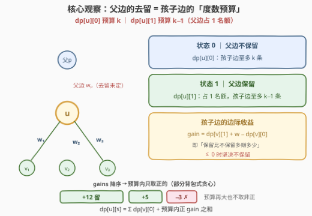
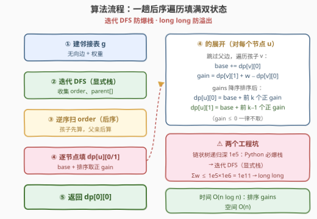
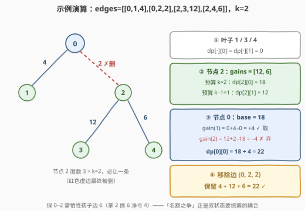

# 移除边之后的权重最大和

- **题目名称**：移除边之后的权重最大和
- **链接**：[3367. 移除边之后的权重最大和](https://leetcode.cn/problems/maximize-sum-of-weights-after-edge-removals/)
- **难度**：困难
- **标签**：树、深度优先搜索、动态规划、排序

## 1. 题目概述

给定一棵 $n$ 个节点的无向树（节点编号 $0 \sim n-1$），边由二维整数数组 `edges` 给出，`edges[i] = [ui, vi, wi]` 表示 $u_i$ 与 $v_i$ 之间有一条权重为 $w_i$ 的边。

你的任务是移除**零条或多条**边，使得：

1. **每个节点至多与 $k$ 个节点直接相连**（即度数 $\le k$）；
2. 剩余边的**权重之和最大化**。

返回移除后剩余边权重的最大可能和。

**示例 1**：

```text
输入：edges = [[0,1,4],[0,2,2],[2,3,12],[2,4,6]], k = 2
输出：22
解释：节点 2 与 3 个节点相连（度 3 > k = 2）。移除边 [0,2,2] 后所有约束满足，
      剩余权重和 4 + 12 + 6 = 22，无法更大。
```

**示例 2**：

```text
输入：edges = [[0,1,5],[1,2,10],[0,3,15],[3,4,20],[3,5,5],[0,6,10]], k = 3
输出：65
解释：没有节点与超过 k = 3 个节点相连，一条边都不用删，总和 65。
```

**约束条件**：

- $2 \le n \le 10^5$，$1 \le k \le n-1$
- `edges.length == n - 1`，输入保证构成一棵有效的树
- $1 \le w_i \le 10^6$

> 💡 **读题关键**：① 度数约束是**逐节点**的，而每条边同时占用**两端各一个名额**——边的去留在两端耦合，这是本题的难点所在；② 「删边使权和最大」$\Leftrightarrow$ 「度数约束下选边子集使权和最大」，本质是**最大化保留**问题，而非最小化删除问题；③ 权和上界 $(n-1) \times 10^6 \approx 10^{11}$ 超出 `int`，C++ 必须用 `long long`。

---

## 2. 解题思路

### 2.1 暴力思路与贪心陷阱

**枚举边子集**：$n-1$ 条边各有留/删两种选择，共 $2^{n-1}$ 种组合，逐个校验度数约束再取最大——$n = 10^5$ 时是天文数字，不可行。

**直觉贪心「哪个节点度超标，就删它身上最便宜的边」也不对**。反例（$k = 1$，实测贪心得 100、最优 199）：

```text
边：0-1 (100)、1-2 (100)、0-3 (99)、2-4 (98)，k = 1
贪心：节点 0 超标 → 删 0-3 (99)；节点 1 超标 → 删一条 100 的；
      节点 2 随之超标 → 删 2-4 (98)…… 最后只剩 100
最优：保留 1-2 (100) 与 0-3 (99)——互不相邻、度数全 ≤ 1，共 199
```

病根在于**删一条边会同时释放两端的名额**：局部最便宜的删法可能在远处引发连锁牺牲，收益取决于「对面」名额的紧张程度。边的两端耦合必须**全局统筹**——而树的结构天然给出了统筹方向：**自底向上**。

### 2.2 核心观察：树形 DP——父边的去留决定孩子边的预算

把树以任意节点（取 $0$）为根。对每个节点 $u$，与它相关的边分两类：**恰一条父边**（连向父节点）与**若干条孩子边**。$u$ 的度数名额 $k$ 由两者瓜分：

- **父边不保留**：孩子边至多留 $k$ 条；
- **父边保留**：父边先占 1 个名额，孩子边至多留 $k-1$ 条。

父节点在决策「要不要保留指向 $u$ 的那条边」时，需要知道这两种前提各自的最优值——于是定义**双状态**：

$$
dp[u][0] = \text{不保留父边时，子树 } u \text{ 内能保留的最大权和（孩子边预算 } k\text{）}
$$

$$
dp[u][1] = \text{保留父边时，子树 } u \text{ 内能保留的最大权和（孩子边预算 } k-1\text{）}
$$

**转移**：对 $u$ 的每个孩子 $v$（边权 $w$），孩子边 $(u, v)$ 只有两个选择：

- **不保留** → 子树 $v$ 按 $dp[v][0]$ 结账；
- **保留** → 子树 $v$ 必须按「父边保留」的前提结账，贡献 $dp[v][1] + w$。

两者的**边际收益**：

$$
\text{gain}_v = dp[v][1] + w - dp[v][0]
$$

先令基线 $\text{base} = \sum_v dp[v][0]$（所有孩子边默认不保留），再把各 $\text{gain}_v$ **降序排列**，在预算 $B$ 内只取正的：

$$
dp[u][s] = \text{base} + \sum_{j=1}^{\min(B_s,\ \text{cnt})} \max\big(\text{gain}_{(j)},\ 0\big),\qquad B_0 = k,\ B_1 = k-1
$$

**答案**即 $dp[\text{root}][0]$——根没有父边，预算恰为 $k$。



为什么「降序取正」是对的？固定预算 $B$ 后总收益 $= \text{base} + \text{所选 gain 之和}$，即从若干个数中**至多选 $B$ 个使和最大**——经典交换论证：若漏选更大的正 gain 而选了更小的，交换后严格变优；$\text{gain} \le 0$ 的边保留只会亏。这正是**部分背包式贪心**在每个节点局部的应用，而「预算」由父边状态参数化——树形 DP 把贪心做不到的全局统筹，沿一次后序遍历完成。

> 💡 官方 hint「对每条边求包含它 / 不包含它两种和」说的就是这对双状态：$dp[u][1]$ 是「包含父边」的和，$dp[u][0]$ 是「不包含父边」的和。

### 2.3 算法流程：一趟后序遍历



1. 由 `edges` 建**邻接表**（无向、带权）；
2. **迭代 DFS**（显式栈）从根出发，收集前序序列 `order` 与父节点数组 `parent`；
3. **逆序扫描 `order`**——天然是后序，保证算 $u$ 时所有孩子的 $dp$ 已就绪；
4. 对每个 $u$：跳过父边，累加 `base`、收集 `gains`，降序排序后按预算 $k$ / $k-1$ 两档各取正 gain，填出 $dp[u][0]$ 与 $dp[u][1]$；
5. 返回 $dp[0][0]$。

> ⚠️ **两个工程坑**：① $n \le 10^5$ 的链状树递归深度达 $10^5$——Python 默认递归上限 1000 必爆（盲目 `setrecursionlimit` 也常段错误），C++ 亦贴近默认栈限，显式栈迭代 DFS 是稳妥写法；② $\sum w \le 10^5 \times 10^6 = 10^{11}$，C++ 返回值与中间累加都必须是 `long long`。

### 2.4 示例演算

以示例 1 `edges = [[0,1,4],[0,2,2],[2,3,12],[2,4,6]]`，$k = 2$ 走完全流程（树形：$0$ 的孩子是 $1, 2$；$2$ 的孩子是 $3, 4$）：



1. **叶子 $1, 3, 4$**：没有孩子边，$dp[\cdot][0] = dp[\cdot][1] = 0$；
2. **节点 $2$**：$\text{base} = 0$；$\text{gain}(3) = 0 + 12 - 0 = 12$、$\text{gain}(4) = 0 + 6 - 0 = 6$，降序 $[12, 6]$——预算 $k=2$ 全取：$dp[2][0] = 18$；预算 $k-1=1$ 只取 $12$：$dp[2][1] = 12$；
3. **节点 $0$**：$\text{base} = dp[1][0] + dp[2][0] = 18$；$\text{gain}(1) = 0 + 4 - 0 = +4$ ✓、$\text{gain}(2) = 12 + 2 - 18 = -4$ ✗——预算 $k = 2$ 只取正的：$dp[0][0] = 18 + 4 = 22$；
4. **答案 22**：保留 $0\text{-}1$、$2\text{-}3$、$2\text{-}4$，删去 $(0, 2, 2)$。

注意 $\text{gain}(2) = -4$ 的含义：保留 $0\text{-}2$（权 2）会让节点 $2$ 只剩一个孩子名额、被迫放弃边权 $6$——**拿 2 换 6，净亏 4**。「父边和孩子边抢名额」正是双状态要统筹的耦合，也是贪心翻车的根源。

---

## 3. 参考代码

### C++

```cpp
class Solution {
  public:
    long long maximizeSumOfWeights(vector<vector<int>>& edges, int k) {
        int n = edges.size() + 1;
        vector<vector<pair<int, int>>> g(n);                 // (邻居, 边权)
        for (auto& e : edges) {
            g[e[0]].push_back({e[1], e[2]});
            g[e[1]].push_back({e[0], e[2]});
        }

        // 迭代 DFS：order 为前序序列，parent 记录父节点（防爆栈）
        vector<int> parent(n, -1), order, stk = {0};
        vector<bool> vis(n, false);
        vis[0] = true;
        order.reserve(n);
        while (!stk.empty()) {
            int u = stk.back();
            stk.pop_back();
            order.push_back(u);
            for (auto& [v, w] : g[u]) {
                if (!vis[v]) {
                    vis[v] = true;
                    parent[v] = u;
                    stk.push_back(v);
                }
            }
        }

        // 逆序扫 order = 后序：孩子的 dp 先就绪
        vector<array<long long, 2>> dp(n);
        for (int i = n - 1; i >= 0; i--) {
            int u = order[i];
            long long base = 0;                              // 孩子边默认全不保留
            vector<long long> gains;                         // 保留各孩子边的边际收益
            for (auto& [v, w] : g[u]) {
                if (v == parent[u]) continue;                // 跳过父边
                base += dp[v][0];
                gains.push_back(dp[v][1] + w - dp[v][0]);
            }
            sort(gains.begin(), gains.end(), greater<>());
            for (int s = 0; s < 2; s++) {
                int budget = (s == 0) ? k : k - 1;           // 父边保留则名额少 1
                long long total = base;
                for (int j = 0; j < (int)gains.size() && j < budget; j++) {
                    if (gains[j] <= 0) break;                // 非正 gain 一律不取
                    total += gains[j];
                }
                dp[u][s] = total;
            }
        }
        return dp[0][0];                                     // 根无父边，预算 k
    }
};
```

### Python

```python
class Solution:
    def maximizeSumOfWeights(self, edges: List[List[int]], k: int) -> int:
        n = len(edges) + 1
        g = [[] for _ in range(n)]
        for u, v, w in edges:
            g[u].append((v, w))
            g[v].append((u, w))

        parent = [-1] * n
        order, stack = [], [0]
        vis = [False] * n
        vis[0] = True
        while stack:                                  # 迭代 DFS：防爆栈
            u = stack.pop()
            order.append(u)
            for v, w in g[u]:
                if not vis[v]:
                    vis[v] = True
                    parent[v] = u
                    stack.append(v)

        dp = [[0, 0] for _ in range(n)]
        for u in reversed(order):                     # 后序：孩子先算
            base, gains = 0, []
            for v, w in g[u]:
                if v == parent[u]:                    # 跳过父边
                    continue
                base += dp[v][0]
                gains.append(dp[v][1] + w - dp[v][0])
            gains.sort(reverse=True)
            for s, budget in ((0, k), (1, k - 1)):    # 两档预算各取正 gain
                total = base
                for j in range(min(budget, len(gains))):
                    if gains[j] <= 0:
                        break
                    total += gains[j]
                dp[u][s] = total
        return dp[0][0]
```

> 💡 **实现细节**：① $k = 1$ 时 $dp[u][1]$ 的预算为 0——一条孩子边都不留，循环边界自然处理，无需特判；② 叶子节点两个状态都是 0，同样是循环空转的自然结果；③ `gains` 只需在正数部分排序（非正一律不取），实测不优化也远快于时限；④ 「逆序扫前序序列 = 后序」是迭代树形 DP 的通用手法，不必真写「左-右-根」。

---

## 4. 复杂度分析

| 维度 | 复杂度 | 说明 |
|------|--------|------|
| 时间复杂度 | $O(n \log n)$ | 每个节点对自己的 gains 排序，$\sum_u \deg(u) \log \deg(u) \le 2(n-1)\log n$；建图与两遍扫描 $O(n)$ |
| 空间复杂度 | $O(n)$ | 邻接表 $2(n-1)$ 条边 + `dp` / `order` / `parent` 各一维 |
| 暴力对照 | $O(2^{n-1} \cdot n)$ | 枚举边子集逐个校验度数约束，$n = 10^5$ 完全不可行 |

实测：两组官方样例输出 `22` / `65` ✓；与「枚举边子集」暴力对拍随机小树（$n \le 9$、权 $\le 10$）2000 组全部一致；$n = 10^5$ 的链状树与星形树各约 0.26 s（纯 Python），C++ 毫秒级。

---

## 5. 扩展：从「树上名额分配」到一般图

- **贪心为什么救不回来**：删边的收益取决于两端名额的紧张程度，而名额紧张程度又取决于其他边的去留——**循环依赖**。树形 DP 的双状态恰好把「父边去留」从子树内部决策中**参数化**出来：子树先算好两种前提各自的最优，父节点只需比较 $\text{gain} = dp[v][1] + w - dp[v][0]$。可以把它理解为「**自底向上的全局贪心**」——每一步取舍都建立在下层全部信息之上。
- **泛化到一般图**：度数约束下的最大权边子集 = 最大权 **b-匹配**（每点容量 $b_v = k$），一般图需最小费用流、带花树一类重武器；树无环，约束沿边自然解耦，一趟 DFS 退化为线性 DP——这也是本题「困难但代码不到 40 行」的原因。
- **输出具体方案**：在 $dp[u][0]$ 转移处记录被保留的孩子边集合（排序后取了前 $j$ 个正 gain），从根自顶向下回溯即可，$O(n)$ 还原删边清单。

---

## 6. 面试要点

1. **为什么状态必须分「父边保留 / 不保留」两维？**

   - 度数名额把父边和孩子边**耦合在同一节点**上：父边一旦保留，孩子边预算从 $k$ 缩到 $k-1$。父节点决策时需要「两种前提下的子树最优值」各是多少，单状态表达不出这个前提。

2. **每个节点处「gains 降序取正」的贪心为什么正确？**

   - 固定预算 $B$ 后总收益 = base + 所选 gain 之和，即从 $\deg(u)$ 个数中至多选 $B$ 个使和最大。交换论证：漏大取小时交换严格更优；非正 gain 取了不增反减——与部分背包同构。

3. **$k = 1$ 时整个问题退化成什么？**

   - 每个节点至多 1 个邻居 ⇒ 保留边两两无公共端点 ⇒ **最大权匹配**。此时 $dp[u][1]$ 预算为 0（父边独占名额），双状态 DP 正是树上最大权匹配的经典解法。

4. **递归 DFS 写这题行不行？**

   - $n = 10^5$ 的链状树递归深 $10^5$：Python 默认上限 1000 必爆，即便调大 `setrecursionlimit` 也易段错误；C++ 每帧虽小仍贴近默认栈限。显式栈迭代 DFS（前序收集 + 逆序回推）是白板加分写法。

5. **本题的贪心陷阱是什么？如何向面试官一击致命地论证？**

   - 「超标节点删最便宜邻边」看似合理，但删一条边同时释放**两端**名额，收益取决于对面的紧张程度。举 2.1 的反例（贪心 100 / 最优 199）即可；正确做法是自底向上统筹——子树把两种前提的最优值都备好，上层才有足够信息取舍。

---

## 7. 同类练习题

- [337. 打家劫舍 III](https://leetcode.cn/problems/house-robber-iii/)（[站内题解](../0301-0400/337_打家劫舍III.md)）：树形 DP「选 / 不选」双状态鼻祖——本题把抽象的选不选具体化为「父边占不占度数名额」
- [968. 监控二叉树](https://leetcode.cn/problems/binary-tree-cameras/)（[站内题解](../0901-1000/968_监控二叉树.md)）：三状态树形 DP（放相机 / 靠父 / 靠子），状态间约束更绕，同一范式的进阶
- [834. 树中距离之和](https://leetcode.cn/problems/sum-of-distances-in-tree/)（[站内题解](../0801-0900/834_树中距离之和.md)）：自底向上一趟定根信息 + 自顶向下换根，体会「后序先算」的通用套路
- [310. 最小高度树](https://leetcode.cn/problems/minimum-height-trees/)（[站内题解](../0301-0400/310_最小高度树.md)）：树形 DP 找重心，同为「后序一趟、结论看根」的结构
- [2581. 统计可能的树根数目](https://leetcode.cn/problems/count-number-of-possible-root-nodes/)（[站内题解](../2501-2600/2581_统计可能的树根数目.md)）：换根 DP 计数版，后序统计 + 前序增量换根
