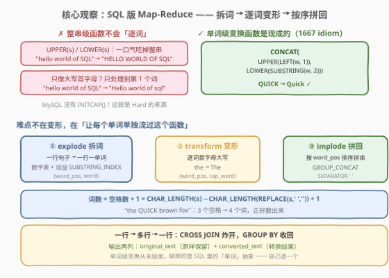
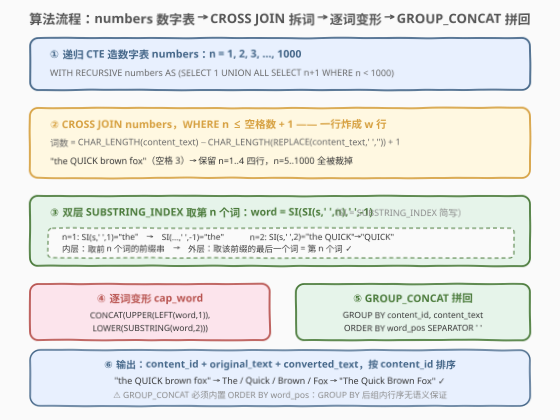

# LeetCode 首字母大写 题解

## 1. 题目概述

- **标题 / 题号**：首字母大写（#3368，hard）
- **链接**：https://leetcode.cn/problems/first-letter-capitalization/
- **难度**：困难
- **标签**：数据库、SQL、字符串处理、递归 CTE、`SUBSTRING_INDEX`、`GROUP_CONCAT`、`CROSS JOIN`、LeetCode 锁题

> ⚠️ 本题为 LeetCode 付费题（锁题），题意描述根据官方示例用例与外部资料重建，可能与官方题面有出入。（题意、转换规则与输出格式已与免费姊妹题 [3374. 首字母大写 II](https://leetcode.cn/problems/first-letter-capitalization-ii/) 交叉核对——两者共用同一套测试数据生成器，示例输入几乎同源，故出入风险较低。）

**表结构**：`user_content`

| 列名 | 类型 |
|------|------|
| content_id | int |
| content_text | varchar |

- `content_id` 是这张表的唯一主键，每行包含一个不同的 ID 以及对应的文本内容；
- `content_text` 由若干英文单词组成，单词之间以**单个空格**分隔。

**目标**：编写一个解决方案，按以下规则转换 `content_text` 列中的文本：

1. 将每个单词的**第一个字母**转换为**大写**，**其余字母**转换为**小写**（例如 `QUICK` → `Quick`、`hello` → `Hello`）；
2. 所有其他**格式**与**空格**保持**不变**。

返回结果表，**同时包含原始的 `content_text`**（`original_text` 列）**与转换后的文本**（`converted_text` 列）。

**示例**（依据官方示例用例重建）：

```text
输入：user_content 表
+------------+----------------------------------+
| content_id | content_text                     |
+------------+----------------------------------+
| 1          | hello world of SQL               |
| 2          | the QUICK brown fox              |
| 3          | data science AND machine learning|
| 4          | TOP rated programming BOOKS      |
+------------+----------------------------------+

输出：
+------------+----------------------------------+----------------------------------+
| content_id | original_text                    | converted_text                   |
+------------+----------------------------------+----------------------------------+
| 1          | hello world of SQL               | Hello World Of Sql               |
| 2          | the QUICK brown fox              | The Quick Brown Fox              |
| 3          | data science AND machine learning| Data Science And Machine Learning|
| 4          | TOP rated programming BOOKS      | Top Rated Programming Books      |
+------------+----------------------------------+----------------------------------+
```

**解释**：

- `content_id = 1`：`hello world of SQL` 的四个单词逐个首字母大写、其余小写 → `Hello World Of Sql`（注意 `SQL` 被压成 `Sql`）；
- `content_id = 2`：全大写的 `QUICK` 同样只保留首字母大写 → `The Quick Brown Fox`；
- `content_id = 3`：`AND` → `And`，小词也不例外——规则作用于**每个**单词，而非英语标题体的「虚词小写」语法；
- `content_id = 4`：`TOP` → `Top`、`BOOKS` → `Books`。

**约束条件**（依据表结构与示例重建推测）：

- `content_text` 长度上限 `VARCHAR(255)`，单词间为单个空格（无标点、无连续空格——由示例数据与「空格保持不变」条款反推）；
- 判题数据规模小。

> 💡 **审题关键**：① 变换是**单词级**的——`UPPER`/`LOWER` 这种整串级函数没有「单词」抽象，而 MySQL 恰好**没有** Oracle / PostgreSQL 的 `INITCAP()`，这就是一道 SQL 「Hard」的真实来源；② 输出**两列**——原串原样保留（`original_text`）+ 转换结果（`converted_text`），对照输出即可自查；③ 每个单词都变，`of`/`AND` 一视同仁。

## 2. 解题思路

### 2.1 暴力思路：整串函数直球 + 拉回应用层

**SQL 内的「直球」**是用 1667（[修复表中的名字](../1601-1700/1667_修复表中的名字.md)）验证过的变形 idiom 直接怼整串：

```sql
SELECT content_id,
       content_text AS original_text,
       CONCAT(UPPER(LEFT(content_text, 1)),
              LOWER(SUBSTRING(content_text, 2))) AS converted_text
FROM user_content;
```

它只把**整句的第一个**单词首字母大写：`hello world of SQL` → `Hello world of sql`——单词级的要求只做了 $1/w$，其余单词完全没碰到。1667 的 `name` 是**单个单词**，这个 idiom 够用；本题是**多个单词的句子**，语境变了。另一个方向是「应用层暴力」：`SELECT *` 全表捞回程序，逐行 `split(' ')` → `w.capitalize()` → `' '.join(...)`，一个 Python 函数三行搞定——但数据库题要求一条 SQL，这条路判题层面直接不通。

> ⚠️ 暴力的启示：**变形函数从来不是难点**（`CONCAT(UPPER(LEFT(w,1)), LOWER(SUBSTRING(w,2)))` 对单个单词 `$w$` 一步到位），难点是 SQL 的字符串函数都是**整串级**的——**没有「让每个单词单独流过这个函数」的原生抽象**。要造这个抽象，只能把句子**炸开成行**。

### 2.2 核心观察：拆词 → 逐词变形 → 按序拼回（SQL 版 Map-Reduce）



三个观察把问题坍缩成「**一行变多行、逐行变形、多行收回一行**」的三段式：

| 观察 | 内容 | 带来的做法 |
|------|------|-----------|
| **单词级变形是现成的** | `CONCAT(UPPER(LEFT(w,1)), LOWER(SUBSTRING(w,2)))` 就是「首字母大写、其余小写」，1667 已验证 | 难点全部集中在「取词」与「拼回」两端 |
| **取第 n 个词有经典 idiom** | `SUBSTRING_INDEX(SUBSTRING_INDEX(s, ' ', n), ' ', -1)` 双层截取：内层取**前 n 个词**的前缀串，外层取该前缀的**最后一个**词 | 配一张数字表 `n = 1..W`，一行句子炸成 `W` 行单词 |
| **按序拼回靠 GROUP_CONCAT** | `GROUP_CONCAT(cap_word ORDER BY word_pos SEPARATOR ' ')` 组内按词序拼串 | `GROUP BY content_id` 把炸开的词收回一行 |

再补一块拼图——**每行的词数 $W$ 怎么算**：单词间是单个空格，故**词数 = 空格数 + 1**，而空格数用「原串长度 − 抠掉空格后的长度」得到：

$$W = \text{CHAR\_LENGTH}(s) - \text{CHAR\_LENGTH}(\text{REPLACE}(s, \texttt{' '}, \texttt{''})) + 1$$

数字表本身用**递归 CTE** 生成 $1 \sim 1000$（`VARCHAR(255)` 至多 128 个单词，上限绰绰有余）。

> 💡 **一句话**：这是 SQL 版的 **map-reduce**——`CROSS JOIN` 数字表负责 **explode**（一行变多行），`CONCAT/UPPER/LOWER` 负责 **transform**（逐词变形），`GROUP_CONCAT` 负责 **implode**（多行收回一行）。`word_pos` 列贯穿全程，是拼回时保序的命脉。

### 2.3 算法流程图



| 步骤 | SQL 片段 | 作用 | 示例数据流 |
|------|----------|------|-----------|
| ① 数字表 | `WITH RECURSIVE numbers AS (SELECT 1 … n < 1000)` | 生成 $n = 1 \ldots 1000$ | `1, 2, 3, …` |
| ② 裁词数 | `CROSS JOIN numbers WHERE n ≤ W` | 每行只留恰好 $W$ 个 `(行, n)` 对 | `"the QUICK brown fox"`（$W{=}4$）→ 幸存 n=1..4 |
| ③ 取词 | `SUBSTRING_INDEX(SUBSTRING_INDEX(s,' ',n),' ',-1)` | 双层截取取第 $n$ 个词 | `the` / `QUICK` / `brown` / `fox` |
| ④ 变形 | `CONCAT(UPPER(LEFT(word,1)), LOWER(SUBSTRING(word,2)))` | 逐词首字母大写 | `The` / `Quick` / `Brown` / `Fox` |
| ⑤ 拼回 | `GROUP_CONCAT(cap_word ORDER BY word_pos SEPARATOR ' ')` | 组内按词序拼串 | `The Quick Brown Fox` |
| ⑥ 输出 | `GROUP BY content_id, content_text ORDER BY content_id` | 一行原串 + 一行转换结果 | `(2, 原串, "The Quick Brown Fox")` |

> ⚠️ **⑤ 的 `ORDER BY word_pos` 不可省**：`GROUP BY` 之后组内行的物理顺序没有任何语义保证——`CROSS JOIN` 的产物顺序、递归 CTE 的产生顺序都不代表聚合的读取顺序。`GROUP_CONCAT` **函数体内**的 `ORDER BY` 是唯一显式的排序载体，删掉它等于把词序交给运气。

### 2.4 示例演算


以 `content_id = 2` 的 `"the QUICK brown fox"` 全流程演算：

| word_pos | word（双层 `SI` 取词） | cap_word（变形） |
|----------|------------------------|------------------|
| 1 | `the` | `The` |
| 2 | `QUICK` ← 全大写 | `Quick`（其余压小写） |
| 3 | `brown` | `Brown` |
| 4 | `fox` | `Fox` |

$$\text{GROUP\_CONCAT}(\texttt{cap\_word ORDER BY word\_pos SEPARATOR ' '}) = \texttt{"The Quick Brown Fox"}\ ✓$$

其余三行走同一条流水线，仅词数不同：

| content_id | original_text | converted_text |
|------------|---------------|----------------|
| 1 | `hello world of SQL` | `Hello World Of Sql`（`SQL` → `Sql`） |
| 3 | `data science AND machine learning` | `Data Science And Machine Learning` |
| 4 | `TOP rated programming BOOKS` | `Top Rated Programming Books` |

> 💡 **交换验证**：若把 ④ 的变形换成 `word` 原样输出（不变形），拼回得到原串——整条流水线**退化**为恒等变换；若把 ⑤ 的 `SEPARATOR ' '` 换成 `','`，则得到 `The,Quick,Brown,Fox`。爆炸-拼回框架与单词级变换**正交**，两处各改一个词即得两个变体——这也是 3374（姊妹题）在框架中再插一层「按 `-` 拆 part」就能扩展的底层原因。

## 3. 参考代码

### SQL（解法 A：数字表 CROSS JOIN + 双层 SUBSTRING_INDEX，推荐）

```sql
# Write your MySQL query statement below
WITH RECURSIVE numbers AS (
    SELECT 1 AS n
    UNION ALL
    SELECT n + 1 FROM numbers WHERE n < 1000
),
words AS (
    SELECT content_id,
           content_text,
           n AS word_pos,
           SUBSTRING_INDEX(SUBSTRING_INDEX(content_text, ' ', n), ' ', -1) AS word
    FROM user_content
    CROSS JOIN numbers
    WHERE n <= CHAR_LENGTH(content_text)
              - CHAR_LENGTH(REPLACE(content_text, ' ', '')) + 1
),
capitalized AS (
    SELECT content_id,
           content_text,
           word_pos,
           CONCAT(UPPER(LEFT(word, 1)),
                  LOWER(SUBSTRING(word, 2))) AS cap_word
    FROM words
)
SELECT content_id,
       content_text AS original_text,
       GROUP_CONCAT(cap_word ORDER BY word_pos SEPARATOR ' ') AS converted_text
FROM capitalized
GROUP BY content_id, content_text
ORDER BY content_id;
```

> 💡 **写法要点**：
> - **三个 CTE 各司一职**：`numbers` 造数字表、`words` 负责 explode（一行炸成 $W$ 行，`WHERE n ≤ W` 把 `CROSS JOIN` 的笛卡尔积裁剪到恰好每词一行）、`capitalized` 负责 transform——与 2.2 的三段式一一对应；
> - **词数公式**：`CHAR_LENGTH(s) − CHAR_LENGTH(REPLACE(s,' ','')) + 1` = 空格数 + 1 = 词数。用 `CHAR_LENGTH`（字符）而非 `LENGTH`（字节）：`SUBSTRING_INDEX` 的位置语义是**字符**，多字节文本下配 `CHAR_LENGTH` 才一致（纯 ASCII 数据两者等价）；
> - **`GROUP BY content_id, content_text` 双键**：判题建表未显式声明主键，`content_text` 未被 MySQL 认定为 `content_id` 的函数依赖列，只 `GROUP BY content_id` 再 `SELECT content_text` 会撞 `ONLY_FULL_GROUP_BY`；把两列都放进分组键最稳；
> - **`ORDER BY content_id` 收尾**：示例输出按 id 升序，显式写上不吃亏。

### SQL（解法 B：递归 CTE「吃一个词、留一截尾巴」）

```sql
# Write your MySQL query statement below
WITH RECURSIVE words AS (
    SELECT content_id,
           content_text,
           1 AS word_pos,
           SUBSTRING_INDEX(content_text, ' ', 1) AS word,
           SUBSTRING(content_text,
                     CHAR_LENGTH(SUBSTRING_INDEX(content_text, ' ', 1)) + 2) AS rest
    FROM user_content
    UNION ALL
    SELECT content_id,
           content_text,
           word_pos + 1,
           SUBSTRING_INDEX(rest, ' ', 1),
           SUBSTRING(rest,
                     CHAR_LENGTH(SUBSTRING_INDEX(rest, ' ', 1)) + 2)
    FROM words
    WHERE rest <> ''
),
capitalized AS (
    SELECT content_id,
           content_text,
           word_pos,
           CONCAT(UPPER(LEFT(word, 1)),
                  LOWER(SUBSTRING(word, 2))) AS cap_word
    FROM words
)
SELECT content_id,
       content_text AS original_text,
       GROUP_CONCAT(cap_word ORDER BY word_pos SEPARATOR ' ') AS converted_text
FROM capitalized
GROUP BY content_id, content_text
ORDER BY content_id;
```

> 💡 **解法 B 的取舍**：
> - 套路是**逐词消费**：`word` 取当前第一个词，`rest` 用 `SUBSTRING(s, 词长 + 2)` 跳过「词 + 空格」留下尾巴，`rest = ''` 时递归终止——不需要数字表，也不需要预先算词数，「词数」隐式地由递归深度给出；
> - `+2` 的来历：`SUBSTRING` 位置从 1 起数，词占第 $1 \ldots L$ 字符、空格占第 $L{+}1$ 字符，故尾巴从第 $L{+}2$ 字符开始；
> - 与解法 A 语义完全等价，代价是递归深度受 `cte_max_recursion_depth`（默认 1000）约束——`VARCHAR(255)` 至多 128 词，安全。两解均只扫一遍文本，无 2.1 的「单词级要求漏做」问题。

### Python（pandas）

```python
import pandas as pd


def first_letter_capitalization(user_content: pd.DataFrame) -> pd.DataFrame:
    res = user_content.sort_values("content_id").reset_index(drop=True)
    return pd.DataFrame(
        {
            "content_id": res["content_id"],
            "original_text": res["content_text"],
            "converted_text": res["content_text"].str.title(),
        }
    )
```

> 💡 **pandas 对照**（付费题无官方函数签名，函数名按题意命名）：`str.title()` 就是 Python 版 `INITCAP`——每个单词首字母大写、其余小写，`"hello world of SQL".title()` → `"Hello World Of Sql"`，与 SQL 三段式流水线的最终产物逐字相同。一个函数调用顶掉 MySQL 里「数字表 + 炸行 + 拼回」一整套机关，再次印证本题的 Hard 是**方言税**而非算法难度。注意 `title()` 对撇号敏感（`it's` → `It'S`），本题数据纯字母单词，不受影响。

## 4. 复杂度分析

设 $n$ 为 `user_content` 行数，$L$ 为单行文本最大字符数，$\ell$ 为单行最大词数（$\ell \le \lceil L/2 \rceil \le 128$），$N = \sum_i w_i$ 为总词数。

| 维度 | 复杂度 | 说明 |
|------|--------|------|
| **时间（数字表）** | $O(L)$ | 递归生成 $1 \ldots 1000$（上限取常数），实际只需到最大词数 |
| **时间（取词）** | $O(N \cdot L)$ | 双层 `SUBSTRING_INDEX` 对每个 `(行, n)` 对扫一遍前缀，前缀长 $O(L)$；解法 B 的递归每次对 `rest` 重扫，同为 $O(\ell L)$ 每行 |
| **时间（变形 + 拼回）** | $O(N \log \ell)$ | 变形线性；`GROUP_CONCAT` 组内 `ORDER BY word_pos` 排序合计 $\sum_i w_i \log w_i \le N \log \ell$ |
| **空间** | $O(N)$ | `words` / `capitalized` 中间表每词一行（词 + 位置 + 原串引用），即爆炸产物规模 |
| **扫描次数** | 1 次 | 单趟 `CROSS JOIN` + 一趟聚合；无 2.1 那种「漏做单词」的语义缺口 |

> ⚠️ SQL 复杂度取决于执行计划：`CROSS JOIN numbers` 后 `WHERE n ≤ W` 的裁剪若发生在连接之前（MySQL 会对递归 CTE 物化后做 join buffer），实际中间行数即 $N$ 而非 $1000n$。面试中说明「爆炸规模受词数控制、双层 `SUBSTRING_INDEX` 是前缀重扫的常数开销」即可。另记 `GROUP_CONCAT` 的 `group_concat_max_len` 默认 1024 字节截断坑——`VARCHAR(255)` 输入拼回后至多 255 字符，本题安全，生产环境长文本需调大（见 5.4）。

## 5. 扩展：INITCAP 的方言差异与姊妹题 3374

### 5.1 有 `INITCAP` 的方言：一行流

| 方言 | 写法 | 备注 |
|------|------|------|
| Oracle / PostgreSQL | `INITCAP(content_text)` | 「每个单词首字母大写、其余小写」**恰好是本题题意**，一行流直接 AC |
| MySQL | ✗ 无 `INITCAP` | 只能手搓「爆炸-变形-拼回」流水线，这就是本题 Hard 的全部来源 |
| pandas | `str.title()` | 同样一行（见参考代码 Python 节） |

> 💡 面试谈到这题时，先点破「PostgreSQL 里它是 Easy」再展开 MySQL 手搓方案，展示的是**对 SQL 方言边界的确切认知**而非背模板。

### 5.2 姊妹题 3374：连字符的两段大写

[3374. 首字母大写 II](https://leetcode.cn/problems/first-letter-capitalization-ii/)（免费）在本题规则之上追加一条：**用 `-` 连接的词，两段都要大写**（`top-rated` → `Top-Rated`）。MySQL 解法**完全复用**本题框架，只在「拆词」与「变形」之间再插一层「按 `-` 拆 part」：

```text
按 ' ' 拆 word（word_pos） → 按 '-' 拆 part（part_pos）
  → 逐 part 变形 → GROUP_CONCAT(SEPARATOR '-') 收成 cap_word
  → GROUP_CONCAT(ORDER BY word_pos SEPARATOR ' ') 收成 converted_text
```

两层 `GROUP_CONCAT` 嵌套，外层管句子、内层管连字符词——爆炸-拼回框架天然支持**级联**。有趣的对照：PostgreSQL 的 `INITCAP` 按「非字母数字字符」分词，`INITCAP('top-rated')` 自动得到 `Top-Rated`——**3374 在 PostgreSQL 里仍是一行流**。

### 5.3 JSON_TABLE 换掉数字表（MySQL 8.0.14+ 的现代写法）

把句子拼成 JSON 数组再炸开，`ORDINALITY` 列天然就是 `word_pos`：

```sql
SELECT u.content_id,
       u.content_text AS original_text,
       GROUP_CONCAT(
           CONCAT(UPPER(LEFT(t.word, 1)), LOWER(SUBSTRING(t.word, 2)))
           ORDER BY t.ord SEPARATOR ' '
       ) AS converted_text
FROM user_content u
JOIN JSON_TABLE(
         CONCAT('["', REPLACE(u.content_text, ' ', '","'), '"]'),
         '$[*]' COLUMNS (ord FOR ORDINALITY,
                         word VARCHAR(255) PATH '$')
     ) t
GROUP BY u.content_id, u.content_text
ORDER BY u.content_id;
```

`REPLACE(s, ' ', '","')` + 首尾补 `["` `"]` 把 `"a b c"` 变成 `["a","b","c"]`，`JSON_TABLE` 引用前面表列时隐式 LATERAL。比数字表少一个 CTE、语义更直白，代价是「文本里若混入 `"` 或 `\` 会拼出非法 JSON」——纯字母单词数据无此风险，生产文本需先转义。

### 5.4 `GROUP_CONCAT` 的 `group_concat_max_len` 坑

`GROUP_CONCAT` 结果默认在 **1024 字节**处静默截断。本题 `VARCHAR(255)` 输入的拼回产物至多 255 字符，绝不触线；但把同一套解法搬到生产长文本（文章正文、日志聚合）上，截断**不报错、只少词**——排查极难。生产用法先 `SET SESSION group_concat_max_len = 1024 * 1024;`（或更大），再把「拼接产物长度」纳入测试断言。

## 6. 面试要点

1. **这道 SQL Hard 到底「Hard」在哪？`UPPER`/`LOWER` 为什么不够？**

   > 难点是**方言税 + 单词抽象缺失**：`UPPER`/`LOWER` 是整串级函数，没有「单词」的概念；MySQL 又没有 Oracle/PostgreSQL 的 `INITCAP()`。「首字母大写、其余小写」的单词级变形 idiom（`CONCAT(UPPER(LEFT(w,1)), LOWER(SUBSTRING(w,2)))`）是现成的（1667 已验证），真正的难点是让句子里**每个单词单独流过**这个函数——必须把一行文本炸成多行单词（explode），变形后再按原顺序拼回（implode）。

2. **`SUBSTRING_INDEX(SUBSTRING_INDEX(s, ' ', n), ' ', -1)` 为什么能取出第 $n$ 个词？**

   > 内层 `SUBSTRING_INDEX(s, ' ', n)` 从左数取**前 $n$ 个词**（含其间 $n-1$ 个空格）得到前缀串；外层再对该前缀取**最后一个**词（`-1`）。两层截取的合成效果恰好是「第 $n$ 个词」：$n=2$ 时内层得 `"the QUICK"`、外层得 `"QUICK"`。当 $n$ 等于总词数时内层返回整串，外层即最后一个词——边界自然成立。

3. **`CROSS JOIN numbers` 会不会产生大量垃圾行？词数怎么来的？**

   > 不会留在结果里：`WHERE n <= 词数` 把每个 `(行, n)` 对裁剪到恰好 $n \le W$。词数由「空格数 + 1」给出：`CHAR_LENGTH(s) − CHAR_LENGTH(REPLACE(s,' ','')) + 1`——原串与抠掉空格的长度差就是空格数。数字表上限 1000 只需 ≥ 最大词数即可（`VARCHAR(255)` 至多 128 词），超过部分全被 `WHERE` 裁掉。

4. **`GROUP_CONCAT` 里为什么必须写 `ORDER BY word_pos`？删掉会怎样？**

   > `GROUP BY` 之后组内行的物理顺序**没有任何语义保证**——`CROSS JOIN` 的产物顺序、递归 CTE 的产生顺序都不承诺聚合读取顺序。`GROUP_CONCAT(expr ORDER BY … SEPARATOR …)` 函数体内的 `ORDER BY` 是唯一显式排序载体；删掉后词序交给运气，`"The Quick Brown Fox"` 可能拼成 `"Fox Brown The Quick"`——结果「碰巧对」但语义无保证，测试集一大就翻车。

5. **如果文本混入连续空格，这套解法会怎样？怎么兜底？**

   > 双层 `SUBSTRING_INDEX` 与 `SEPARATOR ' '` 拼回都以**单个空格**为分隔单位：连续空格会拆出空词、拼回时被压缩成单空格——「其余空格保持不变」的条款被破坏。兜底思路：要么改用记录空格结构的方案（按位置拆、按原样拼），要么用 `REGEXP` 系预处理。本题与 3374 的测试数据均为单空格分隔（从示例与社区 AC 代码反推），三段式流水线按单空格假设设计即可。

6. **`CHAR_LENGTH` 和 `LENGTH` 在这里有什么区别？**

   > `LENGTH` 按字节、`CHAR_LENGTH` 按字符。`SUBSTRING` / `SUBSTRING_INDEX` 的位置参数都是**字符**语义，配 `CHAR_LENGTH` 计算词数与跳位才能在多字节文本（中文、`é` 等）下保持一致；纯 ASCII 数据两者等价（社区 AC 代码多用 `LENGTH` 也能过）。解法 B 的 `SUBSTRING(rest, 词长 + 2)` 同理——词长必须按字符数，字节长度会在多字节场景下错位。

> 💡 **一句话总结**：3368 = 1667 的单词级变形 idiom + 「爆炸-拼回」三段式流水线——数字表 `CROSS JOIN` 炸行、`SUBSTRING_INDEX` 双层取词、`GROUP_CONCAT ORDER BY word_pos` 按序收回；MySQL 没有 `INITCAP`，所以 Hard；PostgreSQL 有，所以一行。输出两列 `original_text` / `converted_text` 对照自查，小词 `of`/`AND` 也一视同仁地大写。

## 同类练习题

| # | 题目 | 与本题的关联 |
|---|------|-------------|
| 1667 | [修复表中的名字](https://leetcode.cn/problems/fix-names-in-a-table/)（[站内题解](../1601-1700/1667_修复表中的名字.md)） | 单词级「首字母大写 + 其余小写」变形 idiom 的原型——本题变形函数的直接出处，`name` 是单个单词所以无需拆词，恰好反衬本题「句子」语境的增量难度 |
| 3374 | [首字母大写 II](https://leetcode.cn/problems/first-letter-capitalization-ii/) | 本题的免费姊妹题——同一套测试数据生成器，叠加连字符双段大写规则；MySQL 解法在本题框架中再插一层「按 `-` 拆 part」即可，PostgreSQL 的 `INITCAP` 甚至自动满足新规则 |
| 1484 | [按日期分组销售产品](https://leetcode.cn/problems/group-sold-products-by-the-date/)（[站内题解](../1401-1500/1484_按日期分组销售产品.md)） | `GROUP_CONCAT` 拼串基础题——本题「拼回」一端的裸训练（组内排序 + 显式 `SEPARATOR`），不涉及炸行 |
| 3198 | [查找每个州的城市](https://leetcode.cn/problems/find-cities-in-each-state/)（[站内题解](../3101-3200/3198_查找每个州的城市.md)） | `GROUP_CONCAT` 三件套（分组 / 组内排序 / 分隔符）的完整演练——3328 的前作，拼回侧的另一块拼图 |
| 3328 | [查找每个州的城市 II](https://leetcode.cn/problems/find-cities-in-each-state-ii/)（[站内题解](../3301-3400/3328_查找每个州的城市II.md)） | 同为付费锁题的「拼串 + 多统计量并联」——对照本题体会「拆开炸行」与「并拢聚合」两个相反方向的 GROUP_CONCAT 用法 |
