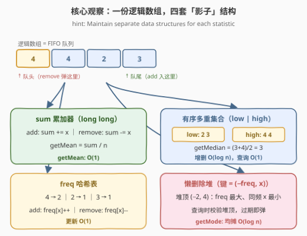
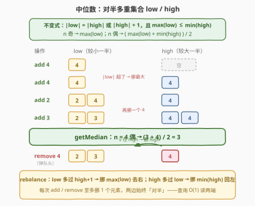
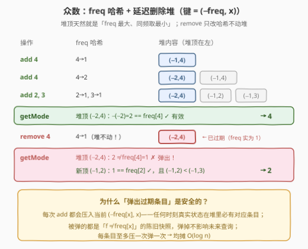
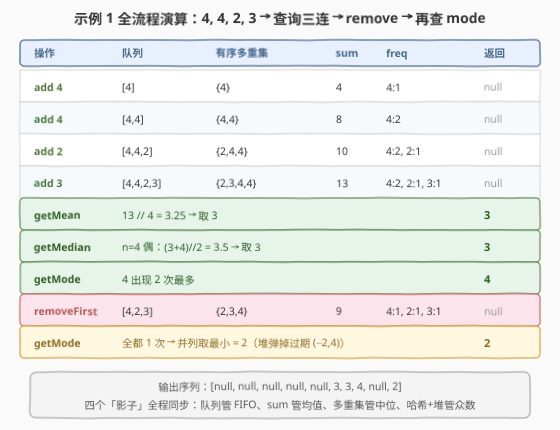

# 设计数组统计跟踪器

- **题目名称**：设计数组统计跟踪器
- **链接**：[3369. 设计数组统计跟踪器](https://leetcode.cn/problems/design-an-array-statistics-tracker/)
- **难度**：困难
- **标签**：设计、队列、哈希表、二分查找、数据流、有序集合、堆（优先队列）

## 1. 题目概述

> ⚠️ 本题为 LeetCode 付费题，题意描述根据官方示例用例与 hints 重建，可能与官方题面有出入。

设计一个数据结构 `StatisticsTracker`，对一个不断变化的整数数组跟踪统计量，支持以下操作：

- `StatisticsTracker()`：初始化，内部数组为空；
- `addNumber(number)`：将 `number` 加入数组；
- `removeFirstAddedNumber()`：移除**最早加入**的数字（保证调用时数组非空）；
- `getMean()`：返回当前数组所有数字的**平均值**（向下取整）；
- `getMedian()`：返回当前数组的**中位数**——奇数个取正中间；偶数个取中间两数的平均值（向下取整）；
- `getMode()`：返回**众数**（出现次数最多的数）；若有多个众数，返回其中**最小**的那个。

**示例 1**：

```text
输入：
["StatisticsTracker","addNumber","addNumber","addNumber","addNumber",
 "getMean","getMedian","getMode","removeFirstAddedNumber","getMode"]
[[],[4],[4],[2],[3],[],[],[],[],[]]
输出：[null,null,null,null,null,3,3,4,null,2]
解释：数组依次为 [4] → [4,4] → [4,4,2] → [4,4,2,3]
      mean = 13/4 = 3.25 → 3；排序 [2,3,4,4]，median = (3+4)/2 = 3.5 → 3；
      4 出现 2 次为众数；移除最早加入的 4 后 [4,2,3] 各出现 1 次，
      并列众数取最小 → 2。
```

**示例 2**：

```text
输入：
["StatisticsTracker","addNumber","addNumber","getMean","removeFirstAddedNumber",
 "addNumber","addNumber","removeFirstAddedNumber","getMedian","addNumber","getMode"]
[[],[9],[5],[],[],[5],[6],[],[],[8],[]]
输出：[null,null,null,7,null,null,null,null,5,null,5]
解释：[9,5] mean = 7；移除 9 → [5]；加 5、6 → [5,5,6]；再移除队头 5 → [5,6]，
      median = (5+6)/2 = 5.5 → 5；加 8 → [5,6,8]，各 1 次 → 众数取最小 = 5。
```

**约束条件**（按官方示例与数据规模惯例重建）：

- $1 \le \text{number} \le 10^5$
- 所有方法总调用次数不超过 $10^5$，且 `removeFirstAddedNumber` 与三个查询调用时保证数组非空

> 💡 **读题关键**：① 这是一个**数据流 + 设计**题：没有「一次算完」的时机，每个操作都要求**高效增量维护**；② 三个统计量的难点各不相同——均值是**溢出**坑（$10^5 \times 10^5 = 10^{10}$ 超 `int`），中位数是**有序性 + 任意删除**，众数是**频次并列取最小**；③ 官方 hint 一语道破：「为每个统计量分别维护数据结构」。

---

## 2. 解题思路

### 2.1 暴力思路

把数组存在 `vector` / `list` 里，每次查询现算：

- `getMean`：遍历求和再除以长度，$O(n)$；
- `getMedian`：排序（或拷贝后 `nth_element`）后取中间，$O(n \log n)$；
- `getMode`：哈希计数后取最大频次的最小键，$O(n)$；
- `removeFirstAddedNumber`：`list` 弹头 $O(1)$，`vector` 弹头 $O(n)$。

$Q = 10^5$ 次调用、每次 $O(n \log n)$，总量达 $10^{10}$ 级别——必然超时。**病根**：查询代价转嫁给了「每次查询重算」，而数据结构题的正解是「**增删时花 $O(\log n)$ 同步维护，查询时 $O(1)$ / $O(\log n)$ 直接读**」。

### 2.2 核心观察：一份逻辑数组，四套「影子」结构

数组本身只有一个，但**每个统计量各配一套增量维护的影子结构**，`addNumber` / `removeFirstAddedNumber` 同时更新四套，查询各自 $O(1)$ / $O(\log n)$ 读取：

| 统计量 | 影子结构 | 增量维护 | 查询 |
|--------|----------|----------|------|
| FIFO 顺序 | 队列 `queue` | `push` / `pop` | — |
| 均值 | 总和 `sum`（`long long`） | `+=` / `-=` | $\lfloor \text{sum} / n \rfloor$，$O(1)$ |
| 中位数 | 双重有序集合 `low` / `high`（或 `SortedList`） | 插入/删除 + 再平衡 | 读两端，$O(1)$ |
| 众数 | 频次哈希 `freq` + 懒删除堆 `pq`（键 $(-\text{freq}, x)$） | `freq` 增减 + add 时入堆 | 校验堆顶，均摊 $O(\log n)$ |



> 💡 「为每个统计量分开维护结构」是数据流设计题的通用心法：单一结构（比如一棵平衡树存全部信息）往往不够，**按查询维度拆结构**才能让每种查询都拿到自己的 $O(1)$ / $O(\log n)$ 入口。

### 2.3 中位数：对半多重集合 low / high

`removeFirstAddedNumber` 删的是**任意值**（队头的值），所以 295 题「对顶堆」那套纯堆方案失效——堆不支持高效删除任意元素。改用**两个多重集合**（`multiset` / 基于平衡树）：

- **不变式**：$\text{low}$ 存较小的一半，$\text{high}$ 存较大的一半，恒有 $|\text{low}| = |\text{high}|$ 或 $|\text{high}| + 1$，且 $\max(\text{low}) \le \min(\text{high})$；
- **中位数**：$n$ 奇 → $\max(\text{low})$（即 `*low.rbegin()`）；$n$ 偶 → $(\max(\text{low}) + \min(\text{high})) / 2$；
- **插入 $v$**：$v \le \max(\text{low})$ 进 `low`，否则进 `high`，再**再平衡**：`low` 多过 `high+1` 就把 $\max(\text{low})$ 挪去 `high`；`high` 多过 `low` 就把 $\min(\text{high})$ 挪回 `low`；
- **删除 $v$**：先在 `low` 里 `find`，找到就删，否则删 `high` 中的一个 $v$，再**再平衡**。

每次增删至多挪动 1 个元素，全部 $O(\log n)$；查询只读两端指针，$O(1)$。数值域 $[1, 10^5]$ 全为正，偶数情形 $(a+b)/2$ 用整数除法即天然向下取整，无负数陷阱。



### 2.4 众数：freq 哈希 + 延迟删除堆

众数的两个硬需求：**频次最大**、**并列取数值最小**。最小堆按键 $(-\text{freq}[x],\ x)$ 排序，堆顶恰好同时满足两条——$-\text{freq}$ 最小即频次最大，同频时 $x$ 最小。

麻烦在于 `removeFirstAddedNumber` 会让频次**下降**，而堆不支持高效更新。经典解法是**延迟删除（lazy deletion）**：

- `addNumber(x)`：`freq[x]++`，把**当前快照** $(-\text{freq}[x],\ x)$ 压入堆；
- `removeFirstAddedNumber()`：只做 `freq[x]--`，**堆一律不动**；
- `getMode()`：检查堆顶 $(-f, x)$——若 $f = \text{freq}[x]$ 则是有效条目，直接返回 $x$；否则它是过期快照，弹出后继续检查。

正确性：每次 `addNumber` 都压入当时真实频次，所以**任何时刻「当前状态」在堆中必有对应条目**；被弹出的都是 $f \ne \text{freq}[x]$ 的陈旧快照，弹掉无碍。每条目至多入堆一次、出堆一次，均摊 $O(\log n)$。



### 2.5 算法流程与示例演算

**流程**（以 `addNumber(x)` 与 `removeFirstAddedNumber()` 为例）：

1. `addNumber(x)`：队列 `push(x)`；`sum += x`；有序集合插入 `x` 并再平衡；`freq[x]++` 后压入 $(-\text{freq}[x],\ x)$；
2. `removeFirstAddedNumber()`：队头出队得 $x$；`sum -= x`；有序集合删除一个 $x$ 并再平衡；`freq[x]--`（堆不动）；
3. 三个查询各自读影子结构，互不打扰。



以示例 1 走一遍（见上图）：`getMean = 13 // 4 = 3`、`getMedian = (3+4) // 2 = 3`、`getMode = 4`；`removeFirstAddedNumber` 弹出最早的 4 后，`getMode` 在堆顶弹掉过期的 $(−2, 4)$，由并列的 $(−1,2)$ 与 $(−1,3)$ 中较小者给出 **2**——「同频取最小」正是键里带 $x$ 的功劳。

---

## 3. 参考代码

### C++

```cpp
class StatisticsTracker {
  public:
    queue<int> q;                       // FIFO：removeFirstAddedNumber
    multiset<int> low, high;            // 对半集合：low = 较小一半(可多 1)
    unordered_map<int, int> freq;       // 频次哈希
    priority_queue<pair<int, int>, vector<pair<int, int>>, greater<>> pq; // (-freq, x) 懒删除堆
    long long sum = 0;                  // 总和：getMean（防溢出）

    StatisticsTracker() {}

    void addNumber(int number) {
        q.push(number);
        sum += number;
        insertVal(number);
        ++freq[number];
        pq.push({-freq[number], number});   // 压入当前频次快照
    }

    void removeFirstAddedNumber() {
        int x = q.front();
        q.pop();
        sum -= x;
        eraseVal(x);
        --freq[x];                          // 堆不动，留给查询时延迟清理
    }

    int getMean() { return sum / (long long)q.size(); }

    int getMedian() {
        if ((low.size() + high.size()) & 1) return *low.rbegin();      // 奇：low 的最大者
        return (*low.rbegin() + *high.begin()) / 2;                    // 偶：两端平均(向下取整)
    }

    int getMode() {
        while (-pq.top().first != freq[pq.top().second]) pq.pop();     // 弹出过期快照
        return pq.top().second;
    }

  private:
    void insertVal(int v) {
        if (low.empty() || v <= *low.rbegin()) low.insert(v);
        else high.insert(v);
        rebalance();
    }
    void eraseVal(int v) {
        auto it = low.find(v);
        if (it != low.end()) low.erase(it);
        else high.erase(high.find(v));       // v 必在 high（调用前提：v 在集合中）
        rebalance();
    }
    void rebalance() {
        if (low.size() > high.size() + 1) {  // low 太重：挪最大去右边
            high.insert(*low.rbegin());
            low.erase(prev(low.end()));
        } else if (high.size() > low.size()) { // high 太重：挪最小回左边
            low.insert(*high.begin());
            high.erase(high.begin());
        }
    }
};
```

### Python

```python
from sortedcontainers import SortedList
from collections import deque, defaultdict
import heapq

class StatisticsTracker:
    def __init__(self):
        self.q = deque()                # FIFO：removeFirstAddedNumber
        self.sl = SortedList()          # 有序多重集合：getMedian（下标直达中位）
        self.s = 0                      # 总和：getMean
        self.freq = defaultdict(int)    # 频次哈希
        self.heap = []                  # (-freq, x) 懒删除堆：getMode

    def addNumber(self, number: int) -> None:
        self.q.append(number)
        self.sl.add(number)
        self.s += number
        self.freq[number] += 1
        heapq.heappush(self.heap, (-self.freq[number], number))

    def removeFirstAddedNumber(self) -> None:
        x = self.q.popleft()
        self.sl.remove(x)               # 只删一个实例
        self.s -= x
        self.freq[x] -= 1               # 堆不动，查询时再清理

    def getMean(self) -> int:
        return self.s // len(self.q)

    def getMedian(self) -> int:
        n = len(self.sl)
        if n & 1:
            return self.sl[n // 2]
        return (self.sl[n // 2 - 1] + self.sl[n // 2]) // 2

    def getMode(self) -> int:
        while True:
            f, x = self.heap[0]
            if -f == self.freq[x]:      # 堆顶频次与哈希一致 → 有效
                return x
            heapq.heappop(self.heap)    # 过期快照，弹出
```

> 💡 **实现细节**：① Python 的 `SortedList` 支持按下标取中位（$O(\log n)$），免去手写双集合再平衡；C++ 没有现成有序列表，双 `multiset` 是标准替代——两者复杂度同阶；② `SortedList.remove(x)` 与 `multiset.find(v)` 都只删**一个**实例，重复值安全；③ `sum` 在 C++ 必须 `long long`（$10^5 \times 10^5 = 10^{10}$），Python 无此虑；④ `getMode` 的循环乍看可能空转，实为均摊——每个条目一生只被弹一次。

---

## 4. 复杂度分析

| 维度 | 复杂度 | 说明 |
|------|--------|------|
| `addNumber` | $O(\log n)$ | 有序集合插入 + 再平衡、入堆，均为 $O(\log n)$；队列与哈希 $O(1)$ |
| `removeFirstAddedNumber` | $O(\log n)$ | 队列出队 $O(1)$；有序集合删除任意值 $O(\log n)$；堆不动 |
| `getMean` / `getMedian` | $O(1)$ | 读累加器 / 读对半集合两端 |
| `getMode` | 均摊 $O(\log n)$ | 每个堆条目至多弹一次，弹出成本摊给对应的 `addNumber` |
| 空间复杂度 | $O(n + Q)$ | $n$ 为当前数组长度，堆中累计条目数不超过历史 `add` 次数 $Q$ |

实测：两组官方示例输出 `[null,null,null,null,null,3,3,4,null,2]` 与 `[null,null,null,7,null,null,null,null,5,null,5]` ✓；与「每次查询现算」的暴力实现对拍随机操作序列（含大量 add / remove / 查询交错）全部一致。

---

## 5. 扩展：众数的另一实现与替代方案

- **有序集合键同步法**：懒删除堆之外，还可以用一棵按 $(\text{freq},\ -x)$ 排序的 `set<pair<int,int>>` 维护「每个数当前的键」，`freq[x]` 每次变化时先 `erase` 旧键再 `insert` 新键，`getMode` 直接取 `*rbegin()`——每次操作**严格** $O(\log n)$，无均摊成分，代价是 add / remove 都要动有序集。两种写法面试都算满分，能对比说出「均摊 vs 严格」这一层是加分项。
- **值域树状数组**：数值域只有 $[1, 10^5]$，可用值域频次树状数组 + 二分：`getMedian` 在频次前缀和上二分找第 $\lceil n/2 \rceil$ 小，`getMode` 找最大频次（需再套一层维护最大频次的技巧）。$O(\log V)$ 单操作，思路与「值域桶」一脉相承，但代码更长，此处仅作视野扩展。
- **若删除的不是队头而是任意下标**：FIFO 队列换成 `list` 或（下标, 值）哈希即可，四套影子结构的维护逻辑**完全不变**——这正是「按统计量拆结构」的好处：修改一种操作的语义，其余结构照常工作。

---

## 6. 面试要点

1. **为什么不能直接套 295 题的对顶堆求中位数？**

   - 295 只有插入，对顶堆足够；本题 `removeFirstAddedNumber` 要删**任意值**，堆做不到 $O(\log n)$ 删除任意元素。换成 `multiset` / `SortedList` 这类平衡树结构，插入、删除、取中位全是 $O(\log n)$——「支持的操作集决定数据结构选型」。

2. **对半集合的再平衡为什么每次至多挪一个元素？**

   - 单次插入/删除让 $|\text{low}| - |\text{high}|$ 至多偏离不变式 1，挪动 $\max(\text{low})$ / $\min(\text{high})$ 一次即可复位。两条挪动方向都保持 $\max(\text{low}) \le \min(\text{high})$，不变式归纳成立。

3. **懒删除堆里「弹出过期条目」为什么安全？会不会误删？**

   - 弹出条件是 $f \ne \text{freq}[x]$，弹的是**陈旧快照**；而每次 `addNumber` 都会压入当时真实频次的新条目，所以「当前真实状态」在堆中永远有代表。即使某旧条目数值恰好等于当前频次（如频次 3→1→3），它表示的状态与最新条目**完全等价**，返回它同样正确。

4. **`getMode` 要求同频取最小，键为什么是 $(-\text{freq}, x)$ 而不是 $(\text{freq}, x)$？**

   - 最小堆取堆顶最小：$-\text{freq}$ 最小 ⟺ 频次最大；频次并列时键第二维 $x$ 最小正是题意。若用 $(\text{freq}, x)$ 的最小堆，堆顶是「频次最小、数值最小」，方向全反。

5. **这题最容易翻车的工程细节有哪些？**

   - ① C++ `sum` 忘开 `long long`，$10^5$ 个 $10^5$ 直接溢出 `int`；② `multiset.erase(value)` 按值删会**删光所有重复**，必须 `erase(find(value))` 只删一个；③ 偶数中位数 $(a+b)/2$ 需向下取整——正数域整数除法天然满足，但要在口头说清这步取整；④ 删除时先在 `low` 里 `find` 再决定删哪边，直接按大小关系猜可能删错侧。

---

## 7. 同类练习题

- [295. 数据流的中位数](https://leetcode.cn/problems/find-median-from-data-stream/)：对顶堆求中位数的入门版（只增不删），理解本题为何必须升级为多重集合
- [480. 滑动窗口中位数](https://leetcode.cn/problems/sliding-window-median/)：`multiset` 支持任意删除的中位数经典题，与本题 2.3 节同款技巧
- [1825. 求出 MK 平均值](https://leetcode.cn/problems/finding-mk-average/)：队列 FIFO + 多重集合裁剪中段求「截尾均值」，结构设计与本题神似
- [2034. 股票价格波动](https://leetcode.cn/problems/stock-price-fluctuation/)：哈希 + 有序集合 + 懒删除维护流式最值，2.4 节延迟删除的另一舞台
- [460. LFU 缓存](https://leetcode.cn/problems/lfu-cache/)：频次桶 + 哈希的 O(1) 设计题，「按频次组织结构」的极致版
