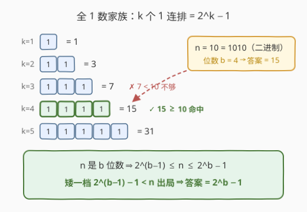
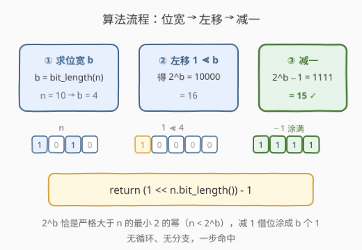
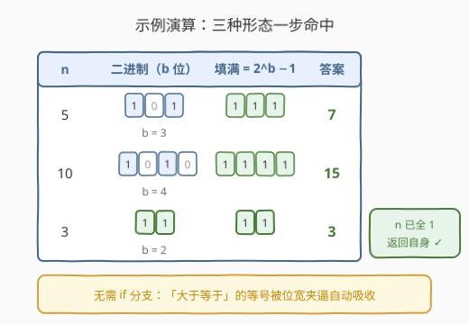

# LeetCode 仅含置位位的最小整数 题解

- **关联**：231 2 的幂——全 1 数加 1 恰是 2 的幂，`x & (x+1) == 0` 与 `n & (n-1) == 0` 是同一技巧的两个方向；476 数字的补数——构造与 $n$ 同位宽的全 1 掩码，正是本题的答案本身

## 1. 题目概述

- **标题 / 题号**：仅含置位位的最小整数（#3370，easy）
- **链接**：https://leetcode.cn/problems/smallest-number-with-all-set-bits/
- **难度**：简单
- **标签**：位运算、数学

**题意**：给你一个正整数 `n`。返回**大于等于** `n` 且二进制表示仅包含**置位位**（值全为 `1`）的**最小**整数 `x`。

**置位位**指的是二进制表示中值为 `1` 的位——「仅包含置位位」即二进制形如 `1`、`11`、`111`、`1111`、…，每个位都是 `1`。

**示例 1**：

```text
输入：n = 5
输出：7
解释：7 的二进制表示是 "111"。
```

**示例 2**：

```text
输入：n = 10
输出：15
解释：15 的二进制表示是 "1111"。
```

**示例 3**：

```text
输入：n = 3
输出：3
解释：3 的二进制表示是 "11"。
```

**约束**：

- $1 \le n \le 1000$

> 💡 **读题关键**：① 「仅含置位位」不是逐位检查的搜索条件，而是把候选集直接压缩成一个**显式家族**——$1, 3, 7, 15, 31, \ldots$，即 $2^k - 1$（$k$ 个 `1` 连排）；② 「大于**等于**」意味着 $n$ 本身全 1 时返回自身（示例 3 的 $n = 3 = 11_2$），等号边界要被解法自动吸收，不能丢；③ $n \le 1000 < 1024 = 2^{10}$，答案至多 10 位全 1（$2^{10} - 1 = 1023$），任何整数类型都毫无压力。

## 2. 解题思路

### 2.1 暴力思路：从 n 起逐个筛查

最直接的做法：从 $x = n$ 开始向上逐个测试，遇到第一个「全 1」的数就返回。判定「全 1」有个一次位运算的小技巧：

```text
x & (x + 1) == 0  ⟺  x 的二进制全为 1
```

原因是**全 1 数加 1 必然整体进位清零**（如 $111_2 + 1 = 1000_2$，按位与后归零）；只要有一位是 `0`，加 1 就不会传染进位，`x & (x+1)` 必然还保留着高位。

```text
x = n
while (x & (x + 1)) != 0：
    x = x + 1
返回 x
```

最坏要走多远？设 $n$ 的二进制有 $b$ 位，则答案至多是 $2^b - 1$，而 $n \ge 2^{b-1}$，故循环次数至多 $2^b - 1 - n \le 2^{b-1} - 1$，量级 $O(n)$。对 $n \le 1000$ 当然能过，但「知道候选是个家族，却还一个一个试」就是浪费——把家族写出来，答案一眼可见。

### 2.2 核心观察：全 1 数 = 2^k − 1 家族，位宽一步锁定



把全 1 数按**位宽**排成阶梯，规律一目了然：

| 位宽 $k$ | 二进制 | 数值 |
|----------|--------|------|
| 1 | `1` | $2^1 - 1 = 1$ |
| 2 | `11` | $2^2 - 1 = 3$ |
| 3 | `111` | $2^3 - 1 = 7$ |
| 4 | `1111` | $2^4 - 1 = 15$ |
| 5 | `11111` | $2^5 - 1 = 31$ |

设 $b$ 为 $n$ 的二进制位数（`bit_length`），由位宽的定义有**双向夹逼**：

$$
2^{b-1} \le n \le 2^b - 1
$$

- **答案够格**：$2^b - 1 \ge n$，且它是 $b$ 位全 1 数——满足「大于等于 $n$」；
- **再矮一档必不够**：位数更少的全 1 数最大是 $2^{b-1} - 1 < 2^{b-1} \le n$，严格小于 $n$，出局。

于是**不存在任何特判**，答案就是一行：

$$
\boxed{\;x = 2^b - 1 = (1 \ll b) - 1, \quad b = \text{bit\_length}(n)\;}
$$

「大于等于」的等号也被自动吸收：当 $n = 2^b - 1$ 本身全 1 时（如 $n = 3$），公式原样返回 $n$。

> 💡 **与官方 hint 对读**：hint 说「找**严格大于** $n$ 的 2 的幂，再减 1」。$2^{\text{bit\_length}(n)}$ 恰好就是严格大于 $n$ 的最小 2 的幂（因为 $n < 2^b$），减 1 即 $2^b - 1$——两条路殊途同归。注意必须是**严格**大于：若 $n = 8 = 1000_2$，「大于等于 $n$ 的幂」是 8，减 1 得 $7 < 8$ 就错了；严格大于的幂是 16，减 1 得 $15 \ge 8$ 正确。这也正是 231 题 $n \,\&\, (n-1) == 0$ 判 2 的幂的镜像场景——**全 1 数 +1 = 2 的幂**，两个家族只差一步进位。

### 2.3 算法流程图



算法只有三步，全程无循环、无分支：

1. **求位宽**：$b = \text{bit\_length}(n)$，即 $n$ 最高位 `1` 所在的位置 +1；
2. **左移**：$1 \ll b$ 得到 `1` 后跟 $b$ 个 `0`（即 $2^b$，严格大于 $n$ 的最小 2 的幂）；
3. **减一**：借位把 `100…0` 变成 `111…1`，即 $2^b - 1$，返回。

以 $n = 10 = 1010_2$ 走一遍：$b = 4 \to 1 \ll 4 = 10000_2 = 16 \to 16 - 1 = 1111_2 = 15$ ✓。

### 2.4 示例演算



| 输入 $n$ | 二进制（$b$ 位） | $b$ | $2^b - 1$ | 答案 | 校验 |
|----------|------------------|-----|-----------|------|------|
| 5 | `101` | 3 | $2^3 - 1 = 7$ = `111` | **7** | $7 \ge 5$ ✓，且 $3 = 11_2 < 5$ 出局 |
| 10 | `1010` | 4 | $2^4 - 1 = 15$ = `1111` | **15** | $15 \ge 10$ ✓，且 $7 < 10$ 出局 |
| 3 | `11` | 2 | $2^2 - 1 = 3$ = `11` | **3** | $n$ 本身全 1，公式返回自身 ✓ |

三个示例覆盖了三种形态：**普通数**（5）、**位宽边界数**（10，介于 $2^3$ 与 $2^4 - 1$ 之间）、**本身就是全 1 的数**（3）——公式全部一步命中，无需任何 if 分支。

## 3. 参考代码

### C++

```cpp
class Solution {
  public:
    int smallestNumber(int n) {
        int b = 32 - __builtin_clz(n);   // n 的二进制位数（题目保证 n ≥ 1，clz 合法）
        return (1 << b) - 1;
    }
};
```

### Python

```python
class Solution:
    def smallestNumber(self, n: int) -> int:
        return (1 << n.bit_length()) - 1
```

> 💡 Python 的 `int.bit_length()` 返回二进制位数（不含符号与前导零），$n \ge 1$ 时恰为 $\lfloor \log_2 n \rfloor + 1$。C++ 若不想依赖 `__builtin_clz`，用 `while (n >> b) ++b;` 数一遍也行——$O(\log n)$ 同样可过，只是没那么一行流。注意 `__builtin_clz(0)` 是未定义行为，本题 $n \ge 1$ 天然安全；若扩展到 $n = 0$ 需先特判。

## 4. 复杂度分析

| 维度 | 位宽公式法 | 暴力筛查 |
|------|-----------|---------|
| **时间复杂度** | $O(1)$ | $O(n)$（最坏走到 $2^{b-1} - 1$ 步） |
| **空间复杂度** | $O(1)$ | $O(1)$ |
| **无循环无分支** | ✅ | ✗ |

> ⚠️ 严格地说，Python 的 `bit_length()` 与 C++ 的 `__builtin_clz` 对机器字宽整数都是 $O(1)$（前导零计数是单条指令 / 元数据直读）；若用循环数位宽则退化为 $O(\log n)$，对本题也绰绰有余。

## 5. 扩展：位涂抹（smearing）——不数位宽的就地解法

还有一个不依赖 `bit_length`、也不逐个筛查的位运算解法：**把 $n$ 的最高位 `1` 向下「涂抹」，直接把 $n$ 改造成全 1 数**。

```cpp
class Solution {
  public:
    int smallestNumber(int n) {
        n |= n >> 1;    // 最高位的 1 扩散到相邻低位
        n |= n >> 2;    // 连续 1 段长度翻倍
        n |= n >> 4;
        n |= n >> 8;    // 本题 n ≤ 1000，三次足矣；32 位整数做到 >> 16 封顶
        return n;
    }
};
```

以 $n = 10 = 1010_2$ 演算：

```text
1010 |= 0101 → 1111     （一步涂满，后续保持）
1111 |= 0011 → 1111
```

**为什么正确？** 每执行一次 `n |= n >> d`，从最高位 `1` 开始的连续 `1` 段长度至少翻倍（加上位移量 $d$ 取 $1, 2, 4, 8, \ldots$ 的倍增序列，$\lceil \log_2 b \rceil$ 步后覆盖全部 $b$ 位）。涂满后的值恰是「保留 $n$ 的位宽、每位填 1」，即 $2^b - 1$——与公式法殊途同归。这招在 [476. 数字的补数](../0401-0500/476_数字的补数.md) 里也出现过：先涂出全 1 掩码再与 `~n` 按位与。

| 解法 | 核心思想 | 步数 |
|------|---------|------|
| 位宽公式 $(1 \ll b) - 1$ | 数出位宽 $b$，直接构造 | 1 步 |
| 位涂抹 smearing | 倍增扩散最高位 `1` | $\lceil \log_2 b \rceil$ 步 |
| 逐个筛查 `x & (x+1) == 0` | 枚举验证 | 最坏 $O(n)$ 步 |

三者输出的都是同一个数 $2^b - 1$；面试首推位宽公式——它最短，且把「全 1 数家族 $2^k - 1$」这一定位性洞察表达得最直接。

## 6. 面试要点

1. **为什么答案是 $(1 \ll b) - 1$（$b = \text{bit\_length}(n)$）？**

   - 位宽 $b$ 给出双向夹逼 $2^{b-1} \le n \le 2^b - 1$。
   - $2^b - 1$ 是 $b$ 位全 1 数，$\ge n$，够格；位数更少的全 1 数最大者 $2^{b-1} - 1 < n$，必出局。
   - 故 $b$ 位全 1 数就是最小可行解，$(1 \ll b) - 1$ 一步构造。

2. **如何一次位运算判定「二进制全 1」？**

   - `x & (x + 1) == 0`：全 1 数加 1 整体进位清零（$111_2 + 1 = 1000_2$）。
   - 它是 231 题 `n & (n - 1) == 0`（判 2 的幂）的镜像——全 1 数 +1 恰是 2 的幂，两个判定只差一步进位，技巧同源方向相反。

3. **$n$ 本身全 1 时需要特判吗？**

   - 不需要。$n = 2^b - 1$ 时公式返回 $2^b - 1 = n$，示例 3（$n = 3$）天然覆盖。
   - 这体现了「大于等于」等号被位宽夹逼自动吸收——如果改成「严格大于」，公式就要改成 $(1 \ll (b{+}1)) - 1$（先判断 $n$ 是否全 1）。

4. **官方 hint 说「找严格大于 $n$ 的 2 的幂再减 1」，为什么要严格？**

   - 若 $n$ 本身是 2 的幂（如 $8 = 1000_2$），「大于等于 $n$ 的最小幂」是 8，减 1 得 $7 < 8$，错。
   - 严格大于 $n$ 的最小 2 的幂恰是 $2^{\text{bit\_length}(n)}$（因 $n < 2^b$），减 1 得 $2^b - 1 \ge n$，正确。
   - 本质上「$x$ 全 1 $\iff$ $x + 1$ 是严格大于 $x$ 的最小 2 的幂」，两个描述一一对应。

5. **不数位宽、不逐个试，还有别的解法吗？**

   - 位涂抹：`n |= n >> 1; n |= n >> 2; n |= n >> 4; ...`，最高位连续 1 段每步翻倍，$\lceil \log_2 b \rceil$ 步涂满成 $2^b - 1$。
   - 也可从 1 爬升：`x = 1; while (x < n) x = 2*x + 1;`——`2x+1` 即「左移补 1」，本质是对全 1 家族自底向上的线性枚举，$O(\log n)$ 步。

> 💡 **一句话总结**：全 1 数就是 $2^k - 1$ 家族，$n$ 的位宽 $b$ 一步锁定「再矮一档必不够、本档恰好覆盖」的档位，答案 $(1 \ll b) - 1$ 一行即终；判定全 1 用 `x & (x+1) == 0`，与 231 的 2 的幂判定互为镜像。

## 同类练习题

| # | 题目 | 与本题的关联 |
|---|------|-------------|
| 231 | [2 的幂](https://leetcode.cn/problems/power-of-two/)（[题解](../0201-0300/231_2的幂.md)） | 全 1 数 +1 恰是 2 的幂，`x & (x+1) == 0` 与 `n & (n-1) == 0` 同一技巧的两个方向 |
| 476 | [数字的补数](https://leetcode.cn/problems/number-complement/)（[题解](../0401-0500/476_数字的补数.md)） | 要构造与 $n$ 同位宽的全 1 掩码 $(1 \ll b) - 1$，正是本题答案本身 |
| 693 | [交替位二进制数](https://leetcode.cn/problems/binary-number-with-alternating-bits/)（[题解](../0601-0700/693_交替位二进制数.md)） | $x \oplus (x \gg 1)$ 后判定「全 1」的又一变体，全 1 判定家族三连 |
| 338 | [比特位计数](https://leetcode.cn/problems/counting-bits/)（[题解](../0301-0400/338_比特位计数.md)） | 全 1 数即 $\text{popcount}(x) = \text{bit\_length}(x)$ 的数，从计数视角再看全 1 家族 |
