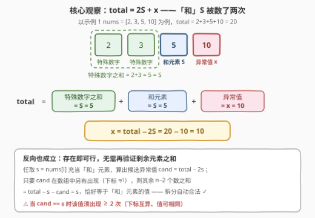
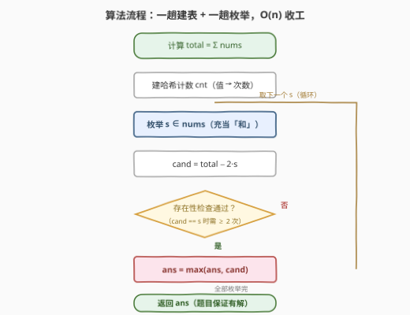
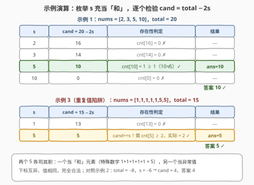

# 识别数组中的最大异常值

- **题目名称**：识别数组中的最大异常值
- **链接**：[3371. 识别数组中的最大异常值](https://leetcode.cn/problems/identify-the-largest-outlier-in-an-array/)
- **难度**：中等
- **标签**：数组、哈希表、计数、枚举
- **关联**：与 [1995. 统计特殊四元组](https://leetcode.cn/problems/count-special-quadruplets/)（[站内题解](../1901-2000/1995_统计特殊四元组.md)）同为「数值和恒等式 + 哈希存在性」——等式从 $a+b+c=d$ 换成 $\text{total} = 2S + x$，一个恒等式把 $O(n^2)$ 的双下标枚举压成 $O(n)$ 单趟扫描

## 1. 题目概述

给你一个整数数组 `nums`。该数组包含 $n$ 个元素，其中**恰好**有 $n - 2$ 个元素是**特殊数字**。剩下的**两个**元素中，一个是所有**特殊数字**的**和**，另一个是**异常值**。

**异常值**的定义是：既不是原始特殊数字之一，也不是表示元素和的那个数。

**注意**：特殊数字、和以及异常值的**下标**必须**不同**，但可以共享**相同**的值。

返回 `nums` 中可能的**最大异常值**。

**示例 1**：

```text
输入：nums = [2,3,5,10]
输出：10
解释：特殊数字可以是 2 和 3，因此和为 5，异常值为 10。
```

**示例 2**：

```text
输入：nums = [-2,-1,-3,-6,4]
输出：4
解释：特殊数字可以是 -2、-1 和 -3，因此和为 -6，异常值为 4。
```

**示例 3**：

```text
输入：nums = [1,1,1,1,1,5,5]
输出：5
解释：特殊数字可以是 1、1、1、1 和 1，因此和为 5，另一个 5 为异常值。
```

**约束条件**：

- $3 \le nums.length \le 10^5$
- $-1000 \le nums[i] \le 1000$
- 输入保证 `nums` 中至少存在**一个**可能的异常值

> 💡 **读题关键**：① 三类角色——$n-2$ 个**特殊数字**、1 个**和元素**（值恰等于特殊数字之和）、1 个**异常值**——三者**下标互不相同**，但**值可以重复**（示例 3 就是命题人挖好的坑）；② 问的是「**可能的最大**异常值」——同一数组也许有多种合法拆分，要取所有合法拆分中异常值的最大者；③ $n$ 高达 $10^5$，$O(n^2)$ 的双下标枚举（约 $10^{10}$ 次运算）必然超时，至少需要 $O(n \log n)$ 以内的做法。

---

## 2. 解题思路

### 2.1 暴力思路：枚举两个「特殊角色」的下标

最直接的暴力：枚举哪两个下标 $i$、$j$ 分别充当「和元素」与「异常值」，再验证其余 $n-2$ 个元素之和是否恰好等于 $nums[i]$（或对称地等于 $nums[j]$）。

- 朴素写法：$O(n^2)$ 对组合 × $O(n)$ 求和验证 = $O(n^3)$；
- 用**前缀和**把验证降到 $O(1)$，仍有 $O(n^2)$ 对组合——$n = 10^5$ 时约 $10^{10}$，必挂。

> 💡 暴力的浪费在于：**「和元素」一旦确定，异常值就被数组总和唯一锁死**——根本不需要枚举第二个下标。这正是下面的突破口。

### 2.2 核心观察：总和恒等式 total = 2S + x



**观察一（S 被数了两次）**：设特殊数字之和为 $S$、异常值为 $x$。把整个数组加起来时：

- $n-2$ 个特殊数字贡献了 $S$；
- **和元素的值也是 $S$**，又贡献了一次；
- 异常值贡献 $x$。

于是有恒等式 $\text{total} = S + S + x = 2S + x$，移项即得：

$$x = \text{total} - 2S$$

**观察二（枚举 S，一步锁定 x）**：$S$ 必然是数组中的某个元素（和元素就在数组里），于是只需枚举每个 $nums[i]$ 充当 $S$，$O(1)$ 算出候选异常值 $\text{cand} = \text{total} - 2 \cdot nums[i]$，再用**哈希表**判断 `cand` 是否在数组中出现。

**观察三（存在即合法，无需再验证）**：这是最妙的一步——只要 `cand` 在数组中「另有出现」（下标 $\ne i$），这个拆分就**自动合法**：

> 设 `cand` 出现在下标 $j \ne i$。其余 $n-2$ 个元素之和 $= \text{total} - nums[i] - nums[j] = \text{total} - S - (\text{total} - 2S) = S = nums[i]$，恰好等于「和元素」的值。所以「$nums[i]$ 当和、$nums[j]$ 当异常值、其余当特殊数字」是完整合法的拆分，**无需任何额外验证**。

反过来，每个合法拆分也都会被枚举到：合法拆分中的和元素一定会被枚举为 $s$，对应的真实异常值一定会被算成 `cand` 且在哈希表中命中。双向闭合，所以「取所有通过存在性检查的 `cand` 的最大值」就是答案。

**观察四（重复值陷阱）**：「下标必须不同，值可以相同」——当 $\text{cand} = nums[i]$ 时，不能拿 $nums[i]$ **自己**充当异常值，必须要求该值**出现至少两次**（一次当和、一次当异常值）；当 $\text{cand} \ne nums[i]$ 时出现一次即可。判重条件统一写成：

$$cnt[\text{cand}] \ge \begin{cases} 2, & \text{cand} = s \\ 1, & \text{cand} \ne s \end{cases}$$

示例 3 `[1,1,1,1,1,5,5]` 正是这个坑：枚举 $s = 5$ 时 $\text{cand} = 15 - 10 = 5$，全靠数组里有两个 5 才成立。

> ⚠️ **高频翻车点**：
>
> - **忘记同值修正**——把 `cand == s` 也只查 `cnt ≥ 1`，或干脆漏判，`[1,1,1,1,1,5,5]` 这类用例必挂；
> - **`ans` 初始化成 0**——异常值可以为负（如 `[-10, 5, 5]` 唯一合法的异常值是 $-10$），应初始化为 $-\infty$；
> - **枚举对象搞反**——枚举「异常值」反解 $S = (\text{total} - x) / 2$ 需要额外判奇偶，不如枚举「和」干净（见第 5 节）。

### 2.3 算法流程图



两趟线性扫描：第一趟累加 `total` 并建哈希计数 `cnt`；第二趟枚举每个元素充当「和」，算出 `cand = total − 2s`，做带同值修正的存在性检查，通过则刷新最大值。

### 2.4 示例演算



以示例 1 和示例 3 为例（示例 2 `total = −8`，`s = −6` 时 `cand = 4` 命中，答案 4，同理）：

- **示例 1** `[2,3,5,10]`，`total = 20`：$s=2 \to 16$✗、$s=3 \to 14$✗、$s=5 \to 10$✓（`cnt[10]=1`，$10 \ne 5$）、$s=10 \to 0$✗，答案 **10**；
- **示例 3** `[1,1,1,1,1,5,5]`，`total = 15`：$s=1 \to 13$✗、$s=5 \to 5$，此时 `cand == s`，需 `cnt[5] ≥ 2`，实际恰好有两个 5——一个当和元素（$1+1+1+1+1=5$）、一个当异常值，✓，答案 **5**。

---

## 3. 参考代码

### C++

```cpp
class Solution {
  public:
    int getLargestOutlier(vector<int>& nums) {
        long long total = accumulate(nums.begin(), nums.end(), 0LL);
        unordered_map<int, int> cnt;
        for (int x : nums) cnt[x]++;

        int ans = INT_MIN;                       // 异常值可能为负，初始化 −∞
        for (int s : nums) {                     // 枚举 s 充当「和」元素
            int cand = int(total - 2LL * s);     // 对应的异常值候选
            auto it = cnt.find(cand);
            if (it == cnt.end()) continue;
            int need = (cand == s) ? 2 : 1;      // 同值时须出现两次
            if (it->second >= need) ans = max(ans, cand);
        }
        return ans;
    }
};
```

### Python

```python
class Solution:
    def getLargestOutlier(self, nums: List[int]) -> int:
        total = sum(nums)
        cnt = Counter(nums)

        ans = float('-inf')                      # 异常值可能为负，初始化 −∞
        for s in nums:                           # 枚举 s 充当「和」元素
            cand = total - 2 * s                 # 对应的异常值候选
            need = 2 if cand == s else 1         # 同值时须出现两次
            if cnt.get(cand, 0) >= need:
                ans = max(ans, cand)
        return ans
```

> 💡 **实现细节**：① `total` 用 64 位是防溢出习惯（$|total| \le 10^8$ 其实 `int` 也放得下）；② `cand` 可能远超 $[-1000, 1000]$ 的值域，哈希表查不到自动跳过，无需判界；③ 题目保证至少存在一个异常值，`ans` 必然被更新，直接返回即可。

---

## 4. 复杂度分析

| 维度 | 复杂度 | 说明 |
|------|--------|------|
| 时间 | $O(n)$ | 两趟线性扫描：建计数表 + 枚举「和」元素，每次 $O(1)$ 查表 |
| 空间 | $O(n)$ | 哈希表存「值 → 出现次数」；换成值域桶为 $O(V)$，$V = 2001$ |
| 暴力对照 | $O(n^2)$（前缀和优化后） | 枚举两个特殊下标；朴素验证为 $O(n^3)$ |

---

## 5. 扩展：值域桶与「枚举异常值」的对称写法

**值域桶**：由 $|nums[i]| \le 1000$ 可知值域只有 2001 个整数，可用长度 2001 的计数数组（下标 = 值 + 1000）替代哈希表，常数更小。注意 `cand = total − 2s` 的范围可达 $\pm 10^8$，落桶前先判界：

```python
cnt = [0] * 2001
for x in nums:
    cnt[x + 1000] += 1
for s in nums:
    cand = total - 2 * s
    if -1000 <= cand <= 1000 and cnt[cand + 1000] >= (2 if cand == s else 1):
        ans = max(ans, cand)
```

**对称写法（枚举异常值）**：也可以枚举每个元素 $x$ 充当异常值，反解 $S = (\text{total} - x) / 2$：需要先判 $\text{total} - x$ 为**偶数**，再查 $S$ 是否在数组中出现（同样带同值修正）。与枚举 $S$ 完全等价，但多一步奇偶判断——推荐枚举 $S$ 的写法，`cand = total − 2s` 永远是整数，干净利落。

**为什么不担心「假阳性」**：直觉上容易怀疑「存在性检查会不会把不合法的 `cand` 误判为异常值」——不会。2.2 观察三已证：只要 `cand` 另有出现，剩余元素之和由恒等式自动等于 $s$，「和元素」名副其实。存在性与合法性在本题里是**同一件事**。

---

## 6. 面试要点

1. **总和恒等式是怎么来的？为什么 S 被数两次？**

   - $\text{total} = \underbrace{S}_{\text{特殊数字之和}} + \underbrace{S}_{\text{和元素的值}} + x = 2S + x$。和元素的值就是 $S$ 本身，所以 $S$ 在总和中出现两次；移项 $x = \text{total} - 2S$，把「找异常值」变成「知 $S$ 求 $x$」。

2. **枚举 s 之后只查存在性，为什么不用验证剩余元素之和？**

   - 设 $\text{cand} = \text{total} - 2s$ 出现在下标 $j \ne i$，其余元素之和 $= \text{total} - s - \text{cand} = s$，恰好等于和元素的值——合法性由恒等式**自动保证**；反之每个合法拆分也都会被枚举到。双向闭合，不会漏也不会误报。

3. **示例 3 的 [1,1,1,1,1,5,5] 考察什么？**

   - 「下标互异、值可相同」：$s = 5$ 时 $\text{cand} = 5$，需要该值出现 $\ge 2$ 次才能一个当和、一个当异常值。判重条件 $cnt[\text{cand}] \ge (\text{cand} = s\ ?\ 2 : 1)$。

4. **答案初始化为什么不能是 0？**

   - 异常值可以是负数（如 `[-10, 5, 5]` 唯一合法的异常值是 $-10$），初始化应为 $-\infty$；题目保证有解，无需处理无解分支。

5. **复杂度是多少？能否不用哈希表？**

   - 时间 $O(n)$、空间 $O(n)$。值域 $|x| \le 1000$，用 2001 长度的计数数组可降到 $O(V)$ 空间且常数更小；理论上排序 + 二分查存在性也行（$O(n \log n)$），但属多此一举。

---

## 7. 同类练习题

- [1. 两数之和](https://leetcode.cn/problems/two-sum/)（[站内题解](../0001-0100/1_两数之和.md)）：哈希存在性判定的开山题，「target − x 是否出现过」与本题「cand 是否出现过」同一手法
- [1995. 统计特殊四元组](https://leetcode.cn/problems/count-special-quadruplets/)（[站内题解](../1901-2000/1995_统计特殊四元组.md)）：$a+b+c=d$ 的和恒等式 + 哈希计数，本题的小数据枚举版亲戚
- [454. 四数相加 II](https://leetcode.cn/problems/4sum-ii/)（[站内题解](../0401-0500/454_四数相加 II.md)）：把四元和等式拆成两半 + 哈希计数，「等式约束 + 哈希找补集」的成熟形态
- [724. 寻找数组的中心下标](https://leetcode.cn/problems/find-pivot-index/)（[站内题解](../0701-0800/724_寻找数组的中心下标.md)）：前缀和 = 总和 − 前缀和 的恒等式，用总和消去一侧的扫描
- [1013. 将数组分成和相等的三个部分](https://leetcode.cn/problems/partition-array-into-three-parts-with-equal-sum/)（[站内题解](../1001-1100/1013_将数组分成和相等的三个部分.md)）：每段和 = total/3 的分段和恒等式，同样是「总和定，局部和随之锁定」
