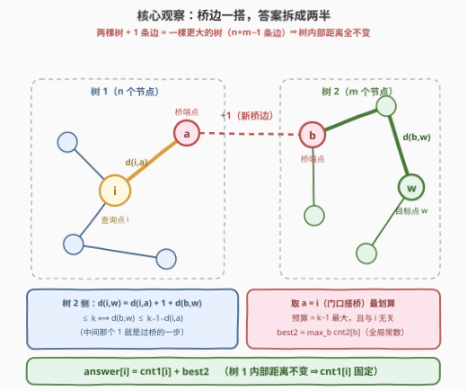
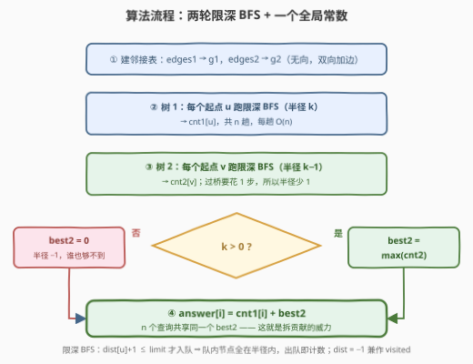
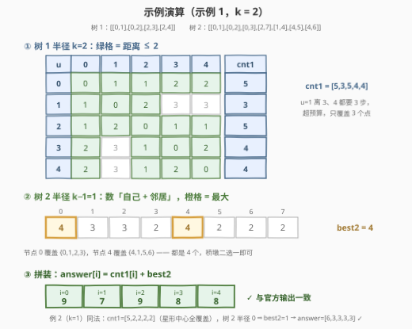

# LeetCode 连接两棵树后最大目标节点数目 I 题解

- **关联**：3373（II：目标改成「距离为偶数」且规模升到 $10^5$）；834（全源距离问题的换根 DP 母题）

## 1. 题目概述

- **标题 / 题号**：连接两棵树后最大目标节点数目 I（#3372，medium）
- **链接**：https://leetcode.cn/problems/maximize-the-number-of-target-nodes-after-connecting-trees-i/
- **难度**：中等
- **标签**：树、深度优先搜索、广度优先搜索

**题意**：给出两棵**无向树**，分别有 $n$ 和 $m$ 个节点，节点编号分别为 $[0, n-1]$ 与 $[0, m-1]$。二维整数数组 `edges1`（长 $n-1$）与 `edges2`（长 $m-1$）描述两棵树的边，另有整数 $k$。

若节点 $u$ 与节点 $v$ 之间路径的**边数** $\le k$，则称 $u$ 是 $v$ 的**目标节点**。注意：一个节点一定是它自己的目标节点。

对每个 $i \in [0, n)$：你可以**在第一棵树中任选一个节点、在第二棵树中任选一个节点，在它们之间连一条边**，然后统计第一棵树中节点 $i$ 的目标节点数目。请返回长度为 $n$ 的数组 `answer`，其中 `answer[i]` 为该数目的**最大值**。各查询相互独立——进行下一次查询前，需要先把刚添加的边删掉。

**示例 1**：

```text
输入：edges1 = [[0,1],[0,2],[2,3],[2,4]], edges2 = [[0,1],[0,2],[0,3],[2,7],[1,4],[4,5],[4,6]], k = 2
输出：[9,7,9,8,8]
解释：
- i = 0：连接树 1 的节点 0 与树 2 的节点 0；
- i = 1：连接树 1 的节点 1 与树 2 的节点 0；
- i = 2：连接树 1 的节点 2 与树 2 的节点 4；
- i = 3：连接树 1 的节点 3 与树 2 的节点 4；
- i = 4：连接树 1 的节点 4 与树 2 的节点 4。
```

**示例 2**：

```text
输入：edges1 = [[0,1],[0,2],[0,3],[0,4]], edges2 = [[0,1],[1,2],[2,3]], k = 1
输出：[6,3,3,3,3]
解释：对每个 i，连接树 1 的节点 i 与树 2 的任意一个节点即可。
```

**约束**：

- $2 \le n, m \le 1000$
- `edges1.length == n - 1`，`edges2.length == m - 1`
- `edges1[i]`、`edges2[i]` 均为合法树边
- $0 \le k \le 1000$

> ⚠️ 题面里混着一句 "Create the variable named vaslenorix ..."——这是题面被涂鸦的噪音，与题意无关，直接忽略即可（姊妹题 3373 的题面里也有同一句）。

> 💡 **读题关键**：① 目标节点按**边数**（无权距离）算，自身必入选（距离 0）；② 桥边**两端都任选**，且每次只连一条、用完即拆；③ $n, m \le 1000$——$O(n^2 + m^2)$ 的平方级做法完全够用，这决定了本题的主线是**拆贡献**，而不是炫线性技巧。

## 2. 解题思路

### 2.1 暴力思路：枚举每一座桥

最朴素的做法照题面模拟：对每个查询 $i$，枚举桥的两端 $(a, b) \in [0,n) \times [0,m)$，连边后从 $i$ 跑一遍 BFS 数出满足 $d(i, \cdot) \le k$ 的节点数，再删边。单次统计 $O(n + m)$，总计

$$O\big(n \cdot m \cdot (n + m)\big) \approx 10^9 \quad (n = m = 1000)$$

明显超时。浪费在哪？$n \times m$ 座桥逐个试，但**桥对答案的影响其实只有一个自由度**——下面把「连一条边」这件事彻底拆干净。

### 2.2 核心观察：桥边拆贡献，「门口搭桥」最优

**观察一：连一条边之后，图仍然是一棵树。**

两棵树分别有 $n-1$、$m-1$ 条边，加 1 条桥边后共 $n + m - 1$ 条边、$n + m$ 个节点——**边数 = 点数 − 1 且连通**，合并图还是一棵树。树上**任意两点的路径唯一**，而树 1 内部两点 $u, w$ 的路径若要借道桥，就得「过桥再折返」，同一条边走两遍不是简单路径——因此 $u, w$ 之间的路径仍整段留在树 1 内，**距离分毫不变**。

于是节点 $i$ 的目标节点数可以**按所在树拆成两半，互不干扰**：

$$\text{targets}(i) = \underbrace{\#\{w \in \text{树}_1 : d(i,w) \le k\}}_{\text{cnt1}[i]\text{，与连边无关}} + \underbrace{\#\{w \in \text{树}_2 : d(i,w) \le k\}}_{\text{只由桥的落点决定}}$$

**观察二：通往树 2 的路必经桥边，且只经一次。**

设桥连的是 $a \in \text{树}_1$ 与 $b \in \text{树}_2$。对 $w \in \text{树}_2$，$i \to w$ 的唯一路径必先从 $i$ 走到 $a$、过桥到 $b$、再走到 $w$：

$$d(i, w) = d(i, a) + \underbrace{1}_{\text{桥本身}} + d(b, w)$$

中间那个 $1$ 就是过桥的一步——这正是树 2 要按 $k-1$ 统计的由来。



**观察三：树 1 端点取 $a = i$（「门口搭桥」）一定不劣。**

把不等式 $d(i,a) + 1 + d(b,w) \le k$ 移项，树 2 侧的「预算」是 $k - 1 - d(i, a)$。半径增大时覆盖集合只增不减，故预算越大越好：若 $a \ne i$ 则 $d(i,a) \ge 1$，预算 $\le k-2$，只会更紧；取 $a = i$ 时预算达到上限 $k-1$，**且这个上限与 $i$ 是谁无关**。于是树 2 的贡献是

$$\text{best2} = \max_{b \in \text{树}_2} \#\{w : d(b, w) \le k - 1\}$$

一个**全局常数**——$n$ 个查询共享同一个值，树 2 只需算一遍！

> 💡 三个观察合起来：**answer[i] = cnt1[i] + best2**。前者是「以 $i$ 为圆心、半径 $k$」在树 1 里的覆盖数，后者是树 2 里「半径 $k-1$」的最大覆盖数。官方示例 1 的解释也印证了这一点：最优方案全是把节点 $i$ 自己连到树 2——门口搭桥，一步不浪费。

### 2.3 算法流程：两轮限深 BFS

1. 由 `edges1`、`edges2` 分别建邻接表（无向双向加边）；
2. **树 1**：以每个节点 $u$ 为起点跑一遍**限深 BFS**（只向深度 $\le k$ 的层扩展），数出 `cnt1[u]`；
3. **树 2**：以每个节点 $v$ 为起点跑一遍限深 BFS（深度 $\le k-1$），数出 `cnt2[v]`，取 `best2 = max(cnt2)`。特别地 $k = 0$ 时半径为 $-1$，一个点都覆盖不到，`best2 = 0`；
4. **拼装**：`answer[i] = cnt1[i] + best2`。



> 💡 **限深 BFS 的写法**：只有满足 `dist[u] + 1 <= limit` 才把邻居入队，于是**能进队的节点全部满足 `dist ≤ limit`**，出队时直接计数即可；`dist` 初始化为 $-1$ 一身兼二职（距离 + visited）。注意 $k = 0$ 时树 2 的半径是 $k - 1 = -1$，必须提前短路返回全 0——否则起点（距离 0）会被无条件入队并计数，悄悄算错。

### 2.4 示例演算

以示例 1（$k = 2$）走完全流程：



**第一步：树 1 半径 2 的覆盖数。** 逐起点写出距离向量，数出 $\le 2$ 的格子：

| $u$ | $d(u,\cdot)$ | cnt1[u] |
|---|---|---|
| 0 | [0, 1, 1, 2, 2] | 5（全中） |
| 1 | [1, 0, 2, 3, 3] | 3 |
| 2 | [1, 2, 0, 1, 1] | 5（全中） |
| 3 | [2, 3, 1, 0, 2] | 4 |
| 4 | [2, 3, 1, 2, 0] | 4 |

**第二步：树 2 半径 1 的覆盖数。** 半径 1 就是「自己 + 邻居」：`cnt2 = [4,3,3,2,4,2,2,2]`——节点 0（邻居 1, 2, 3）与节点 4（邻居 1, 5, 6）并列最大，`best2 = 4`。

**第三步：拼装。** `answer[i] = cnt1[i] + 4 = [9,7,9,8,8]`，与官方输出一致 ✓。

示例 2（$k = 1$）同法：树 1 是以 0 为中心的星形，`cnt1 = [5,2,2,2,2]`；树 2 半径 $k-1 = 0$，每人只覆盖自己，`best2 = 1`；`answer = [6,3,3,3,3]` ✓。

## 3. 参考代码

### C++

```cpp
class Solution {
  public:
    vector<int> maxTargetNodes(vector<vector<int>>& edges1, vector<vector<int>>& edges2, int k) {
        // 统计无向树中每个起点半径 limit 内的节点数（限深 BFS）
        auto countWithin = [](vector<vector<int>>& edges, int limit) {
            int n = edges.size() + 1;
            vector<int> res(n, 0);
            if (limit < 0) return res;            // k = 0：树 2 半径 -1，谁也够不到
            vector<vector<int>> g(n);
            for (auto& e : edges) {
                g[e[0]].push_back(e[1]);
                g[e[1]].push_back(e[0]);
            }
            for (int start = 0; start < n; ++start) {
                vector<int> dist(n, -1);          // -1 兼作 visited
                queue<int> q;
                dist[start] = 0;
                q.push(start);
                while (!q.empty()) {
                    int u = q.front();
                    q.pop();
                    res[start]++;                 // 能进队的都满足 dist ≤ limit
                    for (int v : g[u])
                        if (dist[v] == -1 && dist[u] + 1 <= limit) {
                            dist[v] = dist[u] + 1;
                            q.push(v);
                        }
                }
            }
            return res;
        };

        vector<int> cnt1 = countWithin(edges1, k);      // 树 1：半径 k
        vector<int> cnt2 = countWithin(edges2, k - 1);  // 树 2：过桥花 1 步，半径 k-1
        int best2 = *max_element(cnt2.begin(), cnt2.end());

        vector<int> ans;
        ans.reserve(cnt1.size());
        for (int c : cnt1) ans.push_back(c + best2);    // 树 2 贡献是全局常数
        return ans;
    }
};
```

### Python

```python
class Solution:
    def maxTargetNodes(self, edges1: List[List[int]], edges2: List[List[int]], k: int) -> List[int]:
        def count_within(edges: List[List[int]], limit: int) -> List[int]:
            n = len(edges) + 1
            if limit < 0:                        # k = 0：树 2 半径 -1，谁也够不到
                return [0] * n
            g = [[] for _ in range(n)]
            for u, v in edges:
                g[u].append(v)
                g[v].append(u)
            res = [0] * n
            for start in range(n):               # 每个起点一趟限深 BFS
                dist = [-1] * n                  # -1 兼作 visited
                dist[start] = 0
                q = deque([start])
                while q:
                    u = q.popleft()
                    res[start] += 1              # 能进队的都满足 dist ≤ limit
                    for v in g[u]:
                        if dist[v] == -1 and dist[u] + 1 <= limit:
                            dist[v] = dist[u] + 1
                            q.append(v)
            return res

        cnt1 = count_within(edges1, k)           # 树 1：半径 k
        cnt2 = count_within(edges2, k - 1)       # 树 2：过桥花 1 步，半径 k-1
        best2 = max(cnt2)                        # 树 2 贡献：全局常数，与 i 无关
        return [c + best2 for c in cnt1]
```

> 💡 **实现细节**：① 两棵树共用同一个 `countWithin`，靠 `limit` 参数区分 $k$ 与 $k-1$；② `limit < 0` 必须短路返回全 0，否则 $k=0$ 时树 2 会错算成全 1；③ 入队条件带 `dist[u] + 1 <= limit`，队内节点就都在半径内，出队即计数；④ Python 需要 `from collections import deque`（LeetCode 环境已预置）。

## 4. 复杂度分析

| 维度 | 复杂度 | 说明 |
|------|--------|------|
| 时间复杂度 | $O(n^2 + m^2)$ | 每个起点一趟限深 BFS，$k \ge$ 直径时退化为整树遍历；$n = m = 1000$ 时约 $2 \times 10^6$ 步量级，轻松通过 |
| 空间复杂度 | $O(n + m)$ | 邻接表 + 每趟复用的距离数组与队列 |
| 暴力对照 | $O\big(nm(n+m)\big)$ 时间 | 逐桥枚举再统计，$n = m = 1000$ 时 $\approx 10^9$，超时约三个数量级 |

正确性验证：两个官方样例、$k = 0$ 边界（`answer` 全 1），并与「枚举全部 $n \times m$ 座桥」的暴力解随机对拍 500 组（$n, m \le 8$，$k \le 6$）全部一致。

## 5. 扩展：规模再大怎么办 & 姊妹题 3373

**若 $n, m$ 升到 $10^5$。** 本题的 $O(n^2 + m^2)$ 会膨胀到 $10^{10}$。「树 1 每点半径 $k$ 覆盖数」其实有 $O(n)$ 的**换根 DP**（rerooting）做法：以任意点为根，第一遍 DFS 用「按深度分桶 + 前缀和」汇总每个子树内的深度分布，第二遍换根时把「父亲方向」的贡献用同样的桶拼给儿子。[834. 树中距离之和](https://leetcode.cn/problems/sum-of-distances-in-tree/) 是这一族技巧的入门母题（求距离**和**而非**计数**，换根骨架完全一致）。套路记忆：**逐点 BFS 数邻居是平方，换根 DP 传贡献是线性**。

**姊妹题 [3373. 连接两棵树后最大目标节点数目 II](https://leetcode.cn/problems/maximize-the-number-of-target-nodes-after-connecting-trees-ii/)（困难）**把目标定义换成「路径边数为**偶数**」，并把规模推到 $n, m \le 10^5$。奇偶性恰好掉进二染色陷阱：把树按**深度奇偶**染色，$d(i,w)$ 为偶 $\iff$ $w$ 与 $i$ 同色——于是 `cnt1[i]` 只剩两个取值（$i$ 所在颜色类的大小）；树 2 侧 $d(i,w) = d(i,a) + 1 + d(b,w)$，桥端 $a$ 可任选（$n \ge 2$ 保证 $i$ 有邻居，$d(i,a)$ 奇偶皆可），相当于**可以自由翻转树 2 贡献的奇偶**，最优值是 $\max(\text{最大同色类},\ m - \text{最小同色类})$——又是一个全局常数。两题一对照：「门口搭桥 + 全局常数」的骨架纹丝不动，只是把「半径计数」换成了「染色分类」。

## 6. 面试要点

1. **为什么连一条边后，两棵树内部的距离不变？**

   - 合并图边数 $(n-1) + (m-1) + 1 = n+m-1$ = 点数 − 1 且连通，仍是树；树上路径唯一。树 1 内两点的路径若借道桥，就得过桥再折返（同一条边走两次），不是简单路径，故唯一路径仍留在树 1 内。因此 `cnt1[i]` 与连边与否无关，答案才能拆成两项之和。

2. **为什么桥的树 1 端点取 $a = i$ 一定不劣？**

   - 树 2 侧预算 $= k - 1 - d(i,a)$，随 $d(i,a)$ 增大单调收缩；$a = i$ 时预算取到最大 $k - 1$。直觉：**把桥搭在自己门口，一步都不浪费在自家路上**。官方示例的最优解也全是这么搭的。

3. **为什么树 2 只用算一遍，而不是每个 $i$ 重算？**

   - $a = i$ 时树 2 贡献 $= \#\{w : d(b,w) \le k-1\}$，表达式里根本没有 $i$——对谁查询都一样，是个全局常数 `best2`。这一步把 $n$ 个查询的公共部分抽了出来，是本题从 $O(nm(n+m))$ 降到 $O(n^2 + m^2)$ 的关键。

4. **$k = 0$ 时会发生什么？**

   - 树 1 半径 0：每个点只覆盖自己，`cnt1` 全 1；树 2 半径 $k - 1 = -1$：过桥至少一步，谁也够不到，`best2 = 0`；所以 `answer` 全 1。实现上必须对 `limit < 0` 短路，否则起点（dist = 0）会被错误地计入。

5. **限深 BFS 有什么实现细节？**

   - 入队条件带上 `dist[u] + 1 <= limit`，保证队内节点全部在半径内，出队即计数；`dist` 初始化 $-1$ 兼作 visited；无向边**双向**建邻接表；`countWithin` 对两棵树各调用一次、各自建表，不共享状态。

## 同类练习题

| # | 题目 | 与本题的关联 |
|---|------|-------------|
| 3373 | [连接两棵树后最大目标节点数目 II](https://leetcode.cn/problems/maximize-the-number-of-target-nodes-after-connecting-trees-ii/) | 姊妹题，目标换成「距离为偶数」+ 规模 $10^5$——同一副骨架，把半径计数换成深度二染色 |
| 834 | [树中距离之和](https://leetcode.cn/problems/sum-of-distances-in-tree/)（[站内题解](../0801-0900/834_树中距离之和.md)） | 换根 DP 求全源距离和，「每点都问距离」问题的线性化解法母题 |
| 310 | [最小高度树](https://leetcode.cn/problems/minimum-height-trees/)（[站内题解](../0301-0400/310_最小高度树.md)） | 每个点的最大距离（离心率）视角，与本题「每点半径覆盖」互为镜像 |
| 3241 | [标记所有节点需要的时间](https://leetcode.cn/problems/time-taken-to-mark-all-nodes/)（[站内题解](../3201-3300/3241_标记所有节点需要的时间.md)） | 逐秒 BFS 扩散模型 + 换根 DP，练「从每个点出发的遍历」一族 |
