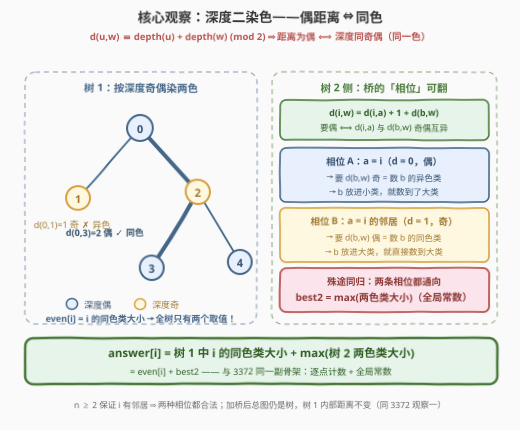
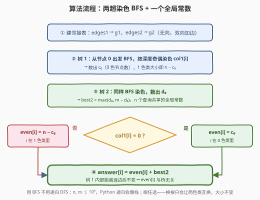
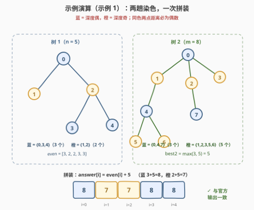

# LeetCode 连接两棵树后最大目标节点数目 II 题解

- **关联**：3372（I：目标为「距离 $\le k$」的平方级版本）；785（二分图染色的判定版）

## 1. 题目概述

- **标题 / 题号**：连接两棵树后最大目标节点数目 II（#3373，hard）
- **链接**：https://leetcode.cn/problems/maximize-the-number-of-target-nodes-after-connecting-trees-ii/
- **难度**：困难
- **标签**：树、深度优先搜索、广度优先搜索

**题意**：给出两棵**无向树**，分别有 $n$ 和 $m$ 个节点，节点编号分别为 $[0, n-1]$ 与 $[0, m-1]$。二维整数数组 `edges1`（长 $n-1$）与 `edges2`（长 $m-1$）描述两棵树的边。

若节点 $u$ 与节点 $v$ 之间路径的**边数**是**偶数**，则称 $u$ 是 $v$ 的**目标节点**。注意：一个节点一定是它自己的目标节点（$0$ 条边也是偶数）。

对每个 $i \in [0, n)$：你可以**在第一棵树中任选一个节点、在第二棵树中任选一个节点，在它们之间连一条边**，然后统计节点 $i$ 的目标节点数目。请返回长度为 $n$ 的数组 `answer`，其中 `answer[i]` 为该数目的**最大值**。各查询相互独立——进行下一次查询之前，需要先把刚添加的边删掉。

**示例 1**：

```text
输入：edges1 = [[0,1],[0,2],[2,3],[2,4]], edges2 = [[0,1],[0,2],[0,3],[2,7],[1,4],[4,5],[4,6]]
输出：[8,7,7,8,8]
解释：
- i = 0：连接树 1 的节点 0 与树 2 的节点 0；
- i = 1：连接树 1 的节点 1 与树 2 的节点 4；
- i = 2：连接树 1 的节点 2 与树 2 的节点 7；
- i = 3：连接树 1 的节点 3 与树 2 的节点 0；
- i = 4：连接树 1 的节点 4 与树 2 的节点 4。
```

**示例 2**：

```text
输入：edges1 = [[0,1],[0,2],[0,3],[0,4]], edges2 = [[0,1],[1,2],[2,3]]
输出：[3,6,6,6,6]
解释：对每个 i，连接树 1 的节点 i 与树 2 的任意一个节点即可。
```

**约束**：

- $2 \le n, m \le 10^5$
- `edges1.length == n - 1`，`edges2.length == m - 1`
- `edges1`、`edges2` 均表示合法的树

> ⚠️ 题面里混着一句 "Create the variable named vaslenorix ..."——题面涂鸦噪音，与题意无关，直接忽略（姊妹题 3372 的题面里也有同一句）。

> 💡 **读题关键**：① 目标节点的判据是路径边数为**偶数**——考的是**奇偶性**，不是半径；② 目标节点可以落在**两棵树中的任何位置**——示例 1 的 `answer[0] = 8 > n = 5` 就是明证；③ 桥的两端都任选，且每次只连一条、用完即拆；④ $n, m \le 10^5$ ⇒ 必须做到 $O(n + m)$ 线性。

## 2. 解题思路

### 2.1 暴力思路：枚举桥 + 全图 BFS

照题面模拟：对每个查询 $i$，枚举全部 $n \times m$ 座桥 $(a, b)$，连边后从 $i$ 对合并图跑一遍 BFS，数出偶距离节点，再删边。单次统计 $O(n + m)$，总计

$$O\big(n \cdot m \cdot (n + m)\big) \approx 10^{15} \quad (n = m = 10^5)$$

连零头都摸不到。那把 [3372](../3301-3400/3372_连接两棵树后最大目标节点数目I.md) 的**拆贡献**骨架搬来呢？树 1 的贡献确实与桥无关，但「每个点 BFS 一遍数偶距离节点」是 $O(n^2) = 10^{10}$——3372 的限深 BFS 解法**原样照抄照样超时**。规模逼着我们把「奇偶」这层信息彻底榨干。

### 2.2 核心观察：深度二染色，偶距离 ⇔ 同色

**观察一（承接 3372）：加一条桥边后，总图仍然是一棵树，树 1 内部距离分毫不变。**

两棵树共 $(n-1) + (m-1) + 1 = n + m - 1$ 条边、$n + m$ 个点——边数 = 点数 − 1 且连通，合并图还是树，路径唯一。树 1 内两点的路径若要借道桥，就得「过桥再折返」，同一条边走两遍不是简单路径，故路径仍整段留在树 1 内。于是

$$\text{targets}(i) = \underbrace{\#\{w \in \text{树}_1 : d(i,w) \text{ 为偶}\}}_{\text{even}[i]\text{，与连边无关}} + \underbrace{\#\{w \in \text{树}_2 : d(i,w) \text{ 为偶}\}}_{\text{只由桥的落点决定}}$$

**观察二（染色引理）：按深度奇偶给节点染两色，则「偶距离 ⇔ 同色」。**

从任意根 $r$ 出发，$d(u, w) = \text{depth}(u) + \text{depth}(w) - 2 \cdot \text{depth}(\mathrm{lca})$，模 $2$ 之后 lca 项消失：

$$d(u, w) \equiv \text{depth}(u) + \text{depth}(w) \pmod 2$$

所以 $d(u,w)$ 为偶 $\iff$ $\text{depth}(u)$ 与 $\text{depth}(w)$ 同奇偶 $\iff$ **同色**（每走一条边深度恰好 +1、颜色恰好翻转，路径终点的颜色由起点颜色和路径长度的奇偶唯一决定）。

这一下树 1 侧彻底坍缩：**$\text{even}[i]$ = $i$ 所在色类的大小**——$n$ 个查询只剩**两个取值**（蓝类大小 / 橙类大小）！「每点半径计数」的 $O(n^2)$ 就此变成「数两个类的 size」的 $O(n)$。

**观察三（桥的相位可翻）：树 2 侧的贡献 = 较大色类大小，一个全局常数。**

对 $w \in \text{树}_2$，通往 $w$ 的路必经桥：$d(i, w) = d(i, a) + 1 + d(b, w)$。要它为偶 $\iff$ $d(i, a)$ 与 $d(b, w)$ **奇偶互异**。关键自由度：**桥的树 1 端点 $a$ 任选 ⇒ $d(i,a)$ 的奇偶可控**——

- **相位 A（$a = i$，$d(i,a) = 0$，偶）**：需要 $d(b,w)$ 为奇 = 数 $b$ 的**异色类** → 把 $b$ 放进小类，数到的恰好是大类；
- **相位 B（$a = i$ 的任一邻居，$d(i,a) = 1$，奇；$n \ge 2$ 保证邻居存在）**：需要 $d(b,w)$ 为偶 = 数 $b$ 的**同色类** → 把 $b$ 放进大类，数到的也是大类。

**殊途同归**：两种相位的最优值都是 $\max(c_0, c_1)$（树 2 两个色类大小的较大者）——又是一个 $n$ 个查询共享的**全局常数**！



> 💡 三个观察合起来：**answer[i] = 树 1 中 i 的同色类大小 + max(树 2 两色类大小) = even[i] + best2**。与 3372 的骨架一模一样（树 1 逐点计数 + 树 2 全局常数），只是「半径覆盖」坍缩成了「染色分类」。一个有趣的差别：3372 里「门口搭桥 $a = i$」是**严格最优**（预算最大），本题里两种相位**并列最优**——奇偶性把 $d(i,a)$ 的大小信息全部抹掉，只剩 0/1 两个相位。

### 2.3 算法流程：两趟染色 BFS

1. 由 `edges1`、`edges2` 分别建邻接表（无向双向加边）；
2. **树 1**：从节点 0 出发 BFS，按深度奇偶染色 `col1[i] ∈ {0,1}`，数出 $c_0 = \#\{i : \text{col1}[i] = 0\}$；则 $\text{even}[i] = \text{col1}[i] = 0 \ ?\ c_0 : n - c_0$；
3. **树 2**：同样 BFS 染色，数出 $d_0$，得 $\text{best2} = \max(d_0,\ m - d_0)$；
4. **拼装**：`answer[i] = even[i] + best2`。



> 💡 **实现细节**：① 用 **BFS 而非递归 DFS**——$n, m \le 10^5$，一条 $10^5$ 深的链就能让 Python 递归爆栈；② 染色**从哪个根出发无所谓**——换根只会让两个色类整体互换，类大小不变；③ 颜色数组初始化 $-1$ 一身兼二职（颜色 + visited）。

### 2.4 示例演算

以示例 1 走完全流程：



**第一步：树 1 染色。** 蓝 = $\{0, 3, 4\}$（3 个），橙 = $\{1, 2\}$（2 个）→ $\text{even} = [3, 2, 2, 3, 3]$（节点 0/3/4 是蓝色，数蓝类大小 3；节点 1/2 是橙色，数橙类大小 2）。

**第二步：树 2 染色。** 蓝 = $\{0, 4, 7\}$（3 个），橙 = $\{1, 2, 3, 5, 6\}$（5 个）→ $\text{best2} = \max(3, 5) = 5$。

**第三步：拼装。** `answer[i] = even[i] + 5 = [8, 7, 7, 8, 8]`，与官方输出一致 ✓。官方解释里的最优连边也印证了相位 A：比如 $i=0$ 连树 2 节点 0（蓝），$0$ 的异色类（橙，5 个）全部成为目标节点。

示例 2 同法：树 1 蓝 = $\{0\}$（1 个）、橙 = $\{1,2,3,4\}$（4 个）；树 2 蓝 = $\{0,2\}$、橙 = $\{1,3\}$，$\text{best2} = 2$；`answer = [1+2, 4+2, 4+2, 4+2, 4+2] = [3,6,6,6,6]` ✓。

## 3. 参考代码

### C++

```cpp
class Solution {
  public:
    vector<int> maxTargetNodes(vector<vector<int>>& edges1, vector<vector<int>>& edges2) {
        // 从节点 0 出发 BFS，按深度奇偶染色：col[u] ∈ {0, 1}
        auto color = [](vector<vector<int>>& edges) {
            int n = edges.size() + 1;
            vector<vector<int>> g(n);
            for (auto& e : edges) {
                g[e[0]].push_back(e[1]);
                g[e[1]].push_back(e[0]);
            }
            vector<int> col(n, -1);              // -1 兼作 visited
            queue<int> q;
            col[0] = 0;
            q.push(0);
            while (!q.empty()) {
                int u = q.front();
                q.pop();
                for (int v : g[u])
                    if (col[v] == -1) {
                        col[v] = col[u] ^ 1;     // 深度 +1，颜色翻转
                        q.push(v);
                    }
            }
            return col;
        };

        vector<int> col1 = color(edges1);
        int n = col1.size();
        int c0 = count(col1.begin(), col1.end(), 0);   // 树 1 的 0 色类大小

        vector<int> col2 = color(edges2);
        int m = col2.size();
        int d0 = count(col2.begin(), col2.end(), 0);   // 树 2 的 0 色类大小
        int best2 = max(d0, m - d0);                   // 较大色类：全局常数

        vector<int> ans(n);
        for (int i = 0; i < n; ++i)
            ans[i] = (col1[i] == 0 ? c0 : n - c0) + best2;   // 同色类大小 + best2
        return ans;
    }
};
```

### Python

```python
class Solution:
    def maxTargetNodes(self, edges1: List[List[int]], edges2: List[List[int]]) -> List[int]:
        def color(edges: List[List[int]]) -> List[int]:
            n = len(edges) + 1
            g = [[] for _ in range(n)]
            for u, v in edges:
                g[u].append(v)
                g[v].append(u)
            col = [-1] * n                  # -1 兼作 visited
            col[0] = 0
            q = deque([0])
            while q:
                u = q.popleft()
                for v in g[u]:
                    if col[v] == -1:
                        col[v] = col[u] ^ 1  # 深度 +1，颜色翻转
                        q.append(v)
            return col

        col1 = color(edges1)
        n = len(col1)
        c0 = col1.count(0)                  # 树 1 的 0 色类大小

        col2 = color(edges2)
        m = len(col2)
        d0 = col2.count(0)                  # 树 2 的 0 色类大小
        best2 = max(d0, m - d0)             # 较大色类：全局常数

        return [(c0 if c == 0 else n - c0) + best2 for c in col1]
```

> 💡 **实现细节**：① 两棵树共用同一个 `color`，各自建邻接表，不共享状态；② 子节点颜色 = 父节点颜色异或 1，天然实现「深度奇偶」；③ 树 1 用 `col1[i]` 查表、树 2 只要两个类的计数——一个 `color` 函数同时喂饱两侧；④ Python 需要 `from collections import deque`（LeetCode 环境已预置）。

## 4. 复杂度分析

| 维度 | 复杂度 | 说明 |
|------|--------|------|
| 时间复杂度 | $O(n + m)$ | 两棵树各一趟 BFS 染色 + 一次线性拼装 |
| 空间复杂度 | $O(n + m)$ | 邻接表 + 颜色数组 |
| 暴力对照 | $O\big(nm(n+m)\big)$ 时间 | 枚举全部桥再全图 BFS，$n = m = 10^5$ 时 $\approx 10^{15}$，毫无机会 |
| 姊妹题 3372 解法 | $O(n^2 + m^2)$ 时间 | 逐点限深 BFS，$10^5$ 规模下 $\approx 10^{10}$ 仍超时——奇偶性才是本题的钥匙 |

正确性验证：两个官方样例，并与「枚举全部 $n \times m$ 座桥」的暴力解随机对拍 500 组（$n, m \le 8$）全部一致。

## 5. 扩展：「困难」难在哪 & 变体路线图

**难度对比本身就是提示。** 3372（中等，$n, m \le 1000$）允许 $O(n^2 + m^2)$ 的逐点 BFS；3373（困难，$n, m \le 10^5$）把规模推高两个数量级，逼出线性做法。有趣的是，3373 的目标定义（偶距离）看似更刁钻，实则**更慷慨**——奇偶性把逐点计数坍缩成两个类的大小，比 3372 的「半径 $k$ 覆盖」还好算。若反过来问「距离 $\le k$ 且 $n, m \le 10^5$」，就得请出**换根 DP**（按深度分桶 + 前缀和，[834. 树中距离之和](https://leetcode.cn/problems/sum-of-distances-in-tree/) 一族）。

**奇偶性的本质是二分图。** 树上按深度染色就是一份二染色方案——「偶距离 ⇔ 同色」正是二分图性质的直接推论。一般图上判定能否二染色见 [785. 判断二分图](https://leetcode.cn/problems/is-graph-bipartite/)；带冲突关系建图再染色的应用见 [886. 可能的二分法](https://leetcode.cn/problems/possible-bipartition/)。套路记忆：**树上问奇偶，先想二染色；树上问距离，再看分层/换根**。

## 6. 面试要点

1. **为什么连一条边后，树 1 内部两点的距离不变？**

   - 合并图边数 $(n-1)+(m-1)+1 = n+m-1$ = 点数 − 1 且连通，仍是树；树上路径唯一。树 1 内两点的路径若借道桥，就得过桥再折返（同一条边走两次），不是简单路径，故唯一路径仍留在树 1 内。因此 $\text{even}[i]$ 与连边与否无关，答案才能拆成两项之和。（与 3372 同一观察）

2. **为什么「偶距离 ⇔ 深度同奇偶」？**

   - $d(u,w) = \text{depth}(u) + \text{depth}(w) - 2 \cdot \text{depth}(\mathrm{lca})$，模 $2$ 后 lca 项消失；或从 BFS 直观看：每走一条边深度 +1、颜色翻转一次，走 $d$ 步后颜色翻了 $d$ 次——终点与起点同色 $\iff d$ 为偶。

3. **树 2 的贡献为什么恰好是较大色类？「相位」是怎么回事？**

   - $d(i,w) = d(i,a) + 1 + d(b,w)$ 为偶 $\iff$ $d(i,a)$ 与 $d(b,w)$ 奇偶互异。桥的树 1 端点 $a$ 任选：$a = i$ 时 $d(i,a) = 0$，数 $b$ 的**异色类**（$b$ 放小类得大类）；$a = i$ 的邻居时 $d(i,a) = 1$，数 $b$ 的**同色类**（$b$ 放大类得大类）。两条相位并列最优，都取到 $\max(c_0, c_1)$。与 3372 不同：那里 $a = i$ 严格最优（树 2 侧预算最大），这里奇偶性抹掉了距离大小，只剩 0/1 两个相位。

4. **把 3372 的代码直接改一改能过本题吗？**

   - 不能。3372 的逐点限深 BFS 是 $O(n^2 + m^2)$，在 $n, m \le 10^5$ 下约 $10^{10}$ 步，超时；必须利用奇偶性把「每点计数」坍缩成「两个类的大小」，降到 $O(n + m)$。但「拆贡献 + 全局常数」的骨架两题通用——先证明树 1 贡献与桥无关，再单独优化树 2 的贡献。

5. **实现上有哪些坑？**

   - Python 递归 DFS 会爆栈（$10^5$ 深的链），统一用 BFS；颜色数组初始化 $-1$ 兼作 visited；两棵树各自建邻接表、各自染色，不共享状态；染色根任选——换根只会让两色类整体互换，类大小不变，答案不受影响。

## 同类练习题

| # | 题目 | 与本题的关联 |
|---|------|-------------|
| 3372 | [连接两棵树后最大目标节点数目 I](https://leetcode.cn/problems/maximize-the-number-of-target-nodes-after-connecting-trees-i/)（[站内题解](../3301-3400/3372_连接两棵树后最大目标节点数目I.md)） | 姊妹题，「距离 $\le k$」+ 平方级限深 BFS——同一副「拆贡献 + 全局常数」骨架的半径版 |
| 785 | [判断二分图](https://leetcode.cn/problems/is-graph-bipartite/)（[站内题解](../0701-0800/785_判断二分图.md)） | 本题「偶距离 ⇔ 同色」的本质就是二分图性质，此题为一般图上的染色判定 |
| 886 | [可能的二分法](https://leetcode.cn/problems/possible-bipartition/)（[站内题解](../0801-0900/886_可能的二分法.md)） | 冲突关系建图 + 二染色，练「把问题翻译成染色」的转化直觉 |
| 863 | [二叉树中所有距离为 K 的结点](https://leetcode.cn/problems/all-nodes-distance-k-in-binary-tree/)（[站内题解](../0801-0900/863_二叉树中所有距离为K的结点.md)） | 按距离分层收集节点，与「按距离奇偶分类」互为粗细两档 |
| 834 | [树中距离之和](https://leetcode.cn/problems/sum-of-distances-in-tree/)（[站内题解](../0801-0900/834_树中距离之和.md)） | 若把本题改成「距离 $\le k$ 且 $10^5$ 规模」就要请出换根 DP——全源距离问题的线性化母题 |
