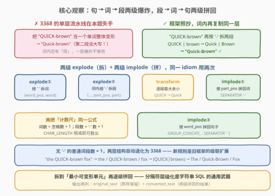
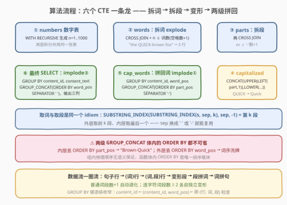
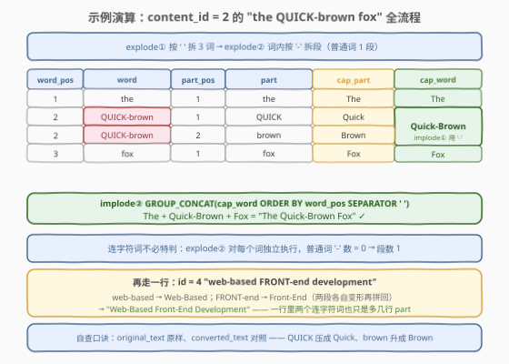

# 首字母大写 II

- **题目名称**：首字母大写 II
- **链接**：[3374. 首字母大写 II](https://leetcode.cn/problems/first-letter-capitalization-ii/)
- **难度**：困难
- **标签**：数据库、SQL、字符串处理、递归 CTE、`SUBSTRING_INDEX`、`GROUP_CONCAT`、`CROSS JOIN`

## 1. 题目概述

**表结构**：`user_content`

| 列名 | 类型 |
|------|------|
| content_id | int |
| content_text | varchar |

- `content_id` 是这张表的唯一主键；
- 每一行包含一个不同的 ID 以及对应的文本内容。

**目标**：编写一个解决方案，按以下规则转换 `content_text` 列中的文本：

1. 将每个单词的**第一个字母**转换为**大写**，**其余字母**保持**小写**；
2. 特殊处理包含特殊字符的单词：对于用短横 `-` 连接的词语，**两个部份都应该大写**（例如 `top-rated` → `Top-Rated`、`QUICK-brown` → `Quick-Brown`）；
3. 所有其他**格式**和**空格**应保持**不变**。

返回结果表，**同时包含原始的 `content_text`**（`original_text` 列）**以及根据规则修改后的文本**（`converted_text` 列）。

**示例 1**：

```text
输入：user_content 表
+------------+---------------------------------+
| content_id | content_text                    |
+------------+---------------------------------+
| 1          | hello world of SQL              |
| 2          | the QUICK-brown fox             |
| 3          | modern-day DATA science         |
| 4          | web-based FRONT-end development |
+------------+---------------------------------+

输出：
+------------+---------------------------------+---------------------------------+
| content_id | original_text                   | converted_text                  |
+------------+---------------------------------+---------------------------------+
| 1          | hello world of SQL              | Hello World Of Sql              |
| 2          | the QUICK-brown fox             | The Quick-Brown Fox             |
| 3          | modern-day DATA science         | Modern-Day Data Science         |
| 4          | web-based FRONT-end development | Web-Based Front-End Development |
+------------+---------------------------------+---------------------------------+
```

**解释**：

- `content_id = 1`：每个单词首字母大写：`SQL` 被压成 `Sql`；
- `content_id = 2`：连字符词 `QUICK-brown` 变为 `Quick-Brown`（两段独立变形再拼回），其它单词遵循普通首字母大写规则；
- `content_id = 3`：`modern-day` → `Modern-Day`，`DATA` → `Data`；
- `content_id = 4`：一行两个连字符词：`web-based` → `Web-Based`，`FRONT-end` → `Front-End`。

**约束条件**（题面未显式给出，按表结构与示例推断，与姊妹题 [3368](../3301-3400/3368_首字母大写.md) 同源测试数据生成器）：

- `content_text` 为 `VARCHAR` 文本，单词间**单个空格**分隔，特殊字符仅出现 `-`；
- 判题数据规模小。

> 💡 **审题关键**：① 本题 = [3368. 首字母大写](../3301-3400/3368_首字母大写.md) 的全部规则 **+ 一条连字符增量**——`-` 连接的词**两段都要**首字母大写；② 输出**三列**：`content_id`、`original_text`（原样保留）、`converted_text`（转换结果），两列文本对照即可自查；③ 「两个部份都应该大写」指的是**两段各自**走「首字母大写、其余小写」——`FRONT-end` 变 `Front-End` 而非 `FRONT-End`，全大写的段同样被压回首大余小。

---

## 2. 解题思路

### 2.1 暴力思路：3368 流水线直球复用 + 拉回应用层

最顺手的「直球」是把 [3368](../3301-3400/3368_首字母大写.md) 的三段式流水线原封不动搬来——数字表 `CROSS JOIN` 炸词、逐词 `CONCAT(UPPER(LEFT(w,1)), LOWER(SUBSTRING(w,2)))`、`GROUP_CONCAT` 拼回。它对**普通单词**全部正确，唯独在连字符词上漏了一半：

```text
"QUICK-brown" 被当作"一个单词"整体变形
→ CONCAT(UPPER(LEFT("QUICK-brown",1)), LOWER(SUBSTRING("QUICK-brown",2)))
→ "Quick-brown"        ← 第二段 brown 没有首字母大写！
```

另一个方向照旧是「应用层暴力」：`SELECT *` 捞回程序，`text.split(' ')` → `word.split('-')` → `part.capitalize()` → `'-'.join` → `' '.join`，一个 Python 函数五行搞定——但数据库题要求一条 SQL，判题层面此路不通。

> ⚠️ 暴力的启示：变形函数（1667 / 3368 已验证的 idiom）**对「段」依旧一步到位**，缺的是把句子拆到「最小可变形单元」的**第二层爆炸**——3368 把句子拆到了**词**，本题的连字符词内部还藏着**段**，一层 `explode` 不够用了。

### 2.2 核心观察：两级爆炸 + 两级拼回（explode-implode 级联）



三个观察把问题坍缩成「**一行变多行（词）再变更多行（段）、逐段变形、两级收回一行**」的级联流水线：

| 观察 | 内容 | 带来的做法 |
|------|------|-----------|
| **段级变形是现成的** | `CONCAT(UPPER(LEFT(p,1)), LOWER(SUBSTRING(p,2)))` 作用于**段** $p$ 即「首字母大写、其余小写」，与词级 idiom 一字不差 | 难点全部集中在「取段」与「两级拼回」 |
| **取第 m 段与取第 n 词是同一个 idiom** | `SUBSTRING_INDEX(SUBSTRING_INDEX(s, sep, k), sep, -1)`——外层取前 $k$ 段、内层取最后一个。`sep` 换成 `' '` 是取词、换成 `'-'` 就是取段 | 词层爆炸之后，对每个词**再复制一层**「数字表 `CROSS JOIN` + 双层 `SUBSTRING_INDEX`」 |
| **拼回必须两级、各带 `ORDER BY`** | 段先按 `part_pos` 用 `'-'` 拼回**词**，词再按 `word_pos` 用 `' '` 拼回**句子**——两个分隔符、两个顺序，缺一不可 | 内层 `GROUP_CONCAT(… ORDER BY part_pos SEPARATOR '-')`，外层 `GROUP_CONCAT(… ORDER BY word_pos SEPARATOR ' ')` |

两把「计数尺」也共用同一个公式——**分隔符数 + 1 = 段（词）数**：

$$W = \text{CHAR\_LENGTH}(s) - \text{CHAR\_LENGTH}(\text{REPLACE}(s, \texttt{' '}, \texttt{''})) + 1$$

$$P = \text{CHAR\_LENGTH}(w) - \text{CHAR\_LENGTH}(\text{REPLACE}(w, \texttt{'-'}, \texttt{''})) + 1$$

> 💡 **一句话**：本题是 3368 框架的**级联扩展**——`explode` 与 `implode` 各叠一层。普通词 $P = 1$，两层结构自动退化为 3368；连字符词 $P \ge 2$，段级变形 + `'-'` 拼回恰好实现「两段都要大写」。新规则没有推翻旧框架，只是把「炸开」的粒度从**词**细化到**段**。

### 2.3 算法流程图



| 步骤 | SQL 片段 | 作用 | 示例数据流 |
|------|----------|------|-----------|
| ① 数字表 | `WITH RECURSIVE numbers AS (SELECT 1 … n < 1000)` | 生成 $n = 1 \ldots 1000$，两层拆分共用 | `1, 2, 3, …` |
| ② 拆词 explode① | `CROSS JOIN numbers WHERE n ≤ W` | 一行句子炸成 $W$ 行词 | `"the QUICK-brown fox"` → `the` / `QUICK-brown` / `fox` |
| ③ 拆段 explode② | `CROSS JOIN numbers WHERE m ≤ P` | 每个词再炸成 $P$ 行段 | `QUICK-brown` → `QUICK` / `brown` |
| ④ 变形 | `CONCAT(UPPER(LEFT(part,1)), LOWER(SUBSTRING(part,2)))` | 逐段首字母大写 | `QUICK` → `Quick`，`brown` → `Brown` |
| ⑤ 拼回词 implode① | `GROUP_CONCAT(cap_part ORDER BY part_pos SEPARATOR '-')`，`GROUP BY (content_id, word_pos)` | 段拼回词 | `Quick` + `Brown` → `Quick-Brown` |
| ⑥ 拼回句 implode② | `GROUP_CONCAT(cap_word ORDER BY word_pos SEPARATOR ' ')`，`GROUP BY (content_id, content_text)` | 词拼回句，输出三列 | `The Quick-Brown Fox` |

> ⚠️ **⑤⑥ 两处 `ORDER BY` 都不可省**：组内行的物理顺序没有任何语义保证，`GROUP_CONCAT` **函数体内**的 `ORDER BY` 是唯一显式排序载体——内层丢掉 `ORDER BY part_pos` 会拼出 `Brown-Quick`，外层丢掉 `ORDER BY word_pos` 则整句词序洗牌。两级拼回 = 两个顺序约束，一处都松不得。

### 2.4 示例演算



以 `content_id = 2` 的 `"the QUICK-brown fox"` 全流程演算：

| word_pos | word | part_pos | part | cap_part | cap_word（implode①） |
|----------|------|----------|------|----------|----------------------|
| 1 | `the` | 1 | `the` | `The` | `The` |
| 2 | `QUICK-brown` | 1 | `QUICK` | `Quick` | `Quick-Brown` ✓ |
| 2 | `QUICK-brown` | 2 | `brown` | `Brown` | （同组拼回） |
| 3 | `fox` | 1 | `fox` | `Fox` | `Fox` |

$$\text{implode②} = \texttt{GROUP\_CONCAT}(\texttt{cap\_word ORDER BY word\_pos SEPARATOR ' '}) = \texttt{"The Quick-Brown Fox"}\ ✓$$

其余三行走同一条流水线，仅词数、段数不同：

| content_id | original_text | converted_text |
|------------|---------------|----------------|
| 1 | `hello world of SQL` | `Hello World Of Sql`（无连字符，退化成 3368） |
| 3 | `modern-day DATA science` | `Modern-Day Data Science` |
| 4 | `web-based FRONT-end development` | `Web-Based Front-End Development`（一行两个连字符词，也只是多几行 part） |

> 💡 **交换验证**：把 ④ 的变形换成 `part` 原样输出，两级拼回恰好得到原串——级联流水线整体退化为恒等变换；把 ⑤ 的 `SEPARATOR '-'` 与 ⑥ 的 `SEPARATOR ' '` 对调，则得到 `The-Quick Brown Fox-` 式的「分隔符错位」串。**分隔符与顺序是两级拼回的两个独立自由度**，各自验证即可定位任何拼装错误——这也是排查这类 GROUP_CONCAT 嵌套题的通用调试法。

---

## 3. 参考代码

### SQL（解法 A：数字表两连 CROSS JOIN + 双层 SUBSTRING_INDEX，推荐）

```sql
# Write your MySQL query statement below
WITH RECURSIVE numbers AS (
    SELECT 1 AS n
    UNION ALL
    SELECT n + 1 FROM numbers WHERE n < 1000
),
words AS (
    SELECT content_id,
           content_text,
           n AS word_pos,
           SUBSTRING_INDEX(SUBSTRING_INDEX(content_text, ' ', n), ' ', -1) AS word
    FROM user_content
    CROSS JOIN numbers
    WHERE n <= CHAR_LENGTH(content_text)
              - CHAR_LENGTH(REPLACE(content_text, ' ', '')) + 1
),
parts AS (
    SELECT w.content_id,
           w.content_text,
           w.word_pos,
           w.word,
           num.n AS part_pos,
           SUBSTRING_INDEX(SUBSTRING_INDEX(w.word, '-', num.n), '-', -1) AS part
    FROM words w
    CROSS JOIN numbers num
    WHERE num.n <= CHAR_LENGTH(w.word)
                 - CHAR_LENGTH(REPLACE(w.word, '-', '')) + 1
),
capitalized AS (
    SELECT content_id,
           content_text,
           word_pos,
           part_pos,
           CONCAT(UPPER(LEFT(part, 1)),
                  LOWER(SUBSTRING(part, 2))) AS cap_part
    FROM parts
),
cap_words AS (
    SELECT content_id,
           content_text,
           word_pos,
           GROUP_CONCAT(cap_part ORDER BY part_pos SEPARATOR '-') AS cap_word
    FROM capitalized
    GROUP BY content_id, content_text, word_pos
)
SELECT content_id,
       content_text AS original_text,
       GROUP_CONCAT(cap_word ORDER BY word_pos SEPARATOR ' ') AS converted_text
FROM cap_words
GROUP BY content_id, content_text
ORDER BY content_id;
```

> 💡 **写法要点**：
> - **五个 CTE 与流程图①–⑥一一对应**：`numbers` 数字表被②③两层 `CROSS JOIN` **共用**（第二连起别名 `num` 区分），`WHERE 分隔符数 + 1` 各自裁剪笛卡尔积到恰好每词/每段一行；
> - **取词与取段是同一个 idiom**：`SUBSTRING_INDEX(SUBSTRING_INDEX(s, sep, k), sep, -1)`，只换 `sep` 与输入粒度——「级联」体现在代码里就是同一模式写两遍；
> - **两级 `GROUP BY` 键逐级收窄**：`cap_words` 按 `(content_id, content_text, word_pos)` 分组拼词，最终按 `(content_id, content_text)` 分组拼句——粒度从「行·词·段」一路收回到「行」；
> - **`GROUP BY content_id, content_text` 双键**：判题建表未显式声明主键，只 `GROUP BY content_id` 再 `SELECT content_text` 会撞 `ONLY_FULL_GROUP_BY`，两列都进分组键最稳。

### SQL（解法 B：递归 CTE 双层「吃一段、留一截尾巴」）

```sql
# Write your MySQL query statement below
WITH RECURSIVE words AS (
    SELECT content_id,
           content_text,
           1 AS word_pos,
           SUBSTRING_INDEX(content_text, ' ', 1) AS word,
           SUBSTRING(content_text,
                     CHAR_LENGTH(SUBSTRING_INDEX(content_text, ' ', 1)) + 2) AS rest
    FROM user_content
    UNION ALL
    SELECT content_id,
           content_text,
           word_pos + 1,
           SUBSTRING_INDEX(rest, ' ', 1),
           SUBSTRING(rest,
                     CHAR_LENGTH(SUBSTRING_INDEX(rest, ' ', 1)) + 2)
    FROM words
    WHERE rest <> ''
),
parts AS (
    SELECT content_id,
           content_text,
           word_pos,
           word,
           1 AS part_pos,
           SUBSTRING_INDEX(word, '-', 1) AS part,
           SUBSTRING(word,
                     CHAR_LENGTH(SUBSTRING_INDEX(word, '-', 1)) + 2) AS rest
    FROM words
    UNION ALL
    SELECT content_id,
           content_text,
           word_pos,
           word,
           part_pos + 1,
           SUBSTRING_INDEX(rest, '-', 1),
           SUBSTRING(rest,
                     CHAR_LENGTH(SUBSTRING_INDEX(rest, '-', 1)) + 2)
    FROM parts
    WHERE rest <> ''
),
capitalized AS (
    SELECT content_id,
           content_text,
           word_pos,
           part_pos,
           CONCAT(UPPER(LEFT(part, 1)),
                  LOWER(SUBSTRING(part, 2))) AS cap_part
    FROM parts
),
cap_words AS (
    SELECT content_id,
           content_text,
           word_pos,
           GROUP_CONCAT(cap_part ORDER BY part_pos SEPARATOR '-') AS cap_word
    FROM capitalized
    GROUP BY content_id, content_text, word_pos
)
SELECT content_id,
       content_text AS original_text,
       GROUP_CONCAT(cap_word ORDER BY word_pos SEPARATOR ' ') AS converted_text
FROM cap_words
GROUP BY content_id, content_text
ORDER BY content_id;
```

> 💡 **解法 B 的取舍**：
> - **双层逐段消费**：`words` 层每步吃一个词（`rest` 跳过「词 + 空格」），`parts` 层每步吃一段（`rest` 跳过「段 + `-`」）——不需要数字表、不需要预算词数/段数，「数量」隐式地由递归深度给出；同一「吃一段留尾巴」模式在两层递归里各写一遍，again 是级联；
> - **`+2` 的来历**：`SUBSTRING` 位置从 1 起数，段占第 $1 \ldots L$ 字符、分隔符占第 $L{+}1$ 字符，故尾巴从第 $L{+}2$ 字符开始；无后续分隔符时 `rest = ''`，`WHERE rest <> ''` 终止递归；
> - 与解法 A 语义完全等价，代价是递归深度受 `cte_max_recursion_depth`（默认 1000）约束——`VARCHAR` 短文本的词数 + 段数远够安全。词长必须用 `CHAR_LENGTH`（字符）而非 `LENGTH`（字节），多字节文本下才不会错位。

### Python（pandas）

```python
import pandas as pd


def capitalize_content(user_content: pd.DataFrame) -> pd.DataFrame:
    def convert(text: str) -> str:
        return " ".join(
            "-".join(part.capitalize() for part in word.split("-"))
            for word in text.split(" ")
        )

    res = user_content.sort_values("content_id").reset_index(drop=True)
    return pd.DataFrame(
        {
            "content_id": res["content_id"],
            "original_text": res["content_text"],
            "converted_text": res["content_text"].map(convert),
        }
    )
```

> 💡 **pandas 对照**（官方函数签名 `capitalize_content`）：`convert` 就是 SQL 流水线的直译——外层 `split(' ')` / `join(' ')` 对应 explode① 与 implode②，内层 `split('-')` / `capitalize()` / `join('-')` 对应 explode②、变形与 implode①。另一条一行流是 `res["content_text"].str.title()`：Python 的 `title()` 把**所有非字母字符**当词界，`"QUICK-brown".title()` 自动得到 `"Quick-Brown"`——与 PostgreSQL 的 `INITCAP` 行为一致（见 5.1）。代价是对撇号等符号过敏感（`it's` → `It'S`），本题数据纯字母 + 空格 + 连字符，两者皆安全；显式 `split` 版胜在**词界规则完全由自己掌控**，换符号只需改一处。

---

## 4. 复杂度分析

设 $n$ 为 `user_content` 行数，$L$ 为单行文本最大字符数，$W$ 为单行最大词数，$P$ 为单词最大段数，$T = \sum_i \sum_j p_{ij}$ 为全表总段数（中间表 `capitalized` 的行数）。

| 维度 | 复杂度 | 说明 |
|------|--------|------|
| **时间（数字表）** | $O(L)$ | 递归生成 $1 \ldots 1000$（常数上限），两层拆分共用一次物化 |
| **时间（两级拆分）** | $O(T \cdot L)$ | 双层 `SUBSTRING_INDEX` 对每个 `(行, 词, 段)` 对扫一遍前缀，前缀长 $O(L)$；解法 B 的递归每步对 `rest` 重扫，同量级 |
| **时间（变形 + 两级拼回）** | $O(T \log P + N \log W)$ | 变形线性；内层/外层 `GROUP_CONCAT` 各自 `ORDER BY`，组内排序合计如左，上界 $O(T \log T)$ |
| **空间** | $O(T)$ | 中间表每段一行（词 + 段 + 双位置 + 原串引用），即两级爆炸产物规模 |
| **递归深度（解法 B）** | $O(W + P)$ | 词层、段层各自递归，深度为词数/段数而非字符数，默认 1000 上限安全 |

> ⚠️ SQL 复杂度取决于执行计划：`CROSS JOIN numbers` 的裁剪若发生在连接前，中间行数即 $T$ 而非 $1000 \cdot$ 行数。另记 `GROUP_CONCAT` 的 `group_concat_max_len` 默认 **1024 字节静默截断**坑——本题短文本安全，生产长文本需调大（同 [3368](../3301-3400/3368_首字母大写.md) 5.4 节）。

---

## 5. 扩展

### 5.1 方言一行流：PostgreSQL `INITCAP` 与 Python `str.title`

| 环境 | 写法 | `'-'` 的待遇 |
|------|------|--------------|
| Oracle / PostgreSQL | `INITCAP(content_text)` | 词界 = **非字母数字**字符，`'top-rated'` → `'Top-Rated'` 自动满足连字符规则 |
| pandas | `content_text.str.title()` | 同上，`"QUICK-brown".title()` → `"Quick-Brown"` |
| MySQL | ✗ 无 `INITCAP` | 只能手搓两级爆炸-拼回流水线 |

有趣的对照：3368 与 3374 在 PostgreSQL 里**都是一行流**——`INITCAP` 按「非字母数字字符」分词，连字符增量规则被它免费覆盖。两题的 Hard 是**方言税**而非算法难度；面试先点破这一层，再展开 MySQL 手搓方案，展示的是对 SQL 方言边界的确切认知。

### 5.2 三段连字符与空段：`a-b-c`、`-x` 会怎样？

- `a-b-c`：段数公式 `'-'数 + 1 = 3`，自动拆成 `a` / `b` / `c` 三段各自变形 → `A-B-C`——**级联框架天然支持任意多段**，无需为「两个部份」的特殊措辞打补丁；
- `-x`（前导连字符）：段 1 是**空串**，`CONCAT(UPPER(LEFT('',1)), LOWER(SUBSTRING('',2)))` = `''`，拼回 `-X` 原样保留空段——空段变形为空串恰好守住「格式保持不变」条款；但若测试数据出现连续分隔符，需按 2.4 的交换验证法逐层核对（本题数据为单空格 + 词内单连字符，无此边界）。

### 5.3 泛化模板：按任意分隔符拆第 k 段

两级拆分背后是同一个可复用 idiom，值得单独记住：

```sql
SUBSTRING_INDEX(SUBSTRING_INDEX(s, sep, k), sep, -1)  -- s 按 sep 切的第 k 段
CHAR_LENGTH(s) - CHAR_LENGTH(REPLACE(s, sep, '')) + 1 -- s 按 sep 切的总段数
```

「句 → 词 → 段」每深入一层，就是「`CROSS JOIN` 数字表 + 上面两条 + 尾部 `GROUP_CONCAT`」的复制粘贴；反过来，「词 → 句」每收回一级，就是一次带 `ORDER BY` 的 `GROUP_CONCAT`。层级再多（如下划线、斜杠嵌套的标识符），也只是多叠一层——把「分隔符层级化」当通用武器，这类字符串 SQL 题就变成了搭积木。

---

## 6. 面试要点

1. **本题与 3368 的关系？增量难点到底在哪？**

   > 规则增量只有一条：`-` 连接的词**两段都要**首字母大写。难点在于 3368 的流水线把 `QUICK-brown` 当**一个单词**变形，只能得到 `Quick-brown`——词内还有「段」这层结构，单层爆炸覆盖不到。解法是把 3368 的 explode-implode 框架**级联**：按 `' '` 拆词之后再按 `'-'` 拆段，变形后先按 `part_pos` 用 `'-'` 拼回词、再按 `word_pos` 用 `' '` 拼回句。普通词段数 = 1，新框架自动退化为旧框架——这是「扩展不推翻」的好范本。

2. **`SUBSTRING_INDEX(SUBSTRING_INDEX(word, '-', m), '-', -1)` 为什么能取第 $m$ 段？多段连字符 `a-b-c` 也成立吗？**

   > 内层 `SUBSTRING_INDEX(word, '-', m)` 从左数取**前 $m$ 段**（含其间 $m-1$ 个 `-`）得到前缀串；外层再对该前缀取**最后一个**段（`-1`）。两层合成的效果恰好是「第 $m$ 段」。`a-b-c` 时 $m = 3$ 内层返回整串、外层取出 `c`——边界自然成立；段数由 `'-'` 数 + 1 给出，与词数的空格计数公式同源。

3. **为什么需要两层 `GROUP_CONCAT`？各自的 `ORDER BY` 和 `SEPARATOR` 能省吗？**

   > 拼回有两个层级、两个分隔符：段拼回词用 `'-'`（按 `part_pos`），词拼回句用 `' '`（按 `word_pos`），一层 `GROUP_CONCAT` 只有单一分隔符，表达不了。`SEPARATOR` 错层会得到 `The-Quick Brown Fox-` 式分隔符错位串；`ORDER BY` 省略更隐蔽——组内物理顺序无语义保证，内层丢 `ORDER BY part_pos` 拼出 `Brown-Quick`，外层丢 `ORDER BY word_pos` 整句词序洗牌，且小数据下可能「碰巧对」，测试集一大才翻车。

4. **两级 `GROUP BY` 的键为什么逐级收窄？`ONLY_FULL_GROUP_BY` 在哪一步踩雷？**

   > 数据粒度是「行·词·段」，收回一级行就少一个分组键：内层按 `(content_id, content_text, word_pos)` 分组把段拼成词，外层按 `(content_id, content_text)` 分组把词拼成句。判题建表未显式声明主键，MySQL 不会把 `content_text` 认定为 `content_id` 的函数依赖列——任何一层只按 `content_id` 分组却 `SELECT content_text` 都会撞 `ONLY_FULL_GROUP_BY`，把两列都放进分组键最稳。

5. **PostgreSQL / pandas 一个函数就能过，这题的 Hard 说明了什么？**

   > PostgreSQL 的 `INITCAP` 与 Python 的 `str.title()` 都按「非字母数字字符」分词，连字符词的「两段都大写」被免费覆盖——一行流 AC。MySQL 没有 `INITCAP`，只能手搓两级爆炸-拼回，Hard 是**方言税**而非算法难度。面试正确姿势：先点破「换个数据库它是 Easy」，再展示 MySQL 手搓方案，顺带提防 `title()` 的词界副作用（`it's` → `It'S`）——一行流的便利与显式拆分的可控是一对取舍。

6. **如果文本混入连续空格或空段，这套解法会怎样？**

   > 双层 `SUBSTRING_INDEX` 与 `SEPARATOR` 拼回都以**单个分隔符**为计数单位：连续空格拆出的空词会被压缩回单空格，「空格保持不变」被破坏；前导/尾随 `-` 拆出的空段变形后仍为空串，拼回恰好原样保留（无害）。兜底要么改用记录分隔符位置的按位拆拼方案，要么 `REGEXP` 预处理。本题数据为单空格 + 词内单连字符（从示例与规则条款反推），级联流水线按此假设设计即可。

> 💡 **一句话总结**：3374 = 3368 的 explode-implode 框架**再叠一层**——按 `' '` 拆词、按 `'-'` 拆段、逐段首大余小，再两级 `GROUP_CONCAT`（`'-'` 拼词、`' '` 拼句，各自的 `ORDER BY` 是保序命脉）。普通词段数 1 自动退化、连字符词段数 ≥2 各自变形；PostgreSQL `INITCAP` / pandas `str.title` 依旧一行流，Hard 还是 MySQL 的方言税。

---

## 7. 同类练习题

- [3368. 首字母大写](https://leetcode.cn/problems/first-letter-capitalization/)（[站内题解](../3301-3400/3368_首字母大写.md)）：本题的姊妹题（付费锁题）——单层拆词拼回流水线的原型，本题在其框架中再插一层「按 `-` 拆 part」即得，先做它再做本题体感「级联」最直观
- [1667. 修复表中的名字](https://leetcode.cn/problems/fix-names-in-a-table/)：单词级「首字母大写 + 其余小写」变形 idiom 的原型出处——本题变形函数的直接来源，`name` 是单个单词所以无需拆词
- [1484. 按日期分组销售产品](https://leetcode.cn/problems/group-sold-products-by-the-date/)：`GROUP_CONCAT` 组内排序 + 显式 `SEPARATOR` 拼串基础题——两级拼回里「单一层级拼回」的裸训练
- [3328. 查找每个州的城市 II](https://leetcode.cn/problems/find-cities-in-each-state-ii/)：`GROUP_CONCAT` 三件套（分组 / 组内排序 / 分隔符）与多统计量并联的综合演练——拼回侧的进阶拼图
- [608. 树节点](https://leetcode.cn/problems/tree-node/)：`CASE WHEN` 多分支分类的招牌题——对照体会「SQL 里做不了的事就造抽象」：一边是分类、一边是爆炸-拼回
