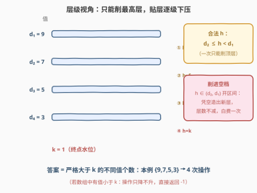
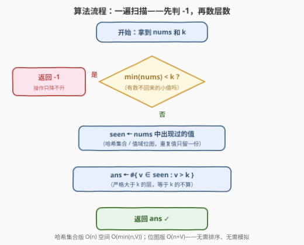
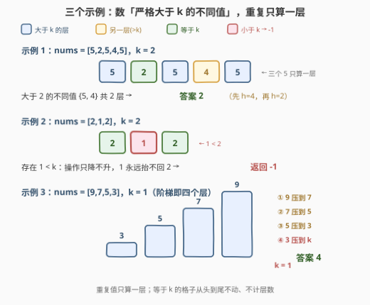

# 使数组的值全部为 K 的最少操作次数

- **题目名称**：使数组的值全部为 K 的最少操作次数
- **链接**：[3375. 使数组的值全部为 K 的最少操作次数](https://leetcode.cn/problems/minimum-operations-to-make-array-values-equal-to-k/)
- **难度**：简单
- **标签**：数组、哈希表
- **关联**：3371 识别数组中的最大异常值——同为「关键统计量藏在一遍扫描里」的计数型简单题；575 分糖果——「不同值的个数」本身就是答案的经典雏形

## 1. 题目概述

给你一个整数数组 `nums` 和一个整数 `k`。

如果数组中所有**严格大于** `h` 的整数值都**相等**，那么称整数 `h` 是**合法的**。比方说 `nums = [10, 8, 10, 8]` 中，`h = 9` 合法（大于 9 的数全是 10），`h = 5` 不合法（大于 5 的数有 10 和 8 两种）。

每次操作可以：

1. 选择一个对**当前** `nums` 合法的整数 `h`；
2. 把所有满足 `nums[i] > h` 的元素改为 `h`。

目标是把所有元素都变成 `k`，返回**最少**操作次数；无法达成则返回 `-1`。

**示例 1**：

```text
输入：nums = [5,2,5,4,5], k = 2
输出：2
解释：依次选 h = 4 和 h = 2，数组变为 [4,2,4,4,4] → [2,2,2,2,2]。
```

**示例 2**：

```text
输入：nums = [2,1,2], k = 2
输出：-1
解释：没法把 1 变成 2。
```

**示例 3**：

```text
输入：nums = [9,7,5,3], k = 1
输出：4
解释：依次选 h = 7, 5, 3, 1。
```

**约束条件**：

- $1 \le \text{nums.length} \le 100$
- $1 \le \text{nums[i]} \le 100$
- $1 \le k \le 100$

> 💡 **读题关键**：① 操作只把数**变小**（只动 `> h` 的元素），从不变大——这直接给出 `-1` 的判定：只要存在 `nums[i] < k` 就永远救不回来；② 「合法 `h`」的限制翻译过来是：**一次操作只能削当前最高的那一层**，且只能削到次高层的水平；③ 值域 $[1,100]$、$n \le 100$，哈希集合 / 布尔数组随便用。

---

## 2. 解题思路

### 2.1 暴力思路：逐层下压模拟

把数组的不同值看成由高到低的若干「层」。按题意每次只能削最高层，最朴素的模拟就是：每轮扫描找出**最大值** `d1` 和**次大的不同值** `d2`，选 `h = d2` 把最高层压平到次高层，操作次数 +1；当只剩一层且仍 `> k` 时，选 `h = k` 压到底。过程中一旦发现最小值 `< k`，返回 `-1`。

以示例 3 `[9,7,5,3], k=1` 走一遍：层 `{9,7,5,3}` → 压 9 到 7 得 `{7,5,3}` → 压到 5 → 压到 3 → 最后整层压到 1，共 **4** 次。每轮 $O(n)$ 扫描，至多压 $O(V)$ 轮（$V=100$ 为值域），$O(nV)$ 对本题规模毫无压力——但模拟走完会发现：**每轮恰好消掉一个「大于 $k$ 的不同值」**，答案根本不用模拟。

### 2.2 核心观察：答案 = 严格大于 k 的不同值个数



设当前数组的不同值从高到低为 $d_1 > d_2 > \cdots > d_t$。先刻画清楚「合法 `h`」到底是哪些数：

- **$h \ge d_1$**：没有数大于 $h$，条件空成立，合法——但操作是**空操作**，白选；
- **$d_2 \le h < d_1$**：大于 $h$ 的数恰好是 $d_1$ 那一层，全部相等，合法，且效果唯一——把顶层 $d_1$ 压成 $h$；
- **$h < d_2$**：大于 $h$ 的数同时包含 $d_1$ 和 $d_2$ 两层，不相等，**不合法**。

所以每次有效操作的本质是：**把最高层降到次高层高度以下的任意位置**（$[d_2, d_1-1]$ 内任选）。由此得到答案的两半证明：

**下界（至少要 $m$ 次）**：设严格大于 $k$ 的不同值有 $m$ 个。每次操作只改动「大于 $h$」的元素，而它们全等于 $d_1$——即一次操作**至多消灭一个**大于 $k$ 的层（$d_1$ 消失，顶多换出一个新的 $h$ 层）。要从 $m$ 层减到 $0$ 层，至少 $m$ 次操作。

**构造（$m$ 次足够）**：把大于 $k$ 的不同值从高到低排为 $v_1 > v_2 > \cdots > v_m > k$。第 $i$ 次操作选 $h = v_{i+1}$（最后一次选 $h = k$）：此时高于 $v_{i+1}$ 的层已全部合并成 $v_i$ 一层，$h$ 合法；压完恰消一层。$m$ 次后全数组等于 $k$。

$$
\boxed{\;\text{answer} = \#\{\,v : v \in \text{nums},\ v > k\,\}\ (\text{取不同值})，\quad \exists\, \text{nums[i]} < k \Rightarrow -1\;}
$$

> 💡 **浪费的选法长什么样**：若把顶层压到 $(d_2, d_1)$ 的空档里（既不落在 $d_2$、也不落在 $k$），大于 $k$ 的层数**一个没少**，纯烧一次操作——这正是下界证明里「至多消一层」取不到等号的情形。最优策略永远「贴着现有层压」。
>
> ⚠️ **别把 $k$ 层也算进去**：值恰为 $k$ 的元素从头到尾不需要动，所以数的是**严格大于** $k$ 的不同值，不是 $\ge k$。示例 1 中 $\{5,4\}$ 共 2 个，答案 2；若数组本来全为 $k$，答案自然是 0。

### 2.3 算法流程图



算法只需一遍扫描：

1. **判 `-1`**：遍历时发现任何 `nums[i] < k`，直接返回 `-1`（操作只降不升）；
2. **收集层**：用哈希集合（或值域布尔数组）记录出现过的值；
3. **计数**：统计集合中严格大于 `k` 的值个数，即为答案。

不需要排序、不需要模拟——「最少操作次数」在动手前就已数完。

### 2.4 示例演算



| 示例 | nums | k | 大于 k 的不同值 | 有 `< k`？ | 答案 | 操作序列 |
|------|------|---|----------------|-----------|------|---------|
| 1 | `[5,2,5,4,5]` | 2 | $\{5,4\}$ | 否 | **2** | $h{=}4$ → $h{=}2$ |
| 2 | `[2,1,2]` | 2 | $\varnothing$ | **是**（有 1） | **-1** | 操作只降不升，1 抬不回 2 |
| 3 | `[9,7,5,3]` | 1 | $\{9,7,5,3\}$ | 否 | **4** | $h{=}7$ → $5$ → $3$ → $1$ |

三个示例正好覆盖三种形态：**多重复值**（示例 1 中三个 5 只算一层）、**不可达**（示例 2）、**全数组无一个等于 k**（示例 3 要把每一层都压穿到 1）。

---

## 3. 参考代码

### C++

```cpp
class Solution {
  public:
    int minOperations(vector<int>& nums, int k) {
        bitset<101> seen;                 // 值域 1..100，位图即哈希集合
        for (int x : nums) {
            if (x < k) return -1;         // 小于 k 的数永远救不回来
            seen[x] = true;
        }
        int ans = 0;
        for (int v = k + 1; v <= 100; v++)
            ans += seen[v];               // 数严格大于 k 的不同值
        return ans;
    }
};
```

### Python

```python
class Solution:
    def minOperations(self, nums: List[int], k: int) -> int:
        if min(nums) < k:
            return -1
        return len({x for x in nums if x > k})
```

> 💡 Python 一行集合推导直接把「收集 + 过滤 + 去重 + 计数」四合一；C++ 因值域只有 $[1,100]$，`bitset<101>` 比 `unordered_set` 更省更直观。若把值域放大到 $10^9$，位图换成哈希集合即可，思路不变。

---

## 4. 复杂度分析

| 维度 | 一遍扫描 + 计数 | 逐层下压模拟 |
|------|----------------|-------------|
| **时间复杂度** | $O(n)$（哈希集合版 $O(n)$；位图版 $O(n + V)$，$V = 101$） | $O(nV)$（每轮 $O(n)$ 找层，至多 $V$ 轮） |
| **空间复杂度** | $O(V)$（位图）或 $O(\min(n, V))$（哈希集合） | $O(V)$ |
| **是否需要排序** | 否 | 否 |

> ⚠️ 若坚持用「排序 + 数层」实现（排序不同值再数 `> k` 的段数），时间为 $O(n \log n)$，对本题也绰绰有余——只是哈希一遍扫更贴合「简单题」的气质。

---

## 5. 扩展：换个目标，答案怎么变

**变体 A：目标是「全部相等」，不限等于 $k$。** 压层逻辑不变，但不必压到 $k$，压到**最低层**即可停手——答案是**不同值个数 $t$ 减 1**（把上面 $t-1$ 层逐层压到最低层；`-1` 判定也随之消失，因为不再需要抬任何数）。本题答案 $m$ 与它的关系：$m = t - 1$ 当且仅当 $k$ 恰为最小值；$k$ 比最小值还小时返回 $-1$；$k$ 介于两层之间时 $m$ 是「$> k$ 的层数」，压穿动作一样，只是终点不同。

**变体 B：每次操作还允许选不合法的 `h`。** 那一次操作就能把所有大于 $k$ 的数直接改为 $k$（选 $h = k$ 即可），答案退化为「是否存在大于 $k$ 的数」的 0/1 判定——对比之下更能体会「合法约束」逼出了逐层下压的结构。

**变体 C：`h` 只能取数组中已有的值。** 结论不变：最优解本来就只选现有层（或 $k$），压到空档是纯浪费，所以这个限制是「免费」的。

---

## 6. 面试要点

1. **为什么存在 `nums[i] < k` 就返回 `-1`？**

   - 操作只把满足 `nums[i] > h` 的元素**改小**为 `h`，数组中的值单调不增。
   - 小于 $k$ 的值永远无法被抬到 $k$，而目标是**全部**等于 $k$，故不可达，返回 `-1`。

2. **为什么答案恰是「严格大于 $k$ 的不同值个数 $m$」？**

   - **下界**：一次操作只改动严格大于 $h$ 的元素，由合法性它们全等于当前最大值 $d_1$——一次至多消灭一个「$> k$ 的层」，$m$ 层至少 $m$ 次。
   - **构造**：把 $v_1 > v_2 > \cdots > v_m > k$ 从高到低逐层压（第 $i$ 次选 $h = v_{i+1}$，最后选 $h = k$），每次都合法且恰消一层，$m$ 次达成。

3. **「合法 `h`」具体是哪些数？压到空档里会怎样？**

   - 有效合法区间是 $d_2 \le h < d_1$（$d_1,d_2$ 为当前最大、次大的不同值）；$h \ge d_1$ 是空操作，$h < d_2$ 因头顶两层不相等而不合法。
   - 把顶层压到 $(d_2, d_1)$ 开区间内的「空档高度」不违反合法性，但会凭空造出一个新层，层数不减——纯浪费一次操作，最优解永远贴着现有层压。

4. **等于 $k$ 的元素会碍事吗？**

   - 不会。它们从不被任何操作改动（操作只动 `> h ≥ k` 的元素），也不计入答案——数的是**严格**大于 $k$ 的层。全数组已等于 $k$ 时答案为 0。

5. **实现上有什么细节可以秀一下？**

   - 值域 $[1,100]$：C++ 用 `bitset<101>`、或 `bool seen[101]`，遍历中顺带判 `< k` 早退；Python 一行 `len({x for x in nums if x > k})`。
   - 不要写成 `max(nums) - k` 或「不同值总个数」——重复值只算一层、等于 $k$ 的层不算，这是本题最容易踩的两个坑。

> 💡 **一句话总结**：合法约束的本质是「每次只能削最高层、且只能削到次高层」，于是最优解就是贴层逐级下压——答案 = 严格大于 $k$ 的不同值个数；有小于 $k$ 的值则直接 `-1`。

---

## 7. 同类练习题

- [217. 存在重复元素](https://leetcode.cn/problems/contains-duplicate/)（[题解](../0201-0300/217_存在重复元素.md)）：哈希集合判重的最基础形态，本题去重计数的底层积木
- [575. 分糖果](https://leetcode.cn/problems/distribute-candies/)：「不同值的个数」直接决定答案的经典题，与本题的计数对象一模一样
- [2475. 数组中不等三元组的数目](https://leetcode.cn/problems/number-of-unequal-triplets-in-array/)（[题解](../2401-2500/2475_数组中不等三元组的数目.md)）：按不同值分桶计数再组合统计，桶计数的进阶用法
- [3371. 识别数组中的最大异常值](https://leetcode.cn/problems/identify-the-largest-outlier-in-an-array/)（[题解](../3301-3400/3371_识别数组中的最大异常值.md)）：同属「关键统计量一遍扫描可得」的计数型简单题，对照体会先算后判的思路
- [3346. 执行操作后元素的最高频率 I](https://leetcode.cn/problems/maximum-frequency-of-an-element-after-performing-operations-i/)（[题解](../3301-3400/3346_执行操作后元素的最高频率I.md)）：同样把「操作后的数组形态」转化为对值频率的静态统计，先推理再动手
