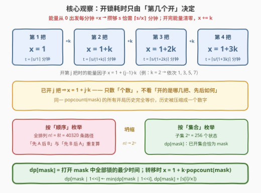
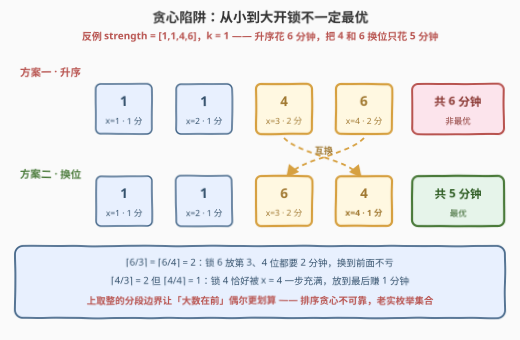
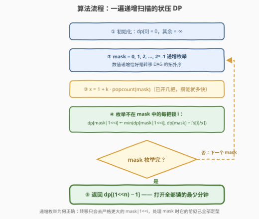
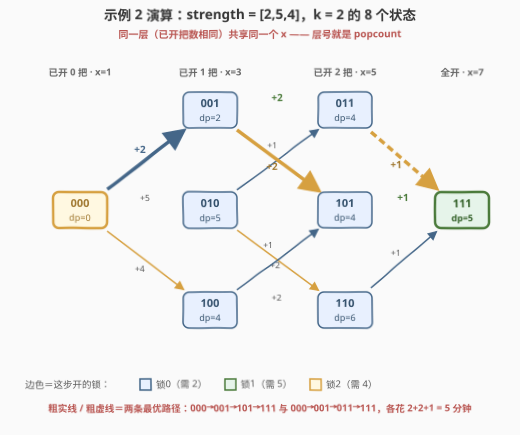

# 破解锁的最少时间 I

- **题目名称**：破解锁的最少时间 I
- **链接**：[3376. 破解锁的最少时间 I](https://leetcode.cn/problems/minimum-time-to-break-locks-i/)
- **难度**：中等
- **标签**：位运算、动态规划、状态压缩、回溯
- **关联**：3385（II：规模放大，官方提示转向匈牙利算法最小费用匹配）；526 / 847（位掩码 DP 家族）

## 1. 题目概述

Bob 被困在地窖里，需要破解 $n$ 把锁才能逃出去。数组 `strength` 给出每把锁所需的**能量**：`strength[i]` 表示打开第 $i$ 把锁时，剑的能量**至少**要达到的值。

Bob 的剑遵循以下规则：

- 一开始剑的能量为 $0$；
- 能量增加因子 $x$ 一开始为 $1$；
- **每分钟**，剑的能量增加当前的 $x$ 值；
- 打开第 $i$ 把锁，要求能量 $\ge \text{strength}[i]$；
- 打开一把锁之后，能量**清零**，且 $x$ 增加给定的值 $k$。

求打开**所有** $n$ 把锁所需的最少分钟数。

**示例 1**：

```text
输入：strength = [3,4,1], k = 1
输出：4
解释：先开第 3 把（x=1，攒 1 分钟）→ 再开第 2 把（x=2，攒 2 分钟）
     → 最后开第 1 把（x=3，攒 1 分钟），共 1+2+1 = 4 分钟。
```

**示例 2**：

```text
输入：strength = [2,5,4], k = 2
输出：5
解释：先开第 1 把（x=1，攒 2 分钟）→ 再开第 2 把（x=3，攒 2 分钟）
     → 最后开第 3 把（x=5，攒 1 分钟），共 2+2+1 = 5 分钟。
```

**约束条件**：

- $n == \text{strength.length}$
- $1 \le n \le 8$
- $1 \le k \le 10$
- $1 \le \text{strength}[i] \le 10^6$

> 💡 **读题关键**：① 能量每分钟**加 $x$**（线性增长，不是倍增），从 $0$ 攒到 $s$ 需要 $\lceil s/x \rceil$ 分钟；② 开锁动作本身**不占时间**，攒够的当分钟就能开；③ 开完能量清零、$x \mathrel{+}= k$——下一把锁从零攒起，但攒得**更快**。整道题唯一的自由度是**开锁的顺序**。

> ⚠️ **先排一颗雷**：直觉上「先开需要能量小的锁」很像可贪心的样子，但这是**错的**——上取整的边界效应会让排序法漏掉最优解（2.2 节给出反例）。同时 $n \le 8$ 是强烈的指数级信号：$n! = 40320$、$2^n = 256$，怎么暴力都能过，但值得写成漂亮的状压 DP。

---

## 2. 解题思路

### 2.1 暴力思路：回溯枚举开锁顺序

「每一分钟要么等待、要么开锁」只是表象。固定一种开锁顺序后，**攒够就开永远不劣**——多等的每一分钟只会把后续动作整体平移，而 $x$ 只在开锁时才增长。于是每把锁的耗时可以直接算：需要能量 $s$、当前因子 $x$，则耗时恰为

$$t = \left\lceil \frac{s}{x} \right\rceil$$

整份方案的唯一自由度是开锁顺序。官方 hint 也是这么建议的：**枚举全部 $n!$ 种排列**，对每个排列按 $x = 1, 1+k, 1+2k, \dots$ 逐把累加 $\lceil s/x \rceil$，取最小值。$n = 8$ 时 $8! = 40320$ 条路径、每条 $O(n)$ 估值，约 $3 \times 10^5$ 次运算，完全可以通过。

但它把「先开 A 再开 B」和「先开 B 再开 A」当成两条毫不相干的路——**重复子问题**严重，这就是状压 DP 登场的地方。

### 2.2 核心观察：耗时只由「第几个开」决定 → 位掩码 DP

顺着规则推演「开第 $j$ 把锁时 $x$ 是多少」：之前开过 $j-1$ 把，每开一把 $x$ 增长 $k$，所以

$$x_j = 1 + (j-1)\,k$$

**只取决于它是第几把被打开的**。至于前面开的是**哪几把、按什么顺序**——对 $x$ 毫无影响！历史被压缩成一个数字：**已开锁的数量** $\text{popcount}(\text{mask})$。



于是「顺序」这个 $n!$ 维的搜索空间坍缩成「集合」这个 $2^n$ 维的状态空间：

- **状态**：`dp[mask]` = 已打开集合恰为 `mask` 的所有锁所需的最少时间；
- **转移**：从 `mask` 出发挑一把未开的锁 $i$，此时 $x = 1 + k\cdot\text{popcount}(\text{mask})$：

$$dp[\text{mask} \mid (1 \ll i)] \leftarrow \min\Big(dp[\text{mask} \mid (1 \ll i)],\ dp[\text{mask}] + \big\lceil s_i / x \big\rceil\Big)$$

- **初始**：`dp[0] = 0`（一把没开，耗时 0）；**答案**：`dp[(1 << n) - 1]`。

> ⚠️ **贪心反例：从小到大开锁不一定最优。** 取 `strength = [1,1,4,6], k = 1`：升序开 `1→1→4→6` 花 $1+1+2+2=6$ 分钟；把 $4$ 和 $6$ 换位成 `1→1→6→4`，只花 $1+1+2+1=5$ 分钟！原因是 $\lceil 6/3 \rceil = \lceil 6/4 \rceil = 2$（$6$ 换到前面不亏），而 $\lceil 4/3 \rceil = 2 \ne \lceil 4/4 \rceil = 1$（$4$ 恰好能被 $x=4$ 一步充满）。**上取整的分段边界效应**让「大数在前」偶尔更划算，必须老老实实枚举集合。



### 2.3 算法流程

从小到大枚举 `mask`，对每个状态算出 $x$ 后把贡献「推」给更大的状态：

1. `dp[0] = 0`，其余初始化为 $\infty$；
2. `mask` 从 $0$ **递增**枚举到 $2^n - 1$；
3. 计算 `x = 1 + k * popcount(mask)`；
4. 枚举不在 `mask` 中的每把锁 $i$：`t = ⌈strength[i]/x⌉`，松弛 `dp[mask | (1<<i)]`；
5. 返回 `dp[(1<<n) - 1]`。



> 💡 **为什么递增枚举就够了？** 转移的目标 `mask | (1<<i)` 恒**严格大于** `mask`（多了一个 1）。所以数值递增序保证：轮到任何 `mask` 时，它所有「少一个 1」的前驱都已定型——一遍扫描天然就是拓扑序，无需显式建图或分层。

### 2.4 示例演算

以示例 2（`strength = [2,5,4]`，`k = 2`，锁编号 0/1/2，能量门槛 2/5/4）走完全部 $2^3 = 8$ 个状态：

| mask（二进制） | 已开集合 | popcount | 此层 $x$ | dp 值 | 来源 |
|---|---|---|---|---|---|
| 000 | $\varnothing$ | 0 | 1 | **0** | 起点 |
| 001 | {0} | 1 | 3 | **2** | $0+\lceil2/1\rceil$ |
| 010 | {1} | 1 | 3 | **5** | $0+\lceil5/1\rceil$ |
| 100 | {2} | 1 | 3 | **4** | $0+\lceil4/1\rceil$ |
| 011 | {0,1} | 2 | 5 | **4** | $\min(2+\lceil5/3\rceil,\ 5+\lceil2/3\rceil)$ |
| 101 | {0,2} | 2 | 5 | **4** | $\min(2+\lceil4/3\rceil,\ 4+\lceil2/3\rceil)$ |
| 110 | {1,2} | 2 | 5 | **6** | $\min(5+\lceil4/3\rceil,\ 4+\lceil5/3\rceil)$ |
| 111 | 全部 | 3 | 7 | **5** ⭐ | $\min(4+1,\ 4+1,\ 6+1)$ |



注意**同一层（popcount 相同）的所有状态共享同一个 $x$**——这正是「集合代替排列」的几何体现。图中还有**两条**等长最优路径：`000→001→101→111`（开锁顺序 0→2→1）与 `000→001→011→111`（开锁顺序 0→1→2，即官方解释的顺序），都花 $2+2+1=5$ 分钟，与期望输出一致 ✓。

---

## 3. 参考代码

### C++

```cpp
class Solution {
  public:
    int findMinimumTime(vector<int>& strength, int k) {
        int n = strength.size();
        int full = (1 << n) - 1;
        vector<int> dp(1 << n, INT_MAX / 2);
        dp[0] = 0;
        for (int mask = 0; mask <= full; ++mask) {
            int x = 1 + k * __builtin_popcount(mask);   // 已开 popcount(mask) 把后的能量因子
            for (int i = 0; i < n; ++i) {
                if (mask >> i & 1) continue;            // 这把已开，跳过
                int t = (strength[i] + x - 1) / x;      // 充能 ⌈s/x⌉ 分钟
                dp[mask | (1 << i)] = min(dp[mask | (1 << i)], dp[mask] + t);
            }
        }
        return dp[full];
    }
};
```

### Python

```python
class Solution:
    def findMinimumTime(self, strength: List[int], k: int) -> int:
        n = len(strength)
        full = (1 << n) - 1
        dp = [float('inf')] * (1 << n)
        dp[0] = 0
        for mask in range(1 << n):
            x = 1 + k * mask.bit_count()               # 已开 popcount(mask) 把后的能量因子
            for i in range(n):
                if mask >> i & 1:
                    continue                            # 这把已开，跳过
                t = (strength[i] + x - 1) // x          # 充能 ⌈s/x⌉ 分钟
                dp[mask | (1 << i)] = min(dp[mask | (1 << i)], dp[mask] + t)
        return dp[full]
```

> 💡 **实现细节**：① 所有子集都能从空集一步步加位到达，且递增枚举保证处理时前驱已定型，因此**无需不可达状态的守卫判断**；② `(s + x - 1) / x` 是整数上取整的惯用写法；③ 数据范围极宽松：$x \le 1+10\times8 = 81$、单把锁耗时 $\le 10^6$、总时长 $< 8\times10^6$，`int` 绰绰有余；④ `__builtin_popcount` / `int.bit_count()` 是 CPU 级 popcount，比手写循环数 1 更快。

---

## 4. 复杂度分析

| 维度 | 复杂度 | 说明 |
|------|--------|------|
| 时间复杂度 | $O(n \cdot 2^n)$ | $2^n$ 个状态 × 每个状态枚举 $n$ 把锁；$n=8$ 时仅 $256 \times 8 = 2048$ 次转移，微秒级 |
| 空间复杂度 | $O(2^n)$ | `dp` 数组 $2^8 = 256$ 个整数 |
| 暴力对照 | $O(n! \cdot n) \approx 3\times10^5$ | 全排列回溯也能过，但状态数多两个数量级（$40320$ vs $256$） |

正确性验证：两个官方样例（输出 4 / 5）逐分钟模拟一致；与「枚举全部 $n!$ 排列」的暴力解随机对拍 3000 组（$n \le 8$、$s_i \le 10^6$、$k \le 10$）全部一致；升序排序贪心在 `[1,1,4,6], k=1` 上输出 6 而最优为 5，反例坐实。

---

## 5. 扩展：回溯写法与姊妹题 3385

**比赛现场最快的写法**其实是全排列回溯——$n \le 8$ 时 $8!$ 完全可承受，顺手加一句「当前时间已不小于最优则剪枝」更稳：

```python
class Solution:
    def findMinimumTime(self, strength: List[int], k: int) -> int:
        n = len(strength)
        ans = float('inf')

        def dfs(mask: int, x: int, time: int) -> None:
            nonlocal ans
            if time >= ans:                # 最优性剪枝：不可能更优就回头
                return
            if mask == (1 << n) - 1:
                ans = time
                return
            for i in range(n):
                if mask >> i & 1:
                    continue
                dfs(mask | 1 << i, x + k, time + (strength[i] + x - 1) // x)

        dfs(0, 1, 0)
        return ans
```

回溯与状压 DP 的关系同 [526. 优美的排列](https://leetcode.cn/problems/beautiful-arrangement/)：回溯沿「**顺序**」递归，状压沿「**集合**」递归。同一个已开集合总能以多种顺序到达（$n \ge 2$ 时必然如此），记忆化就有收益——本题的收益高达 $n!/2^n \approx 157$ 倍（$n=8$）。

**姊妹题 [3385. 破解锁的最少时间 II](https://leetcode.cn/problems/minimum-time-to-break-locks-ii/)（困难，付费）**：题面同源（示例仍是 `[3,4,1]` 与 `[2,5,4]`），但规模放大到状压 DP 无法承受的范围。官方 hint 直指**匈牙利算法（最小费用完美匹配）**——本题的核心观察恰好是匹配模型的桥板：既然「锁的代价只由位置决定」，就把 $n$ 把锁与 $n$ 个位置（位置 $j$ 的费用因子 $x_j = 1+(j-1)k$）连成二分图、边权 $\lceil s_i / x_j \rceil$，**最小化总代价的排列 = 最小费用完美匹配**，匈牙利算法 $O(n^3)$ 解决。回头看，本题的状压 DP 本质上就是一个小规模的分配问题。

---

## 6. 面试要点

1. **单把锁的耗时为什么是 $\lceil s/x \rceil$？**

   - 能量从 $0$ 线性累积，每分钟 $+x$：$t$ 分钟后恰为 $t\cdot x$。要求 $t \cdot x \ge s$ 的最小整数 $t$ 就是上取整。开锁动作本身不占额外时间（攒够的当分钟即可开），固定顺序下「攒够就开」最优——等待只会平移后续所有动作。

2. **为什么状态用「集合」而不用「顺序」？无后效性体现在哪？**

   - 转移代价只依赖当前的 $x$，而 $x = 1 + k \times \text{已开把数}$ 只由 `popcount(mask)` 决定——已开的是哪几把、先后如何，对未来的代价函数毫无影响。「已开集合」是历史的**充分统计量**，$n!$ 条顺序坍缩为 $2^n$ 个集合。

3. **递增枚举 mask 为什么就是正确的拓扑序？**

   - 转移目标 `mask | (1<<i)` 恒严格大于 `mask`（二进制下多一个 1）。数值递增序保证处理任何状态时其全部前驱（少一个 1 的子集）已定型，一遍扫描即完成 DP。

4. **按 strength 升序开锁的贪心为什么错？**

   - 上取整是分段常数：$\lceil 6/3 \rceil = \lceil 6/4 \rceil = 2$，但 $\lceil 4/3 \rceil = 2 > \lceil 4/4 \rceil = 1$。反例 `[1,1,4,6], k=1`：升序 6 分钟、$4$ 与 $6$ 换位后 5 分钟。凡涉及取整的代价，交换论证需要严格不等式，直觉排序不可靠。

5. **如果 $n$ 放大到 15 / 100，分别怎么办？**

   - $n \le 20$：状压 DP 依旧可行（$2^{20}$ 级别状态）。再大：注意到「代价只依赖位置」后，问题变成**锁与位置的二分图最小费用完美匹配**，匈牙利算法 / 最小费用流 $O(n^3)$——正是姊妹题 3385 的考点。

---

## 7. 同类练习题

- [3385. 破解锁的最少时间 II](https://leetcode.cn/problems/minimum-time-to-break-locks-ii/)：姊妹题（付费），规模放大后状压失效，官方提示转向匈牙利算法最小费用匹配——同一观察在更大尺度上的出路
- [526. 优美的排列](https://leetcode.cn/problems/beautiful-arrangement/)（[站内题解](../0501-0600/526_优美的排列.md)）：位掩码 DP 入门，「popcount 唯一决定位置」的同胞思路（那里定位置、这里定 $x$）
- [847. 访问所有节点的最短路径](https://leetcode.cn/problems/shortest-path-visiting-all-nodes/)（[站内题解](../0801-0900/847_访问所有节点的最短路径.md)）：把 `(当前节点, 已访问掩码)` 当状态跑 BFS，状压 + 最短路的招牌组合
- [1125. 最小的必要团队](https://leetcode.cn/problems/smallest-sufficient-team/)（[站内题解](../1101-1200/1125_最小的必要团队.md)）：位掩码 DP 求最少选取方案，掩码按位「或」合并需求的转移与本题同款
- [2305. 公平分发饼干](https://leetcode.cn/problems/fair-distribution-of-cookies/)（[站内题解](../2301-2400/2305_公平分发饼干.md)）：$n \le 8$ 的指数级信号 + 回溯/状压双解法，与本题「暴力能过、DP 更优雅」的处境一模一样
