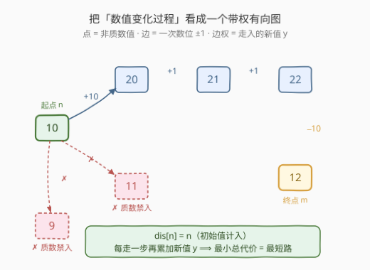
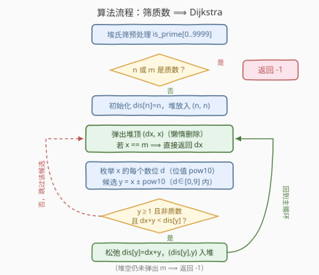
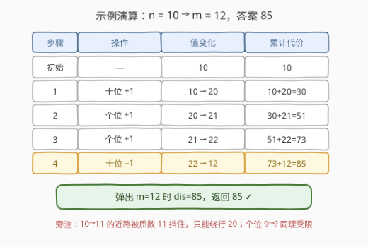

# 使两个整数相等的数位操作

- **题目名称**：使两个整数相等的数位操作
- **链接**：[3377. 使两个整数相等的数位操作](https://leetcode.cn/problems/digit-operations-to-make-two-integers-equal/)
- **难度**：中等
- **标签**：图、最短路、数论、堆（优先队列）
- **关联**：204 计数质数——埃氏筛模板；743 网络延迟时间——堆优化 Dijkstra 模板

## 1. 题目概述

给你两个整数 `n` 和 `m`，两个整数有**相同的**数位数目。

你可以执行以下操作**任意**次：

- 从 `n` 中选择**任意一个不是 9 的数位**，并将它**增加 1**；
- 从 `n` 中选择**任意一个不是 0 的数位**，并将它**减少 1**。

**任意时刻**，整数 `n` 都不能是一个**质数**——意味着一开始以及每次操作以后 `n` 都不能是质数。

进行一系列操作的代价为 `n` 在变化过程中**所有值之和**（初始值计入，每步产生的新值也计入）。

请你返回将 `n` 变为 `m` 需要的**最小**代价，如果无法将 `n` 变为 `m`，请你返回 `-1`。

**示例 1**：

```text
输入：n = 10, m = 12
输出：85
解释：10 → 20（十位+1）→ 21（个位+1）→ 22（个位+1）→ 12（十位−1），
      总代价 = 10 + 20 + 21 + 22 + 12 = 85。
```

**示例 2**：

```text
输入：n = 4, m = 8
输出：-1
解释：4 的两个邻居 3 和 5 都是质数，4 是孤点，无法变为 8。
```

**示例 3**：

```text
输入：n = 6, m = 2
输出：-1
解释：终点 2 本身就是质数，永远无法合法地停在 2 上。
```

**约束条件**：

- $1 \le n, m < 10^4$
- `n` 和 `m` 包含的数位数目相同。

> 💡 **读题关键**：① 操作改变的是**一个十进制位**，数值变化量是 $\pm 10^k$（位值），不是 $\pm 1$；② 代价不是操作次数，而是**沿途所有状态值的总和**——初始值 `n` 要计入，每步新值也要计入，这正是「边权 = 新值」的来源；③ 质数约束作用在**每个中间状态**上，起点或终点是质数直接无解。

---

## 2. 解题思路

### 2.1 暴力思路：DFS 枚举操作序列

最朴素的做法是从 `n` 出发 DFS 枚举所有合法操作序列，到达 `m` 时统计总代价取最小值。

问题在于状态可以**来回震荡**（比如个位 +1 再 −1），操作序列长度没有天然上界，搜索空间是指数级的；哪怕加上「不重复访问」的剪枝，本质上也变成了在状态图上找「权值和最小路径」——这正是**最短路**问题的定义，直接套 Dijkstra 即可，暴力毫无竞争力。

也要注意：**普通 BFS 不行**。BFS 求的是「操作次数最少」的路径，但本题边权（新值）各不相同，操作次数少不代表代价小（详见第 5 节的反例）。

### 2.2 核心观察：隐式图建模 + Dijkstra



把「变化过程」看成一个**带权有向图**，三句话完成建模：

| 建模要素 | 对应本题 | 说明 |
|----------|----------|------|
| **节点** | 每个非质数值 $x$ | 质数值是「禁入点」，不能出现在任何时刻 |
| **边** | $x \to y$，其中 $y = x \pm 10^k$ | 数位 $d$ 在 $[0,9]$ 内变化（$d>0$ 才能−1，$d<9$ 才能+1），一次操作一条边 |
| **边权** | $w(x \to y) = y$ | 每走一步，代价恰好累加「变化后的新值」 |

于是「最小总代价」翻译成图上语言：

$$
\text{答案} = \underbrace{n}_{\text{初始值}} + \sum_{\text{沿途每步}} y = dis[n] = n \; + \; \text{最短路边权之和}
$$

即令 $dis[n] = n$（初始值计入），其余按 Dijkstra 正常松弛，$dis[m]$ 即答案。三条边界一并列出：

- **起点/终点特判**：若 $n$ 或 $m$ 是质数，直接返回 `-1`（示例 3 的 $m=2$）；
- **非负边权**：每条边权 $y \ge 1 > 0$，Dijkstra 的正确性前提成立；
- **前导 0（掉位）陷阱**：把最高位从 1 减成 0 会让数值「掉位」（如 $10 \to 0$、$104 \to 4$）。注意操作只改一个数位、**永远不会产生进位**（9 不能再加），所以数位数目**只减不增**——一旦掉位就永远回不到 `m` 的位数（`n`、`m` 同位数）。这些状态是死胡同，跳过与否不影响答案；实现里约定 $y \ge 1$ 且非质数即可（$y=0$ 直接禁止）。

> 💡 **规模意识**：$n, m < 10^4$，图至多 $10^4$ 个点、每点 $4 \times 2 = 8$ 条边，Dijkstra 一次 $O(M \log M)$ 轻松跑完。质数判定用**埃氏筛**一次性预处理 $[1, 9999]$（204 题模板），别在循环里逐个试除。

### 2.3 算法流程图



流程要点：

1. **预处理**：埃氏筛标记 `is_prime[0..9999]`，注意 0 和 1 都不是质数（1 是合法中间状态）；
2. **特判**：`n` 或 `m` 是质数 → 返回 `-1`；
3. **初始化**：`dis[n] = n`（不是 0！初始值本身计入代价），堆中放入 `(n, n)`；
4. **主循环**：弹出堆顶 `(dx, x)`——若 `x == m` 提前返回 `dx`；若是懒惰删除的过期状态（`dx > dis[x]`）则跳过；
5. **扩展**：用 `divmod` 从低到高枚举 `x` 的每个数位与位值 `pow10`，候选 `y = x ± pow10`；要求 $y \ge 1$、非质数、且 `dx + y < dis[y]` 才松弛入堆；
6. **收尾**：堆空仍未弹出 `m` → 返回 `-1`（示例 2 的孤点情形）。

### 2.4 示例演算



以 $n=10,\ m=12$ 为例走一遍 Dijkstra（`→` 左边是弹出顺序）：

| 弹出 | $dis$ | 扩展（跳过质数邻居） |
|------|-------|----------------------|
| $(10, 10)$ | 10 | 9、11 是质数跳过；$10 \to 20$：$dis[20] = 10+20 = 30$ |
| $(30, 20)$ | 30 | $dis[21] = 30+21 = 51$；$10$ 更差；$dis[30] = 60$ |
| $(51, 21)$ | 51 | 11 是质数；$dis[22] = 51+22 = 73$；$dis[31] = 82$ |
| $(60, 30)$ | 60 | ……（都不是更优方向） |
| $(73, 22)$ | 73 | 23 是质数；$dis[12] = 73+12 = \mathbf{85}$；$dis[32] = 105$ |
| $(\mathbf{85}, 12)$ | **85** | 弹出 $x = m$，**返回 85** ✓ |

最短路径正是官方解释的 $10 \to 20 \to 21 \to 22 \to 12$：直走的 $10 \to 11$ 被质数 11 挡住，只能绕行 20——「绕路」正是最短路模型里质数约束的直观体现。

## 3. 参考代码

### C++

```cpp
class Solution {
public:
    int minOperations(int n, int m) {
        constexpr int MX = 10000;
        bool isPrime[MX];
        // 埃氏筛：isPrime[x] = x 是否为质数（0/1 不是质数）
        fill(isPrime, isPrime + MX, true);
        isPrime[0] = isPrime[1] = false;
        for (int i = 2; i * i < MX; ++i) {
            if (isPrime[i]) {
                for (int j = i * i; j < MX; j += i) {
                    isPrime[j] = false;
                }
            }
        }

        if (isPrime[n] || isPrime[m]) {
            return -1;
        }

        int size = 1;
        for (int t = n; t > 0; t /= 10) size *= 10;  // 数位数目决定值域上界

        vector<int> dis(size, INT_MAX);
        dis[n] = n;  // 初始值计入代价
        priority_queue<pair<int, int>, vector<pair<int, int>>, greater<>> pq;
        pq.emplace(n, n);
        while (!pq.empty()) {
            auto [dx, x] = pq.top();
            pq.pop();
            if (x == m) {
                return dx;
            }
            if (dx > dis[x]) {
                continue;  // 懒惰删除
            }
            int pow10 = 1;
            for (int v = x; v > 0; v /= 10) {  // 枚举每个数位及其位值
                int d = v % 10;
                if (d > 0) {  // 数位减 1
                    int y = x - pow10;
                    if (y > 0 && !isPrime[y] && dx + y < dis[y]) {
                        dis[y] = dx + y;
                        pq.emplace(dis[y], y);
                    }
                }
                if (d < 9) {  // 数位加 1
                    int y = x + pow10;
                    if (!isPrime[y] && dx + y < dis[y]) {
                        dis[y] = dx + y;
                        pq.emplace(dis[y], y);
                    }
                }
                pow10 *= 10;
            }
        }
        return -1;
    }
};
```

### Python

```python
from heapq import heappush, heappop
from math import inf

MX = 10000
_is_prime = [True] * MX
_is_prime[0] = _is_prime[1] = False
for _i in range(2, int(MX ** 0.5) + 1):
    if _is_prime[_i]:
        for _j in range(_i * _i, MX, _i):
            _is_prime[_j] = False


class Solution:
    def minOperations(self, n: int, m: int) -> int:
        if _is_prime[n] or _is_prime[m]:
            return -1

        size = 10 ** len(str(n))  # 数位数目决定值域上界
        dis = [inf] * size
        dis[n] = n  # 初始值计入代价
        h = [(n, n)]
        while h:
            dx, x = heappop(h)
            if x == m:
                return dx
            if dx > dis[x]:
                continue  # 懒惰删除
            v, pow10 = x, 1
            while v:  # 枚举每个数位及其位值
                v, d = divmod(v, 10)
                if d > 0:  # 数位减 1
                    y = x - pow10
                    if y > 0 and not _is_prime[y] and dx + y < dis[y]:
                        dis[y] = dx + y
                        heappush(h, (dis[y], y))
                if d < 9:  # 数位加 1
                    y = x + pow10
                    if not _is_prime[y] and dx + y < dis[y]:
                        dis[y] = dx + y
                        heappush(h, (dis[y], y))
                pow10 *= 10
        return -1
```

> 💡 **两个实现细节**：① `dis` 数组开到 $10^{\text{len}(n)}$ 即可——数位数目只减不增（首位 9 不能加、永不进位），任何可达状态的位数都不超过 `n`，但**可以更少**（掉位），所以小值仍要能被索引/松弛；② 起点入堆时距离是 `n` 不是 `0`，这是本题与普通最短路模板唯一的「变形」。

## 4. 复杂度分析

| 维度 | 复杂度 | 说明 |
|------|--------|------|
| 预处理时间 | $O(M \log \log M)$，$M = 10^4$ | 埃氏筛 |
| 主循环时间 | $O(M \log M)$ | $M$ 个点、每点至多 $8$ 条边（位数 $\le 4$，加减各一），每次松弛 $O(\log M)$ 堆操作 |
| 空间 | $O(M)$ | `dis` 数组、筛表与堆 |

## 5. 扩展：为什么 BFS 求最少操作数不行

本题最容易踩的坑：把代价当成「操作次数」做 BFS。事实上代价是**沿途状态值之和**，各边权（新值 $y$）互不相等，最少操作数的路径未必代价最小。

实测反例（$n=10,\ m=25$，两位数全部验证过）：

- **操作次数同为 8 步**的两条路径：
  - $10 \to 20 \to 21 \to 22 \to 32 \to 33 \to 34 \to \mathbf{35} \to 25$，代价 $232$；
  - $10 \to 20 \to 21 \to 22 \to 32 \to 33 \to 34 \to \mathbf{24} \to 25$，代价 $221$。
- BFS 只保证「步数最少」，在同为 8 步的路径里没有任何挑选机制；Dijkstra 按 $dis$ 贪心扩展，才保证「代价最小」。

更一般地：**只要边权不全为 1，BFS 分层就不再对应代价单调层**——这正是 743（网络延迟时间）等题反复强调的结论：非负加权图求最小权和路径，用 Dijkstra。

## 6. 面试要点

- **Q：边权为什么是「新值 y」而不是 1？**
  **答**：代价定义为变化过程中**所有值之和**：初始值 $n$ 计入一次，之后每操作一次就多出一个新状态值。把初始值折进 $dis[n]=n$，每条转移边自然带权 $y$，最小总代价就是最短路。

- **Q：Dijkstra 的适用前提满足吗？**
  **答**：满足。每条边权 $y \ge 1 > 0$，非负权图，贪心弹出堆顶的正确性成立。

- **Q：质数约束怎么处理？1 呢？**
  **答**：埃氏筛预处理 $[1, 9999]$；起点或终点是质数直接 `-1`；扩展时落点是质数就不连边。注意 **1 不是质数**，是合法中间状态；0 也非质数，但掉位状态永远回不到 `m` 的位数，实现里约定 $y \ge 1$ 将其排除（不影响正确性）。

- **Q：数位数目会变吗？前导 0 怎么办？**
  **答**：操作只改一个数位且 9 不能加，**永不进位**，所以位数只减不增；最高位 1 减成 0 会「掉位」，但掉位后永远回不到与 `n` 同位数的 `m`，这些分支是死胡同，可安全忽略。

- **Q：为什么可以「弹出 x == m 就提前返回」？**
  **答**：Dijkstra 弹出某点时的 $dis$ 即最终最短距离（非负权保证），无需等堆跑完；这也让示例 2 的孤点情形在堆自然清空后落到 `return -1`。

## 7. 同类练习题

- [743. 网络延迟时间](https://leetcode.cn/problems/network-delay-time/)：堆优化 Dijkstra 的裸模板，本题的图论基座
- [204. 计数质数](https://leetcode.cn/problems/count-primes/)：埃氏筛模板，本题的数论基座
- [1631. 最小体力消耗路径](https://leetcode.cn/problems/path-with-minimum-effort/)：Dijkstra 中「边权聚合方式」的变形（路径最大边 vs 本题路径边权和）
- [1368. 使网格图至少有一条有效路径的最小代价](https://leetcode.cn/problems/minimum-cost-to-make-at-least-one-valid-path-in-a-grid/)：同样是隐式图 + Dijkstra，体会「状态转移即建边」
- [2290. 到达角落的最少障碍物移除](https://leetcode.cn/problems/minimum-obstacle-removal-to-reach-corner/)：网格隐式图上的 0-1 加权最短路，BFS/Dijkstra 边界再巩固
