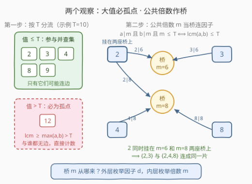
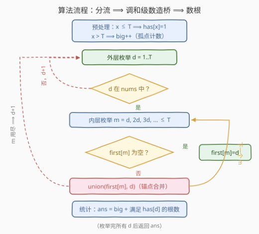

# 统计最小公倍数图中的连通块数目

- **题目名称**：统计最小公倍数图中的连通块数目
- **链接**：[3378. 统计最小公倍数图中的连通块数目](https://leetcode.cn/problems/count-connected-components-in-lcm-graph/)
- **难度**：困难
- **标签**：并查集、数论、最小公倍数、枚举倍数（调和级数）、哈希表
- **关联**：547 省份数量——并查集模板；952 按公因数数计算最大组件大小——同款「因子作桥」并查集

## 1. 题目概述

给你一个长度为 `n` 的整数数组 `nums` 和一个**正**整数 `threshold`。

有一张 `n` 个节点的图，其中第 `i` 个节点的值为 `nums[i]`。如果两个节点对应的值满足 `lcm(nums[i], nums[j]) <= threshold`，那么这两个节点在图中有一条**无向**边连接。

请你返回这张图中**连通块**的数目。

> **连通块**：图中的一个子图，子图中任意两个节点都存在路径相连，且子图中没有任何一个节点与子图以外的任何节点有边相连。

**示例 1**：

```text
输入：nums = [2,4,8,3,9], threshold = 5
输出：4
解释：四个连通块分别为 (2, 4)，(3)，(8)，(9)。
```

**示例 2**：

```text
输入：nums = [2,4,8,3,9,12], threshold = 10
输出：2
解释：两个连通块分别为 (2, 3, 4, 8, 9) 和 (12)。
```

**约束条件**：

- $1 \le nums.length \le 10^5$
- $1 \le nums[i] \le 10^9$
- `nums` 中所有元素互不相同
- $1 \le threshold \le 2 \times 10^5$

> 💡 **读题关键**：① 边的条件是 **lcm（最小公倍数）** 不超过 `threshold`，不是两数本身不超过；② `threshold` 只有 $2\times10^5$，而 `nums[i]` 可达 $10^9$——这个巨大的不对称正是解题突破口；③ 值互不相同，无需考虑重复元素的合并。

---

## 2. 解题思路

### 2.1 暴力思路：两两求 lcm

最直接的做法：枚举所有数对 $(i, j)$，计算 $\mathrm{lcm}(nums[i], nums[j])$，若 $\le threshold$ 就在并查集里合并，最后数连通块。

问题在于规模：$n \le 10^5$，数对多达 $\binom{n}{2} \approx 5 \times 10^9$ 个，每次还要一次辗转相除求 $\gcd$——哪怕 $10^9$ 次运算都需要数秒，$5 \times 10^9$ 次完全不可行。**必须换一个枚举方向：不枚举「数对」，改枚举「倍数」**。

### 2.2 核心观察：公共倍数作桥 + 调和级数枚举



**观察一：值大于 `threshold` 的点必为孤点。**

由 $\mathrm{lcm}(a, b) \ge \max(a, b)$，若 $nums[i] > threshold$，则它与**任何**数的 lcm 都严格大于 `threshold`，无边可连。又因值互不相同，每个这样的点自成一个连通块——**直接计数即可**，完全不进并查集。

**观察二：lcm 条件 ⟺ 存在公共倍数作桥。**

$$
\mathrm{lcm}(a, b) \le T \iff \exists\, m \le T,\ a \mid m \ \text{且} \ b \mid m
$$

- 正向：取 $m = \mathrm{lcm}(a, b) \le T$，显然 $a \mid m$ 且 $b \mid m$；
- 反向：若 $a, b$ 都整除某个 $m \le T$，则 $\mathrm{lcm}(a,b) \mid m$，故 $\mathrm{lcm}(a,b) \le m \le T$。

于是**不需要真的求出每一对 lcm**：只要对每个 $m \le T$，把「$m$ 的因子中出现在 `nums` 里的那些值」全部并成一片，就恰好等价于把所有 lcm $\le T$ 的数对连了边（哪怕 $m$ 不是 lcm，只要两个因子共同出现在某个 $m$ 处被合并，其 lcm 必 $\le m \le T$，不会多连）。

**观察三：调和级数枚举所有（因子, 倍数）对。**

「枚举 $m$ 的所有因子」不能对每个 $m$ 单独试除（$O(T\sqrt{T})$ 偏慢也不便查出现性），换成**筛法方向**：

```text
外层：d = 1 .. T（若 d 出现在 nums 中）
内层：m = d, 2d, 3d, … ≤ T
```

这正是埃氏筛的枚举结构，总对数为 $\sum_{d=1}^{T} \lfloor T/d \rfloor \approx T \ln T \approx 2.4 \times 10^6$，轻量。对每个 $m$ 用一个**锚点** `first[m]` 记录「第一个出现在 nums 中的因子」：后续遇到 $m$ 的其它在册因子 $d$ 时执行 `union(first[m], d)`，就把 $m$ 的所有在册因子链成一片，无需把因子列表存下来。

> ⚠️ **内层必须从 $m = d$ 开始而非 $2d$**：$d$ 自己也是 $m = d$ 的因子。例如 `nums` 含 2 和 4、$T = 5$ 时，证明 $\mathrm{lcm}(2,4)=4 \le 5$ 的**唯一**公共倍数就是 $m=4$ 本身——若从 $2d$ 开始枚举，$d=4$ 永远遇不到 $m=4$，这对数就漏连了（示例 1 会错误输出 5）。数值互不相同保证 $m=d$ 处不会产生自环，但**锚点合并**必须发生。

### 2.3 算法流程图



**完整步骤**：

1. **分流**：遍历 `nums`，值 $\le T$ 的存入出现表 `has[]`（可用长度 $T+1$ 的布尔数组，值域 $[1, T]$）；值 $> T$ 的计入 `big`（孤点数）；
2. **造桥**：`d` 从 1 到 $T$，若 `has[d]`，枚举 $m = d, 2d, \dots \le T$——`first[m]` 为空则置为 `d`（立锚），否则 `union(first[m], d)`（并锚）；
3. **数根**：答案 = `big` + 「满足 `has[d]` 且 `find(d) == d` 的 $d$ 的个数」。并查集里只有出现过的值会被改父亲，每个 present 连通块恰有一个自己的根，用 `find(d)==d` 判根即可（也可收集根去重）。

### 2.4 示例演算

![示例演算：nums=[2,4,8,3,9,12], T=10 逐步造桥](../images/p3378_example_walkthrough.svg)

以示例 2 走一遍（$T=10$，present $= \{2,3,4,8,9\}$，孤点 $12$）：

| d | 枚举的 m | first 设置 / union | present 中连通块 |
|---|----------|-------------------|----------------|
| 2 | 2,4,6,8,10 | 五个 m 全部立锚 `first=2` | {2} |
| 3 | 3,6,9 | `first[3]=3`；m=6 已有锚 → **union(2,3)**；`first[9]=3` | {2,3} |
| 4 | 4,8 | m=4 → union(2,4)；m=8 已同根 | {2,3,4} |
| 8 | 8 | union(2,8)，已同根 | {2,3,4,8} |
| 9 | 9 | union(3,9)，已同根 | {2,3,4,8,9} |

present 中合成 1 片，加上孤点 12，答案 $1 + 1 = 2$ ✓。注意关键的 `union(2,3)` 发生在桥 $m=6$ 处——$\mathrm{lcm}(2,3)=6 \le 10$，正是观察二的样子。

---

## 3. 参考代码

### C++

```cpp
class Solution {
  public:
    vector<int> parent;

    int find(int x) {
        while (parent[x] != x) {
            parent[x] = parent[parent[x]];   // 路径折叠
            x = parent[x];
        }
        return x;
    }

    int countComponents(vector<int>& nums, int threshold) {
        int T = threshold;
        parent.resize(T + 1);
        iota(parent.begin(), parent.end(), 0);

        vector<char> has(T + 1, 0);
        int big = 0;                          // 值 > T 的孤点数
        for (int x : nums) {
            if (x <= T) has[x] = 1;
            else big++;
        }

        vector<int> first(T + 1, 0);          // m 的第一个在册因子（锚点）
        for (int d = 1; d <= T; d++) {
            if (!has[d]) continue;
            for (int m = d; m <= T; m += d) { // ⚠️ 从 m=d 开始，d 也是自己的因子
                if (first[m] == 0) first[m] = d;
                else {
                    int a = find(first[m]), b = find(d);
                    if (a != b) parent[a] = b;
                }
            }
        }

        int ans = big;
        for (int d = 1; d <= T; d++)
            if (has[d] && find(d) == d) ans++;  // 数 present 里的根
        return ans;
    }
};
```

### Python

```python
class Solution:
    def countComponents(self, nums: List[int], threshold: int) -> int:
        T = threshold
        parent = list(range(T + 1))

        def find(x: int) -> int:
            while parent[x] != x:
                parent[x] = parent[parent[x]]   # 路径折叠
                x = parent[x]
            return x

        has = [False] * (T + 1)
        big = 0                                  # 值 > T 的孤点数
        for x in nums:
            if x <= T:
                has[x] = True
            else:
                big += 1

        first = [0] * (T + 1)                    # m 的第一个在册因子（锚点）
        for d in range(1, T + 1):
            if not has[d]:
                continue
            for m in range(d, T + 1, d):         # ⚠️ 从 m=d 开始，d 也是自己的因子
                if first[m] == 0:
                    first[m] = d
                else:
                    ra, rb = find(first[m]), find(d)
                    if ra != rb:
                        parent[ra] = rb

        ans = big + sum(1 for d in range(1, T + 1) if has[d] and find(d) == d)
        return ans
```

> 💡 两版等价。核心只有三行：立锚 `first[m]=d`、并锚 `union(first[m], d)`、数根 `find(d)==d`。并查集只对 present 值操作，父亲指针从未指向不在册的值，因此「present 且是根」就是连通块代表。

---

## 4. 复杂度分析

| 维度 | 复杂度 | 说明 |
|------|--------|------|
| 时间复杂度 | $O(n + T \log T)$ | 枚举（因子, 倍数）对共 $\sum_{d \le T}\lfloor T/d \rfloor \approx T \ln T \approx 2.4\times10^6$；并查集路径折叠 + 按序合并近似 $O(\alpha)$，可忽略 |
| 空间复杂度 | $O(T)$ | `parent`、`has`、`first` 三个长度 $T+1$ 的数组 |
| 与暴力对比 | 暴力 $O(n^2 \log V)$ | 数对 $5\times10^9$ 个直接超时；本题反手枚举 $T \log T$ 个（因子, 倍数）对，用 $T \le 2\times10^5$ 的小值域吃掉 $n$ 与值域 $10^9$ 两个大参数 |

> ⚠️ 复杂度与 $nums[i]$ 的大小（$10^9$）**无关**——超过 $T$ 的值一步分流成孤点，这正是把「大值域」问题压到「小门槛」上的关键。若把本题的 `threshold` 上调到 $10^9$，调和级数枚举即失效，需要另想出路。

---

## 5. 扩展：「因子作桥」家族——gcd 版与 lcm 版对照

本题属于「**不显式建图，用数论关系作桥做并查集**」的经典家族，按桥的形态分两支：

| 版本 | 连边条件 | 桥 | 代表题 |
|------|----------|-----|--------|
| **gcd 版** | $\gcd(a,b) > 1$（或 $> k$） | **公共质因子** $p$ | [952](https://leetcode.cn/problems/largest-component-size-by-common-factor/)、[2709](https://leetcode.cn/problems/greatest-common-divisor-traversal/)、[1627](https://leetcode.cn/problems/graph-connectivity-with-threshold/) |
| **lcm 版（本题）** | $\mathrm{lcm}(a,b) \le T$ | **公共倍数** $m \le T$ | 3378 |

- gcd 版的做法：用**最小质因数（SPF）筛**分解每个数，把数与它的每个质因子合并——「因子集合」是质数，值域由最大值决定；
- lcm 版的做法：用**调和级数枚举倍数**，把 $m$ 与它的在册因子合并——「因子集合」是 $[1, T]$ 内的出现值，值域由 threshold 决定。

两者互为对偶：一个从下往上（公共的「因」），一个从上往下（公共的「倍」）。面试中若把条件换成 $\gcd(a,b) \le k$、$\mathrm{lcm}(a,b) > T$ 等变体，先想清楚「哪种公共对象可以当桥、枚举它的代价是多少」，再套同样的并查集骨架。

另外注意本题的一个可错点已在前文强调：内层从 $m = d$ 起枚举。若改成从 $2d$ 起，等价于默认「每个数只与更小的因子配对」，但 $d$ 自身作为 $m$ 的因子这一信息丢了，`lcm` 恰为较小数本身的倍数关系（如 2 与 4）会被漏掉。

---

## 6. 面试要点

1. **为什么值大于 `threshold` 的点一定是孤点？**

   > $\mathrm{lcm}(a,b)$ 是 $a, b$ 的公倍数，必然 $\ge \max(a,b)$。若 $nums[i] > threshold$，则它与任何值的 lcm 都 $\ge nums[i] > threshold$，无边；值互不相同又排除了相等值抱团，所以每个这样的点独立成块，计数即可。

2. **「存在 $m \le T$ 同时被 $a, b$ 整除」为什么等价于 $\mathrm{lcm}(a,b) \le T$？**

   > 正向取 $m = \mathrm{lcm}(a,b)$；反向由 lcm 是最小公倍数且整除任何公倍数，得 $\mathrm{lcm}(a,b) \mid m$，故 $\mathrm{lcm}(a,b) \le m \le T$。这个等价把「逐对算 lcm」换成「逐个 $m$ 收拢因子」，是复杂度从 $O(n^2)$ 降到 $O(T \log T)$ 的根本原因。

3. **并查集合并的正确性会不会「多连边」？**

   > 不会。若 $a, b$ 在某个 $m \le T$ 处被合并，说明 $a \mid m$ 且 $b \mid m$，于是 $\mathrm{lcm}(a,b) \le m \le T$，即原图中本就有边（或经传递可达）。合并关系是原图连通性的**子集且覆盖所有 lcm 条件对**，因此连通块数恰好一致。

4. **内层枚举为什么必须从 $m = d$ 开始？从 $2d$ 开始会怎样？**

   > $d$ 也是 $m = d$ 的在册因子，需参与锚点合并。反例：`nums` 含 2 和 4、$T=5$，唯一能证明 $\mathrm{lcm}(2,4)=4 \le 5$ 的公共倍数是 $m=4$；从 $2d$ 起枚举时 $d=4$ 只会访问 $m=8 > T$，这对数漏连，示例 1 将错误输出 5。

5. **为什么最后能用 `find(d) == d` 直接数连通块？**

   > 并查集里只有 present 的值会发生 `union`，父亲指针永远不会指向不在册的值或虚构节点，因此每个 present 连通块的代表根本身必是 present 值，非 present 值永远是自身根但被 `has[d]` 过滤。「has[d] 且 find(d)==d」恰每块数一次。

> 💡 **一句话总结**：3378 的灵魂是「**公共倍数作桥**」——先用 $\mathrm{lcm} \ge \max$ 把大值分流成孤点，再用「$a \mid m, b \mid m, m \le T \iff \mathrm{lcm}(a,b) \le T$」把配对问题转为枚举问题，调和级数枚举（因子, 倍数）对 + 锚点合并，$O(T \log T)$ 收工。与 952 的「公共质因子作桥」互为对偶。

---

## 7. 同类练习题

- [952. 按公因数数计算最大组件大小](https://leetcode.cn/problems/largest-component-size-by-common-factor/)：gcd 版对偶——公共质因子作桥，SPF 筛分解 + 并查集，求最大块而非块数
- [2709. 最大公约数遍历](https://leetcode.cn/problems/greatest-common-divisor-traversal/)：判定「能否经 gcd>1 的中转互相到达」，即 gcd 版连通性判定，同款质因子桥
- [1627. 带阈值的图连通性](https://leetcode.cn/problems/graph-connectivity-with-threshold/)：离线查询「x,y 是否有大于 threshold 的公因数」，调和级数枚举 + 并查集，只合并 d > threshold 的桥
- [2183. 统计可以被 M 整除的 i*j 对](https://leetcode.cn/problems/count-array-pairs-divisible-by-k/)：同款「枚举倍数计数」思想——按 gcd 分桶再对每个 gcd 枚举其倍数，不建图而数对
