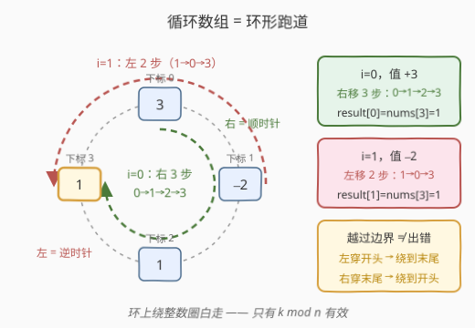
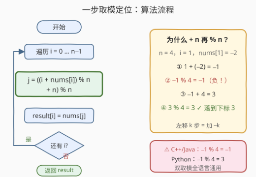
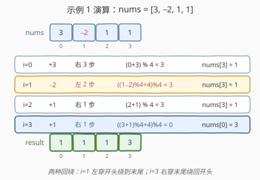

# LeetCode 转换数组 题解

- **关联**：1920 基于排列构建数组——`result[i] = nums[nums[i]]` 是本题去掉「循环」与「方向」后"一跳写值"的最纯形态；189 轮转数组——整段数组在循环意义下平移 $k$ 步，取模定位是同一招的批量版

## 1. 题目概述

- **标题 / 题号**：转换数组（#3379，easy）
- **链接**：https://leetcode.cn/problems/transformed-array/
- **难度**：简单
- **标签**：数组、模拟

**题意**：给你一个整数数组 `nums`，把它看作**循环数组**（首尾相接的环）。请构造一个**大小相同**的新数组 `result`，对每个下标 `i` **独立**执行：

- 若 `nums[i] > 0`：从 `i` 出发**向右**移动 `nums[i]` 步，落脚点的值赋给 `result[i]`；
- 若 `nums[i] < 0`：从 `i` 出发**向左**移动 $|\text{nums}[i]|$ 步，落脚点的值赋给 `result[i]`；
- 若 `nums[i] == 0`：`result[i] = nums[i]`（原地不动）。

由于是循环数组，向右越过末尾将回到开头，向左越过开头将回到末尾。

**示例 1**：

```text
输入：nums = [3,-2,1,1]
输出：[1,1,1,3]
解释：
  nums[0]=3：右移 3 步到下标 3 → result[0] = 1
  nums[1]=-2：左移 2 步到下标 3 → result[1] = 1
  nums[2]=1：右移 1 步到下标 3 → result[2] = 1
  nums[3]=1：右移 1 步越过末尾回绕到下标 0 → result[3] = 3
```

**示例 2**：

```text
输入：nums = [-1,4,-1]
输出：[-1,-1,4]
解释：
  nums[0]=-1：左移 1 步越过开头绕到末尾下标 2 → result[0] = -1
  nums[1]=4：右移 4 步 = 绕一整圈(3步)再多 1 步，落脚下标 2 → result[1] = -1
  nums[2]=-1：左移 1 步到下标 1 → result[2] = 4
```

**约束**：

- $1 \le \text{nums.length} \le 100$
- $-100 \le \text{nums[i]} \le 100$

> 💡 **读题关键**：① 「移动 $k$ 步」不是交换、不是删除，只是**定位**——各下标的移动**互相独立**，读一次值写进 `result` 即可，不存在先后依赖；② 「循环」意味着下标运算发生在**模 $n$ 的世界**里，越界不是错误而是**回绕**；③ 把「向左 $|k|$ 步」看成「向右 $k$ 步」（$k < 0$），三种分支就能合并成**一个统一公式**——示例 2 中 `i=1` 走 4 步与走 1 步落脚相同，正是「绕整数圈白走」的体现。

## 2. 解题思路

### 2.1 暴力思路：老老实实一步一步走

按题面字面模拟：对每个 `i`，维护指针 `j = i`，循环 $|\text{nums}[i]|$ 次，每步 `j = (j+1) % n`（向右）或 `j = (j-1+n) % n`（向左），走完把 `nums[j]` 写入 `result[i]`。

```text
for i in 0 … n−1:
    j = i, k = nums[i]
    重复 |k| 次：j = (j + sign(k)) % n   # sign(k) 为 +1 / −1
    result[i] = nums[j]
```

总步数 $\sum |\text{nums}[i]| \le 100 \times 100 = 10^4$，本题数据下毫无压力。但「一步一格」把 $k$ 步展开成 $k$ 次循环——一旦步长放大到 $10^9$（循环数组变体题常见），逐 步走必然超时。**在模 $n$ 世界里，走 $k$ 步和走 $k \bmod n$ 步落脚点完全相同**——环上绕整数圈是白走的，一次取模就能直接跳到答案。

### 2.2 核心观察：循环数组 = 模 n 加法（钟表算术）



把数组首尾相接画成环（像钟面）：

- **向右 $k$ 步**：顺时针转 $k$ 格；
- **向左 $k$ 步**：逆时针转 $k$ 格——等价于顺时针转 $-k$ 格，**方向与符号被加法统一**；
- **绕整数圈**回到原处，只有 $k \bmod n$ 有效。

于是三种分支合并成一个公式：

$$
\text{result}[i] = \text{nums}\Big[\big((i + \text{nums}[i]) \bmod n + n\big) \bmod n\Big]
$$

**为什么有 `+ n` 再 `% n` 的双保险？** 因为 $i + \text{nums}[i]$ 可能为负（最小 $-100$），而 **C++/Java 的 `%` 对负数返回非正值**：`-1 % 4 = -1`，直接当数组下标就越界了。双取模把任意整数规范到 $[0, n)$：

| 输入 $x$（$n=4$） | $x \bmod n$（C++ 语义） | $+\,n$ 后 | 再 $\bmod n$ |
|------------------|------------------------|-----------|--------------|
| $-1$ | $-1$ ⚠️ | $3$ | $3$ ✓ |
| $-9$ | $-1$ ⚠️ | $3$ | $3$ ✓ |
| $5$ | $1$ | $5$ | $1$ ✓ |

> 💡 Python 的 `%` 结果符号跟随除数（`-1 % 4 = 3`），单取模就够；但 `((x % n) + n) % n` 是**全语言通用**写法，面试直接写它最稳。另注意两个边界被公式自动吸收：**0 值分支**（移动 0 步 = 原地，$i + 0 = i$）与 **$n = 1$**（任何数 $\bmod 1 = 0$，怎么走都回到唯一格子）。

### 2.3 算法流程图



一次遍历，每个下标三步：

1. **合并方向**：$k = \text{nums}[i]$，正负号天然区分右移/左移；
2. **一步定位**：$j = ((i + k) \bmod n + n) \bmod n$，双取模规范到 $[0, n)$；
3. **写值**：$\text{result}[i] = \text{nums}[j]$。

### 2.4 示例演算



以 `nums = [3, -2, 1, 1]`（$n = 4$）走一遍：

| $i$ | nums[i] | 移动 | 落脚点 $j$ | result[i] |
|-----|---------|------|-----------|-----------|
| 0 | $+3$ | 右 3 步 | $(0+3) \bmod 4 = 3$ | $\text{nums}[3] = 1$ |
| 1 | $-2$ | 左 2 步 | $((1-2) \bmod 4 + 4) \bmod 4 = 3$ | $\text{nums}[3] = 1$ |
| 2 | $+1$ | 右 1 步 | $(2+1) \bmod 4 = 3$ | $\text{nums}[3] = 1$ |
| 3 | $+1$ | 右 1 步 | $((3+1) \bmod 4 + 4) \bmod 4 = 0$ | $\text{nums}[0] = 3$ |

四行里藏着**两种回绕**：$i=1$ 向左越过开头绕到末尾（$1 \to 0 \to 3$），$i=3$ 向右越过末尾绕回开头（$3 \to 0$）——公式对两个方向一视同仁，无需任何分支。输出 `[1,1,1,3]` ✓。

## 3. 参考代码

### C++

```cpp
class Solution {
  public:
    vector<int> constructTransformedArray(vector<int>& nums) {
        int n = nums.size();
        vector<int> result(n);
        for (int i = 0; i < n; i++) {
            int j = ((i + nums[i]) % n + n) % n;   // 双取模：负数安全落回 [0, n)
            result[i] = nums[j];
        }
        return result;
    }
};
```

### Python

```python
class Solution:
    def constructTransformedArray(self, nums: List[int]) -> List[int]:
        n = len(nums)
        return [nums[(i + nums[i]) % n] for i in range(n)]
```

> 💡 Python 的 `%` 对负数天然返回 $[0, n)$ 内的值（余数符号随除数），单取模即可；若追求跨语言一致，写 `((i + nums[i]) % n + n) % n` 也完全正确。C++ 中 `i + nums[i]` 最小为 $-100$，一次 `% n` 后落在 $(-n, n)$，`+ n` 后落在 $(0, 2n)$，再 `% n` 必落在 $[0, n)$——每一步的范围都可推算，不会越界。

## 4. 复杂度分析

| 维度 | 复杂度 | 说明 |
|------|--------|------|
| **时间复杂度** | $O(n)$ | 每个下标一次加法 + 双取模，$O(1)$ 定位 |
| **空间复杂度** | $O(1)$ | 不计输出数组，只使用常数变量 |

> ⚠️ 对比暴力逐 步走：时间 $O\big(\sum_i |\text{nums}[i]|\big)$，本题上界 $10^4$ 也能过；但取模版对**任意大步长**（如 $10^9$）免疫——这正是模板化「循环数组下标运算」的价值所在。

## 5. 扩展：负数取模的语言差异与通用模板

「%」在不同语言里对负数的行为不同，这是本题唯一的坑，也是循环数组类题目的通用考点：

| 语言 | `-1 % 4` 的值 | 语义 |
|------|--------------|------|
| C++ / Java / JavaScript / Go | $-1$ | 商向零截断，余数符号随**被除数** |
| Python / Ruby | $3$ | 商向负无穷（地板除），余数符号随**除数** |

通用安全模板（把任意整数映到 $[0, n)$）：

$$
\text{safe}(x, n) = \big((x \bmod n) + n\big) \bmod n
$$

它还有个更深刻的身份：**模 $n$ 剩余类的规范代表元**。循环数组的所有下标运算——本题的单次移动、[189 轮转数组](../0101-0200/189_轮转数组.md)的整体平移、[457 环形数组是否存在循环](../0401-0500/457_环形数组是否存在循环.md)的反复跳跃——本质上都是在 $\mathbb{Z}_n$ 上做加法，双取模就是把结果落回标准代表元的动作。把这道简单题的公式吃透，一整族题目的下标运算就再无悬念。

## 6. 面试要点

1. **为什么向左移动也能用 $i + \text{nums}[i]$？**

   - 向左 $|k|$ 步 = 向右 $k$ 步（$k$ 取负），环上方向只是符号；
   - 模 $n$ 加法把「左右两个方向 + 三种符号分支」统一成一个算式，公式里没有任何 `if`。

2. **`+ n` 再 `% n` 双取模防什么？**

   - C++/Java 中负数 % 正数结果为负（如 $-1 \bmod 4 = -1$），直接当数组下标会越界；
   - 双取模把任意整数规范到 $[0, n)$。Python 单取模即可（余数符号随除数），但双取模全语言通用，是最稳的面试写法。

3. **`nums[i] = 0` 要特判吗？$n = 1$ 呢？**

   - 都不用。0 步移动 = 原地：$i + 0 = i$；
   - $n = 1$ 时任何下标 $\bmod 1 = 0$，怎么走都回到唯一格子——两个边界都被公式自动吸收。

4. **一步取模和逐步走的复杂度差别？**

   - 逐步走 $O\big(\sum |\text{nums}[i]|\big)$，本题 $\le 10^4$ 无所谓；
   - 但步长若放大到 $10^9$（变体题常见），逐步走必超时，取模 $O(1)$ 永远免疫——环上绕整数圈等价于不走，$k \bmod n$ 才是有效位移。

5. **这题和 1920 / 189 / 457 的关系？**

   - 1920 是「一跳写值」模拟的最纯形态（`nums[nums[i]]`，无循环无方向）；
   - 189 是同一取模定位的批量版（整段平移 $k$）；
   - 457 把「单次跳跃」迭代成函数图找环——同一套循环数组下标运算的四种考法。

> 💡 **一句话总结**：循环数组上「向右 $k$ 步」就是模 $n$ 加法，$\big((i + \text{nums}[i]) \bmod n + n\big) \bmod n$ 一步定位落脚点——双取模防住负数，公式自动吸收 0 值与 $n=1$ 两个边界。

## 同类练习题

| # | 题目 | 与本题的关联 |
|---|------|-------------|
| 1920 | [基于排列构建数组](https://leetcode.cn/problems/build-array-from-permutation/)（[题解](../1901-2000/1920_基于排列构建数组.md)） | `result[i] = nums[nums[i]]`，去掉循环与方向后的"一跳写值"最纯形态 |
| 189 | [轮转数组](https://leetcode.cn/problems/rotate-array/)（[题解](../0101-0200/189_轮转数组.md)） | 整段数组循环平移 $k$ 步，`(i + k) % n` 批量定位与本题同源 |
| 457 | [环形数组是否存在循环](https://leetcode.cn/problems/circular-array-loop/)（[题解](../0401-0500/457_环形数组是否存在循环.md)） | 沿 `nums[i]` 步长在环上反复跳跃并判环——本题「单次跳跃」的迭代版进阶 |
