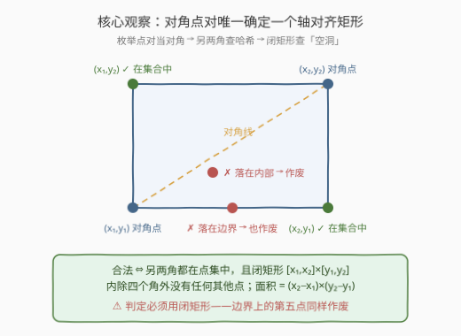
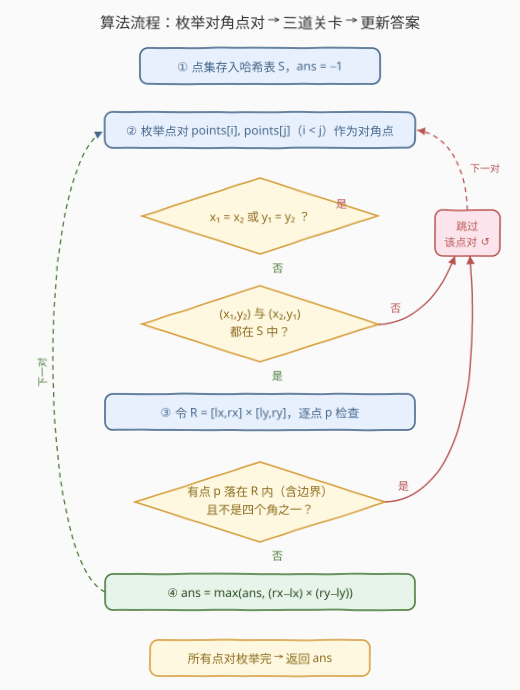
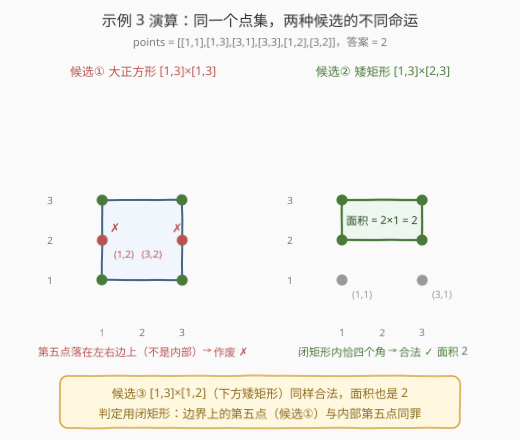

# LeetCode 用点构造面积最大的矩形 I 题解

- **关联**：939 最小面积矩形——同款「对角点对 + 哈希查两角」模板；3382 用点构造面积最大的矩形 II——困难版（左下角定形 + 二维数点）

## 1. 题目概述

- **标题 / 题号**：用点构造面积最大的矩形 I（#3380，medium）
- **链接**：https://leetcode.cn/problems/maximum-area-rectangle-with-point-constraints-i/
- **难度**：中等
- **标签**：几何、枚举、哈希表、数组

**题意**：给你一个数组 `points`，其中 `points[i] = [xi, yi]` 表示无限平面上一点的坐标。

你的任务是找出满足以下条件的矩形可能的**最大**面积：

- 矩形的四个顶点必须是数组中的**四个**点；
- 矩形的内部或边界上**不能**包含任何**其他**点（即除四个顶点之外的点）；
- 矩形的边与坐标轴**平行**。

返回可以获得的**最大面积**，如果无法形成这样的矩形，则返回 `-1`。

**示例 1**：

```text
输入：points = [[1,1],[1,3],[3,1],[3,3]]
输出：4
解释：这 4 个点恰好构成一个矩形，内部与边界上都没有其他点，面积为 4。
```

**示例 2**：

```text
输入：points = [[1,1],[1,3],[3,1],[3,3],[2,2]]
输出：-1
解释：唯一能构成的矩形是 [1,3]×[1,3]，但点 (2,2) 落在其内部，作废。
```

**示例 3**：

```text
输入：points = [[1,1],[1,3],[3,1],[3,3],[1,2],[3,2]]
输出：2
解释：上矩形 [1,3]×[2,3]（顶点 (1,3),(1,2),(3,2),(3,3)）合法，面积为 2；
      下矩形 [1,3]×[1,2] 同样合法，面积相同；大正方形因边上有点作废。
```

**约束**：

- $1 \le \text{points.length} \le 10$
- `points[i].length == 2`
- $0 \le x_i, y_i \le 100$
- 给定的所有点都是**唯一**的。

> 💡 **读题关键**：①「其他点」指除四个顶点之外的点——**落在边界上也算**，不只是内部；② 四个顶点必须构成真正的矩形，即两横两竖，不允许退化成线段（$x_1 \ne x_2$ 且 $y_1 \ne y_2$）；③ $n \le 10$ 是极强烈的信号：**暴力枚举**就是正解，别被标签里的树状数组/线段树吓到（那是给困难版 3382 的）。

## 2. 解题思路

### 2.1 暴力思路：枚举四点组合

最直接的做法：从 $n$ 个点里枚举所有四点组合，共 $C(10,4) = 210$ 种。对每组先判定「能否构成轴对齐矩形」——排序后恰好出现**两对相同的 x、两对相同的 y**；再花 $O(n)$ 检查闭矩形内有无第五点。总量约 $210 \times 10 \approx 2000$ 次基本操作，性能毫无压力。

但「判形」的分支逻辑较绕（排序 + 多次比较），容易写错。存在一个更干净的等价视角：

> **轴对齐矩形由一条对角线唯一确定。** 对角两点 $(x_1, y_1)$、$(x_2, y_2)$（$x_1 \ne x_2$、$y_1 \ne y_2$）一旦给定，另外两角**别无选择**，只能是 $(x_1, y_2)$ 和 $(x_2, y_1)$，用哈希集合一次查询即可判定存在性。

于是枚举对象从 $O(n^4)$ 个四点组降为 $O(n^2)$ 个**点对**，判形与查空洞在同一个循环里自然完成。官方 hint 也是这个方向：*"Fix two points and find the other two using a set data structure."*

### 2.2 核心观察：对角点对 + 哈希查两角 + 闭矩形查空洞



整个算法由三个观察拼成：

| 观察 | 内容 | 代价 |
|------|------|------|
| **对角线定矩形** | 轴对齐矩形由对角两点唯一确定，另两角只能是 $(x_1, y_2)$、$(x_2, y_1)$ | 枚举 $O(n^2)$ 个点对 |
| **两角存在性** | 点集预先存入哈希集合，两次 $O(1)$ 查询 | $O(1)$ |
| **闭矩形无空洞** | 候选矩形 $R = [\min x_1x_2, \max x_1x_2] \times [\min y_1y_2, \max y_1y_2]$，扫描全部点：凡落在 $R$ 内（**含边界**）且不是四角之一 → 作废 | $O(n)$ |

面积公式自然导出：

$$
\text{area} = (x_2 - x_1) \times (y_2 - y_1)
$$

> ⚠️ **闭区间陷阱**：判定必须用**闭矩形**——落在**边界上**（而非内部）的第五点同样作废。示例 3 里 $(1,2)$、$(3,2)$ 恰好落在大正方形的左右两条边上，正中这个陷阱；如果只查严格内部，会把 $4$ 错报成答案。实现上就是两个 `<=`（`lx <= px <= rx && ly <= py <= ry`），千万别写成 `<`。

顺带一提：每个矩形有**两条**对角线，同一个矩形会被枚举两次（两条对角线各一次）。因为我们只取 `max`，重复计算不影响正确性，无需去重。

### 2.3 算法流程图



流程要点：

1. **预处理**：所有点入哈希集合 `S`，`ans` 初始化为 `-1`；
2. **双重循环**枚举点对 $(i, j)$，$i < j$，视作一条对角线的两端；
3. **第一关（非退化）**：$x_1 = x_2$ 或 $y_1 = y_2$ 说明两点同列/同行，拉不出矩形，跳过；
4. **第二关（两角存在）**：$(x_1, y_2)$、$(x_2, y_1)$ 必须都在 `S` 中，缺一跳过；
5. **第三关（闭矩形无空洞）**：扫描所有点，发现任何一个「落在闭矩形内且不是四角」的点即作废；
6. **过关**：更新 $ans \leftarrow \max(ans, (x_2 - x_1)(y_2 - y_1))$；
7. **收尾**：初值 `-1` 天然覆盖「点数不足 4」「无合法矩形」两种情形。

### 2.4 示例演算



以示例 3（`points = [[1,1],[1,3],[3,1],[3,3],[1,2],[3,2]]`）为例。15 个点对中，能同时通过「非退化 + 两角存在」两关的候选矩形只有三个（每个被两条对角线各枚举一次）：

| 候选矩形 | 枚举到的对角点对 | 闭矩形检查 | 结论 |
|----------|------------------|------------|------|
| $[1,3] \times [1,3]$（大正方形） | $(1,1)$-$(3,3)$、$(1,3)$-$(3,1)$ | $(1,2)$、$(3,2)$ 落在**边界**上 | 作废 ✗ |
| $[1,3] \times [2,3]$（上方矮矩形） | $(1,3)$-$(3,2)$、$(1,2)$-$(3,3)$ | 其余点均在闭矩形外 | 合法 ✓ 面积 2 |
| $[1,3] \times [1,2]$（下方矮矩形） | $(1,1)$-$(3,2)$、$(1,2)$-$(3,1)$ | 其余点均在闭矩形外 | 合法 ✓ 面积 2 |

其余点对要么同列/同行被跳过（如 $(1,1)$-$(1,3)$），要么查不到另两角（如 $(1,1)$-$(3,2)$ 之外的组合）。最终答案 $= 2$ ✓。

## 3. 参考代码

### C++

```cpp
class Solution {
public:
    int maxRectangleArea(vector<vector<int>>& points) {
        set<pair<int, int>> ptSet;
        for (auto& p : points) ptSet.emplace(p[0], p[1]);
        int n = points.size(), ans = -1;
        for (int i = 0; i < n; ++i) {
            int x1 = points[i][0], y1 = points[i][1];
            for (int j = i + 1; j < n; ++j) {
                int x2 = points[j][0], y2 = points[j][1];
                if (x1 == x2 || y1 == y2) continue;  // 同列/同行，退化
                if (!ptSet.count({x1, y2}) || !ptSet.count({x2, y1})) continue;  // 另两角必须存在
                int lx = min(x1, x2), rx = max(x1, x2);
                int ly = min(y1, y2), ry = max(y1, y2);
                bool ok = true;  // 闭矩形内除四角外不得有点
                for (auto& p : points) {
                    int px = p[0], py = p[1];
                    if (lx <= px && px <= rx && ly <= py && py <= ry
                        && !((px == x1 || px == x2) && (py == y1 || py == y2))) {
                        ok = false;
                        break;
                    }
                }
                if (ok) ans = max(ans, (rx - lx) * (ry - ly));
            }
        }
        return ans;
    }
};
```

### Python

```python
class Solution:
    def maxRectangleArea(self, points: List[List[int]]) -> int:
        pt_set = {(x, y) for x, y in points}
        n = len(points)
        ans = -1
        for i in range(n):
            x1, y1 = points[i]
            for j in range(i + 1, n):
                x2, y2 = points[j]
                if x1 == x2 or y1 == y2:
                    continue  # 同列/同行，退化
                if (x1, y2) not in pt_set or (x2, y1) not in pt_set:
                    continue  # 另两角必须存在
                lx, rx = min(x1, x2), max(x1, x2)
                ly, ry = min(y1, y2), max(y1, y2)
                corners = {(x1, y1), (x2, y2), (x1, y2), (x2, y1)}
                # 闭矩形内除四角外不得有点
                if all(not (lx <= px <= rx and ly <= py <= ry)
                       or (px, py) in corners for px, py in points):
                    ans = max(ans, (rx - lx) * (ry - ly))
        return ans
```

> 💡 **实现细节**：「是不是四角」的判定可以不建 `corners` 集合——在闭矩形内的点，只要满足「横坐标等于 $x_1$ 或 $x_2$ **且**纵坐标等于 $y_1$ 或 $y_2$」，就必然是四角之一（点不重复），C++ 版用的就是这个写法。两种写法等价，取顺手的即可。

## 4. 复杂度分析

| 维度 | 复杂度 | 说明 |
|------|--------|------|
| 时间 | $O(n^3)$，$n \le 10$ | $O(n^2) = 45$ 个对角点对，每对做 $O(n)$ 的闭矩形扫描，总量不足 500 次基本操作 |
| 空间 | $O(n)$ | 哈希点集 |

## 5. 扩展：困难版 3382 怎么办

困难版 [3382. 用点构造面积最大的矩形 II](https://leetcode.cn/problems/maximum-area-rectangle-with-point-constraints-ii/) 把规模推到 $n \le 2 \times 10^5$、坐标 $\le 8 \times 10^7$（输入格式变为 `xCoord`/`yCoord` 两个数组，题意完全相同）。$O(n^3) \approx 10^{16}$ 彻底不可行，必须换结构视角：

**合法矩形的左下角唯一确定整个矩形**：

1. **底边无点**：底边 $y = y_1$ 上 $x_1$ 与 $x_2$ 之间不能有其他点（会落在边界），所以 $x_2$ 必须是行 $y_1$ 中 $x_1$ 的**右邻**；
2. **左边无点**：同理 $y_2$ 必须是列 $x_1$ 中 $y_1$ 的**上邻**；
3. 于是把点按行/列分组排序后，**每个点作为左下角至多产生一个候选矩形**（右邻 × 上邻 × 哈希查 $(x_2, y_2)$ 存在）——候选总数从 $O(n^2)$ 骤降到 $O(n)$；
4. 最后的「闭矩形内恰有四角、别无他点」判定，用**二维数点**（离线扫描线 + 树状数组，即本题标签里 Binary Indexed Tree 的来历）做到每次 $O(\log n)$。

整体 $O(n \log n)$，坐标需先离散化。本题标签里的树状数组/线段树/排序，正是 I/II 两版共享标签时从困难版带来的——简单版完全用不上，别被吓退。

## 6. 面试要点

- **Q：为什么枚举对角点对，而不是枚举四点组合？**
  **答**：轴对齐矩形由对角线唯一确定，另两角 $(x_1, y_2)$、$(x_2, y_1)$ 可以直接由对角两点算出并用哈希 $O(1)$ 验证存在。枚举量从 $O(n^4)$ 降到 $O(n^2)$，且省去「排序判形」的绕口逻辑，代码更短更稳。

- **Q：边界上的点和内部的点，处理上有区别吗？**
  **答**：没有区别，都作废。判定一律用**闭矩形** $[x_1, x_2] \times [y_1, y_2]$（含边界），唯一豁免的是四个顶点本身。把 `<=` 写成 `<` 是本题最常见的 WA 点——示例 3 的 $(1,2)$、$(3,2)$ 就踩在边上。

- **Q：同一矩形被两条对角线各枚举一次，需要去重吗？**
  **答**：不需要。答案只取 `max`，重复计算不影响正确性；引入「已访问矩形」集合去重反而多写代码、多开内存，还容易在键的表示上引入 bug。

- **Q：点数不足 4 时，代码会怎样？**
  **答**：`ans` 初值 `-1`，而任何点对要么因退化（同列/同行）被跳过，要么因「另两角不存在」被跳过——不足 4 点时根本凑不齐两角，永远走不到更新逻辑，最终自然返回 `-1`，无需特判。

- **Q：坐标为负或很大时，这份代码要改吗？**
  **答**：不用。全程只用相等比较与 `min`/`max`，不依赖坐标非负、也不开值域数组。困难版做离散化是为了给树状数组腾下标，与本题的哈希做法无关。

## 同类练习题

| # | 题目 | 与本题的关联 |
|---|------|-------------|
| 939 | [最小面积矩形](https://leetcode.cn/problems/minimum-area-rectangle/) | 同款「枚举对角点对 + 哈希查两角」模板，目标换成最小面积，且没有「无空洞」约束 |
| 3025 | [人员站位的方案数 I](https://leetcode.cn/problems/find-the-number-of-ways-to-place-people-i/) | 枚举点对 + 逐点「遮挡」判定，几何枚举范式的近亲 |
| 3382 | [用点构造面积最大的矩形 II](https://leetcode.cn/problems/maximum-area-rectangle-with-point-constraints-ii/) | 本题困难版，左下角定形 + 扫描线/树状数组二维数点 |
| 149 | [直线上最多的点数](https://leetcode.cn/problems/max-points-on-a-line/) | 几何枚举 + 哈希精确分组打配合的另一经典 |
