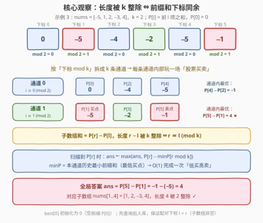
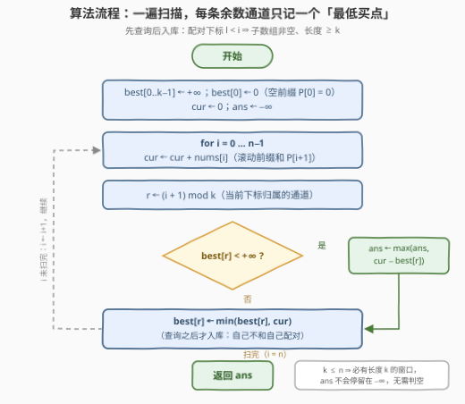
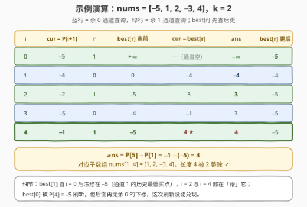

# 长度可被K整除的子数组的最大元素和

- **题目名称**：长度可被K整除的子数组的最大元素和
- **链接**：[3381. 长度可被 K 整除的子数组的最大元素和](https://leetcode.cn/problems/maximum-subarray-sum-with-length-divisible-by-k/)
- **难度**：中等
- **标签**：数组、哈希表、前缀和
- **关联**：[53. 最大子数组和](https://leetcode.cn/problems/maximum-subarray/) 是去掉长度约束的基础版；[974. 和可被 K 整除的子数组](https://leetcode.cn/problems/subarray-sums-divisible-by-k/) 同样按「$\bmod k$」分组，但整除的是**和**（计数），本题整除的是**长度**（最值）；[121. 买卖股票的最佳时机](https://leetcode.cn/problems/best-time-to-buy-and-sell-stock/) 的「历史最低买入」正是每个余数通道里要做的事

## 1. 题目概述

给你一个整数数组 `nums` 和一个整数 `k`。返回 `nums` 中一个**非空子数组**的**最大**和，要求该子数组的长度可以**被 `k` 整除**。

**子数组**是数组中的一个连续元素序列。

**示例 1**：

```text
输入：nums = [1,2], k = 1
输出：3
解释：子数组 [1, 2] 的和为 3，其长度为 2，可以被 1 整除。
```

**示例 2**：

```text
输入：nums = [-1,-2,-3,-4,-5], k = 4
输出：-10
解释：满足题意且和最大的子数组是 [-1, -2, -3, -4]，其长度为 4，可以被 4 整除。
```

**示例 3**：

```text
输入：nums = [-5,1,2,-3,4], k = 2
输出：4
解释：满足题意且和最大的子数组是 [1, 2, -3, 4]，其长度为 4，可以被 2 整除。
```

**约束条件**：

- $1 \le k \le n \le 2 \times 10^5$
- $-10^9 \le nums[i] \le 10^9$

> 💡 **读题关键**：① 长度只被**整除性**约束——可以是 $k, 2k, 3k, \dots$ 任何一档，不是「恰好 $k$」；② 元素可负（示例 2 全负，答案是不得不吃的 $-10$），直接跑 Kadane 不行——无约束的最优子数组长度未必被 $k$ 整除；③ $n$ 达 $2 \times 10^5$，$O(n^2)$ 与 $O(nk)$ 都过不去，必须一遍线性；④ $|P| \le 2 \times 10^{14}$，C++ 必须用 `long long`。

---

## 2. 解题思路

### 2.1 暴力思路：枚举端点，以及一个「差一步」的 DP

最朴素的写法：枚举起点、终点，长度对 $k$ 取模为 0 时用前缀和 $O(1)$ 取出区间和更新答案，总 $O(n^2)$——$n = 2 \times 10^5$ 时约 $2 \times 10^{10}$ 次运算，超时。

顺着 DP 想也很自然：令 $g[j]$ 表示「以**当前处理位置**结尾、长度 $\equiv j \pmod k$」的最大子数组和。每读入一个新元素 $x$，所有子数组长度同时 $+1$，相当于把整张表**循环右移一格**再加 $x$：$g'[(j+1) \bmod k] = g[j] + x$；另有「从 $x$ 重新开一段长度 1」的分支（仅当 $k = 1$ 时长度 1 合法）。有趣的是 $k = 1$ 时它恰好退化成 Kadane：$g' = \max(g + x,\ x)$。但每步要搬迁 $k$ 个状态，总 $O(nk)$——$k$ 接近 $n$ 时同样是 $4 \times 10^{10}$ 量级，超时。

> 💡 **卡住的根源**：我们背着「每个余数一份完整状态」在走，而每个余数真正用到的只有一个统计量——**通道内最小前缀和**。状态过载，是复杂度虚高的信号。

### 2.2 核心观察：长度整除 ⇔ 下标同余，分通道 + 通道内最小前缀



设 $P[0] = 0$，$P[i] = nums[0..i-1]$ 之和。子数组 $nums[l..r-1]$ 的和为 $P[r] - P[l]$，长度为 $r - l$，于是：

$$r - l \equiv 0 \pmod k \iff r \equiv l \pmod k$$

**长度条件瞬间蒸发，只剩「两个前缀和的下标同余」**。把 $P[0..n]$ 按下标 $\bmod k$ 拆成 $k$ 条**通道**：同通道内任意 $l < r$ 都对应一个合法子数组（长度自动是 $k$ 的正倍数），跨通道的下标永远非法。

于是目标变成：每条通道内部求 $\max\{P[r] - P[l] : l < r\}$——这正是 [121. 买卖股票的最佳时机](https://leetcode.cn/problems/best-time-to-buy-and-sell-stock/)：「卖出价」$P[r]$ 固定时，「买入价」$P[l]$ 越低越好。从左到右扫描，扫到下标 $i$（前缀和 $P[i]$）时做两件事：

- **查询**：$best[i \bmod k]$ = 本通道**之前**出现过的最小前缀和，候选 $= P[i] - best[i \bmod k]$；
- **更新**：$best[i \bmod k] \leftarrow \min(best[i \bmod k],\ P[i])$，把自己压入通道。

两条铁律，一破就 WA：

- **先查询后更新**：保证配对的 $l < i$——子数组非空、长度 $\ge k$。顺序颠倒会引入「自己减自己 = 0」的空子数组，示例 2 这种全负数组会错返 0；
- **$best[0]$ 初始化为 0 而非 $+\infty$**：$P[0] = 0$ 是真实存在的空前缀，下标 0 属于余 0 通道。漏掉它，所有「从数组开头出发」的子数组（如示例 2 的 $[-1,-2,-3,-4]$）都会被错过。

> ⚠️ **三个高频翻车点**：
>
> - **与 974 混淆**：974 是「**和**被 $k$ 整除」——对 $P$ 的**值**取模分组；本题是「**长度**被 $k$ 整除」——对 $P$ 的**下标**取模分组。模的对象一个是值、一个是下标，套路貌合神离；
> - **查询/更新顺序颠倒**：见上，全负数组直接错返 0；
> - **C++ 用 `int`**：$|P[i]| \le 2 \times 10^{14}$，前缀和与答案都必须 `long long`。

### 2.3 算法流程图



一遍扫描：每个元素先累进滚动前缀和 `cur`，算出通道号 $r = (i+1) \bmod k$，**先查** $best[r]$ 更新答案，**再把自己入库** $best[r]$。由于 $k \le n$，任取连续 $k$ 个元素都是合法候选，答案必然存在——返回前无需判空。

### 2.4 示例演算



**示例 3** `nums = [-5, 1, 2, -3, 4]，k = 2`：前缀和 $P = [0, -5, -4, -2, -5, -1]$。

1. $i=0$：$P[1] = -5$，余 1 通道为空，跳过；入库 $best[1] = -5$；
2. $i=1$：$P[2] = -4$，$best[0] = 0$，候选 $-4$；入库 $best[0] = -4$；
3. $i=2$：$P[3] = -2$，$best[1] = -5$，候选 $3$；$best[1]$ 保持 $-5$；
4. $i=3$：$P[4] = -5$，$best[0] = -4$，候选 $-1$；入库 $best[0] = -5$；
5. $i=4$：$P[5] = -1$，$best[1] = -5$，候选 $4$ ★。

答案 $4$，对应子数组 $nums[1..4] = [1, 2, -3, 4]$，长度 $4$ 被 2 整除 ✓。注意 $best[1]$ 从 $i=0$ 起就冻结在 $-5$——那是通道 1 的历史最低「买点」，之后每个余 1 位置都在免费蹭它。

---

## 3. 参考代码

### C++

```cpp
class Solution {
  public:
    long long maxSubarraySum(vector<int>& nums, int k) {
        int n = nums.size();
        vector<long long> best(k, LLONG_MAX);  // best[r]：下标 ≡ r (mod k) 的历史最小前缀和
        best[0] = 0;                           // 空前缀 P[0] = 0，下标 0 属于余 0 通道
        long long cur = 0, ans = LLONG_MIN;
        for (int i = 0; i < n; i++) {
            cur += nums[i];                    // cur = P[i+1]
            int r = (i + 1) % k;
            if (best[r] != LLONG_MAX)
                ans = max(ans, cur - best[r]); // 低买高卖：减去通道内最低买点
            best[r] = min(best[r], cur);       // 先查后更：保证配对下标 l < i
        }
        return ans;                            // k ≤ n ⇒ 必有长度 k 的窗口，ans 一定被更新过
    }
};
```

### Python

```python
class Solution:
    def maxSubarraySum(self, nums: List[int], k: int) -> int:
        best = [float('inf')] * k   # best[r]：下标 ≡ r (mod k) 的历史最小前缀和
        best[0] = 0                 # 空前缀 P[0] = 0，下标 0 属于余 0 通道
        cur = 0
        ans = float('-inf')
        for i, x in enumerate(nums):
            cur += x                          # cur = P[i+1]
            r = (i + 1) % k
            if best[r] != float('inf'):
                ans = max(ans, cur - best[r]) # 低买高卖：减去通道内最低买点
            if cur < best[r]:
                best[r] = cur                 # 先查后更：保证配对下标 l < i
        return ans
```

> 💡 **实现细节**：① `best` 大小是 $k$ 不是 $n$，空间 $O(k)$；② 「先查后更」一行顺序同时解决「非空」与「长度 $\ge k$」两个约束，不需要任何额外判断；③ Python 无溢出问题，C++ 里前缀和与答案都必须 `long long`（$2 \times 10^5 \times 10^9 = 2 \times 10^{14}$）。

---

## 4. 复杂度分析

| 维度 | 复杂度 | 说明 |
|------|--------|------|
| 时间 | $O(n)$ | 每个元素一次加法、一次取模、一次查询、一次入库，全部 $O(1)$ |
| 空间 | $O(k)$ | 只存 $k$ 条通道各自的最小前缀和 |
| 暴力对照 | $O(n^2)$ / $O(nk)$ | 枚举端点 + 前缀和；或按余数滚状态——$n, k \le 2 \times 10^5$ 均超时 |

---

## 5. 扩展：同一套「通道」的三种打开方式

「前缀和下标按 $\bmod k$ 分通道」是个小而美的工具箱，值得连着三道题一起记：

| 变形 | 每个通道维护什么 | 复杂度 |
|------|------------------|--------|
| 长度被 $k$ 整除的**最大和**（本题） | **最小**前缀和（最低买点） | $O(n) / O(k)$ |
| **和**被 $k$ 整除的子数组**计数**（[974](https://leetcode.cn/problems/subarray-sums-divisible-by-k/)） | 前缀和余数**出现次数** | $O(n) / O(k)$ |
| 和为 0 的**最长**子数组（[525](https://leetcode.cn/problems/contiguous-array/)） | 每个前缀和值的**最早下标** | $O(n) / O(n)$ |

两个一眼变形：

- **长度 $\equiv d \pmod k$（$d \neq 0$）**：条件变为 $l \equiv r - d \pmod k$，查询改成 $best[(r - d) \bmod k]$ 即可，一行的事；
- **长度恰好为 $k$**：只许 $l = r - k$，连通道都不用建，定长滑窗 $O(n) / O(1)$（参考 [3364](https://leetcode.cn/problems/minimum-positive-sum-subarray/) 的按长度分层）。

再回看 2.1 节那个 $O(nk)$ DP 的教训：当一张状态表里每个通道只有**一个分量**真正被用到（这里是通道内最小前缀），整张表就可以塌缩成「每通道一个标量」——识别这种冗余，是很多「DP → 线性扫描」优化的共同心法。

---

## 6. 面试要点

1. **为什么「长度被 k 整除」能转成「前缀和下标同余」？**

   - 子数组 $nums[l..r-1]$ 的长度 $= r - l$，被 $k$ 整除 $\iff r \equiv l \pmod k$。把前缀和按下标 $\bmod k$ 分成 $k$ 条通道后，合法配对只发生在通道内部，长度约束完全消失。

2. **为什么每条通道只维护「最小前缀和」就够了？**

   - 通道内求 $\max\{P[r] - P[l] : l < r\}$ 就是股票买卖：卖出价 $P[r]$ 固定时买入价越低越好，只需历史最低买点，其余前缀值都是冗余状态。

3. **「先查后更」和 $best[0] = 0$ 分别在防什么？**

   - 先查后更防止「自己减自己」引入空子数组（全负数组会错返 0，示例 2 可验证）；$best[0] = 0$ 代表空前缀 $P[0]$，漏了它就漏掉所有以下标 0 为起点的子数组。

4. **和 974「和可被 K 整除」的本质区别是什么？**

   - 974 对前缀和的**值**取模分组做计数（维护次数）；本题对前缀和的**下标**取模分组求最值（维护最小值）。模的对象不同，统计量也不同。

5. **答案一定存在吗？C++ 还有哪些坑？**

   - $k \le n$ 保证任取连续 $k$ 个元素即合法，`ans` 不会停留在 $-\infty$；C++ 前缀和与答案用 `long long`，`best` 以 `LLONG_MAX` 为哨兵、查询前判空。

---

## 7. 同类练习题

- [53. 最大子数组和](https://leetcode.cn/problems/maximum-subarray/)（[站内题解](../0001-0100/53_最大子数组和.md)）：无长度约束的 Kadane，本题的退化基础版，对照理解长度约束如何毁掉贪心
- [974. 和可被 K 整除的子数组](https://leetcode.cn/problems/subarray-sums-divisible-by-k/)（[站内题解](../0901-1000/974_和可被K整除的子数组.md)）：同样按 $\bmod k$ 分组的计数版——「和整除」vs 本题「长度整除」
- [525. 连续数组](https://leetcode.cn/problems/contiguous-array/)（[站内题解](../0501-0600/525_连续数组.md)）：前缀和 + 哈希存最早下标求最长，同族「前缀和配对」的第三种统计量
- [3364. 最小正和子数组](https://leetcode.cn/problems/minimum-positive-sum-subarray/)（[站内题解](../3301-3400/3364_最小正和子数组.md)）：长度限制在 $[l, r]$ 求最小正和，小数据「按长度分层」对照本题大数据「分通道」
- [918. 环形子数组的最大和](https://leetcode.cn/problems/maximum-sum-circular-subarray/)（[站内题解](../0901-1000/918_最大环形子数组和.md)）：Kadane 的环形变体，体会「最大子数组和」家族的约束变形
