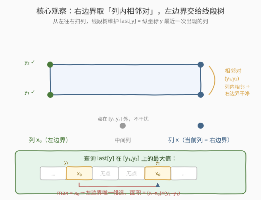
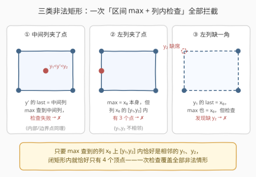
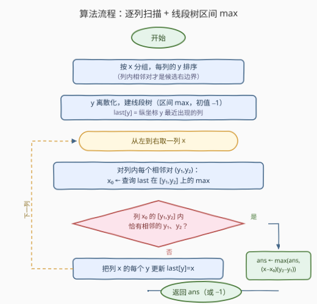
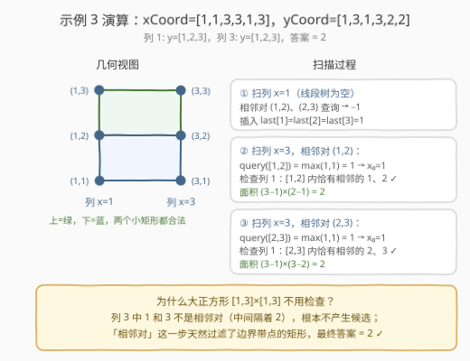

# 用点构造面积最大的矩形 II

- **题目名称**：用点构造面积最大的矩形 II
- **链接**：[3382. 用点构造面积最大的矩形 II](https://leetcode.cn/problems/maximum-area-rectangle-with-point-constraints-ii/)
- **难度**：困难
- **标签**：线段树、树状数组、几何、排序、离散化
- **关联**：3380 用点构造面积最大的矩形 I——本题的小数据暴力版（$n \le 10$）；939 最小面积矩形——同款「对角点对 + 哈希查两角」但无「空洞」约束

## 1. 题目概述

在无限平面上有 $n$ 个点。给定两个整数数组 `xCoord` 和 `yCoord`，其中 $(\text{xCoord}[i], \text{yCoord}[i])$ 表示第 $i$ 个点的坐标。

你的任务是找出满足以下条件的矩形可能的**最大**面积：

- 矩形的四个顶点必须是数组中的**四个**点；
- 矩形的内部或边界上**不能**包含任何**其他**点（即除四个顶点之外的点）；
- 矩形的边与坐标轴**平行**。

返回可以获得的**最大**面积，如果无法形成这样的矩形，则返回 `-1`。

**示例 1**：

```text
输入：xCoord = [1,1,3,3], yCoord = [1,3,1,3]
输出：4
解释：这 4 个点恰好构成一个矩形，内部与边界上都没有其他点，面积为 4。
```

**示例 2**：

```text
输入：xCoord = [1,1,3,3,2], yCoord = [1,3,1,3,2]
输出：-1
解释：唯一能构成的矩形是 [1,3]×[1,3]，但点 (2,2) 落在其内部，作废。
```

**示例 3**：

```text
输入：xCoord = [1,1,3,3,1,3], yCoord = [1,3,1,3,2,2]
输出：2
解释：上矩形 [1,3]×[2,3] 与下矩形 [1,3]×[1,2] 均合法，面积同为 2；
      大正方形因左右两条边上各有一个点 (1,2)、(3,2) 而作废。
```

**约束条件**：

- $1 \le \text{xCoord.length} = \text{yCoord.length} \le 2 \times 10^5$
- $0 \le \text{xCoord}[i], \text{yCoord}[i] \le 8 \times 10^7$
- 给定的所有点都是**唯一**的。

> 💡 **读题关键**：①「其他点」指除四个顶点之外的点——**落在边界上也算作废**，不只是内部；② 与 3380 题意完全相同，只是规模从 $n \le 10$ 暴涨到 $n \le 2 \times 10^5$——$O(n^2)$ 都嫌大，必须 $O(n \log n)$；③ 标签里的线段树/树状数组不是吓唬人，这次真的要用。

---

## 2. 解题思路

### 2.1 暴力思路：沿用 3380 的对角点对为何失效

3380 的做法是枚举 $O(n^2)$ 个对角点对 + 哈希查两角 + $O(n)$ 查空洞。放到本题：$O(n^2) = 4 \times 10^{10}$ 个点对，哪怕每个点对只花 $O(1)$ 也远超时限；更糟的是「查空洞」还得 $O(n)$，总计 $O(n^3)$，彻底没戏。

突破口来自题目的一个结构性约束：**矩形的边界上不能有点**。把点按横坐标分成一列一列（同一 $x$ 上的所有 $y$ 构成一「列」），就能得到两个强力观察：

> **观察 1（右边界相邻对）**：合法矩形的右边界所在列 $x$ 上，顶点 $y_1$、$y_2$ 必须是**列内相邻**的两个点——若中间还夹着第三个点，它就踩在右边界上，矩形作废。
>
> **观察 2（候选数量骤减）**：每列至多产生「列内点数 $-1$」个相邻对，全体列加起来候选总数 $< n$。$O(n^2)$ 个对角点对，就这样被压到了 $O(n)$ 个「右边界候选」。

于是问题变成：**对每个右边界候选（列 $x$ 上的相邻对 $y_1 < y_2$），左边界在哪？**

### 2.2 核心观察：线段树存 last[y]，区间 max 一步定位左边界



维护量非常轻：**从左往右逐列扫描，线段树里存 $last[y]$ = 纵坐标 $y$ 最近一次出现的列**（$y$ 先离散化）。处理到列 $x$ 时：

1. **先查询**：对每个相邻对 $(y_1, y_2)$，取线段树上区间 $[y_1, y_2]$ 的**最大值**：

$$
x_0 = \max \{\, last[y] : y_1 \le y \le y_2 \,\}
$$

   它就是「$x$ 左边、最后一个含有 $y \in [y_1, y_2]$ 点的列」——左边界的**唯一候选**；

2. **再做一次检查**：在列 $x_0$ 的有序 $y$ 列表里二分，确认 $[y_1, y_2]$ 闭区间内**恰好是相邻的 $y_1$、$y_2$** 两个点。通过则面积 $(x - x_0)(y_2 - y_1)$ 入账；

3. **后插入**：把列 $x$ 的每个 $y$ 以值 $x$ 更新进线段树，继续下一列。



**为什么这一个查询 + 一次检查就够？** 分两头证明：

**算法报的矩形一定合法（不假）**：若候选 $(x_0, y_1, x, y_2)$ 通过了检查——

- 列 $x$ 上 $[y_1, y_2]$ 内只有相邻的 $y_1, y_2$（相邻对），**右边界干净**；
- 列 $x_0$ 上 $[y_1, y_2]$ 内恰有相邻的 $y_1, y_2$（检查项），**左边界干净**；
- 反设中间某列 $x_m \in (x_0, x)$ 上有 $y' \in [y_1, y_2]$ 的点——该列在 $x$ 之前已被扫描，$last[y'] \ge x_m > x_0$，与「区间 max 恰为 $x_0$」矛盾。所以**中间任何列都没有 $y \in [y_1,y_2]$ 的点**，上下两条边与内部同时清空。

闭矩形 $[x_0, x] \times [y_1, y_2]$ 内恰好只有四个顶点。∎

**合法矩形一定会被报出来（不漏）**：设 $R = [X_1, X_2] \times [Y_1, Y_2]$ 合法。$(Y_1, Y_2)$ 必是列 $X_2$ 内的相邻对（观察 1，对称地左边界也要求 $(Y_1, Y_2)$ 在列 $X_1$ 内相邻）。扫描到列 $X_2$ 时枚举到该相邻对：$Y_1$ 若在 $(X_1, X_2)$ 内再现，就踩在 $R$ 的下边上，矛盾——故 $last[Y_1] = X_1$；同理 $last[Y_2] = X_1$；$(Y_1, Y_2)$ 中间的其他 $y$ 在已扫过的列里若有出现，其列 $< X_1$（否则点落入 $R$）。故区间 max $= X_1$，检查列 $X_1$ 必然通过，$R$ 被计入。∎

> 💡 **一句话**：「相邻对」筛掉**边界带点**的右边界，「区间 max」跳到**最后一个有干扰的列**，「列内检查」同时验证左边界四角齐全与干净。三类非法情形一网打尽，无须任何额外的二维数点。

### 2.3 算法流程图



流程要点：

1. **预处理**：按 $x$ 分组，列内 $y$ 排序（`map` 天然按 $x$ 有序）；全部 $y$ 离散化；
2. **建树**：区间 max 线段树，初值 $-1$（表示该 $y$ 尚未出现过）；
3. **逐列**：先对列内每个相邻对「查询 → 检查 → 更新答案」，**再**把整列插入线段树——顺序不能反，否则会把当前列自己查出来；
4. **检查**用一次二分：`lower_bound` 定位 $y_1$，看它与后一个元素是否恰为 $y_1, y_2$；
5. **收尾**：`ans` 初值 $-1$，天然覆盖无解情形。

### 2.4 示例演算



以示例 3（`xCoord = [1,1,3,3,1,3]`，`yCoord = [1,3,1,3,2,2]`）为例，列 $1$ 和列 $3$ 内均有 $y = [1,2,3]$：

| 步骤 | 动作 | 结果 |
|------|------|------|
| 扫列 $x=1$ | 线段树为空，相邻对 $(1,2)$、$(2,3)$ 查询均得 $-1$；插入 $last[1]=last[2]=last[3]=1$ | 无候选 |
| 扫列 $x=3$，对 $(1,2)$ | $\max(last[1], last[2]) = 1 \Rightarrow x_0=1$；列 $1$ 的 $[1,2]$ 内恰有相邻的 $1,2$ ✓ | 面积 $(3-1)\times(2-1)=2$ |
| 扫列 $x=3$，对 $(2,3)$ | $\max(last[2], last[3]) = 1 \Rightarrow x_0=1$；列 $1$ 的 $[2,3]$ 内恰有相邻的 $2,3$ ✓ | 面积 $(3-1)\times(3-2)=2$ |

大正方形 $[1,3] \times [1,3]$ 根本不会成为候选——$1$ 和 $3$ 在列内不相邻（隔着 $2$）。最终答案 $2$ ✓。

## 3. 参考代码

### C++

```cpp
class Solution {
public:
    long long maxRectangleArea(vector<int>& xCoord, vector<int>& yCoord) {
        int n = xCoord.size();
        map<int, vector<int>> cols;                    // x -> 该列所有 y（有序）
        for (int i = 0; i < n; ++i) cols[xCoord[i]].push_back(yCoord[i]);
        for (auto& [x, ys] : cols) sort(ys.begin(), ys.end());

        vector<int> ys(yCoord);                        // y 离散化
        sort(ys.begin(), ys.end());
        ys.erase(unique(ys.begin(), ys.end()), ys.end());
        int m = ys.size();

        int sz = 1;                                    // 迭代式线段树：区间 max
        while (sz < m) sz <<= 1;
        vector<int> tree(2 * sz, -1);                  // last[y]，-1 表示未出现
        auto update = [&](int i, int val) {            // 单点 chmax
            i += sz;
            tree[i] = max(tree[i], val);
            for (i >>= 1; i >= 1; i >>= 1) tree[i] = max(tree[2 * i], tree[2 * i + 1]);
        };
        auto query = [&](int l, int r) {               // [l, r] 上的 max
            int res = -1;
            for (l += sz, r += sz + 1; l < r; l >>= 1, r >>= 1) {
                if (l & 1) res = max(res, tree[l++]);
                if (r & 1) res = max(res, tree[--r]);
            }
            return res;
        };

        long long ans = -1;
        for (auto& [x, list] : cols) {                 // 从左到右逐列
            for (int i = 0; i + 1 < (int)list.size(); ++i) {
                int y1 = list[i], y2 = list[i + 1];    // 列内相邻对 = 右边界候选
                int l = lower_bound(ys.begin(), ys.end(), y1) - ys.begin();
                int r = lower_bound(ys.begin(), ys.end(), y2) - ys.begin();
                int x0 = query(l, r);                  // 左边界唯一候选
                if (x0 < 0) continue;
                auto& v = cols.find(x0)->second;       // 列 x0 的 [y1,y2] 内
                auto it = lower_bound(v.begin(), v.end(), y1);
                if (it != v.end() && *it == y1 &&      // 恰有相邻的 y1、y2
                    next(it) != v.end() && *next(it) == y2)
                    ans = max(ans, (long long)(x - x0) * (y2 - y1));
            }
            for (int y : list)                         // 查询完再插入当前列
                update(lower_bound(ys.begin(), ys.end(), y) - ys.begin(), x);
        }
        return ans;
    }
};
```

### Python

```python
class Solution:
    def maxRectangleArea(self, xCoord: List[int], yCoord: List[int]) -> int:
        cols = defaultdict(list)                      # x -> 该列所有 y
        for x, y in zip(xCoord, yCoord):
            cols[x].append(y)
        for x in cols:
            cols[x].sort()

        ys = sorted(set(yCoord))                      # y 离散化
        idx = {y: i for i, y in enumerate(ys)}
        m = len(ys)

        sz = 1                                         # 迭代式线段树：区间 max
        while sz < m:
            sz <<= 1
        tree = [-1] * (2 * sz)                         # last[y]，-1 表示未出现

        def update(i: int, val: int) -> None:          # 单点 chmax
            i += sz
            if tree[i] >= val:
                return
            tree[i] = val
            i >>= 1
            while i:
                tree[i] = max(tree[2 * i], tree[2 * i + 1])
                i >>= 1

        def query(l: int, r: int) -> int:              # [l, r] 上的 max
            res = -1
            l += sz
            r += sz + 1
            while l < r:
                if l & 1:
                    if tree[l] > res:
                        res = tree[l]
                    l += 1
                if r & 1:
                    r -= 1
                    if tree[r] > res:
                        res = tree[r]
                l >>= 1
                r >>= 1
            return res

        ans = -1
        for x in sorted(cols):                         # 从左到右逐列
            lst = cols[x]
            for i in range(len(lst) - 1):              # 列内相邻对 = 右边界候选
                y1, y2 = lst[i], lst[i + 1]
                x0 = query(idx[y1], idx[y2])           # 左边界唯一候选
                if x0 < 0:
                    continue
                v = cols[x0]                           # 列 x0 的 [y1,y2] 内
                p = bisect_left(v, y1)                 # 恰有相邻的 y1、y2
                if p + 1 < len(v) and v[p] == y1 and v[p + 1] == y2:
                    ans = max(ans, (x - x0) * (y2 - y1))
            for y in lst:                              # 查询完再插入当前列
                update(idx[y], x)
        return ans
```

> 💡 **两个易错点**：① **先查询后插入**——若先把当前列插进树里，$last[y_1] = last[y_2] = x$，会把矩形压成零宽度；② 检查列 $x_0$ 时用 `lower_bound` 找到的是「第一个 $\ge y_1$」的位置，必须同时验证它是 $y_1$ **且**紧随其后是 $y_2$，缺一不可（分别对应缺角与夹点两种非法）。另外面积最大可达 $(8 \times 10^7)^2 = 6.4 \times 10^{15}$，C++ 必须乘法前转 `long long`。

## 4. 复杂度分析

| 维度 | 复杂度 | 说明 |
|------|--------|------|
| 时间 | $O(n \log n)$ | 每个点被「插入线段树」一次、每列相邻对被「查询 + 二分检查」一次，各自 $O(\log n)$；分组排序合计 $O(n \log n)$ |
| 空间 | $O(n)$ | 列分组、离散化数组、线段树 $2 \lceil \log_2 n \rceil$ 规模 |

实测：$n = 2 \times 10^5$ 的随机数据与 $450 \times 450$ 网格点（20 万点、20 余万个合法矩形单元）均在几十毫秒（C++）/ 1 秒内（Python）完成。

## 5. 扩展：换一个视角的 O(n log n)——左下角定形 + 二维数点

3380 题解的扩展节曾给出另一条路，这里对照着说完：

1. **左下角定形**：合法矩形的左下角 $(x_1, y_1)$ 一旦固定，底边与左边都不能有点 ⇒ $x_2$ 必须是行 $y_1$ 中 $x_1$ 的**右邻**、$y_2$ 必须是列 $x_1$ 中 $y_1$ 的**上邻**，再用哈希验证第四角 $(x_2, y_2)$ 存在——候选同样只有 $O(n)$ 个；
2. **二维数点**：最后确认闭矩形 $[x_1, x_2] \times [y_1, y_2]$ 内**恰好 4 个点**。把所有点与查询按 $x$ 离线排序、用**树状数组**（本题标签 Binary Indexed Tree 的来历）维护纵坐标前缀计数，每次查询 $O(\log n)$。

两条路线殊途同归，都是「用相邻性把候选压到 $O(n)$ + 用 $O(\log n)$ 的结构完成空区判定」。本文采用的「右边界相邻对 + 区间 max」版只需一棵线段树、一次二分检查，不涉及前缀计数与离线排序，代码量更小；二维数点版则把「数一数闭矩形里有几个点」表达得更直白，面试时两者讲清任一即可，能对照说出另一条更佳。

## 6. 面试要点

- **Q：为什么候选只需要「列内相邻对」，不怕漏掉最优矩形吗？**
  **答**：不会漏。合法矩形右边界所在列上，$[y_1, y_2]$ 闭区间内只能有 $y_1$、$y_2$ 两个点（否则边界带点作废），这正是「相邻对」的定义。反过来，非相邻对产生的矩形必然非法，被这步天然过滤——示例 3 的大正方形就是这么被跳过的。

- **Q：区间 max 查询 $last[y]$ 的 $[y_1, y_2]$，得到的 $x_0$ 凭什么就是左边界？**
  **答**：$x_0$ 是「当前列左侧、最后一个含有 $y \in [y_1,y_2]$ 点的列」。若合法矩形的左边界是 $X_1$，则 $last[y_1] = last[y_2] = X_1$（更晚出现即踩边界）、中间 $y$ 的出现列只会更早，故 max 恰为 $X_1$。而任何更晚的干扰点都会把 max 抬高，导致检查失败——三类非法（中间夹点、左列夹点、左列缺角）由「查询 + 检查」一次性拦截。

- **Q：为什么查询必须在插入当前列之前？**
  **答**：插入后 $last[y_1] = last[y_2] = x$（当前列），区间 max 变成 $x$ 自己，左边界候选与右边界重合，矩形宽度归零，所有候选全部作废。「先查后插」是本题最典型的顺序 bug。

- **Q：为什么用线段树而不是树状数组？**
  **答**：本题需要**任意区间 $[y_1, y_2]$ 的 max**。树状数组维护前缀 max 尚可，但区间 max 不能相减（max 不满足逆运算），standard BIT 无能为力；线段树天然支持。若改走 5 节的二维数点路线（前缀计数），计数可减，树状数组才重新适用——选结构先看运算是否可减/可逆。

- **Q：坐标到 $8 \times 10^7$、面积到 $6.4 \times 10^{15}$，有什么坑？**
  **答**：离散化避免开值域数组（$8 \times 10^7$ 个槽位不可接受）；面积计算 $(x - x_0)(y_2 - y_1)$ 在 C++ 里两个 `int` 相乘会溢出 `int`（$\approx 2.1 \times 10^9$ 上限），必须先转 `long long`；Python 原生大整数无此顾虑。

## 7. 同类练习题

- [3380. 用点构造面积最大的矩形 I](https://leetcode.cn/problems/maximum-area-rectangle-with-point-constraints-i/)：本题小数据版，对角点对 + 哈希 + 闭矩形查空洞的暴力模板
- [939. 最小面积矩形](https://leetcode.cn/problems/minimum-area-rectangle/)：同款「枚举对角点对 + 哈希查两角」，目标换成最小面积且无空洞约束
- [3027. 人员站位的方案数 II](https://leetcode.cn/problems/find-the-number-of-ways-to-place-people-ii/)：排序扫描 + 「两点之间无遮挡」判定，与本题「相邻对之间无点」同一思想
- [850. 矩形面积 II](https://leetcode.cn/problems/rectangle-area-ii/)：扫描线 + 线段树处理矩形集合的经典应用，练区间结构的另一面
- [391. 完美矩形](https://leetcode.cn/problems/perfect-rectangle/)：矩形拼接判定的几何哈希题，与本题互为「矩形世界」的两端
