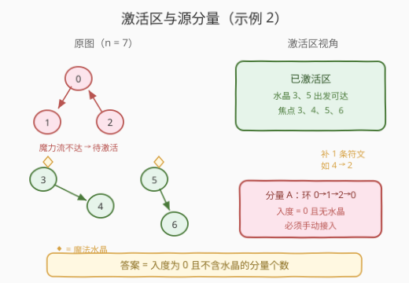
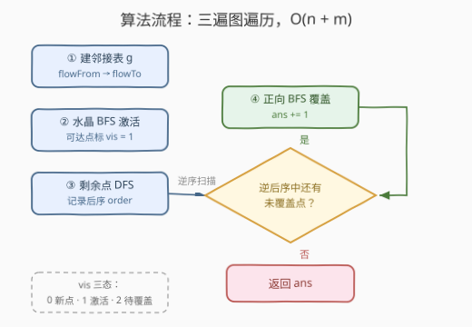

# 施法所需最低符文数量

- **题目名称**：施法所需最低符文数量
- **链接**：[3383. 施法所需最低符文数量](https://leetcode.cn/problems/minimum-runes-to-add-to-cast-spell/)
- **难度**：困难
- **标签**：深度优先搜索、广度优先搜索、图、拓扑排序、数组
- **关联**：1319 连通网络的操作次数——无向版「加边连通」；2115 从给定原材料中找到所有可制作的菜肴——「初始激活集 + 依赖传播」

## 1. 题目概述

> ⚠️ 本题为 LeetCode 付费题，题意描述根据官方示例用例与 hints 重建，可能与官方题面有出入。

Alice 刚从巫师学校毕业，想施一个魔法咒语庆祝。咒语包含 $n$ 个需要集中魔力的**焦点**，其中一些焦点上放有作为能量源的**魔法水晶**。焦点之间用**有向符文**连接，符文把魔力流从一个焦点传输到另一个焦点。

给定：

- 整数 `n`：焦点数量，编号 $0 \sim n-1$；
- 整数数组 `crystals`：`crystals[i]` 表示该焦点上有魔法水晶；
- 整数数组 `flowFrom` 与 `flowTo`：第 $i$ 条有向符文使魔力流从 `flowFrom[i]` 传到 `flowTo[i]`。

你需要添加**最少**的有向符文，使得**每个焦点**要么：

- 自己**包含**一个魔法水晶；要么
- 能从其它焦点**接收**到魔力流（即魔力流沿符文真正流到它）。

**示例 1**：

```text
输入：n = 6, crystals = [0], flowFrom = [0,1,2,3], flowTo = [1,2,3,0]
输出：2
解释：添加两条符文 0→4 和 0→5。
焦点 0,1,2,3 构成环互相可达；4、5 孤立，各需一条入边。
```

**示例 2**：

```text
输入：n = 7, crystals = [3,5], flowFrom = [0,1,2,3,5], flowTo = [1,2,0,4,6]
输出：1
解释：添加符文 4→2。水晶在 3、5，魔力可流到 4、6；
环 {0,1,2} 无水晶也无入边，接入一条即全部激活。
```

**约束条件**：

- $2 \le n \le 10^5$
- $1 \le crystals.length \le n$，`crystals` 内元素互不相同
- $1 \le flowFrom.length = flowTo.length \le \min(2\times10^5,\ n(n-1)/2)$
- `flowFrom[i] != flowTo[i]`，且所有符文互不相同

> 💡 **读题关键**：「接收魔力流」是**传递**的——魔力流会沿着符文一跳一跳继续传下去。所以一个焦点「被激活」当且仅当从某个含水晶的焦点出发、沿有向边**可达**它。这本质上是一个「初始激活集 + 有向边传播」的图问题。

---

## 2. 解题思路

### 2.1 暴力思路：为什么不能直接数点

最朴素的两个念头都不可靠：

- **数「从水晶不可达的点」**：示例 1 中不可达点是 4、5，答案恰好 2；但若不可达点连成链 $a \to b$，一条边接上 $a$ 就能把 $b$ 也激活，按点数会**多算**；
- **数「入度为 0 的点」**：考虑不可达子图中的链 $0 \to 1$、$2 \to 3$ 以及跨链边 $1 \to 2$（全图其它点已激活）——入度为 0 的点有 $0$ 和 $2$ 共两个，但只需一条边接入 $0$，魔力便沿 $0 \to 1 \to 2 \to 3$ 传遍，答案应是 1。**按点统计入度会把「分量内部」的入边也当成外部依赖**。

至于枚举所有加边方案取最小，更是指数级。症结在于：**激活沿有向边传递，必须把互相可达的点捆绑成一个整体（强连通分量）来看待**。

### 2.2 核心观察：缩点后数「无水晶的源分量」



**观察一：激活 = 从水晶可达。**

焦点 $x$ 最终被激活 $\iff$ 存在水晶 $c$ 使得 $c \rightsquigarrow x$（含 $x = c$）。所有从水晶出发沿符文可达的点构成「已激活区」，天然免费。

**观察二：加边只能「接入」，每条新边最多接入一个源分量。**

新边 $(u \to v)$ 只有当 $u$ 处于已激活区（或本轮新激活区）时才有意义——它把魔力引入 $v$ 所在的整个可达域。缩点成 SCC 的 DAG 后：

- **入度 $> 0$ 的分量**：只要某个前驱被激活，魔力就会顺着传进来，无需自己加边；
- **入度 $= 0$ 且不含水晶的分量**：缩点后没有任何魔力能流进来，**必须**消耗至少一条新边接入；
- 每条新边的收益上限就是「接入一个入度 0 的分量」（再把它可达的下游一并白送激活）。

于是上下界相抵：

$$
ans = \#\{\,\text{SCC 分量} \mid \text{入度} = 0 \ \text{且不含水晶}\,\}
$$

**构造性验证**：设这些源分量为 $C_1, \dots, C_k$，由于 $crystals \ge 1$，已激活区永远非空，逐个从已激活区连一条边进 $C_i$ 即可——$k$ 条边恰好；另一方面每个 $C_i$ 无任何入边来源，$k$ 条是下界。

### 2.3 算法流程图：不写 Tarjan，三遍遍历搞定



用三遍图遍历代替显式缩点：

1. **水晶 BFS**：从所有 `crystals` 出发正向 BFS，把可达点标 `vis = 1`（已激活）；
2. **剩余点 DFS 后序**：对未激活点做 DFS，记录**后序**（节点完成时间）序列 `order`；
3. **逆后序贪心覆盖**：逆序扫描 `order`，遇到仍未覆盖的点就从它正向 BFS 把可达域全部覆盖，`ans += 1`。

**为什么第 3 步恰好数出源分量？** 两个关键性质：

- **引理（后序与拓扑序相容）**：剩余子图缩点后是 DAG，而 DAG 中任何边 $u \to v$ 都满足 $\mathrm{finish}(u) > \mathrm{finish}(v)$——DFS 在无环图上不会遇到后向边，$v$ 要么是 $u$ 的后代（先完成），要么在 $u$ 开始前就已完成；
- **贪心正确性**：逆后序扫描到未覆盖点 $u$ 时，$u$ 是剩余未覆盖点中完成时间最大者，它必是所在分量的 DFS 根。若其分量有入边 $x \to c$，由引理 $\mathrm{finish}(x) > \mathrm{finish}(c) \ge \mathrm{finish}(u)$，故 $x$ 早已被扫描过——扫描过意味着 $x$ 已被覆盖（直接跳过或作为某轮 BFS 起点），而覆盖是**沿正向边传播**的，$x$ 可达的 $c$ 也必然已被覆盖，与 $u$ 未覆盖矛盾。故 $u$ 所在分量入度必为 0，正是要数的源分量。

> 💡 直观理解：逆后序近似分量级拓扑序。扫描到一个「还没被前面任何 BFS 波及」的分量时，它不可能有还没处理的前驱——否则前驱的魔力早就顺着边流过来了。

### 2.4 示例演算

以示例 2 走一遍（$n=7$，`crystals = [3,5]`，边 $0\to1,\ 1\to2,\ 2\to0,\ 3\to4,\ 5\to6$）：

| 步骤 | 状态 | 说明 |
|------|------|------|
| ① 水晶 BFS | `vis = {3,4,5,6}` 激活 | 3→4、5→6 两条链被点亮 |
| ② 剩余 DFS | 从 0 出发：$0 \to 1 \to 2$，后序 `order = [2, 1, 0]` | 环 {0,1,2} 整体属于剩余子图 |
| ③ 逆序扫描 | 先看 0：未覆盖 → BFS 覆盖 {0,1,2}，`ans = 1` | 之后 1、2 已覆盖，跳过 |

答案 $1$ ✓，对应加边 $4 \to 2$（或已激活区到环的任意一条边）。

再验证示例 1（$n=6$，`crystals = [0]`，环 $0\to1\to2\to3\to0$）：BFS 激活 $\{0,1,2,3\}$；剩余 $\{4,5\}$ 两个孤立分量，后序 `[4,5]`，逆序扫描各触发一次 BFS，`ans = 2` ✓。

---

## 3. 参考代码

### C++

```cpp
class Solution {
  public:
    int minRunesToAdd(int n, vector<int>& crystals, vector<int>& flowFrom, vector<int>& flowTo) {
        vector<vector<int>> g(n);
        for (int i = 0; i < (int)flowFrom.size(); ++i)
            g[flowFrom[i]].push_back(flowTo[i]);

        // vis: 0 未访问 / 1 已激活 / 2 剩余子图中待覆盖
        vector<int> vis(n, 0);
        queue<int> q;
        for (int x : crystals) { vis[x] = 1; q.push(x); }

        // ① 水晶 BFS：正向可达点全部激活
        while (!q.empty()) {
            int u = q.front(); q.pop();
            for (int v : g[u])
                if (vis[v] != 1) { vis[v] = 1; q.push(v); }
        }

        // ② 剩余点迭代 DFS（防爆栈），记录后序 order
        vector<int> order;
        vector<pair<int, int>> st;              // (节点, 下一条边下标)
        for (int s = 0; s < n; ++s) {
            if (vis[s] != 0) continue;
            vis[s] = 2;
            st.push_back({s, 0});
            while (!st.empty()) {
                auto [u, i] = st.back();
                if (i < (int)g[u].size()) {
                    st.back().second++;
                    int v = g[u][i];
                    if (vis[v] == 0) { vis[v] = 2; st.push_back({v, 0}); }
                } else {
                    order.push_back(u);
                    st.pop_back();
                }
            }
        }

        // ③ 逆后序贪心：遇到未覆盖点，正向 BFS 覆盖可达域，计数
        int ans = 0;
        for (int i = (int)order.size() - 1; i >= 0; --i) {
            int u = order[i];
            if (vis[u] != 2) continue;
            vis[u] = 1;
            q.push(u);
            ++ans;
            while (!q.empty()) {
                int x = q.front(); q.pop();
                for (int y : g[x])
                    if (vis[y] != 1) { vis[y] = 1; q.push(y); }
            }
        }
        return ans;
    }
};
```

### Python

```python
class Solution:
    def minRunesToAdd(self, n: int, crystals: List[int],
                      flowFrom: List[int], flowTo: List[int]) -> int:
        g = [[] for _ in range(n)]
        for a, b in zip(flowFrom, flowTo):
            g[a].append(b)

        # vis: 0 未访问 / 1 已激活 / 2 剩余子图中待覆盖
        vis = [0] * n
        q = deque()
        for x in crystals:
            vis[x] = 1
            q.append(x)

        # ① 水晶 BFS：正向可达点全部激活
        while q:
            u = q.popleft()
            for v in g[u]:
                if vis[v] != 1:
                    vis[v] = 1
                    q.append(v)

        # ② 剩余点迭代 DFS（防爆栈），记录后序 order
        order = []
        for s in range(n):
            if vis[s] != 0:
                continue
            vis[s] = 2
            st = [[s, 0]]
            while st:
                u, i = st[-1]
                if i < len(g[u]):
                    st[-1][1] += 1
                    v = g[u][i]
                    if vis[v] == 0:
                        vis[v] = 2
                        st.append([v, 0])
                else:
                    order.append(u)
                    st.pop()

        # ③ 逆后序贪心：遇到未覆盖点，正向 BFS 覆盖可达域，计数
        ans = 0
        for u in reversed(order):
            if vis[u] != 2:
                continue
            vis[u] = 1
            q = deque([u])
            ans += 1
            while q:
                x = q.popleft()
                for y in g[x]:
                    if vis[y] != 1:
                        vis[y] = 1
                        q.append(y)
        return ans
```

> 💡 三遍遍历一气呵成，`vis` 三态复用是精髓：`1` 表示「有魔力」，`2` 表示「剩余子图中尚未被任何一轮 BFS 波及」。DFS 必须写成**迭代**——$n$ 可达 $10^5$，一条长链就能让递归版爆栈（Python 尤其致命）。

---

## 4. 复杂度分析

| 维度 | 复杂度 | 说明 |
|------|--------|------|
| 时间复杂度 | $O(n + m)$ | 三遍遍历：水晶 BFS、剩余点 DFS、逆后序多轮 BFS，每条边每遍至多走一次 |
| 空间复杂度 | $O(n + m)$ | 邻接表 $O(m)$、`vis` 与后序数组 $O(n)$、队列/栈 $O(n)$ |
| 与暴力对比 | 暴力指数级 / 错误贪心 $O(n+m)$ | 枚举加边组合不可行；「按点数入度」虽是线性但答案错误，必须升到分量级 |

---

## 5. 扩展：显式 Tarjan 缩点与「强连通」变体

**写法一：Tarjan / Kosaraju 显式缩点。** 先求出所有 SCC，再统计每个分量的入度（对每条跨分量边 `scc[u] != scc[v]` 给 `scc[v]` 的入度 +1），最后数「入度为 0 且不含水晶」的分量。逻辑直白，但代码量比三遍遍历大一圈，且 Tarjan 的低链接维护容易写错。

**写法二（本题采用的巧妙版）**：把「数源分量」藏进 BFS 激活 + DFS 逆后序贪心里，不显式建缩点图——本质是利用了「逆后序中最早出现的未覆盖分量必为源分量」这一性质，省去了分量编号与入度统计。

**变体对比：加边使有向图强连通。** 经典问题是「最少加多少条边使整个有向图强连通」，答案为 $\max(\text{入度 0 分量数},\ \text{出度 0 分量数})$（单独成 SCC 时为 0）。本题只要求「每个点**收到**魔力」，是**单向可达**而非互相可达，所以只需管入度、不用管出度——条件更弱，答案也只会更小。面试中遇到「加边连通」类问题，先问清楚是**无向连通**（1319 型）、**单源可达**（本题）还是**强连通**（$\max$ 公式型），三者公式完全不同。

---

## 6. 面试要点

1. **为什么不能直接数「从水晶不可达的点」？**

   > 激活沿有向边传递：不可达点连成链 $a \to b$ 时，一条边接入 $a$ 便连带激活 $b$。按点计数会把「一条边激活一片」的收益算成多条，导致多算。

2. **为什么必须按强连通分量而不是按点统计入度？**

   > 分量内部的有向边不会带来新的「外部魔力」，但会干扰点级入度。反例：不可达链 $0\to1$、$2\to3$ 加跨链边 $1\to2$——入度 0 的点有两个（0 和 2），但源分量只有一个（整条 $0\to1\to2\to3$ 可达链的头）。SCC 内部互相可达，魔力一旦进入就会流遍全分量，必须整体对待。

3. **逆后序贪心为什么能代替显式缩点？**

   > 两条：① DAG 中任何边 $u\to v$ 蕴含 $\mathrm{finish}(u) > \mathrm{finish}(v)$，逆后序是分量级的近似拓扑序；② 覆盖沿正向边传播，扫描到仍未覆盖的点时，其所有前驱必然已被覆盖或已被计数——否则魔力早就流过来了。因此每个「逆后序中最早未覆盖」的点都恰好落在一个入度 0 的源分量上。

4. **递归 DFS 在本题会有什么坑？**

   > $n \le 10^5$，一条长链（如 $0\to1\to\cdots\to99999$）就产生 $10^5$ 层递归：C++ 可能栈溢出，Python 必然 `RecursionError`。要用显式栈的迭代 DFS（栈存「节点 + 下一条待访问边的下标」）来记录后序。

5. **答案的上界是多少？什么时候达到？**

   > 上界 $n - 1$：全图无水晶符文且只有一个水晶（自身即激活区）时，其余 $n-1$ 个点都是孤立的入度 0 分量，每个都需要一条入边。只要不可达区域成环或成链，答案就严格小于不可达点数。

> 💡 **一句话总结**：把「接收魔力流」翻译成「从水晶可达」，缩点后答案就是**入度为 0 且不含水晶的分量个数**；实现上无需 Tarjan——水晶 BFS 激活 + 剩余点 DFS 后序 + 逆后序贪心覆盖，三遍线性遍历收工。

---

## 7. 同类练习题

- [1319. 连通网络的操作次数](https://leetcode.cn/problems/number-of-operations-to-make-network-connected/)：无向版对偶——用冗余边把所有连通块连起来，答案是「块数 - 1」但受冗余边数约束
- [2115. 从给定原材料中找到所有可制作的菜肴](https://leetcode.cn/problems/find-all-possible-recipes-from-given-supplies/)：「初始激活集（原材料）+ 依赖边传播」的拓扑排序，和水晶 BFS 激活同构
- [802. 找到最终的安全状态](https://leetcode.cn/problems/find-eventual-safe-states/)：反向拓扑排序（出度递减法），体会「沿边传播」与遍历方向的选择
- [3108. 带权图里旅途的最小代价](https://leetcode.cn/problems/minimum-cost-walk-in-weighted-graph/)：SCC/连通分量把「互相可达」捆绑成整体的另一应用
- [207. 课程表](https://leetcode.cn/problems/course-schedule/)：拓扑排序入门，理解 DAG 与后序/逆后序的基础
