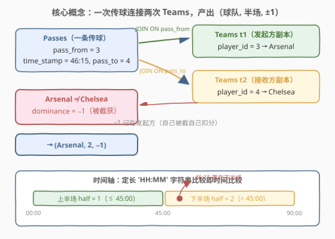
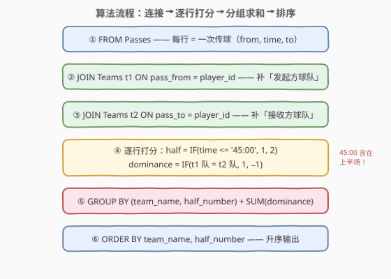

# 球队传球成功的优势得分

- **题目名称**：球队传球成功的优势得分
- **链接**：[3384. 球队传球成功的优势得分 🔒](https://leetcode.cn/problems/team-dominance-by-pass-success/)
- **难度**：困难
- **标签**：数据库、SQL、JOIN、等值连接、条件聚合、`GROUP BY`、字符串字典序比较、LeetCode 锁题
- **关联**：[3390. 最长团队传球连击](https://leetcode.cn/problems/longest-team-pass-streak/)——同一套「足球传球」表结构的续作（连续成功传球段），[3322. 英超积分榜排名 III](https://leetcode.cn/problems/premier-league-table-ranking-iii/)（[站内题解](3322_英超积分榜排名III.md)）同为绿茵场上的条件聚合

## 1. 题目概述

> ⚠️ 本题为 LeetCode 付费题，题意描述根据官方示例用例与社区资料重建，可能与官方题面有出入。

**表结构**：`Teams`

| 列名 | 类型 |
|------|------|
| player_id | int |
| team_name | varchar |

- `player_id` 是这张表的唯一主键。
- 每一行包含队员的唯一标识以及该场比赛中参赛的某支队伍的名称。

**表结构**：`Passes`

| 列名 | 类型 |
|------|------|
| pass_from | int |
| time_stamp | varchar |
| pass_to | int |

- `(pass_from, time_stamp)` 是这张表的主键。
- `pass_from` 是指向 `Teams` 表 `player_id` 字段的外键。
- 每一行代表比赛期间的一次传球，`time_stamp` 表示传球发生的分钟时间（`00:00`-`90:00`），`pass_to` 表示接球队员的 `player_id`。

**目标**：编写一个解决方案，计算每支球队**在上下两个半场的优势得分**。规则如下：

- 一场比赛分为两个半场：**上半场**（`00:00`-`45:00` 分钟，含 `45:00`）和**下半场**（`45:01`-`90:00` 分钟）。
- 优势得分根据成功与被截获的传球计算，**记在传球发起方（`pass_from`）所在球队的账上**：
  - 当 `pass_to` 是**同球队**的队员：$+1$ 分（成功传球）。
  - 当 `pass_to` 是**对方球队**的队员（被截获）：$-1$ 分。
- 更高的优势得分表明传球表现更好。
- 返回结果表以 `team_name` 和 `half_number` **升序**排序。

**示例 1**：

```text
输入：
Teams 表：
+------------+-----------+
| player_id  | team_name |
+------------+-----------+
| 1          | Arsenal   |
| 2          | Arsenal   |
| 3          | Arsenal   |
| 4          | Chelsea   |
| 5          | Chelsea   |
| 6          | Chelsea   |
+------------+-----------+

Passes 表：
+-----------+------------+---------+
| pass_from | time_stamp | pass_to |
+-----------+------------+---------+
| 1         | 00:15      | 2       |
| 2         | 00:45      | 3       |
| 3         | 01:15      | 1       |
| 4         | 00:30      | 1       |
| 2         | 46:00      | 3       |
| 3         | 46:15      | 4       |
| 1         | 46:45      | 2       |
| 5         | 46:30      | 6       |
+-----------+------------+---------+

输出：
+-----------+-------------+-----------+
| team_name | half_number | dominance |
+-----------+-------------+-----------+
| Arsenal   | 1           | 3         |
| Arsenal   | 2           | 1         |
| Chelsea   | 1           | -1        |
| Chelsea   | 2           | 1         |
+-----------+-------------+-----------+
```

**解释**：

- **上半场（00:00-45:00）**：阿森纳三次队内传球（$1 \to 2$、$2 \to 3$、$3 \to 1$）各 $+1$，合计 $3$；切尔西的 $4 \to 1$ 传给了阿森纳队员，被截获 $-1$。
- **下半场（45:01-90:00）**：阿森纳 $2 \to 3$（$+1$）、$3 \to 4$ 被切尔西截获（$-1$）、$1 \to 2$（$+1$），合计 $1$；切尔西 $5 \to 6$ 队内传球 $+1$。

**约束条件**：

- `time_stamp` 为 `HH:MM` 格式的两位零填充字符串，取值 `00:00`-`90:00`（足球比赛上下半场各 45 分钟）。
- 每条传球的 `pass_to` 均对应 `Teams` 表中的有效队员。
- 输出列为 `team_name`、`half_number`、`dominance`。

> 💡 **审题关键**：① **双向信息补全**——一条传球只存了两个 `player_id`，「属于哪支队」要靠 `Teams` 表分别翻译 `pass_from` 和 `pass_to`，即 `Teams` 要被连接**两次**；② **记分方向**——得分/扣分都记在**发起方**球队头上（自己传的球被截，扣自己的分），千万别按接球方 `t2` 分组；③ **半场边界**——上半场是**含 `45:00` 的闭区间**，判断必须写 `<=`；④ **输出粒度**——「每支球队 × 每个半场」两级分组，`GROUP BY` 两列。

---

## 2. 解题思路

### 2.1 暴力思路：逐行相关子查询翻译球队

最朴素的写法是把「翻译球队」做成**相关子查询**：对 `Passes` 的每一行，分别子查询 `pass_from` 和 `pass_to` 的队名，再 `CASE` 打分：

```text
for row in Passes:
    from_team = SELECT team_name FROM Teams WHERE player_id = row.pass_from
    to_team   = SELECT team_name FROM Teams WHERE player_id = row.pass_to
    half      = row.time_stamp <= '45:00' ? 1 : 2
    score     = from_team == to_team ? +1 : -1
    accumulate[from_team][half] += score
```

逻辑毫无问题，但每行触发两次按 `player_id` 的子查询查找——没有索引配合时是 $O(m \cdot n)$ 的重复扫描（$m$ 为传球数，$n$ 为队员数）；把整张表读进应用层 for 循环更是把声明式 SQL 用成了命令式脚本。问题的本质是：**一次传球的信息分散在三个位置（发起方、接收方、时间），需要一次性补全后逐行打分，再按「球队 × 半场」折叠**——这正是 `JOIN` + 条件聚合的本职。

### 2.2 核心观察：Teams 连接两次 + 逐行打分 + 分组求和



把题意逐条翻译成 SQL 机制：

| 题意要求 | SQL 机制 | 语义 |
|----------|----------|------|
| 「发起方是哪支队」 | `JOIN Teams t1 ON pass_from = t1.player_id` | 同一张维表的**第一个副本**，角色＝传球者 |
| 「接收方是哪支队」 | `JOIN Teams t2 ON pass_to = t2.player_id` | 同一张维表的**第二个副本**，角色＝接球者 |
| 「上半场 / 下半场」 | `IF(time_stamp <= '45:00', 1, 2)` | 定长 `'HH:MM'` 字符串比较即时间比较 |
| 「成功 $+1$ / 截获 $-1$」 | `IF(t1.team_name = t2.team_name, 1, -1)` | 两个副本的队名相等即同队传球 |
| 「每支球队每个半场」 | `GROUP BY team_name, half_number` | 两级分组键 |
| 「优势得分」 | `SUM(dominance)` | 组内逐行打分求和 |
| 「升序排序」 | `ORDER BY team_name, half_number` | 外层输出排序 |

形式化地，设 $\mathrm{team}(x)$ 为队员 $x$ 的球队，$h(t)$ 为时间戳 $t$ 所属半场，则球队 $T$ 在半场 $k$ 的优势得分为

$$
D(T, k) \;=\; \sum_{\substack{p \,\in\, \mathrm{Passes}: \\ \mathrm{team}(p.\text{from}) = T,\; h(p.\text{ts}) = k}} \sigma(p), \qquad \sigma(p) = \begin{cases} +1, & \mathrm{team}(p.\text{from}) = \mathrm{team}(p.\text{to}) \\ -1, & \text{否则} \end{cases}
$$

> ⚠️ **三个高频翻车点**：
>
> - **方向接反**：$-1$ 是记在**传球方**（`t1`）头上的「自己被截自己扣分」。若按 `t2.team_name` 分组，示例里切尔西上半场会凭空多出一行 $+1$（接住了对方的球），四个数全错。
> - **半场边界**：上半场**含 `45:00`**，必须写 `time_stamp <= '45:00'`；写成 `<` 会把恰好在 `45:00` 的传球误划进下半场。区间题第一步先问端点闭合性。
> - **字典序比较的前提**：`time_stamp` 与 `'45:00'` 直接按字符串比较之所以成立，是因为题目保证**定长零填充**的 `'HH:MM'` 格式——此时字典序严格等于时间序。一旦出现 `'9:00'` 这类变长值，`'9' > '4'` 会把它错判到下半场（见 5.1）。

> 💡 **这是「维表重复使用」，不是自连接**：`t1` 和 `t2` 是**同一张 `Teams` 表的两个角色副本**（发起方 / 接收方），两副本地位对称、各连各的外键；而 [3058. 没有共同朋友的朋友](../3001-3100/3058_没有共同朋友的朋友.md) 那类**自连接**是同表不同行之间互相配对。形态相近，语义不同——面试时能主动区分这两者是很强的信号。

### 2.3 算法流程图



**逻辑执行步骤**：

| 步骤 | 子句 | 作用 |
|------|------|------|
| ① | `FROM Passes` | 以传球明细表为驱动，每行 = 一次待打分的传球 |
| ② | `JOIN Teams t1 ON pass_from = t1.player_id` | 补全发起方球队（分组键之一） |
| ③ | `JOIN Teams t2 ON pass_to = t2.player_id` | 补全接收方球队（打分依据） |
| ④ | `IF(time_stamp <= '45:00', 1, 2)` + `IF(t1.team_name = t2.team_name, 1, -1)` | 逐行产出 `half_number` 与 `dominance` 两列 |
| ⑤ | `GROUP BY team_name, half_number` + `SUM(dominance)` | 按「球队 × 半场」折叠求和 |
| ⑥ | `ORDER BY team_name, half_number` | 题目要求的升序输出 |

> 💡 **为什么用 CTE 包一层**：`half_number` 是 `SELECT` 阶段才算出的表达式列，直接在同一个 `SELECT` 里 `GROUP BY half_number` 依赖 MySQL 的别名扩展；先在 CTE `T` 里物化 `(team_name, half_number, dominance)` 三列，外层就是普通的「分组 + 求和 + 排序」，语义干净且跨库可移植。

### 2.4 示例演算

对示例 1 的 8 条传球逐行走完 ①-④ 步：

| pass_from | time_stamp | pass_to | t1 队（发起方） | t2 队（接收方） | half_number | dominance |
|-----------|------------|---------|-----------------|-----------------|-------------|-----------|
| 1 | 00:15 | 2 | Arsenal | Arsenal | 1 | $+1$ |
| 2 | 00:45 | 3 | Arsenal | Arsenal | 1 | $+1$ |
| 3 | 01:15 | 1 | Arsenal | Arsenal | 1 | $+1$ |
| 4 | 00:30 | 1 | Chelsea | Arsenal | 1 | $-1$ |
| 2 | 46:00 | 3 | Arsenal | Arsenal | 2 | $+1$ |
| 3 | 46:15 | 4 | Arsenal | Chelsea | 2 | $-1$ |
| 1 | 46:45 | 2 | Arsenal | Arsenal | 2 | $+1$ |
| 5 | 46:30 | 6 | Chelsea | Chelsea | 2 | $+1$ |

第 ⑤ 步按 `(team_name, half_number)` 分组求和：

| 分组 | 组内 dominance | SUM |
|------|----------------|-----|
| (Arsenal, 1) | $+1, +1, +1$ | **3** |
| (Arsenal, 2) | $+1, -1, +1$ | **1** |
| (Chelsea, 1) | $-1$ | **−1** |
| (Chelsea, 2) | $+1$ | **1** |

第 ⑥ 步按 `team_name`、`half_number` 升序输出——`(Arsenal,1), (Arsenal,2), (Chelsea,1), (Chelsea,2)`，与预期一致。

> 💡 **验尸「方向接反」版**：若误按 `t2.team_name`（接球方）分组，`4 → 1 @ 00:30`（切尔西传给阿森纳）会记成 Arsenal 上半场 $+1$ 而非 Chelsea 的 $-1$——Arsenal 半场 1 变 $4$，Chelsea 半场 1 凭空消失成空组。仅一条传球的方向之差，四行输出错三行。

---

## 3. 参考代码

### MySQL（解法 A：双等值连接 + 条件聚合，推荐）

```sql
# Write your MySQL query statement below
WITH T AS (
    SELECT
        t1.team_name,
        IF(p.time_stamp <= '45:00', 1, 2) AS half_number,
        IF(t1.team_name = t2.team_name, 1, -1) AS dominance
    FROM Passes p
    JOIN Teams t1 ON p.pass_from = t1.player_id
    JOIN Teams t2 ON p.pass_to = t2.player_id
)
SELECT team_name, half_number, SUM(dominance) AS dominance
FROM T
GROUP BY team_name, half_number
ORDER BY team_name, half_number;
```

> 💡 **写法要点**：
> - **`Teams` 连两次**：`t1` 管 `pass_from`、`t2` 管 `pass_to`，两个副本缺一不可——少了 `t2` 就不知道「传给谁」，打不出 $\pm 1$。
> - **分组键取 `t1.team_name`**：优势得分归发起方，这是 2.2 反复强调的记分方向。
> - **`IF(cond, a, b)`** 是 MySQL 方言的二分简写；跨数据库请换 `CASE WHEN`（见解法 B）。
> - CTE 物化 `(team_name, half_number, dominance)` 后，外层只是朴素的分组求和，别名、扩展语法零依赖。

### MySQL（解法 B：`CASE WHEN` 显式版，跨数据库可移植）

```sql
# Write your MySQL query statement below
SELECT
    t1.team_name,
    CASE WHEN p.time_stamp <= '45:00' THEN 1 ELSE 2 END AS half_number,
    SUM(CASE WHEN t1.team_name = t2.team_name THEN 1 ELSE -1 END) AS dominance
FROM Passes p
JOIN Teams t1 ON p.pass_from = t1.player_id
JOIN Teams t2 ON p.pass_to = t2.player_id
GROUP BY t1.team_name, CASE WHEN p.time_stamp <= '45:00' THEN 1 ELSE 2 END
ORDER BY t1.team_name, half_number;
```

> 💡 **与解法 A 的区别**：打分从「先物化逐行 `dominance` 列再 `SUM`」合并为「聚合函数体内直接 `SUM(CASE ...)`」——一步到位，且 `CASE` 是 SQL 标准语法，PostgreSQL / SQL Server / SQLite 通用。代价是 `GROUP BY` 里必须**重复半场表达式**（标准 SQL 不认 `SELECT` 别名，MySQL 里写 `GROUP BY 1, 2` 或别名均可过判题）。注意 `SUM` 聚合发生在 `GROUP BY` 折叠之后，组内恰好只有该队该半场的传球，不会多算。

### Python（pandas）

```python
import pandas as pd


def calculate_team_dominance(teams: pd.DataFrame, passes: pd.DataFrame) -> pd.DataFrame:
    df = (
        passes.merge(teams, left_on="pass_from", right_on="player_id")
              .merge(teams, left_on="pass_to", right_on="player_id", suffixes=("_from", "_to"))
    )
    df["half_number"] = 1 + (df["time_stamp"] > "45:00").astype(int)
    df["dominance"] = 1 - 2 * (df["team_name_from"] != df["team_name_to"]).astype(int)
    result = (
        df.groupby(["team_name_from", "half_number"], as_index=False)["dominance"]
          .sum()
          .rename(columns={"team_name_from": "team_name"})
    )
    return result.sort_values(["team_name", "half_number"]).reset_index(drop=True)
```

> 💡 **pandas 对照**：
> - 两次 `merge` 即 SQL 的两个 `JOIN`：第一次无列名冲突直接并入 `team_name`，第二次与并入列冲突触发 `suffixes`，得到 `team_name_from` / `team_name_to`。
> - `1 + (ts > '45:00').astype(int)`：布尔转 0/1 再加一，等价 `IF(ts <= '45:00', 1, 2)`；pandas 的字符串比较同样是字典序，同样依赖定长零填充格式。
> - `1 - 2 * (neq).astype(int)`：同队得 $1 - 0 = +1$，异队得 $1 - 2 = -1$——$\pm 1$ 打分的一个免 `np.where` 小技巧。
> - 函数签名按 LeetCode Pandas 模板惯例命名（付费题模板不可见），提交时以实际模板为准。

---

## 4. 复杂度分析

| 维度 | 复杂度 | 说明 |
|------|--------|------|
| **时间复杂度** | $O(m + n)$ | $m$ 为 `Passes` 行数，$n$ 为 `Teams` 行数：两个等值连接走哈希连接各 $O(m + n)$，逐行打分 $O(m)$，分组求和 $O(m)$，输出排序 $O(g \log g)$（$g$ 为组数，$\le 2 \times$ 队伍数） |
| **空间复杂度** | $O(m)$ | 中间结果每条传球补全两列球队并附 `half_number`、`dominance` 两列 |

> - 2.1 的相关子查询版在无索引配合时退化为 $O(m \cdot n)$；`player_id` 是 `Teams` 主键，实际执行计划下两版差距会被索引抹平，但「连接一次拿全信息」仍是更稳的写法。
> - 输出规模上界 $2 \times$（队伍数），远小于 $m$，排序开销可忽略。

---

## 5. 扩展

### 5.1 字符串比较时间序的适用边界

`time_stamp <= '45:00'` 能直接比，靠的是题目给的**定长零填充** `'HH:MM'` 格式——同长度字符串的字典序逐字符展开，恰与 `(小时, 分钟)` 的数值序重合。一旦格式松动就会翻车：

| 值 A | 值 B | 字典序结论 | 时间序结论 | 是否翻车 |
|------|------|------------|------------|----------|
| `9:00` | `46:00` | A > B（`'9' > '4'`） | A < B | ✗ 变长格式 |
| `0:15` | `00:45` | A > B（`':'` > `'0'`） | A < B | ✗ 非零填充 |

判题环境无需担心（约束已锁死格式），但生产代码或面试追问「不依赖格式假设怎么写」时，给出数值化兜底：

```sql
CAST(LEFT(p.time_stamp, 2) AS UNSIGNED) * 60
  + CAST(RIGHT(p.time_stamp, 2) AS UNSIGNED) <= 2700
```

MySQL 也可用 `TIME_TO_SEC(p.time_stamp) <= TIME_TO_SEC('45:00')`（`'90:00'` 会被解释为 90 小时，但所有值同口径解释，序关系不变）。

### 5.2 变体：无传球的半场也要求输出 0

`GROUP BY` 只对**出现过的行**折叠——某队某半场零传球时，该组直接缺席（示例恰好每队每半场都有传球，看不出差别）。若题目变体要求「每队 × 每半场」全矩阵输出、缺席记 $0$，需要先造骨架再左连接补值：

```sql
WITH T AS (
    SELECT t1.team_name,
           IF(p.time_stamp <= '45:00', 1, 2) AS half_number,
           IF(t1.team_name = t2.team_name, 1, -1) AS dominance
    FROM Passes p
    JOIN Teams t1 ON p.pass_from = t1.player_id
    JOIN Teams t2 ON p.pass_to = t2.player_id
),
S AS (
    SELECT team_name, half_number, SUM(dominance) AS dominance
    FROM T
    GROUP BY team_name, half_number
),
Skeleton AS (
    SELECT team_name, 1 AS half_number FROM Teams
    UNION
    SELECT team_name, 2 FROM Teams
)
SELECT sk.team_name, sk.half_number, IFNULL(s.dominance, 0) AS dominance
FROM Skeleton sk
LEFT JOIN S s
    ON sk.team_name = s.team_name AND sk.half_number = s.half_number
ORDER BY sk.team_name, sk.half_number;
```

`Skeleton` 用 `UNION`（而非 `CROSS JOIN (SELECT 1 UNION SELECT 2)`）去重出「每队两行」的完整骨架，`LEFT JOIN` + `IFNULL(..., 0)` 把缺席组补成 $0$——与 [1211. 查询结果的质量和占比](../1201-1300/1211_查询结果的质量和占比.md) 一脉相承的「**聚合结果回连维表补缺失行**」套路。同理，若担心 `pass_to` 出现不在 `Teams` 的脏数据导致 `JOIN` 静默丢行，可把第二个 `JOIN` 换成 `LEFT JOIN` 再在打分处处理 `NULL`——本题约束下不必，但值得知道静默丢行的风险在哪。

---

## 6. 面试要点

1. **`Teams` 为什么要连接两次？这和自连接是一回事吗？**

   > 一次传球携带两个队员 ID（`pass_from` / `pass_to`），各自都要翻译成队名——前者是分组键，后者是打分依据，所以需要 `Teams` 的两个**角色副本** `t1`、`t2`，用不同的外键条件各连一次。它与自连接（如好友表 `a JOIN b` 同表不同行互相配对）形态相似但语义不同：这里是**维表重复使用**（两副本地位对称、都只连一条外键），自连接是**事实表内部配对**。能说清这一区分，比背出「join 两次」高一个层次。

2. **`time_stamp` 是 varchar，直接和 `'45:00'` 比较为什么是对的？什么时候会错？**

   > 题目保证 `HH:MM` 定长零填充，同长字符串字典序逐字符展开，恰与「先小时后分钟」的数值序重合，所以 `<=` 直接可用。变长（`9:00`）或非零填充（`0:15`）格式会因字符位错位而翻车（`'9' > '4'`、`':' > '0'`）。不依赖格式假设的稳健写法：拆位数值化 `LEFT/RIGHT + CAST` 比较，或 MySQL 的 `TIME_TO_SEC`。

3. **半场的边界 `45:00` 归上半场还是下半场？写错会怎样？**

   > 题目明文上半场为 `00:00`-`45:00`（闭区间），必须写 `time_stamp <= '45:00'`；写 `<` 会把恰好 `45:00` 的传球划进下半场，两组的 `dominance` 同时错。区间判断的第一件事永远是确认**端点闭合性**——日期区间的 `BETWEEN` 闰年陷阱（[3087. 查找热门话题标签](../3001-3100/3087_查找热门话题标签.md)）是同款考点。

4. **`-1` 分记在谁的账上？怎么验证自己没接反？**

   > 记在**传球发起方**（`t1.team_name`，`GROUP BY` 的分组键）：自己传的球被对方截获，扣自己的分。验证方法是构造一条「甲队传给乙队」的数据：正确输出是甲队该半场 $-1$；若按 `t2` 分组，会变成乙队 $+1$ 且甲队该组可能整组消失——方向错不只是数值错，连行集合都会错。示例中 `4 → 1 @ 00:30` 就是这条试金石。

5. **某队某半场没有传球时，`GROUP BY` 的输出会怎样？要输出全 0 矩阵怎么办？**

   > `GROUP BY` 只折叠出现过的行，该组直接缺席——「行集合」语义下这是正确行为。若要求每队每半场各占一行（缺席记 $0$），需先造「队伍 × {1, 2}」的骨架（`UNION` 或 `CROSS JOIN`），再 `LEFT JOIN` 聚合结果并用 `IFNULL` 兜底（见 5.2）。辨析「聚合的缺席」与「显式补零」两种语义，是 SQL 输出形态设计的经典追问。

> 💡 **一句话总结**：3384 是「**维表双连接 + 条件聚合**」的招牌题——`Passes` 连两次 `Teams` 补全发起/接收双方，`IF` 逐行打出 `(half_number, ±1)`，`GROUP BY (team_name, half_number)` 一求和即得答案。三个陷阱各有试金石：记分方向（甲传乙验 $-1$）、半场闭合（`45:00` 含上）、字典序前提（定长零填充）。与 1068/1251 构成「JOIN + 聚合」从基线到打分的完整阶梯。

---

## 7. 同类练习题

- [3390. 最长团队传球连击](https://leetcode.cn/problems/longest-team-pass-streak/)：同一套足球传球表结构的续作——从「逐行打分求和」升级为「连续成功传球段」的窗口函数追踪，`Teams` + `Passes` 双表再登场
- [3322. 英超积分榜排名 III](https://leetcode.cn/problems/premier-league-table-ranking-iii/)（[站内题解](3322_英超积分榜排名III.md)）：同为绿茵场 SQL——胜/平/负的条件聚合 + 排名窗口，条件打分思想同源
- [1068. 产品销售分析 I](https://leetcode.cn/problems/product-sales-analysis-i/)（[站内题解](../1001-1100/1068_产品销售分析I.md)）：双表 `JOIN` + `GROUP BY` + `SUM` 的入门基线，即本题「去掉打分逻辑」后的骨架
- [1251. 平均售价](https://leetcode.cn/problems/average-selling-price/)（[站内题解](../1201-1300/1251_平均售价.md)）：`JOIN` + **日期区间过滤** + 分组聚合——区间条件放进 `ON` 子句的另一现场，体会「先补全再过滤再折叠」的次序
- [1327. 列出指定时间段内所有的下单产品](https://leetcode.cn/problems/list-the-products-ordered-in-a-period/)（[站内题解](../1301-1400/1327_列出指定时间段内所有的下单产品.md)）：日期字符串区间比较（字典序 = 时间序）的独立现场，与本题半场判断互为印证
