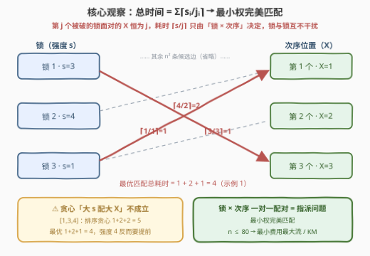
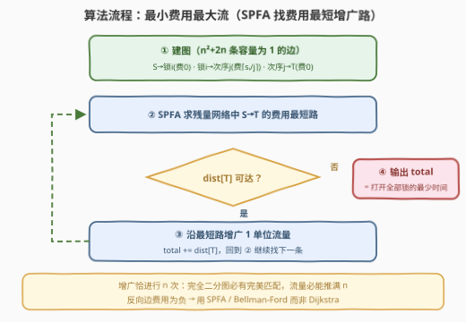

# 破解锁的最少时间 II

- **题目名称**：破解锁的最少时间 II
- **链接**：[3385. 破解锁的最少时间 II](https://leetcode.cn/problems/minimum-time-to-break-locks-ii/)
- **难度**：困难
- **标签**：广度优先搜索、图、数组、最小费用最大流、二分图匹配
- **关联**：[3376. 破解锁的最少时间 I](https://leetcode.cn/problems/minimum-time-to-break-locks-i/) 是小规模版（$n \le 8$，增量 $k$ 由输入给出），可用状压 DP 暴力；本题 $n \le 80$ 且 $k \equiv 1$，官方 hint 直接点名「最小代价匹配」

## 1. 题目概述

> ⚠️ 本题为 LeetCode 付费题，题意描述根据官方示例用例与 hints 重建，可能与官方题面有出入。

Bob 被困在地窖里，需要破解 $n$ 个锁才能逃出。数组 `strength` 中 `strength[i]` 表示打开第 $i$ 把锁所需的**能量**。

Bob 有一把剑，规则如下：

- 一开始剑的**能量**为 $0$；
- 能量的**增长因子** $X$ 一开始为 $1$；
- **每分钟**，剑的能量增加当前的 $X$ 值；
- 打开第 $i$ 把锁，要求剑的能量**至少**达到 $strength[i]$（打开动作本身不耗时，在能量达标的当分钟即可完成）；
- 打开一把锁后，剑的能量**归零**，$X$ 的值**增加 $1$**。

求打开所有 $n$ 把锁所需的**最少分钟数**。

**示例 1**：

```text
输入：strength = [3,4,1]
输出：4
```

| 时间 | 能量 | X  | 操作          | 更新后的 X |
|:----:|:----:|:--:|---------------|:----------:|
| 0    | 0    | 1  | 什么也不做    | 1          |
| 1    | 1    | 1  | 打开第 3 把锁（强度 1）| 2  |
| 2    | 2    | 2  | 什么也不做    | 2          |
| 3    | 4    | 2  | 打开第 2 把锁（强度 4）| 3  |
| 4    | 3    | 3  | 打开第 1 把锁（强度 3）| 3  |

**示例 2**：

```text
输入：strength = [2,5,4]
输出：6
```

最优顺序：先攒到 $2$ 开第 1 把锁（第 2 分钟，$X$ 变 2），再攒 $4$ 开第 3 把锁（第 4 分钟，$X$ 变 3），最后攒 $6$ 开第 2 把锁（第 6 分钟）。

**约束条件**：

- $n = \text{strength.length}$
- $1 \le n \le 80$
- $1 \le \text{strength}[i] \le 10^6$

> 💡 **读题关键**：① 与第 I 题相比，本题没有参数 $k$——$X$ 每破一锁**固定加 1**，因此第 $j$ 个被打破的锁面前站着的一定是 $X = j$；② 打破锁**不耗时间**，时间只花在「攒能量」上，且能量归零后从零重新累积；③ $n \le 80$ 把 $O(n!)$ 与 $O(2^n)$ 的暴力全部堵死，逼你走向多项式算法。

---

## 2. 解题思路

### 2.1 暴力思路：枚举打破顺序（在 II 的规模下不可行）

最直接的做法是枚举 $n$ 把锁的全排列：对每个排列 $p_1, p_2, \dots, p_n$（打破顺序），第 $j$ 个位置上的锁 $p_j$ 面对的 $X = j$，从 $0$ 开始每分钟增加 $j$，攒到 $strength[p_j]$ 需要 $\lceil strength[p_j] / j \rceil$ 分钟，总时间即

$$T = \sum_{j=1}^{n} \left\lceil \frac{strength[p_j]}{j} \right\rceil$$

取所有排列的最小值。这正是第 I 题 $n \le 8$ 时可行的做法（全排列 $8! = 40320$，或状压 DP $O(2^n \cdot n)$）。

但本题 $n \le 80$：$80! \approx 10^{118}$，$2^{80} \approx 10^{24}$——两者都是天文数字。**必须找到多项式复杂度的算法。**

> 💡 **卡住的根源**：我们把「顺序」当成一个整体在枚举，但代价函数其实对每把锁是**可分解**的——这正是下面的突破口。

### 2.2 核心观察：代价只由「锁 × 次序」决定 → 最小权完美匹配



逐条拆解规则，会发现一个关键的**独立性**：

1. 打破锁的动作**不耗时**——时间只在「攒能量」时流逝；
2. 能量归零后**从零重新累积**——上一把锁攒了多少能量与下一把无关；
3. $X$ 从 $1$ 出发、每破一锁 $+1$——所以**第 $j$ 个被打破的锁，面对的 $X$ 恒等于 $j$**，与它是哪把锁、前面破的是谁都无关。

于是锁 $i$ 若被安排在第 $j$ 个打破，它的耗时是一个只依赖 $(strength[i], j)$ 的数：

$$cost(i, j) = \left\lceil \frac{strength[i]}{j} \right\rceil = \left\lfloor \frac{strength[i] - 1}{j} \right\rfloor + 1$$

总时间就是 $n$ 个「锁 → 次序」配对的代价之和。问题转化为标准的**指派问题**（最小权完美匹配）：

- 左部：$n$ 把锁；
- 右部：$n$ 个次序位置 $1, 2, \dots, n$；
- 边权：$w(i, j) = \lceil strength[i] / j \rceil$；
- 目标：为一对一匹配最小化总权值。

> ⚠️ **贪心为什么不行**：直觉上「大强度配大 $X$（靠后的次序）」似乎最优——排序后 $O(n \log n)$ 就能解决。但 $\lceil \cdot \rceil$ 的**非线性**会打破这种交换论证。反例：$strength = [1, 3, 4]$。
>
> - 排序贪心（$1 \to 1$，$3 \to 2$，$4 \to 3$）：$\lceil 1/1 \rceil + \lceil 3/2 \rceil + \lceil 4/3 \rceil = 1 + 2 + 2 = 5$；
> - 最优解（$1 \to 1$，$4 \to 2$，$3 \to 3$）：$\lceil 1/1 \rceil + \lceil 4/2 \rceil + \lceil 3/3 \rceil = 1 + 2 + 1 = 4$。
>
> 强度 $4$ 反而应该排到强度 $3$ **前面**（$X=2$ 时 $\lceil 4/2 \rceil = 2$ 已经「够整除」，而 $3$ 留给 $X=3$ 恰好整除）。取整的台阶效应让局部交换得失难料，必须交给匹配算法全局求解。

### 2.3 算法流程：最小费用最大流（MCMF）



指派问题有一个万能的建图方式——**最小费用最大流**：

- 源点 $S \to$ 每把锁 $i$：容量 $1$，费用 $0$（每把锁只打破一次）；
- 锁 $i \to$ 次序位置 $j$：容量 $1$，费用 $\lceil strength[i] / j \rceil$；
- 每个次序位置 $j \to$ 汇点 $T$：容量 $1$，费用 $0$（每个次序只占一次）。

从 $S$ 到 $T$ 推满 $n$ 单位流量（完全二分图必有完美匹配，流量一定可达 $n$），最小费用即答案。求法采用 **SSP（连续最短路）**框架：每轮用 SPFA（队列优化的 Bellman-Ford，天然支持负权边）找一条**费用最小**的增广路，沿路增广 $1$ 单位流量并累加费用，直到找不到增广路。

流程归纳：

1. 按上述规则建图，共 $n^2 + 2n$ 条容量为 $1$ 的边；
2. SPFA 求当前残量网络中 $S \to T$ 的费用最短路（`dist[T]`）；
3. 若不可达则结束；否则沿最短路把流量推 $1$ 单位（所有源点出边容量为 $1$，瓶颈必为 $1$），总费用累加 $dist[T]$；
4. 重复直到完成 $n$ 次增广，输出总费用。

> 💡 **为什么负权边没问题**：增广后残量网络中出现**反向边**，其费用是原边的相反数（负数）。Dijkstra 处理不了负权，而 SPFA/Bellman-Ford 可以；费用流保证残量网络中不存在负权环，所以 SPFA 一定能正常终止。

### 2.4 示例演算

以示例 1 $strength = [3, 4, 1]$（锁 1 强度 3、锁 2 强度 4、锁 3 强度 1）为例，匹配算法给出的最优指派：

| 锁 | 强度 | 分配次序 $j$ | 面对的 $X$ | 耗时 $\lceil s / j \rceil$ |
|:--:|:----:|:----------:|:--------:|:------------------------:|
| 3  | 1    | 1          | 1        | 1                        |
| 2  | 4    | 2          | 2        | 2                        |
| 1  | 3    | 3          | 3        | 1                        |

总时间 $= 1 + 2 + 1 = 4$，与官方答案一致。示例 2 $[2, 5, 4]$ 的最优指派为 $2 \to 1$、$4 \to 2$、$5 \to 3$，代价 $2 + 2 + 2 = 6$，同样吻合。

---

## 3. 参考代码

### C++

```cpp
class Solution {
public:
    int findMinimumTime(vector<int>& strength) {
        int n = strength.size();
        int s = 2 * n, t = 2 * n + 1;
        // 链式前向星存图；边 e 与反边 e^1 相邻存放
        vector<int> head(t + 1, -1), nxt, to, cap, cost;
        auto addEdge = [&](int u, int v, int c, int w) {
            to.push_back(v); cap.push_back(c); cost.push_back(w);
            nxt.push_back(head[u]); head[u] = to.size() - 1;
            to.push_back(u); cap.push_back(0); cost.push_back(-w);
            nxt.push_back(head[v]); head[v] = to.size() - 1;
        };
        for (int i = 0; i < n; ++i) {
            addEdge(s, i, 1, 0);                 // S -> 锁 i
            addEdge(n + i, t, 1, 0);             // 位置 i+1 -> T
            for (int j = 1; j <= n; ++j) {
                addEdge(i, n + j - 1, 1, (strength[i] - 1) / j + 1);  // 锁 i -> 次序 j
            }
        }

        int total = 0;
        vector<int> dist(t + 1), inq(t + 1), pre(t + 1);
        while (true) {                            // SSP：每轮增广 1 单位流量
            fill(dist.begin(), dist.end(), INT_MAX);
            fill(inq.begin(), inq.end(), 0);
            queue<int> q;
            dist[s] = 0;
            q.push(s);
            inq[s] = 1;
            while (!q.empty()) {                  // SPFA 找费用最小增广路
                int u = q.front(); q.pop();
                inq[u] = 0;
                for (int e = head[u]; e != -1; e = nxt[e]) {
                    int v = to[e];
                    if (cap[e] > 0 && dist[u] + cost[e] < dist[v]) {
                        dist[v] = dist[u] + cost[e];
                        pre[v] = e;
                        if (!inq[v]) { inq[v] = 1; q.push(v); }
                    }
                }
            }
            if (dist[t] == INT_MAX) break;        // 无增广路，结束
            for (int v = t; v != s; v = to[pre[v] ^ 1]) {   // 沿路增广（瓶颈为 1）
                cap[pre[v]]--;
                cap[pre[v] ^ 1]++;
            }
            total += dist[t];
        }
        return total;
    }
};
```

### Python

```python
class Solution:
    def findMinimumTime(self, strength: List[int]) -> int:
        n = len(strength)
        s, t = 2 * n, 2 * n + 1
        graph = [[] for _ in range(t + 1)]   # graph[u] 存边的编号
        to, cap, cost = [], [], []

        def add_edge(u: int, v: int, c: int, w: int) -> None:
            graph[u].append(len(to)); to.append(v); cap.append(c); cost.append(w)
            graph[v].append(len(to)); to.append(u); cap.append(0); cost.append(-w)

        for i, x in enumerate(strength):
            add_edge(s, i, 1, 0)                    # S -> 锁 i
            add_edge(n + i, t, 1, 0)                # 位置 i+1 -> T
            for j in range(1, n + 1):               # 锁 i -> 次序 j
                add_edge(i, n + j - 1, 1, (x - 1) // j + 1)

        total = 0
        while True:                                 # SSP：每轮增广 1 单位流量
            dist = [inf] * (t + 1)
            in_q = [False] * (t + 1)
            pre = [-1] * (t + 1)
            dist[s] = 0
            q = deque([s])
            in_q[s] = True
            while q:                                # SPFA 找费用最小增广路
                u = q.popleft()
                in_q[u] = False
                for e in graph[u]:
                    v = to[e]
                    if cap[e] > 0 and dist[u] + cost[e] < dist[v]:
                        dist[v] = dist[u] + cost[e]
                        pre[v] = e
                        if not in_q[v]:
                            in_q[v] = True
                            q.append(v)
            if dist[t] == inf:
                break
            v = t
            while v != s:                           # 沿路增广（瓶颈为 1）
                e = pre[v]
                cap[e] -= 1
                cap[e ^ 1] += 1
                v = to[e ^ 1]
            total += dist[t]
        return total
```

---

## 4. 复杂度分析

| 维度 | 复杂度 | 说明 |
|------|--------|------|
| 时间 | $O(n^2 \cdot \mathrm{SPFA})$，上界约 $O(n^4)$ | 共 $n$ 次增广；每次 SPFA 在 $V = 2n + 2$ 个点、$E \approx n^2$ 条边的图上运行，单次最坏 $O(VE)$，实际 SPFA 远快于上界；$n = 80$ 时最坏约 $4 \times 10^7$，轻松通过 |
| 空间 | $O(n^2)$ | 边数 $n^2 + 2n$（链式前向星/邻接表存残量网络） |
| 建图 | $O(n^2)$ | 锁与次序两两连边 |

> 💡 若改用 KM（匈牙利）算法求最小权完美匹配，复杂度可降到 $O(n^3) \approx 5 \times 10^5$，是官方 hint 的本意；费用流胜在建模模板通用、且对「容量不止为 1」的扩展场景（如一把锁可占多个次序）依然适用。

---

## 5. 扩展：KM 算法与一行流

本题官方 hint 是「Use the Hungarian algorithm for minimum cost matching」，即用**匈牙利/KM 算法**直接在 $n \times n$ 代价矩阵上求最小权完美匹配，复杂度 $O(n^3)$，思路与第 2.2 节完全一致，只是把「费用流建图」换成「KM 顶标增广」这一更专门的实现。

若在允许第三方库的环境（如 LeetCode Python 环境的 `scipy`），指派问题可以一行解决：

```python
from scipy.optimize import linear_sum_assignment

class Solution:
    def findMinimumTime(self, strength: List[int]) -> int:
        n = len(strength)
        cost = [[(s - 1) // (j + 1) + 1 for j in range(n)] for s in strength]
        r, c = linear_sum_assignment(cost)
        return sum(cost[i][j] for i, j in zip(r, c))
```

另外值得对照姊妹题 [3376](https://leetcode.cn/problems/minimum-time-to-break-locks-i/)：那里 $n \le 8$、增量 $k$ 由输入给出，第 $j$ 个被破的锁面对 $X = 1 + k(j-1)$，用状压 DP $f[S] = \min_{i \notin S} f[S \cup \{i\}] + \lceil strength[i] / (1 + k|S|) \rceil$ 即可。两题共用同一个「代价分解」观察，差别只在规模决定了工具：小规模用指数级搜索，大规模用多项式匹配。

---

## 6. 面试要点

**Q1：为什么总时间能拆成每把锁独立的代价之和？**

> 三条规则合起来：打破锁不耗时、破后能量归零、$X$ 只随已破数量线性增长（$+1$）。第 $j$ 个被破的锁面对的 $X$ 恒为 $j$，与前面破的是哪些锁无关，所以它的等待时间 $\lceil strength[i]/j \rceil$ 只由「锁 $i$ × 次序 $j$」决定，各锁之间完全解耦，总时间可加。

**Q2：排序后让大强度配大 $X$ 的贪心为什么错？**

> $\lceil \cdot \rceil$ 是非线性台阶函数，交换相邻两锁的次序时，两边的取整结果可能同时跳变，无法保证交换不劣。反例 $[1, 3, 4]$：排序贪心得 $1+2+2=5$，而最优解把 $4$ 提前（$1+2+1=4$）。取整类的匹配/排序问题，先想交换论证，证不动就老老实实做匹配。

**Q3：怎么把指派问题转成最小费用最大流？**

> 左部（锁）与右部（次序）各连一条容量 $1$、费用 $0$ 的边到源/汇，中间两两连容量 $1$、费用为配对代价的边。推满 $n$ 单位流量的最小费用就是最优匹配值。容量全为 $1$ 保证每个点至多匹配一次；把某些容量改成 $>1$ 即可表达「一个点可多次匹配」的扩展，这是费用流相对 KM 的建模灵活性。

**Q4：为什么用 SPFA 而不是 Dijkstra 找增广路？**

> 增广会在残量网络中引入**费用为负**的反向边，Dijkstra 的贪心性质被负权破坏。SPFA（Bellman-Ford 队列优化）支持负权边；费用流的残量网络保证无负环，SPFA 一定能正确求出最短路并终止。工程上也可用「Johnson 重标记 + Dijkstra」避免最坏情形，但本题规模下 SPFA 足够。

**Q5：增广路恰好有几条？流量一定能推满 $n$ 吗？**

> 每条源点出边容量为 $1$，每次增广瓶颈必为 $1$，故恰好增广 $n$ 次。锁与次序构成**完全二分图**，完美匹配必然存在（任意 Hall 条件都满足），所以流量一定可达 $n$，算法必然在 $n$ 次增广后自然终止，无需处理「匹配不满」的退化情形。

---

## 7. 同类练习题

- [3376. 破解锁的最少时间 I](https://leetcode.cn/problems/minimum-time-to-break-locks-i/)：本题的小规模版（$n \le 8$），同一个代价分解观察 + 状压 DP/全排列即可
- [1879. 两个数组最小的异或值之和](https://leetcode.cn/problems/minimum-xor-sum-of-two-arrays/)：最小权完美匹配的经典题，$n \le 14$ 可状压，也可用匹配思想理解
- [1947. 最大兼容性得分和](https://leetcode.cn/problems/maximum-compatibility-score-sum/)：指派问题的「最大化」版本，小规模状压 DP
- [1066. 校园自行车分配 II](https://leetcode.cn/problems/campus-bikes-ii/)：人—车最小代价一对一分配，费用流/状压皆可
- [1595. 连通两组点的最小成本](https://leetcode.cn/problems/minimum-cost-to-connect-two-groups-of-points/)：二分图匹配的拓展（右侧可复用），练习「容量」维度的建图
