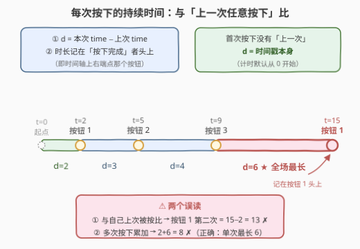
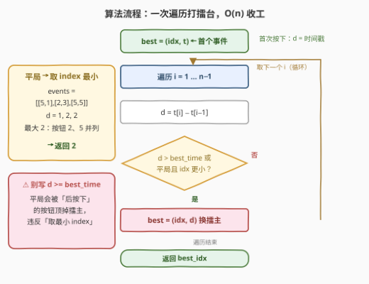

# 按下时间最长的按钮

- **题目名称**：按下时间最长的按钮
- **链接**：[3386. 按下时间最长的按钮](https://leetcode.cn/problems/button-with-longest-push-time/)
- **难度**：简单
- **标签**：数组、一次遍历
- **关联**：2260 必须拿起的最小连续卡牌数——真正考察「同一元素两次出现的间隔」（哈希记上次位置），恰是本题最易误读出的模型；2404 出现最频繁的偶数元素——「按键聚合 + 平局取最小」的完全体；2016 增量元素之间的最大差值——同款一次遍历维护最大差值

## 1. 题目概述

孩子在小键盘上按下一系列按钮，事件数组 `events` 中每个 `events[i] = [index_i, time_i]` 表示**在时刻 `time_i` 按下了下标为 `index_i` 的按钮**，数组已按 `time` **递增排序**。

「按一次按钮所花的时间」定义如下：

- 第 $i$ 次（$i \ge 1$）按下：$d_i = \text{time}_i - \text{time}_{i-1}$——**与上一次按下（无论是哪个按钮）的时间差**；
- 第 0 次按下没有「上一次」：$d_0 = \text{time}_0$，即它自己的**时间戳**。

每次按下的持续时间记在**这次按下对应的按钮**名下。返回**按下时间最长**的按钮 `index`；若多个按钮的按下时间相同，返回 `index` 最小的那个。

**示例 1**：

```text
输入：events = [[1,2],[2,5],[3,9],[1,15]]
输出：1
解释：
  t=2  按下按钮 1：d = 2（首次按下，取时间戳）
  t=5  按下按钮 2：d = 5−2 = 3
  t=9  按下按钮 3：d = 9−5 = 4
  t=15 再次按下按钮 1：d = 15−9 = 6
  按钮 1 名下单次按下最长为 6，全场最长 → 返回 1
```

**示例 2**：

```text
输入：events = [[10,5],[1,7]]
输出：10
解释：
  t=5 按下按钮 10：d = 5（首次按下，取时间戳）
  t=7 按下按钮 1：d = 7−5 = 2
  按钮 10 的 5 是全场最长 → 返回 10
```

**约束条件**：

- $1 \le \text{events.length} \le 1000$
- $1 \le \text{index}_i, \text{time}_i \le 10^5$
- 输入保证 `events` 按 $\text{time}_i$ 递增排序

> 💡 **读题关键**：① 持续时间是**相邻两次按下事件**的时间差——「上一次」是**任意按钮**，不是该按钮自己上一次被按（示例 1 中按钮 1 第二次按下是 $15-9=6$，不是 $15-2=13$）；② 按钮「按下时间」取它名下**单次按下的最大值**，不是多次累加（官方解释明确写着按钮 1「为 6」而非 $2+6=8$）；③ 首次按下的持续时间就是时间戳本身——计时默认从 0 开始，示例 2 中按钮 10 正是靠这条规则以 5 直接夺魁。

---

## 2. 解题思路

### 2.1 朴素思路：哈希表聚合，两趟扫描

按定义老老实实分两步：

1. 遍历事件，把每次按下的持续时间 $d_i$ 挂到 $\text{index}_i$ 名下，用哈希表为每个按钮维护「名下单次最长持续时间」；
2. 再扫一遍哈希表，选持续时间最大的按钮，平局取 `index` 最小。

```text
best = {}                      # index → 名下单次最长持续时间
prev = 0                       # 上一次按下的时刻（计时从 0 起）
for idx, t in events:
    d = t - prev               # 首次按下时 prev = 0，d 天然等于时间戳
    best[idx] = max(best.get(idx, 0), d)
    prev = t
ans = 聚合后取（持续时间最大，平局 index 最小）
```

正确性没有问题，$O(n)$ 时间 + $O(\min(n, 10^5))$ 空间也能过。但答案只关心**全局最长的那一次按下**——为每个按钮都开桶记账，纯属杀鸡用牛刀。

> 💡 顺带一提：`prev` 初始化为 0 这个小技巧，让「首次按下取时间戳」与「相邻时间差」统一成了同一个式子 $d_i = t_i - \text{prev}$，无需特判。

### 2.2 核心观察：打擂台——最长的一次按下必出自某次具体事件



把时间轴画开，每次按下就是一条线段：**段长 = 本次时刻 − 上次时刻，时长记在右端「按下完成」的那个按钮头上**。于是：

- 按钮「按下时间」= 它名下各次按下的**最大值**（不是求和！示例 1 中按钮 1 是 $\max(2, 6) = 6$，官方解释写得明白）；
- **全局最长的按下时间，必然出自某一次具体按下事件**——逐按钮聚合取最大，与直接在所有事件里取最大，结果完全等价；
- 因此只需一个滚动擂台 $(\text{best\_idx}, \text{best\_time})$ 逐事件打擂：当前事件持续时间**更大** → 换擂主；持续时间**相等且 index 更小** → 也换（平局取最小）。

更新条件一行写完：

$$
\text{d} > \text{best\_time} \;\;||\;\; (\text{d} == \text{best\_time} \;\&\&\; \text{idx} < \text{best\_idx})
$$

> ⚠️ 不能图省事写 `d >= best_time`——平局时会被**后按下**的按钮顶掉擂主，返回「较晚出现」而非「index 最小」。例如 `events = [[5,1],[2,3],[5,5]]`：$d = 1, 2, 2$，最大值 2 由按钮 2、5 并列取得，正确答案是 2；写 `>=` 的话最后的按钮 5 会把擂主抢走，返回错误的 5。

### 2.3 算法流程图



一趟扫描 + 一个擂台变量：

1. **初始化**：擂主 = 第一个事件 $(\text{idx}_0, \text{time}_0)$——首次按下的持续时间就是时间戳；
2. **遍历** $i = 1 \dots n-1$：计算 $d = \text{time}_i - \text{time}_{i-1}$；
3. **打擂台**：$d$ 更大，或 $d$ 相等且 $\text{idx}_i$ 更小 → 更新擂主；
4. 遍历结束，返回 $\text{best\_idx}$。

### 2.4 示例演算

**示例 1**：`events = [[1,2],[2,5],[3,9],[1,15]]`

| 事件 | 按钮 | 时刻 | 持续时间 $d$ | 擂台 $(\text{best\_idx}, \text{best\_time})$ |
|------|------|------|--------------|----------------------------------------------|
| 0 | 1 | 2 | $2$（首次，取时间戳） | 初始 $(1, 2)$ |
| 1 | 2 | 5 | $5-2=3$ | $3 > 2$ → $(2, 3)$ |
| 2 | 3 | 9 | $9-5=4$ | $4 > 3$ → $(3, 4)$ |
| 3 | 1 | 15 | $15-9=6$ | $6 > 4$ → $(1, 6)$ |

擂主换了一圈又回到按钮 1，返回 **1** ✓——注意按钮 1 两次上榜，靠的是**单次**的 6，而非累加的 8。

**示例 2**：`events = [[10,5],[1,7]]`

| 事件 | 按钮 | 时刻 | 持续时间 $d$ | 擂台 |
|------|------|------|--------------|------|
| 0 | 10 | 5 | $5$（时间戳） | 初始 $(10, 5)$ |
| 1 | 1 | 7 | $7-5=2$ | $2 < 5$，擂主不动 |

返回 **10** ✓——「首次按下持续时间 = 时间戳」在这道示例里就是胜负手。

---

## 3. 参考代码

### C++

```cpp
class Solution {
  public:
    int buttonWithLongestTime(vector<vector<int>>& events) {
        int bestIdx = events[0][0];
        int bestTime = events[0][1];                  // 首次按下：d = 时间戳
        for (int i = 1; i < (int)events.size(); i++) {
            int idx = events[i][0];
            int d = events[i][1] - events[i - 1][1];  // 与上一次任意按下的时间差
            if (d > bestTime || (d == bestTime && idx < bestIdx)) {
                bestTime = d;
                bestIdx = idx;
            }
        }
        return bestIdx;
    }
};
```

### Python

```python
class Solution:
    def buttonWithLongestTime(self, events: List[List[int]]) -> int:
        best_idx, best_time = events[0]               # 首次按下：d = 时间戳
        for i in range(1, len(events)):
            idx, t = events[i]
            d = t - events[i - 1][1]                  # 与上一次任意按下的时间差
            if d > best_time or (d == best_time and idx < best_idx):
                best_time, best_idx = d, idx
        return best_idx
```

> 💡 两个实现细节：① $n = 1$ 时循环体不执行，直接返回 `events[0][0]`，无需特判；② 若想连首个事件也塞进统一循环，可令 `prev = 0` 从 $i=0$ 开始扫——$d_0 = t_0 - 0 = \text{time}_0$，与「时间戳」定义天然一致。

---

## 4. 复杂度分析

| 维度 | 复杂度 | 说明 |
|------|--------|------|
| **时间复杂度** | $O(n)$ | 单趟扫描，每个事件一次减法 + 一次比较 |
| **空间复杂度** | $O(1)$ | 只有两个滚动变量，优于哈希聚合版的 $O(\min(n, 10^5))$ |

---

## 5. 扩展：两个变体，检验是否真的读懂数据流

- **变体 A（累加版）**：若把「按下时间」改成按钮名下**所有按下持续时间的总和**（示例 1 中按钮 1 将是 $2+6=8$），打擂台就不够了——需要 2.1 节的哈希表做 `total[index] += d` 聚合，再取最大、平局取最小 index，正是 [2404 出现最频繁的偶数元素](../2401-2500/2404_出现最频繁的偶数元素.md) 的「计数聚合 + 平局取最小」套路。
- **变体 B（同键间隔版）**：若持续时间改成「与自己上一次被按的间隔」（示例 1 中按钮 1 将是 $15-2=13$），则需要哈希表记录每个按钮的 `last_seen`，取 `t - last_seen[idx]`——这正是 [2260 必须拿起的最小连续卡牌数](../2201-2300/2260_必须拿起的最小连续卡牌数.md) 的标准动作。

一题三吃：同一串事件流，改一个定义就换一套数据结构——面试中口述这两个变体的改法，远比背代码更能体现读题功力。

---

## 6. 面试要点

1. **首次按下的持续时间为什么是时间戳本身？**

   - 计时从 0 开始，第 0 次按下可视为 $d_0 = \text{time}_0 - 0$；
   - 示例 2 中按钮 10 仅被按一次，却以时间戳 5 直接夺魁，就靠这条规则。

2. **本题最常见的误读是什么？**

   - 把「与上一次按下的时间差」读成「与**该按钮自己**上一次被按的时间差」；
   - 示例 1 正确算法里按钮 1 第二次按下是 $15-9=6$；误读会算成 $15-2=13$，还得多开一张哈希表记 `last_seen`。

3. **按钮的「按下时间」是单次最大还是多次累加？**

   - 单次最大。官方解释明确写着按钮 1「为 6」而非 $2+6=8$；
   - 因此「逐事件打擂台」与「逐按钮取最大再全局取最大」等价，且只需 $O(1)$ 空间。

4. **平局更新条件为什么不能写 `>=`？**

   - `>=` 会让平局被**后按下**的按钮顶掉擂主，返回「较晚出现」而非「index 最小」；
   - 必须写 `d > best_time || (d == best_time && idx < best_idx)`：严格更大，或相等且 index 更小。

5. **$n = 1$ 需要特判吗？**

   - 不需要。擂主初始化为第一个事件后循环体不执行，直接返回 `events[0][0]`。

> 💡 **一句话总结**：相邻事件相减得每次按下的持续时间（首按取时间戳），一个 $(\text{best\_idx}, \text{best\_time})$ 擂台变量逐事件打擂——严格更大、或平局且 index 更小才换擂主，一趟 $O(n)$ 收工。

---

## 7. 同类练习题

- [2016. 增量元素之间的最大差值](https://leetcode.cn/problems/maximum-difference-between-increasing-elements/)（[题解](../2001-2100/2016_增量元素之间的最大差值.md)）：一次遍历维护「前缀最小 + 最大差值」，与本题同款单趟滚动维护的手感
- [2260. 必须拿起的最小连续卡牌数](https://leetcode.cn/problems/minimum-consecutive-cards-to-pick-up/)（[题解](../2201-2300/2260_必须拿起的最小连续卡牌数.md)）：真正考察「同一元素两次出现的间隔」——哈希记上次出现位置，正是本题误读版的正确形态
- [2404. 出现最频繁的偶数元素](https://leetcode.cn/problems/most-frequent-even-element/)（[题解](../2401-2500/2404_出现最频繁的偶数元素.md)）：按键聚合计数 + 平局取最小值，本题 2.1 节「哈希聚合版」的完全体
- [121. 买卖股票的最佳时机](https://leetcode.cn/problems/best-time-to-buy-and-sell-stock/)（[题解](../0101-0200/121_买卖股票的最佳时机.md)）：一次遍历同时维护极值与答案的祖师爷，本题擂台变量的推广形态
