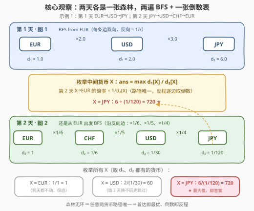
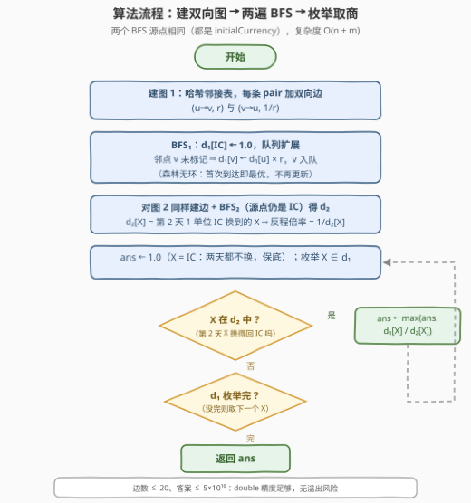

# LeetCode 两天自由外汇交易后的最大货币数 题解

- **关联**：[399. 除法求值](https://leetcode.cn/problems/evaluate-division/) 是「单张图上求两货币间倍率」的基础版；本题把它拆成**两张独立的图**，再用「枚举中间货币」拼接

## 1. 题目概述

- **标题 / 题号**：两天自由外汇交易后的最大货币数（#3387，medium）
- **链接**：https://leetcode.cn/problems/maximize-amount-after-two-days-of-conversions/
- **难度**：中等
- **标签**：广度优先搜索、深度优先搜索、图、哈希表

**题意**：给你一个字符串 `initialCurrency` 表示初始货币，你一开始拥有 $1.0$ 单位的它。另给两组数据：

- `pairs1[i] = [startCurrency, targetCurrency]`：**第 1 天**可按汇率 `rates1[i]` 把 `startCurrency` 兑换成 `targetCurrency`；
- `pairs2` / `rates2` 同理描述**第 2 天**。

每条兑换关系都是**双向**的：`targetCurrency` 也能按 $1 / rate$ 换回 `startCurrency`。你可以第 1 天用 `rates1` 兑换**任意多次（含 0 次）**，第 2 天再用 `rates2` 兑换任意多次。返回两天结束后最多能拥有的 `initialCurrency` 数量。

**示例 1**：

```text
输入：initialCurrency = "EUR",
     pairs1 = [["EUR","USD"],["USD","JPY"]], rates1 = [2.0,3.0],
     pairs2 = [["JPY","USD"],["USD","CHF"],["CHF","EUR"]], rates2 = [4.0,5.0,6.0]
输出：720.00000
解释：第 1 天 1 EUR → 2 USD → 6 JPY；
     第 2 天 6 JPY → 24 USD → 120 CHF → 720 EUR。
```

**示例 2**：

```text
输入：initialCurrency = "NGN", pairs1 = [["NGN","EUR"]], rates1 = [9.0],
     pairs2 = [["NGN","EUR"]], rates2 = [6.0]
输出：1.50000
解释：第 1 天换出 9 EUR，第 2 天按反向汇率 1/6 换回，9 / 6 = 1.5 NGN。
```

**示例 3**：

```text
输入：initialCurrency = "USD", pairs1 = [["USD","EUR"]], rates1 = [1.0],
     pairs2 = [["EUR","JPY"]], rates2 = [10.0]
输出：1.00000
解释：第 2 天的图里 EUR 换不回 USD，任何兑换都无利可图，最优是什么都不做。
```

**约束**：

- $1 \le n = pairs1.length \le 10$，$1 \le m = pairs2.length \le 10$
- 货币名长度 $1 \sim 3$，仅大写字母；$1.0 \le rates_i \le 10.0$
- 输入保证两个转换图在各自的天数内**没有矛盾或循环**
- 输入保证答案最大为 $5 \times 10^{10}$

> 💡 **读题关键**：① 兑换关系是**双向**的（正向 $r$、反向 $1/r$），每天的图是一张**无向加权图**；② 「任意多次」不是废话——若无环限制被去掉，同一张图内的**正环**就能无限套利；③ 「没有矛盾或循环」这句话是解题钥匙：它保证每天的图是**森林**，任意两货币之间**至多一条路径**；④ 两天用的是**两张不同的图**，第 1 天的终点货币是第 2 天的起点货币。

## 2. 解题思路

### 2.1 暴力思路：枚举中间货币，逐个搜索

最优方案必然形如：**第 1 天**从 `initialCurrency`（下称 `IC`）出发一路换到某个货币 $X$，**第 2 天**再从 $X$ 出发一路换回 `IC`。于是最直接的做法：

- 枚举中间货币 $X$（所有出现过的货币）；
- 在图 1 上从 `IC` 出发 DFS/BFS，求 `IC` $\to X$ 的最大乘积倍率 $d_1[X]$；
- 在图 2 上从 $X$ 出发 DFS/BFS，求 $X \to$ `IC` 的最大乘积倍率 $g[X]$；
- 答案 $= \max_X d_1[X] \cdot g[X]$。

货币数 $V \le 2n + 2m + 1 \le 41$，每个货币独立搜一遍是 $O\!\left(V \cdot (V + E)\right)$，数据规模下完全能过。但这套写法把**图 2 反复搜索了 $V$ 遍**，每遍的源点还各不相同——搜索次数是平方级的， smell 不太好。有没有办法每张图只搜一遍？

### 2.2 核心观察：两遍 BFS + 一张倒数表



三个层层递进的关键观察：

**观察 1：每天的图是森林，路径唯一。** 「没有矛盾或循环」意味着每张无向图**无环**，即森林。森林中任意两点至多一条路径，于是「最大倍率」退化成「**唯一倍率**」——BFS 时每个货币**首次被到达**得到的乘积就是最终答案，不存在「绕远路反而更优」，也不存在正环套利。

**观察 2：第 2 天的搜索可以倒过来做。** 与其对每个 $X$ 在图 2 上「从 $X$ 搜到 `IC`」，不如固定源点为 `IC`，对图 2 做**一遍** BFS 得到 $d_2[X]$ = 第 2 天 1 单位 `IC` 能换到的 $X$ 数量。由于路径唯一，$X \to$ `IC` 只能沿原路反向走，每条边取倒数：

$$g[X] = \frac{1}{d_2[X]} \quad\Longleftrightarrow\quad \underbrace{(IC \to X)}_{d_2[X]} \times \underbrace{(X \to IC)}_{g[X]} = 1$$

**观察 3：答案就是两张表的一张商表。** 两遍 BFS 各得一张哈希表，最终

$$ans = \max_{X \, \in\, dom(d_1) \cap dom(d_2)} \frac{d_1[X]}{d_2[X]}$$

$X = IC$ 时贡献 $1/1 = 1$，正是「两天什么都不换」的保底——所以示例 3 里那张「第 2 天回不去」的图，答案自动落在 1 上，不需要任何特判。若 $X$ 在第 2 天的连通块里根本到不了 `IC`（不在 $d_2$ 中），这条路线换不回来，直接跳过。

以示例 1 验证：$d_1 = \{EUR\!:\!1,\ USD\!:\!2,\ JPY\!:\!6\}$，$d_2 = \{EUR\!:\!1,\ CHF\!:\!\tfrac{1}{6},\ USD\!:\!\tfrac{1}{30},\ JPY\!:\!\tfrac{1}{120}\}$，候选 $\{1,\ 60,\ 720\}$，取 $720$ ✓。

> ⚠️ **三个高频翻车点**：
>
> - **忘记边是双向的**：只建正向边的话，示例 2 的「按 $1/6$ 反向换回」直接丢掉；
> - **BFS 里用松弛/重复入队**：那是带环图的写法。这里森林无环，首达即最优，`if v not in amount` 一次赋值即可，写复杂反而容易引入死循环隐患；
> - **漏掉「什么都不换」**：别忘了答案下限是 $1.0$（枚举 $X = IC$ 自然覆盖，但手写循环时要确认保底存在）。

### 2.3 算法流程图



建图 → BFS₁ → BFS₂ → 枚举取商 → 返回。全程只有两个源点（都是 `IC`），两张表各搜一遍，枚举是纯哈希查询。

### 2.4 示例演算

**示例 1**（见 2.2 概念图）：

1. **第 1 天 BFS**：从 `EUR` 出发，$d_1[USD] = 1 \times 2.0 = 2$，$d_1[JPY] = 2 \times 3.0 = 6$；
2. **第 2 天 BFS**（同样从 `EUR` 出发，沿反向边）：$d_2[CHF] = \frac{1}{6}$，$d_2[USD] = \frac{1}{6} \times \frac{1}{5} = \frac{1}{30}$，$d_2[JPY] = \frac{1}{30} \times \frac{1}{4} = \frac{1}{120}$；
3. **枚举**：$EUR: \frac{1}{1} = 1$；$USD: \frac{2}{1/30} = 60$；$JPY: \frac{6}{1/120} = 720$ ★。

答案 $720$，与官方一致。注意第 2 天的 $6$ 倍是「正向原路走」的视角：$JPY \xrightarrow{\times 4} USD \xrightarrow{\times 5} CHF \xrightarrow{\times 6} EUR$，乘积 $120$ 恰为 $1/d_2[JPY]$——倒数技巧的直观体现。

## 3. 参考代码

### C++

```cpp
class Solution {
  public:
    double maxAmount(string initialCurrency, vector<vector<string>>& pairs1,
                     vector<double>& rates1, vector<vector<string>>& pairs2,
                     vector<double>& rates2) {
        // bfs：从 src 出发（1.0 单位），返回每个可达货币的最大数量
        auto bfs = [](vector<vector<string>>& pairs, vector<double>& rates,
                      const string& src) {
            unordered_map<string, vector<pair<string, double>>> g;
            for (int i = 0; i < (int)pairs.size(); i++) {
                g[pairs[i][0]].emplace_back(pairs[i][1], rates[i]);        // 正向 r
                g[pairs[i][1]].emplace_back(pairs[i][0], 1.0 / rates[i]);  // 反向 1/r
            }
            unordered_map<string, double> amount{{src, 1.0}};
            queue<string> q;
            q.push(src);
            while (!q.empty()) {
                string u = q.front();
                q.pop();
                for (auto& [v, r] : g[u])
                    if (!amount.count(v)) {        // 森林无环：首达即最优
                        amount[v] = amount[u] * r;
                        q.push(v);
                    }
            }
            return amount;
        };

        auto d1 = bfs(pairs1, rates1, initialCurrency);
        auto d2 = bfs(pairs2, rates2, initialCurrency);

        double ans = 1.0;  // X = IC：两天都不换，保底 1.0
        for (auto& [c, a] : d1) {
            auto it = d2.find(c);
            if (it != d2.end())           // 第 2 天 X 换不回 IC 则跳过
                ans = max(ans, a / it->second);
        }
        return ans;
    }
};
```

### Python

```python
class Solution:
    def maxAmount(self, initialCurrency: str, pairs1: List[List[str]], rates1: List[float],
                  pairs2: List[List[str]], rates2: List[float]) -> float:
        def bfs(pairs: List[List[str]], rates: List[float], src: str) -> dict:
            g = defaultdict(list)
            for (u, v), r in zip(pairs, rates):
                g[u].append((v, r))          # 正向 r
                g[v].append((u, 1.0 / r))    # 反向 1/r
            amount = {src: 1.0}
            q = deque([src])
            while q:
                u = q.popleft()
                for v, r in g[u]:
                    if v not in amount:      # 森林无环：首达即最优
                        amount[v] = amount[u] * r
                        q.append(v)
            return amount

        d1 = bfs(pairs1, rates1, initialCurrency)
        d2 = bfs(pairs2, rates2, initialCurrency)

        ans = 1.0  # X = IC：两天都不换，保底 1.0
        for c, a in d1.items():
            if c in d2:                      # 第 2 天 X 换不回 IC 则跳过
                ans = max(ans, a / d2[c])
        return ans
```

> 💡 **实现细节**：① 两天的 BFS 完全同构，抽成一个函数对两张图各调用一次，避免复制粘贴；② 货币名是字符串，图与距离表都用哈希容器（`unordered_map` / `dict`）；③ 最多 $10 + 10$ 条边、汇率 $\le 10$，中间乘积 $\le 10^{10}$、商 $\le 5 \times 10^{10}$（题目保证），`double` 的 52 位尾数绰绰有余，无精度顾虑。

## 4. 复杂度分析

| 维度 | 复杂度 | 说明 |
|------|--------|------|
| 时间 | $O(n + m)$ | 两张图各建边、各 BFS 一遍；枚举阶段每个货币一次哈希查询 |
| 空间 | $O(n + m)$ | 邻接表 + 两张距离表，货币数 $\le 2n + 2m + 1$ |
| 暴力对照 | $O\!\left(V(V+E)\right)$ | 每个中间货币对图 2 单独搜一遍；$V \le 41$ 也能过，但源点应统一成 `IC` 只搜一次 |

## 5. 扩展：如果图里有环怎么办？

本题「无矛盾或循环」的保证干掉了两件事，值得想清楚它们分别对应什么：

- **矛盾**：同一对货币出现两条汇率不一致的路径（如 $A \to B \to C$ 与 $A \to C$ 的隐含汇率不同）。此时「最大倍率」仍良定，但需要 Bellman-Ford 式松弛——每轮用每条边 $(u, v, r)$ 尝试 $dist[v] \gets \max(dist[v],\ dist[u] \cdot r)$，迭代至多 $V - 1$ 轮；
- **循环**：环上汇率乘积 $> 1$ 的**正环**。同一张图内反复绕环即可让钱无限增殖，答案发散到 $+\infty$——这正是现实套利交易的原理，也是题目必须排除它的原因。判定方法：Bellman-Ford 松弛 $V$ 轮后仍能更新，即存在正环。

换句话说，本题是「外汇套利」问题的**无环特例**：正环不存在 $\Rightarrow$ 最优路径简单 $\Rightarrow$ 两遍 BFS 收工。若面试官追问「真实市场呢」，上面的 Bellman-Ford + 正环检测就是标准答案。

## 6. 面试要点

1. **最优解为什么一定形如「第 1 天 IC→X，第 2 天 X→IC」？**

   - 两天各自独立、兑换可任意多次但顺序无关（乘法交换律），第 1 天结束时的持仓是某个货币 $X$ 的 $d_1[X]$ 份。两天策略可拆开优化，拼接点是第 1 天的终点货币。

2. **为什么 BFS 每个货币只访问一次就够？**

   - 「无矛盾或循环」保证每天的无向图是森林，任意两货币至多一条路径，首达乘积即唯一乘积，不存在更优的绕路。带环图才需要松弛或 Dijkstra 式的反复更新。

3. **第 2 天的「倒数技巧」为什么成立？**

   - $d_2[X]$ 是图 2 上 `IC` $\to X$ 的路径乘积；$X \to$ `IC` 在森林里只能沿同一条路径反向走，每条边取倒数，总倍率恰为 $1/d_2[X]$。它把「以每个 $X$ 为源点的多源搜索」压成「以 `IC` 为源点的一遍 BFS」。

4. **答案的下限是多少？为什么不需要特判「无法兑换」？**

   - 下限 $1.0$（两天都不动）。枚举 $X = IC$ 时 $d_1/d_2 = 1$ 自然覆盖；$X$ 若在第 2 天换不回 `IC`（不在 $d_2$ 中），跳过即可，保底值仍在。

5. **这题和 399 除法求值的异同？**

   - 399 是**单张**带权图上查询任意两变量间的倍率（带权并查集 / BFS 均可）；本题是**两张**图的串联，且多了「最大化」目标。共同内核都是「边权为乘积的路径搜索」。

## 同类练习题

| # | 题目 | 与本题的关联 |
|---|------|-------------|
| 399 | [除法求值](https://leetcode.cn/problems/evaluate-division/)（[站内题解](../0301-0400/399_除法求值.md)） | 单张图上求任意两变量间的倍率，本题的单图直系基础版 |
| 1514 | [概率最大的路径](https://leetcode.cn/problems/path-with-maximum-probability/)（[站内题解](../1501-1600/1514_概率最大的路径.md)） | 边权**乘积最大化**的单源最短路，把本题的 BFS 换成 Dijkstra 的推广 |
| 787 | [K 站中转内最便宜的航班](https://leetcode.cn/problems/cheapest-flights-within-k-stops/)（[站内题解](../0701-0800/787_K站中转内最便宜的航班.md)） | 限制步数的最优路径，Bellman-Ford 松弛的招牌应用（对照本文第 5 节扩展） |
| 743 | [网络延迟时间](https://leetcode.cn/problems/network-delay-time/)（[站内题解](../0701-0800/743_网络延迟时间.md)） | 单源最短路模板题，「固定一个源点搜全图」的本题同款思想 |
