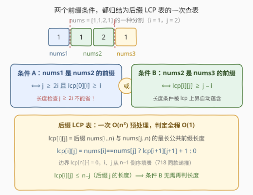
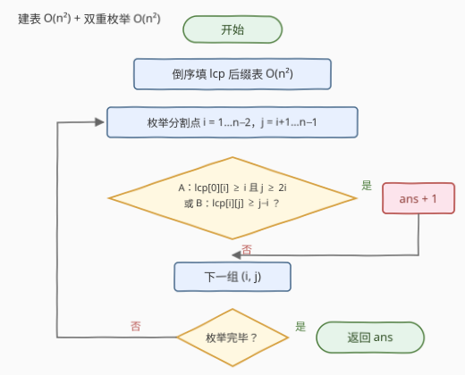

# LeetCode 统计数组中的美丽分割 题解

- **关联**：[718. 最长重复子数组](https://leetcode.cn/problems/maximum-length-of-repeated-subarray/) 与本题共用同一张「后缀 LCP 表」——相等则右下角 +1、不等归零的二维递推

## 1. 题目概述

- **标题 / 题号**：统计数组中的美丽分割（#3388，medium）
- **链接**：https://leetcode.cn/problems/count-beautiful-splits-in-an-array/
- **难度**：中等
- **标签**：数组、动态规划、后缀匹配（LCP / Z 函数思想）

**题意**：给你一个整数数组 `nums`。把它切成三段**非空连续子数组** `nums1`、`nums2`、`nums3`（按顺序连接恰好还原 `nums`），若满足 **`nums1` 是 `nums2` 的前缀**，或 **`nums2` 是 `nums3` 的前缀**，则称这是一个**美丽分割**。返回美丽分割的数目。

**示例 1**：

```text
输入：nums = [1,1,2,1]
输出：2
解释：美丽分割有：
  ① nums1=[1], nums2=[1,2], nums3=[1]   （nums1 是 nums2 的前缀）
  ② nums1=[1], nums2=[1],   nums3=[2,1] （nums1 是 nums2 的前缀）
```

**示例 2**：

```text
输入：nums = [1,2,3,4]
输出：0
解释：没有美丽分割。
```

**约束**：

- $1 \le nums.length \le 5000$
- $0 \le nums[i] \le 50$

> 💡 **读题关键**：① 分割由两个分割点 $(i, j)$ 唯一确定，总数 $\binom{n-1}{2}$ 约 1250 万——**枚举本身不慌，慌的是每次判定**，朴素逐位比较前缀是 $O(n)$；② 「A 是 B 的前缀」是**内容 + 长度**的双重约束：内容逐位相同，且 B 装得下 A；③ $n \le 5000$ 暗示 $O(n^2)$ 正是复杂度甜区。

## 2. 解题思路

### 2.1 暴力思路：枚举 + 逐位比较

枚举两个分割点，即 $nums_1 = nums[0..i)$、$nums_2 = nums[i..j)$、$nums_3 = nums[j..n)$，对每组 $(i, j)$ 直接逐位比较判前缀，单次 $O(n)$，总计 $O(n^3) \approx 1.25 \times 10^{11}$（$n = 5000$），完全不可行。

要害在于：**同一起点对的前缀匹配信息被反复重算**。判断各种 $nums_2$ 是否为 $nums_3$ 的前缀，本质上都在问「后缀 $i$ 与后缀 $j$ 从头匹配多远」——这正是**后缀 LCP 表**一口气回答的问题。

### 2.2 核心观察：后缀 LCP 表，把每次判定降到 O(1)



定义 $\mathrm{lcp}[i][j]$ 为后缀 $nums[i..n)$ 与 $nums[j..n)$ 的**最长公共前缀**长度，倒序递推（与 718 最长重复子数组同款）：

$$
\mathrm{lcp}[i][j] = \begin{cases} \mathrm{lcp}[i+1][j+1] + 1, & nums[i] = nums[j] \\ 0, & nums[i] \ne nums[j] \end{cases}
$$

边界 $\mathrm{lcp}[n][\cdot] = 0$。一次 $O(n^2)$ 预处理后，两个条件都变成**一次查表**：

- **条件 A**（$nums_1$ 是 $nums_2$ 的前缀）：内容上要求 $nums[0..i) = nums[i..2i)$，即 $\mathrm{lcp}[0][i] \ge i$；长度上要求 $nums_2$ 装得下 $nums_1$，即 $j \ge 2i$。故 **A $\iff$ $j \ge 2i$ 且 $\mathrm{lcp}[0][i] \ge i$**。
- **条件 B**（$nums_2$ 是 $nums_3$ 的前缀）：内容上要求 $nums[i..j) = nums[j..j+(j-i))$，即 $\mathrm{lcp}[i][j] \ge j - i$；而长度检查**竟然可以省略**——因为 $\mathrm{lcp}[i][j] \le n - j$（后缀 $j$ 的长度封顶），一旦 $\mathrm{lcp}[i][j] \ge j - i$ 便自动有 $j - i \le n - j$。故 **B $\iff$ $\mathrm{lcp}[i][j] \ge j - i$**。

> ⚠️ **不对称的根源**：条件 B 里被匹配的「容器」恰好是后缀 $j$ 本身，LCP 天然被它的长度封顶；条件 A 里的容器 $nums_2$ 只是后缀 $i$ 的**开头一段**，$\mathrm{lcp}[0][i]$ 的上界 $n - i$ 管不住 $nums_2$ 的实际长度 $j - i$，所以必须显式判 $j \ge 2i$。

### 2.3 算法流程图



1. 倒序填 $\mathrm{lcp}$ 表，$O(n^2)$ 预处理；
2. 枚举分割点 $i \in [1, n-2]$、$j \in (i, n)$；
3. 查表判定 A 或 B，任一成立则计数 +1；
4. 枚举完毕，返回答案。

### 2.4 示例演算

![示例 [1,1,2,1] 三种分割的判定过程](../images/p3388_example_walkthrough.svg)

对 `nums = [1,1,2,1]`（$n = 4$），关键 LCP 值：$\mathrm{lcp}[0][1] = 1$、$\mathrm{lcp}[1][2] = 0$、$\mathrm{lcp}[1][3] = 1$、$\mathrm{lcp}[2][3] = 0$。逐一检验全部 $3$ 种分割：

| $(i, j)$ | 分割 | 条件 A | 条件 B | 美丽？ |
|---|---|---|---|---|
| (1, 2) | [1] ‖ [1] ‖ [2,1] | $j{=}2 \ge 2$ 且 $\mathrm{lcp}[0][1]{=}1 \ge 1$ ✓ | $\mathrm{lcp}[1][2]{=}0 < 1$ ✗ | ✓ |
| (1, 3) | [1] ‖ [1,2] ‖ [1] | $j{=}3 \ge 2$ 且 $\mathrm{lcp}[0][1]{=}1 \ge 1$ ✓ | $\mathrm{lcp}[1][3]{=}1 < 2$ ✗ | ✓ |
| (2, 3) | [1,1] ‖ [2] ‖ [1] | $j{=}3 < 4$ ✗ | $\mathrm{lcp}[2][3]{=}0 < 1$ ✗ | ✗ |

答案 **2** ✓。示例 2 中元素两两不同，LCP 全为 0，两个条件都不可能成立，答案 0。

## 3. 参考代码

### C++

```cpp
class Solution {
  public:
    int beautifulSplits(vector<int>& nums) {
        int n = nums.size();
        // lcp[i][j]：后缀 nums[i..n) 与 nums[j..n) 的最长公共前缀长度
        vector<vector<int>> lcp(n + 1, vector<int>(n + 1, 0));
        for (int i = n - 1; i >= 0; --i)
            for (int j = n - 1; j >= 0; --j)
                if (nums[i] == nums[j]) lcp[i][j] = lcp[i + 1][j + 1] + 1;

        int ans = 0;
        // nums1 = nums[0..i)，nums2 = nums[i..j)，nums3 = nums[j..n)
        for (int i = 1; i + 1 < n; ++i)
            for (int j = i + 1; j < n; ++j) {
                bool condA = j >= 2 * i && lcp[0][i] >= i;  // nums1 是 nums2 的前缀
                bool condB = lcp[i][j] >= j - i;            // nums2 是 nums3 的前缀
                if (condA || condB) ++ans;
            }
        return ans;
    }
};
```

### Python

```python
import numpy as np

class Solution:
    def beautifulSplits(self, nums: List[int]) -> int:
        n = len(nums)
        if n < 3:
            return 0
        a = np.array(nums, dtype=np.int32)
        J = np.arange(n, dtype=np.int32)
        # good[i]：nums[0..i) 是否恰为 nums[i..2i) 的前缀（即 lcp[0][i] >= i）
        good = [nums[:i] == nums[i:2 * i] for i in range(n)]

        ans = 0
        # row[j] = lcp[i][j]，初始为 i = n 的全零行（空后缀）
        row = np.zeros(n + 2, dtype=np.int32)
        for i in range(n - 1, 0, -1):
            # 用第 i+1 行滚出第 i 行：相等则右下 +1，不等归零
            row[:n] = np.where(a == a[i], row[1:n + 1] + 1, 0)
            # 条件 B：lcp[i][j] >= j - i
            ans += int(np.count_nonzero(row[i + 1:n] >= J[i + 1:n] - i))
            # 条件 A：good[i] 且 j >= 2i（j ∈ [2i, n) 共 n-2i 个），
            # 减去其中同样满足 B 的，避免重复计数
            if good[i] and 2 * i < n:
                ans += n - 2 * i
                ans -= int(np.count_nonzero(row[2 * i:n] >= J[2 * i:n] - i))
        return ans
```

> 💡 Python 版说明：$n = 5000$ 时纯 Python 双重循环要执行上千万次，容易超时。这里按**行滚动 + 整行向量化**：递推用 `np.where` 一步完成，计数交给 `np.count_nonzero`；条件 A 与 $j$ 无关，直接整段计数再做一次容斥。`good[i]` 用切片相等（C 级速度）代替 Z 函数，语义就是「前 $i$ 个元素与接下来 $i$ 个元素逐一相同」。实测 $n = 5000$ 约 0.1 s。

## 4. 复杂度分析

| 维度 | 复杂度 | 说明 |
|------|--------|------|
| **时间复杂度** | $O(n^2)$ | 建表与枚举各是 $\binom{n}{2}$ 量级，每次判定 $O(1)$；$n = 5000$ 约 2500 万步，C++ 毫秒级 |
| **空间复杂度** | $O(n^2)$ | $(n+1)^2$ 的 LCP 表；表内值 $\le 5000$，可用 16 位整数减半内存，或滚动到 $O(n)$（见第 5 节） |

## 5. 扩展：空间降到 O(n)——滚动数组 + Z 函数

LCP 表的递推只依赖**右下一格** $\mathrm{lcp}[i+1][j+1]$，因此按行倒序滚动、只保留相邻两行即可，空间 $O(n)$：

$$
\mathrm{row}_i[j] = \begin{cases} \mathrm{row}_{i+1}[j+1] + 1, & nums[i] = nums[j] \\ 0, & \text{否则} \end{cases}
$$

唯一不依赖滚动行的查询是条件 A 的 $\mathrm{lcp}[0][i]$——它正是 **Z 函数** $z[i]$（后缀 $i$ 与整个数组的最长公共前缀），可 $O(n)$ 单独求出，条件 A 即 $z[i] \ge i$。Python 参考代码已经按这个「滚动行」结构书写（并整行交给 numpy）；C++ 同理，可把上亿字节的表压成两个一维数组。

顺带一提：$\mathrm{lcp}$ 表可视为 **Z 函数的二维推广**——固定 $i = 0$ 的那一行就是 Z 数组；若把 `nums` 看成字符串，后缀数组 + LCP 也能做，但 $n \le 5000$ 下平方表最直接，代码也最短。

## 6. 面试要点

1. **条件 B 为什么不用显式检查长度？**

   - $\mathrm{lcp}[i][j] \le n - j$（后缀 $j$ 的长度封顶），故 $\mathrm{lcp}[i][j] \ge j - i$ 自动蕴含 $j - i \le n - j$，即 $nums_3$ 必然装得下 $nums_2$；
   - 条件 A 没有这层保险：$\mathrm{lcp}[0][i]$ 的上界是 $n - i$，与 $nums_2$ 的实际长度 $j - i$ 无关，必须显式判 $j \ge 2i$。

2. **LCP 表为什么要倒序填？**

   - 递推依赖右下角 $\mathrm{lcp}[i+1][j+1]$，$i, j$ 从 $n-1$ 向 $0$ 走，边界 $\mathrm{lcp}[n][\cdot] = 0$；
   - 「相等则右下 +1，不等归零」与 718 最长重复子数组完全同款，两题可互相印证。

3. **如何把空间从 $O(n^2)$ 降到 $O(n)$？**

   - 按行滚动：第 $i$ 行只读第 $i+1$ 行，保留两个一维数组交替即可；
   - 条件 A 的 $\mathrm{lcp}[0][i]$ 换成 Z 函数 $z[i]$ 单独 $O(n)$ 预处理，判定逻辑不变。

4. **本题与 Z 函数 / KMP 是什么关系？**

   - $\mathrm{lcp}$ 表是 Z 函数的二维推广（$i = 0$ 那一行即 Z 数组）；
   - 条件 A 就是 $z[i] \ge i$；条件 B 则是「位置 $i$ 开头的段以自身为周期向后延伸」的周期性结构，与 459 判断重复子串同源。

5. **答案规模有多大？**

   - 至多 $\binom{n-1}{2} \approx 1250$ 万，`int` 足够存；
   - 全相等数组也**并非**全部美丽：如 $n = 12$ 全 1 时取 $(i, j) = (6, 10)$——$nums_1$ 长 6 装不进长 4 的 $nums_2$（A ✗），$nums_2$ 长 4 装不进长 2 的 $nums_3$（B ✗）。

> 💡 **一句话总结**：倒序建 $O(n^2)$ 后缀 LCP 表，枚举两个分割点——A 查 $\mathrm{lcp}[0][i] \ge i$（另加 $j \ge 2i$），B 查 $\mathrm{lcp}[i][j] \ge j - i$（长度自动满足），任一成立即计数。

## 同类练习题

| # | 题目 | 与本题的关联 |
|---|------|-------------|
| 718 | [最长重复子数组](https://leetcode.cn/problems/maximum-length-of-repeated-subarray/)（[题解](../0701-0800/718_最长重复子数组.md)） | 与本题 LCP 表完全同款的二维递推，先练它，本题建表就是肌肉记忆 |
| 459 | [重复的子字符串](https://leetcode.cn/problems/repeated-substring-pattern/)（[题解](../0401-0500/459_重复的子字符串.md)） | 判断「整串由长度 k 的前缀铺满」，与条件 B 同源的周期性判定 |
| 1392 | [最长快乐前缀](https://leetcode.cn/problems/longest-happy-prefix/)（[题解](../1301-1400/1392_最长快乐前缀.md)） | 求最大的既是前缀又是后缀的长度，Z 函数一维入门 |
| 214 | [最短回文串](https://leetcode.cn/problems/shortest-palindrome/)（[题解](../0201-0300/214_最短回文串.md)） | KMP 前缀函数求最长公共前后缀，条件 A 的字符串近亲 |
| 28 | [找出字符串中第一个匹配项的下标](https://leetcode.cn/problems/find-the-index-of-the-first-occurrence-in-a-string/)（[题解](../0001-0100/28_找出字符串中第一个匹配项的下标.md)） | KMP / Z 函数的地基应用 |
