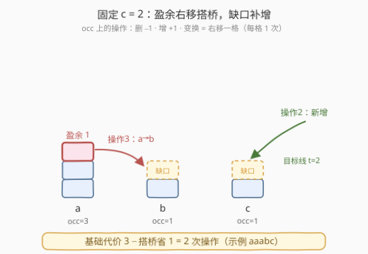
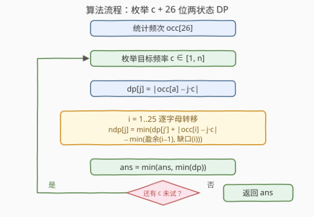

# 使字符频率相等的最少操作次数

- **题目名称**：使字符频率相等的最少操作次数
- **链接**：[3389. 使字符频率相等的最少操作次数](https://leetcode.cn/problems/minimum-operations-to-make-character-frequencies-equal/)
- **难度**：困难
- **标签**：哈希表、字符串、动态规划、计数、枚举
- **关联**：[1647. 字符频次唯一的最小删除次数](https://leetcode.cn/problems/minimum-deletions-to-make-character-frequencies-unique/)——同在 26 维频次数组上求最小操作数；本题多了「字母 +1 变换」带来的相邻耦合，需升级为线性 DP

---

## 1. 题目概述

给你一个字符串 `s`。若 `t` 中**每个出现的字符出现次数相等**，则称 `t` 为**好的**。你可以执行以下操作任意次：

1. 从 `s` 中删除一个字符；
2. 往 `s` 中添加一个字符；
3. 将 `s` 中一个字母变成字母表中**下一个**字母（`'z'` 不能变成 `'a'`）。

返回将 `s` 变好的最少操作次数。

**示例 1**：

```text
输入：s = "acab"
输出：1
解释：删掉一个 'a'，剩余 a:1, c:1, b:1，每个出现过的字符频次相等。
```

**示例 2**：

```text
输入：s = "wddw"
输出：0
解释：w:2, d:2，一开始就是好的。
```

**示例 3**：

```text
输入：s = "aaabc"
输出：2
解释：把一个 'a' 变成 'b'（a:2, b:2, c:1），再插入一个 'c'（a:2, b:2, c:2）。
```

**约束条件**：

- $1 \le s.length \le 2 \times 10^4$
- `s` 只包含小写英文字母。

> 💡 **读题关键**：① 字符在串中的**位置**对「好坏」毫无影响，三种操作也都不挑位置——真正有意义的只有 26 维**频次数组**，问题规模瞬间从 $2 \times 10^4$ 坍缩到 26；② 「好」的充要条件是存在公共频次 $c$，使每个 $\mathrm{occ}[x] \in \{0, c\}$——$c$ 是隐含参数，天然要枚举；③ 操作 3 只能把字母**变大**且一次一格，这个单向性决定了 DP 的转移方向。

---

## 2. 解题思路

### 2.1 暴力思路：在字符串上搜索

最朴素的想法是把 `s` 的所有 reachable 状态（计数数组）跑 BFS。但「添加」让状态空间无界，计数组合也是天文数字，彻底不可行。正确的打开方式是先做**建模坍缩**：

- 删除一个字符 $\iff \mathrm{occ}[x] - 1$（操作 1）
- 添加一个字符 $\iff \mathrm{occ}[x] + 1$（操作 2）
- 字母变成下一个 $\iff \mathrm{occ}[x] - 1$ 且 $\mathrm{occ}[x+1] + 1$（操作 3，`'z'` 没有下一个字母，无出边）

$s$ 是好的 $\iff$ 每个 $\mathrm{occ}[x] \in \{0, c\}$（某个 $c \ge 1$）。于是问题变成：**用最少的单位操作把 26 维计数数组整形成「取值只能为 0 或 $c$」的形状**。

### 2.2 核心观察：固定 c，代价 = 逐位调整 − 相邻搭桥



**第一步：枚举公共频次 $c \in [1, n]$**。频次不可能超过串长 $n$，逐一枚举后取最小即可。固定 $c$ 后，每个字母 $x$ 的目标 $t_x \in \{0, c\}$——这就是接下来要决策的量。

**第二步：不看操作 3 的基础代价**。若各字母独立调整到目标，盈余的删掉、缺口的补上，代价为 $\sum_x |\mathrm{occ}_x - t_x|$。

**第三步：操作 3 的本质是「相邻搭桥」，每搬 1 个字符净省 1**。两个关键观察：

> **观察 1（每个字符至多右移一格）**：把一个字符右移两格要花 2 次操作 3，与「原地删掉 + 目的地新增」的效果和代价**完全相同**（都是 2 次）。因此不妨假设每个被变换的字符只右移一格——搬运只发生在相邻字母对 $(x, x+1)$ 之间，永远不会「穿过」某个字母。

> **观察 2（盈余只能流向右邻的缺口）**：字母只能变大不能变小，盈余无法倒流。若 $x$ 有盈余 $s = \max(0, \mathrm{occ}_x - t_x)$、$x+1$ 有缺口 $d = \max(0, t_{x+1} - \mathrm{occ}_{x+1})$，则右移 $k$ 个字符的总代价为 $(s-k)$ 删 $+\ k$ 搬 $+\ (d-k)$ 增 $= s + d - k$，随 $k$ 线性下降——搬满 $k = \min(s, d)$，净省 $\min(s, d)$。若 $x$ 有缺口或 $x+1$ 无缺口，操作 3 无利可图（省 0）。

> 💡 **推论**：固定 $c$ 与目标 $t$ 后，最小操作数为
> $$\sum_{x} |\mathrm{occ}_x - t_x| \;-\; \sum_{x=0}^{24} \min\big(\text{盈余}_x,\ \text{缺口}_{x+1}\big)$$
> 两项盈余/缺口都非负，任意一边为 0 时节省自动归零，无需特判。

**第四步：沿 26 个字母做线性 DP**。节省项只依赖**相邻两个字母**的目标，无后效性——令 $dp_i(j)$ 表示处理完前 $i$ 个字母、第 $i$ 个字母目标为 $j \cdot c$（$j \in \{0,1\}$）时的最小代价：

$$
dp_i(j) = \min_{j' \in \{0,1\}} \Big( dp_{i-1}(j') + \big|\mathrm{occ}_i - j \cdot c\big| - \min\big(\text{盈余}_{i-1}(j'),\ \text{缺口}_i(j)\big) \Big)
$$

边界 $dp_0(j) = |\mathrm{occ}_0 - j \cdot c|$，固定 $c$ 的答案为 $\min_j dp_{25}(j)$。

> ⚠️ **不必考虑把串删成空串**：删空要 $n$ 次操作；而 $c = 1$（每个出现过的字母各留一个、多余删掉）只需 $n - D$ 次（$D \ge 1$ 为不同字母数），必然更省，空串永远不会是最优解。

### 2.3 算法流程图



1. 统计频次 $\mathrm{occ}[26]$；
2. 枚举公共频次 $c \in [1, n]$；
3. 沿 `a`→`z` 扫描做两状态 DP，转移时扣掉相邻搭桥节省 $\min(\text{盈余}, \text{缺口})$；
4. 每个 $c$ 结束后用 $\min(dp)$ 更新全局答案；
5. 所有 $c$ 试完，返回答案。

### 2.4 示例演算

对 `s = "aaabc"`：$\mathrm{occ} = [3, 1, 1, 0, \dots]$。取 $c = 2$、目标 $t = [2, 2, 2, 0, \dots]$：

- 基础代价 $|3-2| + |1-2| + |1-2| = 3$；
- 相邻对 (a, b)：盈余$_a = 1$、缺口$_b = 1$ → 搭桥省 $\min(1,1) = 1$；
- 相邻对 (b, c)：盈余$_b = 0$ → 省 0；
- 总代价 $3 - 1 = \mathbf{2}$ ✓，对应官方解释「一个 a 变 b（搭桥）+ 补一个 c」。

顺带一提，$c = 1$（删两个 `a` 得 `abc`）与 $c = 3$（删 `b`、`c` 得 `aaa`）同样得到 2——多条路线并列最优，取 min 不受影响。

示例 1 `"acab"`：$\mathrm{occ} = [2,1,0,1]$，$c = 1$、$t = [1,1,0,1]$：基础代价 1；a 有盈余 1 但右邻 b 无缺口（$\mathrm{occ}_b = t_b = 1$），省 0，答案 **1** ✓。

示例 2 `"wddw"`：$\mathrm{occ}_w = \mathrm{occ}_d = 2$，$c = 2$ 时全部达标，答案 **0** ✓。

---

## 3. 参考代码

### C++

```cpp
class Solution {
  public:
    int makeStringGood(string s) {
        int occ[26] = {0};
        for (char ch : s) ++occ[ch - 'a'];
        int n = s.size();
        const int INF = 1e9;
        int ans = INF;
        // 枚举公共频次 c
        for (int c = 1; c <= n; ++c) {
            // dp[j]：处理完当前字母、其目标为 j*c 的最小代价
            int dp[2] = {abs(occ[0]), abs(occ[0] - c)};
            for (int i = 1; i < 26; ++i) {
                int ndp[2] = {INF, INF};
                for (int j = 0; j < 2; ++j) {
                    int ti = j ? c : 0;                      // 当前字母目标
                    int ci = abs(occ[i] - ti);               // 逐位调整代价
                    int gap = max(0, ti - occ[i]);           // 当前字母缺口
                    for (int jp = 0; jp < 2; ++jp) {
                        int tp = jp ? c : 0;
                        int sup = max(0, occ[i - 1] - tp);   // 前一字母盈余
                        // 相邻搭桥：盈余流向缺口，每个字符省 1
                        ndp[j] = min(ndp[j], dp[jp] + ci - min(sup, gap));
                    }
                }
                dp[0] = ndp[0];
                dp[1] = ndp[1];
            }
            ans = min(ans, min(dp[0], dp[1]));
        }
        return ans;
    }
};
```

### Python

```python
import numpy as np

class Solution:
    def makeStringGood(self, s: str) -> int:
        occ = np.zeros(26, dtype=np.int64)
        for ch in s:
            occ[ord(ch) - 97] += 1
        n = len(s)
        # 把「枚举 c」变成 numpy 的一个轴：c = 1..n 整列并行
        c = np.arange(1, n + 1, dtype=np.int64)
        tgt = np.stack([np.zeros_like(c), c])            # 两种目标：0 或 c
        dp = np.abs(occ[0] - tgt)                        # 字母 a 初始化
        for i in range(1, 26):
            ci = np.abs(occ[i] - tgt)                    # 本位调整代价
            gap = np.maximum(0, tgt - occ[i])            # 本位缺口
            sup = np.maximum(0, occ[i - 1] - tgt)        # 前位盈余
            save = np.minimum(sup[None, :, :], gap[:, None, :])  # save[j][j'] 搭桥节省
            dp = (dp[None, :, :] + ci[:, None, :] - save).min(axis=1)
        return int(dp.min())
```

> 💡 Python 版说明：$n = 2 \times 10^4$ 时按 $c$ 逐个跑 $26 \times 4$ 个转移约 200 万次纯 Python 循环，常数偏大；把 $c$ 做成 numpy 的一个轴后只剩 26 轮整列向量化运算，实测约 0.02 s。C++ 版按上面朴素写法即可毫秒级通过。

---

## 4. 复杂度分析

| 维度 | 复杂度 | 说明 |
|------|--------|------|
| **时间复杂度** | $O(26 \cdot n)$ | 外层枚举 $c$ 共 $n$ 个取值，内层 26 个字母、每个 4 个转移；$n = 2 \times 10^4$ 时约 200 万次转移，C++ 毫秒级 |
| **空间复杂度** | $O(1)$ | 仅需 26 个计数与 4 个 DP 状态（numpy 版为 $O(n)$ 的向量化缓冲） |

---

## 5. 扩展：两个观察的交换论证

**观察 1（至多移一格）**：若某个字符被连移两格 $x \to x{+}1 \to x{+}2$，花 2 次操作；改为「在 $x$ 删除、在 $x+2$ 新增」，效果与代价不变。若还有流量「穿过」字母（$x \to x{+}1$ 与 $x{+}1 \to x{+}2$ 同时有搬运），把穿过的那部分流量同时削减 $\delta$：两条边省 $2\delta$ 次操作，$x$ 侧多删 $\delta$ 个、$x+2$ 侧多增 $\delta$ 个，恰好打平——所以总存在一个**无穿过、每个变换字符只走一格**的最优方案。

**观察 2（搬满 $\min(\text{盈余}, \text{缺口})$）**：搬运量 $k$ 的代价 $= \text{盈余} + \text{缺口} - k$ 单调下降，故搬满。$k$ 超过盈余意味着「先增再搬」——每字符 2 次，不如右邻直接增 1 次；超过缺口意味着「搬过去再删」——每字符 2 次，不如原地删 1 次。两者都在交换论证下被剔除。

> 💡 **变体思考**：若题目允许字母**双向**变换（也能变小），盈余便可左右两向流动，相邻耦合变成双向——线性 DP 不再够用，需按「节点 = 字母、边 = 相邻搬运、源汇 = 增删」建图跑**最小费用流**。本题的单向性正是能用简单 DP 的根本原因。

---

## 6. 面试要点

1. **为什么字符串可以坍缩成 26 维频次数组？**

   - 「好坏」只看出字符的频次集合，与位置无关；三种操作（删/增/变换）同样不挑位置，只改变频次。于是 $2 \times 10^4$ 的串变成 26 个整数，操作变成频次上的单位加减与右移。

2. **为什么要枚举 $c$？上限为什么是 $n$？**

   - 「好」由某个公共频次 $c$ 定义，$c$ 是最优解的隐含参数；不确定参数就枚举。频次不可能超过串长，故 $c \in [1, n]$，总代价 $O(26n)$ 完全可承受。

3. **操作 3 什么时候才值得用？**

   - 仅当左邻字母有盈余、当前字母有缺口：搬 1 个字符花 1 次，替代「删 + 增」共 2 次，净省 1；且每个字符至多搬一格——搬两格与「删 + 增」代价相同，可以不出现。

4. **DP 的状态为什么只需记录上一位目标是 0 还是 $c$？**

   - 相邻耦合只通过搭桥节省 $\min(\text{盈余}, \text{缺口})$ 一项体现，而它只依赖相邻两位的目标取值与 $\mathrm{occ}$，与更早的决策无关——满足无后效性，两状态线性 DP 足矣。

5. **为什么不用考虑把串删成空串？**

   - 删空代价恰为 $n$；而 $c = 1$（每个出现过的字母各留一个）代价 $n - D$（$D \ge 1$ 为不同字母数），严格更省，空串永不最优。

> 💡 **一句话总结**：频次坍缩到 26 维 → 枚举公共频次 $c$ → 逐位代价 $\sum|\mathrm{occ}_x - t_x|$ 减去相邻「盈余→缺口」搭桥节省 $\min(\text{盈余}, \text{缺口})$ → 26 位两状态线性 DP，$O(26n)$ 收工。

---

## 7. 同类练习题

- [1647. 字符频次唯一的最小删除次数](https://leetcode.cn/problems/minimum-deletions-to-make-character-frequencies-unique/)（[题解](../1601-1700/1647_字符频次唯一的最小删除次数.md)）：同样把字符串坍缩成 26 维频次数组再最小化操作数，先练频次建模
- [2448. 使数组相等的最小开销](https://leetcode.cn/problems/minimum-cost-to-make-array-equal/)（[题解](../2401-2500/2448_使数组相等的最小开销.md)）：枚举目标值再快速计算总代价，与本题枚举 $c$ 同款套路
- [2602. 使数组元素全部相等的最少操作数](https://leetcode.cn/problems/minimum-operations-to-make-all-array-elements-equal/)：枚举目标 + 前缀和统计「加一减一」操作数，相当于本题只有操作 1/2 的单价版本
- [940. 不同的子序列 II](https://leetcode.cn/problems/distinct-subsequences-ii/)（[题解](../0901-1000/940_不同的子序列II.md)）：以 26 个字母为阶段的线性 DP，体会「26 个字母当 DP 维度」的常见姿势
