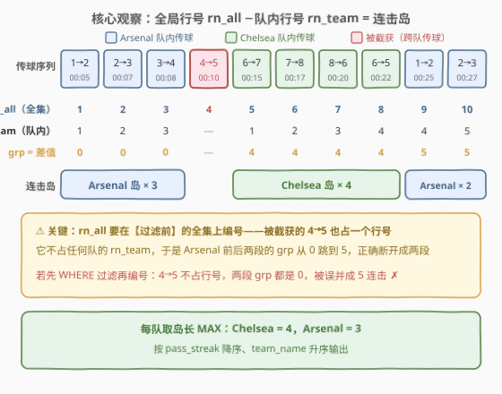
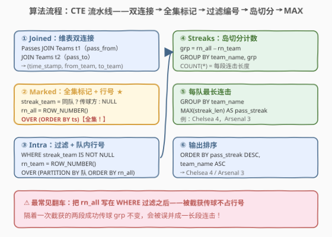

# 最长团队传球连击

- **题目名称**：最长团队传球连击
- **链接**：[3390. 最长团队传球连击 🔒](https://leetcode.cn/problems/longest-team-pass-streak/)
- **难度**：困难
- **标签**：数据库、SQL、gaps-and-islands、窗口函数、`ROW_NUMBER`、`LAG`、CTE、LeetCode 锁题
- **关联**：[3384. 球队传球成功的优势得分](https://leetcode.cn/problems/team-dominance-by-pass-success/)（[站内题解](3384_球队传球成功的优势得分.md)）——同一套「足球传球」表结构的姊妹篇：3384 逐行打分求和，本题升级为全局时间轴上的**连续段追踪**；[2173. 最多连胜的次数](https://leetcode.cn/problems/longest-winning-streak/)（[站内题解](../2101-2200/2173_最多连胜的次数.md)）是本题的「分区内部版」母题

## 1. 题目概述

> ⚠️ 本题为 LeetCode 付费题（Plus 会员专享），官方题面不可免费查看。本文题意根据**官方示例用例的表结构与输入数据**（与 3384 完全同源的 `Teams`/`Passes` 表）+ 姊妹题 3384 的题面惯例重建，输出列名与排序规则为最自然的工程解读，可能与官方题面有出入。核心 SQL 套路（gaps-and-islands 连续段切分）不受题面细节影响。

**表结构**：`Teams`

| 列名 | 类型 |
|------|------|
| player_id | int |
| team_name | varchar |

- `player_id` 是这张表的唯一主键。
- 每一行包含队员的唯一标识以及该场比赛中参赛的某支队伍的名称。

**表结构**：`Passes`

| 列名 | 类型 |
|------|------|
| pass_from | int |
| time_stamp | varchar |
| pass_to | int |

- `(pass_from, time_stamp)` 是这张表的主键。
- `pass_from` 是指向 `Teams` 表 `player_id` 字段的外键。
- 每一行代表比赛期间的一次传球，`time_stamp` 表示传球发生的分钟时间（`00:00`-`90:00`），`pass_to` 表示接球队员的 `player_id`。

**目标**：把全部传球按 `time_stamp` 升序排列在**同一条比赛时间轴**上，规则如下：

- 一次传球若 `pass_from` 与 `pass_to` 属于**同一支球队**，则是一次**成功传球**，记在传球发起方球队的账上；
- 否则是**被截获**的传球（球权交给对方），不属于任何球队的连击；
- 一支球队的**传球连击**（pass streak）是一段**时间上连续**的、同属该队的成功传球；被截获的传球或**其他任何球队**的传球都会打断连击；
- 求每支球队的最长传球连击长度，返回 `team_name` 与 `pass_streak`，按 `pass_streak` **降序**、`team_name` **升序**排列。

**示例 1**（官方用例）：

```text
输入：
Teams 表：
+------------+-----------+
| player_id  | team_name |
+------------+-----------+
| 1          | Arsenal   |
| 2          | Arsenal   |
| 3          | Arsenal   |
| 4          | Arsenal   |
| 5          | Chelsea   |
| 6          | Chelsea   |
| 7          | Chelsea   |
| 8          | Chelsea   |
+------------+-----------+

Passes 表：
+-----------+------------+---------+
| pass_from | time_stamp | pass_to |
+-----------+------------+---------+
| 1         | 00:05      | 2       |
| 2         | 00:07      | 3       |
| 3         | 00:08      | 4       |
| 4         | 00:10      | 5       |
| 6         | 00:15      | 7       |
| 7         | 00:17      | 8       |
| 8         | 00:20      | 6       |
| 6         | 00:22      | 5       |
| 1         | 00:25      | 2       |
| 2         | 00:27      | 3       |
+-----------+------------+---------+

输出：
+-----------+-------------+
| team_name | pass_streak |
+-----------+-------------+
| Chelsea   | 4           |
| Arsenal   | 3           |
+-----------+-------------+
```

**解释**：

- `00:05`-`00:08`：阿森纳连续 3 脚队内传递（$1 \to 2 \to 3 \to 4$）；
- `00:10`：球员 4 把球传给切尔西球员 5，**被截获**，阿森纳连击中断；
- `00:15`-`00:22`：切尔西连续 4 脚队内传递（$6 \to 7 \to 8 \to 6 \to 5$）；
- `00:25`-`00:27`：阿森纳又连续 2 脚（$1 \to 2 \to 3$），最长连击仍为 3。

**约束条件**（重建假设已在开头声明）：

- `time_stamp` 为 `HH:MM` 格式的两位零填充字符串，字典序即时间序；
- `(pass_from, time_stamp)` 是 `Passes` 的主键，`pass_from` / `pass_to` 均指向 `Teams` 中的有效队员；
- 输出列为 `team_name`、`pass_streak`，按 `pass_streak` 降序、`team_name` 升序。

> 💡 **审题关键**：① **全局时间轴**——「连续」是全场比赛传球流水上的连续，不是各队各自传球序列里的连续，这是本题与 2173 的本质差异（也是难度所在）；② **被截获传球不属于任何队**——它既打断传球方的连击，也不给接球方计数；③ **连击记在传球方账上**，与 3384 的记分方向一致；④ 分组键必须带 `team_name`，不同球队可能撞出相同的差值。

---

## 2. 解题思路

### 2.1 暴力思路：时间轴扫描计数器

最直觉的过程式解法：把全部传球按时间排序后逐行扫描，维护计数器 `cur`——本行是「某队的成功传球」且上一行恰好是「该队的成功传球」则 `cur += 1`，否则从 1 重新起算；同时 `best[队] = max(best[队], cur)`。伪代码：

```text
rows = Passes.sort('time_stamp')          # 全部传球，含被截获的
cur, cur_team = 0, None
for row in rows:
    if team(row.from) == team(row.to):    # 成功传球
        if cur_team == team(row.from): cur += 1
        else: cur, cur_team = 1, team(row.from)
        best[cur_team] = max(best[cur_team], cur)
    else:                                 # 被截获：打断一切
        cur, cur_team = 0, None
```

但 SQL 没有显式循环与可变状态——「前一行是谁决定了本行计不计数」必须换成**集合式表达**：给「连续段」打上同一个分组键，再 `GROUP BY + COUNT` 一次聚合。这正是 **gaps-and-islands（裂隙与孤岛）** 的招牌场景，与 [2173. 最多连胜的次数](../2101-2200/2173_最多连胜的次数.md)同族——但本题多了一层「多支球队共享同一条时间轴」的纠缠。

### 2.2 核心观察：全局行号 − 队内行号 = 连击岛



给每条传球算两个行号——

- `rn_all`：**全集**（成功 + 被截获的所有传球）按时间排序的行号，每行 +1，与球队无关；
- `rn_team`：**本队成功传球**在球队分区内按时间的行号，换段即重置。

二者之差 `grp = rn_all − rn_team` 有一个绝妙性质：

- **同一支球队时间上连续的成功传球**：`rn_all` 与 `rn_team` 同步各 +1 → 差值**不变**（同属一个岛）；
- **中间隔着任何其他传球**（被截获传球或对方球队的传球）：`rn_all` 照常 +1 甚至 +k，而 `rn_team` 只 +1 → 差值**跳变**（新岛）。

于是 `grp` 天然成为「连击段」的分组键：`WHERE` 过滤出成功传球后，按 `(team_name, grp)` 分组 `COUNT(*)` 即得每段连击长度，再 `MAX` 取每队最长。

把题意逐条翻译成 SQL 机制：

| 题意要求 | SQL 机制 | 语义 |
|----------|----------|------|
| 「传球双方各属哪支队」 | `JOIN Teams t1 / t2` 各一次 | 维表双连接，翻译 `pass_from` / `pass_to`（与 3384 同款） |
| 「成功传球（同队）」 | `CASE WHEN from_team = to_team THEN from_team END` | 成功 → 记传球方队名；被截获 → `NULL` |
| 「全局时间轴上连续」 | `ROW_NUMBER() OVER (ORDER BY time_stamp)` 在**全集**上编号 | 被截获传球也占一个行号，守住「连续」语义 |
| 「本队成功传球序号」 | `ROW_NUMBER() OVER (PARTITION BY 队 ORDER BY rn_all)` | 过滤后队内递增，换段重置 |
| 「连击段」 | `GROUP BY team_name, rn_all - rn_team` | 差值相同的连续行为一岛 |
| 「连击长度」 | `COUNT(*)` | 岛内行数 |
| 「每队最长」 | `MAX(streak_len)` 再按队分组 | 岛长取最大 |
| 「降序输出」 | `ORDER BY pass_streak DESC, team_name` | 输出排序 |

> ⚠️ **本题最大的坑：`rn_all` 必须在 `WHERE` 过滤之前、对全集编号**。反例数据（试金石）：
>
> | time_stamp | 传球 | 性质 |
> |------------|------|------|
> | 00:01 | 1→2 | A 队成功 |
> | 00:02 | 2→3 | A 队传球被 B 截获 |
> | 00:03 | 1→2 | A 队成功 |
>
> 正确答案是 A 队最长连击 **1**（中间那次截获把球权交了出去）。若先把被截获的行 `WHERE` 掉、再在剩下的成功传球上算 `rn_all`，则两脚成功传球行号相邻（1、2），`rn_team` 也相邻（1、2），差值同为 0——**被误并成 2 连击**。直觉上：被截获的传球必须「占坑」，把前后两段成功传球在行号空间里撑开。这也是 2.1 伪代码里「被截获 → 清零计数器」的集合式对应物。

> ⚠️ **分组键别只写 `grp`**：不同球队完全可能撞出相同差值（示例里 Arsenal 的岛键是 0/5，Chelsea 是 4，一般情形下两队可以同为 0）。`GROUP BY team_name, grp` 两列缺一不可，否则甲队的岛和乙队的岛会被并成一组。

### 2.3 算法流程图



**逻辑执行步骤**（用一串 CTE 串联）：

| 步骤 | CTE | 作用 |
|------|-----|------|
| ① | `Joined` | `Passes` 连接 `Teams` 两个副本，补全 `(time_stamp, from_team, to_team)` |
| ② | `Marked` | 全集上标记成功传球（成功 → 队名，被截获 → `NULL`）+ 算全局行号 `rn_all` |
| ③ | `Intra` | `WHERE streak_team IS NOT NULL` 过滤，再算队内行号 `rn_team` |
| ④ | `Streaks` | `GROUP BY team_name, rn_all − rn_team` + `COUNT(*)` → 每段连击长度 |
| ⑤ | 外层 | `GROUP BY team_name` + `MAX(streak_len)` → 每队最长连击 |
| ⑥ | `ORDER BY` | 按 `pass_streak` 降序、`team_name` 升序输出 |

> 💡 **为什么窗口排序加 `pass_from` 作 tiebreaker**：`(pass_from, time_stamp)` 是主键，因此 `(time_stamp, pass_from)` 恰好构成全序——即使两人在同一 `time_stamp` 各传一球（物理上不该发生，但防住脏数据），行号也唯一确定，不会因数据库实现不同而漂移。生产代码里给窗口排序加确定性 tiebreaker 是标配（与 [2793. 航班机票状态](../2701-2800/2793_航班机票状态.md)同款经验）。

### 2.4 示例演算

对示例 1 的 10 条传球逐步走完 ①-④（`rn_team` 只对成功传球编号，被截获行不参与）：

| # | time_stamp | 传球 | 发起方 | 接收方 | 成功? | rn_all | rn_team | grp |
|---|------------|------|--------|--------|-------|--------|---------|-----|
| 1 | 00:05 | 1→2 | Arsenal | Arsenal | ✓ | 1 | 1 | **0** |
| 2 | 00:07 | 2→3 | Arsenal | Arsenal | ✓ | 2 | 2 | **0** |
| 3 | 00:08 | 3→4 | Arsenal | Arsenal | ✓ | 3 | 3 | **0** |
| 4 | 00:10 | 4→5 | Arsenal | Chelsea | ✗ 截获 | 4 | — | — |
| 5 | 00:15 | 6→7 | Chelsea | Chelsea | ✓ | 5 | 1 | **4** |
| 6 | 00:17 | 7→8 | Chelsea | Chelsea | ✓ | 6 | 2 | **4** |
| 7 | 00:20 | 8→6 | Chelsea | Chelsea | ✓ | 7 | 3 | **4** |
| 8 | 00:22 | 6→5 | Chelsea | Chelsea | ✓ | 8 | 4 | **4** |
| 9 | 00:25 | 1→2 | Arsenal | Arsenal | ✓ | 9 | 4 | **5** |
| 10 | 00:27 | 2→3 | Arsenal | Arsenal | ✓ | 10 | 5 | **5** |

第 ④ 步按 `(team_name, grp)` 分组计数：

| 分组（岛） | 组内行 | COUNT = 连击长度 |
|------------|--------|------------------|
| (Arsenal, 0) | #1 #2 #3 | **3** |
| (Chelsea, 4) | #5 #6 #7 #8 | **4** |
| (Arsenal, 5) | #9 #10 | **2** |

第 ⑤⑥ 步每队取 `MAX` 后按降序输出：`Chelsea = 4`、`Arsenal = 3`，与预期一致。

> 💡 **观察 Arsenal 前后两段的 grp**：从 #3 到 #9，`rn_all` 前进了 6（被 #4 截获 + #5-#8 切尔西 4 脚共 5 行占坑），而 `rn_team` 只前进 1——差值从 0 跳到 5，正是这 5 个「坑位」把两段连击在行号空间里撑开。若 #5-#8 不是切尔西的传球而是 4 次截获，撑开效果完全相同：**打断连击的从来不只是「本队传球失败」，而是全局时间轴上的任何其他行**。

---

## 3. 参考代码

### MySQL（解法 A：双行号差值，gaps-and-islands，推荐）

```sql
# Write your MySQL query statement below
WITH Joined AS (
    SELECT p.time_stamp,
           p.pass_from,
           tf.team_name AS from_team,
           tt.team_name AS to_team
    FROM Passes p
    JOIN Teams tf ON p.pass_from = tf.player_id
    JOIN Teams tt ON p.pass_to   = tt.player_id
),
Marked AS (
    SELECT time_stamp,
           CASE WHEN from_team = to_team THEN from_team END AS streak_team,
           ROW_NUMBER() OVER (ORDER BY time_stamp, pass_from) AS rn_all
    FROM Joined
),
Intra AS (
    SELECT streak_team AS team_name,
           rn_all,
           ROW_NUMBER() OVER (PARTITION BY streak_team ORDER BY rn_all) AS rn_team
    FROM Marked
    WHERE streak_team IS NOT NULL
),
Streaks AS (
    SELECT team_name, COUNT(*) AS streak_len
    FROM Intra
    GROUP BY team_name, rn_all - rn_team
)
SELECT team_name, MAX(streak_len) AS pass_streak
FROM Streaks
GROUP BY team_name
ORDER BY pass_streak DESC, team_name;
```

> 💡 **写法要点**：
> - **`Marked` 不过滤**：`rn_all` 在含被截获传球的全集上编号，这是正确性的命门（见 2.2 反例）；被截获行以 `streak_team = NULL` 的形式留在集合里「占坑」。
> - **过滤与队内编号一起做**：`Intra` 里 `WHERE streak_team IS NOT NULL` 后紧接着算 `rn_team`，此时分区里只剩本队成功传球，行号自然连续。
> - **`CASE WHEN ... THEN from_team END`**：省略 `ELSE` 默认给 `NULL`，被截获传球一支队都不归属，简洁且语义准确。
> - **`GROUP BY team_name, rn_all - rn_team`**：分组键带队名 + 差值表达式，两列缺一不可。

### MySQL（解法 B：`LAG` 边界标记 + 累计和）

```sql
# Write your MySQL query statement below
WITH Joined AS (
    SELECT p.time_stamp,
           p.pass_from,
           tf.team_name AS from_team,
           tt.team_name AS to_team
    FROM Passes p
    JOIN Teams tf ON p.pass_from = tf.player_id
    JOIN Teams tt ON p.pass_to   = tt.player_id
),
Marked AS (
    SELECT time_stamp, from_team,
           CASE WHEN from_team = to_team THEN 1 ELSE 0 END AS ok,
           ROW_NUMBER() OVER (ORDER BY time_stamp, pass_from) AS rn
    FROM Joined
),
Flagged AS (
    SELECT from_team, rn, ok,
           CASE WHEN ok = 1 AND (
                    LAG(ok)        OVER (ORDER BY rn) IS NULL
                 OR LAG(ok)        OVER (ORDER BY rn) = 0
                 OR LAG(from_team) OVER (ORDER BY rn) <> from_team
                ) THEN 1 ELSE 0 END AS is_start
    FROM Marked
),
Grouped AS (
    SELECT from_team AS team_name,
           SUM(is_start) OVER (ORDER BY rn) AS streak_id,
           ok
    FROM Flagged
),
Streaks AS (
    SELECT team_name, COUNT(*) AS streak_len
    FROM Grouped
    WHERE ok = 1
    GROUP BY team_name, streak_id
)
SELECT team_name, MAX(streak_len) AS pass_streak
FROM Streaks
GROUP BY team_name
ORDER BY pass_streak DESC, team_name;
```

> 💡 **解法 B 的思路**：换一种更「过程式直觉」的打键法——
> - `LAG(ok)` / `LAG(from_team)` 取时间轴上的**前一行**（全集中的前一行，天然包含被截获传球）；
> - `is_start = 1` 当且仅当「本行是某队的成功传球，且前一行**不是该队的成功传球**」——三种情形：全场第一传（`LAG` 为 `NULL`）、前一传被截获（`ok = 0`）、前一传是别队的成功传球（队名不同）；
> - `SUM(is_start) OVER (ORDER BY rn)` 累计求和产出单调递增的 `streak_id`：同一段连击内不变，段与段之间 +1。
>
> 它把 2.1 伪代码的「扫描 + 计数器」直接翻译成了窗口函数，边界条件全部显式写在 `CASE` 里；解法 A 则靠行号算术「无中生有」出分组键。两版对示例 1 与 2.2 反例数据均验证一致。

### Python（pandas）

```python
import pandas as pd


def find_longest_team_pass_streak(teams: pd.DataFrame, passes: pd.DataFrame) -> pd.DataFrame:
    df = (
        passes.merge(teams, left_on="pass_from", right_on="player_id")
              .merge(teams, left_on="pass_to", right_on="player_id", suffixes=("_from", "_to"))
              .sort_values(["time_stamp", "pass_from"])
              .reset_index(drop=True)
    )
    df["ok"] = df["team_name_from"] == df["team_name_to"]
    prev_ok = df["ok"].shift(1)
    prev_team = df["team_name_from"].shift(1)
    # 新连击的起点：本行成功，且前一行不是「本队的成功传球」（首行 shift 为 NaN，同样算起点）
    df["is_start"] = (df["ok"] & ~(prev_ok & (prev_team == df["team_name_from"]))).astype(int)
    df["streak_id"] = df["is_start"].cumsum()
    streaks = (
        df[df["ok"]]
        .groupby(["team_name_from", "streak_id"])
        .size()
        .reset_index(name="streak_len")
    )
    result = (
        streaks.groupby("team_name_from", as_index=False)["streak_len"]
               .max()
               .rename(columns={"team_name_from": "team_name", "streak_len": "pass_streak"})
    )
    return (
        result.sort_values(["pass_streak", "team_name"], ascending=[False, True])
              .reset_index(drop=True)
    )
```

> 💡 **pandas 对照**：对应解法 B 的「边界标记 + 累计和」。两次 `merge` 即 SQL 的双连接；`shift(1)` 即 `LAG`（注意 `cumsum()` 在**全量行**上做，被截获行 `is_start = 0` 不加值但保留坑位，与 SQL 版「全集编号」同理）；`groupby(...).size()` 即 `COUNT(*)`。函数签名按 LeetCode Pandas 模板惯例命名（付费题模板不可见），提交时以实际模板为准。

---

## 4. 复杂度分析

| 维度 | 复杂度 | 说明 |
|------|--------|------|
| **时间复杂度** | $O(m \log m)$ | $m$ 为 `Passes` 行数、$n$ 为 `Teams` 行数：两个等值连接走哈希连接 $O(m + n)$，窗口函数按 `(time_stamp, pass_from)` 排序 $O(m \log m)$ 占主导，岛切分与两级聚合线性，输出排序仅 $O(t \log t)$（$t$ 为球队数，远小于 $m$） |
| **空间复杂度** | $O(m)$ | CTE 物化每条传球的 `(time_stamp, from_team, to_team)` 及行号列；`Streaks` 中间结果行数不超过成功传球数 |
| **解法 B 对照** | $O(m \log m)$ / $O(m)$ | 多一轮 `LAG` 窗口（仍同一次排序），累计和线性；与解法 A 渐近相同，仅 CTE 层数多两层 |

> - 若 `Passes` 上有 `(time_stamp)` 索引，排序可近似降为索引有序扫描 $O(m)$；判题环境数据量小，无感知差异。
> - 2.1 的应用层扫描版复杂度同为 $O(m \log m)$，但它把 $m$ 行数据搬出数据库再逐行循环——网络与序列化开销远大于计算本身，且「连续段」逻辑散落在业务代码里难以复用。

---

## 5. 扩展

### 5.1 「先过滤后编号」陷阱复现

把解法 A 的 CTE 顺序稍作「优化」——先过滤再编号，就是最经典的错误版：

```sql
-- ✗ 错误版：rn_all 只在成功传球上编号
Filtered AS (
    SELECT from_team AS team_name,
           ROW_NUMBER() OVER (ORDER BY time_stamp) AS rn_all   -- 此时全集已被 WHERE 砍掉！
    FROM Joined
    WHERE from_team = to_team
),
Intra AS (
    SELECT team_name, rn_all,
           ROW_NUMBER() OVER (PARTITION BY team_name ORDER BY rn_all) AS rn_team
    FROM Filtered
),
Streaks AS (
    SELECT team_name, COUNT(*) AS streak_len
    FROM Intra
    GROUP BY team_name, rn_all - rn_team
)
SELECT team_name, MAX(streak_len) AS pass_streak
FROM Streaks
GROUP BY team_name
ORDER BY pass_streak DESC, team_name;
```

在 2.2 的试金石数据（A 成功 → A 被截 → A 成功）上：正确版输出 `A = 1`，错误版输出 `A = 2`——被截获的那行不占行号，两段成功传球行号相邻、差值相同，被误并成一岛。**示例 1 恰好暴露不出这个 bug**：Arsenal 两段之间隔着切尔西的 4 脚成功传球，即便错误版也会因 `rn_all` 被对方传球撑开而正确断岛（这也是它危险的原因——示例全对，构造数据才翻车）。Gaps-and-islands 的行号差值法有一条铁律：**「全局行号」必须在你想识别连续性的那个全集上编号**。

### 5.2 变体：无成功传球的球队补 0

`GROUP BY` 只折叠出现过的行——某队若从未完成过一次成功传球，它不会出现在 `Streaks` 里。若题目变体要求「每支出现在 `Teams` 中的球队都输出、无连击记 0」（2173 的官方要求正是如此），用骨架左连接补值：

```sql
WITH Joined AS (
    SELECT p.time_stamp, p.pass_from,
           tf.team_name AS from_team, tt.team_name AS to_team
    FROM Passes p
    JOIN Teams tf ON p.pass_from = tf.player_id
    JOIN Teams tt ON p.pass_to   = tt.player_id
),
Marked AS (
    SELECT CASE WHEN from_team = to_team THEN from_team END AS streak_team,
           ROW_NUMBER() OVER (ORDER BY time_stamp, pass_from) AS rn_all
    FROM Joined
),
Intra AS (
    SELECT streak_team AS team_name, rn_all,
           ROW_NUMBER() OVER (PARTITION BY streak_team ORDER BY rn_all) AS rn_team
    FROM Marked
    WHERE streak_team IS NOT NULL
),
Streaks AS (
    SELECT team_name, COUNT(*) AS streak_len
    FROM Intra
    GROUP BY team_name, rn_all - rn_team
),
MaxStreak AS (
    SELECT team_name, MAX(streak_len) AS pass_streak
    FROM Streaks
    GROUP BY team_name
)
SELECT t.team_name, COALESCE(m.pass_streak, 0) AS pass_streak
FROM (SELECT DISTINCT team_name FROM Teams) t
LEFT JOIN MaxStreak m ON t.team_name = m.team_name
ORDER BY pass_streak DESC, t.team_name;
```

与 2173 的 `LEFT JOIN` 全体球员 + `COALESCE(..., 0)` 完全同构——「聚合缺席的组」与「显式补零」的语义辨析见 [2173 题解 5.3](../2101-2200/2173_最多连胜的次数.md)。

### 5.3 若「连续」定义在球队自身序列里：退化为 2173

本题把「连续」钉在**全局时间轴**上（对方持球也打断本队连击），这才是足球语义里「连续传球不丢球权」的准确刻画，也是本题比 2173 难一档的原因。若官方把定义放宽为「球队**自身传球序列**内的连续成功传球」（忽视对方持球时段），则 2173 的模板原样套用——`PARTITION BY team_name` 换掉 `PARTITION BY player_id`、`result = 'Win'` 换成「成功传球」即可：

```sql
-- 球队自身序列版：rn 在「该队全部传球（含被截获）」上编号
ROW_NUMBER() OVER (PARTITION BY from_team ORDER BY time_stamp)              AS rn,
ROW_NUMBER() OVER (PARTITION BY from_team, ok ORDER BY time_stamp)         AS ok_rn
-- 过滤 ok = 1 后 GROUP BY from_team, rn - ok_rn
```

注意即便这一版，`rn` 也要覆盖该队**含被截获在内的全部传球**——「先过滤后编号」的坑在哪个定义下都在（被截获传球是本队序列内的显式断点）。两个定义的判别数据：A 成功 → B 成功 → A 成功，全局版 A 最长 1，自身序列版 A 最长 2。

---

## 6. 面试要点

1. **为什么 `rn_all − rn_team` 能识别连击段？**

   > `rn_all` 在含被截获传球的全集上按时间递增，每行 +1；`rn_team` 只在本队成功传球分区内递增。同一段连击内两者同步各 +1，差值不变；一旦中间隔了任何其他行（截获或对方传球），`rn_all` 多走而 `rn_team` 只走本队成功行数，差值跳变。差值是「时间上连续的同队成功传球段」的天然分组键。

2. **`rn_all` 为什么必须在 `WHERE` 之前算？先过滤会怎样？**

   > 「连续」是全集时间轴上的连续，被截获传球虽然不计数，但必须**占坑**——它撑开了前后两段成功传球在行号空间里的距离。先过滤再编号时，隔着一次截获的两段成功传球行号相邻、差值相同，会被误并成一长段。试金石数据：A 成功 → A 被截 → A 成功，正确 1、错误版 2。示例数据常常暴露不出这个 bug（对方的传球也在撑坑位），构造数据验证才算过关。

3. **分组键为什么必须带 `team_name`？**

   > 差值 `grp` 只在同一球队的序列内部才有「段编号」意义，不同球队完全可以撞出相同差值（比如都是 0）。`GROUP BY team_name, grp` 把岛限定在「某队的一段」；只按 `grp` 分组会把甲乙两队的岛误并，计数直接爆炸。

4. **`LAG` 边界标记法与行号差值法怎么选？**

   > 两者都给连续段打同一个分组键：差值法靠两个 `ROW_NUMBER` 相减「无中生有」，简洁但需要想通算术原理；`LAG` 法把「新段起点」的边界条件（前一行不是本队成功传球）显式写进 `CASE`，可读性更接近过程式直觉，且边界条件复杂时可任意扩展（如「连击至少 3 脚才算」「时间间隔超过 N 分钟断开」）。简单连续段用差值法，复杂边界用 `LAG` 法。

5. **本题与 2173（最多连胜）的本质差异是什么？**

   > 2173 的连胜定义在**球员自身比赛序列内部**，`PARTITION BY player_id` 后各球员序列互不干扰，直接套模板；本题的连击定义在**全局时间轴**上，多支球队与被截获传球在同一条流水里交错，全局行号必须跨队编号，且分组键必须带队名。一句话：**分区内部的连续性 vs 全局序列上的连续性**——后者是前者的「共享时间轴」升级版，也是很多真实业务（会话切分、连续打卡、流式事件分段）的通用形态。

> 💡 **一句话总结**：3390 是「**全局时间轴上的 gaps-and-islands**」——`Passes` 连两次 `Teams` 判定成功传球，全集行号 `rn_all` 减去队内行号 `rn_team` 得到连击岛键，`GROUP BY (队, 岛键) + COUNT + MAX` 收官。两个命门：`rn_all` 必须在过滤前的全集上编号（被截获传球占坑），分组键必须带 `team_name`（防跨队撞键）。与 2173 构成「分区连续 vs 全局连续」的完整对照。

---

## 7. 同类练习题

- [2173. 最多连胜的次数](https://leetcode.cn/problems/longest-winning-streak/)（[站内题解](../2101-2200/2173_最多连胜的次数.md)）：gaps-and-islands「分区内部连续段」母题——本题去掉「全局时间轴」纠缠后的骨架，双 `ROW_NUMBER` 差值 + `LEFT JOIN` 补 0
- [3384. 球队传球成功的优势得分](https://leetcode.cn/problems/team-dominance-by-pass-success/)（[站内题解](3384_球队传球成功的优势得分.md)）：同一套 `Teams`/`Passes` 表结构——从「逐行打分 + 条件聚合」到「连续段切分」，维表双连接的两种考法
- [180. 连续出现的数字](https://leetcode.cn/problems/consecutive-numbers/)（[站内题解](../0101-0200/180_连续出现的数字.md)）：连续段判定的入门题——`LAG` 相邻比较识别连续，与本题解法 B 同源
- [1225. 报告系统状态的连续日期](https://leetcode.cn/problems/report-contiguous-dates/)（[站内题解](../1201-1300/1225_报告系统状态的连续日期.md)）：双 `ROW_NUMBER` 差值 + 区间合并的进阶应用，差值分组键思想的另一现场
- [1843. 可疑银行账户 🔒](https://leetcode.cn/problems/suspicious-bank-accounts/)（[站内题解](../1801-1900/1843_可疑银行账户.md)）：窗口函数识别「连续月份满足条件」，`LAG` 边界标记法在时间序列上的变体应用
