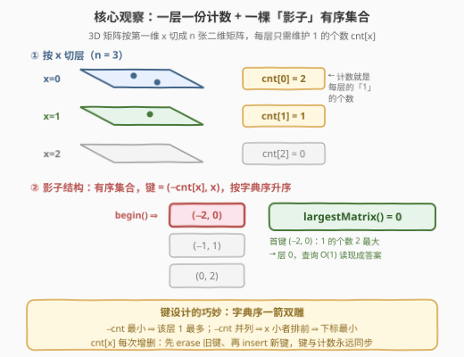
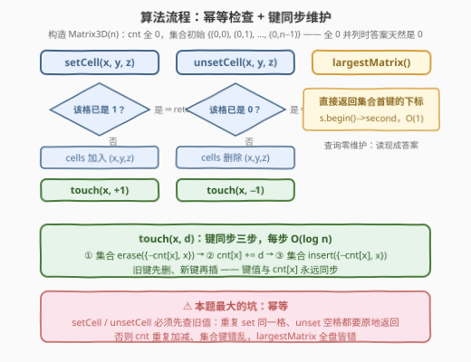

# 设计一个高效的层跟踪三维二进制矩阵

- **题目名称**：设计一个高效的层跟踪三维二进制矩阵
- **链接**：[3391. 设计一个高效的层跟踪三维二进制矩阵](https://leetcode.cn/problems/design-a-3d-binary-matrix-with-efficient-layer-tracking/)
- **难度**：中等
- **标签**：设计、数组、哈希表、矩阵、有序集合
- **关联**：[2349. 设计数字容器系统](https://leetcode.cn/problems/design-a-number-container-system/) 是同款「键 = (值, 下标) 进有序集合、查首键」的设计题；[3092. 最高频率的ID](https://leetcode.cn/problems/most-frequent-ids/) 的「删旧键、改计数、插新键」维护与本题 `touch` 操作完全同构

## 1. 题目概述

> ⚠️ 本题为 LeetCode 付费题，题意描述根据官方示例用例重建，可能与官方题面有出入。

设计一个 $n \times n \times n$ 的三维二进制矩阵（元素非 0 即 1，初始全 0），支持三种操作：

- `Matrix3D(int n)`：初始化三维矩阵，所有元素为 0；
- `void setCell(int x, int y, int z)`：将单元格 $(x, y, z)$ 的值置为 **1**；
- `void unsetCell(int x, int y, int z)`：将单元格 $(x, y, z)$ 的值置为 **0**；
- `int largestMatrix()`：返回**含有 1 最多的二维矩阵**的下标 $x$——把三维矩阵按第一维 $x$ 切成 $n$ 张 $n \times n$ 的二维矩阵（"层"），哪层 1 最多就返回哪层的下标；**并列时返回下标最小**的那层。

**示例 1**（官方用例重建）：

```text
输入
["Matrix3D", "setCell", "largestMatrix", "setCell", "largestMatrix", "setCell", "largestMatrix"]
[[3],        [0, 0, 0], [],            [1, 1, 2], [],            [0, 0, 1], []]
输出
[null, null, 0, null, 0, null, 0]

解释
mat.setCell(0, 0, 0);   // 层 0 有 1 个 1
mat.largestMatrix();    // → 0
mat.setCell(1, 1, 2);   // 层 1 也有 1 个 1，与层 0 并列
mat.largestMatrix();    // → 0（并列取下标最小）
mat.setCell(0, 0, 1);   // 层 0 升到 2 个 1
mat.largestMatrix();    // → 0
```

**示例 2**（官方用例重建）：

```text
输入
["Matrix3D", "setCell", "largestMatrix", "unsetCell", "largestMatrix"]
[[4],        [2, 1, 1], [],            [2, 1, 1],  []]
输出
[null, null, 2, null, 0]

解释
mat.setCell(2, 1, 1);   // 层 2 有 1 个 1
mat.largestMatrix();    // → 2
mat.unsetCell(2, 1, 1); // 层 2 归零，所有层都是 0
mat.largestMatrix();    // → 0（全 0 并列，返回下标 0）
```

**约束条件**（付费题，官方上界不可见，按同类设计题惯例为 $10^5$ 量级）：

- $0 \le x, y, z < n$
- `setCell` / `unsetCell` / `largestMatrix` 的调用总次数与 $n$ 同为较大规模（设计题要求单操作**高效**）

> 💡 **读题关键**：① `largestMatrix` 问的是**层**（固定 $x$ 的整张二维矩阵），不是具体单元格——所以只需关心每层 1 的**个数**，$(y, z)$ 具体是哪个格子无关紧要；② `setCell` / `unsetCell` 都是**幂等**的单点写——重复 set 同一格、unset 一个本来就是 0 的格，都是合法调用；③ 并列取**下标最小**，全 0 时答案天然是 0（见示例 2）。

---

## 2. 解题思路

### 2.1 朴素思路：裸三维数组 + 查询时全扫

最直白的做法是把整个 $n \times n \times n$ 矩阵存下来：`setCell`/`unsetCell` 直接改一格 $O(1)$，`largestMatrix` 则要**遍历全部 $n^3$ 个格子**统计每层的 1 再取最大——$O(n^3)$ 一次查询显然不可接受。

第一个优化顺理成章：既然查询只关心**每层 1 的个数**，就维护计数数组 $cnt[x]$，`setCell`/`unsetCell` 时对相应层 $\pm 1$，`largestMatrix` 退化为**扫一遍 $cnt$ 取最大（并列取最小下标）**，单次查询 $O(n)$。

到这一步修改 $O(1)$、查询 $O(n)$。若 $n$ 与操作次数同阶（都是 $10^5$ 量级），总计 $O(nq) = 10^{10}$ 退化；题目点名 "efficient layer tracking"，期望的是**修改与查询都不拖后腿**——把查询也压下来，就是本题的核心。

### 2.2 核心观察：一层一份计数 + 一棵「影子」有序集合



两个观察合起来解决一切：

1. **一层一份计数**：三维矩阵按第一维 $x$ 切成 $n$ 层，每层只需维护一个整数 $cnt[x]$（该层 1 的个数）。$(y, z)$ 的具体值毫无用处——单点写只需知道**属于哪层**，让该层计数 $\pm 1$ 即可；
2. **影子有序集合**：再维护一个有序集合，键为二元组 $(-cnt[x],\; x)$，按字典序升序。于是 `largestMatrix()` = **首键的第二维**，$O(1)$ 读出——集合永远替你把「当前最优层」排在最前面。

键 $(-cnt[x],\; x)$ 的设计一箭双雕：

- **第一维 $-cnt[x]$ 最小** $\iff$ 该层 1 **最多**（取负把「求最大」翻转为有序集合的「取最小」）；
- **第一维并列时**，第二维 $x$ 小者排前 $\iff$ **下标最小**——并列规则免费获得，无需任何特判。

$cnt[x]$ 每次变化时，先从集合中 `erase` 旧键、再 `insert` 新键——集合与计数**永远同步**，这就是"影子"的含义：它不做任何独立计算，只是 $cnt$ 的有序镜像。

> ⚠️ 前提是**幂等检查**：`setCell` 重复设置同一格、`unsetCell` 清除本来就为 0 的格，都必须原地返回、不动计数——否则 $cnt$ 被重复加减，影子集合的键全部错位。为此需要一个哈希集合 `cells` 记录**当前为 1 的格子**，单点写之前先查旧值（见 2.3）。

### 2.3 算法流程图



三个操作的行为：

- **`setCell(x, y, z)`**：若 $(x,y,z)$ 已在 `cells` 中（已是 1）→ 直接返回；否则加入 `cells`，执行 `touch(x, +1)`；
- **`unsetCell(x, y, z)`**：若 $(x,y,z)$ 不在 `cells` 中（已是 0）→ 直接返回；否则从 `cells` 删除，执行 `touch(x, -1)`；
- **`largestMatrix()`**：返回集合首键的第二维，零维护、$O(1)$。

其中 `touch(x, d)` 是唯一的键同步例程，固定三步（各 $O(\log n)$）：

1. 集合 `erase` 旧键 $(-cnt[x],\; x)$；
2. $cnt[x] \mathrel{+}= d$；
3. 集合 `insert` 新键 $(-cnt[x],\; x)$。

构造函数初始化 $cnt$ 全 0，并把 $n$ 个键 $(0, 0), (0, 1), \dots, (0, n-1)$ 全部放入集合——全 0 并列时首键是 $(0, 0)$，答案天然为 0，与示例 2 吻合。

### 2.4 示例演算

**示例 1**（$n = 3$，只列集合中有信息量的键，省略恒为 0 的尾部）：

| 操作 | 变化 | $cnt$ | 有序集合（升序，省略零键） | `largestMatrix` |
|---|---|---|---|---|
| 构造 | 全 0 | $[0, 0, 0]$ | $(0,0), (0,1), (0,2)$ | — |
| `setCell(0,0,0)` | 层 0 $+1$ | $[1, 0, 0]$ | $(-1,0), (0,1), (0,2)$ | — |
| `largestMatrix` | — | — | 首键 $(-1, 0)$ | **0** |
| `setCell(1,1,2)` | 层 1 $+1$ | $[1, 1, 0]$ | $(-1,0), (-1,1), (0,2)$ | — |
| `largestMatrix` | — | — | 首键 $(-1, 0)$，并列时 $x$ 小者在前 | **0** |
| `setCell(0,0,1)` | 层 0 $+1$ | $[2, 1, 0]$ | $(-2,0), (-1,1), (0,2)$ | — |
| `largestMatrix` | — | — | 首键 $(-2, 0)$ | **0** |

输出 $[null, null, 0, null, 0, null, 0]$ ✓

**示例 2**（$n = 4$）：

| 操作 | 变化 | $cnt$ | 集合首键 | `largestMatrix` |
|---|---|---|---|---|
| `setCell(2,1,1)` | 层 2 $+1$ | $[0, 0, 1, 0]$ | $(-1, 2)$ | — |
| `largestMatrix` | — | — | $(-1, 2)$ | **2** |
| `unsetCell(2,1,1)` | 层 2 $-1$ | $[0, 0, 0, 0]$ | $(0, 0)$（回到初始全并列） | — |
| `largestMatrix` | — | — | $(0, 0)$ | **0** |

输出 $[null, null, 2, null, 0]$ ✓

---

## 3. 参考代码

### C++

```cpp
class Matrix3D {
    vector<int> cnt;              // cnt[x]：层 x 中 1 的个数
    set<pair<int, int>> s;        // 影子有序集合，键 (−cnt[x], x) 升序
    set<array<int, 3>> cells;     // 当前为 1 的格子（幂等检查）

    void touch(int x, int d) {    // 键同步三步：删旧键 → 改计数 → 插新键
        s.erase({-cnt[x], x});
        cnt[x] += d;
        s.insert({-cnt[x], x});
    }

  public:
    Matrix3D(int n) : cnt(n, 0) {
        for (int x = 0; x < n; x++) s.insert({0, x});   // 全 0 并列 → 首键 (0,0)
    }

    void setCell(int x, int y, int z) {
        if (!cells.insert({x, y, z}).second) return;    // 已是 1，幂等返回
        touch(x, +1);
    }

    void unsetCell(int x, int y, int z) {
        if (!cells.erase({x, y, z})) return;            // 已是 0，幂等返回
        touch(x, -1);
    }

    int largestMatrix() {
        return s.begin()->second;                       // 1 最多、并列下标最小
    }
};
```

### Python

```python
from sortedcontainers import SortedList

class Matrix3D:
    def __init__(self, n: int):
        self.cnt = [0] * n
        self.s = SortedList((0, x) for x in range(n))   # 键 (−cnt[x], x) 升序
        self.cells = set()                              # 当前为 1 的格子

    def _touch(self, x: int, d: int) -> None:
        self.s.remove((-self.cnt[x], x))                # 删旧键
        self.cnt[x] += d
        self.s.add((-self.cnt[x], x))                   # 插新键

    def setCell(self, x: int, y: int, z: int) -> None:
        if (x, y, z) in self.cells:                     # 已是 1，幂等返回
            return
        self.cells.add((x, y, z))
        self._touch(x, 1)

    def unsetCell(self, x: int, y: int, z: int) -> None:
        if (x, y, z) not in self.cells:                 # 已是 0，幂等返回
            return
        self.cells.remove((x, y, z))
        self._touch(x, -1)

    def largestMatrix(self) -> int:
        return self.s[0][1]
```

> 💡 **实现细节**：① C++ 用 `set` 而非 `multiset`——键 $(-cnt[x], x)$ 第二维互异，**键天然不重复**，一删一插不会失衡；② `cells.insert(...).second` 与 `cells.erase(...)` 的返回值恰好就是幂等判据：插入失败 = 已是 1，删除 0 个 = 已是 0，一行完成检查与写入；③ Python 的 `SortedList`（LeetCode 环境自带 `sortedcontainers`）用 `remove/add/[0]` 对应「删旧/插新/读首键」，元组字典序与 C++ `pair` 一致。

---

## 4. 复杂度分析

| 维度 | 复杂度 | 说明 |
|------|--------|------|
| **构造** | $O(n \log n)$ | $n$ 个初始键 $(0, x)$ 逐个插入有序集合 |
| **setCell / unsetCell** | $O(\log n)$ | 哈希查一格 + `touch` 的一删一插 |
| **largestMatrix** | $O(1)$ | 直接读集合首键，查询零维护 |
| **空间** | $O(n + q)$ | $cnt$ 与有序集合各 $O(n)$；`cells` 至多存 $q$ 个被置 1 的格子（$q$ 为操作次数） |

> 💡 对照 2.1：朴素版查询 $O(n)$，本方案用「修改多付一点（$O(1) \to O(\log n)$）」换「查询大赚（$O(n) \to O(1)$）」——两种操作频次未知时，均衡的 $O(\log n) / O(1)$ 是设计题的安全解。

---

## 5. 扩展：堆 + 懒删除，以及桶的思路

**为什么不用堆？** `largestMatrix` 像是「维护最大值」，大根堆（键 $(cnt[x], -x)$）似乎也能做。问题出在 `unsetCell` 会让某层计数**下降**——堆顶可能瞬间过期，必须配**懒删除**：堆里堆着历史键，查询时核对堆顶键 $(-cnt[x], x)$ 是否与当前 $cnt[x]$ 一致，不一致就弹掉再看。正确性没问题（这正是 [2349. 设计数字容器系统](../2301-2400/2349_设计数字容器系统.md) 的堆方案），但有序集合「删旧键、插新键」让每个时刻集合里**只有真键**，逻辑更干净、无残留条目，复杂度也从「均摊」变成严格 $O(\log n)$。两者取舍与 3092、2034 中完全一致：**计数会减少时，优先有序集合；只有插入时，堆就够**。

**桶 + 指针**：$cnt[x]$ 的值域是 $[0, n^2]$。可以开桶 `buckets[c]` 存计数为 $c$ 的层，再维护指针 `best` 指向当前最大非空桶：`setCell` 时 `best` 只增不减，`unsetCell` 腾空桶后指针单向下降，总移动量受总操作数限制，查询均摊 $O(1)$。麻烦在**并列取最小下标**——每个桶内还得再放一个有序结构（或按 $x$ 升序懒清理），把 $O(\log n)$ 又请了回来，代码量反超有序集合。除非 $n$ 大到 $\log n$ 成为瓶颈，否则键序对 $( -cnt[x],\; x)$ 是最省事的全序设计。

---

## 6. 面试要点

1. **为什么键设计成 $(-cnt[x],\; x)$？两维各自解决什么？**

   - 第一维取负：有序集合天然升序、`begin()` 最方便，取负把「1 最多」翻转成「键最小」，免去反向迭代器；
   - 第二维 $x$：第一维并列时字典序自动比较 $x$，**并列取下标最小**的规则零代码落地。一句话：**题面的排序规则本身就是比较器**，直接编进键里。

2. **`setCell` 重复调用同一格会发生什么？为什么必须幂等检查？**

   - 不检查的话 $cnt[x]$ 被重复 $+1$，且 `cells` 语义失效——之后 `unsetCell` 一次只能减 1，计数与真实 1 的个数**永久脱钩**，影子集合的键全错，`largestMatrix` 全盘皆错；
   - `unsetCell` 一个本来就是 0 的格同理。两个写操作都要「先查旧值，值没变就不动」。

3. **只维护 `cnt` 数组、查询时 $O(n)$ 扫最大，不行吗？**

   - 看数据规模：若查询极少、$n$ 极小，$O(n)$ 扫描完全够用，代码还短；
   - 但设计题的操作频次未知，$n$ 与操作数同为 $10^5$ 量级时 $O(nq) = 10^{10}$ 必挂。有序集合版把查询压到 $O(1)$，修改付 $O(\log n)$，是对未知频次分布的**均衡保险**。

4. **集合里会不会出现重复键？需要 `multiset` 吗？**

   - 不会。键第二维 $x$ 互不相同，无论 $cnt$ 如何变化，$n$ 个键**两两不同**——`set` 足够，且「一删一插」不会像 `multiset` 那样担心误删多个同键条目。

5. **`largestMatrix` 为什么可以 $O(1)$？答案存在哪？**

   - 影子集合每一步都与 $cnt$ 同步（先删旧键再插新键），首键**永远就是**当前答案——查询只是读取，不做任何维护。这是「把查询代价摊进修改」的典型设计，与 3092（最高频率的ID）、2034（股票价格波动）同款。

> 💡 **一句话总结**：每层一个计数 $cnt[x]$，有序集合维护键 $(-cnt[x],\, x)$；单点写先做幂等检查再「删旧键、改计数、插新键」，查询直接读首键——修改 $O(\log n)$、查询 $O(1)$。

---

## 7. 同类练习题

- [2349. 设计数字容器系统](https://leetcode.cn/problems/design-a-number-container-system/)（[题解](../2301-2400/2349_设计数字容器系统.md)）：同款「键 = (值, 下标) 进有序集合、查首键」设计，还多了一层「数字 → 下标集合」的间接维护
- [3092. 最高频率的ID](https://leetcode.cn/problems/most-frequent-ids/)（[题解](../3001-3100/3092_最高频率的ID.md)）：频率随时增减，「删旧键插新键」的 touch 维护与本题完全同构
- [2034. 股票价格波动](https://leetcode.cn/problems/stock-price-fluctuation/)（[题解](../2001-2100/2034_股票价格波动.md)）：哈希 + 有序集合维护动态最值，价格会更新（计数会降）的场景选有序集合而非堆
- [2166. 设计位集](https://leetcode.cn/problems/design-bitset/)（[题解](../2101-2200/2166_设计位集.md)）：同有 set/unset 幂等语义与计数维护的设计题，多了全局翻转的花活
- [855. 考场就座](https://leetcode.cn/problems/exam-room/)（[题解](../0801-0900/855_考场就座.md)）：有序集合维护动态候选集 + 二分定位，体会「有序结构 + 键设计」的另一种用法
