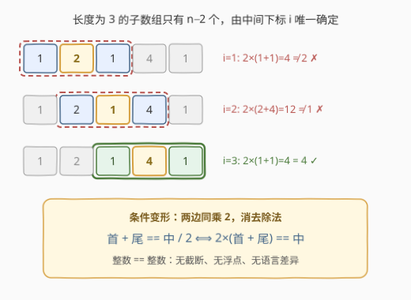
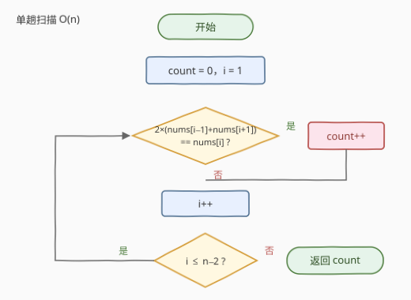

# LeetCode 统计符合条件长度为 3 的子数组数目 题解

- **关联**：[1343. 大小为 K 且平均值大于等于阈值的子数组数目](https://leetcode.cn/problems/number-of-sub-arrays-of-size-k-and-average-greater-than-or-equal-to-threshold/) 是「定长窗口逐个判定计数」的完全体，同样要**乘 k 消除除法**；[2090. 半径为 k 的子数组平均值](https://leetcode.cn/problems/k-radius-subarray-averages/) 正对应本题「枚举中间下标」的中心视角

## 1. 题目概述

- **标题 / 题号**：统计符合条件长度为 3 的子数组数目（#3392，easy）
- **链接**：https://leetcode.cn/problems/count-subarrays-of-length-three-with-a-condition/
- **难度**：简单
- **标签**：数组、定长窗口、一次遍历

**题意**：给你一个整数数组 `nums`，请你返回**长度为 3 的子数组**的数量，满足：**第一个数和第三个数的和，恰好为第二个数的一半**。

记 $a$ 为首个数、$b$ 为中间数、$c$ 为第三个数，条件即：

$$
a + c = \frac{b}{2}
$$

**子数组**指的是数组中**连续非空**的元素序列。

**示例 1**：

```text
输入：nums = [1,2,1,4,1]
输出：1
解释：只有子数组 [1,4,1] 满足：1 + 1 = 2 = 4 / 2。
      [1,2,1] 中 1+1=2 ≠ 2/2=1，[2,1,4] 中 2+4=6 ≠ 1/2，均不满足。
```

**示例 2**：

```text
输入：nums = [1,1,1]
输出：0
解释：[1,1,1] 是唯一长度为 3 的子数组，但 1 + 1 = 2 ≠ 1/2 = 0.5。
```

**约束**：

- $3 \le nums.length \le 100$
- $-100 \le nums[i] \le 100$

> 💡 **读题关键**：① 「第二个数的一半」是**数学意义上的一半**——中间数是奇数时它的一半不是整数，条件必然不成立；② 元素可为**负数**，这直接决定了实现时能不能随手写除法（见 2.1）；③ 长度为 3 的子数组**由中间下标唯一确定**，总共 $n-2$ 个，没有任何枚举难度。

## 2. 解题思路

### 2.1 朴素思路：直译题面，除法埋雷

最直白的写法是把条件原样翻译成代码：

```python
if nums[i-1] + nums[i+1] == nums[i] / 2:   # 危险！
```

这行代码藏着两个坑：

1. **整数除法的语言差异**：C++/Java 的 `/` 对负数**向零截断**，Python 的 `//` **向下取整**，负数场景两者都会「截出一半不是一半」的假相等：
   - `[-1, -3, 0]`：首尾和 $-1$，C++ 中 $-3/2 = -1$，判「成立」——但 $-3$ 真正的一半是 $-1.5 \ne -1$，条件**本不成立**；
   - `[-2, -3, 0]`：首尾和 $-2$，Python 中 $-3//2 = -2$，判「成立」——同样错。
2. **浮点除法** `b / 2.0`：本题 $|b| \le 100$，除以 2 的结果在二进制浮点下恰好精确，侥幸不翻车；但把整数相等判断交给浮点终究是坏习惯，一旦除数换成 3、7 就可能踩精度坑。

> ⚠️ 数组题里凡是能把「除法比较」变形为「乘法比较」的，一律乘过去——这是本题唯一值得记的点。

### 2.2 核心观察：枚举中间下标 + 两边 ×2 消除除法



两个观察让代码又短又稳：

1. **窗口由中间下标唯一确定**：长度为 3 的连续子数组共 $n - 2$ 个，中间下标 $i \in [1, n-2]$ 的那个窗口就是 $(nums[i-1],\; nums[i],\; nums[i+1])$。一趟 `for i in 1..n-2` 扫完，无需任何数据结构；
2. **条件两边同乘 2**：$a + c = b/2 \iff 2 \times (a + c) = b$。左右两边都是**精确整数**，相等判断零截断、零浮点、零语言差异，2.1 的坑全部消失——奇数中间数也被天然排除（$b$ 为奇数时 $2(a+c) \ne b$ 必然成立）。

### 2.3 算法流程图



单层循环 + 计数器：

1. **初始化** `count = 0`；
2. **枚举中间下标** $i = 1 \dots n-2$；
3. **判定**：若 $2 \times (nums[i-1] + nums[i+1]) = nums[i]$，则 `count++`；
4. 循环结束，返回 `count`。

### 2.4 示例演算

**示例 1**：`nums = [1,2,1,4,1]`，逐窗口用变形条件判断：

| 中间下标 $i$ | 窗口 | $2 \times$（首 + 尾） | 中间值 | 判定 |
|---|---|---|---|---|
| 1 | [1,2,1] | $2 \times (1+1) = 4$ | $2$ | $4 \ne 2$ ✗ |
| 2 | [2,1,4] | $2 \times (2+4) = 12$ | $1$ | $12 \ne 1$ ✗ |
| 3 | [1,4,1] | $2 \times (1+1) = 4$ | $4$ | $4 = 4$ ✓ |

计数为 **1** ✓。

**示例 2**：`nums = [1,1,1]`：唯一窗口 $2 \times (1+1) = 4 \ne 1$，计数 **0** ✓。

## 3. 参考代码

### C++

```cpp
class Solution {
  public:
    int countSubarrays(vector<int>& nums) {
        int n = nums.size(), ans = 0;
        for (int i = 1; i + 1 < n; i++) {
            if (2 * (nums[i - 1] + nums[i + 1]) == nums[i]) ans++;
        }
        return ans;
    }
};
```

### Python

```python
class Solution:
    def countSubarrays(self, nums: List[int]) -> int:
        return sum(2 * (a + c) == b
                   for a, b, c in zip(nums, nums[1:], nums[2:]))
```

> 💡 Python 版用 `zip(nums, nums[1:], nums[2:])` 直接产出所有（首，中，尾）三元组，配合生成器 `sum` 一行收工；写显式下标循环也完全可以，注意 $n = 3$ 时循环体恰好执行一次。

## 4. 复杂度分析

| 维度 | 复杂度 | 说明 |
|------|--------|------|
| **时间复杂度** | $O(n)$ | 单趟扫描 $n-2$ 个窗口，每步两次加法、一次乘法、一次比较 |
| **空间复杂度** | $O(1)$ | 只有下标与计数器，无额外数据结构 |

> 💡 本题 $n \le 100$，连 $O(n^3)$ 枚举所有子数组再筛长度都能过，但「定长窗口单趟扫描」是无条件最优写法，不值得为小数据妥协。

## 5. 扩展：定长窗口家族

本题是「**固定长度窗口逐个判定**」的最小样例，家族通用骨架是：`for 每个窗口 → O(1) 判定/维护聚合值 → 更新答案`。

- **条件含窗口和** → 滚动和/前缀和把每个窗口判断降到 $O(1)$：[643 子数组最大平均数 I](../0601-0700/643_子数组最大平均数I.md)（窗口和 ÷ k，同样**乘 k 消除除法**）、[1343 大小为 K 且平均值大于等于阈值的子数组数目](../1301-1400/1343_大小为K且平均值大于等于阈值的子数组数目.md)（窗口和 ≥ k×threshold，乘法变形的标准应用）；
- **以中间下标为中心** → [2090 半径为 k 的子数组平均值](../2001-2100/2090_半径为k的子数组平均值.md)，与本题「枚举中间下标」同一视角；
- **条件换汤不换药** → 「中间严格大于两侧」「三元组元素互不相同」（[1876](../1801-1900/1876_长度为三且各字符不同的子字符串.md)）等，判定式换了，骨架一行不变。

## 6. 面试要点

1. **为什么不能直接写 `nums[i-1] + nums[i+1] == nums[i] / 2`？**

   - 整数除法对负数的处理有语言差异：C++/Java 向零截断（$-3/2 = -1$）、Python 向下取整（$-3//2 = -2$），两者都能构造出「除法判成立、真条件不成立」的反例；
   - 两边同乘 2 变形为 $2 \times (a+c) = b$ 后两边都是精确整数，判断无歧义。

2. **构造一个除法版本必然判错的输入。**

   - C++：`[-1, -3, 0]`——首尾和 $-1$ 恰等于截断值 $-3/2 = -1$，除法版误判成立，而 $-1.5 \ne -1$；
   - Python：`[-2, -3, 0]`——首尾和 $-2$ 恰等于下取整值 $-3//2 = -2$，同样误判。

3. **长度为 3 的子数组有多少个？怎么枚举最自然？**

   - $n - 2$ 个，由中间下标 $i \in [1, n-2]$ 唯一确定；
   - 枚举中间下标最自然：窗口三元素直接就是 $nums[i-1],\; nums[i],\; nums[i+1]$。

4. **中间数是奇数时条件可能成立吗？**

   - 不可能。奇数的一半是 $\pm 0.5$ 结尾的非整数，而首尾和是整数；
   - 乘 2 变形天然覆盖这一点，无需额外特判。

5. **若长度推广到 k、判定涉及窗口内所有元素之和，怎么做？**

   - 滚动和：右进左减，每个窗口 $O(1)$ 更新，总复杂度仍 $O(n)$——即 643/1343 的标准套路。

> 💡 **一句话总结**：枚举中间下标 $i \in [1, n-2]$，判定式两边 ×2 变形为 $2 \times (nums[i-1]+nums[i+1]) = nums[i]$，单趟扫描计数，$O(n)$ / $O(1)$ 收工。

## 同类练习题

| # | 题目 | 与本题的关联 |
|---|------|-------------|
| 1343 | [大小为 K 且平均值大于等于阈值的子数组数目](https://leetcode.cn/problems/number-of-sub-arrays-of-size-k-and-average-greater-than-or-equal-to-threshold/)（[题解](../1301-1400/1343_大小为K且平均值大于等于阈值的子数组数目.md)） | 定长窗口计数的完全体，「窗口和 ≥ k×threshold」正是乘法消除除法的标准应用 |
| 1876 | [长度为三且各字符不同的子字符串](https://leetcode.cn/problems/substrings-of-size-three-with-distinct-characters/)（[题解](../1801-1900/1876_长度为三且各字符不同的子字符串.md)） | 同款长度为 3 的窗口逐个判定，条件换成「三个字符互不相同」 |
| 643 | [子数组最大平均数 I](https://leetcode.cn/problems/maximum-average-subarray-i/)（[题解](../0601-0700/643_子数组最大平均数I.md)） | 定长滑动窗口入门，滚动和的雏形 |
| 2090 | [半径为 k 的子数组平均值](https://leetcode.cn/problems/k-radius-subarray-averages/)（[题解](../2001-2100/2090_半径为k的子数组平均值.md)） | 以中间下标为中心的定长窗口，与本题「枚举中间下标」视角一致 |
| 1456 | [定长子串中元音的最大数目](https://leetcode.cn/problems/maximum-number-of-vowels-in-a-substring-of-given-length/)（[题解](../1401-1500/1456_定长子串中元音的最大数目.md)） | 定长窗口维护聚合值（元音个数）的变体 |
