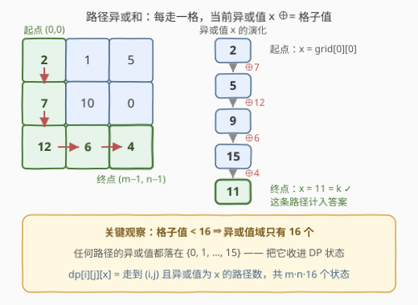
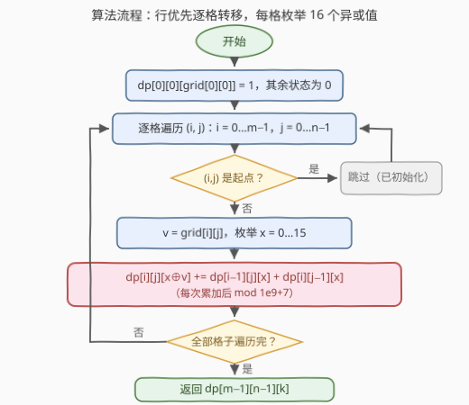

# 统计异或值为给定值的路径数目

- **题目名称**：统计异或值为给定值的路径数目
- **链接**：[3393. 统计异或值为给定值的路径数目](https://leetcode.cn/problems/count-paths-with-the-given-xor-value/)
- **难度**：中等
- **标签**：动态规划、位运算、矩阵、路径计数
- **关联**：[62. 不同路径](../0001-0100/62_不同路径.md) 是去掉异或约束的裸计数版；[2435. 矩阵中和能被K整除的路径](../2401-2500/2435_矩阵中和能被K整除的路径.md) 是把「异或值」换成「和 mod k」的同骨架题

## 1. 题目概述

给你一个大小为 $m \times n$ 的二维整数数组 `grid` 和一个整数 `k`。统计从左上角 $(0, 0)$ 出发、到达右下角 $(m-1, n-1)$ 的路径数目，要求：

- 每一步只能**向右**或**向下**走；
- 路径上**所有数字的异或（XOR）值恰好等于 $k$**。

答案可能很大，将结果对 $10^9 + 7$ 取余后返回。

**示例 1**：

```text
输入：grid = [[2,1,5],[7,10,0],[12,6,4]], k = 11
输出：3
解释：3 条路径的异或和均为 11：
      (0,0)→(1,0)→(2,0)→(2,1)→(2,2)：2⊕7⊕12⊕6⊕4 = 11
      (0,0)→(1,0)→(1,1)→(1,2)→(2,2)：2⊕7⊕10⊕0⊕4 = 11
      (0,0)→(0,1)→(1,1)→(2,1)→(2,2)：2⊕1⊕10⊕6⊕4 = 11
```

**示例 2**：

```text
输入：grid = [[1,3,3,3],[0,3,3,2],[3,0,1,1]], k = 2
输出：5
```

**示例 3**：

```text
输入：grid = [[1,1,1,2],[3,0,3,2],[3,0,2,2]], k = 10
输出：0
解释：任何路径的异或值都不等于 10。
```

**约束条件**：

- $1 \le m = grid.length \le 300$
- $1 \le n = grid[r].length \le 300$
- $0 \le grid[r][c] < 16$
- $0 \le k < 16$

> 💡 **读题关键**：① 只能向右/向下 ⇒ 路径固定经过 $m + n - 1$ 个格子，且格子之间存在天然拓扑序；② **格子值和 $k$ 都小于 16**——这个不起眼的约束是整道题的钥匙（见 2.2）；③ 答案取模说明路径数本身可能巨大（最多 $\binom{598}{299}$ 条），**计数过程中**就要取模。

---

## 2. 解题思路

### 2.1 朴素思路：枚举所有路径

从 $(0,0)$ 到 $(m-1,n-1)$ 共需 $(m-1)+(n-1)$ 步，路径总数为 $\binom{m+n-2}{m-1}$。当 $m = n = 300$ 时约为 $\binom{598}{299} \approx 10^{178}$ 条，逐条计算异或和必然超时。

另一反应是「不同路径」的二维 DP：$dp[i][j] = dp[i-1][j] + dp[i][j-1]$。但它只数路径条数，**无法表达「异或值恰好为 $k$」这个约束**——异或值是整条路径的函数，仅凭 $(i,j)$ 无法判断后续还能不能凑出 $k$，不满足**无后效性**。缺的，恰恰是一个维度。

### 2.2 核心观察：异或值域只有 16 → 把异或值收进状态



三步合起来就是完整的状态设计：

1. **值域封闭**：所有 $grid[r][c] < 16$（4 个二进制位以内），4 位以内的数互相异或仍在 4 位以内，因此**任何路径的异或值都落在 $\{0, 1, \dots, 15\}$**，一共只有 16 种可能；
2. **扩充状态**：定义 $dp[i][j][x]$ = 从 $(0,0)$ 走到 $(i,j)$、且路径异或值恰好为 $x$ 的路径数；
3. **转移靠 XOR 的自逆性**：进入格子 $(i,j)$（值为 $v$）的一瞬间，异或值从 $x$ 变成 $x \oplus v$，于是

$$
dp[i][j][\,x \oplus v\,] \;\;{+}{=}\;\; dp[i-1][j][x] + dp[i][j-1][x]
$$

边界为 $dp[0][0][grid[0][0]] = 1$，答案是 $dp[m-1][n-1][k]$。

由于异或**自逆**（$x \oplus v \oplus v = x$），当前异或值 $x$ 携带了历史路径的全部信息——未来能否凑出 $k$ 只与 $x$ 有关，与具体走过哪些格子无关，无后效性成立。

> 💡 对比记忆：**加法**版的同款题（2435，路径和被 $k$ 整除）必须边加边取余，因为「和」不封闭；**异或**版连取余都不需要，值域天然封闭——这就是出题人把格子值压到 16 以内的用意。

### 2.3 算法流程图



1. **初始化** $dp[0][0][grid[0][0]] = 1$；
2. **行优先**逐格遍历 $(i,j)$，跳过起点；
3. 取 $v = grid[i][j]$，**枚举 16 个异或值** $x$；
4. 把上方 $dp[i-1][j][x]$ 与左方 $dp[i][j-1][x]$ 累加到 $dp[i][j][x \oplus v]$，**每次累加后取模**；
5. 遍历结束，返回 $dp[m-1][n-1][k]$。

行优先遍历保证计算 $(i,j)$ 时，上一行与左侧一格都已就绪——「只能向右或向下」的移动规则送给我们天然的拓扑序。

### 2.4 示例演算

对示例 1（$k = 11$）逐格列出非零状态 $\{x: \text{路径数}\}$：

| 格子 | 值 $v$ | 来源 | 非零状态 |
|---|---|---|---|
| (0,0) | 2 | 起点 | {2: 1} |
| (0,1) | 1 | ← | {3: 1} |
| (0,2) | 5 | ← | {6: 1} |
| (1,0) | 7 | ↑ | {5: 1} |
| (1,1) | 10 | ↑← | {15: 1, 9: 1} |
| (1,2) | 0 | ↑← | {6: 1, 15: 1, 9: 1} |
| (2,0) | 12 | ↑ | {9: 1} |
| (2,1) | 6 | ↑← | {9: 1, 15: 2} |
| (2,2) | 4 | ↑← | {2: 1, **11: 3**, 13: 2} |

终点 $dp[2][2][11] = \mathbf{3}$ ✓。

注意 $(1,2)$ 的值为 0：$\oplus 0$ 不改变异或值，左邻的三个状态**原样通过**——值为 0 的格子对异或和是「透明」的。

---

## 3. 参考代码

### C++

```cpp
class Solution {
  public:
    int countPathsWithXorValue(vector<vector<int>>& grid, int k) {
        constexpr int MOD = 1'000'000'007;
        int m = grid.size(), n = grid[0].size();
        // dp[i][j][x]：从 (0,0) 走到 (i,j)、路径异或值为 x 的路径数
        vector<vector<array<long long, 16>>> dp(m, vector<array<long long, 16>>(n));
        dp[0][0][grid[0][0]] = 1;
        for (int i = 0; i < m; ++i) {
            for (int j = 0; j < n; ++j) {
                if (i == 0 && j == 0) continue;
                int v = grid[i][j];
                for (int x = 0; x < 16; ++x) {
                    long long& t = dp[i][j][x ^ v];
                    if (i) t = (t + dp[i - 1][j][x]) % MOD;
                    if (j) t = (t + dp[i][j - 1][x]) % MOD;
                }
            }
        }
        return dp[m - 1][n - 1][k];
    }
};
```

### Python

```python
class Solution:
    def countPathsWithXorValue(self, grid: List[List[int]], k: int) -> int:
        MOD = 10 ** 9 + 7
        m, n = len(grid), len(grid[0])
        dp = [[[0] * 16 for _ in range(n)] for _ in range(m)]
        dp[0][0][grid[0][0]] = 1
        for i in range(m):
            for j in range(n):
                if i == 0 and j == 0:
                    continue
                v, cur = grid[i][j], dp[i][j]
                for x in range(16):
                    if i:
                        cur[x ^ v] = (cur[x ^ v] + dp[i - 1][j][x]) % MOD
                    if j:
                        cur[x ^ v] = (cur[x ^ v] + dp[i][j - 1][x]) % MOD
        return dp[m - 1][n - 1][k]
```

> 💡 两份代码的时间都是 $O(mn \cdot 16)$。若在意空间，$dp[i][\dots]$ 只依赖第 $i-1$ 行与本行左侧，可用滚动数组压到 $O(n \cdot 16)$（见第 5 节）；本题 $m, n \le 300$，直接开三维（约 $1.4 \times 10^6$ 个状态）完全够用。

---

## 4. 复杂度分析

| 维度 | 复杂度 | 说明 |
|------|--------|------|
| **时间复杂度** | $O(mn \cdot 16) = O(mn)$ | 每个格子的 16 个异或值状态各转移一次，每次 $O(1)$ |
| **空间复杂度** | $O(mn \cdot 16)$ | 三维 DP 数组；滚动数组优化后 $O(n \cdot 16)$ |

$300 \times 300 \times 16 \approx 1.4 \times 10^6$ 个状态，毫秒级完成。

---

## 5. 扩展：「路径计数 × 聚合值状态」家族

把「路径条数」与「路径聚合值」捆绑成一个状态，是网格 DP 的常见升级路线：

- **和式版**：[2435 矩阵中和能被 K 整除的路径](../2401-2500/2435_矩阵中和能被K整除的路径.md)——聚合值换成「和 mod k」，加法不封闭，须边加边取余，状态数 $k$ 个；
- **最值 + 计数版**：[1301 最大得分的路径数目](../1301-1400/1301_最大得分的路径数目.md)——同时维护「最大得分」与「达成该得分的路径数」两个量，最优解结构稍复杂（先比大小再合并计数）；
- **退化版**：[62 不同路径](../0001-0100/62_不同路径.md)/[63 不同路径 II](../0001-0100/63_不同路径II.md)——去掉聚合值维度即回到裸计数，63 只是在转移时把障碍格的贡献置 0；
- **值域不受限怎么办**：若格子值可达 $10^9$，异或值理论上最多 $2^{30}$ 种，不能开数组——退而用哈希表只存「实际出现过的异或值」（稀疏 DP）；但状态数上界仍是 $\min(\text{路径数}, 2^{30})$，最坏会爆炸。本题值域 $< 16$ 正是出题人留的活路；
- **滚动数组**：逐行覆盖，空间压到 $O(n \cdot 16)$，转移骨架不变。

---

## 6. 面试要点

1. **为什么二维 dp 不够、必须加一维？**

   - 异或值是整条路径的函数，仅凭 $(i,j)$ 无法判断后续能否凑出 $k$，不满足无后效性；
   - 把异或值 $x$ 纳入状态后，$(i,j, x)$ 对未来是充分的—— XOR 自逆，$x$ 已编码全部历史。

2. **为什么异或值状态只有 16 个？**

   - $0 \le grid[r][c] < 16$，即每个数不超过 4 个二进制位；4 位以内的数互相异或仍在 4 位以内，值域 $\{0,\dots,15\}$ 封闭；
   - $k < 16$ 保证目标状态合法（若 $k \ge 16$ 答案恒为 0）。

3. **转移方程为什么是 $dp[i][j][x \oplus v]\ {+}{=}\ \dots$？**

   - 走进格子 $(i,j)$（值 $v$）恰好把路径异或值从 $x$ 变为 $x \oplus v$，来源是上方与左方两个格子的同状态 $x$；
   - 也可等价地按目标状态反写：$dp[i][j][y] \mathrel{+}= dp[i-1][j][y \oplus v] + dp[i][j-1][y \oplus v]$，两种写法完全对称（XOR 自逆）。

4. **取模在哪些位置做？**

   - **每次累加后**就 mod：路径数最多 $\binom{598}{299}$ 量级，中途不取模任何整型都会溢出；
   - C++ 中间量用 `long long` 暂存更稳；只在最后输出时取模是常见错误。

5. **与 2435（和能被 K 整除的路径）的本质区别？**

   - 状态都是「路径聚合值」：2435 是**和 mod k**（加法不保持有限域信息，须边加边取余），本题是**异或值**（天然封闭在 16 个值内，且自逆）；
   - 骨架完全一致：行优先遍历 + 上/左两来源合并 + 终点单点查询。

> 💡 **一句话总结**：格子值 $< 16$ ⇒ 路径异或值只有 16 种 ⇒ $dp[i][j][x]$ 计数，转移 $dp[i][j][x \oplus v] \mathrel{+}= dp[i-1][j][x] + dp[i][j-1][x]$，$O(mn \cdot 16)$ 收工。

---

## 7. 同类练习题

- [62. 不同路径](https://leetcode.cn/problems/unique-paths/)（[题解](../0001-0100/62_不同路径.md)）：去掉异或约束的裸计数版，$dp[i][j] = dp[i-1][j] + dp[i][j-1]$
- [63. 不同路径 II](https://leetcode.cn/problems/unique-paths-ii/)（[题解](../0001-0100/63_不同路径II.md)）：转移上做减法（障碍格贡献为 0），状态设计不变
- [2435. 矩阵中和能被 K 整除的路径](https://leetcode.cn/problems/paths-in-matrix-whose-sum-is-divisible-by-k/)（[题解](../2401-2500/2435_矩阵中和能被K整除的路径.md)）：同骨架，聚合值从「异或」换成「和 mod k」
- [1301. 最大得分的路径数目](https://leetcode.cn/problems/number-of-paths-with-max-score/)（[题解](../1301-1400/1301_最大得分的路径数目.md)）：最值与计数双信息维护的路径 DP
- [1444. 切披萨的方案数](https://leetcode.cn/problems/number-of-ways-of-cutting-a-pizza/)（[题解](../1401-1500/1444_切披萨的方案数.md)）：另一类「计数 × 附加值状态」——用苹果数前缀和作约束的区间 DP
