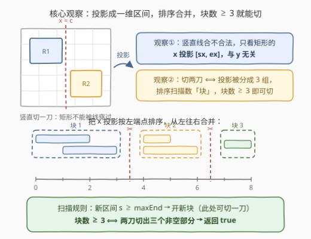
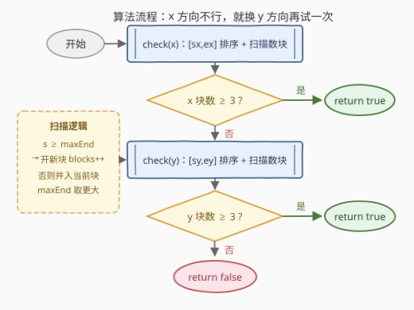
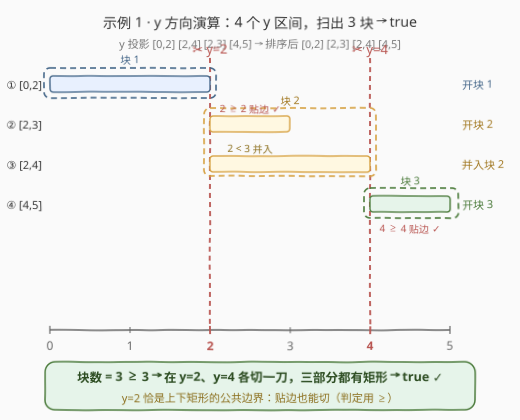

# 判断网格图能否被切割成块

- **题目名称**：判断网格图能否被切割成块
- **链接**：[3394. 判断网格图能否被切割成块](https://leetcode.cn/problems/check-if-grid-can-be-cut-into-sections/)
- **难度**：中等
- **标签**：数组、排序、区间合并
- **关联**：[56. 合并区间](https://leetcode.cn/problems/merge-intervals/) 是本题「排序 + 维护 maxEnd 数块」骨架的母题

## 1. 题目概述

给你一个整数 `n` 表示一个 $n \times n$ 的网格图，坐标原点在网格图的**左下角**。同时给你二维数组 `rectangles`，其中 `rectangles[i] = [startx, starty, endx, endy]` 表示网格中的一个矩形：$(startx, starty)$ 是**左下角**，$(endx, endy)$ 是**右上角**。矩形之间**互不重叠**。

判断能否找到**两条要么都竖直、要么都水平**的切割线，满足：

- 切割得到的三个部分**分别都至少包含一个矩形**；
- 每个矩形都**恰好仅属于一个**切割得到的部分。

可以切割返回 `true`，否则返回 `false`。

**示例 1**：

```text
输入：n = 5, rectangles = [[1,0,5,2],[0,2,2,4],[3,2,5,3],[0,4,4,5]]
输出：true
解释：在 y = 2 和 y = 4 处进行两条水平切割，三个部分各含矩形，返回 true。
```

**示例 2**：

```text
输入：n = 4, rectangles = [[0,0,1,1],[2,0,3,4],[0,2,2,3],[3,0,4,3]]
输出：true
解释：在 x = 2 和 x = 3 处进行两条竖直切割，返回 true。
```

**示例 3**：

```text
输入：n = 4, rectangles = [[0,2,2,4],[1,0,3,2],[2,2,3,4],[3,0,4,2],[3,2,4,4]]
输出：false
解释：无论两条水平还是两条竖直切割都无法满足要求。
```

**约束条件**：

- $3 \le n \le 10^9$
- $3 \le rectangles.length \le 10^5$
- $0 \le startx < endx \le n$，$0 \le starty < endy \le n$
- 矩形之间两两不重叠

> 💡 **读题关键**：① 两条切割线**必须同方向**——要么都竖直、要么都水平，不能一横一竖；② 切割线是贯穿整个网格的直线，**矩形不能被切割线穿过**（否则一个矩形会同时落进两个部分，违反「恰好属于一个部分」）；③ 切割线可以**贴着矩形边界**切——示例 1 官方在 $y=2$ 切割，而 $y=2$ 恰是矩形 $[1,0,5,2]$ 的上边界、$[0,2,2,4]$ 的下边界，这是本题最隐蔽的判定细节；④ $n$ 高达 $10^9$，但它只是坐标上界，算法只依赖区间的相对顺序，与 $n$ 的大小无关。

---

## 2. 解题思路

### 2.1 暴力思路：枚举切割线位置

按题面直译：候选切割线的位置只会落在矩形边界坐标上（$O(m)$ 个候选），任选两条共 $O(m^2)$ 种组合，每种组合再花 $O(m)$ 逐一检查是否有矩形被两条线之一穿过——总计 $O(m^3)$，$m = 10^5$ 时完全不可行。

再往深一层想：即使只判**一条**竖直线合不合法，我们也从不关心它切在空隙里的哪个具体位置，只关心**有没有空隙、有几个空隙**。于是问题从「枚举线的位置」转向「数空隙的个数」——这是一个标准的**区间合并**问题。

### 2.2 核心观察：投影降维 + 排序数块（块数 ≥ 3 即可切）



三个观察把问题拍扁：

1. **降维**：竖直线 $x=c$ 是否穿过某矩形，只取决于该矩形的 x 投影 $[startx,\, endx]$ 是否跨越 $c$，与 y 坐标完全无关。「竖直方向能否切两刀」等价于「能否用两条竖线把 $m$ 个 x 区间分成互不跨越的三组」——二维问题坍缩成一维区间问题。水平方向对称，改用 y 投影 $[starty,\, endy]$ 即可。
2. **数块**：把所有区间按左端点排序后从左往右扫，维护「当前块」的最大右端点 $maxEnd$：
   - 若下一区间满足 $s \ge maxEnd$：它与当前块之间出现空隙（或恰好贴边），此处可以下刀 → **开新块**；
   - 否则：它与当前块重叠连通 → 并入当前块，$maxEnd \leftarrow \max(maxEnd,\, e)$。

   扫完后得到互不相交的「合并块数」 $B$。**$B \ge 3 \iff$ 该方向能切两刀**：
   - **充分性**：在前两个块间隙处各切一刀，三个块分属三个部分，每部分至少含一个矩形 ✓；
   - **必要性**：合法的两刀把矩形分成三组，各组投影均不跨越切割线，排序后至少断成三块 ✓。
3. **贴边细节**：判定用 $s \ge maxEnd$ 而非 $s > maxEnd$——贴边的两个矩形（如 $[0,2]$ 与 $[2,4]$）共享边界坐标，**贴边处可以下刀**（示例 1 在 $y=2$ 切割正是贴边切）。若去掉等号，示例 1 会被误判为 `false`。把矩形占用的范围理解为左闭右开 $[startx,\, endx)$，贴边即无交，等号的合理性一目了然。

> ⚠️ 「矩形互不重叠」保证了两矩形投影至多贴边、不会严格相交，但这**不影响算法**：即便输入区间有重叠，排序扫描的合并逻辑同样正确。

### 2.3 算法流程图



两个方向共用同一个 `check` 子过程：

1. 提取该方向的投影区间（x 方向取 $(startx, endx)$，y 方向取 $(starty, endy)$）；
2. 按左端点排序，置 `blocks = 0`、`maxEnd = -1`；
3. 顺序扫描：若 $s \ge maxEnd$ 则 `blocks++`；随后 $maxEnd \leftarrow \max(maxEnd,\, e)$；
4. 扫描结束若 $blocks \ge 3$，返回 `true`；
5. x 方向不满足，则对 y 方向重复步骤 1–4；
6. 两个方向都不满足，返回 `false`。

### 2.4 示例演算



**示例 1（y 方向）**：y 投影为 $[0,2],\, [2,4],\, [2,3],\, [4,5]$，排序后逐个扫描：

| 排序后区间 | 判定 | 动作 | 块数 | $maxEnd$ |
|---|---|---|---|---|
| $[0,2]$ | $0 \ge -1$ | 开新块 **块 1** | 1 | $2$ |
| $[2,3]$ | $2 \ge 2$（贴边） | 开新块 **块 2** | 2 | $3$ |
| $[2,4]$ | $2 < 3$ | 并入块 2 | 2 | $4$ |
| $[4,5]$ | $4 \ge 4$（贴边） | 开新块 **块 3** | 3 | $5$ |

块数 $= 3 \ge 3$ → 在 $y=2$ 与 $y=4$ 各切一刀，三部分各含矩形 → **true** ✓

**示例 3（两个方向都失败）**：

- x 投影排序后 $[0,2],[1,3],[2,3],[3,4],[3,4]$：$[0,2]$ 开块 1（$maxEnd=2$），$[1,3]$ 并入（$maxEnd=3$），$[2,3]$ 并入，$[3,4]$ 贴边开块 2（$maxEnd=4$），$[3,4]$ 并入 → 仅 **2 块**；
- y 投影排序后 $[0,2],[0,2],[2,4],[2,4],[2,4]$：$[0,2]$ 开块 1，$[0,2]$ 并入，$[2,4]$ 贴边开块 2，其余并入 → 仅 **2 块**；

两个方向都凑不出 3 块 → **false** ✓

---

## 3. 参考代码

### C++

```cpp
class Solution {
  public:
    bool checkValidCuts(int n, vector<vector<int>>& rectangles) {
        auto check = [](vector<pair<int, int>> intervals) {
            sort(intervals.begin(), intervals.end());
            int blocks = 0;
            int maxEnd = -1;                  // 当前块的最大右端点
            for (auto& [s, e] : intervals) {
                if (s >= maxEnd) blocks++;    // 空隙或贴边：此处可切一刀
                maxEnd = max(maxEnd, e);
            }
            return blocks >= 3;
        };

        vector<pair<int, int>> xs, ys;
        for (auto& r : rectangles) {
            xs.emplace_back(r[0], r[2]);      // x 投影
            ys.emplace_back(r[1], r[3]);      // y 投影
        }
        return check(move(xs)) || check(move(ys));
    }
};
```

### Python

```python
class Solution:
    def checkValidCuts(self, n: int, rectangles: List[List[int]]) -> bool:
        def check(intervals: List[Tuple[int, int]]) -> bool:
            intervals.sort()
            blocks, max_end = 0, -1
            for s, e in intervals:
                if s >= max_end:      # 空隙或贴边：开新块
                    blocks += 1
                max_end = max(max_end, e)
            return blocks >= 3

        return (check([(r[0], r[2]) for r in rectangles])     # x 方向
                or check([(r[1], r[3]) for r in rectangles]))  # y 方向
```

> 💡 两个方向独立、同构，写成对 `check` 的两次调用即可；`maxEnd` 初始化为 $-1$ 使第一个区间必然开块，无需特判。坐标上限 $10^9$ 在 `int` 范围内，无需换 `long long`。

---

## 4. 复杂度分析

| 维度 | 复杂度 | 说明 |
|------|--------|------|
| **时间复杂度** | $O(m \log m)$ | x、y 两个方向各一次排序（$O(m\log m)$）加一趟线性扫描（$O(m)$），$m$ 为矩形个数；与 $n$ 无关 |
| **空间复杂度** | $O(m)$ | 存放两个方向的投影区间 |

> 💡 $m \le 10^5$，$O(m \log m)$ 约 $10^5 \times 17$ 次比较，轻松通过。

---

## 5. 扩展：同一骨架的变体

- **左闭右开视角**：把矩形看成 $[startx, endx) \times [starty, endy)$，贴边矩形天然无交，合并条件自然写成 $s \ge maxEnd$，「贴边能不能切」的纠结随之消失——区间题里善用半开区间能省掉大量边界讨论。
- **推广到 k 刀**：要求切 $k$ 刀、得到 $k+1$ 个非空部分 ⟺ 合并块数 $\ge k+1$，判定式只改一个常数。
- **允许一横一竖（十字切）**：变成 x 方向找 1 个空隙**且** y 方向找 1 个空隙（各自块数 $\ge 2$，独立判定后取与），连排序结果都可以复用。
- **骨架同源**：本题的「排序 + 维护 $maxEnd$ + 计数」与 [56 合并区间](../0001-0100/56_合并区间.md)、[452 用最少数量的箭引爆气球](../0401-0500/452_用最少数量的箭引爆气球.md) 完全同源，只是把「合并结果」换成了「块数统计」。

---

## 6. 面试要点

1. **为什么二维问题可以降到一维？**

   - 竖直切割线 $x=c$ 是否合法，只取决于每个矩形的 x 投影 $[startx, endx]$ 是否跨越 $c$，与 y 坐标无关；水平方向对称；
   - 因此「竖直方向能否切两刀」是纯一维的区间分组问题，x、y 两个方向各自独立求解。

2. **「块数 ≥ 3」为什么是充要条件？**

   - 充分：前两个块间隙处各切一刀，三个合并块分属三个部分，每部分至少一个矩形；
   - 必要：合法的两刀把矩形分成三组，各组投影不跨越切割线，排序后至少断成三块。

3. **贴边的两个矩形（如 $[0,2]$ 与 $[2,4]$）之间能下刀吗？**

   - 能。示例 1 官方在 $y=2$ 切割，恰是上下矩形的公共边界；
   - 判定必须写 $s \ge maxEnd$；写成 $s > maxEnd$ 会在示例 1 上把 true 误判成 false。用左闭右开 $[startx, endx)$ 的视角看，贴边即无交，等号天经地义。

4. **为什么不用枚举切割线的具体位置？**

   - 我们只关心「有几个可供下刀的空隙」，不关心刀切在空隙内的哪个点；
   - 空隙个数由排序扫描直接得出，枚举位置是无效维度，只会带来 $O(m^2)$ 以上的浪费。

5. **如果两条线允许一横一竖呢？**

   - 十字切只需 x、y 方向各有一个空隙：两个方向分别跑 `check`，条件改为各自块数 $\ge 2$，再取与；
   - 两次排序、两次扫描，复杂度仍是 $O(m \log m)$。

> 💡 **一句话总结**：矩形投影成区间、按左端点排序、一趟扫描维护 $maxEnd$ 数合并块，x 或 y 任一方向块数 $\ge 3$ 即返回 true；判定式记得用 $s \ge maxEnd$ 给贴边切留出等号。

---

## 7. 同类练习题

- [56. 合并区间](https://leetcode.cn/problems/merge-intervals/)（[题解](../0001-0100/56_合并区间.md)）：本题「排序 + 维护 maxEnd」的直接母题，合并结果换成块数计数就是本题
- [435. 无重叠区间](https://leetcode.cn/problems/non-overlapping-intervals/)（[题解](../0401-0500/435_无重叠区间.md)）：同款排序扫描骨架，用 maxEnd 判断区间是否相交
- [452. 用最少数量的箭引爆气球](https://leetcode.cn/problems/minimum-number-of-arrows-to-burst-balloons/)（[题解](../0401-0500/452_用最少数量的箭引爆气球.md)）：维护 maxEnd 数「互不相交组数」，与数块数如出一辙
- [1288. 删除被覆盖区间](https://leetcode.cn/problems/remove-covered-intervals/)（[题解](../1201-1300/1288_删除被覆盖区间.md)）：区间排序 + 端点比较的基本功训练
- [1851. 包含每个查询的最小区间](https://leetcode.cn/problems/minimum-interval-to-include-each-query/)（[题解](../1801-1900/1851_包含每个查询的最小区间.md)）：区间 + 排序 + 事件扫描的进阶应用
