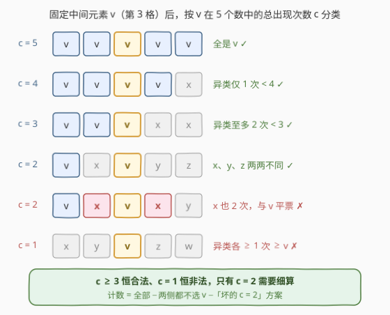
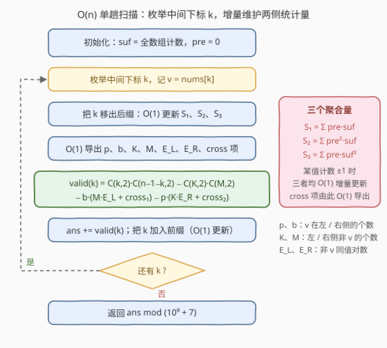

# 唯一中间众数子序列 I

- **题目名称**：唯一中间众数子序列 I
- **链接**：[3395. 唯一中间众数子序列 I](https://leetcode.cn/problems/subsequences-with-a-unique-middle-mode-i/)
- **难度**：困难
- **标签**：数组、哈希表、数学、组合数学
- **关联**：3416（版本 II，付费题）是本题的数据加强版，本文推出的 $O(n)$ 容斥公式可直接平移

## 1. 题目概述

给你一个整数数组 `nums`，请你求出 `nums` 中**大小为 5 的子序列**的数目，使得它是**唯一中间众数序列**。答案对 $10^9 + 7$ 取余后返回。

- **众数**：数字序列中出现次数**最多**的元素；
- **唯一众数**：众数只有一个的序列；
- **唯一中间众数序列**：大小为 5 的序列 `seq`，若**中间的数字 `seq[2]` 是唯一众数**，则称其为唯一中间众数序列。

**示例 1**：

```text
输入：nums = [1,1,1,1,1,1]
输出：6
解释：[1,1,1,1,1] 是唯一长度为 5 的子序列，1 是它的唯一中间众数。
      从 6 个位置里选 5 个，共 6 个这样的子序列。
```

**示例 2**：

```text
输入：nums = [1,2,2,3,3,4]
输出：4
解释：[1,2,2,3,4] 和 [1,2,3,3,4] 的中间元素（下标 2 处）都是唯一众数 ✓；
      [1,2,2,3,3] 中 2 和 3 各出现两次，没有唯一众数 ✗。
```

**示例 3**：

```text
输入：nums = [0,1,2,3,4,5,6,7,8]
输出：0
解释：任何 5 个互不相同的元素中，每个值都出现 1 次，不存在唯一众数。
```

**约束条件**：

- $5 \le nums.length \le 1000$
- $-10^9 \le nums[i] \le 10^9$

> 💡 **读题关键**：① 子序列按下标选取，中间元素是**按下标排序后的第 3 个**，这提示「枚举中间下标」；② 合法条件的本质是——`seq[2]` 的出现次数**严格大于**其余每个值的出现次数；③ 值域高达 $10^9$，需要哈希或离散化。

---

## 2. 解题思路

### 2.1 暴力思路：多维枚举的天花板

最直接的做法是枚举 5 个下标 $i<j<k<l<m$ 再判定众数，$O(n^5)$ 在 $n=1000$ 下是 $10^{15}$ 量级，完全不可行。

退一步：**固定中间下标 $k$**，则左右两侧各需选 2 个元素。若再枚举两侧的具体下标，是 $O(n^4)$；若对每个 $k$ 枚举「一侧选出的值对 + 另一侧的值分布」，用哈希统计可做到 $O(n^2)$——对本题 $n \le 1000$ 已经够用。

但分类讨论推到底，每个 $k$ 的贡献其实可以**O(1) 公式化**，整体降到 $O(n)$。下面沿这条路推导。

### 2.2 核心观察：按中间值的出现次数分类



固定中间下标 $k$，记 $v = nums[k]$。设左侧（下标 $< k$）中 $v$ 出现 $p$ 次，右侧（下标 $> k$）中 $v$ 出现 $b$ 次，则 5 个数中 $v$ 的总出现次数 $c = p + b + 1$。合法要求 $v$ 的次数**严格大于**其余每个值，于是：

| $c$ | 其余 4 个位置的构成 | 判定 |
|---|---|---|
| $5$ | 全是 $v$ | ✓ 恒合法 |
| $4$ | 1 个非 $v$，出现 1 次 $< 4$ | ✓ 恒合法 |
| $3$ | 2 个非 $v$，至多出现 2 次 $< 3$ | ✓ 恒合法 |
| $2$ | 3 个非 $v$，**必须两两互不相同** | 条件合法 |
| $1$ | 4 个非 $v$，每个至少出现 1 次 $\ge 1$ | ✗ 恒非法 |

只有 $c=2$ 需要精细讨论：此时恰有一侧多选了 1 个 $v$，另一侧选 2 个非 $v$、选 $v$ 的一侧再补 1 个非 $v$，共 3 个非 $v$ 元素——只要其中**任意两个相等**，该值就与 $v$ 平票（各 2 次），非法。

因此用**补集**计算每个 $k$ 的贡献。再记 $K = k - p$（左侧非 $v$ 元素个数）、$M = (n-1-k) - b$（右侧非 $v$ 元素个数），$\mathrm{pre}_x$ / $\mathrm{suf}_x$ 为值 $x$ 在左 / 右侧的出现次数：

$$\text{valid}(k) = \underbrace{\binom{k}{2}\binom{n-1-k}{2}}_{\text{全部}} - \underbrace{\binom{K}{2}\binom{M}{2}}_{\text{两侧都没选 } v} - \underbrace{b\,(M \cdot E_L + \mathrm{cross}_1)}_{\text{坏方案 A}} - \underbrace{p\,(K \cdot E_R + \mathrm{cross}_2)}_{\text{坏方案 B}}$$

其中坏方案 $A$ 是「左侧 2 个非 $v$ + 右侧 1 个 $v$ 加 1 个非 $v$」中非法的组合，坏方案 $B$ 对称。以 $A$ 为例：枚举右侧那个非 $v$ 元素的值 $w$（右侧 $v$ 的选择有 $b$ 种），左侧坏对数 = **同值对** + **恰含一个 $w$ 的对**，即

$$E_L = \sum_{u \ne v} \binom{\mathrm{pre}_u}{2}, \qquad \mathrm{cross}_1 = \sum_{w \ne v} \mathrm{pre}_w \cdot \mathrm{suf}_w \cdot (K - \mathrm{pre}_w)$$

（两值都等于 $w$ 的对已含在 $E_L$ 中，不重复计数。）对 $w$ 求和时 $\sum_w \mathrm{suf}_w = M$，便得上式。$E_R$、$\mathrm{cross}_2$ 将左右对称地定义：

$$E_R = \sum_{u \ne v} \binom{\mathrm{suf}_u}{2}, \qquad \mathrm{cross}_2 = \sum_{u \ne v} \mathrm{pre}_u \cdot \mathrm{suf}_u \cdot (M - \mathrm{suf}_u)$$

### 2.3 算法流程：三个聚合量让 cross 项 O(1) 化



剩下的难点是 $\mathrm{cross}_1$、$\mathrm{cross}_2$ 不能每次遍历所有值（那会是 $O(nm)$）。把定义式按 $K$、$M$ 展开：

$$\mathrm{cross}_1 = K\,(S_1 - pb) - (S_2 - p^2 b), \qquad \mathrm{cross}_2 = M\,(S_1 - pb) - (S_3 - pb^2)$$

$$S_1 = \sum_x \mathrm{pre}_x \, \mathrm{suf}_x, \qquad S_2 = \sum_x \mathrm{pre}_x^2 \, \mathrm{suf}_x, \qquad S_3 = \sum_x \mathrm{pre}_x \, \mathrm{suf}_x^2$$

**关键**：从左往右扫 $k$ 时，每步只有一个值的计数变化 1（$v$ 移出后缀、移入前缀），$S_1, S_2, S_3$ 各自都能 $O(1)$ 增量更新（例如 $\mathrm{suf}_v$ 减 1 时，$S_1 \mathrel{-}= \mathrm{pre}_v$，$S_2 \mathrel{-}= \mathrm{pre}_v^2$，$S_3 \mathrel{-}= \mathrm{pre}_v \cdot (2\mathrm{suf}_v + 1)$）。同理 $O(1)$ 维护 $\sum_x \binom{\mathrm{pre}_x}{2}$ 与 $\sum_x \binom{\mathrm{suf}_x}{2}$，即可导出 $E_L, E_R$。整个算法**单趟扫描、每步 O(1)**。

> ⚠️ 中间量全程用**精确整数**计算（$n \le 1000$ 时最大约 $2.5 \times 10^{11}$，64 位安全），只在累加进答案时取模；若过早对 $S_1, S_2, S_3$ 取模，减法分解式会被破坏。

### 2.4 示例演算

以示例 2 `nums = [1,2,2,3,3,4]`（$n = 6$）演算，只有 $k = 2, 3$ 两侧各有 $\ge 2$ 个元素：

**$k = 2$（$v = 2$）**：$\mathrm{pre} = \{1{:}1,\, 2{:}1\}$，$\mathrm{suf} = \{3{:}2,\, 4{:}1\}$，得 $p = 1,\ b = 0,\ K = 1,\ M = 3$；$E_L = 0$（左侧无同值对），$E_R = \binom{2}{2} = 1$（两个 3）；左右无公共值，$\mathrm{cross}_1 = \mathrm{cross}_2 = 0$。

$$\text{valid}(2) = \binom{2}{2}\binom{3}{2} - \binom{1}{2}\binom{3}{2} - 0 - 1 \times (1 \times 1 + 0) = 3 - 0 - 1 = 2$$

对应子序列 $[1,2,2,3,4]$（右侧的 4 与两个 3 各配一次）✓，而 $[1,2,2,3,3]$ 因 3 与 2 平票被剔除 ✓。

**$k = 3$（$v = 3$）**：$\mathrm{pre} = \{1{:}1,\, 2{:}2\}$，$\mathrm{suf} = \{3{:}1,\, 4{:}1\}$，得 $p = 0,\ b = 1,\ K = 3,\ M = 1$；$E_L = \binom{2}{2} = 1$（两个 2），$E_R = 0$，cross 项为 0。

$$\text{valid}(3) = \binom{3}{2}\binom{2}{2} - 0 - 1 \times (1 \times 1 + 0) - 0 = 3 - 1 = 2$$

对应 $[1,2,3,3,4]$ 的两种选法 ✓，$[2,2,3,3,4]$ 被剔除 ✓。

合计 $2 + 2 = \mathbf{4}$ ✓。

---

## 3. 参考代码

### C++

```cpp
class Solution {
public:
    int subsequencesWithMiddleMode(vector<int>& nums) {
        const long long MOD = 1'000'000'007;
        int n = nums.size();

        // 值域压缩到 [0, m)
        vector<int> vals(nums.begin(), nums.end());
        sort(vals.begin(), vals.end());
        vals.erase(unique(vals.begin(), vals.end()), vals.end());
        int m = vals.size();
        vector<int> a(n);
        for (int i = 0; i < n; ++i)
            a[i] = lower_bound(vals.begin(), vals.end(), nums[i]) - vals.begin();

        vector<long long> pre(m, 0), suf(m, 0);
        for (int x : a) ++suf[x];
        auto C2 = [](long long x) { return x * (x - 1) / 2; };

        long long sumPre2 = 0;                 // Σ C(pre,2)
        long long sumSuf2 = 0;                 // Σ C(suf,2)
        for (int u = 0; u < m; ++u) sumSuf2 += C2(suf[u]);
        long long S1 = 0, S2 = 0, S3 = 0;      // Σ pre·suf, Σ pre²·suf, Σ pre·suf²

        long long ans = 0;
        for (int k = 0; k < n; ++k) {
            int v = a[k];
            long long p = pre[v], s = suf[v];

            // 把 k 移出后缀，O(1) 维护 sumSuf2 / S1 / S2 / S3
            sumSuf2 -= C2(s);
            --s;
            sumSuf2 += C2(s);
            S1 -= p;
            S2 -= p * p;
            S3 -= p * (2 * s + 1);             // p·(s_old² − s_new²) = p·(2s+1)
            suf[v] = s;

            long long K = k - p;               // 左侧非 v 个数
            long long M = (n - 1 - k) - s;     // 右侧非 v 个数
            long long EL = sumPre2 - C2(p);    // 左侧非 v 同值对数
            long long ER = sumSuf2 - C2(s);    // 右侧非 v 同值对数
            long long c1 = K * (S1 - p * s) - (S2 - p * p * s);
            long long c2 = M * (S1 - p * s) - (S3 - p * s * s);

            long long valid = C2(k) * C2(n - 1 - k)        // 全部
                            - C2(K) * C2(M)                // 两侧都没选 v
                            - s * (M * EL + c1)            // 坏方案 A
                            - p * (K * ER + c2);           // 坏方案 B
            ans = (ans + valid) % MOD;

            // 把 k 加入前缀，O(1) 维护 sumPre2 / S1 / S2 / S3
            sumPre2 -= C2(p);
            ++p;
            sumPre2 += C2(p);
            S1 += s;
            S2 += s * (2 * p - 1);             // s·(p_new² − p_old²) = s·(2p−1)
            S3 += s * s;
            pre[v] = p;
        }
        return (ans % MOD + MOD) % MOD;
    }
};
```

### Python

```python
class Solution:
    def subsequencesWithMiddleMode(self, nums: List[int]) -> int:
        MOD = 10 ** 9 + 7
        n = len(nums)
        rank = {v: i for i, v in enumerate(sorted(set(nums)))}
        a = [rank[x] for x in nums]
        m = len(rank)

        pre = [0] * m
        suf = [0] * m
        for x in a:
            suf[x] += 1

        def C2(x):
            return x * (x - 1) // 2

        sum_pre2 = 0                            # Σ C(pre,2)
        sum_suf2 = sum(C2(s) for s in suf)      # Σ C(suf,2)
        S1 = S2 = S3 = 0                        # Σ pre·suf, Σ pre²·suf, Σ pre·suf²

        ans = 0
        for k, v in enumerate(a):
            p, s = pre[v], suf[v]
            # 把 k 移出后缀
            sum_suf2 += C2(s - 1) - C2(s)
            s -= 1
            suf[v] = s
            S1 -= p
            S2 -= p * p
            S3 -= p * (2 * s + 1)

            K = k - p                           # 左侧非 v 个数
            M = n - 1 - k - s                   # 右侧非 v 个数
            EL = sum_pre2 - C2(p)
            ER = sum_suf2 - C2(s)
            c1 = K * (S1 - p * s) - (S2 - p * p * s)
            c2 = M * (S1 - p * s) - (S3 - p * s * s)

            ans += C2(k) * C2(n - 1 - k) - C2(K) * C2(M) \
                 - s * (M * EL + c1) - p * (K * ER + c2)

            # 把 k 加入前缀
            sum_pre2 += C2(p + 1) - C2(p)
            p += 1
            pre[v] = p
            S1 += s
            S2 += s * (2 * p - 1)
            S3 += s * s

        return ans % MOD
```

> 💡 两份代码都已用 $O(n^5)$ 暴力对拍验证（3000+ 组随机数据）。

---

## 4. 复杂度分析

| 维度 | 复杂度 | 说明 |
|------|--------|------|
| **时间复杂度** | $O(n \log n)$ | 排序离散化 $O(n \log n)$（哈希离散化则期望 $O(n)$）；主循环单趟扫描，每步仅 $O(1)$ 增量更新与组合计算 |
| **空间复杂度** | $O(n)$ | 前缀 / 后缀计数数组与压缩后的数组，长度均为不同值个数 $m \le n$ |

> 💡 若不求 $O(1)$ 化 cross 项，对每个 $k$ 遍历所有值计算，总复杂度 $O(nm)$，在 $n \le 1000$ 下同样可通过；但 $O(n)$ 版面对 [3416（版本 II）](https://leetcode.cn/problems/subsequences-with-a-unique-middle-mode-ii/)的大规模数据天然免疫。

---

## 5. 扩展：容斥视角与版本 II

本题官方 hint 明确指出用**容斥原理**：合法 = 全部 − （$c = 1$）− （$c = 2$ 且有平票值）。这本质上是把「中间值必须严格压过所有对手」的约束，翻译成对**两侧取值分布**的约束：

- $c = 2$ 的坏方案可进一步拆成三块——左侧同值对（$E_L$）、右侧同值对（$E_R$）、**跨左右两侧**的一对相等值（cross 项）。三者互斥、直接相减即得贡献公式；
- [3416. 唯一中间众数子序列 II](https://leetcode.cn/problems/subsequences-with-a-unique-middle-mode-ii/)（付费题）将数据规模放大，$O(nm)$ 的遍历做法不再可行，而本文的聚合量增量维护**一行不改**地平移过去——这正是「把按值求和改写成整体统计量的线性组合」这一技巧的价值。

---

## 6. 面试要点

1. **合法条件怎么等价刻画？为什么 $c=1$ 必然非法、$c \ge 3$ 必然合法？**

   - 合法 ⟺ 中间值 $v$ 的出现次数**严格大于**其余每个值。$c = 1$ 时其余 4 个位置都是非 $v$ 值、每个至少出现 1 次，必然追平或超过 $v$；$c \ge 3$ 时其余值至多出现 2 次，永远追不上。

2. **$c = 2$ 时什么时候非法？坏方案怎么数？**

   - 3 个非 $v$ 元素中存在两个相等值（与 $v$ 平票）即非法；坏方案 = 左侧同值对 + 恰含一个「对侧值」的对，分别沉淀为 $E_L$ / $E_R$ 与 cross 项，两侧各自的 $v$ 选择数 $b$ / $p$ 作为乘法因子提出。

3. **cross 项为什么能 O(1) 计算？三个聚合量怎么维护？**

   - $\mathrm{cross}_1$、$\mathrm{cross}_2$ 展开后是 $S_1 = \sum \mathrm{pre} \cdot \mathrm{suf}$、$S_2 = \sum \mathrm{pre}^2 \mathrm{suf}$、$S_3 = \sum \mathrm{pre} \, \mathrm{suf}^2$ 的线性组合；扫描时每步只有一个值的计数 $\pm 1$，三者均可 $O(1)$ 增量更新，避免 $O(nm)$ 全值遍历。

4. **取模的时机有什么讲究？**

   - $S_1, S_2, S_3$、$E$、cross 等中间量必须保持**精确值**（$n \le 1000$ 时不超过 $2.5 \times 10^{11}$，64 位安全），只在把 $\text{valid}(k)$ 累加进答案时取模；过早取模会破坏减法分解式，产生错误甚至负数。

5. **为什么按「枚举中间下标」组织计数，而不是枚举全部 5 个下标或枚举值？**

   - 中间下标 $k$ 唯一确定中间元素，且**左右两侧的选取相互独立**（组合数直接相乘），这是把五维枚举压缩为「一维枚举 + O(1) 组合公式」的结构性原因；枚举值则无法表达「第 3 个位置」的下标约束。

> 💡 **一句话总结**：枚举中间下标，按 $v$ 的出现次数 $c$ 分类——$c \ge 3$ 全合法、$c = 1$ 全非法、$c = 2$ 用「同值对 + cross 项」容斥剔除坏方案；再用 $S_1, S_2, S_3$ 三个聚合量把 cross 项 O(1) 化，单趟扫描 $O(n)$ 收工。

---

## 7. 同类练习题

- [3416. 唯一中间众数子序列 II](https://leetcode.cn/problems/subsequences-with-a-unique-middle-mode-ii/)（[站内题解](../3401-3500/3416_唯一中间众数子序列II.md)）：本题的数据加强版（付费），同一套容斥公式与聚合量维护直接平移
- [1573. 分割字符串的方案数](https://leetcode.cn/problems/number-of-ways-to-split-a-string/)（[题解](../1501-1600/1573_分割字符串的方案数.md)）：同样「枚举分割点 + 两侧计数相乘」的组合计数骨架
- [828. 统计子串中的唯一字符](https://leetcode.cn/problems/count-unique-characters-of-all-substrings-of-a-given-string/)（[题解](../0801-0900/828_统计子串中的唯一字符.md)）：把全局统计拆成「每个元素对包含它的子串贡献一次」的经典范式
- [2262. 字符串的总引力](https://leetcode.cn/problems/total-appeal-of-a-string/)（[题解](../2201-2300/2262_字符串的总引力.md)）：从右往左增量维护每个字符的贡献，与本题 O(1) 增量更新聚合量同源
- [2063. 所有子字符串中的元音](https://leetcode.cn/problems/vowels-of-all-substrings/)（[题解](../2001-2100/2063_所有子字符串中的元音.md)）：每个元音对所有包含它的子串各贡献一次，乘法计数的入门版
