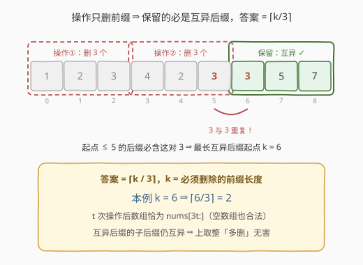
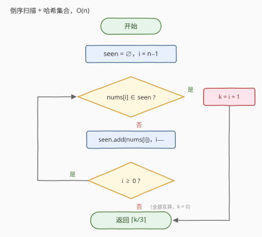

# LeetCode 使数组元素互不相同所需的最少操作次数 题解

## 1. 题目概述

- **标题 / 题号**：使数组元素互不相同所需的最少操作次数（#3396，easy）
- **链接**：https://leetcode.cn/problems/minimum-number-of-operations-to-make-elements-in-array-distinct/
- **难度**：简单
- **标签**：数组、哈希表、倒序扫描

**题意**：给你一个整数数组 `nums`，你需要确保数组中的元素**互不相同**。为此，你可以执行以下操作任意次：

- **从数组的开头移除 3 个元素**。如果数组中元素少于 3 个，则移除所有剩余元素。

注意：**空数组也视作为数组元素互不相同**。返回使数组元素互不相同所需的**最少操作次数**。

**示例 1**：

```text
输入：nums = [1,2,3,4,2,3,3,5,7]
输出：2
解释：第一次操作：移除前 3 个元素，数组变为 [4, 2, 3, 3, 5, 7]。
      第二次操作：再次移除前 3 个元素，数组变为 [3, 5, 7]，此时数组中的元素互不相同。
```

**示例 2**：

```text
输入：nums = [4,5,6,4,4]
输出：2
解释：第一次操作：移除前 3 个元素，数组变为 [4, 4]。
      第二次操作：移除所有剩余元素，数组变为空。
```

**示例 3**：

```text
输入：nums = [6,7,8,9]
输出：0
解释：数组中的元素已经互不相同，因此不需要进行任何操作。
```

**约束**：

- $1 \le nums.length \le 100$
- $1 \le nums[i] \le 100$

> 💡 **读题关键**：① 操作**只能从开头删**、每次**恰好 3 个**（不足 3 个则删光）——这决定了最终数组只能是原数组的**后缀**；② **空数组合法**，说明答案永远存在（大不了全删光），上界为 $\lceil n/3 \rceil$。

## 2. 解题思路

### 2.1 暴力思路：枚举操作次数，逐轮检查

官方 hint 也明示了暴力可行（$n \le 100$）。注意到 $t$ 次操作后数组**恰好**是 $nums[3t:]$（删光后为空），于是直接枚举 $t = 0, 1, 2, \dots$，每轮用哈希集合检查后缀是否互异：

```python
t = 0
while True:
    rest = nums[3 * t:]
    if len(set(rest)) == len(rest):   # 空数组天然成立
        return t
    t += 1
```

单轮检查 $O(n)$，最多 $\lceil n/3 \rceil + 1$ 轮，总量 $O(n^2/3) \approx 3.3 \times 10^3$，稳过。但「每轮从头重查」浪费明显——上一轮扫过的信息全丢了，而每个位置的判重结论其实**永远不变**。

### 2.2 核心观察：保留的必然是后缀，答案 = ⌈k/3⌉



两个观察把问题压缩成一趟扫描：

1. **操作只删前缀 ⇒ 最终数组是原数组的后缀**。$t$ 次操作后数组恰为 $nums[\min(3t, n):]$，「可达终点」集合就是 $\{nums[3t:] \mid t \ge 0\}$。求最少操作次数等价于求**最小**的 $t$ 使 $nums[3t:]$ 互异；
2. **互异性对起点右移单调**：互异数组的任何子后缀仍互异（空数组也合法）。设**最长互异后缀**的起点为 $k$（删除前 $k$ 个元素后恰好互异），则 $nums[j:]$ 互异 $\iff j \ge k$，于是

$$
\text{答案} \;=\; \min\{\, t \ge 0 : 3t \ge k \,\} \;=\; \left\lceil \frac{k}{3} \right\rceil
$$

> ⚠️ 上取整意味着可能「多删」：如示例 2 中 $k = 4$，$\lceil 4/3 \rceil = 2$ 次操作删掉 $6$ 个元素（数组直接清空）。多删**无害**——保留部分是互异后缀的子后缀，仍然互异。

**如何求 $k$**：**倒序扫描 + 哈希集合**。从右往左遍历，遇到第一个「右边已经出现过」的值就停：该下标 $i$ 是**最晚必须删除**的元素（它与右侧某元素构成重复对，任何包含 $i$ 的后缀都不互异），而 $i$ 右侧在扫描中已逐一验证互异，故 $k = i + 1$；若一路扫完无重复，则 $k = 0$。

### 2.3 算法流程图



单层循环，每个元素至多一次哈希查询 + 一次插入，整体一趟从右往左扫完。

### 2.4 示例演算

**示例 1**：`nums = [1,2,3,4,2,3,3,5,7]`，倒序扫描：

| 扫描下标 $i$ | $nums[i]$ | 扫描前的 seen | 判定 |
|---|---|---|---|
| 8 | 7 | $\{\}$ | 新值，加入 |
| 7 | 5 | $\{7\}$ | 新值，加入 |
| 6 | 3 | $\{5,7\}$ | 新值，加入 |
| 5 | 3 | $\{3,5,7\}$ | **重复！停止** |

$i = 5 \Rightarrow k = 6$，答案 $\lceil 6/3 \rceil = \mathbf{2}$ ✓

**示例 2**：`[4,5,6,4,4]`：$i=4$ 加入 4；$i=3$ 遇 4 重复停止 $\Rightarrow k = 4$，答案 $\lceil 4/3 \rceil = \mathbf{2}$ ✓（第二次操作删光剩余 2 个元素，空数组合法）

**示例 3**：`[6,7,8,9]`：一路扫到 $i = -1$ 无重复 $\Rightarrow k = 0$，答案 $\mathbf{0}$ ✓

## 3. 参考代码

### C++

```cpp
class Solution {
  public:
    int minimumOperations(vector<int>& nums) {
        unordered_set<int> seen;
        int i = (int)nums.size() - 1;
        for (; i >= 0; i--) {
            if (seen.count(nums[i])) break; // nums[i] 在右侧重复出现：[0..i] 必须全删
            seen.insert(nums[i]);
        }
        int k = i + 1;          // 最长互异后缀的起点 = 需删除的元素个数
        return (k + 2) / 3;     // 上取整 ⌈k/3⌉
    }
};
```

### Python

```python
class Solution:
    def minimumOperations(self, nums: List[int]) -> int:
        seen = set()
        i = len(nums) - 1
        while i >= 0 and nums[i] not in seen:
            seen.add(nums[i])
            i -= 1
        k = i + 1               # 需删除的前缀长度
        return (k + 2) // 3     # ⌈k/3⌉
```

> 💡 循环结束时 `i` 要么指向「右侧重复」的下标（$k = i+1$），要么为 $-1$（$k = 0$，恰好 $(0+2)//3 = 0$），两种情况被 `k = i + 1` 统一收编，无需特判。

## 4. 复杂度分析

| 维度 | 复杂度 | 说明 |
|------|--------|------|
| **时间复杂度** | $O(n)$ | 倒序单趟扫描，每个元素至多一次哈希查询 + 插入 |
| **空间复杂度** | $O(\min(n, V))$ | 哈希集合最多存 $\min(n, V)$ 个值，$V = 100$ 为值域上限 |

> 💡 本题 $n \le 100$，2.1 的 $O(n^2/3)$ 暴力完全够用；但「倒序找最长互异后缀」是无条件最优写法，且把「为什么删这么多恰好够」讲得明明白白。

## 5. 扩展：值域数组与等价视角

- **值域数组代替哈希表**：$1 \le nums[i] \le 100$，用 `bool seen[101]` 即可，空间降为常数、查询更快——与 [217 存在重复元素](../0201-0300/217_存在重复元素.md) 一脉相承的优化：

```cpp
bool seen[101] = {};
```

- **正向视角（等价）**：对每个出现次数 $\ge 2$ 的值 $v$，设其**倒数第二次**出现位置为 $p$，则后缀起点必须 $> p$ 才能把 $v$ 删得只剩最后一次出现，于是 $k = 1 + \max\limits_{v} p$。正序一趟记录「倒数第二次出现位置」同样可得 $k$，只是倒序写起来更顺；
- **操作变体**：若每次删前 $k'$ 个，答案变为 $\lceil k/k' \rceil$，套路不变；若允许从**任意位置**删除，则每个值留一个即可，答案 = $n - $ 不同值的个数（正是 [2716 最小化字符串长度](../2701-2800/2716_最小化字符串长度.md) 的模型）。

## 6. 面试要点

1. **为什么最终数组一定是原数组的后缀？**

   - 操作语义是「从开头移除 3 个（不足则删光）」，永远不碰尾部；$t$ 次操作后数组恰为 $nums[\min(3t, n):]$，后缀起点的合法集合是 $\{0, 3, 6, \dots\}$。

2. **为什么倒序扫到第一个重复就能确定 $k$，不怕漏掉更靠右的约束？**

   - 停止下标 $i$ 与其右侧某位置构成重复对，任何起点 $\le i$ 的后缀都包含这对重复，全不可行；而 $i$ 右侧在扫描过程中已逐一验证互异，故 $k = i + 1$ 恰是最左可行起点。

3. **上取整「多删」了怎么办？**

   - 多删只是让保留的后缀更短，而**互异数组的子后缀仍互异**（空数组也合法），所以 $\lceil k/3 \rceil$ 一定可行；又因 $3t < k$ 时后缀必含重复对，它同时也是下界。

4. **正序做这题会遇到什么麻烦？**

   - 正序扫只能发现「左侧已有重复」，但该删多少取决于重复值**最晚**的冲突位置，需要额外记录每个值倒数第二次出现位置再取 max，容易绕晕；倒序天然先看「保留段」，逻辑更直接。

5. **如果值域很大（如 $10^9$）或元素是字符串呢？**

   - 值域数组方案失效，回到哈希集合；时间仍是 $O(n)$，只是空间常数变大。本题解法不依赖值域大小，这点值得主动向面试官点明。

> 💡 **一句话总结**：倒序扫一趟找到最长互异后缀的起点 $k$（遇到右侧重复即停），答案就是 $\lceil k/3 \rceil$，$O(n)$ 时间收工。

## 同类练习题

| # | 题目 | 与本题的关联 |
|---|------|-------------|
| 217 | [存在重复元素](https://leetcode.cn/problems/contains-duplicate/)（[题解](../0201-0300/217_存在重复元素.md)） | 互异性判定的最小形态，哈希集合判重的基本功 |
| 219 | [存在重复元素 II](https://leetcode.cn/problems/contains-duplicate-ii/)（[题解](../0201-0300/219_存在重复元素II.md)） | 给重复加上「距离 ≤ k」的约束，滑窗 + 哈希 |
| 287 | [寻找重复数](https://leetcode.cn/problems/find-the-duplicate-number/)（[题解](../0201-0300/287_寻找重复数.md)） | 值域 $[1, n]$ 下的重复定位，抽屉原理 / 二分 / 快慢指针 |
| 2206 | [将数组划分成相等数对](https://leetcode.cn/problems/divide-array-into-equal-pairs/)（[题解](../2201-2300/2206_将数组划分成相等数对.md)） | 哈希计数判定每个值恰好出现偶数次 |
| 2716 | [最小化字符串长度](https://leetcode.cn/problems/minimize-string-length/)（[题解](../2701-2800/2716_最小化字符串长度.md)） | 同为「删到互异」，但允许任意位置删除，答案退化为不同值个数 |
