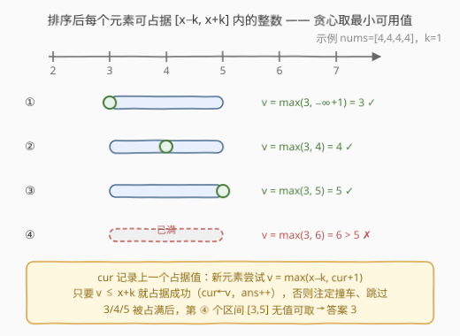
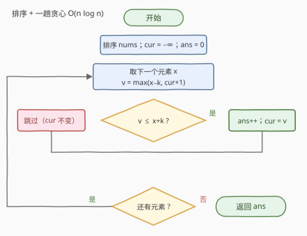

# 执行操作后不同元素的最大数量

- **题目名称**：执行操作后不同元素的最大数量
- **链接**：[3397. 执行操作后不同元素的最大数量](https://leetcode.cn/problems/maximum-number-of-distinct-elements-after-operations/)
- **难度**：中等
- **标签**：贪心、数组、排序
- **关联**：[945. 使数组唯一的最小增量](https://leetcode.cn/problems/minimum-increment-to-make-array-unique/) 是同一「排序 + cur+1」骨架的姊妹题（目标换成最小总增量）；[1846. 减小和重新排列数组后的最大元素](https://leetcode.cn/problems/maximum-element-after-decreasing-and-rearranging/) 同为「每个值尽量取小、给后面留空间」的贪心

## 1. 题目概述

给你一个整数数组 `nums` 和一个整数 `k`。你可以对数组中的每个元素**最多执行一次**以下操作：

> 将一个在范围 `[-k, k]` 内的整数加到该元素上。

返回执行这些操作后，`nums` 中可能拥有的**不同元素的 maximum 数量**。

**示例 1**：

```text
输入：nums = [1,2,2,3,3,4], k = 2
输出：6
解释：对前四个元素执行操作，nums 变为 [-1, 0, 1, 2, 3, 4]，可以获得 6 个不同的元素。
```

**示例 2**：

```text
输入：nums = [4,4,4,4], k = 1
输出：3
解释：对 nums[0] 加 -1，以及对 nums[1] 加 1，nums 变为 [3, 5, 4, 4]，可以获得 3 个不同的元素。
```

**约束条件**：

- $1 \le nums.length \le 10^5$
- $1 \le nums[i] \le 10^9$
- $0 \le k \le 10^9$

> 💡 **读题关键**：① 「最多执行一次」意味着**不操作也行**——不操作等价于加 $0$，而 $0 \in [-k, k]$（注意 $k \ge 0$），所以每个元素的最终值就是区间 $[x-k,\ x+k]$ 内的**任意整数**；② 数组顺序无关紧要，我们只关心最终能凑出多少个互不相同的值；③ $k$ 可达 $10^9$，任何依赖值域（桶、DP 值下标）的做法直接出局。

---

## 2. 解题思路

### 2.1 朴素思路：枚举选值，指数级爆炸

每个元素有 $2k+1$ 种最终值可选，想让它们互不相同——最直白的想法是枚举：

1. **暴力枚举**：对每个元素逐一试 $[x-k, x+k]$ 内所有值，用集合判重，$O((2k+1)^n)$ 的组合爆炸，$n = 10^5$、$k = 10^9$ 下毫无希望；
2. **DP**：排序后定义 $dp[i][v]$ 为「前 $i$ 个元素、最后一个占据值为 $v$」的最大数量——值 $v$ 的范围约 $2 \times 10^9$，状态数组开不出来；
3. **二分图匹配**：元素向值域连边（$v \in [x-k, x+k]$ 即有边），求最大匹配——概念上正确，但值域离散化后边数仍是 $O(n^2)$ 级别，$n = 10^5$ 同样不可行。

三条路都被「$n$ 大、值域大」堵死，说明本题考察的不是搜索或匹配的技巧，而是一个**贪心性质**。

### 2.2 核心观察：排序 + 贪心占据最小可用值



把题意翻译成「区间选点」语言：元素 $x$ 能占据的值恰是整数区间 $[x-k,\ x+k]$，我们要给尽可能多的元素各分配一个**互不相同**的值。两个观察拼出贪心：

1. **排序后，占据值可以要求递增**。设排序后 $x_i \le x_j$（$i < j$），若某方案中它们占据的值 $p_i > p_j$，则一定可以交换：$p_j < p_i \le x_i + k \le x_j + k$ 且 $p_j \ge x_j - k \ge x_i - k$，说明 $p_j$ 也落在元素 $i$ 的区间内；同理 $p_i$ 落在元素 $j$ 的区间内。**逆序对总能交换消除**，故存在占据值随排序下标严格递增的最优方案；
2. **每个元素取「能取的最小值」**。在递增方案里，处理元素 $x$ 时它必须取大于前一个占据值 `cur` 的最小可用值，即 $v = \max(x-k,\ cur+1)$：
   - 若 $v \le x+k$：占据成功，`cur ← v`，答案 +1；
   - 若 $v > x+k$（即 $x+k \le cur$）：整个区间被压在 `cur` 之下，此元素注定无法贡献新值，**跳过且不更新 cur**。

取最小值的直觉：占据的值越小，给**后面所有更大元素**留出的空间越大——排序后后续区间的左端点 $x' - k$ 只会更大，压缩前方占据值永远不会让后面更难受。归纳可得：贪心的第 $j$ 个占据值不超过任何递增最优方案的第 $j$ 个占据值，因此贪心成功数 $\ge$ 最优解。

### 2.3 算法流程图



排序是铺垫，主体是一趟扫描：

1. **排序** `nums`（从小到大），`cur = −∞`，`ans = 0`；
2. 依次取出元素 $x$，计算 $v = \max(x-k,\ cur+1)$；
3. **判定**：若 $v \le x+k$，占据成功——`ans++`、`cur = v`；否则跳过，`cur` 保持不变；
4. 扫描结束，返回 `ans`。

### 2.4 示例演算

**示例 1**：`nums = [1,2,2,3,3,4]`，`k = 2`（排序后不变）：

| 元素 $x$ | 区间 $[x-k, x+k]$ | $v = \max(x-k,\ cur+1)$ | 判定 | cur |
|---|---|---|---|---|
| 1 | $[-1, 3]$ | $\max(-1,\ -\infty) = -1$ | ✓ 占据 | $-1$ |
| 2 | $[0, 4]$ | $\max(0,\ 0) = 0$ | ✓ 占据 | $0$ |
| 2 | $[0, 4]$ | $\max(0,\ 1) = 1$ | ✓ 占据 | $1$ |
| 3 | $[1, 5]$ | $\max(1,\ 2) = 2$ | ✓ 占据 | $2$ |
| 3 | $[1, 5]$ | $\max(1,\ 3) = 3$ | ✓ 占据 | $3$ |
| 4 | $[2, 6]$ | $\max(2,\ 4) = 4$ | ✓ 占据 | $4$ |

全部占据，答案 **6** ✓（对应官方解释 `[-1, 0, 1, 2, 3, 4]`）。

**示例 2**：`nums = [4,4,4,4]`，`k = 1`：三个元素依次占据 $3, 4, 5$（cur 从 $-\infty \to 3 \to 4 \to 5$）；第 4 个元素 $v = \max(3,\ 6) = 6 > 4+1 = 5$，放不下，答案 **3** ✓。

---

## 3. 参考代码

### C++

```cpp
class Solution {
  public:
    int maxDistinctElements(vector<int>& nums, int k) {
        sort(nums.begin(), nums.end());
        long long cur = LLONG_MIN;   // 上一个占据值，初始 −∞
        int ans = 0;
        for (int x : nums) {
            long long v = max((long long)x - k, cur + 1);  // 最小可用值
            if (v <= (long long)x + k) {                   // 区间内 → 占据
                cur = v;
                ans++;
            }                                            // 否则跳过，cur 不变
        }
        return ans;
    }
};
```

### Python

```python
class Solution:
    def maxDistinctElements(self, nums: List[int], k: int) -> int:
        nums.sort()
        cur = -inf          # 上一个占据值，初始 −∞
        ans = 0
        for x in nums:
            v = max(x - k, cur + 1)   # 最小可用值
            if v <= x + k:            # 区间内 → 占据
                cur = v
                ans += 1
            # 否则跳过，cur 不变
        return ans
```

> 💡 **溢出提醒**：$nums[i] + k$ 最大 $2 \times 10^9$，恰好压在 `int` 边缘；而占据值 `cur` 累计到 $2 \times 10^9$ 后再 `+1` 就会溢出 `int`。C++ 里统一用 `long long` 计算最稳；Python 无此顾虑。

---

## 4. 复杂度分析

| 维度 | 复杂度 | 说明 |
|------|--------|------|
| **时间复杂度** | $O(n \log n)$ | 排序主导；一趟扫描每步仅常数次比较与赋值 |
| **空间复杂度** | $O(\log n)$ | 原地排序的递归栈开销（快排期望），不计输出仅用 `cur`/`ans` 两个变量 |

> 💡 $n \le 10^5$ 下 $O(n \log n)$ 约三百多万次比较，轻松通过；瓶颈全在排序，扫描本身是线性的。

---

## 5. 扩展：二分图匹配视角与霍尔定理

把「元素 → 值」看成二分图：左部是 $n$ 个元素，右部是整数，$x$ 与 $v$ 有边当且仅当 $v \in [x-k,\ x+k]$。本题求的正是**最大匹配数**：

- 一般二分图最大匹配需要匈牙利/$O(E\sqrt{V})$ 的 Hopcroft–Karp，但本题的边结构是**区间式**的（排序后每个元素连接一段连续区间），区间二分图的最大匹配恰可用「贪心取最小可用值」$O(n \log n)$ 求出——2.2 的贪心本质就是匹配算法在区间结构上的退化形式；
- 若问「**能否让全部 $n$ 个元素互不相同**」（即答案是否等于 $n$）：排序后逐个检查 $\max(x_i-k,\ cur+1) \le x_i+k$ 是否全程成立即可，等价于霍尔定理在区间族上的判定条件；
- 把目标从「最大化不同值的个数」换成「最小化总增量」，就得到 [945. 使数组唯一的最小增量](../0901-1000/945_使数组唯一的最小增量.md)：同样排序后取 $v = \max(x,\ cur+1)$，只是把「计数」换成「累加 $v - x$」，一行之差。

---

## 6. 面试要点

1. **为什么排序后每个元素取 $\max(x-k,\ cur+1)$ 是最优的？**

   - 排序后任意方案中占据值的逆序对可交换（$x_i \le x_j$ 时 $p_i > p_j$ 的两点互换仍落在彼此区间内），故存在占据值递增的最优方案；
   - 递增方案中每个元素必须取大于 `cur` 的值，取最小值 $\max(x-k,\ cur+1)$ 给后续更大的元素留出最大空间，归纳可证贪心不劣于任何递增最优方案。

2. **遇到「放不下」的元素为什么直接跳过、不更新 `cur`？跳过的元素去占据更小的空隙值会不会更优？**

   - 放不下即 $x+k \le cur$，元素无法取到任何大于 `cur` 的值；
   - 占据 `cur` 之下的空隙值看似可行，但由第 1 问的交换论证，任何方案都能改造成占据值递增的方案且数量不减——递增方案里该元素排在 `cur` 之后只能取更大的值，故它对「不同值总数」的贡献为零，跳过无损失。

3. **`k = 0` 时算法退化成什么？**

   - $v = \max(x,\ cur+1)$：每个元素要么取自己的原值，要么（撞车时）取 `cur+1` 但必然 $> x = x+k$ 而失败——于是答案恰为**原数组不同元素的个数**，贪心自然覆盖了纯去重场景。

4. **实现上有哪些坑？**

   - $nums[i] + k$ 可达 $2 \times 10^9$，`cur + 1` 会突破 `int` 上界，C++ 需 `long long`；
   - `cur` 初始值用极小哨兵（`LLONG_MIN` / `-inf`），别用 `nums[0] - k` 之类的「聪明初值」——第一个元素就该取 $x-k$；
   - 只排序原数组即可，不要额外开值域数组（$2 \times 10^9$ 开不出来）。

5. **和 [945. 使数组唯一的最小增量](../0901-1000/945_使数组唯一的最小增量.md) 是什么关系？**

   - 同一骨架「排序 + $v = \max(\text{下界},\ cur+1)$」：945 每个元素只能**加非负数**（下界为 $x$），目标是**最小化总增量**（累加 $v-x$）；本题可加可减（下界为 $x-k$），目标是**最大化不同值个数**（计数）。改动只有「下界」与「统计量」两处。

> 💡 **一句话总结**：排序后维护 `cur`（上一个占据值），每个元素贪心取 $v = \max(x-k,\ cur+1)$，$v \le x+k$ 则占据并 `ans++`，否则跳过——$O(n \log n)$ / $O(1)$ 收工。

---

## 7. 同类练习题

- [945. 使数组唯一的最小增量](https://leetcode.cn/problems/minimum-increment-to-make-array-unique/)（[题解](../0901-1000/945_使数组唯一的最小增量.md)）：完全相同的「排序 + cur+1」骨架，目标从最大计数换成最小总增量
- [1846. 减小和重新排列数组后的最大元素](https://leetcode.cn/problems/maximum-element-after-decreasing-and-rearranging/)（[题解](../1801-1900/1846_减小和重新排列数组后的最大元素.md)）：排序后每个值尽量取小（cur+1）给后面留空间的同款贪心直觉
- [2009. 使数组连续的最少操作次数](https://leetcode.cn/problems/minimum-number-of-operations-to-make-array-continuous/)（[题解](../2001-2100/2009_使数组连续的最少操作数.md)）：同样允许每个元素变成一段区间内的值，排序 + 滑动窗口视角
- [452. 用最少数量的箭引爆气球](https://leetcode.cn/problems/minimum-number-of-arrows-to-burst-balloons/)（[题解](../0401-0500/452_用最少数量的箭引爆气球.md)）：经典区间选点贪心，与本题「区间族上取互异整点」互为镜像问题
- [1296. 划分数组为连续数字的集合](https://leetcode.cn/problems/divide-array-in-sets-of-k-consecutive-numbers/)（[题解](../1201-1300/1296_划分数组为连续数字的集合.md)）：排序贪心构造连续占据值的变体，同样靠「先到先得占最小可用值」保证正确性
