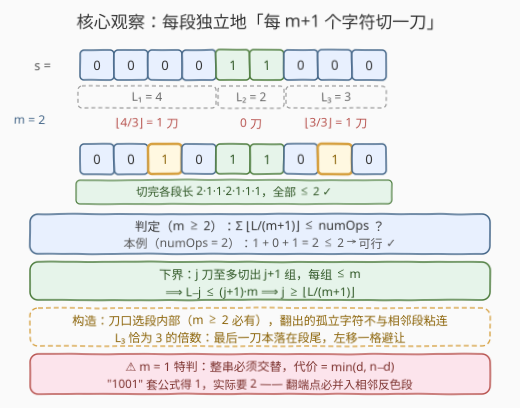
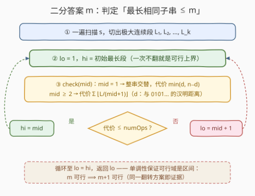

# LeetCode 字符相同的最短子字符串 I 题解

- **关联**：与 [410. 分割数组的最大值](https://leetcode.cn/problems/split-array-largest-sum/)（[站内题解](../0401-0500/410_分割数组的最大值.md)）同属「二分答案 + 判定」家族，判定函数是「按极大连续段贪心计数」；孪生题 3399（II）仅放大数据范围

## 1. 题目概述

- **标题 / 题号**：字符相同的最短子字符串 I（#3398，hard）
- **链接**：https://leetcode.cn/problems/smallest-substring-with-identical-characters-i/
- **难度**：困难
- **标签**：数组、二分查找、枚举

**题意**：给你一个长度为 $n$ 的二进制字符串 $s$ 和一个整数 $numOps$。

你可以对 $s$ 执行以下操作，**最多 $numOps$ 次**：

- 选择任意下标 $i$（$0 \le i < n$），**翻转** $s[i]$（`'1'` 变 `'0'`，`'0'` 变 `'1'`）。

你需要**最小化** $s$ 的最长**相同子字符串**的长度（相同子字符串指所有字符都相同的子字符串）。

返回执行所有操作后可获得的**最小**长度。

**示例 1**：

```text
输入：s = "000001", numOps = 1
输出：2
解释：将 s[2] 改为 '1'，s 变为 "001001"。
最长的所有字符相同的子串为 s[0..1] 和 s[3..4]，长度 2。
```

**示例 2**：

```text
输入：s = "0000", numOps = 2
输出：1
解释：将 s[0] 和 s[2] 改为 '1'，s 变为 "1010"。
```

**示例 3**：

```text
输入：s = "0101", numOps = 0
输出：1
```

**约束**：

- $1 \le n = s.length \le 1000$
- $s$ 仅由 `'0'` 和 `'1'` 组成
- $0 \le numOps \le n$

> 💡 **读题关键**：① 典型 **min-max 结构**——「最小化最大段长」，第一反应往二分答案上想；② 翻转会**产生相反字符**，翻在段端点时会与相邻的反色段**合并**，这是判定函数里最大的坑；③ $numOps$ 是「至多」而非「恰好」，能用更少翻转当然更好。

## 2. 解题思路

### 2.1 暴力思路：枚举翻转集合

最直接的想法是枚举翻转哪些下标：$\binom{n}{numOps}$ 种组合直接爆炸。真正值得抓的是**单调性**——若「最长相同子串 $\le m$」可达成，则同一个翻转方案也满足 $\le m+1$，即 $m+1$ 必可行。可行域于是形如 $[ans,\ n]$ 的布尔区间，**二分答案**水到渠成。

剩下唯一的问题：给定 $m$，如何 $O(n)$ 判定「至多 $numOps$ 次翻转能否让最长相同子串 $\le m$」？

### 2.2 核心观察：按极大连续段独立计数 $\lfloor L/(m+1) \rfloor$



先把 $s$ 一遍扫描切成若干**极大连续段**（极大 run，字符相同且不可再向两端延伸），段长记为 $L_1, L_2, \dots, L_k$。翻转某个下标只会影响它所在的段，因此各段可以**独立分析**。

**下界（必要性）**：固定一段长 $L$ 的段，设最终方案在它内部翻了 $j$ 个位置，则段内未翻转的 $L - j$ 个字符被切成至多 $j + 1$ 个连续组；每组都落在最终某个长度 $\le m$ 的段里，故每组长度 $\le m$，于是

$$L - j \le (j+1)\,m \quad\Longrightarrow\quad j \ge \left\lceil \frac{L-m}{m+1} \right\rceil = \left\lfloor \frac{L}{m+1} \right\rfloor$$

各段翻转互不共享，求和即得总翻转数的下界 $\sum_i \lfloor L_i/(m+1) \rfloor$。

**上界（构造）**：$m \ge 2$ 时，每段独立地「**每 $m+1$ 个字符切一刀**」，刀口（翻转位）选在**段内部**——翻出的孤立反色字符两侧仍是本段字符，不会与相邻段粘连。当 $L$ 恰为 $m+1$ 的整数倍时，标准刀口会落在段尾，把这一刀**左移一格**即可（$m \ge 2$ 保证段内必有非端点位置）。两个方向夹住，判定函数就是：

$$\text{check}(m):\ \sum_{i=1}^{k} \left\lfloor \frac{L_i}{m+1} \right\rfloor \le numOps$$

**$m = 1$ 必须特判**：最长相同子串 $\le 1$ 等价于整串**严格交替**，最终串只能是 $0101\cdots$ 或 $1010\cdots$ 之一。设 $d$ 为 $s$ 与 $0101\cdots$ 的汉明距离，则最小代价 $= \min(d,\ n - d)$。此时**不能**套 $\lfloor L/2 \rfloor$ 公式：长度为 2 的段没有「内部」位置，翻端点必然并入相邻反色段。反例：$s = \text{"1001"}$，公式给 $0+1+0 = 1$，但无论翻哪一位（`0001`/`1101`/`1011`/`1000`）最长段都是 2，实际需要 **2** 次。

> ⚠️ **合并陷阱一句话**：翻在段内部 → 孤立反色字符，安全；翻在段端点 → 并入相邻反色段，可能弄巧成拙。$m \ge 2$ 时内部位置总存在，$m = 1$ 时不存在，所以 $m=1$ 单独走交替判定。

### 2.3 算法流程图



整体三步走：一遍扫描取段长（$O(n)$）$\to$ 在 $[1,\ \text{初始最长段}]$ 上二分 $m$ $\to$ 每轮 $O(k)$ 判定。二分上界取**初始最长段**：一次都不翻它就是现成的可行解，比 $n$ 更紧。

### 2.4 示例演算

以示例 1 `s = "000001", numOps = 1` 为例，段长 $[5, 1]$：

1. **试 $m = 2$**：$\lfloor 5/3 \rfloor + \lfloor 1/3 \rfloor = 1 + 0 = 1 \le 1$ → **可行** ✓（翻第 3 个 `0` 得 `"001001"`）；
2. **试 $m = 1$**：$s$ 与 `010101` 逐位比较，$d = 2$（第 2、4 位），$\min(2, 4) = 2 > 1$ → **不可行** ✗。

答案 $2$。示例 2 `"0000", numOps=2`：$m=1$ 时 $d = 2$，$\min(2,2) = 2 \le 2$ 可行，答案 1。示例 3 本来就交替，$d = 0$，答案 1。

## 3. 参考代码

### C++

```cpp
class Solution {
  public:
    int minLength(string s, int numOps) {
        int n = s.size();
        vector<int> runs;                        // 极大连续段长
        for (int i = 0; i < n;) {
            int j = i;
            while (j < n && s[j] == s[i]) j++;
            runs.push_back(j - i);
            i = j;
        }

        auto check = [&](int m) -> bool {
            if (m == 1) {                        // 最终串必须整体交替
                int d = 0;
                for (int k = 0; k < n; k++)
                    d += (s[k] != '0' + k % 2);  // 与 0101… 的汉明距离
                return min(d, n - d) <= numOps;
            }
            int ops = 0;
            for (int L : runs) {
                ops += L / (m + 1);              // 每段每 m+1 个字符需要一刀
                if (ops > numOps) return false;  // 提前剪枝
            }
            return true;
        };

        int lo = 1, hi = *max_element(runs.begin(), runs.end());
        while (lo < hi) {                        // 不翻转即已达成 hi
            int mid = lo + (hi - lo) / 2;
            if (check(mid)) hi = mid;
            else lo = mid + 1;
        }
        return lo;
    }
};
```

### Python

```python
class Solution:
    def minLength(self, s: str, numOps: int) -> int:
        n = len(s)
        runs = []                                # 极大连续段长
        i = 0
        while i < n:
            j = i
            while j < n and s[j] == s[i]:
                j += 1
            runs.append(j - i)
            i = j

        def check(m: int) -> bool:
            if m == 1:                           # 最终串必须整体交替
                d = sum(c != '01'[k % 2] for k, c in enumerate(s))
                return min(d, n - d) <= numOps
            return sum(L // (m + 1) for L in runs) <= numOps

        lo, hi = 1, max(runs)                    # 不翻转即已达成 hi
        while lo < hi:
            mid = (lo + hi) // 2
            if check(mid):
                hi = mid
            else:
                lo = mid + 1
        return lo
```

> 💡 **实现细节**：① `check` 里 $m = 1$ 走交替判定，其余走公式，两个分支别混；② 二分上界用初始最长段而非 $n$，少几轮循环且语义清晰；③ `d` 与 `n - d` 分别对应两种交替模式，取小者。本解法与「枚举全部翻转子集」的暴力在小规模（$n \le 12$）对拍 16000+ 组全部一致。

## 4. 复杂度分析

| 维度 | 复杂度 | 说明 |
|------|--------|------|
| 时间 | $O(n \log n)$ | 预处理段长 $O(n)$；二分 $O(\log n)$ 轮，每轮判定 $O(k)$（$k \le n$ 为段数），$m=1$ 分支的 $O(n)$ 至多执行一次 |
| 空间 | $O(n)$ | 段长列表（也可边扫边算压到 $O(1)$，但 $m=1$ 分支需要原串，反正串本身就有 $O(n)$） |
| 暴力对照 | $O\bigl(\binom{n}{numOps} \cdot n\bigr)$ | 枚举翻转子集，仅适合小规模对拍 |

## 5. 扩展：DP 判定与 II 版

- **统一判定（官方 hint 的做法）**：若不想特判 $m=1$，可把判定写成 DP——$f[i][c][l]$ 表示前 $i$ 位、第 $i$ 位字符为 $c$ 且当前段已连续 $l$ 位的代价，转移时限制 $l \le m$。它对所有 $m$ 一致成立（$m=1$ 时自然退化为交替判定），代价是单次判定 $O(n \cdot m)$。**贪心公式 $\lfloor L/(m+1) \rfloor$ 是这个 DP 的解析闭式解**——理解了公式就不必写 DP。
- **3399（II）**：孪生题，仅把 $n$ 放大到 $10^5$ 量级。本解法 $O(n \log n)$ 直接平移，无需任何改动；若追求极致还可把二分换成对段长的「值域枚举 + 排序跳跃」，但收益有限。
- **合并陷阱的普适性**：凡是「翻转/修改产生与邻居同色的字符」的题（如染色调色、翻转子数组），都要先问一句——**修改处的字符会不会和邻居连成更长的段**？本题 $m \ge 2$ 靠「选内部位置」绕开，$m = 1$ 绕不开，只能换判定。

## 6. 面试要点

1. **为什么可以二分答案？**

   - 单调性：若最长相同子串 $\le m$ 可达成，则同一翻转方案也让 $\le m+1$ 达成。可行域是 $[1, n]$ 上的「后半段为真」的布尔区间，标准二分找第一个真值。

2. **$\lfloor L/(m+1) \rfloor$ 这个数是怎么夹出来的？**

   - 下界：$j$ 次翻转至多把段内未翻字符切成 $j+1$ 组，每组 $\le m$，得 $L - j \le (j+1)m$；上界：「每 $m+1$ 切一刀 + 刀口选内部」的显式构造恰好用这么多刀。两边相等。

3. **$m = 1$ 为什么要特判？怎么判？**

   - 长度为 2 的段没有内部位置，任何翻转都在端点，必然并入相邻反色段（"1001" 需 2 刀而非公式算的 1 刀）。正确判定是整串交替：代价 $= \min(d,\ n-d)$，$d$ 为与 $0101\cdots$ 的汉明距离。

4. **刀口选段内部，为什么就不会与相邻段合并？**

   - 内部位置的左右邻居都是本段字符，翻出的反色字符被「隔离」成孤立段（长度 1 $\le m$）；只有贴着段端点翻才会与相邻反色段首尾相连。这也是倍数段要把最后一刀左移一格的原因。

5. **二分的上下界怎么定？**

   - 下界 1（$numOps$ 充足时的理论极限）；上界取**初始最长段**——一次不翻就是可行方案，既收紧了循环次数，也免去了对 $check(n)$ 恒真的额外论证。

## 同类练习题

| # | 题目 | 与本题的关联 |
|---|------|-------------|
| 3399 | [字符相同的最短子字符串 II](https://leetcode.cn/problems/smallest-substring-with-identical-characters-ii/)（[站内题解](../3301-3400/3399_字符相同的最短子字符串II.md)） | 孪生题，仅放大 $n$，本篇解法直接平移 |
| 410 | [分割数组的最大值](https://leetcode.cn/problems/split-array-largest-sum/)（[站内题解](../0401-0500/410_分割数组的最大值.md)） | 二分答案 + 贪心判定的模板题，对照体会判定函数的换壳 |
| 875 | [爱吃香蕉的珂珂](https://leetcode.cn/problems/koko-eating-bananas/)（[站内题解](../0801-0900/875_爱吃香蕉的珂珂.md)） | 最基础的 $O(n)$ 验证型二分答案 |
| 1011 | [在 D 天内送达包裹的能力](https://leetcode.cn/problems/capacity-to-ship-packages-within-d-days/)（[站内题解](../1001-1100/1011_在D天内送达包裹的能力.md)） | 同模板，判定函数换成顺序贪心装箱 |
| 2439 | [最小化数组中的最大值](https://leetcode.cn/problems/minimize-maximum-of-array/)（[站内题解](../2401-2500/2439_最小化数组中的最大值.md)） | min-max 结构 + 操作次数约束的另一种判定姿势 |
