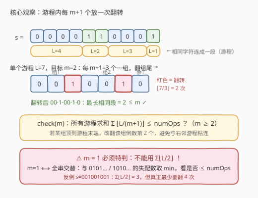
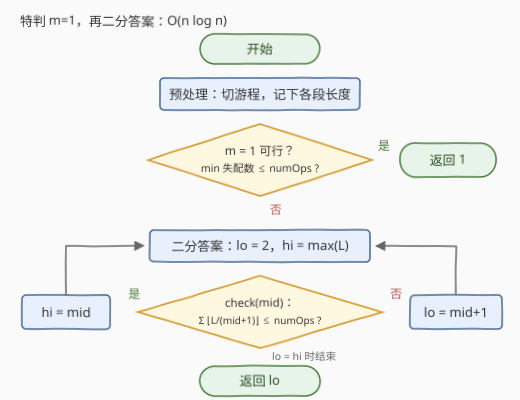

# LeetCode 字符相同的最短子字符串 II 题解

- **关联**：[3398. 字符相同的最短子字符串 I](https://leetcode.cn/problems/smallest-substring-with-identical-characters-i/) 是同题意的小数据版（$n \le 1000$），无需精细分析复杂度也能过；本题 $n \le 10^5$，必须把判定压到 $O(n)$ 并二分答案

## 1. 题目概述

- **标题 / 题号**：字符相同的最短子字符串 II（#3399，hard）
- **链接**：https://leetcode.cn/problems/smallest-substring-with-identical-characters-ii/
- **难度**：困难
- **标签**：字符串、二分查找、贪心

**题意**：给定长度为 $n$ 的二进制字符串 $s$ 和整数 $numOps$。每次操作可以任选一个下标 $i$（$0 \le i < n$），翻转 $s[i]$：`'0'` 变 `'1'`，`'1'` 变 `'0'`。最多执行 $numOps$ 次操作。

**相同子字符串**是指所有字符都相同的子字符串。要求经操作后，$s$ 的**最长相同子字符串**长度尽可能小，返回这个最小长度。

**示例 1**：

```text
输入：s = "000001", numOps = 1
输出：2
解释：将 s[2] 翻转为 '1'，s 变为 "001001"，最长的相同子串为 s[0..1] 和 s[3..4]，长度 2。
```

**示例 2**：

```text
输入：s = "0000", numOps = 2
输出：1
解释：将 s[0] 和 s[2] 翻转为 '1'，s 变为 "1010"，最长相同子串长度 1。
```

**示例 3**：

```text
输入：s = "0101", numOps = 0
输出：1
```

**约束**：

- $1 \le n = s.length \le 10^5$
- $s$ 仅由 `'0'` 和 `'1'` 组成
- $0 \le numOps \le n$

> 💡 **读题关键**：① 问的是「**最多**花 $numOps$ 次代价，能把最长相同段压到多短」，代价可以不用完；② 二进制串里翻转一个字符会同时**拆开**它所在的同色段、又可能与**相邻的异色段**粘连——这是本题所有陷阱的源头；③ $n$ 达 $10^5$，任何「枚举翻转位置」或「逐个答案全量模拟」的做法都不可行。

## 2. 解题思路

### 2.1 暴力思路：枚举翻转集合，指数爆炸

最直白的想法是枚举「翻哪些位置」：$n$ 个位置每个翻或不翻，$O(2^n \times n)$ 直接爆炸。退一步，从小到大枚举答案 $m$，对每个 $m$ 写一个判定「$numOps$ 次内能否让最长相同段 $\le m$」：

- 判定若用朴素的逐位贪心模拟，每次 $O(n)$，最坏枚举 $O(n)$ 个答案，总代价 $O(n^2) \approx 10^{10}$，在 $n = 10^5$ 下同样不可行。

突破口在于一个平凡的观察：**答案具有单调性**。

### 2.2 核心观察：二分答案 + 游程整除计数



**观察一：可行性关于 $m$ 单调，可以二分。** 若某个方案能让最长相同段 $\le m$，则同一方案也让它 $\le m+1$。于是「$m$ 可行」在 $[1, n]$ 上构成一段前缀区间，最小可行 $m$ 可以二分求出。答案上界取原串最长游程 $\max(L)$——它本身不需要任何操作。

**观察二：$m \ge 2$ 时，判定可以精确到整除公式。** 先把 $s$ 切成 $k$ 个**游程**（极大同色段），长度记为 $L_1, \dots, L_k$：

$$
\text{check}(m) \iff \sum_{i=1}^{k} \left\lfloor \frac{L_i}{m+1} \right\rfloor \le numOps
$$

两面论证：

- **下界（必要性）**：单独看一个长度为 $L$ 的游程，设其中发生了 $f$ 次翻转。剩下 $L - f$ 个原字符被 $f$ 个翻转点切成至多 $f + 1$ 段，每段长度不能超过 $m$，于是 $L - f \le m(f+1)$，解得 $f \ge \lfloor L/(m+1) \rfloor$。对所有游程求和即得总翻转次数的下界。
- **上界（构造）**：恰好用 $\lfloor L/(m+1) \rfloor$ 次也够——把游程按每 $m+1$ 个一组切分，**翻每组的最后一个**；若最后一组恰好顶到游程末端，就改翻**该组的倒数第二个**。这样每个翻出的字符两侧都是本游程的原字符（$m \ge 2$ 时它独占一段、长度 1），既拆开了长段，又不会与右邻游程粘连。

**观察三：$m = 1$ 必须特判，不能套用上式。** $m = 1$ 意味着任意相邻两字符都不同——二进制下**只有** `0101…` 和 `1010…` 两种交替串。最小代价就是与两种交替串的**失配数取 min**，与 $numOps$ 比较即可。

> ⚠️ 为什么不能把 $m=1$ 代入 $\sum \lfloor L/2 \rfloor$？因为该公式只是**下界**：构造依赖「翻出的字符被原字符隔离」，而 $m=1$ 时隔离字符自身也违反约束。反例 $s = \texttt{001001001}$：$\sum \lfloor L/2 \rfloor = 3$，但中间的 `"00"` 夹在 `"1"` 之间，翻转其中任意一个 `'0'` 都会和旁边的 `'1'` 粘成 `"11"`——实际最少要翻 **4** 次（与 `101010101` 的失配数）。

### 2.3 算法流程图



1. **预处理**：一趟扫描切出游程，得到 $L_1, \dots, L_k$ 与 $\max(L)$；
2. **特判 $m=1$**：计算与 `0101…`、`1010…` 两种交替串的失配数，取 min；若 $\le numOps$，直接返回 1；
3. **二分**：$lo = 2$，$hi = \max(L)$（此时必有 $\max(L) \ge 2$）；
4. **判定**：$\text{check}(mid) = \sum_i \lfloor L_i/(mid+1) \rfloor \le numOps$，可行则 $hi = mid$，否则 $lo = mid + 1$；
5. 循环结束返回 $lo$。

### 2.4 示例演算

以 **示例 1**（$s = \texttt{000001}$，$numOps = 1$）走完整流程。游程：$L = [5, 1]$。

**第一步：特判 $m = 1$。**

| 对照串 | 失配位置 | 失配数 |
|---|---|---|
| `010101` | 下标 1、3 | 2 |
| `101010` | 下标 0、2、4、5 | 4 |

$\min(2, 4) = 2 > 1$，$m = 1$ 不可行 ✗。

**第二步：二分 $m \in [2, 5]$。**

| 二分区间 | $mid$ | $\lfloor 5/(mid+1) \rfloor + \lfloor 1/(mid+1) \rfloor$ | 与 $numOps=1$ 比较 | 动作 |
|---|---|---|---|---|
| $[2, 5]$ | 3 | $1 + 0 = 1$ | $1 \le 1$ ✓ | $hi = 3$ |
| $[2, 3]$ | 2 | $\lfloor 5/3 \rfloor + 0 = 1$ | $1 \le 1$ ✓ | $hi = 2$ |

$lo = hi = 2$，返回 **2** ✓。对应构造正是官方解释：翻 $s[2]$ 得 `001001`，最长相同段为 2。

## 3. 参考代码

### C++

```cpp
class Solution {
  public:
    int minLength(string s, int numOps) {
        int n = s.size();
        vector<int> runs;
        for (int i = 0; i < n; ) {
            int j = i;
            while (j < n && s[j] == s[i]) j++;
            runs.push_back(j - i);
            i = j;
        }

        // 特判 m = 1：与两种交替串的失配数取 min
        int d0 = 0;  // 与 0101... 的失配数
        for (int i = 0; i < n; i++)
            d0 += (s[i] - '0') != (i & 1);
        if (min(d0, n - d0) <= numOps) return 1;

        // m >= 2：二分答案
        int lo = 2, hi = *max_element(runs.begin(), runs.end());
        while (lo < hi) {
            int mid = lo + (hi - lo) / 2, need = 0;
            for (int L : runs) need += L / (mid + 1);
            if (need <= numOps) hi = mid;
            else lo = mid + 1;
        }
        return lo;
    }
};
```

### Python

```python
from itertools import groupby

class Solution:
    def minLength(self, s: str, numOps: int) -> int:
        runs = [len(list(g)) for _, g in groupby(s)]

        # 特判 m = 1：与两种交替串的失配数取 min
        d0 = sum(int(c) != i % 2 for i, c in enumerate(s))
        if min(d0, len(s) - d0) <= numOps:
            return 1

        # m >= 2：二分答案
        def ok(m: int) -> bool:
            return sum(L // (m + 1) for L in runs) <= numOps

        lo, hi = 2, max(runs)
        while lo < hi:
            mid = (lo + hi) // 2
            if ok(mid):
                hi = mid
            else:
                lo = mid + 1
        return lo
```

> 💡 与 `1010…` 的失配数恰为 $n - d_0$：两种交替串逐位互补，一处必然恰与其中一个匹配，无需再扫一遍。特判通过后直接返回，后续二分区间 $[2, \max(L)]$ 一定非空（$m=1$ 不可行时 $\max(L) \ge 2$）。

## 4. 复杂度分析

| 维度 | 复杂度 | 说明 |
|------|--------|------|
| **时间复杂度** | $O(n \log n)$ | 切游程与失配统计各 $O(n)$；二分 $O(\log \max(L))$ 轮，每轮对 $k \le n$ 个游程求和 $O(k)$ |
| **空间复杂度** | $O(n)$ | 存游程长度数组（最坏 $k = n$，如 `0101…`，但这种情况下早已在特判处返回） |

## 5. 扩展：「二分答案」题型骨架

本题属于**二分答案**家族：不直接构造最优解，而是猜一个候选值 $m$，写一个**关于 $m$ 单调**的判定 `check`，用二分收缩值域。骨架固定为三步：

1. **识别单调性**：「最大值最小 / 最小值最大」类问题几乎都可二分，本题是「最小化最长段」；
2. **写 check**：往往是贪心或计数——本题是游程上的整除计数 $\sum \lfloor L_i/(m+1) \rfloor$；
3. **盯紧边界**：最小候选值（本题 $m=1$）常常不在统一公式覆盖范围内，需要单独验证。

- 经典原型：[410. 分割数组的最大值](../0401-0500/410_分割数组的最大值.md)——「最大值最小」的鼻祖，check 换成贪心切分段数；
- 变体：[875. 爱吃香蕉的珂珂](../0801-0900/875_爱吃香蕉的珂珂.md)（二分速度）、[1011. 在D天内送达包裹的能力](../1001-1100/1011_在D天内送达包裹的能力.md)（二分运力）、[2560. 打家劫舍IV](../2501-2600/2560_打家劫舍IV.md)（二分能力值 + 贪心 check）；
- 最接近本题气质的是 [2968. 执行操作使频率分数最大](../2901-3000/2968_执行操作使频率分数最大.md)：同样是「操作次数预算内最优目标」，二分目标后用另一种贪心验证。

## 6. 面试要点

1. **为什么可以二分答案？**

   - 可行性关于 $m$ 单调：能让最长相同段 $\le m$ 的方案，必然也让它 $\le m+1$；
   - 因此「可行」是值域上一段前缀，最小可行值可二分，区间 $[1, \max(L)]$。

2. **长度为 $L$ 的游程为什么恰好需要 $\lfloor L/(m+1) \rfloor$ 次翻转（$m \ge 2$）？**

   - 下界：$f$ 次翻转把 $L-f$ 个原字符切成至多 $f+1$ 段、每段 $\le m$，得 $L - f \le m(f+1)$，即 $f \ge \lfloor L/(m+1) \rfloor$；
   - 上界：每 $m+1$ 个一组、翻组尾的构造恰好用这么多，两面夹逼出精确值。

3. **为什么 $m = 1$ 不能套用 $\sum \lfloor L/2 \rfloor$？**

   - $m=1$ 的可行终态只能是 `0101…` / `1010…` 两种交替串，代价为失配数取 min；
   - $\sum \lfloor L/2 \rfloor$ 只是下界，构造会因翻出字符与相邻游程粘连而失败。反例 `001001001`：和为 3，实际需要 4 次。

4. **构造里「翻倒数第二个」是在防什么？**

   - 若最后一组翻的是游程最后一个字符，翻出的字符恰好贴着右邻异色游程，二者同色粘连成更长的段；
   - 改翻该组倒数第二个，翻出字符两侧都是本游程原字符，$m \ge 2$ 时天然被隔离。

5. **为什么游程之间可以独立计数、互不干扰？**

   - 下界论证按「翻转发生在哪个游程内」归属计数，天然可加；
   - 构造方案中所有翻转都落在游程内部（不贴两端），翻出字符被原字符包住，不跨游程产生影响。

> 💡 **一句话总结**：特判 $m=1$（交替串失配数取 min），再在 $[2, \max(L)]$ 上二分，`check(m) = Σ⌊Lᵢ/(m+1)⌋ ≤ numOps`，$O(n \log n)$ 收工。

## 同类练习题

| # | 题目 | 与本题的关联 |
|---|------|-------------|
| 3398 | [字符相同的最短子字符串 I](https://leetcode.cn/problems/smallest-substring-with-identical-characters-i/) | 同题意小数据版（$n \le 1000$），适合先写暴力再对照本题的二分优化 |
| 410 | [分割数组的最大值](https://leetcode.cn/problems/split-array-largest-sum/)（[题解](../0401-0500/410_分割数组的最大值.md)） | 「最大值最小」二分答案原型，check 为贪心切分 |
| 875 | [爱吃香蕉的珂珂](https://leetcode.cn/problems/koko-eating-bananas/)（[题解](../0801-0900/875_爱吃香蕉的珂珂.md)） | 二分速度使总耗时满足上限，与本题「预算内压指标」同构 |
| 2560 | [打家劫舍IV](https://leetcode.cn/problems/house-robber-iv/)（[题解](../2501-2600/2560_打家劫舍IV.md)） | 二分能力值 + 贪心 check，答案落在值域而非位置 |
| 2968 | [执行操作使频率分数最大](https://leetcode.cn/problems/apply-operations-to-maximize-frequency-score/)（[题解](../2901-3000/2968_执行操作使频率分数最大.md)） | 同样「操作次数预算内最优化目标」，二分目标后滑窗验证 |
