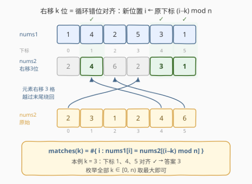
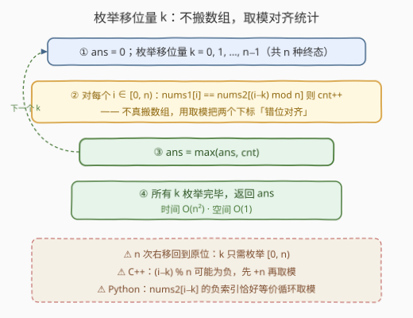

# 右移后的最大匹配索引数

- **题目名称**：右移后的最大匹配索引数
- **链接**：[3400. 右移后的最大匹配索引数](https://leetcode.cn/problems/maximum-number-of-matching-indices-after-right-shifts/)
- **难度**：中等
- **标签**：数组、双指针、模拟

## 1. 题目概述

> ⚠️ 本题为 LeetCode 付费题，题意描述根据官方示例用例与 hints 重建，可能与官方题面有出入。

给定两个长度均为 $n$ 的整数数组 $nums1$ 与 $nums2$。

**右移操作**：一次右移把数组的每个元素向右移动一位，最后一个元素绕回到第一个位置（即**循环右移**一位）。可以对 $nums2$ 执行**任意次**右移操作——由于 $n$ 次右移后数组复原，执行任意次等价于选定某个移位量 $k \in [0, n-1]$ 循环右移 $k$ 位。

操作完成后，若满足 $nums1[i] = nums2[i]$，则称下标 $i$ 为**匹配索引**。返回匹配索引数量的**最大值**。

**示例 1**：

```text
输入：nums1 = [3,1,2,3,1,2], nums2 = [1,2,3,1,2,3]
输出：6
解释：右移 1 次后 nums2 = [3,1,2,3,1,2]，与 nums1 完全相同，全部 6 个下标匹配。
```

**示例 2**：

```text
输入：nums1 = [1,4,2,5,3,1], nums2 = [2,3,1,2,4,6]
输出：3
解释：右移 3 次后 nums2 = [2,4,6,2,3,1]，下标 1、4、5 处与 nums1 相等（4、3、1），共 3 个匹配索引。
```

**约束条件**（依据官方 hint「模拟右移并检查相等元素个数」推断的小数据规模）：

- $1 \le n \le 1000$（量级推断，$O(n^2)$ 模拟可通过）
- 数组元素为整数

> 💡 **读题关键**：① 右移是**循环**的，$n$ 种移位量就把所有可能的终态枚举穷尽，「任意次」并不带来更多可能；② 移位只改变**下标对齐关系**、不改变元素本身——所以根本不需要真的搬运数组，取个模就能「错位对齐」比较。

---

## 2. 解题思路

### 2.1 暴力思路：一步步移，移一次比一遍

最直白的模拟：把右移 1 位真的执行 $n$ 次，每执行一次就把两个数组逐位比较、数一遍相等个数，全程维护最大值。设每次「右移 1 位」本身花 $O(n)$ 搬运、比较再花 $O(n)$，总共 $O(n^2)$——复杂度数量级其实已达标，但**搬运是纯浪费**：第 $k$ 轮的数组状态，本质只由「元素 $j$ 走到了位置 $(j+k) \bmod n$」这一条映射决定。

更糟的写法是每轮 `nums2 = nums2[-1:] + nums2[:-1]` 生成新数组再逐位比较——同样的复杂度，多了无谓的分配。

> 💡 优化的方向不是「移得更快」，而是**压根不移**：直接枚举总移位量 $k$，用下标映射公式完成对齐比较。

### 2.2 核心观察：右移 $k$ 位 = 下标环上错位 $k$ 格对齐



**右移 $k$ 位后的下标映射**：元素整体向后走 $k$ 步，等价于「位置 $i$ 上站的是原来的 $nums2[(i-k) \bmod n]$」——想看某个位置是谁，就把下标**向前（左）看 $k$ 格**，越过开头就绕到末尾。于是：

$$
\text{matches}(k) = \#\{\, i \in [0, n) : nums1[i] = nums2[(i-k) \bmod n] \,\}
$$

**答案**：

$$
\max_{0 \le k < n} \text{matches}(k)
$$

以示例 2 验证：$k=3$ 时新数组为 $[2,4,6,2,3,1]$（位置 $i$ 取原下标 $i-3 \bmod 6$：位置 0 取原下标 3 的 2，位置 1 取原下标 4 的 4，位置 2 取原下标 5 的 6……），与 $nums1 = [1,4,2,5,3,1]$ 在下标 1、4、5 匹配，共 3 个 ✓。

两个细节坑：

- **C++ 负数取模**：$(i-k) \% n$ 当 $i < k$ 时为负，需写成 $((i-k) \% n + n) \% n$ 或 $i-k+n$（$k < n$ 时一步到位）；
- **Python 负索引**恰好是免费的循环取模：`nums2[i-k]` 当 $i-k<0$ 时自动从尾部取，等价于 $(i-k) \bmod n$。

### 2.3 算法流程图



三步：初始化答案 → 枚举 $k$、对每个 $k$ 用取模对齐统计 $\text{matches}(k)$ → 取最大返回。

### 2.4 示例演算

以 **示例 2**（$nums1 = [1,4,2,5,3,1]$，$nums2 = [2,3,1,2,4,6]$，$n=6$）穷举全部 $k$：

| $k$ | 右移后 $nums2$ | 匹配下标 | $\text{matches}(k)$ |
|---|---|---|---|
| 0 | $[2,3,1,2,4,6]$ | 无 | 0 |
| 1 | $[6,2,3,1,2,4]$ | 无 | 0 |
| 2 | $[4,6,2,3,1,2]$ | 2 | 1 |
| **3** | $[2,4,6,2,3,1]$ | **1、4、5** | **3** |
| 4 | $[3,2,4,6,2,1]$ | 5 | 1 |
| 5 | $[1,3,2,4,6,2]$ | 0、2 | 2 |

最大值 **3**，在 $k=3$ 处取得 ✓。示例 1 则在 $k=1$ 处取得满分 6 ✓。

---

## 3. 参考代码

### C++

```cpp
class Solution {
  public:
    int maximumMatchingIndices(vector<int>& nums1, vector<int>& nums2) {
        int n = nums1.size(), ans = 0;
        for (int k = 0; k < n; ++k) {          // 枚举总移位量
            int cnt = 0;
            for (int i = 0; i < n; ++i)        // 取模对齐，不真搬数组
                cnt += nums1[i] == nums2[(i - k + n) % n];
            ans = max(ans, cnt);
        }
        return ans;
    }
};
```

### Python

```python
class Solution:
    def maximumMatchingIndices(self, nums1: List[int], nums2: List[int]) -> int:
        n = len(nums1)
        return max(
            sum(nums1[i] == nums2[i - k] for i in range(n))
            for k in range(n)
        )
```

> 💡 Python 里 `i - k` 可为负，而 `nums2[i - k]` 的负索引恰好等价于 $(i-k) \bmod n$，一行天然免去除法修正；C++ 则必须 `i - k + n` 防负。若想再省点常数，内层可换 $j = (i+k) \bmod n$ 从 0 正向增长，避免负值判断。

---

## 4. 复杂度分析

| 维度 | 复杂度 | 说明 |
|------|--------|------|
| **时间复杂度** | $O(n^2)$ | 枚举 $n$ 个移位量，每个移位量 $O(n)$ 逐位统计匹配数 |
| **空间复杂度** | $O(1)$ | 下标取模代替真实移位，不复制数组，只用常数变量 |

---

## 5. 扩展：对齐差分桶——把 $O(n^2)$ 压向 $O(n)$

若数据规模放大到 $n \le 10^5$（本题的「II」版本画风），逐个 $k$ 全量统计的 $O(n^2)$ 就不够了。换一个视角：**不问「每个 $k$ 有多少匹配」，而问「每一对相等元素会成全哪个 $k$」**。

一对下标 $(i, j)$——$nums1$ 的 $i$ 与 $nums2$ 的 $j$——当且仅当移位量 $k \equiv (i - j) \pmod n$ 时恰好对齐。若 $nums1[i] = nums2[j]$，它就给 $\text{matches}(k)$ 恰好贡献 1：

$$
\text{matches}(k) = \#\{\, (i, j) : nums1[i] = nums2[j],\ (i - j) \equiv k \ (\mathrm{mod}\ n) \,\}
$$

于是把 $nums2$ 的下标**按值分组**，对每个 $i$ 只与同值的 $j$ 配对，往桶 $cnt[(i-j) \bmod n]$ 里加一，最后取桶最大值：

```python
from collections import defaultdict

class Solution:
    def maximumMatchingIndices(self, nums1: List[int], nums2: List[int]) -> int:
        n = len(nums1)
        pos = defaultdict(list)
        for j, v in enumerate(nums2):
            pos[v].append(j)
        cnt = [0] * n
        for i, v in enumerate(nums1):
            for j in pos[v]:
                cnt[(i - j) % n] += 1
        return max(cnt)
```

复杂度 $O\bigl(\sum_v |P_v| \cdot |Q_v|\bigr) \le O(n^2)$（$P_v, Q_v$ 为值 $v$ 在两数组中的下标集合）：

- **元素互异**时恰好产生 $n$ 个配对，总代价 $O(n)$；
- 值越分散越接近线性；只有大量重复值才退化，而两数组同值铺满时的答案是平凡的 $n$，可直接短路。

这正是字符串「**循环同构 / 旋转匹配**」领域标准的**对齐差计数**套路：统计所有「本该相等的位置对」的位移差分布，最值落在最重的桶上。它与 $s + s$ 包含判定（796. 旋转字符串）、最小表示法同属一个家族。

---

## 6. 面试要点

1. **为什么枚举移位量 $k$，而不是逐步模拟右移？**

   - 右移是循环的，$n$ 次后复原，故所有终态只有 $n$ 种，「任意次操作」= 选一个 $k \in [0, n)$；
   - 第 $k$ 轮的状态由映射 $i \leftarrow (i-k) \bmod n$ 完全决定，逐位搬运是 $O(n)$ 的无用功。

2. **右移 $k$ 位后，位置 $i$ 上是原数组的哪个元素？**

   - $nums2[(i-k) \bmod n]$：元素右移 $k$ 步 = 位置向左看 $k$ 格；
   - C++ 中 $(i-k) \% n$ 可能为负，须 $+n$ 修正；Python 负索引天然等价循环取模。

3. **为什么答案不会是 $-1$ 之类的非法值？$k=0$ 时至少能得到什么？**

   - $k = 0$（不移）也是一种合法选择，故答案至少是「不移时的匹配数」，最小为 0，永远非负；
   - 特别的对齐直觉：若两数组是彼此的旋转且元素互异，必存在 $k$ 使匹配数为 $n$。

4. **如何把复杂度从 $O(n^2)$ 优化到近线性？**

   - 对齐差分桶：按值配对 $(i, j)$，给 $cnt[(i-j) \bmod n]$ 加一，答案取 $\max(cnt)$；
   - 元素互异时只有 $n$ 个配对 → $O(n)$；本质是旋转匹配的对齐差计数。

5. **这题和「旋转字符串判定」是什么关系？**

   - 同为循环对齐问题：判定版（旋转后是否相等）可用 $s+s$ 包含或 KMP $O(n)$ 解决；
   - 计数最优化版（旋转后最多多少位相等）则用对齐差统计，把「哪一对位置相等」折算成「位移差落在哪个桶」。

> 💡 **一句话总结**：循环右移只有 $n$ 种终态，枚举 $k$、用 $(i-k) \bmod n$ 取模对齐逐位计数即可，$O(n^2)$ 零空间；数据再大就上「按值配对 + 对齐差分桶」。

---

## 7. 同类练习题

- [189. 轮转数组](https://leetcode.cn/problems/rotate-array/)（[题解](../0101-0200/189_轮转数组.md)）：循环右移的原型操作，三次反转实现 $O(1)$ 空间原地右移
- [396. 旋转函数](https://leetcode.cn/problems/rotate-function/)（[题解](../0301-0400/396_旋转函数.md)）：同为「枚举全部 $n$ 个旋转、对每个旋转求指标、取最值」，但存在相邻递推 $F(k) = F(k-1) + S - n \cdot a[n-k]$ 可优化到 $O(n)$——对照本题计数型指标为何没有这种递推
- [796. 旋转字符串](https://leetcode.cn/problems/rotate-string/)（[题解](../0701-0800/796_旋转字符串.md)）：旋转对齐思想的字符串判定版，$s+s$ 包含即判
- [2855. 使数组成为递增数组的最少右移次数](https://leetcode.cn/problems/minimum-right-shifts-to-sort-the-array/)（[题解](../2801-2900/2855_使数组成为递增数组的最少右移次数.md)）：小数据枚举右移量、逐位检查性质，同款模拟画风
- [2946. 循环移位后的矩阵相似检查](https://leetcode.cn/problems/matrix-similarity-after-cyclic-shifts/)（[题解](../2901-3000/2946_循环移位后的矩阵相似检查.md)）：循环移位后逐位比较的二维版，同样的「移位 → 对齐 → 比较」三步
