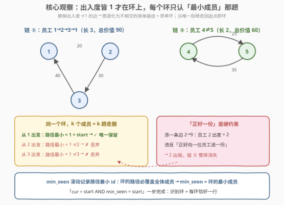
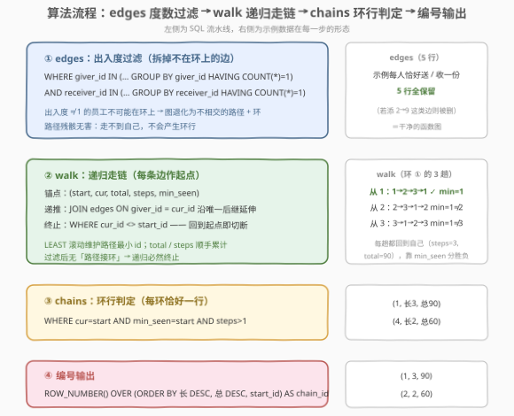

# 寻找环形礼物交换链

- **题目名称**：寻找环形礼物交换链
- **链接**：[3401. 寻找环形礼物交换链 🔒](https://leetcode.cn/problems/find-circular-gift-exchange-chains/)
- **难度**：困难
- **标签**：数据库、SQL、递归 CTE、`WITH RECURSIVE`、函数图找环、图遍历、窗口函数、`ROW_NUMBER`、`LEAST`、LeetCode 锁题

## 1. 题目概述

> ⚠️ 本题为 LeetCode 付费题（锁题），题意描述根据官方示例用例与外部资料重建，可能与官方题面有出入。（题面已与社区镜像 doocs/leetcode 的官方中文翻译交叉核对，示例输入输出与 GraphQL 接口返回一致，出入风险较低。）

**表结构**：`SecretSanta`

| 列名 | 类型 |
|------|------|
| giver_id | int |
| receiver_id | int |
| gift_value | int |

- `(giver_id, receiver_id)` 是这张表的唯一主键；
- 每行表示两个员工之间的一次礼物交换记录：`giver_id` 表示给予礼物的员工，`receiver_id` 表示收到礼物的员工，`gift_value` 表示所给予礼物的价值。

**目标**：编写一个解决方案，找到每条**环形礼物交换链**的**链长度**与**总礼物价值**。**环形链**定义为一系列交换，其中：

1. 每位员工都正好向另**一位**员工赠送一份礼物；
2. 每位员工都正好从另**一位**员工那里收到一份礼物；
3. 交换形成一个连续的循环（即员工 A 给 B 一份礼物，B 给 C，C 再给 A）。

返回 `chain_id`、`chain_length`、`total_gift_value` 三列，结果以**链的长度和总礼物价值降序**排序。

**示例 1**：

```text
输入：SecretSanta 表
+----------+-------------+------------+
| giver_id | receiver_id | gift_value |
+----------+-------------+------------+
| 1        | 2           | 20         |
| 2        | 3           | 30         |
| 3        | 1           | 40         |
| 4        | 5           | 25         |
| 5        | 4           | 35         |
+----------+-------------+------------+

输出：
+----------+--------------+------------------+
| chain_id | chain_length | total_gift_value |
+----------+--------------+------------------+
| 1        | 3            | 90               |
| 2        | 2            | 60               |
+----------+--------------+------------------+
```

**解释**：

- **链 1** 包含员工 1、2、3：员工 1 给 2、2 给 3、3 给 1，总礼物价值 $20+30+40=90$；
- **链 2** 包含员工 4、5：员工 4 给 5、5 给 4，总礼物价值 $25+35=60$。

**约束条件**（付费题，依据表结构与示例重建，以官方为准）：

- `gift_value` 为正整数，员工 id 为整数；
- 同一 `(giver_id, receiver_id)` 对不重复；但一个 giver 可能给多人送礼、一个 receiver 可能收多份礼——这样的员工不满足「正好一份」，不在任何环上；
- 判题数据规模小。

> 💡 **审题关键**：① 环是**集合语义**不是路径语义——同一环 $\{1,2,3\}$ 从 1、2 或 3 哪里开始描述都是同一条链，输出必须去重为恰好一行；② 「正好一份」是硬约束——某员工送出两份（或收两份），他**连同他所在的那条环整体出局**；③ 示例里 `chain_id` 恰好是「按长度、总价值降序排好后的行号」（长 3 价 90 → 1，长 2 价 60 → 2），按输出顺序用 `ROW_NUMBER` 编号是本题最自然的推断（付费题无官方判例佐证，提交以官方为准）。

---

## 2. 解题思路

### 2.1 暴力思路：应用层建图找环 / 固定深度自连接

最直接的暴力是把全表拉回应用层，在内存里建图（`giver → receiver` 的邻接表），用 DFS 三色标记或拓扑剥离找环——SQL 只当搬运工。

SQL 层的「笨办法」是**固定深度多重自连接**：拼 3 跳连接找长度恰为 3 的环——

```sql
-- 演示：只找长度恰为 3 的环
SELECT e1.giver_id, e1.gift_value + e2.gift_value + e3.gift_value AS total
FROM edges e1
JOIN edges e2 ON e2.giver_id = e1.receiver_id
JOIN edges e3 ON e3.giver_id = e2.receiver_id
WHERE e3.receiver_id = e1.giver_id;
```

要覆盖所有长度就得按最大链长 $L$ 拼 $L$ 跳连接——$L$ 未知、连接数失控；而且每条环会被每个成员各报告一次（$\{1,2,3\}$ 从 1、2、3 出发是三趟），还得再想办法去重。

> ⚠️ 暴力的启示：① 「沿唯一后继走」天然是递归结构，`WITH RECURSIVE` 一句顶 $L$ 个 JOIN；② 每环 $k$ 趟的重复必须在 SQL 内解决——去重的钥匙是「只认环中**最小成员**出发的那趟」（2.2）；③ 环上点「出入度皆 1」的约束必须显式过滤，「图上有圈」不等于「是合法链」。

### 2.2 核心观察：出入度过滤 + 递归走链 + min_seen 规范化起点



三个观察把问题拆成「一次过滤 + 一次递归 + 一步判定」：

| 观察 | 内容 | 带来的做法 |
|------|------|-----------|
| **出入度皆 1 才在环上** | 环上每位成员的出度（送礼次数）与入度（收礼次数）都恰好是 1。把「giver 在表中出现 ≠ 1 次」或「receiver 出现 ≠ 1 次」的边删掉后，图中每个点出度 ≤ 1、入度 ≤ 1，连通分量只剩**不相交的简单路径与简单环** | 两个 `GROUP BY ... HAVING COUNT(*) = 1` 子查询过滤，无需迭代 |
| **沿唯一后继走回起点即环** | 过滤后每个点至多一条出边，从任意点出发的走法**唯一**——`WITH RECURSIVE` 以每条边为起点，沿 `JOIN edges ON giver_id = cur_id` 延伸，回到起点时切断 | 递归中顺手滚动累计 `total_value`（总价值）与 `steps`（链长），走完一圈两者恰好就是答案的两列 |
| **min_seen 让每环恰好一行** | 环上每个成员出发都能回到自己——链长 $k$ 的环会被报告 $k$ 趟。递归中用 `LEAST` 滚动维护「路径上遇到的最小 id」：环的路径必覆盖全体成员，故 `min_seen` 恒等于**环的最小成员**；只有从最小成员出发的那趟满足 `min_seen = start` | `WHERE cur = start AND min_seen = start AND steps > 1` 一步完成「识别环 + 每环去重」 |

两个容易踩的细节先钉死：

- **为什么必须先过滤**：设边集为 $\{1{\to}2,\ 2{\to}3,\ 3{\to}1,\ 2{\to}9,\ 9{\to}2\}$——员工 2 送出了两份礼物（给 3 和给 9），违反「正好向一位员工赠送一份」，$\{1,2,3\}$ 不是合法链。但不过滤的话，递归从 1 出发走到 2 会**分叉**，其中 $1{\to}2{\to}3{\to}1$ 这一路 `cur = start` 且 `min_seen = 1 = start`，会被**误报**为链。图上存在圈 ≠ 圈上人人满足「正好一份」——约束必须靠删除违规边来落实，不能指望 `min_seen` 碰巧挡住。
- **递归会不会绕圈不止**：不会。其一，环上点回到 `start` 被 `WHERE cur_id <> start_id` 切断；其二，过滤后图中**不存在「路径接环」**——环上点的入边只能来自环内（否则他入度 ≥ 2，边早被删了），所以非环点的走链是纯路径，走到死胡同 `JOIN` 不上自然终止。递归深度 ≤ 最长分量长度 ≤ 表行数 $N$。

### 2.3 算法流程图



| 步骤 | SQL 片段 | 作用 | 示例数据流 |
|------|----------|------|-----------|
| ① 过滤 `edges` | `giver IN (…HAVING COUNT(*)=1) AND receiver IN (…HAVING COUNT(*)=1)` | 删掉出入度 ≠ 1 的边，图退化为不相交的路径 + 环 | 示例 5 行每点出入度皆 1，全保留 |
| ② 递归 `walk` | 锚点 = 每条边 `(start, cur, total, steps, min_seen)`；递推 `JOIN edges ON giver_id = cur_id`，`WHERE cur <> start` | 沿唯一后继走链，滚动累计价值/步数/路径最小 id | 环 ① 产生 3 趟：从 1/2/3 出发都回到自己，`min_seen` 均为 1 |
| ③ 判定 `chains` | `WHERE cur = start AND min_seen = start AND steps > 1` | 识别环 + 每环只留最小成员那趟 | $(1, 3, 90)$、$(4, 2, 60)$ 两行 |
| ④ 编号输出 | `ROW_NUMBER() OVER (ORDER BY chain_length DESC, total_gift_value DESC, start_id)` | 生成 `chain_id` 并按题意排序 | $(1,3,90)$、$(2,2,60)$ |

> 💡 `steps > 1` 是给自环 $(u,u)$ 留的闸门：题面说「向**另一位**员工赠送」，自己给自己送礼不算链；若判题把自环当链长 1 的环，去掉这个条件即可。

### 2.4 示例演算

过滤后 5 条边全保留（每个 giver、receiver 都恰好出现一次）。`walk` 以每条边的 giver 为起点（5 个起点）：

| 起点 | 走链轨迹 | steps | total | min_seen | 环行判定 |
|------|----------|-------|-------|----------|----------|
| 1 | $1\to2\to3\to1$ | 3 | $20+30+40=90$ | $\min(1,2,3)=1$ | ✓ `min_seen = start` → **保留** |
| 2 | $2\to3\to1\to2$ | 3 | 90 | $\min(2,3,1)=1$ | ✗ $1\ne2$ → 丢弃 |
| 3 | $3\to1\to2\to3$ | 3 | 90 | $\min(3,1,2)=1$ | ✗ $1\ne3$ → 丢弃 |
| 4 | $4\to5\to4$ | 2 | $25+35=60$ | $\min(4,5)=4$ | ✓ → **保留** |
| 5 | $5\to4\to5$ | 2 | 60 | $\min(5,4)=4$ | ✗ $4\ne5$ → 丢弃 |

`chains` 剩两行：$(start=1,\ 长=3,\ 总=90)$ 与 $(start=4,\ 长=2,\ 总=60)$。按长度、总价值降序编号输出：链 ① 长大在前得 `chain_id=1`，链 ② 得 `chain_id=2`——与官方输出一致。

> 💡 注意同一环的三趟走链 `total`/`steps` 完全相同——这正是「环的路径覆盖全体成员、绕一圈的价值与长度与起点无关」的体现。也正因如此，**不能**靠 `(steps, total)` 分组去重：两条不同的环可能凑巧长度、总价值都相同（如 $\{1,2\}$ 与 $\{3,4\}$ 各值 30），`min_seen` 才是环的「身份证」。

---

## 3. 参考代码

### SQL（解法一：`WITH RECURSIVE` + `min_seen` 规范化，推荐）

```sql
WITH RECURSIVE
    edges AS (
        SELECT giver_id, receiver_id, gift_value
        FROM SecretSanta
        WHERE giver_id IN (
                SELECT giver_id FROM SecretSanta
                GROUP BY giver_id HAVING COUNT(*) = 1
            )
          AND receiver_id IN (
                SELECT receiver_id FROM SecretSanta
                GROUP BY receiver_id HAVING COUNT(*) = 1
            )
    ),
    walk AS (
        SELECT giver_id AS start_id,
               receiver_id AS cur_id,
               gift_value AS total_value,
               1 AS steps,
               LEAST(giver_id, receiver_id) AS min_seen
        FROM edges
        UNION ALL
        SELECT w.start_id,
               e.receiver_id,
               w.total_value + e.gift_value,
               w.steps + 1,
               LEAST(w.min_seen, e.receiver_id)
        FROM walk w
        JOIN edges e ON e.giver_id = w.cur_id
        WHERE w.cur_id <> w.start_id
    ),
    chains AS (
        SELECT start_id,
               steps AS chain_length,
               total_value AS total_gift_value
        FROM walk
        WHERE cur_id = start_id
          AND min_seen = start_id
          AND steps > 1
    )
SELECT ROW_NUMBER() OVER (
           ORDER BY chain_length DESC, total_gift_value DESC, start_id
       ) AS chain_id,
       chain_length,
       total_gift_value
FROM chains
ORDER BY chain_length DESC, total_gift_value DESC, start_id;
```

> 💡 **写法要点**：
> - **`edges` 只做一次过滤**：环的合法性由「出入度皆 1」保证；过滤后残留的简单路径无害——从路径点出发走不到自己，不产生环行（见第 5.1 节）。窗口函数版 `COUNT(*) OVER (PARTITION BY …)` 等价，此处用 `IN + HAVING` 兼容更多引擎；
> - **递归的三个滚动列**：`total_value`（加边累价值）、`steps`（加边计步数）、`min_seen`（`LEAST` 收紧最小 id）——递归每多走一步，输出的两列与去重键就同步就绪，环行一到手即是最终形态；
> - **`WHERE cur_id <> start_id` 是终止闸**：回到起点的当步切断，防止绕圈；配合「过滤后无路径接环」，递归必然终止；
> - **`ROW_NUMBER` 而非 `RANK`**：`chain_id` 是行号语义（1, 2, 3…连续编号），且追加第三级键 `start_id` 保证两条环长度、总价值全打平时编号依然确定。

### SQL（解法二：多重自连接，演示固定深度）

```sql
-- 演示版：找长度恰为 3 的环（需先做与解法一相同的 edges 过滤）
WITH edges AS (
    SELECT giver_id, receiver_id, gift_value
    FROM SecretSanta
    WHERE giver_id IN (SELECT giver_id FROM SecretSanta
                       GROUP BY giver_id HAVING COUNT(*) = 1)
      AND receiver_id IN (SELECT receiver_id FROM SecretSanta
                          GROUP BY receiver_id HAVING COUNT(*) = 1)
)
SELECT e1.giver_id AS start_id,
       3 AS chain_length,
       e1.gift_value + e2.gift_value + e3.gift_value AS total_gift_value
FROM edges e1
JOIN edges e2 ON e2.giver_id = e1.receiver_id
JOIN edges e3 ON e3.giver_id = e2.receiver_id
WHERE e3.receiver_id = e1.giver_id
  AND e1.giver_id < e2.giver_id
  AND e1.giver_id < e3.giver_id;
```

> 💡 **解法二的取舍**：
> - 条件 `e3.receiver_id = e1.giver_id` 判定「三步回到起点」；`e1.giver_id < e2.giver_id AND e1.giver_id < e3.giver_id` 强制起点是环的**最小成员**——与 `min_seen` 异曲同工，每环恰好一行；
> - 局限明显：每个长度要单独拼一跳（长度 2 还得再写一段两跳版 `UNION ALL` 进来），长度上界未知时无法收口——这正是递归 CTE 存在的意义，本解法仅用于理解「走一圈 = 按长度对齐自连接」。

### Python（pandas）

```python
import pandas as pd


def find_circular_gift_exchange_chains(secret_santa: pd.DataFrame) -> pd.DataFrame:
    edges = secret_santa[["giver_id", "receiver_id", "gift_value"]].copy()
    # 迭代删除出入度 ≠ 1 的员工的所有关联边（拓扑式剥离）
    while not edges.empty:
        out_cnt = edges["giver_id"].value_counts()
        in_cnt = edges["receiver_id"].value_counts()
        nodes = set(edges["giver_id"]) | set(edges["receiver_id"])
        bad = {n for n in nodes if out_cnt.get(n, 0) != 1 or in_cnt.get(n, 0) != 1}
        if not bad:
            break
        edges = edges[~edges["giver_id"].isin(bad) & ~edges["receiver_id"].isin(bad)]

    # 过滤后每点出入度皆 1 → 全部落在环上，沿后继绕一圈收集
    succ = dict(zip(edges["giver_id"], edges["receiver_id"]))
    value = dict(zip(edges["giver_id"], edges["gift_value"]))
    chains, seen = [], set()
    for u in sorted(succ):
        if u in seen:
            continue
        members, cur, total = [], u, 0
        while cur not in seen:
            seen.add(cur)
            members.append(cur)
            total += value[cur]
            cur = succ[cur]
        if len(members) > 1:  # 自环不算「另一位员工」
            chains.append((len(members), total))

    result = pd.DataFrame(chains, columns=["chain_length", "total_gift_value"])
    result = result.sort_values(
        ["chain_length", "total_gift_value"], ascending=[False, False]
    ).reset_index(drop=True)
    result.insert(0, "chain_id", result.index + 1)
    return result
```

> 💡 **pandas 对照**（付费题无官方函数签名，函数名按题名约定）：
> - 迭代删除对应 SQL 的 `edges` 过滤，但 pandas 里有循环可用**迭代删除**（每轮把出入度 ≠ 1 的点的关联边全删，直到全体合格）——比 SQL 的一次过滤删得更干净（连路径残骸也剥光），两者对**环**的判定结果等价；
> - 剥光后每点出入度皆 1，图只剩环——所以从任意未访问点沿 `succ` 绕一圈**必回到自己**，无需 `min_seen`：`seen` 集合天然保证每个环只收集一次（第二个成员再出发时会发现已在 `seen` 里）；
> - `if len(members) > 1` 对应 SQL 的 `steps > 1`（排除自环）；`sort_values` 双键降序 + `index + 1` 对应 `ROW_NUMBER` 生成 `chain_id`。

---

## 4. 复杂度分析

设 $N$ 为 `SecretSanta` 的行数（也是过滤后边数的上界），$C$ 为环的条数。

| 维度 | 复杂度 | 说明 |
|------|--------|------|
| **时间（过滤）** | $O(N)$ | 两次 `GROUP BY` 计数 + 半连接筛边，一遍扫完 |
| **时间（递归）** | $O(N^2)$ 最坏 | 每个起点最多走 $O(N)$ 步（大环或长路径时跑满）；判题数据规模小，实际远小于上界 |
| **时间（判定 + 编号）** | $O(C\log C)$ | `walk` 里筛环行一遍扫 + `ROW_NUMBER` 对 $C$ 行排序 |
| **空间** | $O(N^2)$ 最坏 | `walk` 中间行的上界（每起点 $O(N)$ 行）；`edges` 与结果仅 $O(N)$、$O(C)$ |

> ⚠️ SQL 复杂度取决于执行计划：`edges` 的两个 `IN` 子查询若走哈希半连接则线性；递归的 `JOIN` 每步在过滤后的小图上做等值匹配。面试中说明「代价集中在递归展开 $O(N^2)$ 最坏、数据规模小时线性于总步数」即可。另注意 MySQL 递归 CTE 默认深度上限 1000（`max_recursion_depth`），本题环长 ≤ 行数、判题规模小，不会触顶。

---

## 5. 扩展：路径残骸、自环与 chain_id

### 5.1 一次过滤为什么就够

SQL 版 `edges` 只删一轮「giver 出现 ≠ 1 或 receiver 出现 ≠ 1」的边，之后**不再迭代**。删完的图中除了环，还可能残留简单路径（如链 $2\to3\to4$ 的中间段——两端员工的出入度违规被删后，中段两端点的度数「变」成 0/1 的组合，但它们已经没有违规记录，不会再被删）。这没有关系：**路径残骸不产生环行**——从路径上任何点出发都走不到自己，递归白走几步后在死胡同终止，`chains` 里不会多出一行。正确性只要求「过滤后的图中环 = 合法环」，不要求「把非环的部分删光」。

pandas 版做的是**迭代删除**（拓扑式逐层剥离端点），剥到最后只剩环——实现更繁琐一些（SQL 没有循环），但绕圈收集时无需再判定「是否回到自己」。两条路线殊途同归：**判定环的语义不变，只是清理力度不同**。

### 5.2 自环的边界

若数据中出现 $(u, u)$（员工给自己送礼）：$u$ 出入度皆 1（就这一条边），能通过过滤；锚点行即 `cur = start`、`steps = 1`。题面「向**另一位**员工赠送」明确排除自己，故用 `steps > 1` 把它挡在 `chains` 之外。若官方判题反而把自环当链长 1 的环，删掉 `steps > 1`（pandas 版把 `len(members) > 1` 放开为 `>= 1`）即可——其余逻辑一字不动。

### 5.3 两条环全打平时 chain_id 怎么办

排序键 `chain_length DESC, total_gift_value DESC` 在两条不同的环上可能完全相同（两条环等长等值）。此时 `ROW_NUMBER` 的结果依赖第三级键：本解追加 `start_id`（环的最小成员）作终极排序键，编号从 `start_id` 小的开始——结果确定、可复现。「不确定的输出」比「可能不同的输出」更难排查，给每行一个确定的座次是稳妥习惯。

---

## 6. 面试要点

1. **为什么必须先做出入度过滤？不过滤直接递归会怎样？**

   > 环上每位成员必须「正好送一份、正好收一份」——出度或入度 ≠ 1 的员工不可能在环上。不过滤有两个恶果：① 误报——员工 2 若有两条出边（如 $2{\to}3$ 与 $2{\to}9$），$1{\to}2{\to}3{\to}1$ 形式上是圈、且从 1 出发恰好回到 1、`min_seen` 也等于 1，会被误判为链，但它违反「正好一份」；② 分叉——递归在出度 > 1 的点上会同时展开多条路径，语义歧义。过滤后每点出度 ≤ 1、入度 ≤ 1，走法唯一，环的合法性才有保证。

2. **`min_seen` 为什么能让每个环恰好输出一行？**

   > 环上每个成员出发都能走一圈回到自己，链长 $k$ 的环会被报告 $k$ 趟。递归中用 `LEAST` 滚动维护路径上遇到的最小 id：环的路径必覆盖**全体成员**，所以无论从谁出发，`min_seen` 都恒等于环的最小成员。于是「`min_seen = start`」当且仅当「起点就是环的最小成员」——$k$ 趟里恰好只有这一趟通过，去重一步到位。它比「按 `(steps, total)` 分组」可靠：不同环可能等长等值，但两个不相交环的最小成员必不相同。

3. **递归会不会死循环？终止靠什么保证？**

   > 双保险。其一，`WHERE cur_id <> start_id` 在走回起点的当步切断递归——环上点绕一圈即停；其二，过滤后图中不存在「路径接环」——环上点的入边只能来自环内（否则入度 ≥ 2 早被过滤），非环点的走链是纯路径，走到死胡同 `JOIN` 不上自然终止。递归深度不超过最长分量长度 ≤ $N$，触不到 MySQL 的 1000 层递归上限（判题规模小）。

4. **`chain_id` 是怎么来的？为什么用 `ROW_NUMBER` 而不是 `RANK`？**

   > 题面只给「按链长度、总礼物价值降序」的排序要求，示例里 `chain_id` 恰好是排好序后的行号——推断为输出顺序编号（付费题，以官方为准）。用 `ROW_NUMBER` 是因为 `chain_id` 是连续行号语义；`RANK` 在等长等值的两条环上会并列为 1、跳到 3，与行号语义不符。另追加 `start_id` 作第三级排序键：全打平时编号依然确定，不依赖引擎的任意顺序。

5. **SQL 一次过滤和 pandas 迭代删除，为什么删的程度不同却都对？**

   > 正确性只取决于「过滤后图中**环**的集合 = 合法环的集合」。SQL 一次过滤后残留的简单路径无害——从路径点出发走不到自己，`cur = start` 永不成立，不会混进 `chains`；pandas 迭代删除把非环部分剥光，绕圈收集时就不必再判定「是否回到自己」。前者实现简单（无循环），后者清理彻底（递归/收集更省）——判环语义不变，清理力度只是效率与简洁之间的取舍。

> 💡 **一句话总结**：3401 = 函数图找环的 SQL 化——出入度过滤（环上点「正好一份」）+ `WITH RECURSIVE` 沿唯一后继走链（回到起点即环）+ `LEAST` 滚动 `min_seen` 规范化起点（每环只认最小成员那趟）+ `ROW_NUMBER` 按长度/价值降序编号。最大的坑：图上有圈 ≠ 合法环，必须先过滤；环是集合语义，必须去重为一行。

---

## 7. 同类练习题

- [1270. 向公司CEO汇报工作的所有人](https://leetcode.cn/problems/all-people-report-to-the-given-manager/)（[站内题解](../1201-1300/1270_向公司CEO汇报工作的所有人.md)）：递归 CTE 沿 `manager_id` 链层层上溯——「沿唯一前驱走」与本题「沿唯一后继走」互为镜像
- [3236. 首席执行官下属层级](https://leetcode.cn/problems/ceo-subordinate-hierarchy/)（[站内题解](../3201-3300/3236_首席执行官下属层级.md)）：递归 CTE 边走边传层级深度——与本题「边走边传 total/steps/min_seen」同款滚动状态
- [2153. 每辆车的乘客人数II](https://leetcode.cn/problems/the-number-of-passengers-in-each-bus-ii/)（[站内题解](../2101-2200/2153_每辆车的乘客人数II.md)）：递归 CTE 沿序号链传递剩余座位——状态沿链滚动的另一变体，且同样用「基例 + `UNION ALL` 递推」骨架
- [1336. 每次访问的交易次数](https://leetcode.cn/problems/number-of-transactions-per-visit/)（[站内题解](../1301-1400/1336_每次访问的交易次数.md)）：递归 CTE 生成整数序列补输出缺口——递归 CTE 的另一面（造序列而非走图），对照学习
