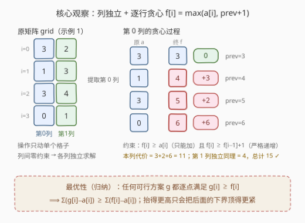
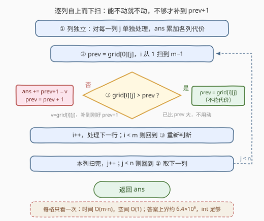

# LeetCode 使每一列严格递增的最少操作次数 题解

## 1. 题目概述

- **标题 / 题号**：使每一列严格递增的最少操作次数（#3402，easy）
- **链接**：https://leetcode.cn/problems/minimum-operations-to-make-columns-strictly-increasing/
- **难度**：简单
- **标签**：贪心、数组、矩阵

**题意**：给你一个由**非负整数**组成的 $m \times n$ 矩阵 `grid`。一次操作可以把任意元素 `grid[i][j]` 的值增加 1。

返回使 `grid` 的**所有列严格递增**所需的**最少**操作次数，即对每个 $j$ 都有 $grid[0][j] < grid[1][j] < \cdots < grid[m-1][j]$。

**示例 1**：

```text
输入：grid = [[3,2],[1,3],[3,4],[0,1]]
输出：15
解释：第 0 列：grid[1][0] 加 3 次、grid[2][0] 加 2 次、grid[3][0] 加 6 次；
     第 1 列：grid[3][1] 加 4 次。合计 3 + 2 + 6 + 4 = 15。
```

**示例 2**：

```text
输入：grid = [[3,2,1],[2,1,0],[1,2,3]]
输出：12
```

**约束**：

- $m = grid.length$，$n = grid[i].length$
- $1 \le m, n \le 50$
- $0 \le grid[i][j] < 2500$

> 💡 **读题关键**：①「严格递增」是**同列相邻行**之间的约束，列与列互不影响；② 只能 **+1** 不能减，所以每个格子的终值 $\ge$ 原值；③ 要求最少操作，就让每个格子取「不得不取」的最小值。

## 2. 解题思路

### 2.1 朴素思路：逐列 DP

先做一次降维：操作只作用于**单个格子**，约束只在**同列相邻行**之间，各列完全独立，总答案 = 各列答案之和。问题化归为一维：

> 给定数组 $a[0..m-1]$（某一列），每次操作任选一个元素 +1，使数组严格递增，最少几次？

最直接的做法是 DP：$dp[i][v]$ 表示第 $i$ 行终值恰好为 $v$ 时的最小代价，转移对 $v$ 维护前缀最小：

$$dp[i][v] = (v - a[i]) + \min_{u < v} dp[i-1][u]$$

单列 $O(m \cdot V)$（$V \le 2500 + m$ 为终值上界），全矩阵 $O(n \cdot m \cdot V) \approx 6 \times 10^6$，能过但完全没必要——本题有更干脆的贪心。

### 2.2 核心观察：逐行贪心，取「不得不取」的最小值



设某列的终值为 $f[0..m-1]$，它只受两条约束：

1. **只能加不能减**：$f[i] \ge a[i]$；
2. **严格递增**：$f[i] \ge f[i-1] + 1$。

**贪心**：从上往下扫，$f[i] = \max(a[i],\ f[i-1] + 1)$，代价累加 $f[i] - a[i]$。实现上甚至不用显式数组，一个滚动变量 `prev` 记住 $f[i-1]$ 即可：

- 若 $a[i] > prev$：本行已经满足约束，`prev = a[i]`，**一次不加**；
- 否则：必须补到 `prev + 1`，花 $prev + 1 - a[i]$ 次操作，`prev = prev + 1`。

**为什么贪心最优？** 两步论证：

- **逐点下界（归纳）**：设贪心得到的终值为 $f$。对任何可行方案 $g$（满足 $g[i] \ge a[i]$ 且 $g[i] \ge g[i-1]+1$），归纳可证 $g[i] \ge f[i]$：$g[0] \ge a[0] = f[0]$；若 $g[i-1] \ge f[i-1]$，则 $g[i] \ge \max(a[i],\ g[i-1]+1) \ge \max(a[i],\ f[i-1]+1) = f[i]$。
- **代价求和**：$\text{cost}(g) = \sum_i (g[i] - a[i]) \ge \sum_i (f[i] - a[i]) = \text{cost}(f)$。

> 💡 直观理解：把某一行的终值抬得比「必须的最小值」更高，只会让**下一行的下界**跟着变紧，后面的代价只增不减——「能不加就不加」就是最优策略。

### 2.3 算法流程图



1. `ans = 0`；对每一列 $j \in [0, n)$ 独立处理；
2. `prev = grid[0][j]`（首行没有上方约束，不动它）；
3. 自上而下扫 $i = 1 \dots m-1$：
   - 若 $grid[i][j] > prev$：`prev = grid[i][j]`（0 代价）；
   - 否则：`ans += prev + 1 - grid[i][j]`，`prev = prev + 1`；
4. 所有列扫完，返回 `ans`。

### 2.4 示例演算

以**示例 1**（`grid = [[3,2],[1,3],[3,4],[0,1]]`）走完整流程。

**第 0 列** $a = [3, 1, 3, 0]$：

| $i$ | $a[i]$ | 处理前 prev | 判断 | 终值 $f[i]$ | 代价 | 处理后 prev |
|---|---|---|---|---|---|---|
| 0 | 3 | — | 首行不动 | 3 | 0 | 3 |
| 1 | 1 | 3 | $1 \le 3$，补到 4 | 4 | 3 | 4 |
| 2 | 3 | 4 | $3 \le 4$，补到 5 | 5 | 2 | 5 |
| 3 | 0 | 5 | $0 \le 5$，补到 6 | 6 | 6 | 6 |

第 0 列代价 $= 3 + 2 + 6 = 11$。

**第 1 列** $a = [2, 3, 4, 1]$：

| $i$ | $a[i]$ | 处理前 prev | 判断 | 终值 $f[i]$ | 代价 |
|---|---|---|---|---|---|
| 0 | 2 | — | 首行不动 | 2 | 0 |
| 1 | 3 | 2 | $3 > 2$，不动 | 3 | 0 |
| 2 | 4 | 3 | $4 > 3$，不动 | 4 | 0 |
| 3 | 1 | 4 | $1 \le 4$，补到 5 | 5 | 4 |

第 1 列代价 $= 4$。总计 $11 + 4 = 15$ ✓，与示例一致（**示例 2** 同法得三列代价 $6 + 4 + 2 = 12$ ✓）。

## 3. 参考代码

### C++

```cpp
class Solution {
  public:
    int minimumOperations(vector<vector<int>>& grid) {
        int m = grid.size(), n = grid[0].size();
        int ans = 0;
        for (int j = 0; j < n; ++j) {
            int prev = grid[0][j];                 // f[0] = a[0]，首行不动
            for (int i = 1; i < m; ++i) {
                if (grid[i][j] > prev) {
                    prev = grid[i][j];             // 已经严格更大，0 代价
                } else {
                    ans += prev + 1 - grid[i][j];  // 补到刚好 prev+1
                    prev += 1;
                }
            }
        }
        return ans;
    }
};
```

### Python

```python
class Solution:
    def minimumOperations(self, grid: List[List[int]]) -> int:
        m, n = len(grid), len(grid[0])
        ans = 0
        for j in range(n):
            prev = grid[0][j]              # 首行不动
            for i in range(1, m):
                if grid[i][j] > prev:
                    prev = grid[i][j]      # 已经严格更大，0 代价
                else:
                    ans += prev + 1 - grid[i][j]   # 补到刚好 prev+1
                    prev += 1
        return ans
```

> 💡 Python 中用 `for col in zip(*grid)` 转置后按列迭代，可少一层下标，写法见第 5 节。

## 4. 复杂度分析

| 维度 | 复杂度 | 说明 |
|------|--------|------|
| 时间 | $O(m \cdot n)$ | 每个格子恰好访问一次，判断与累加均为 $O(1)$ |
| 空间 | $O(1)$ | 仅 `prev` 与累加器两个变量（不计输入矩阵） |

## 5. 扩展：一句话变体

- **非严格递增**（允许相等）：下界从 $prev + 1$ 改成 $prev$，即 $f[i] = \max(a[i], f[i-1])$，其余不变。
- **改问「每行严格递增」**：把两层循环的 $i, j$ 角色互换即可，套路完全一致。
- **允许 ±1 而不只是 +1**：「能不加就不加」的贪心失效（可以把上面的数改小），需要 DP 等更强手段，参考 [1187. 使数组严格递增](https://leetcode.cn/problems/make-array-strictly-increasing/)。
- **Python 转置写法**：

```python
class Solution:
    def minimumOperations(self, grid: List[List[int]]) -> int:
        ans = 0
        for col in zip(*grid):
            prev = col[0]
            for v in col[1:]:
                if v > prev:
                    prev = v
                else:
                    ans += prev + 1 - v
                    prev += 1
        return ans
```

## 6. 面试要点

- **Q1：为什么可以按列独立处理？**
  答：一次操作只改变一个格子，「严格递增」的约束只存在于同列相邻行之间；不同列的约束与代价互不耦合，总代价 = 各列代价之和，各自取最小即全局最小。
- **Q2：贪心 $f[i] = \max(a[i], f[i-1]+1)$ 为什么最优？**
  答：归纳可证任何可行方案 $g$ 逐点满足 $g[i] \ge f[i]$：$g[0] \ge a[0] = f[0]$；若 $g[i-1] \ge f[i-1]$，则 $g[i] \ge \max(a[i], g[i-1]+1) \ge \max(a[i], f[i-1]+1) = f[i]$。于是 $\sum (g[i]-a[i]) \ge \sum (f[i]-a[i])$。
- **Q3：多加几次会不会反而更省？**
  答：不会。把第 $i$ 行终值抬高 $k$，第 $i+1$ 行的下界也随之抬高至多 $k$，后缀代价单调不减；逐点取最小值即总和最小。
- **Q4：答案会溢出吗？**
  答：不会。最坏情形每个格子补约 $2500 + 50$ 次，共 $50 \times 50$ 个格子，上界约 $6.4 \times 10^6$，32 位 `int` 绰绰有余。
- **Q5：需要修改输入矩阵吗？**
  答：不需要。用 `prev` 滚动记录上一行终值即可；也可以原地写 `grid[i][j] = max(grid[i][j], prev + 1)`，但不动输入的写法在面试中更稳妥。

## 同类练习题

| # | 题目 | 与本题的关联 |
|---|------|-------------|
| 1827 | [使数组递增的最少操作次数](https://leetcode.cn/problems/minimum-operations-to-make-the-array-increasing/) | 本题的一维版，同一个「补到 prev+1」贪心 |
| 945 | [使数组唯一的最少增量](https://leetcode.cn/problems/minimum-increment-to-make-array-unique/) | 同款「只能 +1」贪心，排序后逐个取 $\max(a[i], prev+1)$ |
| 2033 | [使矩阵中的所有元素相等的最少操作次数](https://leetcode.cn/problems/minimum-operations-to-make-a-uni-value-grid/) | 矩阵最少操作的另一经典题，改用中位数贪心 |
| 1187 | [使数组严格递增](https://leetcode.cn/problems/make-array-strictly-increasing/) | 严格递增的进阶版（允许替换成另一数组的元素），贪心失效需 DP |
