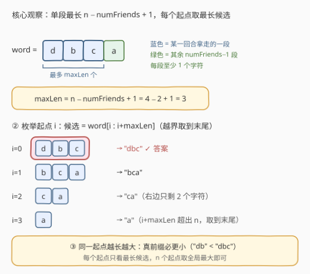
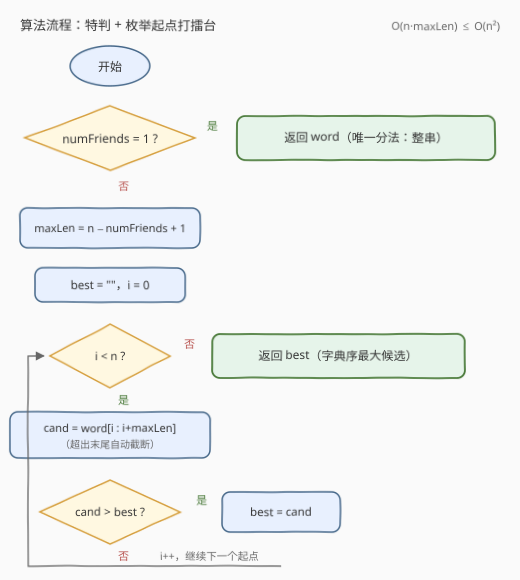

# 从盒子中找出字典序最大的字符串 I

- **题目名称**：从盒子中找出字典序最大的字符串 I
- **链接**：[3403. 从盒子中找出字典序最大的字符串 I](https://leetcode.cn/problems/find-the-lexicographically-largest-string-from-the-box-i/)
- **难度**：中等
- **标签**：字符串、枚举、贪心
- **关联**：[3406. 从盒子中找出字典序最大的字符串 II](https://leetcode.cn/problems/find-the-lexicographically-largest-string-from-the-box-ii/) 是同题意的大数据版（Hard，付费题），$O(n^2)$ 枚举会超时，需要第 5 节的 $O(n)$ 最大后缀做法

## 1. 题目概述

给定字符串 `word` 和整数 `numFriends`。游戏进行多个回合，每一回合把 `word` 分割成 `numFriends` 个**非空**字符串（每种分割方式与之前所有回合都不完全相同），分割出的所有字符串都放入一个盒子。所有回合结束后，返回盒子中**字典序最大**的字符串。

**示例 1**：

```text
输入：word = "dbca", numFriends = 2
输出："dbc"
解释：所有分割方式为 "d"|"bca"、"db"|"ca"、"dbc"|"a"，
     盒子中共 6 个字符串，字典序最大的是 "dbc"。
```

**示例 2**：

```text
输入：word = "gggg", numFriends = 4
输出："g"
解释：唯一分割方式："g"|"g"|"g"|"g"。
```

**约束条件**：

- $1 \le word.length \le 5 \times 10^3$
- `word` 仅由小写英文字母组成
- $1 \le numFriends \le word.length$

> 💡 **读题关键**：①「所有回合」合起来就是把 `word` 的**每一种**分割方式都玩一遍，盒子 = 所有分割方式产生的所有片段的并集；② 分割保序，每个片段都是 `word` 的**连续子串** `word[i..j]`；③ 问题从「枚举分割」转化为「**哪些子串能作为某个合法分割中的一段**」。

---

## 2. 解题思路

### 2.1 暴力思路：枚举所有分割

枚举分割方式数是组合数 $\binom{n-1}{numFriends-1}$（在 $n-1$ 个字符缝隙中选 $numFriends-1$ 处下刀），$n = 5000$ 时是天文数字。必须反过来想：**答案子串需要满足什么条件？**

### 2.2 核心观察：长度上界 + 枚举起点



**观察一（长度上界）**：`numFriends` 段都非空，一段拿走 $L$ 个字符后，其余 $numFriends-1$ 段至少各占 1 个字符，故

$$
L \le n - (numFriends - 1) = n - numFriends + 1 \;\triangleq\; maxLen
$$

**观察二（上界可达）**：反过来，对任意起点 $i \in [0, n)$，子串 `word[i : i+maxLen]`（越界自动截断到末尾）**总能**成为某个合法分割中的一段：

- 若 $i + maxLen \le n$（等价于 $i \le numFriends - 1$）：把前缀 `word[0..i-1]` 拆成 $i$ 个单字符，中间拿走 $maxLen$ 个，剩余 $numFriends-1-i$ 个字符再拆成单字符，总段数恰为 $i + 1 + (numFriends-1-i) = numFriends$；
- 若 $i + maxLen > n$：把前缀 `word[0..i-1]`（共 $i \ge numFriends$ 个字符）拆成 $numFriends-1$ 段非空串，`word[i..n-1]` 作为第 $numFriends$ 段，取到末尾。

**观察三（越长越好）**：若 $s$ 是 $t$ 的真前缀，则 $s < t$（如 `"db" < "dbc"`），所以同一起点的候选里**取最长的一定不劣**。

三个观察合起来，只需枚举 $n$ 个起点、每个起点取最长候选，再取全局最大：

$$
answer = \max_{0 \le i < n} word[i : i + maxLen]
$$

> ⚠️ **特判 $numFriends = 1$ 不能省**：此时唯一的分割方式就是整串本身，答案直接返回 `word`。若硬套公式，$maxLen = n$ 会枚举出所有**后缀**，而单段分割下起点 $i \ge 1$ 的后缀并不对应任何合法分割——例如 `word = "ab"` 时公式给出 `"b"`，正确答案却是 `"ab"`。

### 2.3 算法流程图



1. **特判**：`numFriends == 1` 直接返回 `word`；
2. **预处理**：$maxLen = n - numFriends + 1$；
3. **枚举**：$i$ 从 $0$ 到 $n-1$，取候选 `word[i : i+maxLen]`（切片越界自动截断，天然实现 $\min(n-i, maxLen)$）；
4. **打擂台**：候选与当前最优 `best` 比字典序，更大则替换；
5. 循环结束返回 `best`。

### 2.4 示例演算

以示例 1（`word = "dbca"`，`numFriends = 2`，$n = 4$，$maxLen = 3$）走一遍：

| 起点 $i$ | 候选 `word[i:i+3]` | 对应的一个合法分割 |
|---|---|---|
| 0 | `"dbc"` | `"dbc" \| "a"` |
| 1 | `"bca"` | `"d" \| "bca"` |
| 2 | `"ca"`（右边只剩 2 个，取到末尾） | `"db" \| "ca"` |
| 3 | `"a"` | `"dbc" \| "a"` 的第 2 段 |

四个候选中 `"dbc"` 最大，与暴力枚举三种分割共 6 个片段取最大一致 ✓。

---

## 3. 参考代码

### C++

```cpp
class Solution {
  public:
    string answerString(string word, int numFriends) {
        if (numFriends == 1) return word;  // 唯一分法：整串
        int n = word.size();
        int maxLen = n - numFriends + 1;
        string best;
        for (int i = 0; i < n; i++) {
            string cand = word.substr(i, maxLen);  // 越界自动截断
            if (cand > best) best = cand;
        }
        return best;
    }
};
```

### Python

```python
class Solution:
    def answerString(self, word: str, numFriends: int) -> str:
        if numFriends == 1:
            return word  # 唯一分法：整串
        max_len = len(word) - numFriends + 1
        # 切片越界自动截断到末尾，正好实现 min(n - i, max_len)
        return max(word[i:i + max_len] for i in range(len(word)))
```

---

## 4. 复杂度分析

| 维度 | 复杂度 | 说明 |
|------|--------|------|
| **时间复杂度** | $O(n \cdot maxLen) \le O(n^2)$ | $n$ 个起点，每个候选切片 + 比较至多 $maxLen = n - numFriends + 1$ 个字符；$n = 5000$ 最坏约 $2.5 \times 10^7$ 次字符比较，轻松通过 |
| **空间复杂度** | $O(maxLen)$ | 打擂台时暂存一个长度至多 $maxLen$ 的候选串；改用原地逐字符比较可降到 $O(1)$，但没必要 |

---

## 5. 扩展：$O(n)$——答案就是「最大后缀」的前 maxLen 个字符

数据规模再放大（同题意的付费题 3406），$O(n^2)$ 枚举就会超时，需要 $O(n)$ 做法。

**定理**：$numFriends \ge 2$ 时，设 $p$ 为 `word` **字典序最大后缀**的起点（即 $word[p:] = \max_i word[i:]$），则

$$
answer = word[p : p + maxLen]
$$

**证明（反证）**：记 $c_p = word[p:p+maxLen]$。假设某候选 $c_i > c_p$，只有两类可能：

- **公共前缀后在第 $x$ 位分出胜负**（$word[i+x] > word[p+x]$）：逐位比较立得 $word[i:] > word[p:]$，与 $p$ 是最大后缀起点矛盾；
- **$c_p$ 是 $c_i$ 的真前缀**（公共部分全等、$c_i$ 更长）：若 $len(c_p) < maxLen$，说明 $c_p$ 已延伸到串尾，则 $word[i:]$ 以 $word[p:n]$ 开头且后面还有字符，得 $word[i:] > word[p:]$，矛盾；若 $len(c_p) = maxLen$，则任何候选长度都 $\le maxLen$，$c_i$ 不可能更长，矛盾。∎

找最大后缀是经典问题 [1163. 按字典序排在最后的子串](https://leetcode.cn/problems/last-substring-in-lexicographical-order/)，双指针 $O(n)$：$i < j$ 是两个候选起点，$k$ 是两后缀已相等的长度，比较 $word[i+k]$ 与 $word[j+k]$：

- 相等：$k{+}{+}$，继续往后比；
- $word[i+k] < word[j+k]$：起点 $i \dots i+k$ 逐个输给 $j \dots j+k$，$i$ 跳到 $i+k+1$（若追上 $j$ 则重置为 $j, j+1$），$k$ 清零；
- $word[i+k] > word[j+k]$：对称地 $j$ 跳到 $j+k+1$，$k$ 清零。

```python
class Solution:
    def answerString(self, word: str, numFriends: int) -> str:
        n = len(word)
        if numFriends == 1:
            return word
        max_len = n - numFriends + 1
        # 双指针找字典序最大后缀的起点（同 1163 题）
        i, j, k = 0, 1, 0
        while j + k < n:
            if word[i + k] == word[j + k]:
                k += 1
            elif word[i + k] < word[j + k]:
                i = i + k + 1       # 起点 i..i+k 全部出局
                if i >= j:
                    i, j = j, j + 1
                k = 0
            else:
                j = j + k + 1       # 起点 j..j+k 全部出局
                k = 0
        return word[i:i + max_len]
```

---

## 6. 面试要点

1. **为什么 `numFriends == 1` 必须特判？**

   - 单段分割下唯一的片段是整串 `word`，答案就是它；
   - 套公式会枚举出所有后缀，但起点 $i \ge 1$ 的后缀不是合法片段（如 `"ab"` 的 `"b"`）。

2. **为什么单段长度 $\le n - numFriends + 1$，且每个起点取该上界就够？**

   - 其余 $numFriends-1$ 段非空、至少占 $numFriends-1$ 个字符；
   - 同一起点越长字典序越大（真前缀必更小），所以只看最长候选 `word[i : i+maxLen]`。

3. **候选 `word[i : i+maxLen]` 一定来自某个合法分割吗？**

   - 一定。$i + maxLen \le n$ 时前面拆 $i$ 个单字符、后面拆单字符补足段数；$i + maxLen > n$ 时取到末尾、前面拆成 $numFriends-1$ 段（此时 $i \ge numFriends$，拆得开）。

4. **复杂度多少？还能更快吗？**

   - $O(n \cdot maxLen) \le O(n^2)$，$n \le 5000$ 足够；
   - $O(n)$ 做法：答案是字典序最大后缀的前 $maxLen$ 个字符（第 5 节定理），找最大后缀用 1163 题的双指针。

5. **只枚举最大字符出现的位置行不行？**

   - 不行。`word = "aann"`，`numFriends = 2` 时最大字符 `'n'` 首次出现在 $i=1$，候选 `"ann"`；但答案是以 $i=2$ 开头的 `"nn"`——同首字符时还要继续比后续，本质仍是最大后缀问题。

> 💡 **一句话总结**：特判 $numFriends=1$ 返回整串；否则 $maxLen = n - numFriends + 1$，答案 $= \max_i word[i{:}i+maxLen]$，$O(n^2)$ 枚举起点即可；数据更大时用「最大后缀截断」降到 $O(n)$。

---

## 7. 同类练习题

- [3406. 从盒子中找出字典序最大的字符串 II](https://leetcode.cn/problems/find-the-lexicographically-largest-string-from-the-box-ii/)：同题意大数据版（Hard，付费），$O(n^2)$ 枚举超时，需用第 5 节的最大后缀 $O(n)$ 做法
- [1163. 按字典序排在最后的子串](https://leetcode.cn/problems/last-substring-in-lexicographical-order/)：找字典序最大后缀的双指针 $O(n)$ 原型，正是本题扩展做法的核心子问题
- [1754. 构造字典序最大的合并字符串](https://leetcode.cn/problems/largest-merge-of-two-strings/)：同款「贪心取更大」的字典序贪心，两串相等时的比较陷阱与本题「同首字符继续比」呼应
- [3216. 交换后字典序最小的字符串](https://leetcode.cn/problems/lexicographically-smallest-string-after-a-swap/)：字典序比较基础练习，体会「高位定胜负」的比较规则
