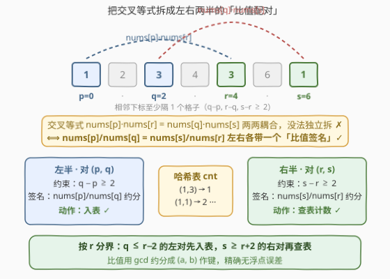
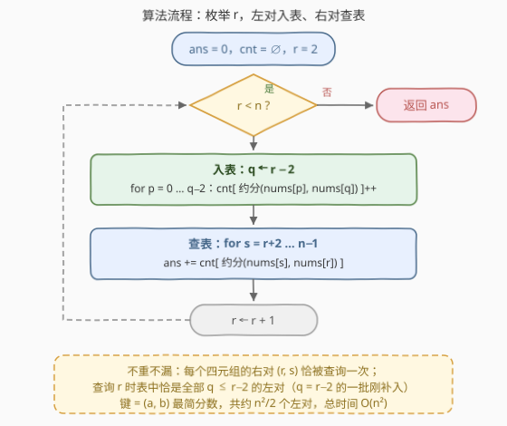

# 统计特殊子序列的数目

- **题目名称**：统计特殊子序列的数目
- **链接**：[3404. Count Special Subsequences](https://leetcode.cn/problems/count-special-subsequences/)
- **难度**：中等
- **标签**：数组、哈希表、数学、枚举

## 1. 题目概述

给你一个只包含**正整数**的数组 `nums`。**特殊子序列**是一个长度为 4 的子序列，用下标 $(p, q, r, s)$ 表示，满足 $p < q < r < s$，且：

1. $nums[p] \times nums[r] = nums[q] \times nums[s]$；
2. 相邻坐标之间至少间隔一个数字，即 $q - p > 1$、$r - q > 1$、$s - r > 1$。

请你返回 `nums` 中不同特殊子序列的数目。

**示例 1**：

```text
输入：nums = [1,2,3,4,3,6,1]
输出：1
解释：唯一的特殊子序列是 (p, q, r, s) = (0, 2, 4, 6)，对应元素 (1, 3, 3, 1)。
      nums[p] * nums[r] = 1 * 3 = 3
      nums[q] * nums[s] = 3 * 1 = 3
```

**示例 2**：

```text
输入：nums = [3,4,3,4,3,4,3,4]
输出：3
解释：三个特殊子序列分别是
      (0, 2, 4, 6) → (3, 3, 3, 3)：3*3 = 3*3 = 9
      (1, 3, 5, 7) → (4, 4, 4, 4)：4*4 = 4*4 = 16
      (0, 2, 5, 7) → (3, 3, 4, 4)：3*4 = 3*4 = 12
```

**约束条件**：

- $7 \le nums.length \le 1000$
- $1 \le nums[i] \le 1000$

> 💡 **读题关键**：① 等式是**交叉相乘**——左边的 $p$ 配 $r$、$q$ 配 $s$，这决定了拆解方式；② 间隔约束 $q-p,\ r-q,\ s-r \ge 2$ 说明下标按「跳一格」配对；③ $n \le 1000$ 暗示 $O(n^2)$ 可过、$O(n^3)$ 勉强、$O(n^4)$ 必死。

---

## 2. 解题思路

### 2.1 暴力思路：四重枚举的天花板

最直接的做法是枚举全部四个下标 $p < q < r < s$（各间隔 $\ge 2$）再判定等式，$O(n^4)$ 在 $n = 1000$ 下约 $4 \times 10^{11}$ 次判定，完全不可行。

能否像「两数之和」那样固定一半、哈希另一半？难点在于等式形状：$nums[p] \times nums[r] = nums[q] \times nums[s]$ 中 $p$ 与 $r$ 耦合、$q$ 与 $s$ 耦合，而 $p, q$ 在左侧、$r, s$ 在右侧——**乘积把左右两侧交叉绑在一起**，直接按乘积哈希无法把四元组拆成两个独立二元组。需要先做一步**恒等变形**。

### 2.2 核心观察：交叉等式拆成两半的「比值配对」



把等式移项成**比值相等**：

$$nums[p] \times nums[r] = nums[q] \times nums[s] \iff \frac{nums[p]}{nums[q]} = \frac{nums[s]}{nums[r]}$$

（$nums$ 全为正整数，除法安全。）于是四元组天然拆成**两半**：

- **左半**：对 $(p, q)$，约束 $q - p \ge 2$，携带签名 $\dfrac{nums[p]}{nums[q]}$；
- **右半**：对 $(r, s)$，约束 $s - r \ge 2$，携带签名 $\dfrac{nums[s]}{nums[r]}$；
- **两侧衔接约束**：$r - q \ge 2$，即左半的 $q$ 与右半的 $r$ 之间也至少隔一格。

问题变成：**统计签名相同、且 $q \le r - 2$ 的左右对组合数**。这正是「一半入哈希表、一半查哈希表」的经典套路（同 [454. 四数相加 II](https://leetcode.cn/problems/4sum-ii/)）。

签名必须用**最简分数** $(a, b)$（分子分母同除 $\gcd$）作键，不能用浮点数——$1/3$ 与 $2/6$ 浮点表示可能有精度误差，而 $(1,3)$ 与 $(2,6)$ 约分后统一为 $(1,3)$，精确且合并同类。

### 2.3 算法流程：枚举分界 r，左对入表、右对查表



按**右半的首下标 $r$** 从左往右扫描，维护哈希表 `cnt`：键为左对比值 $(a, b)$，值为出现次数：

1. **入表**：处理 $r$ 前，把所有 $q = r - 2$ 的左对 $(p, q)$（$p \le q - 2$）约分后加入 `cnt`。更小的 $q$ 已在之前的轮次入表，因此此刻表内恰好是**全部 $q \le r - 2$ 的左对**——正好满足 $r - q \ge 2$ 的衔接约束；
2. **查表**：对每个 $s \ge r + 2$（满足 $s - r \ge 2$），把签名 $\dfrac{nums[s]}{nums[r]}$ 约分后查表，把出现次数累加进答案。

**不重不漏**：每个合法四元组唯一对应一个右对 $(r, s)$，而它只在处理该 $r$ 时被查询一次；查询时表内恰好包含所有能与之配对（$q \le r-2$）的左对。

> ⚠️ 答案最大可达 $\binom{n-3}{4} \approx 4.1 \times 10^{10}$（$n=1000$ 全相等时），必须用 64 位整数；哈希计数本身不超过左对总数 $\binom{n}{2} \approx 5 \times 10^5$，`int` 足够。

### 2.4 示例演算

以示例 2 `nums = [3,4,3,4,3,4,3,4]`（$n = 8$）走关键两步（记比值「入表」为 $nums[p]/nums[q]$、「查表」为 $nums[s]/nums[r]$）：

| $r$ | 入表（$q = r-2$） | 表内容（比值 → 个数） | 查表（$s \ge r+2$） | 本轮贡献 |
|-----|------------------|----------------------|--------------------|---------|
| 2, 3 | 无（$q < 2$ 无合法 $p$） | 空 | 查无命中 | 0 |
| 4 | $(0,2)$：$3/3 = 1/1$ | $\{1/1 \to 1\}$ | $s=6$：$3/3 = 1$ ✓；$s=7$：$4/3$ ✗ | 1 |
| 5 | $(0,3)$：$3/4$；$(1,3)$：$4/4 = 1/1$ | $\{1/1 \to 2,\ 3/4 \to 1\}$ | $s=7$：$4/4 = 1$ ✓✓ | 2 |
| 6, 7 | 继续入表 | — | 右侧已无 $s \ge r+2$ | 0 |

合计 $1 + 2 = \mathbf{3}$ ✓，对应四元组 $(0,2,4,6)$、$(0,2,5,7)$、$(1,3,5,7)$，与示例一致。

---

## 3. 参考代码

### C++

```cpp
class Solution {
public:
    long long numberOfSubsequences(vector<int>& nums) {
        int n = nums.size();
        unordered_map<int, int> cnt;
        cnt.reserve(n * n / 2);
        long long ans = 0;
        for (int r = 2; r < n; ++r) {
            int q = r - 2;
            if (q >= 2) {
                for (int p = 0; p + 2 <= q; ++p) {      // p <= q-2
                    int g = gcd(nums[p], nums[q]);
                    ++cnt[(nums[p] / g) * 1001 + nums[q] / g];
                }
            }
            for (int s = r + 2; s < n; ++s) {
                int g = gcd(nums[r], nums[s]);
                ans += cnt[(nums[s] / g) * 1001 + nums[r] / g];
            }
        }
        return ans;
    }
};
```

> 💡 值域 $\le 1000$，约分后分子分母均 $\le 1000$，用 $a \times 1001 + b$ 把二元组编码成单个 `int` 键，比 `pair` 哈希更快。

### Python

```python
class Solution:
    def numberOfSubsequences(self, nums: List[int]) -> int:
        n = len(nums)
        cnt = defaultdict(int)
        ans = 0
        for r in range(2, n):
            q = r - 2
            if q >= 2:
                for p in range(q - 1):                  # p <= q-2
                    g = gcd(nums[p], nums[q])
                    cnt[(nums[p] // g, nums[q] // g)] += 1
            for s in range(r + 2, n):
                g = gcd(nums[r], nums[s])
                ans += cnt[(nums[s] // g, nums[r] // g)]
        return ans
```

> 💡 两份代码都已用 $O(n^4)$ 暴力对拍验证（3000+ 组随机数据）。

---

## 4. 复杂度分析

| 维度 | 复杂度 | 说明 |
|------|--------|------|
| **时间复杂度** | $O(n^2 \log V)$ | 左对、右对各约 $\binom{n}{2}$ 个，每个做一次 $\gcd$（$V = 1000$，$\log V \approx 10$）加一次 $O(1)$ 哈希操作；$n = 1000$ 时约 $10^7$ 量级基本操作 |
| **空间复杂度** | $O(n^2)$ | 哈希表最多存约 $\binom{n}{2} \approx 5 \times 10^5$ 个不同的最简比值键 |

---

## 5. 扩展：为什么不用浮点数或其他枚举方式

- **浮点键的陷阱**：若用 `nums[p] / nums[q]` 的浮点值作键，$1/3$ 与 $2/6$ 理论上相等，但浮点除法的舍入可能让二者落在相邻的表示上，且哈希相等判断容差难以设定。**gcd 约分成 $(a, b)$** 是比值类计数的标准做法（同 [2001. 可互换矩形中的组数](https://leetcode.cn/problems/number-of-pairs-of-interchangeable-rectangles/)）。
- **枚举对象的选择**：也可以枚举中缝 $(q, r)$ 再两侧统计，但左对 $nums[p]/nums[q]$ 与右对 $nums[s]/nums[r]$ 的签名分别依赖 $q$ 和 $r$，按 $r$ 扫描能把「入表」摊成每轮一批（$q = r-2$ 的所有 $p$），实现最简洁；若枚举 $q$ 则右对签名依赖 $r$，入表顺序对称互换即可，本质相同。
- **计数上界**：全相等数组时每个间隔合法的四元组都命中，答案 $\binom{n-3}{4}$（令 $q'=q-1,\ r'=r-2,\ s'=s-3$ 化为普通组合），这也是必须 `long long` 的直接论证。

---

## 6. 面试要点

1. **为什么等式要先变形为比值？**

   - 原式 $nums[p] \cdot nums[r] = nums[q] \cdot nums[s]$ 把左侧 $(p,q)$ 与右侧 $(r,s)$ **交叉耦合**，无法独立哈希；变形为 $\frac{nums[p]}{nums[q]} = \frac{nums[s]}{nums[r]}$ 后，左右两半各自携带一个可独立计算的「签名」，才能套用「一半入表、一半查表」。

2. **哈希键为什么用最简分数而不是浮点数或原始二元组？**

   - 浮点除法有精度误差，相等判断不可靠；原始二元组 $(nums[p], nums[q])$ 会把 $1/3$ 与 $2/6$ 当成不同签名而漏计。同除 $\gcd$ 后的 $(a, b)$ 既精确又完成同类合并。

3. **枚举 r 的顺序为什么能保证不重不漏？**

   - 每个四元组唯一对应右对 $(r, s)$，只在处理该 $r$ 时查一次（不重）；处理 $r$ 前表内恰好补齐所有 $q \le r-2$ 的左对，即全部满足衔接约束 $r - q \ge 2$ 的候选（不漏）。

4. **答案和计数器的规模分别多大？**

   - 答案最坏 $\binom{n-3}{4} \approx 4.1 \times 10^{10}$，超 `int32`，必须 `long long`；单键计数最坏约 $\binom{n}{2} \approx 5 \times 10^5$，`int` 足够。

5. **与 454 四数相加 II 的异同？**

   - 同：都是把多元等约束拆成两半，一半入哈希、一半查询，配对计数；异：本题多了下标间隔约束，靠**按 $r$ 扫描的入表时机**把 $q \le r-2$ 融进数据结构维护中，而 454 的四个下标分属四个独立数组、无顺序约束。

> 💡 **一句话总结**：交叉等式变比值——左对 $nums[p]/nums[q]$ 入表、右对 $nums[s]/nums[r]$ 查表；按 $r$ 扫描控制入表时机，恰好落实 $q \le r-2$ 的间隔约束，$O(n^2 \log V)$ 收工。

---

## 7. 同类练习题

- [1995. 统计特殊四元组](https://leetcode.cn/problems/count-special-quadruplets/)：同为「位置约束下的四元组计数」，入门版哈希统计
- [454. 四数相加 II](https://leetcode.cn/problems/4sum-ii/)：「一半入表、一半查表」配对计数的招牌题（[题解](../0401-0500/454_四数相加%20II.md)）
- [2001. 可互换矩形中的组数](https://leetcode.cn/problems/number-of-pairs-of-interchangeable-rectangles/)：gcd 约分比值作哈希键的同款技巧
- [1010. 总持续时间可被 60 整除](https://leetcode.cn/problems/pairs-of-songs-with-total-duration-divisible-by-60/)：边扫边查哈希的成对计数热身题
