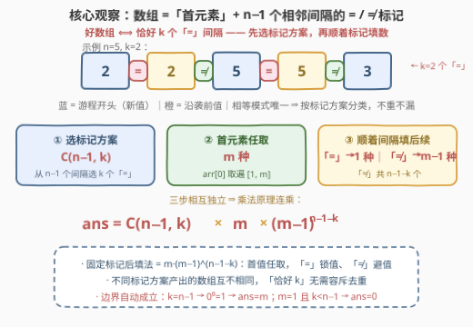
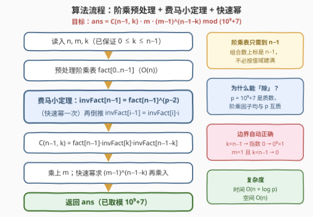

# LeetCode 统计恰好有K个相等相邻元素的数组数目 题解

## 1. 题目概述

- **标题 / 题号**：统计恰好有K个相等相邻元素的数组数目（#3405，hard）
- **链接**：https://leetcode.cn/problems/count-the-number-of-arrays-with-k-matching-adjacent-elements/
- **难度**：困难
- **标签**：数学、组合数学、费马小定理

**题意**：给你三个整数 `n`、`m`、`k`。长度为 `n` 的**好数组** `arr` 定义如下：

- `arr` 中每个元素都在**闭区间** `[1, m]` 中。
- **恰好**有 `k` 个下标 `i`（其中 `1 <= i < n`）满足 `arr[i - 1] == arr[i]`。

请你返回可以构造出的**好数组**数目。由于答案可能会很大，请你将它对 $10^9 + 7$ **取余**后返回。

**示例 1**：

```text
输入：n = 3, m = 2, k = 1
输出：4
解释：总共有 4 个好数组，分别是 [1, 1, 2]，[1, 2, 2]，[2, 1, 1] 和 [2, 2, 1]。
```

**示例 2**：

```text
输入：n = 4, m = 2, k = 2
输出：6
解释：好数组包括 [1, 1, 1, 2]，[1, 1, 2, 2]，[1, 2, 2, 2]，[2, 1, 1, 1]，[2, 2, 1, 1] 和 [2, 2, 2, 1]。
```

**示例 3**：

```text
输入：n = 5, m = 2, k = 0
输出：2
解释：好数组包括 [1, 2, 1, 2, 1] 和 [2, 1, 2, 1, 2]。
```

**约束**：

- $1 \le n \le 10^5$
- $1 \le m \le 10^5$
- $0 \le k \le n - 1$

> 💡 **读题关键**：① 长度 $n$ 的数组只有 $n - 1$ 对相邻关系——**计数对象是「间隔」而非「元素」**，「恰好 k 个相邻相等」即「n − 1 个间隔里恰好 k 个标记为 =」；② 方案总数上限 $m^n$ 高达 $10^{5 \times 10^5}$ 量级，**枚举数组完全不可行**，必须闭式计数；③ 相邻关系只有「相等 / 不等」两种状态，天然适合「先定标记模式、再顺着标记数填法」的两步计数；④ 取模 $10^9 + 7$ 是质数，组合数 $\binom{n-1}{k}$ 需要**费马小定理**求逆元。

## 2. 解题思路

### 2.1 暴力思路：枚举数组不可行

最朴素的做法是 DFS 枚举全部 $m^n$ 个数组，逐个统计相邻相等的位置数。$n = m = 10^5$ 时方案数约 $10^{500000}$；即使 $m = 2$ 也有 $2^{10^5} \approx 10^{30103}$ 个。结论：**必须放弃「逐个数组」的视角，改为对「相邻关系模式」做整体计数**。小数据（$n \le 6$）的暴力程序仍有价值——充当对拍器验证公式（本文公式已与暴力在 $n \le 6,\ m \le 3$ 的全部参数下对拍通过）。

### 2.2 核心观察：间隔标记模型——一步到位的乘法公式

**第一步：把数组翻译成间隔标记。** 长度 $n$ 的数组有 $n - 1$ 个相邻间隔，每个间隔要么是「$=$」（$arr[i-1] = arr[i]$），要么是「$\ne$」。于是「好数组」$\iff$ **恰好 $k$ 个间隔标记为 $=$**。

**第二步：按标记方案分类，不重不漏。** 任意数组的「相等模式」唯一——它自身哪些相邻对相等是客观事实，只会落入一个标记方案；反过来，任选一个标记方案，都存在数组严格实现它（「$\ne$」间隔只要 $m \ge 2$ 就能避开前值，$m = 1$ 时若无「$\ne$」间隔也成立）。因此可以按「哪 $k$ 个间隔是 $=$」把所有好数组**划分**成 $\binom{n-1}{k}$ 类，类间互斥、类内同构。

**第三步：固定标记后顺着填数——乘法原理。** 首元素 $arr[0]$ 任取，有 $m$ 种；其后每个位置的取值由它左侧的间隔标记决定：

- 标记「$=$」：值被前一个元素**锁定**，$1$ 种；
- 标记「$\ne$」：只要**避开**前一个值，$m - 1$ 种。

「$=$」间隔共 $k$ 个、「$\ne$」间隔共 $n - 1 - k$ 个，故固定标记下的填法数 $= m \cdot (m-1)^{\,n-1-k}$，与选的是哪 $k$ 个间隔无关。三步合并：

$$\boxed{\;\text{ans} \;=\; \binom{n-1}{k} \cdot m \cdot (m-1)^{\,n-1-k} \;\;\bmod\; (10^9+7)\;}$$



> ⚠️ **边界由 $0^0 = 1$ 的约定自动覆盖，无需特判**：$k = n-1$（全部相等）时 $(m-1)^0 = 1$，答案 $= m$；$m = 1$ 且 $k < n-1$ 时 $(m-1)^{\text{正数}} = 0$，答案自动归零；$n = 1$ 时 $\binom{0}{0} \cdot m \cdot 1 = m$。快速幂按「指数为 0 返回 1」实现即可。

### 2.3 算法流程：阶乘预处理 + 费马小定理 + 快速幂

公式里唯一的「硬骨头」是模意义下的组合数 $\binom{n-1}{k}$。$p = 10^9 + 7$ 是质数且 $n - 1 < p$（阶乘因子均与 $p$ 互质），费马小定理给出 $a^{\,p-2} \equiv a^{-1} \pmod p$：

1. **预处理阶乘表** $\text{fact}[0..n-1]$：$\text{fact}[i] = \text{fact}[i-1] \cdot i \bmod p$，$O(n)$；
2. **建逆元阶乘表**：快速幂算 $\text{invFact}[n-1] = \text{fact}[n-1]^{\,p-2}$，再用 $\text{invFact}[i-1] = \text{invFact}[i] \cdot i$ 线性倒推，$O(n + \log p)$；
3. **套公式**：$\binom{n-1}{k} = \text{fact}[n-1] \cdot \text{invFact}[k] \cdot \text{invFact}[n-1-k]$，再乘 $m$、乘 $(m-1)^{\,n-1-k}$（又一次快速幂），全程只有乘法。



> 💡 本题只用到 $\binom{n-1}{k}$ 这一个组合数，但**建整张逆元阶乘表**仍是标准做法——代码更短、不易错，且面对「至多 K」这类需要 $\sum_j \binom{n-1}{j}$ 的变体（见第 5 节）可直接复用。

### 2.4 示例演算

以示例 2（$n = 4, m = 2, k = 2$）走完整流程：间隔共 $3$ 个（gap₁、gap₂、gap₃），从中选 $k = 2$ 个标「$=$」，共 $\binom{3}{2} = 3$ 种标记；每种标记的填法 $= m \cdot (m-1)^{n-1-k} = 2 \cdot 1^1 = 2$：

| 标记（gap₁, gap₂, gap₃） | 填数过程（首取 1，首取 2 对称） | 好数组 |
|---|---|---|
| $=, =, \ne$ | $1 \to$ 锁定 $\to$ 锁定 $\to$ 换值 | $[1,1,1,2]$、$[2,2,2,1]$ |
| $=, \ne, =$ | $1 \to$ 锁定 $\to$ 换值 $\to$ 锁定 | $[1,1,2,2]$、$[2,2,1,1]$ |
| $\ne, =, =$ | $1 \to$ 换值 $\to$ 锁定 $\to$ 锁定 | $[1,2,2,2]$、$[2,1,1,1]$ |

$3 \times 2 = 6$ ✓，与官方列举的 6 个数组一一对应。再回验另两个示例：示例 1（$k = 1$）$\binom{2}{1} \cdot 2 \cdot 1^1 = 4$ ✓；示例 3（$k = 0$）$\binom{4}{0} \cdot 2 \cdot 1^4 = 2$ ✓——$m = 2$ 时「全不等」只剩两种交替串。

## 3. 参考代码

### C++

```cpp
class Solution {
  public:
    int countGoodArrays(int n, int m, int k) {
        constexpr long long MOD = 1'000'000'007LL;

        // ① 预处理 0..n-1 的阶乘
        vector<long long> fact(n), invFact(n);
        fact[0] = 1;
        for (int i = 1; i < n; ++i) fact[i] = fact[i - 1] * i % MOD;

        // ② 费马小定理：fact[n-1]^(MOD-2) 即其逆元，再线性倒推整张逆元阶乘表
        long long base = fact[n - 1], e = MOD - 2, inv = 1;
        while (e) {
            if (e & 1) inv = inv * base % MOD;
            base = base * base % MOD;
            e >>= 1;
        }
        invFact[n - 1] = inv;
        for (int i = n - 1; i >= 1; --i) invFact[i - 1] = invFact[i] * i % MOD;

        // ③ ans = C(n-1, k) * m * (m-1)^(n-1-k)
        long long c = fact[n - 1] * invFact[k] % MOD * invFact[n - 1 - k] % MOD;
        long long pw = 1, b = m - 1, ex = n - 1 - k;   // 指数为 0 时 pw = 1（0^0 = 1）
        while (ex) {
            if (ex & 1) pw = pw * b % MOD;
            b = b * b % MOD;
            ex >>= 1;
        }
        return c * m % MOD * pw % MOD;
    }
};
```

### Python

```python
class Solution:
    def countGoodArrays(self, n: int, m: int, k: int) -> int:
        MOD = 10**9 + 7

        fact = [1] * n                          # ① 阶乘表
        for i in range(1, n):
            fact[i] = fact[i - 1] * i % MOD

        inv_fact = [1] * n                      # ② 逆元阶乘表（费马小定理 + 倒推）
        inv_fact[n - 1] = pow(fact[n - 1], MOD - 2, MOD)
        for i in range(n - 1, 0, -1):
            inv_fact[i - 1] = inv_fact[i] * i % MOD

        # ③ ans = C(n-1, k) * m * (m-1)^(n-1-k)
        c = fact[n - 1] * inv_fact[k] % MOD * inv_fact[n - 1 - k] % MOD
        return c * m % MOD * pow(m - 1, n - 1 - k, MOD) % MOD
```

> 💡 **实现细节**：① 阶乘表只需到 $n - 1$（组合数上标是 $n-1$），不必按值域 $10^5$ 建满；② Python 三参 `pow` 在底数为 0、指数为 0 时返回 1，边界自动正确；③ C++ 快速幂初值 `pw = 1` 同样保证 $(m-1)^0 = 1$；④ 两次快速幂（逆元、幂）互不相干，也可以合并成一个小函数。

## 4. 复杂度分析

| 维度 | 复杂度 | 说明 |
|------|--------|------|
| 时间复杂度 | $O(n + \log p)$ | 两张阶乘表各 $O(n)$；两次快速幂各 $O(\log p)$，$p = 10^9+7$ |
| 空间复杂度 | $O(n)$ | 两张长度 $n$ 的表；若只需单个组合数也可 $O(1)$ 额外空间逐项算，但表写法更通用 |
| 暴力对照 | $O(n \cdot m^n)$ | DFS 枚举全部数组并统计相邻相等数，$n = m = 10^5$ 时完全不可行 |

## 5. 扩展：DP 视角、游程视角与「至多 K」变体

**DP 视角：闭式公式的另一条来路。** 定义 $f[i][j]$ 为长度 $i$、恰好 $j$ 个相等间隔的数组数。末位两种来路——沿袭前值（$1$ 种，多一个相等间隔）或换新值（$m-1$ 种）：

$$f[i][j] = f[i-1][j-1] + (m-1) \cdot f[i-1][j], \qquad f[1][0] = m$$

数学归纳即得 $f[n][k] = m \binom{n-1}{k} (m-1)^{\,n-1-k}$，正是本题闭式。但 $n, k \le 10^5$ 时 DP 表达 $10^{10}$ 量级，**闭式公式不是优化项而是必需品**；DP 的价值在于不依赖灵感——它是闭式的「保底推导」与小规模对拍基准。

**游程视角。** 恰好 $k$ 个相等间隔 $\iff$ 恰好 $n - k$ 个**游程**（极大相等段）。把数组压缩成「$n-k$ 段、相邻段值不同」的段序列：首段值 $m$ 种、之后每段避开前段 $m-1$ 种，再乘「把 $n$ 个位置切成 $n-k$ 段」的 $\binom{n-1}{n-k-1} = \binom{n-1}{k}$ 种切法——与间隔标记殊途同归。遇到「相邻相同 / 相邻不同」类计数，可在这两种视角间自由切换。

**「至多 K」变体。** 若条件改为「至多 $K$ 个相邻相等」，答案为 $\sum_{j=0}^{K} \binom{n-1}{j} \, m \,(m-1)^{\,n-1-j}$（即游程数 $\ge n - K$ 的数组数），此时整张逆元阶乘表就派上用场；「至少 $K$」则用总数 $m^n \bmod p$（快速幂）减去「至多 $K-1$」。

## 6. 面试要点

1. **为什么「先选间隔、再填数」不重不漏？**

   - 每个数组的相等模式唯一：它自身哪些相邻对相等是客观事实，恰好落入一个标记方案；固定标记后，任取首值 + 逐间隔填数构造出的数组一定严格满足该标记。两边一一对应，$\binom{n-1}{k} \times m \times (m-1)^{n-1-k}$ 不重不漏。

2. **模意义下的组合数怎么算？**

   - $p = 10^9+7$ 是质数且阶乘因子均与 $p$ 互质，费马小定理 $a^{p-2} \equiv a^{-1} \pmod p$；先建 $\text{fact}$，对 $\text{fact}[n-1]$ 做一次快速幂得 $\text{invFact}[n-1]$，再由 $\text{invFact}[i-1] = \text{invFact}[i] \cdot i$ 以 $O(n)$ 倒推整表，之后每个组合数 $O(1)$。

3. **$m = 1$ 或 $k = n-1$ 这些边界要特判吗？**

   - 不用。$k = n-1$ 时指数为 0，按 $0^0 = 1$ 约定答案恰为 $m$（全相同数组）；$m = 1$ 且 $k < n-1$ 时 $(m-1)^{\text{正数}} = 0$ 自动归零。快速幂「指数 0 返回 1」的实现让边界全部自动正确。

4. **为什么不用 DP？DP 和闭式是什么关系？**

   - $f[i][j] = f[i-1][j-1] + (m-1)\,f[i-1][j]$ 正确，但 $O(nk)$ 最大 $10^{10}$ 会超时；归纳可证其解就是闭式。面试先给闭式公式，再主动指出 DP 是它的保底推导与对拍工具，是加分项。

5. **本题与「游程数」有什么联系？**

   - 恰好 $k$ 个相等间隔 $\iff$ 恰好 $n-k$ 个游程。「切 $n-k$ 段 + 相邻段不同值」给出同一公式的另一套直观论证；把「相邻关系计数」翻译成「游程计数」是这类题的常见转译手段。

## 同类练习题

| # | 题目 | 与本题的关联 |
|---|------|-------------|
| 2400 | [恰好移动 k 步到达某一位置的方法数](https://leetcode.cn/problems/number-of-ways-to-reach-a-position-after-exactly-k-steps/)（[站内题解](../2301-2400/2400_恰好移动k步到达某一位置的方法数目.md)） | 同为「一步 $\binom{n}{k}$ 公式 + 费马小定理逆元」的组合计数 |
| 1735 | [生成乘积数组的方案数](https://leetcode.cn/problems/count-ways-to-make-array-with-product/)（[站内题解](../1701-1800/1735_生成乘积数组的方案数.md)） | 质因数分解后逐因子乘组合数，练整张逆元阶乘表的标准建法 |
| 1866 | [恰有 K 根木棍可以看到的排列数目](https://leetcode.cn/problems/number-of-ways-to-rearrange-sticks-with-k-sticks-visible/)（[站内题解](../1801-1900/1866_恰有K根木棍可以看到的排列数目.md)） | DP 推出闭式再取模，与本题「DP → 闭式」互为印证 |
| 2929 | [给小朋友们分糖果 II](https://leetcode.cn/problems/distribute-candies-among-children-ii/)（[站内题解](../2901-3000/2929_给小朋友们分糖果II.md)） | 隔板法 + 容斥的组合计数，体会「不重不漏地划分计数对象」 |
| 2954 | [统计感冒序列的数目](https://leetcode.cn/problems/count-the-number-of-infection-sequences/)（[站内题解](../2901-3000/2954_统计感冒序列的数目.md)） | 乘法原理逐步拆解的序列计数，同为「闭式公式一步到位」 |
