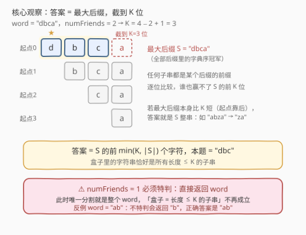
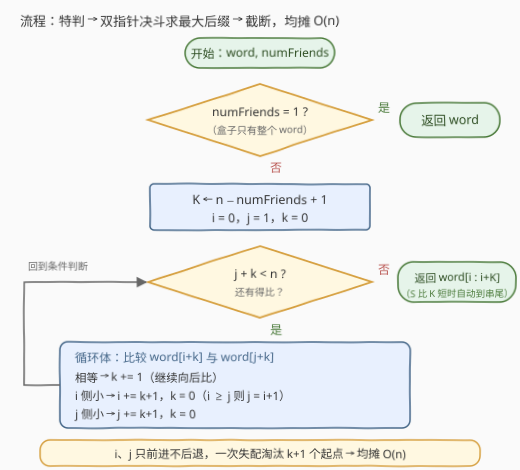

# LeetCode 从盒子中找出字典序最大的字符串 II 题解

- **关联**：[3403. 从盒子中找出字典序最大的字符串 I](https://leetcode.cn/problems/find-the-lexicographically-largest-string-from-the-box-i/) 是同题意的小数据版（$n \le 5 \times 10^3$），朴素的逐候选比较也能过；本题 $n \le 2 \times 10^5$，最坏 $O(n^2)$ 的做法彻底失效，必须把「找最优候选」压到均摊 $O(n)$

## 1. 题目概述

- **标题 / 题号**：从盒子中找出字典序最大的字符串 II（#3406，hard）
- **链接**：https://leetcode.cn/problems/find-the-lexicographically-largest-string-from-the-box-ii/
- **难度**：困难
- **标签**：字符串、双指针

> ⚠️ 本题为 LeetCode 付费题，题意描述根据官方示例用例与 hints 重建，可能与官方题面有出入。

**题意**：给你一个字符串 `word` 和一个整数 `numFriends`。Alice 正在为她的 `numFriends` 位朋友组织一个游戏。游戏分为多个回合，在每一回合中：

- `word` 被分割成 `numFriends` 个**非空**字符串，且该分割方式与之前的任意回合所采用的都**不完全相同**；
- 所有分割出的字符串都会被放入一个盒子中。

在所有回合结束后，找出盒子中**字典序最大的**字符串，返回它。

字符串 $a$ 字典序小于 $b$ 的前提是：在两串第一个不同的位置上，$a$ 的字母在字母表中早于 $b$ 的对应字母；若前 $\min(|a|,|b|)$ 个字符都相同，则较短的字符串更小。

**示例 1**：

```text
输入：word = "dbca", numFriends = 2
输出："dbc"
解释：所有可能的分割方式为："d" 和 "bca"、"db" 和 "ca"、"dbc" 和 "a"，
     盒子里 {d, bca, db, ca, dbc, a} 中字典序最大的是 "dbc"。
```

**示例 2**：

```text
输入：word = "gggg", numFriends = 4
输出："g"
解释：唯一的分割方式是 "g"、"g"、"g"、"g"。
```

**约束**：

- $1 \le word.length \le 2 \times 10^5$
- `word` 仅由小写英文字母组成
- $1 \le numFriends \le word.length$

> 💡 **读题关键**：① 「多个回合、每回合分割互不相同」= 把**每一种**分割都玩一遍，盒子里积累的是**所有可能的部分字符串**；② 每个部分是 `word` 的**连续**子串；③ 官方 hint 指向后缀数组，但本题只需要「第一名」，双指针决斗即可均摊 $O(n)$。

## 2. 解题思路

### 2.1 暴力思路：枚举分割或枚举子串，都过不去

第一层暴力是枚举所有分割方式：把 $n$ 个字符切成 `numFriends` 段非空串，方案数是组合数 $\binom{n-1}{numFriends-1}$，指数级爆炸。

先做一个关键转化（详见 2.2 观察一）：**盒子里的字符串恰好是 `word` 中所有长度不超过 $K = n - numFriends + 1$ 的子串**。于是暴力变成「枚举所有 $O(n^2)$ 个子串、逐个比较取最大」——每次比较 $O(n)$，总计 $O(n^3)$。即使像 3403 那样先观察「答案必以最大字符开头」、只在最大字符出现的那些起点处各取一个最长候选再两两比较，最坏情况（如 `aaaa…a`，所有起点并列最优）仍要 $O(n^2)$ 次字符比较：

- 3403：$n \le 5 \times 10^3$，$O(n^2) \approx 2.5 \times 10^7$，能过；
- 本题：$n \le 2 \times 10^5$，$O(n^2) \approx 4 \times 10^{10}$，必超时。

突破口在于：别把「候选集合」当成平铺的子串集合，而是看到它们都挂在**后缀**这棵树上。

### 2.2 核心观察：答案 = 最大后缀截断到 K 位



**观察一：盒子 = 所有长度不超过 $K$ 的子串**，其中 $K = n - numFriends + 1$。

- **必要性**：任一回合中，某个部分的长度为 $L$，其余 $numFriends - 1$ 个非空部分至少各占 1 个字符，故 $L \le n - (numFriends - 1) = K$；
- **充分性**：任取长度 $L \le K$ 的子串 `word[i:j]` 作为一部分，剩下的 $n - L$ 个字符（左段 + 右段）至少有 $numFriends - 1$ 个，总能切成 $numFriends - 1$ 个非空段（不够分时每段砍 1 个字符即可）。

> ⚠️ **特判 $numFriends = 1$**：此时唯一的分割就是 `word` 本身，盒子只有一整个串，上述「充分性」不再成立。反例 `word = "ab"`：$K = 2$，长度 $\le 2$ 的子串中 `"b"` 最大，但正确答案是 `"ab"`。

**观察二：答案 = 字典序最大的后缀 $S$ 的前 $\min(K, |S|)$ 个字符。**

任何子串都是某个后缀的前缀（**引理**）。设 $S = word[p:]$ 是所有后缀中字典序最大者，则答案就是 $S$ 截断到 $K$ 位。对任意长度 $\le K$ 的子串 $T$（设它是后缀 $A$ 的前缀，$A \le S$）：

- 若 $A$ 是 $S$ 的前缀：则 $T$ 也是 $S$ 的前缀且 $|T| \le K$，故 $T$ 是「$S$ 截到 $K$」的前缀，$T \le$ 截断结果；
- 若 $A$ 与 $S$ 在位置 $q$ 首次不同（$A[q] < S[q]$）：
  - $q < |T|$：则 $T[q] = A[q] < S[q]$，且 $q < |T| \le K$ 保证这一位落在截断结果内，$T <$ 截断结果；
  - $q \ge |T|$：则 $T$ 与 $S$ 的前 $|T|$ 位完全相同，$T$ 是截断结果的前缀，$T \le$ 截断结果；
- （「$S$ 是 $A$ 的真前缀」不可能：那意味着 $A > S$，与 $S$ 最大矛盾。）

而「$S$ 截到 $K$」本身长度 $\le K$，由观察一它必然出现在盒子里。两面夹逼，它就是答案。∎

> 💡 **直觉**：想字典序最大，就要「第一位尽量大、第二位尽量大、……」一路走下去——最大后缀 $S$ 恰好是这场逐位竞赛的全程冠军；截断只发生在它比 $K$ 还长的时候。当 $S$ 本身比 $K$ 短（最大后缀起点很靠后）时，答案就是 $S$ 整串，例如 `word = "abza"`、$numFriends = 2$ 时答案是 `"za"` 而非更长的 `"abz"`/`"bza"`。

### 2.3 算法流程图：双指针决斗，均摊 O(n)



剩下的问题：**如何 $O(n)$ 求最大后缀的起点？** 用 [1163. 按字典序排在最后的子串](https://leetcode.cn/problems/last-substring-in-lexicographical-order/) 的双指针决斗：

- 维护两个候选起点 $i < j$ 和已匹配长度 $k$：当前有 $word[i..i+k-1] = word[j..j+k-1]$；
- 比较 $word[i+k]$ 与 $word[j+k]$：
  - **相等**：$k \mathrel{+}= 1$，继续向后比；
  - **$i$ 侧字符小**：对每个 $t \in [0, k]$，后缀 $word[i+t..]$ 与 $word[j+t..]$ 恰在偏移 $k - t$ 处分出胜负且前者更小——起点 $i..i+k$ **全体淘汰**，$i$ 直接跳到 $i + k + 1$（若越过 $j$ 则 $j = i + 1$）；
  - **$j$ 侧字符小**：对称地 $j$ 跳到 $j + k + 1$。

**为什么是均摊 $O(n)$**：$i$、$j$ 只前进不后退；每发生一次「跳」，被淘汰一方一次跨过 $k + 1 \ge 1$ 个位置，而为此付出的恰好是此前 $k$ 次「相等」比较。两个指针的总移动量 $\le 2n$，比较次数总数 $O(n)$。

最后返回 $word[i : \min(i + K, n)]$ 即可（Python 切片自动截尾，C++ 里要显式 `min`）。

### 2.4 示例演算

**示例 1**：`word = "dbca"`，$numFriends = 2$，$K = 3$。决斗过程：

| 步骤 | $i$ | $j$ | $k$ | 比较 | 动作 |
|---|---|---|---|---|---|
| 1 | 0 | 1 | 0 | `'d' > 'b'` | $j \leftarrow 2$ |
| 2 | 0 | 2 | 0 | `'d' > 'c'` | $j \leftarrow 3$ |
| 3 | 0 | 3 | 0 | `'d' > 'a'` | $j \leftarrow 4$ |

$j + k = 4 = n$，循环结束。最大后缀起点 $i = 0$，即 `"dbca"`，截到 $K = 3$ 位 → **`"dbc"`** ✓。

**短后缀情形**：`word = "abza"`，$numFriends = 2$，$K = 3$：

| 步骤 | $i$ | $j$ | $k$ | 比较 | 动作 |
|---|---|---|---|---|---|
| 1 | 0 | 1 | 0 | `'a' < 'b'` | $i \leftarrow 1$（$i \ge j$，故 $j \leftarrow 2$） |
| 2 | 1 | 2 | 0 | `'b' < 'z'` | $i \leftarrow 2$（$i \ge j$，故 $j \leftarrow 3$） |
| 3 | 2 | 3 | 0 | `'z' > 'a'` | $j \leftarrow 4$ |

$i = 2$，最大后缀 `"za"` 长度 $2 < K = 3$，不截断 → 答案 **`"za"`**。验证：长度 $\le 3$ 的子串中 `"abz"`、`"bza"` 开头即败，`"za"` 最大 ✓——印证「最大后缀很短时，答案就是它本身」。

## 3. 参考代码

### C++

```cpp
class Solution {
  public:
    string answerString(string word, int numFriends) {
        int n = word.size();
        if (numFriends == 1) return word;
        int K = n - numFriends + 1;

        // 双指针决斗：求字典序最大后缀的起点 i（1163 原型）
        int i = 0, j = 1, k = 0;
        while (j + k < n) {
            if (word[i + k] == word[j + k]) {
                k++;
            } else if (word[i + k] < word[j + k]) {
                i += k + 1;             // 起点 i..i+k 全体淘汰
                k = 0;
                if (i >= j) j = i + 1;  // 维持 j > i
            } else {
                j += k + 1;             // 起点 j..j+k 全体淘汰
                k = 0;
            }
        }
        return word.substr(i, min(K, n - i));
    }
};
```

### Python

```python
class Solution:
    def answerString(self, word: str, numFriends: int) -> str:
        if numFriends == 1:
            return word
        n = len(word)
        K = n - numFriends + 1

        # 双指针决斗：求字典序最大后缀的起点 i
        i, j, k = 0, 1, 0
        while j + k < n:
            if word[i + k] == word[j + k]:
                k += 1
            elif word[i + k] < word[j + k]:
                i += k + 1              # 起点 i..i+k 全体淘汰
                k = 0
                if i >= j:
                    j = i + 1           # 维持 j > i
            else:
                j += k + 1              # 起点 j..j+k 全体淘汰
                k = 0

        return word[i:i + K]            # 切片自动处理「S 比 K 短」
```

> 💡 两处易错点：① `numFriends == 1` 不特判，`"ab"` 会错误地返回 `"b"`；② 截断长度取 $\min(K, n - i)$——最大后缀可能比 $K$ 短，C++ 里直接 `substr(i, K)` 虽不会越界但语义上要清楚这里取的是「能取多少取多少」。

## 4. 复杂度分析

| 维度 | 复杂度 | 说明 |
|------|--------|------|
| **时间复杂度** | $O(n)$ | $i$、$j$ 只前进不后退，每次失配跳跃 $k+1 \ge 1$ 格且代价恰为此前 $k$ 次相等比较，总移动量 $\le 2n$，均摊线性 |
| **空间复杂度** | $O(1)$ | 仅常数个指针变量（返回的子串是必然输出，不计入） |

## 5. 扩展：后缀数组视角

官方 hint 是「Use suffix array」——后缀数组把**所有后缀按字典序排序**，排名最高者正是本题需要的 $S$：

- **倍增法** $O(n \log n)$ 或 **SA-IS** $O(n)$ 构建后缀数组后，取排名最大的后缀、截断到 $K$ 即得答案；
- 本题的「任何子串都是某个后缀的前缀」正是后缀数组理论的出发点：子串全体 = 后缀的前缀全体。排序后第 $i$ 名后缀的所有前缀在「子串字典序」上构成一段连续区间，这也是「第 $k$ 小子串」「本质不同子串计数」等问题的通用入口；
- 本题只需要**第一名**，双指针决斗 $O(n)$、代码量 15 行，比后缀数组轻得多；一旦题目要求「第 $k$ 大子串」或在线回答任意排名，才值得动用后缀数组 + height 数组的全套结构。

## 6. 面试要点

1. **为什么盒子里的字符串 = 所有长度不超过 $K$ 的子串？**

   - 必要性：一部分长 $L$，其余 $numFriends-1$ 个非空部分各占至少 1 字符，$L \le n - numFriends + 1 = K$；
   - 充分性：长 $L \le K$ 的子串取出后，剩余 $n - L \ge numFriends - 1$ 个字符总能切成 $numFriends - 1$ 个非空段；
   - 边界：$numFriends = 1$ 时「切 0 段」要求剩余为空，盒子退化为只有整个 `word`，必须特判。

2. **为什么答案就是「最大后缀截断到 $K$」？**

   - 任何子串 $T$ 都是某个后缀 $A$ 的前缀，而 $A \le S$（最大后缀）；
   - 逐位分析：$A$ 是 $S$ 前缀 → $T$ 是截断结果的前缀；首个不同位落在 $T$ 内 → $T$ 该位更小直接出局；落在 $T$ 外 → $T$ 又变回截断结果的前缀。三种情况 $T$ 都不占优，而截断结果本身合法。

3. **双指针决斗为什么是均摊 $O(n)$？**

   - 失配时被淘汰一方的指针一次跳 $k+1$ 格，正好「结清」此前 $k$ 次相等比较的代价；
   - $i$、$j$ 单调前进、总移动量 $\le 2n$，故总比较次数线性。

4. **不特判 `numFriends == 1` 会怎样？**

   - `word = "ab"`：套「最大后缀截断」会返回 `"b"`，但唯一分割是整串，正确答案 `"ab"`。根因是「剩余 0 段」不允许剩余任何字符，观察一的充分性在该边界失效。

5. **与 3403 的解法差异在哪？**

   - 数据范围从 $5 \times 10^3$ 放大到 $2 \times 10^5$；「最大字符起点 + 候选两两比较」在并列最坏（如全 `a` 串）下是 $O(n^2) \approx 4 \times 10^{10}$，不可行；
   - 改看后缀结构后，「找所有候选中的最优」收敛为「找最大后缀」，可用决斗法线性完成。

## 同类练习题

| # | 题目 | 与本题的关联 |
|---|------|-------------|
| 3403 | [从盒子中找出字典序最大的字符串 I](https://leetcode.cn/problems/find-the-lexicographically-largest-string-from-the-box-i/) | 同题意小数据版，适合先写暴力、验证「盒子 = 长度 $\le K$ 的子串」这一转化 |
| 1163 | [按字典序排在最后的子串](https://leetcode.cn/problems/last-substring-in-lexicographical-order/) | 本题双指针决斗的原始原型——$O(n)$ 求最大后缀 |
| 1754 | [构造字典序最大的合并字符串](https://leetcode.cn/problems/largest-merge-of-two-strings/) | 同属「每步选字典序更大者」的贪心比较，注意其「取前缀更大者」的陷阱与本题的逐位比较论证互补 |
| 1044 | [最长重复子串](https://leetcode.cn/problems/longest-duplicate-substring/) | 后缀数组 / 哈希在子串问题上的经典应用，官方 hint 指向的工具箱 |
