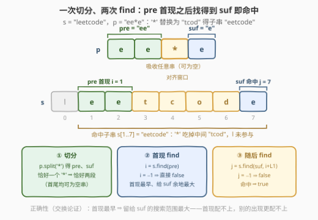
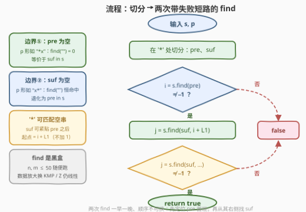

# 子串匹配模式

- **题目名称**：子串匹配模式
- **链接**：[3407. 子串匹配模式](https://leetcode.cn/problems/substring-matching-pattern/)
- **难度**：简单
- **标签**：字符串、字符串匹配
- **关联**：28（`str.find` 原语）、3303（前后缀夹缝匹配的 Z 函数版）、44（多 `*` 通配符匹配）

## 1. 题目概述

给你一个字符串 `s` 和一个模式字符串 `p`，其中 `p` **恰好**包含**一个** `'*'` 符号。

`p` 中的 `'*'` 可以被替换为**零个或多个**字符组成的任意字符序列。

如果 `p` 可以变成 `s` 的**子字符串**，返回 `true`，否则返回 `false`。

**示例 1**：

```text
输入：s = "leetcode", p = "ee*e"
输出：true
解释：将 '*' 替换为 "tcod"，子串 "eetcode" 匹配模式串。
```

**示例 2**：

```text
输入：s = "car", p = "c*v"
输出：false
解释：不存在匹配模式串的子字符串。
```

**示例 3**：

```text
输入：s = "luck", p = "u*"
输出：true
解释：子串 "u"、"uc" 和 "uck" 都匹配模式串。
```

**约束条件**：

- $1 \le \text{s.length} \le 50$
- $1 \le \text{p.length} \le 50$
- `s` 只包含小写英文字母。
- `p` 只包含小写英文字母和一个 `'*'` 符号。

> 💡 **读题关键**：① `p` 恰好一个 `'*'` ⇒ `p` 一定可以切成 `pre + '*' + suf` 两段（首尾**允许为空**）；② `'*'` 匹配任意串**包括空串**，所以 `suf` 可以紧贴 `pre` 结尾；③ 问的是「p 能变成 s 的**子串**」而非「s 整串匹配 p」——匹配目标藏在 `s` 内部的任意位置，且长度不固定（这正是示例 3 的 `"u"`/`"uc"`/`"uck"` 三者皆可的原因）。

---

## 2. 解题思路

### 2.1 暴力思路：枚举替换内容 / 枚举出现位置

**暴力一（枚举替换）**：把 `s` 的每个子串依次塞进 `'*'` 得到完整串 $p'$，再检查 $p'$ 是否为 `s` 的子串（`s.find(p') != -1`）。子串有 $O(n^2)$ 个，每次检查 $O(n \cdot m)$，总计 $O(n^3 m)$——$n, m \le 50$ 也能过，但纯属浪费。

**暴力二（枚举位置对）**：注意到匹配发生当且仅当 `pre` 出现在某位置 $a$、`suf` 出现在某位置 $b$ 且 $b \ge a + L_1$（$L_1 = \lvert \text{pre} \rvert$），枚举所有出现位置对即可判定，$O(n^2)$。

两者都在「无谓地枚举」——其实两个 `find` 就够了。

### 2.2 核心观察：一次切分 + 两次 find（贪心首现）



把 `p` 在 `'*'` 处切分：$p = \text{pre} \cdot \texttt{'*'} \cdot \text{suf}$。则

$$p \text{ 能变成 } s \text{ 的子串} \iff \exists\, a, b:\ s[a{:}a{+}L_1] = \text{pre} \ \wedge\ s[b{:}b{+}L_2] = \text{suf} \ \wedge\ b \ge a + L_1$$

即「**pre 的某个出现之后还跟得上一个 suf**」。于是得到贪心两步：

1. **第一次 find**：$i = \text{s.find}(\text{pre})$，取 pre 的**首次出现**；$i = -1$ 直接 `false`；
2. **第二次 find**：从 $i + L_1$ 起找 suf，$j = \text{s.find}(\text{suf},\, i + L_1)$；$j \ne -1$ 即 `true`。

**贪心正确性（交换论证）**：若存在任何合法对 $(a, b)$（$s[a{:}a{+}L_1] = \text{pre}$，$b \ge a + L_1$ 且 suf 在 $b$ 处出现），而 $a_0$ 是 pre 的首现，则 $a_0 \le a$，于是 $b \ge a + L_1 \ge a_0 + L_1$——suf 在 $a_0 + L_1$ 之后**仍然出现**，第二次 find 必命中。反之，贪心找到的对本身合法。**首现最早，留给 suf 的搜索范围最大；首现都配不上，别的出现更配不上。**

> ⚠️ **常见错误：只检查 `pre + suf` 是不是 `s` 的子串**。反例：`s = "axbxc"`、`p = "a*c"`——`"ac"` 并不是 `s` 的子串，但答案为 `true`（$a=0$ 处 `pre="a"`，$b=4$ 处 `suf="c"`，`'*'` 吸收中间 `"xbx"` 得子串 `"axbxc"`）。`'*'` 的本质是**允许 pre 与 suf 之间有任意间隙**，把间隙压成 0 会漏解。反过来「`pre + suf` 是子串 ⇒ 答案 true」倒是成立的（`'*'` 取空串），所以这个错误解只会**误报 false**。

### 2.3 算法流程图



| 步骤 | 操作 | 失败短路 |
|------|------|----------|
| ① 切分 | `pre, suf = p.split('*')`（恰好一个 `'*'` ⇒ 恰好两段） | —— |
| ② 首现 | `i = s.find(pre)` | `i == -1` ⇒ `return false` |
| ③ 随后 | `j = s.find(suf, i + len(pre))` | `j == -1` ⇒ `return false`，否则 `true` |

**边界（天然兼容，无需特判）**：

- `pre` 为空（`p` 形如 `"*x"`）：`find("") == 0`，等价于 `suf in s`；
- `suf` 为空（`p` 形如 `"x*"`）：从 $i + L_1$ 找空串恒命中（注意 $i + L_1 \le n$ 恒成立，因为 pre 在 $i$ 处完整出现），等价于 `pre in s`；
- `p = "*"`：对任何非空 `s` 返回 `true`（空串替换，`""` 本身就是子串）。

### 2.4 示例演算

| 示例 | 切分 pre / suf | ① 首现 $i$ | ② 从 $i+L_1$ 找 suf | 结果 |
|------|----------------|-----------|---------------------|------|
| `s="leetcode"`, `p="ee*e"` | `"ee"` / `"e"` | $i = 1$ | 从 3 找 `"e"` → $j = 7$ | **true**（`'*'` 吃掉 `"tcod"`） |
| `s="car"`, `p="c*v"` | `"c"` / `"v"` | $i = 0$ | 从 1 找 `"v"` → $-1$ | **false** |
| `s="luck"`, `p="u*"` | `"u"` / `""` | $i = 1$ | 从 2 找 `""` → $j = 2$ | **true**（`"u"`/`"uc"`/`"uck"` 皆可） |
| `s="axbxc"`, `p="a*c"` | `"a"` / `"c"` | $i = 0$ | 从 1 找 `"c"` → $j = 4$ | **true**（注意 `"ac"` 不是子串，2.2 的反例） |

---

## 3. 参考代码

### C++

```cpp
class Solution {
  public:
    bool hasMatch(string s, string p) {
        int star = p.find('*');
        string pre = p.substr(0, star), suf = p.substr(star + 1);
        size_t i = s.find(pre);
        if (i == string::npos) return false;
        return s.find(suf, i + pre.size()) != string::npos;
    }
};
```

### Python

```python
class Solution:
    def hasMatch(self, s: str, p: str) -> bool:
        pre, suf = p.split('*')
        i = s.find(pre)
        return i != -1 and s.find(suf, i + len(pre)) != -1
```

> 💡 **实现细节**：① `p.split('*')` 在恰好一个 `'*'` 时严格返回两段（`"*"` → `["", ""]`），无需担心段数；② 两次 `find` 一早一晚、**顺序不可换**——第二次必须以第一次的结果为起点；③ C++ 里 `s.find("", pos)` 在 `pos <= size()` 时返回 `pos`，且 `i + pre.size() <= s.size()` 恒成立（pre 在 `i` 处完整出现），空串边界不会误判成 `npos`；④ 也可用 `string::npos` 的 `find` 重载一次写成三目，但拆开更可读。

---

## 4. 复杂度分析

设 $n = \lvert s \rvert$、$m = \lvert p \rvert$（均 $\le 50$）。

| 维度 | 复杂度 | 说明 |
|------|--------|------|
| **时间** | $O(n \cdot m)$（朴素 find 最坏）/ $O(n + m)$（高效 find） | 两趟查找：先定位 pre 首现，再从 $i + L_1$ 找 suf；CPython 的 `str.find` 采用 two-way 等混合算法，长串下线性 |
| **空间** | $O(m)$ | 切分出的 `pre` / `suf` 副本；若改用下标原地比较可压到 $O(1)$ |
| **对比暴力** | 暴力一 $O(n^3 m)$ / 暴力二 $O(n^2)$ | 两个 find 把「枚举替换/枚举位置对」压缩成「首现 + 起点受限的查找」 |

> 💡 本题 $n, m \le 50$，任何写法都能过；复杂度的意义在于**数据放大时套路不变**——把两个 `find` 换成 KMP / Z 函数预处理（见第 5 节），依旧是两趟线性扫描。

---

## 5. 扩展：数据放大后的工业级做法与多 `*` 推广

**放大到 $n, m \sim 10^6$**：`find` 换成 KMP 或 Z 函数——一趟求出 `pre` 在 `s` 中的所有出现（首现即最早）、一趟求出 `suf` 的所有出现，判定「suf 的最晚出现 $\ge$ pre 的最早出现 $+ L_1$」即可，总复杂度 $O(n + m)$。这与姊妹题 [3303. 第一个几乎相等子字符串的下标](https://leetcode.cn/problems/find-the-occurrence-of-first-almost-equal-substring/)（站内题解见 [3301-3400 区间](../3301-3400/3303_第一个几乎相等子字符串的下标.md)）同源：那题是「前缀覆盖 + 后缀覆盖 + 中间空隙至多 1 格」的 Z 函数版，本题相当于空隙**无限制**的退化版，两个普通 `find` 就够。

**推广到多个 `*`**（[44. 通配符匹配](https://leetcode.cn/problems/wildcard-matching/)）：单 `'*'` 的「切分 + 两次 find」不再适用，标准做法是贪心双指针——记录上一个 `'*'` 的位置与 `s` 中的回退点，失配时星号多吞一个字符重来，星号只前进不回退，均摊 $O(nm)$；或区间 DP `f[i][j]`（$p$ 前 $i$ 个字符与 $s$ 前 $j$ 个字符是否匹配）。若 `'*'` 还要与前一字符绑定成「匹配任意长度该字符」（[10. 正则表达式匹配](https://leetcode.cn/problems/regular-expression-matching/)），则只剩 DP 一条路。

---

## 6. 面试要点

1. **为什么 `pre` 取第一次出现就是安全的？**

   > 交换论证：设合法对 $(a, b)$ 存在（pre 在 $a$、suf 在 $b \ge a + L_1$），首现 $a_0 \le a$，则 $b \ge a_0 + L_1$——suf 在首现之后仍出现，第二次 find 必命中。首现是给 suf 留余地最大的选择。

2. **第二次 find 的起点为什么是 $i + L_1$，不是 $i + L_1 + 1$？**

   > `'*'` 可以匹配**空串**，suf 允许紧贴 pre 结尾。差一错误会直接翻车：`s = "ab"`、`p = "a*b"` 时正确起点 $i + L_1 = 1$ 恰好命中 `"b"`；起点误写成 $i + L_1 + 1 = 2$ 就跳过唯一的 `'b'`，误判 false。

3. **只检查 `pre + suf` 是否为 `s` 的子串，错在哪？**

   > 会误报 false：`s = "axbxc"`、`p = "a*c"` 时 `"ac"` 不是子串，但 `'*'` 吸收 `"xbx"` 后整个 `s` 就是匹配子串，答案 true。`'*'` 的语义是允许 pre 与 suf 之间有**任意间隙**，压成零间隙是加强约束。反向（`pre+suf` 是子串 ⇒ true）倒是成立的。

4. **`pre` 或 `suf` 为空串时，`find` 的行为是什么？会不会出错？**

   > `find("")` 的语义：Python 中起点 $\le n$ 时返回起点（`"abc".find("") == 0`）；C++ 中 `pos <= size()` 时返回 `pos`。由于 pre 在 $i$ 处完整出现，$i + L_1 \le n$ 恒成立，所以空串查找永不越界、恒命中。`p = "*x"` 退化成 `suf in s`，`p = "x*"` 退化成 `pre in s`，`p = "*"` 对任何非空 `s` 恒 true——全都不需要特判。

5. **如果把 `'*'` 的个数放宽到多个，怎么做？**

   > 贪心双指针（44 通配符匹配）：`s`、`p` 各一个指针，遇到 `'*'` 记录 `(星号位置, s 回退点)`，失配时星号多吞一个字符并复位 `s` 指针；星号与回退点都只前进，均摊 $O(nm)$。也可区间 DP，状态 `f[i][j]` 含「空串匹配」转移，$O(nm)$ 时空。

---

## 7. 同类练习题

- [28. 找出字符串中第一个匹配项的下标](https://leetcode.cn/problems/find-the-index-of-the-first-occurrence-in-a-string/)（[站内题解](../0001-0100/28_找出字符串中第一个匹配项的下标.md)）：`str.find` / KMP 本尊——本题两次 find 的底层原语
- [459. 重复的子字符串](https://leetcode.cn/problems/repeated-substring-pattern/)（[站内题解](../0401-0500/459_重复的子字符串.md)）：`s + s` 中 `find(s)` 的拼接技巧——把 find 当黑盒玩的经典变体
- [686. 重复叠加字符串匹配](https://leetcode.cn/problems/repeated-string-match/)（[站内题解](../0601-0700/686_重复叠加字符串匹配.md)）：求「至少叠加几次才能让 b 成为子串」——同样是 find 判定 + 边界推理
- [796. 旋转字符串](https://leetcode.cn/problems/rotate-string/)（[站内题解](../0701-0800/796_旋转字符串.md)）：`s + s` 中找 `goal` 判定旋转关系——「拼接 + find」家族又一员
- [3303. 第一个几乎相等子字符串的下标](https://leetcode.cn/problems/find-the-occurrence-of-first-almost-equal-substring/)（[站内题解](../3301-3400/3303_第一个几乎相等子字符串的下标.md)）：前后缀夹住中间空隙的匹配思想进阶版——本题「空隙无限制」的 Z 函数版亲戚
