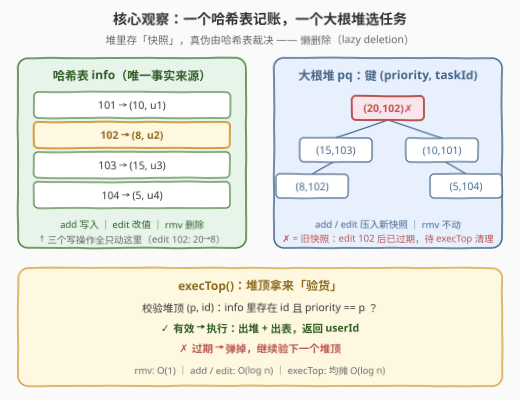
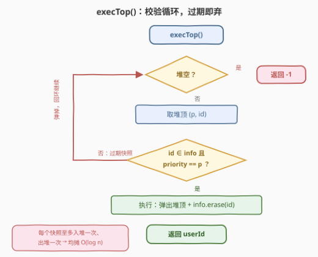

# 设计任务管理器

- **题目名称**：设计任务管理器
- **链接**：[3408. 设计任务管理器](https://leetcode.cn/problems/design-task-manager/)
- **难度**：中等
- **标签**：设计、哈希表、有序集合、堆（优先队列）

## 1. 题目概述

设计一个任务管理器 `TaskManager`，让用户管理各自的任务（每个任务有唯一 `taskId` 和一个优先级 `priority`），要求高效支持添加、修改、执行、删除：

- `TaskManager(vector<vector<int>>& tasks)`：初始化，`tasks` 中每项为 `[userId, taskId, priority]`，表示给用户 `userId` 添加一个优先级为 `priority` 的任务 `taskId`；
- `add(userId, taskId, priority)`：给用户 `userId` 添加优先级为 `priority` 的任务 `taskId`，**保证 `taskId` 不在系统中**；
- `edit(taskId, newPriority)`：更新已存在任务 `taskId` 的优先级为 `newPriority`，**保证 `taskId` 存在**；
- `rmv(taskId)`：从系统中删除任务 `taskId`，**保证 `taskId` 存在**；
- `execTop()`：执行**所有用户**的任务中优先级**最高**的任务；若并列最高，执行 `taskId` **最大**的那个。执行后该 `taskId` 从系统中删除，返回该任务所属的 `userId`；若系统中没有任何任务，返回 `-1`。

注意：一个用户可能持有多个任务。

**示例 1**：

```text
输入：
["TaskManager", "add", "edit", "execTop", "rmv", "add", "execTop"]
[[[[1, 101, 10], [2, 102, 20], [3, 103, 15]]], [4, 104, 5], [102, 8], [], [101], [5, 105, 15], []]

输出：
[null, null, null, 3, null, null, 5]

解释：
TaskManager([[1,101,10],[2,102,20],[3,103,15]])  // 用户 1/2/3 各一个任务
add(4, 104, 5)      // 用户 4 添加任务 104，优先级 5
edit(102, 8)        // 任务 102 优先级 20 → 8
execTop()           // 返回 3：最高优先级 15 的任务 103（102 已降到 8）
rmv(101)            // 删除任务 101
add(5, 105, 15)     // 用户 5 添加任务 105，优先级 15
execTop()           // 返回 5：任务 105 优先级 15 执行
```

**约束条件**：

- $1 \le \text{tasks.length} \le 10^5$
- $0 \le \text{userId},\ \text{taskId} \le 10^5$
- $0 \le \text{priority},\ \text{newPriority} \le 10^9$
- `add`、`edit`、`rmv`、`execTop` 总调用次数不超过 $2 \times 10^5$，输入保证 `taskId` 合法

> 💡 **读题关键**：① 四个写操作都**保证 taskId 合法**，无需异常处理，专心做数据结构；② `execTop` 的取任务规则是二元组序——**优先级最高，平局取 taskId 最大**，这直接决定了「键」的形状；③ `edit` 会**中途改优先级**、`rmv` 会**中途删除**，这意味着「能取最值」还不够，结构必须能在最值变化时同步维护。

---

## 2. 解题思路

### 2.1 暴力思路

把所有任务存进哈希表 `taskId → (priority, userId)`，每次操作直接扫全表：

- `add` / `edit` / `rmv`：改哈希表，$O(1)$；
- `execTop`：遍历所有存活任务，找 $(\text{priority},\ \text{taskId})$ 字典序最大者，$O(n)$。

操作总数 $Q \le 3 \times 10^5$（初始 $10^5$ + 后续 $2\times10^5$），若 `execTop` 占大头，总代价达 $10^{10}$ 级别——超时。**病根**：每次查询都为「找最值」付出全表扫描，而正解是让一个**天然有序的结构**（堆/有序集合）替你时刻记住最值。

### 2.2 核心观察：一个哈希表记账，一个大根堆选任务

维护两套结构，各司其职：

| 结构 | 存什么 | 作用 |
|------|--------|------|
| 哈希表 `info` | `taskId → (priority, userId)` | **唯一事实来源**：任务的当前状态（`add`/`edit`/`rmv` 只改它） |
| 大根堆 `pq` | 二元组 $(\text{priority},\ \text{taskId})$ | **选任务**：堆顶即「优先级最高、平局 taskId 最大」 |

堆的键把 `execTop` 的二元组规则**原样编码**进去：大根堆按字典序比较，先比 `priority`（大者优先）、再比 `taskId`（大者优先）——平局规则免费获得。

麻烦在 `edit` / `rmv`：堆不支持高效修改、删除任意元素。经典对策是**懒删除（lazy deletion）**——堆里存的是任务的**快照**，写操作不清理旧条目，把验证推迟到 `execTop` 取堆顶时：

- `add`：哈希表写入 + 堆压入 $(\text{priority},\ \text{taskId})$；
- `edit`：哈希表改 `priority`，堆压入**新快照** $(\text{newPriority},\ \text{taskId})$（旧快照自动过期）；
- `rmv`：只删哈希表，**堆一根手指都不动**，旧快照因 `taskId` 消失而失效；
- `execTop`：校验堆顶——`taskId` 在哈希表中**且**优先级一致 → 有效，执行并出堆；否则是过期快照，弹掉继续看下一个。



> 💡 **「快照 + 裁决」**是懒删除堆的精髓：堆不再追求「时刻只装活任务」，而是允许垃圾暂存，把**真伪裁决权**交给那份永远正确的哈希表。代价只是空间，而题设操作总数只有 $2 \times 10^5$，完全可控。

### 2.3 算法流程：execTop 的校验循环

其余三个操作都是一两行，全部难点浓缩在 `execTop` 的**校验循环**里：



正确性论证（两问）：

1. **会不会误丢活任务？** 弹出条件是「`taskId` 不在哈希表 **或** 优先级不一致」，弹出的都是过期快照；每个 `add` / `edit` 都会压入当时真实状态的快照，所以**任何时刻每个活任务在堆中必有代表**——活任务永远轮不到被弹。
2. **会不会执行错任务？** 堆顶通过校验（存在且优先级一致）时，它代表的正是全局 $(\text{priority}, \text{taskId})$ 最大的活任务——所有比它大的条目都已因过期被弹光，这正是校验循环做完后堆顶的语义。

均摊复杂度：每个条目至多入堆一次、出堆一次，弹出成本摊给当初压入它的 `add` / `edit`，故 `execTop` **均摊** $O(\log n)$。

### 2.4 示例演算

以示例 1 走一遍（重点看两处懒删除）：

| 操作 | 哈希表 `info` | 堆（快照，✓ 有效 / ✗ 过期） | 说明 |
|------|---------------|------------------------------|------|
| 初始化 | 101→(10,u1), 102→(20,u2), 103→(15,u3) | (20,102)✓ (15,103)✓ (10,101)✓ | — |
| `add(4,104,5)` | + 104→(5,u4) | … + (5,104)✓ | — |
| `edit(102,8)` | 102→(8,u2) | … + (8,102)✓，(20,102) 变 ✗ | 旧快照留存待清 |
| `execTop` | 103 被删 | 弹 (20,102)✗ 丢弃 → 执行 (15,103)✓ | **返回 u3** |
| `rmv(101)` | 101 被删 | (10,101) 变 ✗ | 堆不动 |
| `add(5,105,15)` | + 105→(15,u5) | … + (15,105)✓ | — |
| `execTop` | 105 被删 | 执行堆顶 (15,105)✓ | **返回 u5** |

> ⚠️ 一个精妙的边界：若 `edit` 把优先级改回旧值（如 10→8→10），堆里会有两个**完全等价**的 (10, id) 快照——执行其一后 `taskId` 出表，另一个随即因「不存在」被判过期，**不会**造成二次执行。这正是「快照等价即可执行」的体现。

---

## 3. 参考代码

### C++

```cpp
class TaskManager {
  public:
    unordered_map<int, pair<int, int>> info;   // taskId -> (priority, userId)，唯一事实来源
    priority_queue<pair<int, int>> pq;         // (priority, taskId) 大根堆，存快照

    TaskManager(vector<vector<int>>& tasks) {
        for (auto& t : tasks) {
            info[t[1]] = {t[2], t[0]};
            pq.push({t[2], t[1]});
        }
    }

    void add(int userId, int taskId, int priority) {
        info[taskId] = {priority, userId};
        pq.push({priority, taskId});
    }

    void edit(int taskId, int newPriority) {
        info[taskId].first = newPriority;      // 旧快照自动过期，留给 execTop 清理
        pq.push({newPriority, taskId});
    }

    void rmv(int taskId) {
        info.erase(taskId);                    // O(1)，堆不动
    }

    int execTop() {
        while (!pq.empty() && !valid(pq.top())) pq.pop();   // 弹光过期快照
        if (pq.empty()) return -1;
        auto [p, id] = pq.top();
        pq.pop();                              // 执行 = 出堆 + 出表
        int user = info[id].second;
        info.erase(id);
        return user;
    }

  private:
    bool valid(const pair<int, int>& e) {
        auto it = info.find(e.second);
        return it != info.end() && it->second.first == e.first;  // 存在且优先级一致
    }
};
```

### Python

```python
class TaskManager:
    def __init__(self, tasks: List[List[int]]):
        self.info = {}                          # taskId -> (priority, userId)
        self.heap = []                          # (-priority, -taskId) 小根堆
        for uid, tid, pri in tasks:
            self.info[tid] = (pri, uid)
            heapq.heappush(self.heap, (-pri, -tid))

    def add(self, userId: int, taskId: int, priority: int) -> None:
        self.info[taskId] = (priority, userId)
        heapq.heappush(self.heap, (-priority, -taskId))

    def edit(self, taskId: int, newPriority: int) -> None:
        _, uid = self.info[taskId]
        self.info[taskId] = (newPriority, uid)  # 旧快照自动过期
        heapq.heappush(self.heap, (-newPriority, -taskId))

    def rmv(self, taskId: int) -> None:
        self.info.pop(taskId)                   # O(1)，堆不动

    def execTop(self) -> int:
        while self.heap:
            negp, negid = self.heap[0]
            rec = self.info.get(-negid)
            if rec is not None and rec[0] == -negp:
                break                           # 堆顶是有效快照
            heapq.heappop(self.heap)            # 过期快照，丢弃
        if not self.heap:
            return -1
        negp, negid = heapq.heappop(self.heap)
        return self.info.pop(-negid)[1]         # 执行 = 出堆 + 出表
```

> 💡 **实现细节**：① C++ `priority_queue<pair<int,int>>` 默认字典序大根堆，与「优先级最高、平局 taskId 最大」**严丝合缝**；Python 只有小根堆，键取 $(-\text{priority},\ -\text{taskId})$ 双取负；② 有效性的两个条件缺一不可——只查「存在」会执行已被 `edit` 改小优先级的旧快照，只查「优先级相等」会复活被 `rmv` 的任务；③ `execTop` 空表返回 `-1` 的判断放在**弹光过期条目之后**，若放在之前，满堆垃圾 + 空表的情形会误判。

---

## 4. 复杂度分析

| 维度 | 复杂度 | 说明 |
|------|--------|------|
| `add` | $O(\log n)$ | 哈希 $O(1)$ + 入堆 $O(\log n)$ |
| `edit` | $O(\log n)$ | 哈希改值 $O(1)$ + 新快照入堆 $O(\log n)$ |
| `rmv` | $O(1)$ | 只删哈希表，堆不动 |
| `execTop` | 均摊 $O(\log n)$ | 每个快照至多弹一次，弹出成本摊给压入它的那次 `add` / `edit` |
| 空间 | $O(n + Q)$ | 哈希表 $O(n)$；堆中快照数 = 初始 $n$ + `add`/`edit` 历史次数 $Q$ |

实测：示例 1 输出 `[null, null, null, 3, null, null, 5]` ✓；与「哈希表全表扫描」的暴力实现对拍随机操作序列（add / edit / rmv / execTop 交错，含优先级改回旧值、删除后重加等边界）全部一致。

---

## 5. 扩展：有序集合——没有均摊的严格解

懒删除堆是「均摊」优秀，若想要每次操作**严格** $O(\log n)$，可用有序集合按 $(\text{priority},\ \text{taskId})$ 排序，写操作**同步增删**键：

```cpp
class TaskManager {
    unordered_map<int, pair<int, int>> info;    // taskId -> (priority, userId)
    set<pair<int, int>> st;                     // (priority, taskId)，始终只装活任务

    TaskManager(vector<vector<int>>& tasks) {
        for (auto& t : tasks) { info[t[1]] = {t[2], t[0]}; st.insert({t[2], t[1]}); }
    }
    void add(int userId, int taskId, int priority) {
        info[taskId] = {priority, userId};
        st.insert({priority, taskId});
    }
    void edit(int taskId, int newPriority) {
        st.erase({info[taskId].first, taskId}); // 先摘旧键，再挂新键
        info[taskId].first = newPriority;
        st.insert({newPriority, taskId});
    }
    void rmv(int taskId) {
        st.erase({info[taskId].first, taskId}); // 这次必须同步删
        info.erase(taskId);
    }
    int execTop() {
        if (st.empty()) return -1;
        auto [p, id] = *st.rbegin();            // 尾元素 = 字典序最大
        st.erase(prev(st.end()));
        int user = info[id].second;
        info.erase(id);
        return user;
    }
};
```

两种写法对比：

| 方案 | `rmv` | `execTop` | 代码量 | 备注 |
|------|-------|-----------|--------|------|
| 懒删除堆 | $O(1)$ | 均摊 $O(\log n)$ | 最短 | 空间暂存垃圾，题设规模无忧 |
| 有序集合 | $O(\log n)$ | $O(\log n)$ | 略长 | 严格复杂度，内存干净 |

Python 可用 `SortedList` 实现同款严格解。面试中先讲懒删除堆（快、短），再主动给出有序集合版本并点出「均摊 vs 严格」的差异，是标准的加分路径。

---

## 6. 面试要点

1. **堆的键为什么是 $(\text{priority},\ \text{taskId})$ 二元组？**

   - `execTop` 的规则是「优先级最高，平局 taskId 最大」，恰好等于该二元组的**字典序最大**。大根堆按字典序比较，平局规则零成本附带。若平局规则是「taskId 最小」（如某些变体题），则需对 `taskId` 取负或反转比较器——看到平局规则先想「能不能编码进键」。

2. **懒删除会不会误删活任务？执行到错的任务？**

   - 弹出条件是「不在哈希表 **或** 优先级不一致」，只命中过期快照；每个活任务的最新的真实快照永远在堆中，轮不到被弹。堆顶通过校验时，比它大的条目已全部过期弹光，它就是全局最大——「快照的真伪由哈希表裁决」。

3. **`edit` 改回旧优先级（10→8→10）时堆里有两个等价快照，会出问题吗？**

   - 不会。执行其一后 `taskId` 出表，另一个因「不存在」随即过期。两者代表的状态完全等价，执行哪个都是对的——**有效性看的是状态等价，不是身份唯一**。

4. **`rmv` 之后堆里的垃圾越积越多，空间会不会爆？**

   - 堆中快照数上界 = 初始 $n$ + `add`/`edit` 次数 $Q \le 3\times10^5$，且被 `execTop` 弹出即释放。空间是 $O(n+Q)$ 有明确上界，可接受；若操作数无界（真实系统），才需要换有序集合同步删或定期重建堆。

5. **为什么有效性校验必须「存在」与「优先级一致」两个条件都查？**

   - 只查「存在」：`edit` 调低优先级后，旧的高优先级快照会冒充堆顶，**提前**执行本不该现在执行的任务；只查「优先级」：`rmv` 后又 `add` 了恰好同优先级的新任务时，旧快照可能顶替新任务（ taskId 不同）执行。两条件合起来才是「状态等价」。

---

## 7. 同类练习题

- [2349. 设计数字容器系统](https://leetcode.cn/problems/design-a-number-container-system/)：哈希 + 有序集合（或懒删除堆）处理「改值 + 查最值下标」，与本题结构互为镜像
- [2034. 股票价格波动](https://leetcode.cn/problems/stock-price-fluctuation/)：时间戳哈希 + 懒删除堆维护流式最大最小，延迟删除的另一舞台
- [1845. 座位预约管理系统](https://leetcode.cn/problems/seat-reservation-manager/)：纯最小堆设计题，无删除无修改，适合作为本题的前置热身
- [1801. 积压订单中的订单总数](https://leetcode.cn/problems/number-of-orders-in-the-backlog/)：双堆模拟 + 堆顶「验货后处置」，强化堆顶校验的手感
- [716. 最大栈](https://leetcode.cn/problems/max-stack/)：`popMax` 任意删除需求下懒删除堆与「双链表 + 有序集合」两种实现的经典对比
