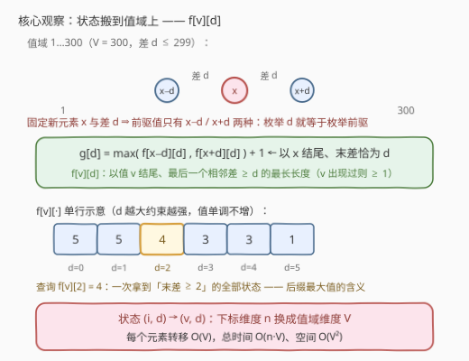
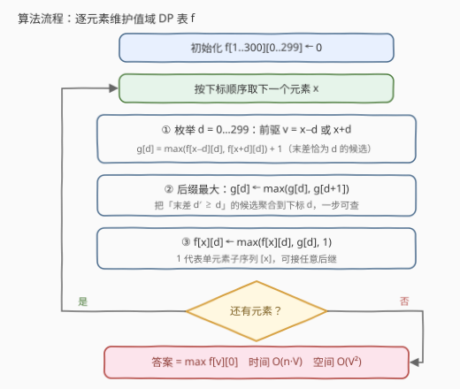

# 最长相邻绝对差递减子序列

- **题目名称**：最长相邻绝对差递减子序列
- **链接**：[3409. 最长相邻绝对差递减子序列](https://leetcode.cn/problems/longest-subsequence-with-decreasing-adjacent-difference/)
- **难度**：中等
- **标签**：数组、动态规划

## 1. 题目概述

给你一个整数数组 `nums`。你的任务是找到 `nums` 中的**最长**子序列 `seq`，这个子序列中相邻元素的**绝对差**构成一个**非递增**整数序列。换句话说，`nums` 中的序列 $seq_0, seq_1, \dots, seq_m$ 满足

$$
|seq_1 - seq_0| \ \ge\ |seq_2 - seq_1| \ \ge\ \cdots \ \ge\ |seq_m - seq_{m-1}|
$$

请你返回这个子序列的长度。

**示例 1**：

```text
输入：nums = [16,6,3]
输出：3
解释：最长子序列是 [16,6,3]，相邻绝对差值为 [10,3]。
```

**示例 2**：

```text
输入：nums = [6,5,3,4,2,1]
输出：4
解释：最长子序列是 [6,4,2,1]，相邻绝对差值为 [2,2,1]。
```

**示例 3**：

```text
输入：nums = [10,20,10,19,10,20]
输出：5
解释：最长子序列是 [10,20,10,19,10]，相邻绝对差值为 [10,10,9,9]。
```

**约束条件**：

- $2 \le nums.length \le 10^4$
- $1 \le nums[i] \le 300$

> 💡 **读题关键**：①「子序列」可以跳着选，不要求连续；② 差值序列是**非递增**——允许相等，示例 2 的 `[2,2,1]` 就是合法的；③ $n$ 达 $10^4$，但 $nums[i] \le 300$——**值域极小**是本题的题眼。

---

## 2. 解题思路

### 2.1 暴力思路：带「上一个差」的子序列 DP

子序列 DP 通常需要记住「结尾是谁」与「上一个差是多少」两个信息。定义 $dp[i][j]$：以 $nums[i]$ 结尾、倒数第二个元素是 $nums[j]$ 的最长合法长度。转移时还要枚举更前面的 $k$，并检查 $|nums[j]-nums[k]| \ge |nums[i]-nums[j]|$，总代价 $O(n^3)$；即使对每个 $j$ 预处理「按差值的后缀最大值」把 $k$ 的枚举优化掉，状态本身也有 $O(n^2) = 10^8$ 个，空间与时间都吃不消。

问题出在：状态里的**下标维度**其实是冗余的。能否把 $x$ 接在某个子序列后面，只取决于该子序列**结尾的值**（决定新差 $|x-v|$）和它的**上一个差**（必须 $\ge$ 新差），跟结尾元素在原数组中的位置无关——子序列不要求连续，「按顺序处理」已经天然保证了时间先后。

### 2.2 核心观察：状态搬到值域上，$f[v][d]$



**观察一：值域只有 300，把状态 $(i, d)$ 压成 $(v, d)$。** 既然转移只依赖「结尾值」，就把状态按**值**而不是按下标组织：

$$
f[v][d] = \text{以值 } v \text{ 结尾、最后一个相邻差} \ge d \text{ 的最长子序列长度}
$$

（值为 $v$ 的元素一旦出现过，$f[v][d] \ge 1$——单元素子序列没有「上一个差」，视为满足任何 $d$。）状态数从 $n \cdot V$ 降到 $V^2 = 90000$。

**观察二：固定新元素 $x$ 与差 $d$，前驱值至多两个。** 若以 $x$ 结尾、末差恰好为 $d$，则前驱值只能是 $v = x-d$ 或 $v = x+d$。于是**枚举 $d \in [0, 299]$ 就等价于枚举全部前驱**，每个元素的转移是 $O(V)$ 而非 $O(n)$：

$$
g[d] = \max\big(f[x-d][d],\ f[x+d][d]\big) + 1
$$

> 💡 注意 $f$ 定义成「上一个差 $\ge d$」而不是「恰好等于 $d$」：转移条件本来就是「上一个差 $\ge$ 新差」，配合**后缀最大值**语义，一次查表就覆盖所有满足条件的状态，无需再枚举具体的 $d'$。处理完 $x$ 后，把 $g$ 自身做一次后缀最大（$g[d] \leftarrow \max(g[d], g[d+1])$，末差 $d' \ge d$ 的候选都贡献给下标 $d$），再回写 $f[x][d] \leftarrow \max(f[x][d],\ g[d],\ 1)$。

**答案** $= \max_v f[v][0]$：任何子序列都有最后一个元素，而 $f[v][0]$ 不限制上一个差，就是「以值 $v$ 结尾」的全局最优。

### 2.3 算法流程图



1. **初始化**：$f[1..300][0..299] \leftarrow 0$（0 表示该值从未出现过）；
2. **逐元素处理** $x$：枚举 $d = 0 \dots 299$，取 $v = x \pm d$（越界忽略），$g[d] = \max(f[v][d]) + 1$；
3. **后缀最大**：$g[d] \leftarrow \max(g[d], g[d+1])$，把「末差 $\ge d$」的候选聚合到下标 $d$；
4. **回写**：$f[x][d] \leftarrow \max(f[x][d],\ g[d],\ 1)$；
5. 全部处理完后返回 $\max_v f[v][0]$。

### 2.4 示例演算

以 **示例 3**（$nums = [10,20,10,19,10,20]$）走一遍，只列每次的关键转移（候选 $g[d]$ 取最大者）：

| 处理元素 | 关键转移（$d$，前驱 $v$，查 $f[v][d]$） | 以 $x$ 结尾的最长 |
|---|---|---|
| 10 | 无前驱，$f[10][\cdot] \leftarrow 1$ | 1 |
| 20 | $d{=}10$：$v{=}10$，$f[10][10]{=}1 \to g{=}2$ | 2：`[10,20]` |
| 10 | $d{=}10$：$v{=}20$，$f[20][10]{=}2 \to g{=}3$；$d{=}0$：$v{=}10$，$f[10][0]{=}1 \to g{=}2$ | 3：`[10,20,10]` |
| 19 | $d{=}9$：$v{=}10$，$f[10][9]{=}3 \to g{=}4$；$d{=}1$：$v{=}20$，$f[20][1]{=}2 \to g{=}3$ | 4：`[10,20,10,19]` |
| 10 | $d{=}9$：$v{=}19$，$f[19][9]{=}4 \to g{=}5$；$d{=}0$：$v{=}10$，$f[10][0]{=}3$；$d{=}10$：$v{=}20$，$f[20][10]{=}2$ | 5：`[10,20,10,19,10]` |
| 20 | $d{=}1$：$v{=}19$，$f[19][1]{=}4 \to g{=}5$；$d{=}10$：$v{=}10$，$f[10][10]{=}3 \to g{=}4$ | 5：`[10,20,10,19,20]` |

最后一步里，`[10,20,10,19,10]` 想再接 `20` 需要新差 $10 \le 9$，不合法；但换一条路 `[10,20,10,19]` 末差 9，接 `20` 得差 1 $\le 9$，拼出 `[10,20,10,19,20]`，长度仍为 **5** ✓。这正是「后缀最大」在起作用：$f[19][1]$ 聚合了所有「末差 $\ge 1$」的状态，一次查表就找到了它。

---

## 3. 参考代码

### C++

```cpp
class Solution {
  public:
    int longestSubsequence(vector<int>& nums) {
        const int V = 300;  // 值域上限，差 d ∈ [0, V-1]
        // f[v][d]：以值 v 结尾、最后一个相邻差 ≥ d 的最长长度（0 = 值 v 未出现过）
        vector<vector<int>> f(V + 1, vector<int>(V, 0));
        for (int x : nums) {
            vector<int> g(V, 0);  // g[d]：以 x 结尾、末差恰为 d 的候选长度
            for (int d = 0; d < V; d++) {
                int best = 0;
                if (x - d >= 1) best = f[x - d][d];
                if (x + d <= V) best = max(best, f[x + d][d]);
                if (best) g[d] = best + 1;
            }
            // 后缀最大：末差 d' ≥ d 的候选都能贡献给下标 d
            for (int d = V - 2; d >= 0; d--) g[d] = max(g[d], g[d + 1]);
            auto &row = f[x];
            for (int d = 0; d < V; d++)
                row[d] = max({row[d], g[d], 1});  // 1 = 单元素子序列 [x]
        }
        int ans = 0;
        for (int v = 1; v <= V; v++) ans = max(ans, f[v][0]);
        return ans;
    }
};
```

### Python

```python
class Solution:
    def longestSubsequence(self, nums: List[int]) -> int:
        V = 300  # 值域上限，差 d ∈ [0, V-1]
        # f[v][d]：以值 v 结尾、最后一个相邻差 ≥ d 的最长长度（0 = 值 v 未出现过）
        f = [[0] * V for _ in range(V + 1)]
        for x in nums:
            g = [0] * V  # g[d]：以 x 结尾、末差恰为 d 的候选长度
            for d in range(V):
                best = f[x - d][d] if x - d >= 1 else 0
                if x + d <= V:
                    best = max(best, f[x + d][d])
                if best:
                    g[d] = best + 1
            # 后缀最大：末差 d' ≥ d 的候选都能贡献给下标 d
            for d in range(V - 2, -1, -1):
                if g[d + 1] > g[d]:
                    g[d] = g[d + 1]
            row = f[x]
            for d in range(V):
                row[d] = max(row[d], g[d], 1)  # 1 = 单元素子序列 [x]
        return max(f[v][0] for v in range(V + 1))
```

> 💡 代码里三处细节：① `g[d]` 只在 `best > 0` 时写入，避免把「前驱值从未出现」误当成长度 1 的状态；② 回写时与**旧的** `f[x][·]` 取 max——同一个值出现多次时，先出现者自动成为后来者的前驱（读发生在写之前，天然保证时间顺序）；③ `max(..., 1)` 表示 `[x]` 单独成段，它对任何后继都合法。

---

## 4. 复杂度分析

| 维度 | 复杂度 | 说明 |
|------|--------|------|
| **时间复杂度** | $O(n \cdot V)$ | 每个元素三趟长度为 $V=300$ 的循环：求 $g$、后缀最大、回写 $f$；共 $n \cdot 3V \approx 9 \times 10^6$ 次基本操作 |
| **空间复杂度** | $O(V^2)$ | $f$ 表 $300 \times 300 = 9 \times 10^4$ 个整数；$g$ 为每元素滚动的 $O(V)$ 临时数组 |

---

## 5. 扩展：「值域 DP」的通用套路

当**值域远小于下标规模**时，把 DP 状态从下标维度搬到值域维度，是子序列问题的通用加速手段：

1. **识别信号**：题目显式给出小值域（本题 $nums[i] \le 300$），或值可以离散化后很小；
2. **状态改造**：问自己「转移真正依赖的是下标还是值？」——只依赖值时，$(i, \cdot) \to (v, \cdot)$，状态数骤降；
3. **前驱收缩**：固定新元素与「关系量」（差、倍数、和）后，前驱值往往只有 $O(1)$ 个，枚举关系量即枚举前驱。

- 最简形态是 [1218. 最长定差子序列](../1201-1300/1218_最长定差子序列.md)：固定公差 $diff$，$dp[v] = dp[v - diff] + 1$，一趟 $O(n)$；
- [1027. 最长等差数列](../1001-1100/1027_最长等差数列.md) 因 $n \le 1000$ 可以保留下标 DP，可与本题对照体会值域化的收益；
- 经典 LIS 的 $O(n \log n)$ 树状数组优化，同样是「按值域建索引」的思路。

---

## 6. 面试要点

1. **为什么状态可以不记下标、只记结尾值？**

   - 能否把 $x$ 接在某个子序列后面，只看结尾值 $v$（决定新差 $|x-v|$）与上一个差（需 $\ge$ 新差），与结尾元素的位置无关；
   - 子序列不要求连续，下标信息只在「谁先谁后」上有意义——按数组顺序处理、**先读后写**，时间顺序已经隐含在算法流程里。

2. **$f[v][d]$ 为什么定义成「上一个差 $\ge d$」而不是「恰好等于 $d$」？**

   - 转移条件本来就是「上一个差 $\ge$ 新差」，后缀最大语义下一次查表覆盖所有满足条件的状态；
   - 若定义成「恰好」，转移还得枚举所有 $d' \ge d$，退回 $O(V^2)$ 每元素。

3. **固定 $x$ 与 $d$，为什么前驱至多两个？**

   - 前驱值 $v$ 必须满足 $|x - v| = d$，解只有 $v = x-d$ 与 $v = x+d$；
   - 所以枚举 $d \in [0, V)$ 等价于枚举全部前驱，把 $O(n)$ 的前驱扫描压成 $O(V)$——这是复杂度从 $O(n^2)$ 降到 $O(nV)$ 的关键一步。

4. **单元素子序列（回写时的「1」）是怎么处理的？**

   - 长度 1 的序列没有「上一个差」，可接任意后继，故视为满足一切 $d$：值 $v$ 出现过后 $f[v][d] \ge 1$；
   - 值 $v$ 未出现时 $f[v][d] = 0$，转移中 `best > 0` 的判断避免了拿「幽灵前驱」当单元素用。

5. **同一个值出现多次怎么办？**

   - $f$ 按值聚合，重复值天然友好：处理当前的 $x$ 时，读到的 $f[x][\cdot]$ 是**之前所有**以值 $x$ 结尾的状态（含更早的 $x$），先来者自动成为后来者的前驱；
   - 例如示例 3 中第二个 `10` 能接在 `20` 后面，第三个 `10` 能接在 `19` 后面。

> 💡 **一句话总结**：值域只有 300 ⇒ 状态 $(v, d)$ 压掉下标维度，$f[v][d]$ 取后缀最大语义，固定 $x$ 与 $d$ 前驱至多两个，$O(n \cdot V)$ 收工。

---

## 7. 同类练习题

- [1218. 最长定差子序列](https://leetcode.cn/problems/longest-arithmetic-subsequence-of-given-difference/)（[题解](../1201-1300/1218_最长定差子序列.md)）：值域 DP 的最简形态，固定公差 $dp[v] = dp[v-diff]+1$，体会「按值转移」的雏形
- [1027. 最长等差数列](https://leetcode.cn/problems/longest-arithmetic-subsequence/)（[题解](../1001-1100/1027_最长等差数列.md)）：同样带「差值」维度的子序列 DP，$n \le 1000$ 保留下标 DP 可行，对照本题看值域化的收益
- [368. 最大整除子集](https://leetcode.cn/problems/largest-divisible-subset/)（[题解](../0301-0400/368_最大整除子集.md)）：转移只依赖元素值之间的整除关系，与本题「只看值、不看位置」同一思想
- [300. 最长递增子序列](https://leetcode.cn/problems/longest-increasing-subsequence/)：LIS 的 $O(n \log n)$ 优化正是「按值域建索引」，值域思维的起点
