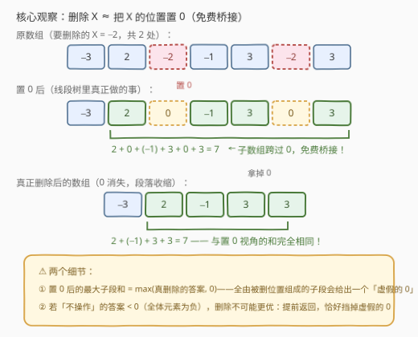
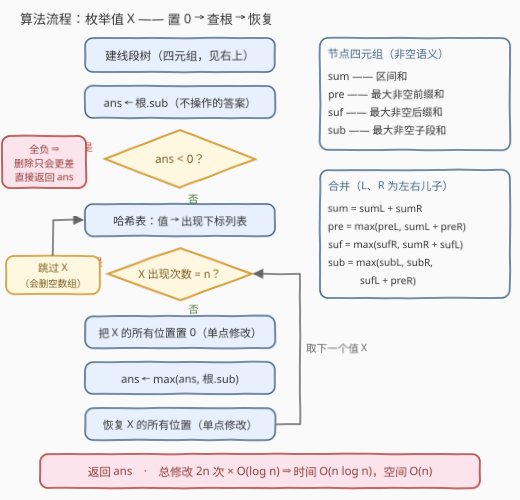

# 删除所有值为某个元素后的最大子数组和

- **题目名称**：删除所有值为某个元素后的最大子数组和
- **链接**：[3410. 删除所有值为某个元素后的最大子数组和](https://leetcode.cn/problems/maximize-subarray-sum-after-removing-all-occurrences-of-one-element/)
- **难度**：困难
- **标签**：线段树、数组、哈希表、分治、动态规划、前缀和

## 1. 题目概述

给你一个整数数组 `nums`，你可以对它执行**至多一次**操作：

- 选择 `nums` 中存在的任意整数 $X$（要求删除所有值为 $X$ 的元素后，剩下的数组**非空**）；
- 把数组中**所有**值为 $X$ 的元素删掉。

请你返回所有可能得到的数组（含不操作）中，**最大子数组和**的最大值。

**示例 1**：

```text
输入：nums = [-3,2,-2,-1,3,-2,3]
输出：7
解释：删除所有 X = -2 后数组为 [-3,2,-1,3,3]，最大子数组和为 2 + (-1) + 3 + 3 = 7；
     而不操作、删 -3、删 -1、删 3 的最好结果分别只有 4、4、4、2。
```

**示例 2**：

```text
输入：nums = [1,2,3,4]
输出：10
解释：全是正数，删除任何值只会变小，最优是什么都不删。
```

**约束条件**：

- $1 \le nums.length \le 10^5$
- $-10^6 \le nums[i] \le 10^6$

> 💡 **读题关键**：① 操作是「**整类删除**」——要么把值为 $X$ 的元素全部删掉，要么不删，不能只删一部分；② 删除后数组必须非空（若 $X$ 是数组中唯一的值且占满整个数组，则不允许删）；③ 答案要对「每个可选的 $X$ + 不操作」取最大。注意和会达到 $10^5 \times 10^6 = 10^{11}$，需要 64 位整数。

---

## 2. 解题思路

### 2.1 暴力思路：枚举 X + Kadane

「不操作」的答案就是普通最大子数组和，一趟 Kadane $O(n)$。对每个出现过的值 $X$（至多 $n$ 个）：把所有 $X$ 过滤掉得到新数组，再跑一趟 Kadane。总复杂度 $O(n^2)$，在 $n = 10^5$ 下约 $10^{10}$ 次操作，不可行。

卡脖子的地方在于：换一个 $X$，整条数组就要**整体重算**。突破口是反过来想——能不能把「删掉一类元素」变成**廉价的局部修改**，同时把「最大子数组和」变成能**增量维护**的量？

### 2.2 核心观察：「删除 = 置 0」+ 最大子段和线段树



**观察一：删除 $X$ 等价于把所有 $X$ 的位置置成 $0$。**

新数组里的任何子数组，对应原数组某个区间 $[l, r]$ 去掉其中值为 $X$ 的位置；而在「置 0」数组中，区间 $[l, r]$ 的元素和与它**完全相等**（被删位置贡献 $0$）。反过来，置 0 数组中任何**至少含一个非 $X$ 位置**的子数组，也对应新数组中一个和相同的子数组。于是

$$
\text{置 0 后的最大子数组和} \;=\; \max\big(\text{真删除后的最大子数组和},\ 0\big)
$$

唯一偏差：最优子段可能**全由被删位置组成**（和为 $0$），它对应新数组里的「空子数组」，是一个**虚假的 0**。

> 💡 置 0 的本质是**免费桥接**：子数组可以跨过被删位置把两段拼起来，代价为 $0$——这正是「删除」想要的效果。示例 1 中 $2 + 0 + (-1) + 3 + 0 + 3 = 7$，正是跨过两个 $0$ 把 $2,\,-1,\,3,\,3$ 拼成了一段。

**观察二：虚假的 0 有解药——「不操作」的答案兜底。**

设「不操作」的最大子数组和为 $S$：

- 若 $S \ge 0$：任何虚假的 $0$ 都 $\le S$，取 max 后不影响答案；
- 若 $S < 0$：等价于**全体元素都是负数**（有非负元素时单元素子数组就 $\ge 0$）。此时任何合法删除（保持非空）后仍是全负数组，其最大子数组和就是剩余元素的最大值——把全局最大值保留则答案不变，把它整类删光只会更小。**删除不可能更优**，直接返回 $S$。

**观察三：最大子段和线段树支持 $O(\log n)$ 单点修改、$O(1)$ 查全局。**

经典「最大子段和」线段树每个节点维护四个量（均取**非空**语义）：区间和 $sum$、最大非空前缀和 $pre$、最大非空后缀和 $suf$、最大非空子段和 $sub$，由左右儿子 $O(1)$ 合并。全局最大子数组和就是根节点的 $sub$，查询免费。

于是算法成型：**枚举每个出现过的值 $X$，把它的所有位置临时置 0 → 读根节点的 $sub$ → 恢复原值**。关键计数：每个位置只属于一个值，所以整个流程「置 0 + 恢复」总共恰好 $2n$ 次单点修改，总复杂度 $O(n \log n)$。

### 2.3 算法流程图



1. **建树**：按四元组建线段树，$ans \leftarrow$ 根节点 $sub$（不操作的答案）；
2. **全负剪枝**：若 $ans < 0$，全体元素为负，删除不可能更优，直接返回；
3. **按值分组**：哈希表记录每个值出现的所有下标；
4. **枚举值 $X$**：若出现次数 $= n$（会删空数组）则跳过；否则把它的所有位置**置 0**（单点修改），$ans \leftarrow \max(ans, \text{根}.sub)$，再**恢复**；
5. 处理完所有值，返回 $ans$。

### 2.4 示例演算

以 **示例 1**（$nums = [-3, 2, -2, -1, 3, -2, 3]$）走一遍：$S = 4 \ge 0$，无需剪枝，逐个枚举：

| 方案 | 置 0 后的数组 | 根节点 $sub$ | 真删除的最优 |
|---|---|---|---|
| 不操作 | $[-3, 2, -2, -1, 3, -2, 3]$ | $3 + (-2) + 3 = 4$ | $4$ |
| $X = -3$ | $[0, 2, -2, -1, 3, -2, 3]$ | $4$ | $4$ |
| $X = -2$ | $[-3, 2, 0, -1, 3, 0, 3]$ | $2 + 0 - 1 + 3 + 0 + 3 = \mathbf{7}$ | $7$ |
| $X = -1$ | $[-3, 2, -2, 0, 3, -2, 3]$ | $4$ | $4$ |
| $X = 3$ | $[-3, 2, -2, -1, 0, -2, 0]$ | $2$ | $2$ |

答案为 $\max(4, 4, 7, 4, 2) = 7$ ✓。

再看一个边界：$nums = [-2, -3]$。「不操作」的答案 $S = -2 < 0$（全负），触发剪枝直接返回 $-2$——若没有这步，$X = -2$ 置 0 后会算出 $[0, -3]$ 的最大子段和 $0$，正是那个虚假的 0。

---

## 3. 参考代码

### C++

```cpp
class Solution {
    struct Node {
        long long sum, pre, suf, sub;  // 区间和 / 最大非空前缀和 / 最大非空后缀和 / 最大非空子段和
    };

    int n;
    vector<Node> t;

    Node merge(const Node& a, const Node& b) {
        return Node{a.sum + b.sum,
                    max(a.pre, a.sum + b.pre),
                    max(b.suf, b.sum + a.suf),
                    max({a.sub, b.sub, a.suf + b.pre})};
    }

    void pull(int p) { t[p] = merge(t[p << 1], t[p << 1 | 1]); }

    void build(int p, int l, int r, vector<int>& a) {
        if (l == r) {
            t[p] = {a[l], a[l], a[l], a[l]};
            return;
        }
        int m = (l + r) >> 1;
        build(p << 1, l, m, a);
        build(p << 1 | 1, m + 1, r, a);
        pull(p);
    }

    void update(int p, int l, int r, int i, long long v) {
        if (l == r) {
            t[p] = {v, v, v, v};
            return;
        }
        int m = (l + r) >> 1;
        if (i <= m) update(p << 1, l, m, i, v);
        else update(p << 1 | 1, m + 1, r, i, v);
        pull(p);
    }

  public:
    long long maxSubarraySum(vector<int>& nums) {
        n = nums.size();
        t.assign(4 * n, Node{0, 0, 0, 0});
        build(1, 0, n - 1, nums);

        long long ans = t[1].sub;      // 不操作的最大子数组和
        if (ans < 0) return ans;       // 全体元素为负：删除不可能更优

        unordered_map<int, vector<int>> pos;
        for (int i = 0; i < n; i++) pos[nums[i]].push_back(i);

        for (auto& [x, ps] : pos) {
            if ((int)ps.size() == n) continue;           // 会删空整个数组，不允许
            for (int i : ps) update(1, 0, n - 1, i, 0);  // 临时置 0
            ans = max(ans, t[1].sub);                    // O(1) 读根
            for (int i : ps) update(1, 0, n - 1, i, x);  // 恢复
        }
        return ans;
    }
};
```

### Python

```python
from collections import defaultdict


class Solution:
    def maxSubarraySum(self, nums: List[int]) -> int:
        n = len(nums)
        size = 1
        while size < n:
            size <<= 1
        NEG = float('-inf')
        # sm / pre / suf / sub：区间和 / 最大非空前缀和 / 最大非空后缀和 / 最大非空子段和
        sm = [0] * (2 * size)
        pre = [NEG] * (2 * size)
        suf = [NEG] * (2 * size)
        sub = [NEG] * (2 * size)

        for i, v in enumerate(nums):      # 叶子放真实元素
            j = i + size
            sm[j] = pre[j] = suf[j] = sub[j] = v
        for p in range(size - 1, 0, -1):  # 自底向上建树（padding 叶子保持“空”哨兵）
            l, r = p << 1, p << 1 | 1
            sm[p] = sm[l] + sm[r]
            pre[p] = max(pre[l], sm[l] + pre[r])
            suf[p] = max(suf[r], sm[r] + suf[l])
            sub[p] = max(sub[l], sub[r], suf[l] + pre[r])

        def update(i, v):                 # 单点修改，向上重算祖先
            p = i + size
            sm[p] = pre[p] = suf[p] = sub[p] = v
            p >>= 1
            while p:
                l, r = p << 1, p << 1 | 1
                sm[p] = sm[l] + sm[r]
                pre[p] = max(pre[l], sm[l] + pre[r])
                suf[p] = max(suf[r], sm[r] + suf[l])
                sub[p] = max(sub[l], sub[r], suf[l] + pre[r])
                p >>= 1

        ans = sub[1]                      # 不操作的最大子数组和
        if ans < 0:
            return ans                    # 全体元素为负：删除不可能更优

        pos = defaultdict(list)
        for i, v in enumerate(nums):
            pos[v].append(i)

        for x, ps in pos.items():
            if len(ps) == n:
                continue                  # 会删空整个数组，不允许
            for i in ps:
                update(i, 0)              # 临时置 0
            ans = max(ans, sub[1])        # O(1) 读根
            for i in ps:
                update(i, x)              # 恢复
        return ans
```

> 💡 三处细节：① $pre$/$suf$ 必须用**非空**语义——若允许空前缀，全负数组的根 $sub$ 会变成 $0$，第 2 步剪枝就失效了（Python 版用 $-\infty$ 哨兵表示「空」）；② 置 0 与恢复走同一个 `update`，不必写两套；③ Python 版用迭代式线段树（`2*size` 数组），`n` 补齐到 2 的幂后 padding 叶子当「空」处理，避免递归开销。

---

## 4. 复杂度分析

| 维度 | 复杂度 | 说明 |
|------|--------|------|
| **时间复杂度** | $O(n \log n)$ | 建树 $O(n)$；每个位置只属于一个值，全程恰好 $2n$ 次单点修改，每次 $O(\log n)$；每个值查询根 $O(1)$，共 $O(n)$ 次 |
| **空间复杂度** | $O(n)$ | 线段树 $4n$ 个节点（每节点 4 个 64 位整数）+ 哈希表存每个值的出现下标 |

---

## 5. 扩展：「置 0」建模的边界与亲题

**置 0 什么时候是精确的？** 只要答案天然非负（题目保证子段非空且存在非负元素），虚假的 0 就永远不会成为最优，置 0 是精确等价。当答案可能为负时（本题这类允许全负数组的最值题），必须补 guard——本题「全负提前返回」是代价最小的写法；更通用的做法是在节点里额外维护「至少含一个真实元素的子段和」，但代码量翻倍，面试中能说出这个 trade-off 即可。

**这套四元组是模板件。** 它就是「分治求最大子数组和」（53 题的 $O(n \log n)$ 分治解法）的在线版本：分治的每次 merge 正是线段树的 pushup。把单点修改升级为区间修改（配 lazy），就能支持**区间查询最大子段和**——这是线段树最经典的应用之一。

**删除类题目的两条路线：**

- **按时间逐个删**（如 [2382. 删除操作后的最大子段和](../2301-2400/2382_删除操作后的最大子段和.md)）：删除不可撤销、且要每个时刻的答案，常用并查集「反向合并」或倒序加回；
- **按值整类删**（本题）：删除是一次性的批量假设，用「置 0 + 可恢复」的线段树，靠「每个位置只属于一个值」把总修改次数压到 $2n$。

两题对照，能看清「删除的粒度」如何决定数据结构的选择。

---

## 6. 面试要点

1. **为什么「删除 X」可以当成「置 0」？**

   - 新数组的子数组 ↔ 原数组区间 $[l,r]$ 去掉 $X$ 位置；置 0 数组中 $[l,r]$ 的和与之相等（$X$ 位置贡献 0）；
   - 反向也成立（只要子段含至少一个非 $X$ 位置），所以置 0 后的最大子段和 $= \max(\text{真删除答案}, 0)$，唯一偏差是「全由被删位置构成的段」贡献的虚假 0。

2. **虚假的 0 怎么防？**

   - 「不操作」的答案 $S \ge 0$ 时，虚假 0 $\le S$，取 max 无害；
   - $S < 0$ 等价于全负：删后仍全负，最大子段 = 剩余最大元素 $\le$ 原最大元素（保留则不变，整类删光则更小），删除不可能更优，提前返回。

3. **线段树节点维护什么、怎么合并？**

   - 四元组（非空语义）：$sum$、$pre$、$suf$、$sub$；
   - $sub = \max(sub_L, sub_R, suf_L + pre_R)$——最优子段要么全在左、要么全在右、要么**跨中点**（左后缀拼右前缀），第三项是灵魂。

4. **复杂度为什么是 $O(n \log n)$ 而不是 $O(n^2 \log n)$？**

   - 关键计数：每个位置只属于一个值，全程「置 0 + 恢复」恰好 $2n$ 次单点修改，每次 $O(\log n)$；
   - 若对每个候选值都把它的 $O(n)$ 个位置改一遍再改回来但不按值去重，就会退化——本质是「按值分组」让每份修改工作量只花一次。

5. **哪些 $X$ 需要跳过？**

   - 出现次数 $= n$ 的值：删除后数组为空，题目不允许；置 0 处理它也会得到全 0 树、返回假值；
   - 顺带覆盖 $n = 1$：唯一值必被跳过，答案就是那个元素本身。

> 💡 **一句话总结**：删除 $X$ = 置 0（免费桥接），最大子段和线段树 $O(\log n)$ 单点修改、$O(1)$ 查根；枚举每个值整批置 0/恢复，靠「位置只属于一个值」把总量压到 $2n$ 次修改，全负数组提前返回挡掉虚假 0。

---

## 7. 同类练习题

- [53. 最大子数组和](https://leetcode.cn/problems/maximum-subarray/)（[题解](../0001-0100/53_最大子数组和.md)）：Kadane 与分治求最大子段和，本题四元组的 pushup 就是它分治解法的一次合并
- [918. 环形子数组的最大和](https://leetcode.cn/problems/maximum-sum-circular-subarray/)（[题解](../0901-1000/918_最大环形子数组和.md)）：最大子段和的「拼接」变形，同样在组合前后缀拼段
- [2382. 删除操作后的最大子段和](https://leetcode.cn/problems/maximum-segment-sum-after-removals/)（[题解](../2301-2400/2382_删除操作后的最大子段和.md)）：同为「删除 + 子段和」，但按时间逐个删、用并查集反向合并，与本题「按值批量删 + 置 0」互为对照
- [152. 乘积最大子数组](https://leetcode.cn/problems/maximum-product-subarray/)（[题解](../0101-0200/152_乘积最大子数组.md)）：子段 DP 同时维护多个聚合量（最大/最小积），与四元组的「多聚合量维护」异曲同工
