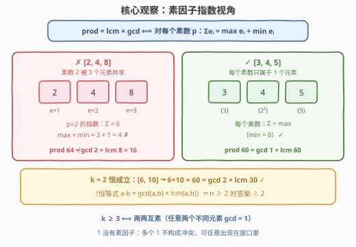
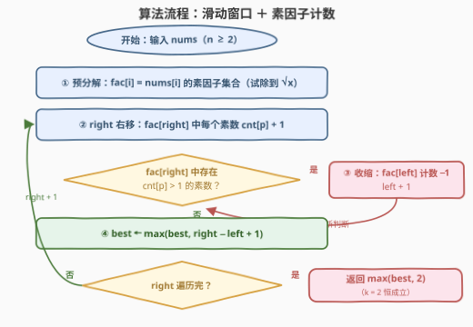
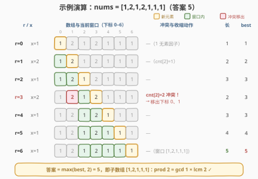

# 最长乘积等价子数组

- **题目名称**：最长乘积等价子数组
- **链接**：[3411. 最长乘积等价子数组](https://leetcode.cn/problems/maximum-subarray-with-equal-products/)
- **难度**：简单
- **标签**：数组、数学、数论、枚举、滑动窗口

## 1. 题目概述

给你一个由**正整数**组成的数组 `nums`。如果一个数组 `arr` 满足 $\prod(\text{arr}) = \mathrm{lcm}(\text{arr}) \times \gcd(\text{arr})$，则称其为**乘积等价数组**，其中：

- $\prod(\text{arr})$ 表示 `arr` 中所有元素的**乘积**；
- $\gcd(\text{arr})$ 表示 `arr` 中所有元素的**最大公约数**；
- $\mathrm{lcm}(\text{arr})$ 表示 `arr` 中所有元素的**最小公倍数**。

返回数组 `nums` 的**最长乘积等价子数组**的长度（子数组要求连续）。

**示例 1**：

```text
输入：nums = [1,2,1,2,1,1,1]
输出：5
解释：最长的乘积等价子数组是 [1,2,1,1,1]，其中 prod = 2，gcd = 1，lcm = 2，满足 2 = 1 × 2。
```

**示例 2**：

```text
输入：nums = [2,3,4,5,6]
输出：3
解释：最长的乘积等价子数组是 [3,4,5]。
```

**示例 3**：

```text
输入：nums = [1,2,3,1,4,5,1]
输出：5
```

**约束条件**：

- $2 \le \text{nums.length} \le 100$
- $1 \le \text{nums}[i] \le 10^9$

> 💡 **读题关键**：① 子数组必须**连续**，不能挑挑拣拣；② 对**两个**元素恒有 $a \cdot b = \gcd(a,b) \times \mathrm{lcm}(a,b)$（经典恒等式），而 $n \ge 2$，所以**答案至少为 2**，问题只剩「能否凑出长度 $\ge 3$」；③ 窗口乘积可达 $(10^9)^{100} = 10^{900}$，C++ 暴力算 `prod` 必然溢出——**必须先找到等价的判定条件**，这正是本题的题眼。

---

## 2. 解题思路

### 2.1 暴力思路：枚举所有子数组，逐个验证

最直接的做法：枚举全部 $O(n^2)$ 个子数组 $[i, j]$，从左到右增量维护 `g / l / p` 三个聚合值，判断 $p = g \times l$：

```python
for i in range(n):
    g, l, p = 0, 1, 1
    for j in range(i, n):
        g, p = gcd(g, nums[j]), p * nums[j]
        l = lcm(l, nums[j])
        if p == g * l:
            best = max(best, j - i + 1)
```

总代价 $O(n^2 \log U)$ 次 gcd 加上大数乘法。$n \le 100$ 时只有 5050 个窗口，Python 的大整数轻松通过。但这条路线有两个问题：一是 C++ 里 `prod` 溢出无法直接比较；二是它完全没有利用条件的**结构**——而稍作数学分析，条件会坍缩成一个极其简明的形式。

### 2.2 核心观察：素因子指数视角——条件坍缩为「两两互素」

把子数组里的每个元素按素因子分解，盯住**某一个素数 $p$**：设它在 $k$ 个元素中的指数为 $e_1, e_2, \dots, e_k$，则三个聚合量在 $p$ 上的指数分别为

$$\prod \to \sum_i e_i, \qquad \mathrm{lcm} \to \max_i e_i, \qquad \gcd \to \min_i e_i$$

于是「乘积等价」$\iff$ **对每个素数 $p$** 都有

$$\sum_i e_i \;=\; \max_i e_i + \min_i e_i$$

逐类讨论 $k$（子数组长度）：

| $k$ | 结论 | 原因 |
|-----|------|------|
| $k = 2$ | **恒成立** | $\max + \min = e_1 + e_2 = \sum$，正是恒等式 $ab = \gcd \cdot \mathrm{lcm}$ |
| $k = 1$ | 仅 $x = 1$ 成立 | $e = 2e \Rightarrow e = 0$，即元素没有任何素因子 |
| $k \ge 3$ | $\iff$ **两两互素** | $\sum = \max + \min$ 要求「中间」指数全为 0：**至多一个** $e_i > 0$，即 $p$ 至多整除一个元素 |

$k \ge 3$ 的情形展开说：若素数 $p$ 整除了**两个及以上**元素，则 $\sum_i e_i \ge \max + \text{第二个正指数} > \max + \min$（其余元素指数为 0 时 $\min = 0$；全都被 $p$ 整除时同样不等），条件破坏。反过来，若每个素数至多属于一个元素，则 $\min = 0$、$\sum = \max$，条件成立。而「每个素数至多整除一个元素」$\iff$「任意两个不同元素的 $\gcd$ 为 1」，即**两两互素**。



于是问题转化为：

$$\text{答案} \;=\; \max\bigl(2,\ \text{最长的「每个素数至多属于一个元素」的子数组}\bigr)$$

> ⚠️ **$k=2$ 特例不能丢**：例如 `nums = [2,4,8]`，任意两元素都不互素，滑窗最长只能得到 1，但 `[2,4]` 是乘积等价的（$8 = 2 \times 4$ ✓），正确答案是 2——最后一步 `max(best, 2)` 就是为它准备的。

### 2.3 算法流程：滑动窗口 + 素因子计数

「每个素数至多属于一个元素」这一性质是**遗传的**：把合法窗口任意切短依然合法。因此对每个右端点 `right`，合法的最小左端点随 `right` 单调不降——标准**双指针**适用：

1. **预处理**：对每个 `nums[i]` 试除法分解出**素因子集合** `fac[i]`（只需去重后的素数，不需要幂次）；
2. **扩张**：`right` 右移，把 `fac[right]` 中每个素数的计数 `cnt[p] += 1`；
3. **收缩**：只要 `fac[right]` 中存在计数 `> 1` 的素数（新窗口中，冲突只可能来自新元素带来的素数），就移出 `nums[left]`（其素因子计数 `−1`）并 `left += 1`；
4. **记录**：`best = max(best, right - left + 1)`，最终返回 `max(best, 2)`。



> 💡 **为什么不能直接维护窗口的 gcd / lcm / prod 做滑窗**？因为 gcd 和 lcm **没有逆元**——从聚合值反推不出被移除元素的贡献，「删除」无法 $O(1)$ 撤销（对照 [3334](../3301-3400/3334_数组的最大因子得分.md) 里前后缀分解的讨论）。而**素因子计数天然可加可减**，是「支持删除的 gcd/lcm 替身」。

### 2.4 示例演算

以示例 1 `nums = [1,2,1,2,1,1,1]` 走完整个流程（1 没有素因子，可以随意进出窗口）：



1. `r=0..2`：加入 `1, 2, 1`，素数 2 只出现一次，窗口 `[1,2,1]` 长度 3；
2. `r=3`：新元素 2 的素因子 `{2}` 计数变为 2，**冲突**——收缩：移出下标 0 的 `1`（素因子为空，计数不变），仍冲突；移出下标 1 的 `2`（计数回到 1），窗口变为 `[1,2]`（下标 2–3）；
3. `r=4..6`：连续三个 `1` 无冲突，窗口扩张到 `[1,2,1,1,1]`，长度 5；
4. **答案**：$\max(5, 2) = 5$ ✓，对应子数组 `[1,2,1,1,1]`：$\prod = 2 = \gcd \times \mathrm{lcm} = 1 \times 2$ ✓。

---

## 3. 参考代码

### C++

```cpp
class Solution {
  public:
    int maxLength(vector<int>& nums) {
        int n = nums.size();
        auto primesOf = [](long long x) {          // 试除法：去重后的素因子集合
            vector<int> ps;
            for (long long d = 2; d * d <= x; d += (d == 2 ? 1 : 2)) {
                if (x % d == 0) {
                    ps.push_back((int)d);
                    while (x % d == 0) x /= d;
                }
            }
            if (x > 1) ps.push_back((int)x);       // 剩下的大于 1 的因子是素数
            return ps;
        };

        vector<vector<int>> fac(n);
        for (int i = 0; i < n; ++i) fac[i] = primesOf(nums[i]);

        unordered_map<int, int> cnt;               // 窗口内每个素数的出现次数
        int left = 0, best = 1;
        for (int right = 0; right < n; ++right) {
            for (int p : fac[right]) ++cnt[p];
            auto conflict = [&]() {                // 冲突只可能来自新元素的素因子
                for (int p : fac[right])
                    if (cnt[p] > 1) return true;
                return false;
            };
            while (conflict()) {
                for (int p : fac[left]) --cnt[p];  // 移出左端，素因子计数减一
                ++left;
            }
            best = max(best, right - left + 1);
        }
        return max(best, 2);                       // k = 2 恒成立，答案至少为 2
    }
};
```

### Python

```python
class Solution:
    def maxLength(self, nums: List[int]) -> int:
        def primes_of(x):                          # 试除法：去重后的素因子集合
            ps, d = [], 2
            while d * d <= x:
                if x % d == 0:
                    ps.append(d)
                    while x % d == 0:
                        x //= d
                d += 1 if d == 2 else 2
            if x > 1:
                ps.append(x)
            return ps

        fac = [primes_of(x) for x in nums]
        cnt = Counter()                            # 窗口内每个素数的出现次数
        left = 0
        best = 1
        for right, ps in enumerate(fac):
            for p in ps:
                cnt[p] += 1
            while any(cnt[p] > 1 for p in ps):     # 冲突只可能来自新元素的素因子
                for p in fac[left]:                # 移出左端，素因子计数减一
                    cnt[p] -= 1
                left += 1
            best = max(best, right - left + 1)
        return max(best, 2)                        # k = 2 恒成立，答案至少为 2
```

> 💡 **实现细节**：① 试除只需枚举 2 和奇数，到 $\sqrt{x} \le 31623$ 为止，剩下大于 1 的部分必是素数；② `1` 的素因子集合为空，进出窗口不触碰计数器，天然「免费」；③ 收缩判据只查 `fac[right]` 的素数——因为扩张前旧窗口是合法的，新冲突必然由新元素引入，这让每次判断只需扫至多 $\omega \le 9$ 个素数。

---

## 4. 复杂度分析

| 维度 | 复杂度 | 说明 |
|------|--------|------|
| 时间复杂度 | $O(n\sqrt{U} + n\omega)$ | 预分解试除到 $\sqrt{U} \approx 3.2\times10^4$（主导项）；滑窗每个元素进出各一次，每次扫其素因子集合，$\omega$ 为单个元素的不同素数个数 |
| 空间复杂度 | $O(n\omega)$ | `fac` 表与素因子计数器；$10^9$ 以内的数 $\omega \le 9$（$2\cdot3\cdot5\cdot7\cdot11\cdot13\cdot17\cdot19\cdot23 \approx 2.2\times10^8 < 10^9$，再乘 29 就超了） |
| 暴力对照 | $O(n^2 \log U)$ | 5050 个窗口直接验证，Python 可过；C++ 受 `prod` 溢出所限需改用两两 gcd 判定（$O(n^3) = 10^6$ 次也能过） |

实测：三组官方样例 $5 / 3 / 5$ ✓；与「逐窗口验证 $p = g \times l$」的暴力对拍随机数据 32000 组全部一致；边界 `[2,4,8]`（两两不互素）正确返回 2，验证了 $k=2$ 特例；含 $10^9$、素数 $999999937$、$720720$ 的大值数据也按预期工作。

---

## 5. 扩展：跳跃式收缩与规模放大

**「最后出现位置」变体。** 计数器版收缩是一格一格挪；更利落的写法是维护 `last[p]` = 素数 $p$ 最近一次出现的下标。加入 `nums[right]` 时，对它的每个素因子 $p$，若 `last[p] >= left`，说明冲突元素就在窗口内，直接令 `left = last[p] + 1` 跳过去（窗口此前合法，$p$ 至多有一个「前科」，取所有冲突素数的最大跳转即可），随后更新 `last[p] = right`。均摊每个元素 $O(\omega)$，与计数器版同阶，代码更短。

**值域与规模的取舍。** 若 $n$ 放大到 $10^6$，滑窗部分仍是线性，瓶颈变成 $10^6$ 次试除（每次 $\sim1.6\times10^4$ 步）；此时若值域压缩到 $10^6$ 以内，可先线性筛出最小素因子表，把单次分解降到 $O(\log U)$。反过来若 $n$ 只有 100 而 $U \le 10^9$，甚至可以完全不解方程：直接以「新元素与窗口内**每个**元素 $\gcd = 1$」为判据，`left` 一格格收缩，$O(n^3) = 10^6$ 次 gcd 照样通过——**先看清规模，再决定写多巧**。

---

## 6. 面试要点

1. **为什么长度为 2 的子数组一定满足条件？**

   - 恒等式 $a \cdot b = \gcd(a,b) \times \mathrm{lcm}(a,b)$ 对任意正整数成立；从指数看，$k=2$ 时 $\sum e_i = e_1 + e_2 = \max + \min$ 恒成立。所以 $n \ge 2$ 时答案至少为 2，代码里体现为 `max(best, 2)`。

2. **$k \ge 3$ 时条件为什么等价于两两互素？**

   - 条件要求每个素数 $p$ 满足 $\sum e_i = \max e_i + \min e_i$；当 $k \ge 3$，若有两个元素被 $p$ 整除，则 $\sum$ 严格大于 $\max + \min$。故必须「每个素数至多整除一个元素」，等价于任意两个不同元素 $\gcd = 1$。注意 $1$ 无素因子，多个 $1$ 不构成冲突。

3. **滑动窗口的正确性依据是什么？**

   - 「每个素数至多属于一个元素」是**遗传性质**（切短合法窗口仍合法），因此对每个 `right` 存在最小合法左端点，且它随 `right` 单调不降——双指针每个元素至多进出一次，总移动 $O(n)$。

4. **为什么不直接维护窗口的 gcd / lcm / prod？**

   - 删除元素时 gcd/lcm **无逆元**，无法从聚合值中撤销贡献；prod 则溢出（$10^{900}$）。素因子计数把「互素关系」拆成可加可减的独立分量，是支持删除的标准替身。

5. **$10^9$ 的数如何分解素因子？一个数至多几个不同素数？**

   - 试除到 $\sqrt{x} \le 31623$（只试 2 和奇数），剩余大于 1 的因子必为素数；前 9 个素数之积 $\approx 2.2 \times 10^8 < 10^9$，故不同素数至多 9 个，窗口内活跃素数总数是 $O(n\omega)$ 级别的小量。

---

## 7. 同类练习题

- [3334. 数组的最大因子得分](https://leetcode.cn/problems/find-the-maximum-factor-score-of-array/)（[站内题解](../3301-3400/3334_数组的最大因子得分.md)）：gcd/lcm 聚合的前后缀分解，与本文「素因子计数」互为补充的 gcd/lcm 处理范式
- [2447. 最大公因数等于 K 的子数组数目](https://leetcode.cn/problems/number-of-subarrays-with-gcd-equal-to-k/)（[站内题解](../2401-2500/2447_最大公因数等于K的子数组数目.md)）：子数组 gcd 的增量维护，练熟「加一个元素 gcd 只减不增」的单调性
- [2654. 使数组所有元素变成 1 的最少操作次数](https://leetcode.cn/problems/minimum-number-of-operations-to-make-all-array-elements-equal-to-1/)（[站内题解](../2601-2700/2654_使数组所有元素变成1的最少操作次数.md)）：gcd 视角下求「全互素子数组」的**最短**长度，与本题的「最长」正好互为镜像
- [1819. 序列中不同最大公约数的数目](https://leetcode.cn/problems/number-of-different-subsequences-gcds/)（[站内题解](../1801-1900/1819_序列中不同最大公约数的数目.md)）：子序列 gcd 能取多少种值，值域筛视角的进阶练习
- [1071. 字符串的最大公因子](https://leetcode.cn/problems/greatest-common-divisor-of-strings/)：把 gcd 的「整除结构」迁移到字符串，理解 gcd 不只是数字游戏
