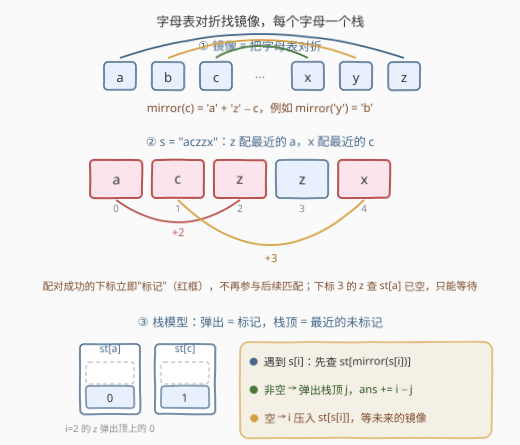
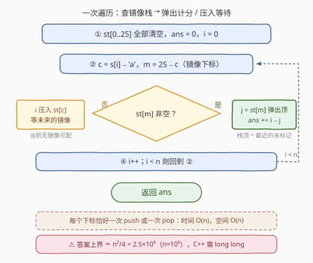

# 计算字符串的镜像分数

- **题目名称**：计算字符串的镜像分数
- **链接**：[3412. 计算字符串的镜像分数](https://leetcode.cn/problems/find-mirror-score-of-a-string/)
- **难度**：中等
- **标签**：栈、哈希表、字符串、模拟

## 1. 题目概述

给你一个字符串 `s`。英文字母的**镜像**定义为把字母表反转后对应位置上的字母：`'a'` 的镜像是 `'z'`，`'b'` 的镜像是 `'y'`，`'y'` 的镜像是 `'b'`，以此类推。

最初 `s` 中所有字符都**未标记**，分数为 0。从左到右遍历字符串，对每个下标 $i$：

- 找**距离最近**的**未标记**下标 $j < i$，满足 $s[j]$ 与 $s[i]$ 互为镜像；找到则**标记** $i$ 和 $j$，总分加上 $i - j$；
- 找不到则跳过 $i$（不标记，继续处理下一个下标）。

返回最终的总分。

**示例 1**：

```text
输入：s = "aczzx"
输出：5
解释：i=2 的 'z' 与最近的 'a'（j=0）配对，得 2−0=2；
     i=4 的 'x' 与最近的 'c'（j=1）配对，得 4−1=3。总分 5。
```

**示例 2**：

```text
输入：s = "abcdef"
输出：0
解释：任何下标都找不到镜像字符，全程跳过。
```

**约束条件**：

- $1 \le s.length \le 10^5$
- `s` 仅由小写英文字母组成

> 💡 **读题关键**：① 配对条件是「字符互为镜像」，**不要求相邻**，中间可以隔任意远；② 要找的是**最近的**未标记 $j$，一旦配对，$j$ 从候选中永久消失；③ $i$ 若配不上，自己留在原地，等待**未来的**镜像来配它。

---

## 2. 解题思路

### 2.1 朴素思路：每个 i 向左线性扫描

最直接的做法是按题意逐字模拟：对每个下标 $i$，从 $i-1$ 向左逐个检查，找到第一个**未标记**且与 $s[i]$ 互为镜像的下标 $j$，标记两者并累加 $i - j$。

问题是最坏 **$O(n^2)$**：例如 `s = "aaa…a"`（全是 `'a'`），每个 $i$ 都要向左扫完整个前缀才发现根本没有 `'z'`；又如 `s = "zzz…zaaa…a"`，第 $k$ 个 `'a'` 要越过 $k-1$ 个已标记的 `'z'` 才找到目标。$n = 10^5$ 时 $O(n^2)$ 达 $10^{10}$ 量级，必然超时。

瓶颈在于「向左找**最近的**未标记镜像字符」这个查询太贵——这正是**栈**的经典用武之地。

### 2.2 核心观察：每个字母一个栈，栈顶就是「最近的未标记」



**观察一：镜像是固定的一一映射。** 把字母表对折，$a \leftrightarrow z$、$b \leftrightarrow y$、……，即

$$\text{mirror}(c) = \text{'}a\text{'} + \text{'}z\text{'} - c \quad\Leftrightarrow\quad \text{mirrorIdx}(c) = 25 - (c - \text{'}a\text{'})$$

于是「$s[j]$ 是 $s[i]$ 的镜像」等价于「$s[j] = \text{mirror}(s[i])$」——查询目标字符是**唯一确定**的。

**观察二：「最近的未标记」正是栈的语义。** 把「已扫描、未标记、字符为 $ch$」的下标集合放进一个栈 $\text{st}[ch]$：

- 下标按 $0, 1, 2, \dots$ **递增**入栈，所以**栈顶永远是该字符最靠右（离 $i$ 最近）的未标记下标**；
- **弹出栈顶 = 标记**：该下标永久离开候选集合；而配对成功的 $i$ 本身也不入栈，同样视为标记。

维护 26 个栈（本质是**哈希表按字符分组**），一次遍历即可：

- 遇到 $s[i] = c$：查 $\text{st}[\text{mirror}(c)]$；
  - **非空** → 弹出栈顶 $j$，$ans \mathrel{+}= i - j$；
  - **空** → 把 $i$ 压入 $\text{st}[c]$，等未来的镜像来配。

**正确性**（归纳）：任意时刻，$\text{st}[ch]$ 恰好等于「已处理且未标记的字符 $ch$ 的下标集合」且自底向上递增——初始为空成立；每一步要么弹出一个已存在的未标记下标（= 标记 $j$，且 $i$ 不入栈 = 标记 $i$），要么压入新的未标记下标 $i$。因此查询栈顶得到的正是题意要求的**最近的**未标记 $j$。

> 💡 **与括号匹配的同构**：把 13 对镜像字母看成 13 种「括号」，本题就是「多类型括号的最近匹配打分」——20. 有效的括号是它的特例（且配对必须相邻嵌套），栈解法一脉相承。

### 2.3 算法流程图



1. 初始化 26 个空栈 $\text{st}[0..25]$，$ans = 0$；
2. 从左到右遍历 $i = 0 \dots n-1$：设 $c = s[i] - \text{'}a\text{'}$，镜像下标 $m = 25 - c$；
3. 若 $\text{st}[m]$ 非空：弹出栈顶 $j$，$ans \mathrel{+}= i - j$（弹出即标记）；
4. 否则：$i$ 压入 $\text{st}[c]$（等待未来的镜像）；
5. 遍历结束，返回 $ans$。

### 2.4 示例演算

以**示例 1** `s = "aczzx"` 走完整流程（`st[ch]` 自左向右为底→顶）：

| $i$ | $s[i]$ | 查哪个栈（镜像） | 栈内容 | 动作 | 本次得分 | 总分 |
|---|---|---|---|---|---|---|
| 0 | `a` | `st[z]` | 空 | $0$ 压入 `st[a]` | 0 | 0 |
| 1 | `c` | `st[x]` | 空 | $1$ 压入 `st[c]` | 0 | 0 |
| 2 | `z` | `st[a]` | $[0]$ | 弹出 $j=0$，标记 0 和 2 | $2-0=2$ | 2 |
| 3 | `z` | `st[a]` | 空（0 已标记） | $3$ 压入 `st[z]` | 0 | 2 |
| 4 | `x` | `st[c]` | $[1]$ | 弹出 $j=1$，标记 1 和 4 | $4-1=3$ | 5 |

返回 $5$ ✓。**示例 2** `"abcdef"`：每个字符查镜像栈均为空，全部入栈无配对，返回 $0$ ✓。

---

## 3. 参考代码

### C++

```cpp
class Solution {
  public:
    long long calculateScore(string s) {
        vector<vector<int>> st(26);           // 每个字母一个栈
        long long ans = 0;
        for (int i = 0; i < (int)s.size(); ++i) {
            int c = s[i] - 'a';
            int m = 25 - c;                   // mirror(c) = 'a' + 'z' - c
            if (!st[m].empty()) {
                int j = st[m].back();         // 栈顶 = 最近的未标记下标
                st[m].pop_back();             // 弹出 = 标记 j
                ans += i - j;                 // i 配对成功，同样不再入栈
            } else {
                st[c].push_back(i);           // 暂无镜像，等待未来
            }
        }
        return ans;
    }
};
```

### Python

```python
class Solution:
    def calculateScore(self, s: str) -> int:
        st = [[] for _ in range(26)]          # 每个字母一个栈
        ans = 0
        for i, ch in enumerate(s):
            c = ord(ch) - 97
            m = 25 - c                        # mirror(c) = 'a' + 'z' - c
            if st[m]:
                ans += i - st[m].pop()        # 弹出 = 标记
            else:
                st[c].append(i)               # 等待未来的镜像
        return ans
```

> ⚠️ **答案要用 64 位**：最坏情形（如前一半 `'a'`、后一半 `'z'`）总分约为 $\sum_{k=0}^{n/2-1}(2k+1) \approx n^2/4 = 2.5 \times 10^9$，超过 32 位 `int` 上限——官方签名返回 `long long` 正是此意；Python 天然大整数无此虑。

---

## 4. 复杂度分析

| 维度 | 复杂度 | 说明 |
|------|--------|------|
| 时间 | $O(n)$ | 每个下标**恰好一次 push 或一次 pop**，查找镜像下标 $O(1)$ |
| 空间 | $O(n)$ | 最坏所有下标都留在栈里（如 `"abcdef"`，26 个栈共 $n$ 个元素） |

---

## 5. 扩展

- **与括号匹配的同构**：13 对镜像字母 ≈ 13 种括号，本题 = 「多类型括号最近匹配 + 距离求和」。把 20. 有效的括号的栈模板稍作推广（按字符分组、弹出时计分）即得本题。
- **变体：改成「距离最远」**：栈顶「最近」性质立刻失效，需要按区间做更强结构（如分治 / 线段树），难度陡增——「最近」二字正是栈的招牌信号。
- **实现细节**：C++ 用 `vector<int>` 配 `back()/pop_back()` 当栈，比 `std::stack` 少一层封装、缓存更友好；镜像下标 `25 - c` 也可写成 `'a' + 'z' - s[i] - 'a'`，语义同。
- **计数版变体**：若只问「最多能配成多少对」，栈解法不变（配对次数 = pop 次数），答案额外满足上界 $\min_c \text{cnt}[c] + \text{cnt}[\text{mirror}(c)]$ 的一半（按对求和）。

---

## 6. 面试要点

- **Q1：为什么要 26 个栈，而不是一个全局栈？**
  答：匹配条件是「$s[j]$ 等于 $s[i]$ 的镜像」，候选 $j$ 只能来自**特定字符**的未标记集合；一个全局栈无法 $O(1)$ 定位到镜像字符的候选，按字符分组（哈希思想）后每组内部才是纯粹的「最近未匹配」问题。
- **Q2：为什么栈顶一定是「距离最近的未标记 $j$」？**
  答：下标严格递增入栈，栈顶是组内最大的（最靠右的）未标记下标；又因配对即弹出，栈里留下的全部是未标记的——两者合起来，栈顶正是所求。
- **Q3：暴力为什么超时？**
  答：对每个 $i$ 向左线性扫，`"aaa…a"` 这类串每个 $i$ 都扫穿前缀，最坏 $O(n^2) \approx 10^{10}$ 次操作（$n=10^5$），远超时限。
- **Q4：答案会溢出吗？**
  答：会。`"a"*5e4 + "z"*5e4` 形态总分约 $n^2/4 = 2.5\times10^9 > 2^{31}-1$，C++ 必须 `long long`；Python 的整数无上限，不受影响。
- **Q5：一次遍历会不会漏配或错配？**
  答：不会。处理 $i$ 时所有 $j < i$ 的未标记镜像下标都完整地躺在 $\text{st}[\text{mirror}(s[i])]$ 里（归纳可证），弹出栈顶即取到最近的；配对双方一个弹出、一个不入栈，与「标记后不再参与」严格一致。

---

## 7. 同类练习题

- [20. 有效的括号](https://leetcode.cn/problems/valid-parentheses/)：栈匹配鼻祖，本题可视为「13 种括号」的推广
- [1544. 整理字符串](https://leetcode.cn/problems/make-the-string-great/)：相邻互为镜像大小写即抵消，同款「弹出即消除」
- [1003. 检查替换后的词是否有效](https://leetcode.cn/problems/check-if-word-is-valid-after-substitutions/)：栈上做模式匹配，弹栈时机是关键
- [735. 行星碰撞](https://leetcode.cn/problems/asteroid-collision/)：栈模拟「最近者先抵消」的另一经典
- [1209. 删除字符串中的所有相邻重复项 II](https://leetcode.cn/problems/remove-all-adjacent-duplicates-in-string-ii/)：栈 + 计数实现「攒够 K 个再弹」的抵消
