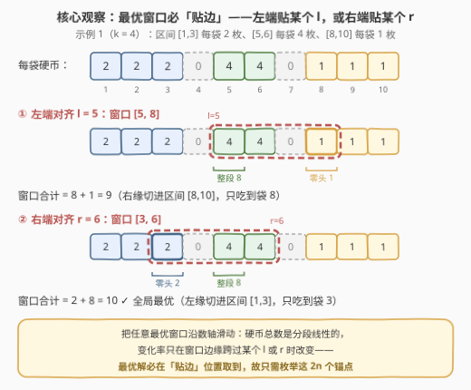
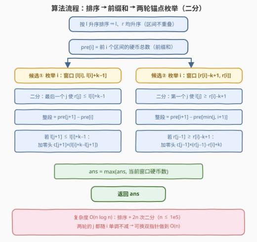

# LeetCode 收集连续K个袋子可以获得的最多硬币数量 题解

## 1. 题目概述

- **标题 / 题号**：收集连续K个袋子可以获得的最多硬币数量（#3413，medium）
- **链接**：https://leetcode.cn/problems/maximum-coins-from-k-consecutive-bags/
- **难度**：中等
- **标签**：贪心、排序、二分查找、前缀和

**题意**：数轴上有无限多个袋子（每个整数坐标一个），其中一些袋子装有硬币。给定二维数组 `coins`，其中 `coins[i] = [li, ri, ci]` 表示**从坐标 `li` 到 `ri` 的每个袋子**中都装有 `ci` 枚硬币；数组中的**区间互不重叠**。另给定整数 `k`，返回通过收集**连续 k 个袋子**（即某个长度为 k 的区间 `[s, s+k−1]` 内的所有袋子）可以获得的**最多**硬币数量。

**示例 1**：

```text
输入：coins = [[8,10,1],[1,3,2],[5,6,4]], k = 4
输出：10
解释：选择坐标为 [3, 4, 5, 6] 的袋子：2 + 0 + 4 + 4 = 10。
```

**示例 2**：

```text
输入：coins = [[1,10,3]], k = 2
输出：6
解释：选择坐标为 [1, 2] 的袋子：3 + 3 = 6。
```

**约束**：

- $1 \le \text{coins.length} \le 10^5$
- $1 \le k \le 10^9$
- $1 \le l_i \le r_i \le 10^9$，$1 \le c_i \le 1000$
- 给定的区间互不重叠

> 💡 **读题关键**：① 「连续 k 个袋子」= 数轴上一段长度为 k 的闭区间 $[s,\ s+k-1]$，起点 $s$ 任意（可以覆盖大片空袋区域）；② $k$ 与坐标都高达 $10^9$，**逐坐标枚举窗口不可行**，必须把候选窗口压到多项式个；③ 区间**互不重叠** ⇒ 按 $l$ 排序后 $l$、$r$ 双双单调——这是前缀和 + 二分的地基。

## 2. 解题思路

### 2.1 暴力思路

把每个袋子的硬币数展开成逐点数组，对每个可能的起点 $s$ 求窗口和：坐标范围 $10^9$，连数组都存不下。退一步做离散化：关键位置（各 $l_i$、$r_i$）只有 $O(n)$ 个，但窗口**起点**不必落在关键位置上，枚举所有「关键位置及其平移 $k$ 后的位置」也有 $O(n)$ 个候选；每个候选若老老实实逐袋求和是 $O(n)$，总计 $O(n^2) = 10^{10}$——仍然超时。**病根**：把「一段窗口的硬币总数」当成逐袋累加来算，而它天然可以分解为「若干**整段区间** + **至多一个零头**」，前者用前缀和 $O(1)$ 求出，后者一次乘法搞定。

### 2.2 核心观察：最优窗口必「贴边」，只需枚举 2n 个锚点

固定窗口长度 $k$，让窗口 $[s,\ s+k-1]$ 沿数轴滑动，硬币总数 $f(s)$ 是关于 $s$ 的**分段线性函数**——它的变化率（右缘进入的硬币密度 − 左缘离开的硬币密度）只在窗口边缘跨过某个 $l_i$ 或 $r_i$ 的瞬间改变。分段线性函数的最值总能在某个**断点**处取到，而断点对应的窗口形态恰好是：

> **结论**：存在最优窗口，其**左端点等于某个 $l_i$**，或**右端点等于某个 $r_i$**。候选起点只有 $2n$ 个：
> $s = l_i$（窗口 $[l_i,\ l_i+k-1]$）与 $s = r_i - k + 1$（窗口 $[r_i-k+1,\ r_i]$）。



（严格说断点还有「左缘刚离开某区间」($s = r_i+1$) 与「右缘刚够到某区间前一格」($s = l_i - k$) 两族，但它们分别被锚点 $l_{i+1}$ 与 $r_{i-1}$ 的候选**支配**：夹在中间的全是空袋，把窗口平移过去一分不亏，故可安全省略。）

剩下的任务是**快速计算一个候选窗口的硬币数**。区间互不重叠 ⇒ 按 $l$ 排序后 $l$、$r$ 均升序。预处理前缀和

$$\text{pre}[i] = \sum_{t < i} c_t \cdot (r_t - l_t + 1)$$

则任一窗口的硬币数 = **整段被窗口包含的区间**（前缀和相减）+ **至多一个被切开的区间**（零头，贡献 $= c \times$ 与窗口交集的长度）：

- 「至多一个」的原因：锚定一端后（如左端 $= l_i$），该端不可能切进任何区间——排在前面的区间都在 $l_i$ 之前结束；只有另一端可能切进恰好一个区间；
- 零头若切在窗口右缘，贡献 $c_{j+1}\,(l_i + k - l_{j+1})$；切在左缘，贡献 $c_{j-1}\,(r_{j-1} - r_i + k)$。

> 💡 一句话：**锚点把无穷多个窗口位置压缩成 $2n$ 个；前缀和把每个窗口的求和压缩成「一次二分 + 一次减法 + 一次乘法」**。两个压缩叠加，$10^9$ 级的搜索空间坍缩成 $O(n \log n)$ 的计算量。

### 2.3 算法流程



两轮枚举的细节（边界均已落实到代码）：

- **候选①（窗口 $[l_i,\ l_i+k-1]$）**：二分找**最后一个**满足 $r_j \le l_i + k - 1$ 的 $j$。整段部分 = $\text{pre}[j+1] - \text{pre}[i]$；若 $l_{j+1} \le l_i + k - 1$，再加右零头 $c_{j+1}(l_i + k - l_{j+1})$。
- **候选②（窗口 $[r_i-k+1,\ r_i]$）**：二分找**第一个**满足 $l_j \ge r_i - k + 1$ 的 $j$。整段部分 = $\text{pre}[i+1] - \text{pre}[\min(j,\ i+1)]$；若 $r_{j-1} \ge r_i - k + 1$，再加左零头 $c_{j-1}(r_{j-1} - r_i + k)$。

> ⚠️ **区间比 k 长的边界**：此时窗口整段落在某个区间**内部**。候选①中 $j = i-1$，整段部分为 0，右零头公式恰好退化为 $c_i \cdot k$；候选②中 $j = i+1$，`min(j, i+1)` 保证前缀和差非负，左零头同样退化为 $c_i \cdot k$。示例 2（区间 $[1,10]$，$k=2$）正是这一情形。

### 2.4 示例演算

对示例 1（排序后区间 $[1,3]\times 2$、$[5,6]\times 4$、$[8,10]\times 1$，$k = 4$）走一遍全部 6 个候选：

| 候选 | 窗口 | 整段部分 | 零头部分 | 合计 |
|------|------|----------|----------|------|
| ① $l_0 = 1$ | $[1, 4]$ | $[1,3]$ 全 $= 6$ | $[5,6]$ 未进窗 | 6 |
| ① $l_1 = 5$ | $[5, 8]$ | $[5,6]$ 全 $= 8$ | 袋 8 ∈ $[8,10]$：$1 \times 1$ | 9 |
| ① $l_2 = 8$ | $[8, 11]$ | $[8,10]$ 全 $= 3$ | 无 | 3 |
| ② $r_0 = 3$ | $[0, 3]$ | $[1,3]$ 全 $= 6$ | 左侧无区间 | 6 |
| ② $r_1 = 6$ | $[3, 6]$ | $[5,6]$ 全 $= 8$ | 袋 3 ∈ $[1,3]$：$2 \times 1$ | **10** ✓ |
| ② $r_2 = 10$ | $[7, 10]$ | $[8,10]$ 全 $= 3$ | $[5,6]$ 未进窗 | 3 |

答案 $= 10$，与示例一致。注意最优解 $[3,6]$ 恰是「右端贴 $r_1 = 6$」的锚点窗口，左缘切进 $[1,3]$ 只吃到尾袋 3。

## 3. 参考代码

### C++

```cpp
class Solution {
  public:
    long long maximumCoins(vector<vector<int>>& coins, int k) {
        sort(coins.begin(), coins.end());      // 按 l 升序；区间不重叠 ⇒ r 也升序
        int n = coins.size();
        vector<long long> L(n), R(n), C(n);
        vector<long long> pre(n + 1, 0);       // pre[i] = 前 i 个区间的硬币总数
        for (int i = 0; i < n; i++) {
            L[i] = coins[i][0];
            R[i] = coins[i][1];
            C[i] = coins[i][2];
            pre[i + 1] = pre[i] + C[i] * (R[i] - L[i] + 1);
        }

        long long ans = 0;
        // 候选①：窗口左端对齐 L[i]，即 [L[i], L[i]+k-1]
        for (int i = 0; i < n; i++) {
            long long e = L[i] + k - 1;        // 窗口右端，上界 2e9，必须 long long
            // 最后一个 j 满足 R[j] <= e（恒有 j >= i-1）
            int j = int(upper_bound(R.begin(), R.end(), e) - R.begin()) - 1;
            long long tot = (j >= i) ? pre[j + 1] - pre[i] : 0;   // 整段部分
            if (j + 1 < n && L[j + 1] <= e) {                     // 右零头
                tot += C[j + 1] * (e - L[j + 1] + 1);
            }
            ans = max(ans, tot);
        }
        // 候选②：窗口右端对齐 R[i]，即 [R[i]-k+1, R[i]]
        for (int i = 0; i < n; i++) {
            long long s = R[i] - k + 1;        // 窗口左端，可能 <= 0（伸进空区）
            // 第一个 j 满足 L[j] >= s（恒有 j <= i+1）
            int j = int(lower_bound(L.begin(), L.end(), s) - L.begin());
            long long tot = pre[i + 1] - pre[min(j, i + 1)];      // 整段部分
            if (j >= 1 && R[j - 1] >= s) {                        // 左零头
                tot += C[j - 1] * (R[j - 1] - s + 1);
            }
            ans = max(ans, tot);
        }
        return ans;
    }
};
```

### Python

```python
from bisect import bisect_left, bisect_right

class Solution:
    def maximumCoins(self, coins: List[List[int]], k: int) -> int:
        coins.sort()                          # 按 l 升序；区间不重叠 ⇒ r 也升序
        n = len(coins)
        L = [c[0] for c in coins]
        R = [c[1] for c in coins]
        C = [c[2] for c in coins]
        pre = [0] * (n + 1)                   # pre[i] = 前 i 个区间的硬币总数
        for i in range(n):
            pre[i + 1] = pre[i] + C[i] * (R[i] - L[i] + 1)

        ans = 0
        # 候选①：窗口左端对齐 L[i]，即 [L[i], L[i]+k-1]
        for i in range(n):
            e = L[i] + k - 1
            j = bisect_right(R, e) - 1        # 最后一个 R[j] <= e（j >= i-1）
            tot = pre[j + 1] - pre[i] if j >= i else 0
            if j + 1 < n and L[j + 1] <= e:   # 右零头
                tot += C[j + 1] * (e - L[j + 1] + 1)
            ans = max(ans, tot)
        # 候选②：窗口右端对齐 R[i]，即 [R[i]-k+1, R[i]]
        for i in range(n):
            s = R[i] - k + 1
            j = bisect_left(L, s)             # 第一个 L[j] >= s（j <= i+1）
            tot = pre[i + 1] - pre[min(j, i + 1)]
            if j >= 1 and R[j - 1] >= s:      # 左零头
                tot += C[j - 1] * (R[j - 1] - s + 1)
            ans = max(ans, tot)
        return ans
```

> 💡 **实现细节**：① 窗口端点 $l_i + k - 1$ 上界 $2 \times 10^9$、答案上界 $10^9 \times 1000 = 10^{12}$，C++ 中**窗口端点、前缀和、答案全程 `long long`**；② 两次二分分别作用在 `R`（找最后一个小等于）与 `L`（找第一个大等于）上，注意 `bisect_right(...) - 1` 与 `bisect_left` 的语义差；③ 候选②的 `min(j, i+1)` 防止「区间比 k 长」时前缀和差为负。

## 4. 复杂度分析

| 维度 | 复杂度 | 说明 |
|------|--------|------|
| 时间 | $O(n \log n)$ | 排序 $O(n \log n)$ + $2n$ 个候选各一次二分 $O(\log n)$ |
| 时间（可优化） | $O(n)$ | 两轮的 $j$ 均随 $i$ 单调不减，二分可换双指针（见第 5 节） |
| 空间 | $O(n)$ | `L` / `R` / `C` 数组与前缀和 |

实测：两个官方示例分别输出 10 / 6 ✓；与「逐位置滑窗」的暴力实现对拍随机数据（$n \le 6$、坐标 $\le 60$、$k \le 15$，共 8000 组）全部一致；$n = 10^5$、$k = 10^9$ 的极端构造用例 0.2s 内出解。

## 5. 扩展：双指针 O(n) 写法

两轮枚举中的 $j$ 都随 $i$ **单调不减**：$i$ 增大 ⇒ 查询端点 $l_i + k - 1$ 与 $r_i - k + 1$ 都右移 ⇒ 目标 $j$ 只会右移。于是二分可以换成双指针，排序成为唯一的 $O(n \log n)$ 环节：

```cpp
long long ans = 0;
// 候选①：j1 = 最后一个满足 R[j1] <= L[i]+k-1 的下标，随 i 单调不减
for (int i = 0, j1 = -1; i < n; i++) {
    long long e = L[i] + k - 1;
    while (j1 + 1 < n && R[j1 + 1] <= e) ++j1;   // R[i-1] < L[i] <= e ⇒ 循环后 j1 >= i-1
    long long tot = (j1 >= i) ? pre[j1 + 1] - pre[i] : 0;
    if (j1 + 1 < n && L[j1 + 1] <= e) tot += C[j1 + 1] * (e - L[j1 + 1] + 1);
    ans = max(ans, tot);
}
// 候选②：j2 = 第一个满足 L[j2] >= R[i]-k+1 的下标，随 i 单调不减
for (int i = 0, j2 = 0; i < n; i++) {
    long long s = R[i] - k + 1;
    while (j2 < n && L[j2] < s) ++j2;            // L[i+1] > R[i] >= s ⇒ 循环后 j2 <= i+1
    long long tot = pre[i + 1] - pre[min(j2, i + 1)];
    if (j2 >= 1 && R[j2 - 1] >= s) tot += C[j2 - 1] * (R[j2 - 1] - s + 1);
    ans = max(ans, tot);
}
```

两处 `while` 循环体的注释即不变式：它们保证双指针版本与二分版本在每个 $i$ 处算出**完全相同**的 $j$，正确性无需重新论证（已与暴力对拍验证）。面试中先写二分版（边界清晰、不易写错），再主动指出 $j$ 的单调性并给出双指针优化，是完整的加分路径。

## 6. 面试要点

1. **为什么最优窗口只需在 $2n$ 个「锚点」处考察？**

   - 固定 $k$ 后硬币总数 $f(s)$ 是 $s$ 的分段线性函数，断点仅出现在窗口边缘跨过某个 $l_i$ / $r_i$ 时；分段线性函数的最值可在断点取到。断点共四族（左缘贴 $l$、左缘离开 $r+1$、右缘够到 $l-1$、右缘贴 $r$），其中两族被贴邻锚点支配（中间全是空袋，平移不亏），最终只需「左端 $= l_i$」与「右端 $= r_i$」两族。

2. **一个候选窗口的硬币数怎么快速算？为什么零头至多一个？**

   - 锚定一端后（如左端 $= l_i$），该端不可能切进任何区间——更早的区间都在 $l_i$ 之前结束；只有另一端可能切进恰好一个区间。整段部分用前缀和相减 $O(1)$ 求出，零头是一次乘法；定位整段边界用一次二分。

3. **「区间互不重叠」这个条件用在了哪里？**

   - ① 按 $l$ 排序后 $r$ 也单调，两次二分的前提成立；② 窗口两端各自至多切进一个区间，零头至多一个（不重叠保证没有两个区间叠在同一位置）；③ 前缀和差能精确表示「连续若干整段」。若允许重叠，需改用差分/扫描线对每个坐标累积密度，是另一类做法。

4. **哪些量会溢出 `int`？**

   - 窗口端点 $l_i + k - 1$ 上界 $2 \times 10^9$（超 int32）；答案上界 = 袋子总数上界 $10^9$ × $c$ 上界 $1000 = 10^{12}$。C++ 中这两类量以及前缀和都要 `long long`；Python 无此问题。

5. **本题与「二分答案」类窗口题（如 2528）有何区别？**

   - 2528 是「给定预算/约束，验证长度为 k 的窗口能否满足」，对**答案值域**二分、每轮做可行性检查；本题是「在 $2n$ 个离散锚点上直接求最大值」，不需要二分答案——贪心枚举锚点即最优。识别「最值在事件点取到 ⇒ 枚举事件点」与「最值单调可验证 ⇒ 二分答案」是两类题的分水岭。

## 同类练习题

| # | 题目 | 与本题的关联 |
|---|------|-------------|
| 1838 | [最高频元素的频数](https://leetcode.cn/problems/frequency-of-the-most-frequent-element/) | 排序 + 滑动窗口 + 前缀和，同款「窗口内整段统计、边界零头单独算」的套路 |
| 2968 | [执行操作使频率分数最大](https://leetcode.cn/problems/apply-operations-to-maximize-frequency-score/) | 1838 的加强版，窗口 + 前缀和 + 中位数定位，强化「窗口贴事件点」的手感 |
| 2009 | [使数组连续的最少操作次数](https://leetcode.cn/problems/minimum-number-of-operations-to-make-array-continuous/) | 排序去重后滑窗找最长连续段，候选解同样只出现在关键位置 |
| 2528 | [最大化城市的最小供电站数](https://leetcode.cn/problems/maximize-the-minimum-powered-city/) | 「连续 k 个单位」的资源分配 + 二分答案，与本题互为镜像（验证型 vs 枚举型） |
| 1703 | [得到连续 K 个 1 的最少相邻交换次数](https://leetcode.cn/problems/minimum-adjacent-swaps-for-k-consecutive-ones/) | 把 1 聚成连续 k 个位置的中位数贪心，「连续 k 个位置」主题的经典变体 |
