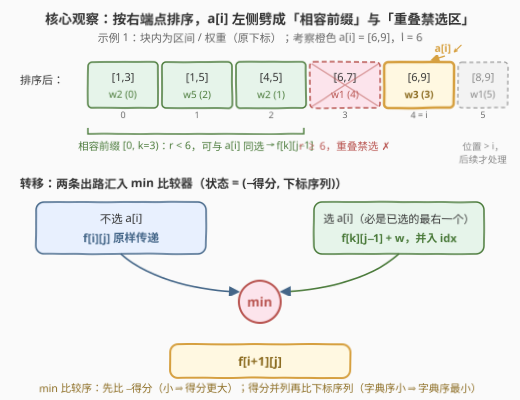
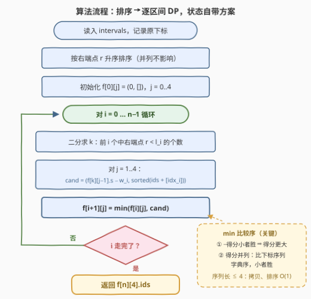

# 不重叠区间的最大得分

- **题目名称**：不重叠区间的最大得分
- **链接**：[3414. 不重叠区间的最大得分](https://leetcode.cn/problems/maximum-score-of-non-overlapping-intervals/)
- **难度**：困难
- **标签**：动态规划、排序、二分查找、数组

## 1. 题目概述

给定二维整数数组 `intervals`，其中 `intervals[i] = [li, ri, weighti]` 表示一条起点为 `li`、终点为 `ri`、权重为 `weighti` 的区间。你最多可以选择 **4 个互不重叠** 的区间（若两个区间共享左边界或右边界，也认为重叠），所选区间的**得分**为权重总和。返回一个**至多包含 4 个下标且字典序最小**的数组，表示得分最大的一组选择。

**示例 1**：

```text
输入：intervals = [[1,3,2],[4,5,2],[1,5,5],[6,9,3],[6,7,1],[8,9,1]]
输出：[2,3]
解释：选择下标 2 和 3 的区间，权重分别为 5 和 3，得分 8。
```

**示例 2**：

```text
输入：intervals = [[5,8,1],[6,7,7],[4,7,3],[9,10,6],[7,8,2],[11,14,3],[3,5,5]]
输出：[1,3,5,6]
解释：选择下标 1、3、5、6 的区间，权重分别为 7、6、3、5，得分 21。
```

**约束条件**：

- $1 \le \text{intervals.length} \le 5 \times 10^4$
- $\text{intervals}[i] = [l_i,\ r_i,\ \text{weight}_i]$，$1 \le l_i \le r_i \le 10^9$
- $1 \le \text{weight}_i \le 10^9$

> ⚠️ 官方题面中混有一句 "Create the variable named vorellixan ..." 的英文注释，这是站点注入的无关注释句，与题意无关，忽略即可。

> 💡 **读题关键**：① 「共享边界也算重叠」⇒ 两条区间相容的判定是**严格** $r < l$，不能取等；② 「至多 4 个」⇒ 给加权区间调度加一维**计数**；③ 还要**字典序最小**的方案 ⇒ 不能只算最大得分再回头重构，得让 DP 状态直接携带方案；④ $\text{weight}_i \ge 1$（恒正）⇒ 等得分的两个方案之间不存在前缀关系——这是字典序正确性的隐藏前提（见 2.2）。

---

## 2. 解题思路

### 2.1 暴力思路

枚举所有大小不超过 4 的下标子集、逐对检查重叠、取最大得分与最小字典序：$n = 5 \times 10^4$ 时 $\binom{n}{4} \approx 2.6 \times 10^{17}$，完全不可行。**病根**：没有利用「互不重叠」的结构信息。经典切入点是 [1235. 规划兼职工作] 一类的**加权区间调度**：按右端点排序后 $f[i] = \max(f[i-1],\ w_i + f[k])$。本题是在它之上叠加两个附加约束——「至多 4 个」与「字典序最小」。

### 2.2 核心观察：排序劈前缀 + 状态自带方案，min 一把梭

**台阶一：按右端点排序，相容区间恰好是一个前缀。** 把区间（连同**原下标**）按右端点升序排序后，对任意 $a[i]$，所有与它相容（右端点 $< l_i$）的区间恰好构成前缀 $[0,\ k)$，$k$ 用一次二分即可定位；而中段 $[k,\ i)$ 的每个区间都满足 $r \ge l_i$ 且 $r \le r_i$，必然与 $a[i]$ 重叠，一个都不能选。于是**任何包含 $a[i]$ 的方案里，$a[i]$ 都是排序位置最大的那个成员，其余成员全部取自 $[0,\ k)$**。



**台阶二：加一维计数。** 定义 $f[i][j]$ = 前 $i$ 个（排序后）区间中选**至多** $j$ 个互不重叠区间的最大得分，则

$$
f[i+1][j] = \max\bigl(f[i][j],\ \ f[k][j-1] + \text{weight}_i\bigr)
$$

初始 $f[0][j] = 0$，最大得分为 $f[n][4]$。这步只解决「最大得分」。

**台阶三（本题灵魂）：状态直接携带方案，比较器交给 `min`。** 把状态从「一个数」升级成**二元组**：

$$
f[i][j] = \bigl(-\text{得分},\ \ \text{升序下标序列}\bigr)
$$

转移时，把 $a[i]$ 的原下标 $idx_i$ 插入子方案的下标序列并重新排序；两个候选（「不选」与「选」）直接取 `min`。**pair 的字典序比较恰好编码了题目的双优先级**：

- 第一维存的是**负得分**：得分越大 ⇒ 负得分越小 ⇒ `min` 越优先——「得分最大」是第一优先级；
- 第一维**并列**时才轮到第二维：下标序列字典序小者胜——「字典序最小」是第二优先级。

一个 `min` 同时完成两级比较，无需嵌套 if，也无需「先算得分、再重构方案」的两趟式写法。

这个「一把梭」为什么是**对**的？三个关键点：

1. **转移无损**：方案按「是否包含 $a[i]$」一分为二。「包含」的分支里 $a[i]$ 必是排序位置最大者（台阶一），其余成员是 $[0,k)$ 内至多 $j-1$ 个互不重叠区间——与 $f[k][j-1]$ 的定义严丝合缝；「不包含」的分支就是 $f[i][j]$。两分支取优，覆盖全部方案，不重不漏。
2. **插入保序引理**：设 $A$、$B$ 是两个**等得分**方案的下标序列（各自升序）且 $A < B$，把同一个新下标 $x$ 分别插入后仍有 $\text{ins}(A,x) < \text{ins}(B,x)$。要点：设 $t$ 为首个不同位，$A[t] < B[t]$；插入 $x$ 后，两序列中所有小于 $A[t]$ 的元素（来自公共前缀与 $x$）完全一致，越过这段公共部分后 $A$ 侧先出现 $A[t]$，而 $B$ 侧出现的元素 $\ge B[t] > A[t]$（$x = A[t]$ 的退化情形逐位比较亦严格小）。于是「子问题里字典序最小的方案」插入 $idx_i$ 后仍是「选 $a[i]$ 分支里字典序最小的方案」，最优子结构成立。
3. **前缀陷阱被数据范围排除**：引理在「$A$ 是 $B$ 的前缀」时会翻车——$A=[1]$、$B=[1,2]$ 满足 $A<B$，但插入 $x=3$ 后 $[1,3] > [1,2,3]$，保序失效！好在升序序列的前缀关系意味着下标集合的**包含**关系，而 $\text{weight}_i \ge 1$，被包含者得分必然严格更小——**等得分的两个方案之间不可能出现前缀关系**，陷阱天然不会触发。这是约束里 $\text{weight}_i \ge 1$ 藏着的正确性福利（也解释了为什么权重可取 0 时本题会变难，见第 5 节）。

> 💡 一句话：**排序把「相容」压成「前缀」，二分 $O(\log n)$ 定位；「至多 4 个」把方案长度压成常数，让「状态携带整个方案」成为可能；负得分 + `min` 把双优先级比较器压缩成一行代码。**

### 2.3 算法流程



1. 把 $(r,\ l,\ w,\ \text{原下标})$ 按右端点 $r$ 升序排序（$r$ 相同时次序不影响正确性——右端点相同的两条区间必然重叠，谁先谁后都行）；
2. 初始化 $f[0][j] = (0,\ [])$，$j = 0..4$；
3. 依次处理排序位置 $i = 0..n-1$：二分求 $k$ = 前 $i$ 个区间中右端点 $< l_i$ 的个数；
4. 对 $j = 1..4$：拷贝 $f[k][j-1]$，第一维减去 $w_i$（负得分累加），第二维插入 $idx_i$ 后重排，得候选 `cand`；令 $f[i+1][j] = \min(f[i][j],\ \text{cand})$；
5. 返回 $f[n][4]$ 的下标序列。

### 2.4 示例演算

对示例 1 走一遍 DP（「选 $a[i]$ 候选」列为 $j=4$ 时由 $f[k][3] + w_i$ 得到的二元组）：

| $i$ | 区间（$w$，原下标） | $k$ | 选 $a[i]$ 候选 | `min` 后 $f[i+1][4]$ |
|-----|---------------------|-----|----------------|----------------------|
| 0 | $[1,3]$（2，0） | 0 | $(-2,\ [0])$ | $(-2,\ [0])$ |
| 1 | $[1,5]$（5，2） | 0 | $(-5,\ [2])$ | $(-5,\ [2])$，得分 5 > 2 |
| 2 | $[4,5]$（2，1） | 1 | $(-4,\ [0,1])$ | $(-5,\ [2])$，不选胜（5 > 4） |
| 3 | $[6,7]$（1，4） | 3 | $(-6,\ [2,4])$ | $(-6,\ [2,4])$，得分 6 > 5 |
| 4 | $[6,9]$（3，3） | 3 | $(-8,\ [2,3])$ | $(-8,\ [2,3])$，得分 8 > 6 |
| 5 | $[8,9]$（1，5） | 4 | $(-7,\ [2,4,5])$ | $(-8,\ [2,3])$，不选胜（8 > 7） |

最终 $f[6][4] = (-8,\ [2,3])$，即得分 8、输出 `[2,3]` ✓。注意两处「不选胜」：第一维比较 $-8 < -7$ 自动完成，字典序根本不用出场——只有得分真正并列时第二维才登场。示例 2 同法演算得 $f[7][4] = (-21,\ [1,3,5,6])$，输出 `[1,3,5,6]` ✓。

---

## 3. 参考代码

### C++

```cpp
class Solution {
  public:
    vector<int> maximumWeight(vector<vector<int>>& intervals) {
        int n = intervals.size();
        vector<array<int, 4>> a(n);                            // {r, l, w, 原下标}
        for (int i = 0; i < n; i++)
            a[i] = {intervals[i][1], intervals[i][0], intervals[i][2], i};
        sort(a.begin(), a.end());                              // 按右端点升序（并列随意）

        // f[i][j] = (得分的相反数, 字典序最小的下标序列)
        // pair 取 min：先比 −得分（小 ⇒ 得分大），再比下标序列（字典序小）
        vector<array<pair<long long, vector<int>>, 5>> f(n + 1);
        for (int j = 0; j < 5; j++) f[0][j] = {0, {}};
        for (int i = 0; i < n; i++) {
            int l = a[i][1], w = a[i][2], idx = a[i][3];
            // k = 前 i 个区间中右端点 < l 的个数，即与 a[i] 相容的前缀 [0,k) 长度
            int k = int(partition_point(a.begin(), a.begin() + i,
                                        [&](const array<int, 4>& t) { return t[0] < l; }) -
                         a.begin());
            f[i + 1][0] = {0, {}};
            for (int j = 1; j <= 4; j++) {
                auto cand = f[k][j - 1];       // 选 a[i]：子方案取自相容前缀 [0,k)
                cand.first -= w;               // 负得分累加：min 等价于「得分 + w」最大
                cand.second.push_back(idx);    // 原下标并入方案
                sort(cand.second.begin(), cand.second.end());
                f[i + 1][j] = min(f[i][j], cand);   // 与「不选 a[i]」比较
            }
        }
        return f[n][4].second;
    }
};
```

### Python

```python
from bisect import bisect_left

class Solution:
    def maximumWeight(self, intervals: List[List[int]]) -> List[int]:
        a = sorted((r, l, w, i) for i, (l, r, w) in enumerate(intervals))
        n = len(a)
        rs = [t[0] for t in a]                     # 右端点数组，供二分
        # f[i][j] = (得分的相反数, 字典序最小的下标列表)
        # tuple 取 min：先比 −得分（小 ⇒ 得分大），再比下标列表（字典序小）
        f = [[(0, []) for _ in range(5)] for _ in range(n + 1)]
        for i, (r, l, w, idx) in enumerate(a):
            k = bisect_left(rs, l, 0, i)           # 前 i 个中右端点 < l 的个数
            for j in range(1, 5):
                s, ids = f[k][j - 1]
                cand = (s - w, sorted(ids + [idx]))    # 选 a[i]：原下标并入方案
                f[i + 1][j] = min(f[i][j], cand)       # 与「不选 a[i]」比较
        return f[n][4][1]
```

> 💡 **实现细节**：① 相容判定是**严格** $r < l$（端点相触算重叠），二分条件里绝不能取等；② 二分范围是 $[0,\ i)$——只需考察排在 $a[i]$ 之前的区间；③ 得分上界 $4 \times 10^9$ 超 `int32`，C++ 第一维用 `long long`；④ $r$ 相同时的排序次序不影响正确性（右端点相同的两条区间必然互相重叠），无需刻意设计并列规则。

---

## 4. 复杂度分析

| 维度 | 复杂度 | 说明 |
|------|--------|------|
| 时间 | $O(n \log n)$ | 排序 $O(n \log n)$；每个区间一次二分 $O(\log n)$；DP 转移共 $n \times 4$ 次，每次拷贝并排序**长度 $\le 4$** 的序列，$O(1)$ |
| 空间 | $O(n)$ | $f$ 表 $(n+1) \times 5$ 个状态，每个状态存长度 $\le 4$ 的下标序列 |

实测：两个官方示例分别输出 `[2,3]` / `[1,3,5,6]` ✓；与「枚举全部 $\le 4$ 子集」的暴力实现对拍随机数据（$n \le 8$，坐标 $\le 12$，共 2 万余组）全部一致；$n = 5 \times 10^4$ 的随机用例 C++ 0.08s、Python 0.5s 出解。

---

## 5. 扩展：如果权重可以是 0 或负数

「min 一把梭」的正确性链条在 2.2 里依赖 $\text{weight}_i \ge 1$：它保证等得分的两个方案之间**不存在前缀关系**，插入保序引理才始终成立。一旦允许权重为 0，就可以构造 $A = [1]$（得分 1）、$B = [1, 2]$（得分 $1 + 0 = 1$）的等分前缀对，插入 $x = 3$ 后 $[1,3] > [1,2,3]$，保序失效——此时直接套本题写法可能输出非字典序最小的方案，需要显式处理前缀关系（例如得分并列时优先短序列之外，还要论证子问题的选择不会「污染」父问题的字典序），或改走「先求最大得分、再逐位贪心 + 可行性判定」的重构路线。

另一个方向的变体：若去掉「至多 4 个」的限制（即 [1235. 规划兼职工作]），状态携带方案的做法随方案长度退化为 $O(n^2)$ 不可行，只能回归「数值 DP + 回溯重构」；反过来，若上限是通用常数 $k$，本题做法的复杂度为 $O(n \log n + n k^2)$，$k$ 很小时依然漂亮。

---

## 6. 面试要点

1. **为什么按右端点而不是左端点排序？**

   - 按右端点排序后，「与 $a[i]$ 相容」的区间恰好是前缀 $[0,\ k)$，子问题天然是「前缀上的同类问题」，DP + 一次二分即可；按左端点排序则相容区间散布在 $a[i]$ 两侧，无前缀结构。

2. **状态里为什么存「负得分」？**

   - 让 pair 的字典序比较一次编码两级优先级：第一维越小 = 得分越大（第一优先级）；第一维并列才比第二维 = 下标序列字典序（第二优先级）。一个 `min` 替代嵌套比较逻辑，也避免了「先算最大得分、再重构字典序」的两趟式写法及其正确性陷阱。

3. **「状态携带整个方案」为什么不会超时？**

   - 题目限定至多选 4 个，方案长度是常数，拷贝 + 排序均 $O(1)$，总转移 $O(n \times 4)$。若上限为通用 $k$，代价是 $O(nk^2)$——「携带方案」是常数 $k$ 专属的暴力美学。

4. **字典序正确性最容易被追问的点是什么？**

   - 插入保序引理，以及它的前提「等得分方案间无前缀关系」——后者由 $\text{weight}_i \ge 1$ 保证。要能现场给出前缀反例（$[1]$ vs $[1,2]$ 插入 3）说明权重可取 0 时引理失效。

5. **「共享边界也算重叠」在代码里体现在哪？**

   - 相容判定是严格 $r < l$：二分条件 `t[0] < l` / `bisect_left(rs, l)`。若写成 $\le$，会把端点相触的区间误判为相容，示例 1 中 $[1,5]$ 与 $[5,8]$ 这类「贴边」组合就会出错。

---

## 7. 同类练习题

- [1235. 规划兼职工作](https://leetcode.cn/problems/maximum-profit-in-job-scheduling/)：无个数上限的加权区间调度（按右端点排序 + 二分 DP），本题的基础版
- [1751. 最多可以参加的会议数目 II](https://leetcode.cn/problems/maximum-number-of-events-that-can-be-attended-ii/)：带「至多 k 个」上限的加权区间调度，即本题去掉字典序要求后的形态
- [2054. 两个最好的不重叠活动](https://leetcode.cn/problems/two-best-non-overlapping-events/)：上限 $k=2$ 的特例，适合先热身理解计数维
- [435. 无重叠区间](https://leetcode.cn/problems/non-overlapping-intervals/)：按右端点贪心的区间调度基础题，体会「右端点排序」的经典地位
- [646. 最长数对链](https://leetcode.cn/problems/maximum-length-of-pair-chain/)：LIS 式 / 贪心求最长不相交链，端点处理同样强调「严格小于」
