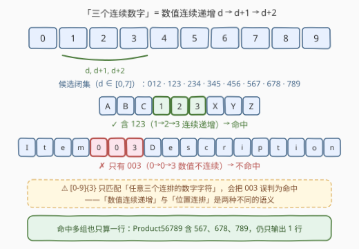
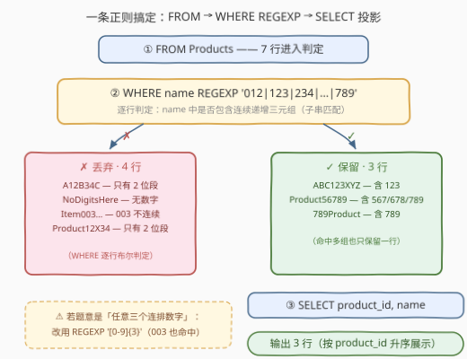

# LeetCode 查找具有三个连续数字的产品 题解

## 1. 题目概述

- **标题 / 题号**：查找具有三个连续数字的产品（#3415，easy）
- **链接**：https://leetcode.cn/problems/find-products-with-three-consecutive-digits/
- **难度**：简单
- **标签**：数据库、SQL、`REGEXP` 正则、字符串匹配、单表查询

> ⚠️ 本题为 LeetCode 付费题，题意描述根据官方示例用例与 hints 重建，可能与官方题面有出入。

**题意**：给定 `Products`（产品）表，编写 SQL 查询，找出所有**产品名中包含三个连续数字**的产品。此处「三个连续数字」指**数值上连续递增**的三位数字 $d,\ d+1,\ d+2$（如 `123`、`456`、`789`），而非任意三个连排的数字字符（`003` 这类**不算**命中）。返回这些产品的 `product_id` 和 `name`，以任意顺序返回均可。

**表结构**：

```text
Table: Products
+-------------+---------+
| Column Name | Type    |
+-------------+---------+
| product_id  | int     |  ← 主键
| name        | varchar |
+-------------+---------+
```

在 SQL 中，`product_id` 是该表的主键，`name` 由英文字母与数字组成。

**示例 1**：

```text
输入：
Products 表:
+------------+---------------------+
| product_id | name                |
+------------+---------------------+
| 1          | ABC123XYZ           |
| 2          | A12B34C             |
| 3          | Product56789        |
| 4          | NoDigitsHere        |
| 5          | 789Product          |
| 6          | Item003Description  |
| 7          | Product12X34        |
+------------+---------------------+

输出：
+------------+--------------+
| product_id | name         |
+------------+--------------+
| 1          | ABC123XYZ    |
| 3          | Product56789 |
| 5          | 789Product   |
+------------+--------------+
```

**解释**：

| product_id | name | name 中的数字段 | 判定 |
|---|---|---|---|
| 1 | `ABC123XYZ` | `123`（1→2→3 连续递增） | ✓ 命中 |
| 2 | `A12B34C` | `12`、`34`（长度不足 3） | ✗ |
| 3 | `Product56789` | `56789`（含 567/678/789） | ✓ 命中 |
| 4 | `NoDigitsHere` | 无数字 | ✗ |
| 5 | `789Product` | `789`（7→8→9 连续递增） | ✓ 命中 |
| 6 | `Item003Description` | `003`（0→0→3 **不连续**） | ✗ |
| 7 | `Product12X34` | `12`、`34`（长度不足 3） | ✗ |

**约束条件**（按示例重建）：

- `product_id` 是 `Products` 表的主键。
- `name` 由英文字母和数字组成。
- 「三个连续数字」指数值上连续递增（$d, d+1, d+2$），候选仅 `012`、`123`、…、`789` 共 8 组。

> 💡 **读题关键**：本题最大的坑在「连续」二字——`Item003Description` 中的 `003` 是三个**连排**的数字字符，但 `0→0→3` 数值上**不连续**，不应命中。若把它判为命中，说明把题意理解成了「任意三个数字字符」（`[0-9]{3}`），这正是官方用例特意设下的分水岭。

## 2. 解题思路

### 2.1 暴力思路：拉到应用层逐串扫描，或 8 个 `LIKE` 硬枚举

最直觉的过程式思路：把 `Products` 全表拉到应用层，对每个 `name` 枚举所有长度为 3 的子串，逐一检查是否满足 $c_2 = c_1 + 1$ 且 $c_3 = c_2 + 1$：

```text
for row in Products:
    s = row.name
    for i in range(len(s) - 2):
        if s[i+1] == s[i]+1 and s[i+2] == s[i+1]+1:
            result.append(row)
            break
```

逻辑正确，但**把本可下推到数据库的过滤甩给了应用层**：全量拉取 `name` 文本、网络往返、逐字符循环，样样都是开销。纯 SQL 里也有个「朴素」版本——8 个 `LIKE` 模式用 `OR` 串起来：

```sql
WHERE name LIKE '%012%' OR name LIKE '%123%' OR ... OR name LIKE '%789%'
```

可行但冗长（8 个条件手写极易漏一个），且本质上是把正则该干的事用手工枚举重做了一遍。

### 2.2 核心观察：候选是 8 组字面量，一条 `REGEXP` 交替搞定



关键在于**识别出「连续递增三元组」是一个封闭的小集合**：

1. 数字字符只有 0–9 共十个，起点 $d$ 满足 $d + 2 \le 9$，即 $d \in [0, 7]$——候选三元组**只有 8 组**：`012 123 234 345 456 567 678 789`；
2. 判定「`name` 是否**包含**其中任意一组」是典型的**子串匹配**问题，一条正则**交替（alternation）**即可表达：

   ```sql
   name REGEXP '012|123|234|345|456|567|678|789'
   ```

3. **不必追求「相邻字符差 1」的通用正则**——正则的本质是字符集匹配 + 位置结构，表达不了「下一个字符 = 当前字符 + 1」这种**字符码算术**（MySQL 8.0 的 ICU 引擎连反向引用都不支持）。既然候选集是闭集，直接枚举字面量就是最简洁、最正确的写法。

> ⚠️ **两个易错点**：
> - **别写成 `[0-9]{3}`**：它匹配「任意三个连排的数字字符」，会把 `003` 误判为命中（`Item003Description` 不该出现在结果里）。这是本题最核心的区分点。
> - **别漏 `012`**：0、1、2 数值上连续，按「连续数字」的字面语义应算命中；示例数据未覆盖该边界，但把它写进正则没有任何代价。

### 2.3 算法流程图



**逻辑执行步骤**：

| 步骤 | 子句 | 作用 | 本题对应 |
|------|------|------|----------|
| ① | `FROM Products` | 读取全部产品行 | 7 行进入判定 |
| ② | `WHERE name REGEXP '012\|123\|…\|789'` | 逐行做子串匹配并过滤 | 命中 3 行，丢弃 4 行 |
| ③ | `SELECT product_id, name` | 投影输出列 | 输出 3 行结果 |

> 💡 **SQL 子句执行顺序**：`FROM` → `WHERE` → `GROUP BY` → `HAVING` → `SELECT` → `ORDER BY`。`WHERE` 先于 `SELECT` 执行，过滤时 `name` 列尚未被投影掉，正则可以直接引用它——这也是 `WHERE` 能引用「不在 `SELECT` 中的列」的原因。

### 2.4 示例演算

以示例 1 的 7 行数据走一遍「匹配 → 过滤 → 投影」。

**步骤 ①②：FROM + WHERE（逐行正则匹配）**

| product_id | name | 最长数字段 | 含连续递增三元组？ | 是否保留 |
|---|---|---|---|---|
| 1 | `ABC123XYZ` | `123` | 是（`123`） | 保留 |
| 2 | `A12B34C` | `12` | 否 | 丢弃 |
| 3 | `Product56789` | `56789` | 是（`567`/`678`/`789`） | 保留 |
| 4 | `NoDigitsHere` | — | 否 | 丢弃 |
| 5 | `789Product` | `789` | 是（`789`） | 保留 |
| 6 | `Item003Description` | `003` | 否（0→0→3 不连续） | 丢弃 |
| 7 | `Product12X34` | `12` | 否 | 丢弃 |

> 💡 `Product56789` 同时命中 `567`、`678`、`789` 三组候选，但 `WHERE` 对每行只做**一次布尔判定**（命中/不命中），命中多处也只保留一行。

**步骤 ③：SELECT product_id, name（投影输出）**

| product_id | name |
|---|---|
| 1 | ABC123XYZ |
| 3 | Product56789 |
| 5 | 789Product |

## 3. 参考代码

### SQL（解法 A：`REGEXP` 交替，推荐）

```sql
SELECT product_id, name
FROM Products
WHERE name REGEXP '012|123|234|345|456|567|678|789';
```

> 💡 **写法要点**：
> - **`REGEXP`** 是 `RLIKE` 的同义词，MySQL 8.0 起底层为 ICU 引擎，`|` 交替语义与 POSIX 一致；
> - 匹配是**子串语义**，不需要 `^`/`$` 锚定，任意位置命中即可；
> - 若判题要求按 `product_id` 升序输出，补一句 `ORDER BY product_id` 即可（结果顺序不作要求时可省略）。

### SQL（解法 B：`LIKE` 枚举，无正则引擎时备用）

```sql
SELECT product_id, name
FROM Products
WHERE name LIKE '%012%' OR name LIKE '%123%' OR name LIKE '%234%'
   OR name LIKE '%345%' OR name LIKE '%456%' OR name LIKE '%567%'
   OR name LIKE '%678%' OR name LIKE '%789%';
```

> 💡 **解法 B 的取舍**：与解法 A 逻辑完全等价（8 个字面量的子串包含判断），但 8 个 `OR` 冗长易错。它的价值在**可移植性**——`LIKE` 是 SQL 标准，任何引擎都支持；而 `REGEXP` 是 MySQL 方言（PostgreSQL 用 `~`，SQL Server 则只能靠 `LIKE` 拼凑）。

### SQL（解法 C：`REGEXP_LIKE` 函数式写法）

```sql
SELECT product_id, name
FROM Products
WHERE REGEXP_LIKE(name, '012|123|234|345|456|567|678|789');
```

> 💡 **解法 C 使用 `REGEXP_LIKE(name, pattern)`**：MySQL 8.0+ 提供的函数式正则接口，与 `expr REGEXP pattern` 运算符完全等价，写法更函数化、便于与其它函数组合（如 `NOT REGEXP_LIKE(...)` 取反更直观），且与 Oracle 同名函数兼容。

### Python（pandas）

```python
import pandas as pd

def find_products(products: pd.DataFrame) -> pd.DataFrame:
    pat = r'012|123|234|345|456|567|678|789'
    return products[products['name'].str.contains(pat, regex=True)]
```

> 💡 **pandas 对照**：`.str.contains(pat, regex=True)` 对应 SQL 的 `name REGEXP pat`，布尔索引对应 `WHERE` 过滤。`str.contains` 默认 `regex=True`，显式写出更清晰；若列中可能含缺失值需加 `na=False`（本题约束无缺失）。函数名按题意重建，实际以题目骨架为准。

## 4. 复杂度分析

| 维度 | 复杂度 | 说明 |
|------|--------|------|
| 时间 | $O(n \cdot L)$ | $n$ 为行数，$L$ 为 `name` 平均长度；每行做一次正则扫描 |
| 空间 | $O(k)$ | $k$ 为命中行数（输出结果集大小），无额外中间结构 |

> 💡 **关于 8 分支交替的开销**：并非「8 次全扫描」——正则引擎对字面量交替会按首字符分类剪枝（类似单字符字典树），单行匹配最坏仍为 $O(L)$；与解法 B 的 8 个 `LIKE` 只有常数级差异，本题规模下可忽略。`REGEXP` 与前导通配符 `LIKE '%…%'` 均为**非 SARGable** 谓词，无法利用普通索引，只能全表扫描逐行匹配。

## 5. 扩展：变体与提取

### 5.1 变体：「任意三个数字字符」

若题意放宽为「`name` 中出现三个连排的数字字符」（不要求数值连续），正则换成字符类 + 量词即可：

```sql
WHERE name REGEXP '[0-9]{3}'    -- 此时 003 也命中，Item003Description 会被保留
```

两种语义只差一条正则，但 `003` 一行的去留截然相反——审题时务必确认「连续」指**数值递增**还是**位置连排**。

### 5.2 提取：命中的具体是哪一段

若要求**输出命中的那个三元组**（而不只是布尔判定），MySQL 8.0+ 可用 `REGEXP_SUBSTR`：

```sql
SELECT product_id, name,
       REGEXP_SUBSTR(name, '012|123|234|345|456|567|678|789') AS hit
FROM Products
WHERE name REGEXP '012|123|234|345|456|567|678|789';
```

`Product56789` 会返回**第一处**命中的 `567`（正则自左向右扫描）。

### 5.3 为什么写不出「相邻差 1」的通用正则

「下一个字符 = 当前字符 + 1」是**字符码算术关系**，而正则表达式的本质是**字符集匹配 + 位置结构**，不擅长跨字符的数值比较。MySQL 的 ICU 引擎不支持反向引用（`\1`）；即便支持（如 PCRE），「$c \to c{+}1$」也不是反向引用能表达的关系——反向引用表达的是「重复此前匹配到的内容」，而非字符间的算术递推。**当匹配目标是有限闭集时，枚举字面量就是最正确的正则写法**，这也是本题想传达的核心技巧。

## 6. 面试要点

- **Q1：为什么不能直接用 `[0-9]{3}`？**
  答：`[0-9]{3}` 匹配「任意三个连排的数字字符」，语义是**位置连排**；本题要求**数值连续递增**（$d, d+1, d+2$）。`003` 命中前者但不命中后者——这类「看似都能匹配、实则语义不同」的边界用例正是审题能力的试金石。
- **Q2：候选三元组为什么是 8 组？`012` 算不算？**
  答：起点 $d$ 满足 $d+2 \le 9$，故 $d \in [0,7]$，共 8 组（`012`…`789`）。0、1、2 数值上连续，按「连续数字」的字面语义应当算；示例未覆盖此边界，但把它纳入正则零成本，宁可多备一组。
- **Q3：`REGEXP` 和 `LIKE '%…%'` 该选哪个？**
  答：本题两者等价（8 个字面量子串包含的判断）。`LIKE` 是 SQL 标准、可移植性最好；`REGEXP` 表达力强，一条交替分支顶 8 个 `OR`。模式简单或引擎不支持正则时用 `LIKE`，模式含字符类/量词/交替时用 `REGEXP`。
- **Q4：这个谓词能走索引吗？**
  答：不能。`REGEXP` 与前导通配符 `LIKE '%…%'` 都是非 SARGable 谓词，优化器只能全表扫描逐行匹配。若产品表很大且该查询高频，可考虑冗余一列布尔标记 `has_consecutive_digits`（写入时预计算）并建索引，或由应用层/触发器维护。
- **Q5：`Product56789` 命中了 3 组候选，会输出 3 行吗？**
  答：不会。`WHERE` 对每行只做一次布尔判定，与命中几处无关。只有当采用「`JOIN` 一个 8 行候选表做 `LIKE` 匹配」的写法时，一行才可能匹配多组，那时需要 `DISTINCT` 去重；直接 `REGEXP` 过滤天然无此问题。

## 同类练习题

| # | 题目 | 与本题的关联 |
|---|------|-------------|
| 1517 | [查找拥有有效邮箱的用户](https://leetcode.cn/problems/find-users-with-valid-e-mails/)（[题解](../1501-1600/1517_查找拥有有效邮箱的用户.md)） | 同为字符串列 `REGEXP` 过滤，考察字符类 + 量词 + 锚点的组合 |
| 1527 | [患某种疾病的患者](https://leetcode.cn/problems/patients-with-a-condition/)（[题解](../1501-1600/1527_患某种疾病的患者.md)） | `LIKE '%DIAB1%'` 通配符匹配，与本题的 `LIKE` 枚举解法同源 |
| 1683 | [无效的推文](https://leetcode.cn/problems/invalid-tweets/)（[题解](../1601-1700/1683_无效的推文.md)） | 同为单表字符串谓词过滤，考察 `CHAR_LENGTH` 长度度量，与本题「模式匹配」形成度量 vs 匹配的对照 |
| 1667 | [修复表中的名字](https://leetcode.cn/problems/fix-names-in-a-table/)（[题解](../1601-1700/1667_修复表中的名字.md)） | `CONCAT`/`UPPER`/`LOWER` 字符串函数变换，与本题的过滤方向互补（改值 vs 筛行） |
| 2292 | [连续两年有3个及以上订单的产品](https://leetcode.cn/problems/products-with-three-or-more-orders-in-two-consecutive-years/)（[题解](../2201-2300/2292_连续两年有3个及以上订单的产品.md)） | 同为 Products 表上的「连续」语义，但连续性在**行间**（年份）而非**字符串内**，解法思路完全不同 |
